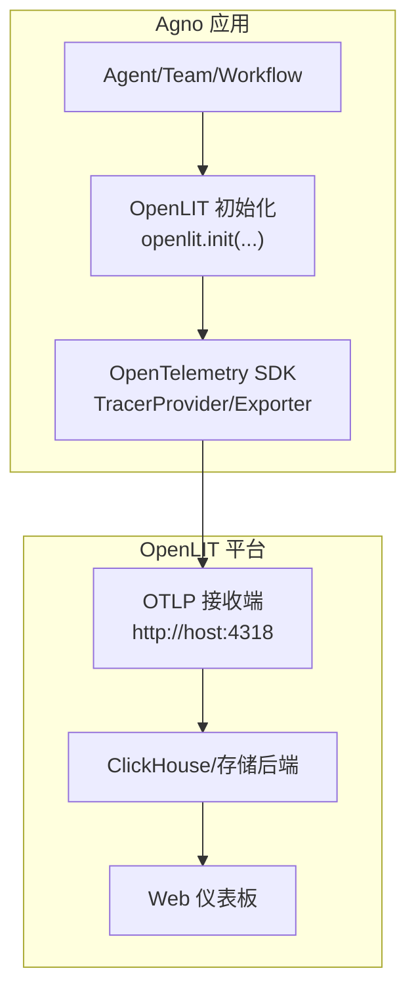
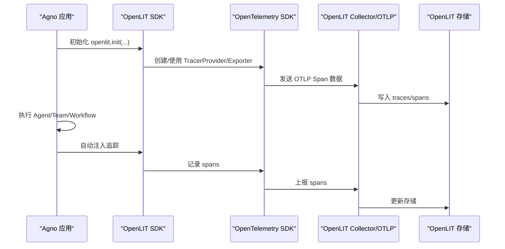
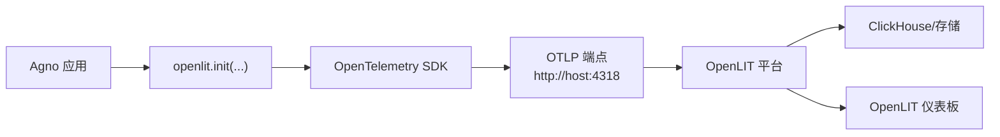

# OpenLIT 集成

<cite>
**本文引用的文件**
- [observability/openlit.mdx](file://observability/openlit.mdx)
- [examples/integrations/observability/langfuse-via-openlit.mdx](file://examples/integrations/observability/langfuse-via-openlit.mdx)
- [agent-os/tracing/overview.mdx](file://agent-os/tracing/overview.mdx)
- [tracing/overview.mdx](file://tracing/overview.mdx)
- [tracing/basic-setup.mdx](file://tracing/basic-setup.mdx)
- [examples/integrations/observability/overview.mdx](file://examples/integrations/observability/overview.mdx)
- [deploy/templates/aws/configure/env-vars.mdx](file://deploy/templates/aws/configure/env-vars.mdx)
- [production/templates/customize-aws/env-vars.mdx](file://production/templates/customize-aws/env-vars.mdx)
- [TBD/pages/templates/infra-management/env-vars.mdx](file://TBD/pages/templates/infra-management/env-vars.mdx)
- [faq/environment-variables.mdx](file://faq/environment-variables.mdx)
- [teams/debugging-teams.mdx](file://teams/debugging-teams.mdx)
- [deploy/templates/aws/manage/troubleshooting.mdx](file://deploy/templates/aws/manage/troubleshooting.mdx)
</cite>

## 目录
1. [简介](#简介)
2. [项目结构](#项目结构)
3. [核心组件](#核心组件)
4. [架构总览](#架构总览)
5. [详细组件分析](#详细组件分析)
6. [依赖关系分析](#依赖关系分析)
7. [性能考量](#性能考量)
8. [故障排除指南](#故障排除指南)
9. [结论](#结论)
10. [附录](#附录)

## 简介
本实施文档面向在 Agno 中集成 OpenLIT（OpenTelemetry 原生的开源可观测性平台）的工程团队，系统讲解如何通过 OpenTelemetry 协议将 Agno 代理、团队与工作流的执行链路自动注入并上报至 OpenLIT，从而获得完整的链式追踪、性能监控与成本分析能力。文档覆盖：
- OpenLIT 与 OpenTelemetry 的兼容性与数据格式
- 初始化与环境变量配置
- 多场景示例：基础代理、多代理团队、自定义 Tracer
- 与 Langfuse 等其他平台的互通方式
- 部署与监控仪表板使用要点
- 故障排除与性能优化建议

## 项目结构
围绕 OpenLIT 集成，仓库中与之直接相关的内容主要分布在以下位置：
- 观测性与集成指南：observability/openlit.mdx
- 通过 OpenLIT 发送至 Langfuse 的示例：examples/integrations/observability/langfuse-via-openlit.mdx
- AgentOS 与通用 Tracing 概念：agent-os/tracing/overview.mdx、tracing/overview.mdx、tracing/basic-setup.mdx
- 环境变量参考与部署模板：deploy/templates/aws/configure/env-vars.mdx、production/templates/customize-aws/env-vars.mdx、TBD/pages/templates/infra-management/env-vars.mdx
- 环境变量设置指引：faq/environment-variables.mdx
- 调试与排错：teams/debugging-teams.mdx、deploy/templates/aws/manage/troubleshooting.mdx
- 示例索引：examples/integrations/observability/overview.mdx

图表来源
- [observability/openlit.mdx:52-192](file://observability/openlit.mdx#L52-L192)
- [examples/integrations/observability/langfuse-via-openlit.mdx:1-94](file://examples/integrations/observability/langfuse-via-openlit.mdx#L1-L94)

章节来源
- [observability/openlit.mdx:6-31](file://observability/openlit.mdx#L6-L31)
- [examples/integrations/observability/overview.mdx:1-27](file://examples/integrations/observability/overview.mdx#L1-L27)

## 核心组件
- OpenLIT 平台：自托管、基于 OpenTelemetry 的可观测性平台，支持 OTLP 协议接收 traces/spans，并提供可视化仪表板。
- OpenLIT SDK：通过 openlit.init(...) 进行初始化，可指定 OTLP 端点、Tracer、批处理开关等参数。
- OpenTelemetry SDK：TracerProvider、SpanProcessor、OTLPSpanExporter 等，用于构建自定义 Tracer 并导出到 OpenLIT。
- Agno 集成：在应用启动阶段调用 openlit.init(...)，即可对所有 Agno 代理运行、模型调用、工具调用进行自动追踪。

章节来源
- [observability/openlit.mdx:52-257](file://observability/openlit.mdx#L52-L257)
- [examples/integrations/observability/langfuse-via-openlit.mdx:1-94](file://examples/integrations/observability/langfuse-via-openlit.mdx#L1-L94)

## 架构总览
下图展示了从 Agno 应用到 OpenLIT 的完整链路：应用侧通过 openlit.init(...) 或自定义 OpenTelemetry Tracer 将 spans 导出到 OpenLIT 的 OTLP 端点，OpenLIT 存储并渲染为可读的 Trace 视图。

图表来源
- [observability/openlit.mdx:52-192](file://observability/openlit.mdx#L52-L192)
- [examples/integrations/observability/langfuse-via-openlit.mdx:1-94](file://examples/integrations/observability/langfuse-via-openlit.mdx#L1-L94)

## 详细组件分析

### 组件一：OpenLIT 初始化与环境变量
- 安装依赖：确保安装 agno、openai、openlit。
- 部署 OpenLIT：可通过 Docker 快速启动；生产可采用 Helm/Kubernetes 或复用现有 ClickHouse/OpenTelemetry 基础设施。
- 环境变量：OTEL_EXPORTER_OTLP_ENDPOINT 指向 OpenLIT 的 OTLP 地址；若需鉴权，可通过 OTEL_EXPORTER_OTLP_HEADERS 设置。
- 初始化方式：
  - 直接初始化：openlit.init(otlp_endpoint="http://host:4318")
  - 开发模式：openlit.init() 可直接输出到控制台
  - 自定义 Tracer：通过自定义 TracerProvider/Exporter 注入 openlit.init(tracer=..., disable_batch=True)

章节来源
- [observability/openlit.mdx:10-51](file://observability/openlit.mdx#L10-L51)
- [observability/openlit.mdx:52-192](file://observability/openlit.mdx#L52-L192)
- [examples/integrations/observability/langfuse-via-openlit.mdx:23-55](file://examples/integrations/observability/langfuse-via-openlit.mdx#L23-L55)

### 组件二：多场景示例
- 基础代理示例：展示如何在单个代理上启用 OpenLIT 追踪。
- 开发模式示例：无需 OTLP 收集器，直接输出到控制台，便于本地调试。
- 多代理团队示例：展示复杂协作流程的自动追踪。
- 自定义 Tracer 示例：通过自定义 TracerProvider/Exporter 实现更精细的导出策略。

章节来源
- [observability/openlit.mdx:54-192](file://observability/openlit.mdx#L54-L192)

### 组件三：与 OpenTelemetry 的兼容性与数据格式
- 协议：OpenLIT 使用标准 OpenTelemetry OTLP 协议，支持 HTTP/JSON 或 gRPC。
- 数据模型：Trace/Span 结构遵循 OpenTelemetry 规范，包含 trace_id、span_id、parent_span_id、名称、时间戳、属性等。
- 导出端点：默认端点为 http://host:4318（或 v1/traces），可按部署情况调整。

章节来源
- [observability/openlit.mdx:194-227](file://observability/openlit.mdx#L194-L227)
- [examples/integrations/observability/langfuse-via-openlit.mdx:27-33](file://examples/integrations/observability/langfuse-via-openlit.mdx#L27-L33)

### 组件四：CLI 零代码注入
- openlit-instrument CLI 可在不修改代码的前提下，对任意 Python 应用进行零代码注入，自动采集并上报 traces 到 OpenLIT。
- 适用场景：快速验证可观测性、CI/CD 自动化、临时审计。

章节来源
- [observability/openlit.mdx:229-245](file://observability/openlit.mdx#L229-L245)

### 组件五：与 Langfuse 等平台互通
- 通过设置 OTEL_EXPORTER_OTLP_ENDPOINT 和 OTEL_EXPORTER_OTLP_HEADERS，可将 traces 同时发送到多个平台（如 Langfuse、Grafana Cloud、New Relic）。
- 示例演示了将 traces 从 OpenLIT 转发到 Langfuse 的方式。

章节来源
- [examples/integrations/observability/langfuse-via-openlit.mdx:23-33](file://examples/integrations/observability/langfuse-via-openlit.mdx#L23-L33)
- [examples/integrations/observability/langfuse-via-openlit.mdx:52-55](file://examples/integrations/observability/langfuse-via-openlit.mdx#L52-L55)

### 组件六：AgentOS 与通用 Tracing 概念
- AgentOS 提供内置 Tracing 支持，可与 OpenTelemetry 集成，将 traces 存储于数据库并在 UI 中查看。
- 通用 Tracing 概念：Trace/Spans、自动捕获范围（Agent 运行、模型调用、工具执行、团队/工作流操作）。
- 配置要点：单库或多库场景下的 tracing 数据库选择与查询。

章节来源
- [agent-os/tracing/overview.mdx:20-40](file://agent-os/tracing/overview.mdx#L20-L40)
- [tracing/overview.mdx:39-89](file://tracing/overview.mdx#L39-L89)
- [tracing/basic-setup.mdx:97-163](file://tracing/basic-setup.mdx#L97-L163)

## 依赖关系分析
OpenLIT 集成的关键依赖链路如下：

图表来源
- [observability/openlit.mdx:52-192](file://observability/openlit.mdx#L52-L192)

章节来源
- [observability/openlit.mdx:52-192](file://observability/openlit.mdx#L52-L192)

## 性能考量
- 批处理 vs 即时处理
  - 批处理：适合生产，降低数据库写入压力，减少对代理执行的影响。
  - 即时处理：适合开发/调试，立即可见 traces，但会增加写入频率。
- disable_batch 参数：在需要即时可见的场景（如示例）可设置为 True。
- 导出队列与批次大小：根据吞吐量调优 max_queue_size、max_export_batch_size、schedule_delay_millis。

章节来源
- [tracing/basic-setup.mdx:173-221](file://tracing/basic-setup.mdx#L173-L221)
- [observability/openlit.mdx:154-192](file://observability/openlit.mdx#L154-L192)

## 故障排除指南
- 无法连接 OpenLIT
  - 检查 OTEL_EXPORTER_OTLP_ENDPOINT 是否正确指向 OpenLIT 的 OTLP 端口。
  - 若使用鉴权，确认 OTEL_EXPORTER_OTLP_HEADERS 设置是否正确。
- traces 不显示或延迟严重
  - 在开发阶段可开启 disable_batch=True 以即时处理。
  - 检查网络连通性与防火墙策略。
- 多代理团队追踪异常
  - 确保所有代理共享同一 TracerProvider 或统一的 OTLP 端点。
  - 如需跨服务追踪，确保 trace_id 传播一致。
- AWS 部署常见问题
  - 健康检查失败：检查 /health 端点返回与容器日志。
  - 数据库锁定：多进程/多 worker 场景下避免共享锁争用。
- 调试技巧
  - 启用 debug_mode 查看成员响应与委托路径。
  - 使用 AGNO_DEBUG 环境变量全局开启调试日志。

章节来源
- [examples/integrations/observability/langfuse-via-openlit.mdx:27-33](file://examples/integrations/observability/langfuse-via-openlit.mdx#L27-L33)
- [teams/debugging-teams.mdx:9-49](file://teams/debugging-teams.mdx#L9-L49)
- [deploy/templates/aws/manage/troubleshooting.mdx:11-49](file://deploy/templates/aws/manage/troubleshooting.mdx#L11-L49)

## 结论
通过 OpenLIT 与 OpenTelemetry 的深度集成，Agno 能够实现对代理、团队与工作流的全链路可观测性。结合零代码注入 CLI、自定义 Tracer 与多平台导出能力，可在不同阶段与环境中灵活落地。建议在生产环境采用批处理与专用追踪数据库，在开发阶段使用即时处理与控制台输出以提升调试效率。

## 附录

### A. 环境变量与部署参考
- AWS 生产环境变量：RUNTIME_ENV、OPENAI_API_KEY、DB_* 等。
- 本地开发变量：RUNTIME_ENV、MIGRATE_DB、WAIT_FOR_DB 等。
- 通用设置方式：env_vars 或 env_file 指向 YAML 文件。

章节来源
- [deploy/templates/aws/configure/env-vars.mdx:10-38](file://deploy/templates/aws/configure/env-vars.mdx#L10-L38)
- [production/templates/customize-aws/env-vars.mdx:7-51](file://production/templates/customize-aws/env-vars.mdx#L7-L51)
- [TBD/pages/templates/infra-management/env-vars.mdx:5-51](file://TBD/pages/templates/infra-management/env-vars.mdx#L5-L51)
- [faq/environment-variables.mdx:8-63](file://faq/environment-variables.mdx#L8-L63)

### B. OpenLIT 仪表板功能速览
- 查看 Trace：完整执行流程（代理运行、工具调用、LLM 请求）
- 性能监控：延迟、Token 使用、吞吐量
- 成本分析：跨模型与提供商的成本统计
- 错误追踪：异常定位与堆栈分析
- 模型对比：基于性能与成本评估不同 LLM 提供商

章节来源
- [observability/openlit.mdx:194-203](file://observability/openlit.mdx#L194-L203)