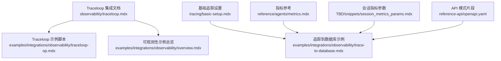
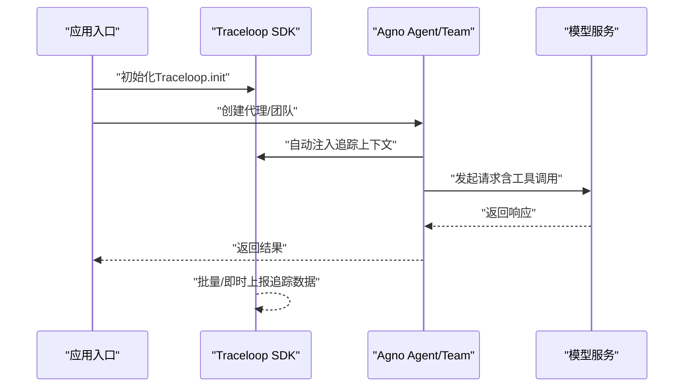
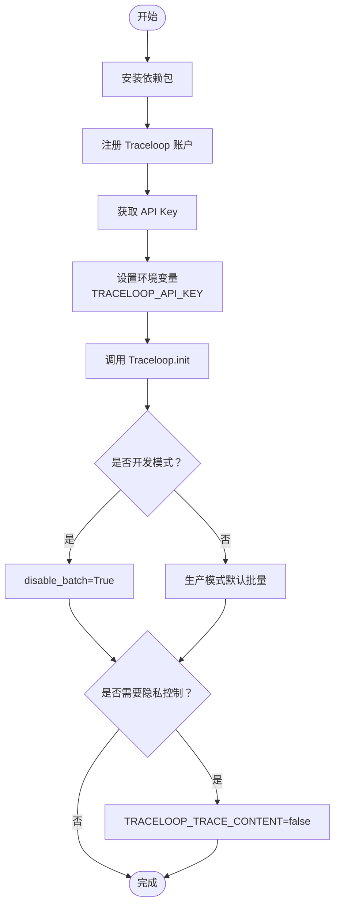
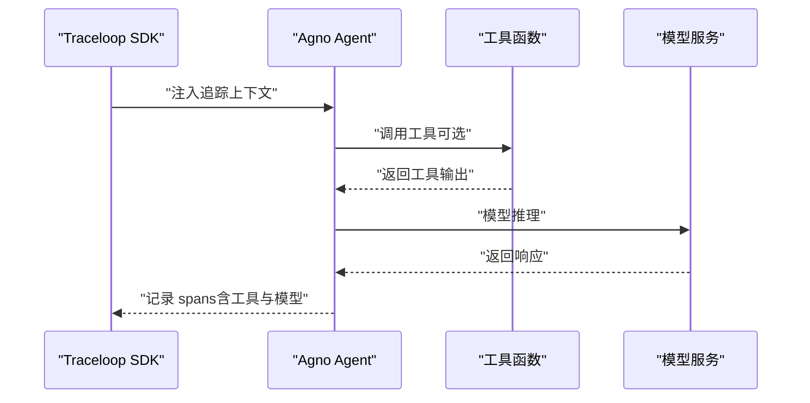
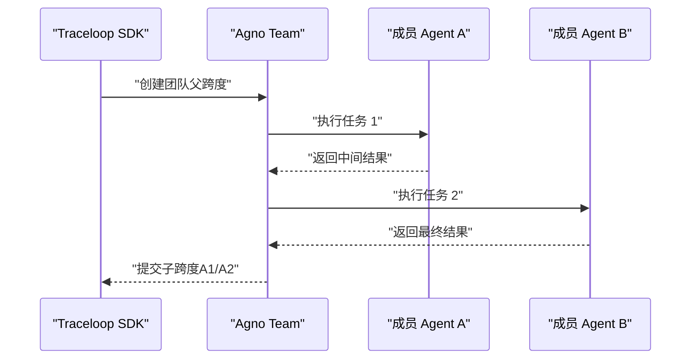
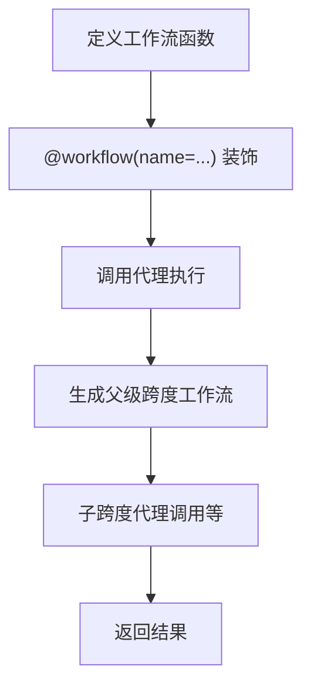
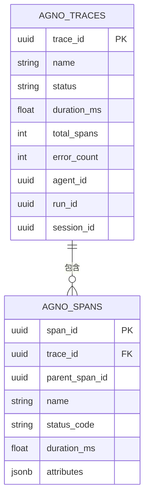
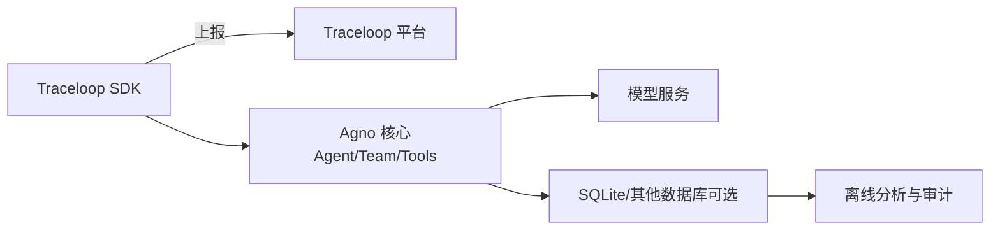

# TraceLoop 集成

<cite>
**本文引用的文件**
- [traceloop.mdx](file://observability/traceloop.mdx)
- [traceloop-op.mdx](file://examples/integrations/observability/traceloop-op.mdx)
- [overview.mdx（可观测性示例总览）](file://examples/integrations/observability/overview.mdx)
- [basic-setup.mdx（基础追踪设置）](file://tracing/basic-setup.mdx)
- [trace-to-database.mdx（追踪到数据库示例）](file://examples/integrations/observability/trace-to-database.mdx)
- [metrics.mdx（指标定义）](file://reference/agents/metrics.mdx)
- [session_metrics_params.mdx（会话指标参数）](file://TBD/snippets/session_metrics_params.mdx)
- [openapi.yaml（API 模式片段）](file://reference-api/openapi.yaml)
</cite>

## 目录
1. [简介](#简介)
2. [项目结构](#项目结构)
3. [核心组件](#核心组件)
4. [架构概览](#架构概览)
5. [详细组件分析](#详细组件分析)
6. [依赖关系分析](#依赖关系分析)
7. [性能考量](#性能考量)
8. [故障排除指南](#故障排除指南)
9. [结论](#结论)
10. [附录](#附录)

## 简介
本指南面向希望在 Agno 中集成 Traceloop 的开发者，系统讲解如何完成 API 密钥配置、环境准备与客户端初始化，并通过完整示例演示如何启用链式追踪、记录代理调用与分析性能指标。Traceloop 基于 OpenLLMetry（OpenTelemetry 扩展），可自动追踪代理执行、团队工作流、工具调用以及令牌用量等关键指标，帮助你获得端到端的 LLM 可观测性。

## 项目结构
与 Traceloop 集成相关的核心文档与示例分布在以下位置：
- 观测性集成总览：examples/integrations/observability/overview.mdx
- Traceloop 集成文档：observability/traceloop.mdx
- Traceloop 示例脚本：examples/integrations/observability/traceloop-op.mdx
- 基础追踪设置与数据库设计：tracing/basic-setup.mdx
- 追踪到数据库示例与查询：examples/integrations/observability/trace-to-database.mdx
- 指标参考（令牌用量、时延等）：reference/agents/metrics.mdx
- 会话指标参数说明：TBD/snippets/session_metrics_params.mdx
- API 模式片段（运行计数、会话计数、令牌指标等）：reference-api/openapi.yaml

**图表来源**
- [traceloop.mdx:1-187](file://observability/traceloop.mdx#L1-L187)
- [traceloop-op.mdx:1-62](file://examples/integrations/observability/traceloop-op.mdx#L1-L62)
- [overview.mdx（可观测性示例总览）:1-27](file://examples/integrations/observability/overview.mdx#L1-L27)
- [basic-setup.mdx（基础追踪设置）:1-233](file://tracing/basic-setup.mdx#L1-L233)
- [trace-to-database.mdx（追踪到数据库示例）:1-245](file://examples/integrations/observability/trace-to-database.mdx#L1-L245)
- [metrics.mdx（指标定义）:1-24](file://reference/agents/metrics.mdx#L1-L24)
- [session_metrics_params.mdx（会话指标参数）:1-19](file://TBD/snippets/session_metrics_params.mdx#L1-L19)
- [openapi.yaml（API 模式片段）:10016-10058](file://reference-api/openapi.yaml#L10016-L10058)

**章节来源**
- [traceloop.mdx:1-187](file://observability/traceloop.mdx#L1-L187)
- [overview.mdx（可观测性示例总览）:1-27](file://examples/integrations/observability/overview.mdx#L1-L27)

## 核心组件
- Traceloop SDK 初始化：在应用启动时调用 Traceloop.init，确保对后续创建的 Agno 代理进行自动仪器化。
- 环境变量配置：设置 TRACELOOP_API_KEY；开发模式可禁用批量导出以即时查看追踪。
- 自动追踪范围：代理执行、团队协作、工具调用、异步执行均被自动追踪。
- 工作流装饰器：使用 @workflow 装饰器创建自定义父级跨度，便于组织复杂流程。
- 隐私控制：可通过环境变量关闭提示与补全内容的日志记录。

**章节来源**
- [traceloop.mdx:10-31](file://observability/traceloop.mdx#L10-L31)
- [traceloop.mdx:33-187](file://observability/traceloop.mdx#L33-L187)

## 架构概览
下图展示了 Traceloop 在 Agno 应用中的集成路径：应用启动后初始化 Traceloop，随后创建并运行代理或团队；Traceloop SDK 自动捕获调用链路、工具调用与模型交互，并将数据发送至 Traceloop 平台。

**图表来源**
- [traceloop.mdx:35-79](file://observability/traceloop.mdx#L35-L79)
- [traceloop.mdx:81-119](file://observability/traceloop.mdx#L81-L119)
- [traceloop.mdx:121-148](file://observability/traceloop.mdx#L121-L148)
- [traceloop.mdx:150-179](file://observability/traceloop.mdx#L150-L179)

## 详细组件分析

### 组件一：Traceloop 客户端初始化与环境配置
- 必备步骤
  - 安装依赖：agno、openai、traceloop-sdk
  - 注册账户并获取 API Key
  - 设置环境变量：TRACELOOP_API_KEY
- 开发模式建议：disable_batch=True 以便本地即时查看追踪
- 隐私控制：TRACELOOP_TRACE_CONTENT=false 可禁用提示与补全内容记录

**图表来源**
- [traceloop.mdx:10-31](file://observability/traceloop.mdx#L10-L31)
- [traceloop.mdx:181-187](file://observability/traceloop.mdx#L181-L187)

**章节来源**
- [traceloop.mdx:10-31](file://observability/traceloop.mdx#L10-L31)
- [traceloop.mdx:181-187](file://observability/traceloop.mdx#L181-L187)

### 组件二：代理执行追踪（同步与异步）
- 同步代理：agent.run(...) 自动被追踪
- 异步代理：agent.arun(...) 自动被追踪
- 示例覆盖：基础代理、开发模式禁用批量、异步代理与工具调用

**图表来源**
- [traceloop.mdx:35-58](file://observability/traceloop.mdx#L35-L58)
- [traceloop.mdx:60-79](file://observability/traceloop.mdx#L60-L79)
- [traceloop.mdx:150-179](file://observability/traceloop.mdx#L150-L179)

**章节来源**
- [traceloop.mdx:35-58](file://observability/traceloop.mdx#L35-L58)
- [traceloop.mdx:60-79](file://observability/traceloop.mdx#L60-L79)
- [traceloop.mdx:150-179](file://observability/traceloop.mdx#L150-L179)

### 组件三：多代理团队追踪
- 团队执行会生成一个父级跨度，其中包含每个成员的子跨度
- 适合分析跨代理协作的时序与性能

**图表来源**
- [traceloop.mdx:81-119](file://observability/traceloop.mdx#L81-L119)

**章节来源**
- [traceloop.mdx:81-119](file://observability/traceloop.mdx#L81-L119)

### 组件四：工作流装饰器与自定义跨度
- 使用 @workflow(name="...") 创建自定义父级跨度，便于将多个步骤归类到同一工作流下
- 示例展示如何包装代理执行

**图表来源**
- [traceloop.mdx:121-148](file://observability/traceloop.mdx#L121-L148)
- [traceloop-op.mdx:34-38](file://examples/integrations/observability/traceloop-op.mdx#L34-L38)

**章节来源**
- [traceloop.mdx:121-148](file://observability/traceloop.mdx#L121-L148)
- [traceloop-op.mdx:1-62](file://examples/integrations/observability/traceloop-op.mdx#L1-L62)

### 组件五：与数据库追踪的协同（可选）
- 若同时使用 Agno 内置追踪（数据库表 agno_traces/agno_spans），可结合 Traceloop 获取端到端视图
- 数据库示例展示了如何查询 trace 与 spans，并提取令牌用量、时延等指标

**图表来源**
- [basic-setup.mdx（基础追踪设置）:165-171](file://tracing/basic-setup.mdx#L165-L171)
- [trace-to-database.mdx（追踪到数据库示例）:1-200](file://examples/integrations/observability/trace-to-database.mdx#L1-L200)

**章节来源**
- [basic-setup.mdx（基础追踪设置）:165-171](file://tracing/basic-setup.mdx#L165-L171)
- [trace-to-database.mdx（追踪到数据库示例）:1-200](file://examples/integrations/observability/trace-to-database.mdx#L1-L200)

## 依赖关系分析
- Traceloop 集成依赖
  - traceloop-sdk：负责追踪数据采集与上报
  - agno：提供代理、团队、工具等核心能力
  - openai（或其他模型提供商）：用于模型调用
- 与内置追踪的关系
  - Traceloop 专注于外部平台观测与可视化
  - Agno 内置追踪可持久化到数据库，便于离线分析与审计

**图表来源**
- [traceloop.mdx:12-18](file://observability/traceloop.mdx#L12-L18)
- [basic-setup.mdx（基础追踪设置）:9-19](file://tracing/basic-setup.mdx#L9-L19)

**章节来源**
- [traceloop.mdx:12-18](file://observability/traceloop.mdx#L12-L18)
- [basic-setup.mdx（基础追踪设置）:9-19](file://tracing/basic-setup.mdx#L9-L19)

## 性能考量
- 批量处理 vs 即时处理
  - 生产环境推荐批量处理，降低数据库写入压力并提升吞吐
  - 开发调试阶段可禁用批量，以便立即看到追踪
- 异步执行支持
  - 同步与异步方法均被完全追踪，避免遗漏关键路径
- 隐私与开销平衡
  - 关闭内容记录可减少敏感数据传输与存储成本

**章节来源**
- [traceloop.mdx:181-187](file://observability/traceloop.mdx#L181-L187)
- [basic-setup.mdx（基础追踪设置）:177-221](file://tracing/basic-setup.mdx#L177-L221)

## 故障排除指南
- 未看到追踪数据
  - 确认已先调用 Traceloop.init，且在创建代理之前
  - 开发模式请启用 disable_batch=True
- 无法连接到 Traceloop
  - 检查 TRACELOOP_API_KEY 是否正确设置
  - 确认网络可达性与代理设置
- 数据库追踪无结果
  - 确保已安装 openinference-instrumentation-agno
  - 如使用批量处理器，等待刷新后再查询
- 指标缺失或不完整
  - 不同模型/工具可能提供不同字段，参考指标定义与会话指标参数说明

**章节来源**
- [traceloop.mdx:181-187](file://observability/traceloop.mdx#L181-L187)
- [trace-to-database.mdx（追踪到数据库示例）:64-72](file://examples/integrations/observability/trace-to-database.mdx#L64-L72)
- [metrics.mdx（指标定义）:1-24](file://reference/agents/metrics.mdx#L1-L24)
- [session_metrics_params.mdx（会话指标参数）:1-19](file://TBD/snippets/session_metrics_params.mdx#L1-L19)

## 结论
通过 Traceloop 与 Agno 的集成，你可以获得从代理到团队、从工具调用到模型交互的完整链路追踪。配合开发模式下的即时可见性与生产模式下的高效批量处理，既能满足日常调试需求，也能支撑规模化部署的可观测性要求。建议在生产环境中结合内置数据库追踪，形成“云端可视化 + 本地审计”的双重保障。

## 附录

### 配置模板与环境变量
- 必需环境变量
  - TRACELOOP_API_KEY：Traceloop 控制台获取的 API Key
- 可选环境变量
  - TRACELOOP_TRACE_CONTENT：设为 false 可禁用内容记录
- 开发模式开关
  - disable_batch=True：开发时即时可见追踪

**章节来源**
- [traceloop.mdx:25-31](file://observability/traceloop.mdx#L25-L31)
- [traceloop.mdx:60-70](file://observability/traceloop.mdx#L60-L70)
- [traceloop.mdx:185-187](file://observability/traceloop.mdx#L185-L187)

### 实际使用案例与最佳实践
- 基础代理追踪：在应用启动时初始化 Traceloop，随后创建并运行代理
- 多代理团队：利用团队执行生成父子跨度，便于分析协作时序
- 工作流封装：使用 @workflow 装饰器将相关步骤归类到同一父级跨度
- 异步代理与工具：Traceloop 自动追踪异步调用与工具调用
- 指标分析：结合内置指标（令牌用量、时延、缓存命中等）进行性能评估

**章节来源**
- [traceloop.mdx:35-58](file://observability/traceloop.mdx#L35-L58)
- [traceloop.mdx:81-119](file://observability/traceloop.mdx#L81-L119)
- [traceloop.mdx:121-148](file://observability/traceloop.mdx#L121-L148)
- [traceloop.mdx:150-179](file://observability/traceloop.mdx#L150-L179)
- [metrics.mdx（指标定义）:1-24](file://reference/agents/metrics.mdx#L1-L24)
- [session_metrics_params.mdx（会话指标参数）:1-19](file://TBD/snippets/session_metrics_params.mdx#L1-L19)