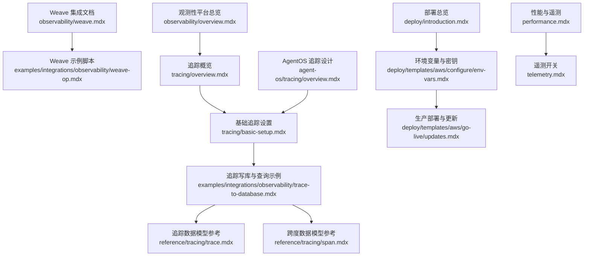
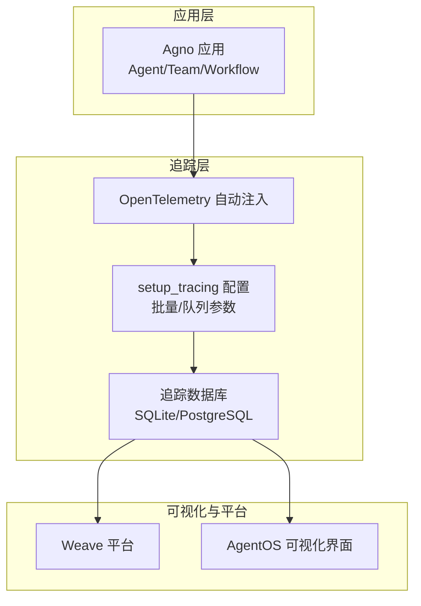
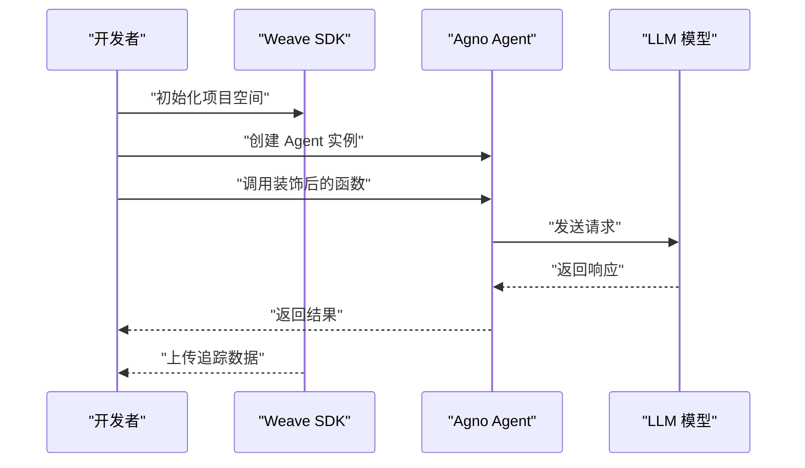
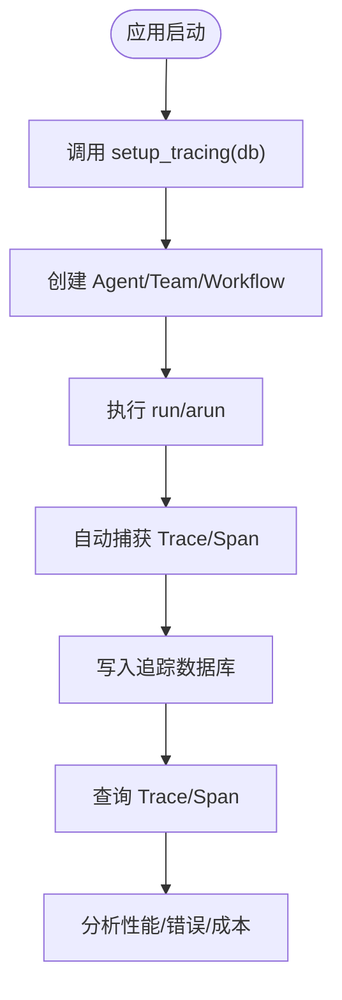
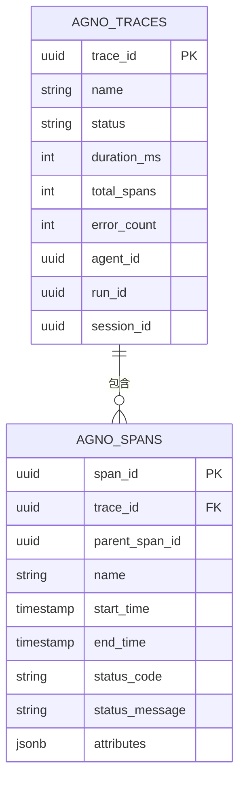
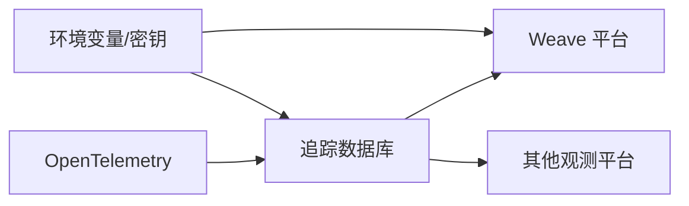

# Weave 集成

<cite>
**本文引用的文件**
- [observability/weave.mdx](file://observability/weave.mdx)
- [examples/integrations/observability/weave-op.mdx](file://examples/integrations/observability/weave-op.mdx)
- [tracing/overview.mdx](file://tracing/overview.mdx)
- [tracing/basic-setup.mdx](file://tracing/basic-setup.mdx)
- [examples/integrations/observability/trace-to-database.mdx](file://examples/integrations/observability/trace-to-database.mdx)
- [reference/tracing/trace.mdx](file://reference/tracing/trace.mdx)
- [reference/tracing/span.mdx](file://reference/tracing/span.mdx)
- [agent-os/tracing/overview.mdx](file://agent-os/tracing/overview.mdx)
- [observability/overview.mdx](file://observability/overview.mdx)
- [deploy/templates/aws/configure/env-vars.mdx](file://deploy/templates/aws/configure/env-vars.mdx)
- [deploy/templates/aws/configure/secrets.mdx](file://deploy/templates/aws/configure/secrets.mdx)
- [deploy/templates/aws/go-live/updates.mdx](file://deploy/templates/aws/go-live/updates.mdx)
- [deploy/introduction.mdx](file://deploy/introduction.mdx)
- [performance.mdx](file://performance.mdx)
- [telemetry.mdx](file://telemetry.mdx)
</cite>

## 目录
1. [简介](#简介)
2. [项目结构](#项目结构)
3. [核心组件](#核心组件)
4. [架构总览](#架构总览)
5. [详细组件分析](#详细组件分析)
6. [依赖关系分析](#依赖关系分析)
7. [性能考量](#性能考量)
8. [故障排除指南](#故障排除指南)
9. [结论](#结论)
10. [附录](#附录)

## 简介
本技术文档面向在 Weave（Weights & Biases）平台上集成 Agno 的用户，系统性介绍如何通过 Weave 对模型调用进行可观测性追踪，并结合 Agno 的 OpenTelemetry 原生支持能力，实现端到端的性能监控、数据质量跟踪与调试工具链。文档覆盖 API 配置、环境变量设置、初始化流程、追踪与数据库查询、与 OpenTelemetry 的兼容性、数据格式规范、最佳实践、部署示例与监控模板等。

## 项目结构
围绕 Weave 集成的关键内容分布在以下位置：
- Weave 集成与使用示例：observability/weave.mdx、examples/integrations/observability/weave-op.mdx
- OpenTelemetry 与追踪概览：tracing/overview.mdx、tracing/basic-setup.mdx
- 追踪数据模型与查询：reference/tracing/trace.mdx、reference/tracing/span.mdx
- 将追踪写入数据库并查询：examples/integrations/observability/trace-to-database.mdx
- AgentOS 中的追踪与数据库设计：agent-os/tracing/overview.mdx
- 观测性平台总览与兼容性：observability/overview.mdx
- 环境变量与密钥管理：deploy/templates/aws/configure/env-vars.mdx、deploy/templates/aws/configure/secrets.mdx
- 生产部署与更新：deploy/templates/aws/go-live/updates.mdx、deploy/introduction.mdx
- 性能基准与遥测开关：performance.mdx、telemetry.mdx

**图表来源**
- [observability/weave.mdx:1-56](file://observability/weave.mdx#L1-L56)
- [examples/integrations/observability/weave-op.mdx:1-53](file://examples/integrations/observability/weave-op.mdx#L1-L53)
- [tracing/overview.mdx:1-158](file://tracing/overview.mdx#L1-L158)
- [tracing/basic-setup.mdx:39-233](file://tracing/basic-setup.mdx#L39-L233)
- [examples/integrations/observability/trace-to-database.mdx:1-245](file://examples/integrations/observability/trace-to-database.mdx#L1-L245)
- [reference/tracing/trace.mdx:28-75](file://reference/tracing/trace.mdx#L28-L75)
- [reference/tracing/span.mdx:86-122](file://reference/tracing/span.mdx#L86-L122)
- [agent-os/tracing/overview.mdx:119-182](file://agent-os/tracing/overview.mdx#L119-L182)
- [observability/overview.mdx:1-23](file://observability/overview.mdx#L1-L23)
- [deploy/templates/aws/configure/env-vars.mdx:1-79](file://deploy/templates/aws/configure/env-vars.mdx#L1-L79)
- [deploy/templates/aws/go-live/updates.mdx:1-51](file://deploy/templates/aws/go-live/updates.mdx#L1-L51)
- [deploy/introduction.mdx:1-102](file://deploy/introduction.mdx#L1-L102)
- [performance.mdx:1-67](file://performance.mdx#L1-L67)
- [telemetry.mdx:78-95](file://telemetry.mdx#L78-L95)

**章节来源**
- [observability/weave.mdx:1-56](file://observability/weave.mdx#L1-L56)
- [examples/integrations/observability/weave-op.mdx:1-53](file://examples/integrations/observability/weave-op.mdx#L1-L53)
- [tracing/overview.mdx:1-158](file://tracing/overview.mdx#L1-L158)
- [tracing/basic-setup.mdx:39-233](file://tracing/basic-setup.mdx#L39-L233)
- [examples/integrations/observability/trace-to-database.mdx:1-245](file://examples/integrations/observability/trace-to-database.mdx#L1-L245)
- [reference/tracing/trace.mdx:28-75](file://reference/tracing/trace.mdx#L28-L75)
- [reference/tracing/span.mdx:86-122](file://reference/tracing/span.mdx#L86-L122)
- [agent-os/tracing/overview.mdx:119-182](file://agent-os/tracing/overview.mdx#L119-L182)
- [observability/overview.mdx:1-23](file://observability/overview.mdx#L1-L23)
- [deploy/templates/aws/configure/env-vars.mdx:1-79](file://deploy/templates/aws/configure/env-vars.mdx#L1-L79)
- [deploy/templates/aws/go-live/updates.mdx:1-51](file://deploy/templates/aws/go-live/updates.mdx#L1-L51)
- [deploy/introduction.mdx:1-102](file://deploy/introduction.mdx#L1-L102)
- [performance.mdx:1-67](file://performance.mdx#L1-L67)
- [telemetry.mdx:78-95](file://telemetry.mdx#L78-L95)

## 核心组件
- Weave 集成入口
  - 安装 Weights & Biases 包并设置 API 密钥
  - 使用 weave.init 初始化项目空间
  - 使用 @weave.op 装饰器标注需要追踪的函数
- OpenTelemetry 原生追踪
  - 通过 setup_tracing 启用自动追踪，支持批量处理与队列参数
  - 追踪数据写入专用数据库（如 SQLite），便于查询与分析
- 数据模型与查询
  - Trace：一次完整执行的追踪根节点
  - Span：执行中的单个操作，包含时间戳、输入输出、令牌用量、关系与元数据
- AgentOS 集成
  - 在 AgentOS 中统一追踪与查询，确保跨 Agent 的可比性与可扩展性

**章节来源**
- [observability/weave.mdx:10-56](file://observability/weave.mdx#L10-L56)
- [tracing/overview.mdx:39-89](file://tracing/overview.mdx#L39-L89)
- [tracing/basic-setup.mdx:39-93](file://tracing/basic-setup.mdx#L39-L93)
- [examples/integrations/observability/trace-to-database.mdx:13-245](file://examples/integrations/observability/trace-to-database.mdx#L13-L245)
- [reference/tracing/trace.mdx:28-75](file://reference/tracing/trace.mdx#L28-L75)
- [reference/tracing/span.mdx:86-122](file://reference/tracing/span.mdx#L86-L122)
- [agent-os/tracing/overview.mdx:119-182](file://agent-os/tracing/overview.mdx#L119-L182)

## 架构总览
下图展示了从应用层到 Weave 平台与本地追踪数据库的整体架构：

**图表来源**
- [tracing/overview.mdx:17-37](file://tracing/overview.mdx#L17-L37)
- [tracing/basic-setup.mdx:39-93](file://tracing/basic-setup.mdx#L39-L93)
- [examples/integrations/observability/trace-to-database.mdx:13-31](file://examples/integrations/observability/trace-to-database.mdx#L13-L31)
- [observability/weave.mdx:26-56](file://observability/weave.mdx#L26-L56)
- [agent-os/tracing/overview.mdx:119-182](file://agent-os/tracing/overview.mdx#L119-L182)

## 详细组件分析

### Weave 集成组件
- 初始化与认证
  - 安装 Weights & Biases 包并设置 API 密钥
  - 调用 weave.init 指定项目名称
- 函数级追踪
  - 使用 @weave.op 装饰器标注关键函数，自动采集输入、输出与上下文
- 示例路径
  - [Weave 集成示例:1-53](file://examples/integrations/observability/weave-op.mdx#L1-L53)
  - [Weave 文档:1-56](file://observability/weave.mdx#L1-L56)

**图表来源**
- [examples/integrations/observability/weave-op.mdx:13-39](file://examples/integrations/observability/weave-op.mdx#L13-L39)
- [observability/weave.mdx:26-56](file://observability/weave.mdx#L26-L56)

**章节来源**
- [examples/integrations/observability/weave-op.mdx:1-53](file://examples/integrations/observability/weave-op.mdx#L1-L53)
- [observability/weave.mdx:10-56](file://observability/weave.mdx#L10-L56)

### OpenTelemetry 追踪组件
- 自动注入与配置
  - 通过 setup_tracing 开启自动追踪，支持批量处理与队列大小等参数
  - 在 AgentOS 中可通过 tracing=True 或 setup_tracing 统一追踪
- 数据落库与查询
  - 追踪数据写入专用数据库（如 SQLite），提供 get_trace/get_spans 等查询接口
  - 支持按 Agent、会话、运行 ID、时间范围过滤
- 示例路径
  - [追踪概览:1-158](file://tracing/overview.mdx#L1-L158)
  - [基础设置:39-233](file://tracing/basic-setup.mdx#L39-233)
  - [追踪写库与查询示例:1-245](file://examples/integrations/observability/trace-to-database.mdx#L1-L245)

**图表来源**
- [tracing/basic-setup.mdx:39-93](file://tracing/basic-setup.mdx#L39-L93)
- [examples/integrations/observability/trace-to-database.mdx:45-244](file://examples/integrations/observability/trace-to-database.mdx#L45-L244)

**章节来源**
- [tracing/overview.mdx:1-158](file://tracing/overview.mdx#L1-L158)
- [tracing/basic-setup.mdx:39-233](file://tracing/basic-setup.mdx#L39-L233)
- [examples/integrations/observability/trace-to-database.mdx:1-245](file://examples/integrations/observability/trace-to-database.mdx#L1-L245)

### 数据模型与查询组件
- Trace（追踪）
  - 表示一次完整的执行，包含 trace_id、名称、状态、时长、跨度总数、错误数等
  - 提供 to_dict/from_dict 方法，便于序列化与反序列化
- Span（跨度）
  - 表示执行中的单个操作，包含开始/结束时间、父/子关系、输入输出、令牌用量、元数据等
  - 支持按 openinference.span.kind 分类（如 AGENT/TOOL/LLM）
- 查询与分析
  - 通过 get_trace/run_id 获取 Trace
  - 通过 get_spans(trace_id) 获取所有 Span，并按时间排序打印树形结构
- 示例路径
  - [Trace 参考:28-75](file://reference/tracing/trace.mdx#L28-75)
  - [Span 参考:86-122](file://reference/tracing/span.mdx#L86-122)
  - [追踪写库与查询示例:64-227](file://examples/integrations/observability/trace-to-database.mdx#L64-L227)

**图表来源**
- [examples/integrations/observability/trace-to-database.mdx:13-31](file://examples/integrations/observability/trace-to-database.mdx#L13-L31)
- [reference/tracing/trace.mdx:28-75](file://reference/tracing/trace.mdx#L28-L75)
- [reference/tracing/span.mdx:86-122](file://reference/tracing/span.mdx#L86-L122)

**章节来源**
- [reference/tracing/trace.mdx:28-75](file://reference/tracing/trace.mdx#L28-L75)
- [reference/tracing/span.mdx:86-122](file://reference/tracing/span.mdx#L86-L122)
- [examples/integrations/observability/trace-to-database.mdx:64-227](file://examples/integrations/observability/trace-to-database.mdx#L64-L227)

### AgentOS 追踪组件
- 设计理念
  - 使用专用追踪数据库，避免追踪数据分散在各 Agent 数据库中
  - 保证跨 Agent 的统一可观测性与可查询性
- 配置要点
  - setup_tracing(db, 批量/队列参数)
  - 在 AgentOS 中传入 db，使追踪可通过 API/UI 访问
- 示例路径
  - [AgentOS 追踪概览:119-182](file://agent-os/tracing/overview.mdx#L119-182)

**章节来源**
- [agent-os/tracing/overview.mdx:119-182](file://agent-os/tracing/overview.mdx#L119-L182)

## 依赖关系分析
- 平台兼容性
  - Agno 支持 OpenTelemetry，可与 Weave、Langfuse、Arize Phoenix、AgentOps、LangSmith、Langtrace、Logfire、Maxim、MLflow、OpenLIT、Traceloop 等平台兼容
- 追踪后端
  - 本地数据库（SQLite/PostgreSQL）用于存储与查询
  - Weave 作为外部可视化平台接收追踪数据
- 环境变量与密钥
  - Weights & Biases API Key 通过环境变量注入
  - 生产环境密钥通过 AWS Secrets Manager 管理

**图表来源**
- [observability/overview.mdx:14-23](file://observability/overview.mdx#L14-L23)
- [deploy/templates/aws/configure/env-vars.mdx:14-28](file://deploy/templates/aws/configure/env-vars.mdx#L14-L28)
- [deploy/templates/aws/configure/secrets.mdx:22-47](file://deploy/templates/aws/configure/secrets.mdx#L22-L47)

**章节来源**
- [observability/overview.mdx:1-23](file://observability/overview.mdx#L1-L23)
- [deploy/templates/aws/configure/env-vars.mdx:1-79](file://deploy/templates/aws/configure/env-vars.mdx#L1-L79)
- [deploy/templates/aws/configure/secrets.mdx:1-47](file://deploy/templates/aws/configure/secrets.mdx#L1-L47)

## 性能考量
- 追踪开销
  - 追踪采用非阻塞设计，不会降低 Agent 执行速度
  - 生产环境建议开启批量处理以减少写库频率
- 性能基准
  - Agno 在实例化时间与内存占用方面具有优势，适合大规模 Agent 工作负载
- 遥测控制
  - 可通过 telemetry=False 关闭特定组件的遥测上报

**章节来源**
- [tracing/overview.mdx:81-89](file://tracing/overview.mdx#L81-L89)
- [performance.mdx:1-67](file://performance.mdx#L1-L67)
- [telemetry.mdx:78-95](file://telemetry.mdx#L78-L95)

## 故障排除指南
- Weave 初始化失败
  - 确认已安装 Weights & Biases 包并正确设置 API Key
  - 检查 weave.init 的项目名是否正确
- 追踪未入库或查询为空
  - 确保在创建 Agent 之前调用 setup_tracing
  - 若使用批量处理器，等待刷新后再查询
  - 检查数据库连接与表结构
- AgentOS 部署健康检查失败
  - 检查 /health 端点返回
  - 查看 CloudWatch 日志定位启动错误
  - 排查数据库连接、环境变量与密钥
- AWS ECS 任务重启
  - 关注容器启动日志与 SIGTERM 信号
  - 常见原因：数据库连接失败、缺失环境变量、启动后崩溃

**章节来源**
- [observability/weave.mdx:20-56](file://observability/weave.mdx#L20-L56)
- [tracing/basic-setup.mdx:55-93](file://tracing/basic-setup.mdx#L55-L93)
- [examples/integrations/observability/trace-to-database.mdx:64-227](file://examples/integrations/observability/trace-to-database.mdx#L64-L227)
- [deploy/templates/aws/go-live/updates.mdx:14-47](file://deploy/templates/aws/go-live/updates.mdx#L14-L47)

## 结论
通过 Weave 与 Agno 的集成，可以在不侵入业务代码的前提下，对模型调用与 Agent 执行进行深度可观测性追踪。结合 OpenTelemetry 原生支持与专用追踪数据库，既能满足开发调试需求，也能支撑生产环境的性能监控、成本分析与问题定位。配合 AgentOS 的统一查询与可视化能力，可实现跨 Agent 的对比分析与持续优化。

## 附录

### API 配置与环境变量设置
- Weights & Biases
  - 安装包与设置 API Key
  - 初始化项目空间
- 环境变量
  - RUNTIME_ENV、OPENAI_API_KEY、DB_* 等
  - 生产环境密钥通过 AWS Secrets Manager 管理
- 示例路径
  - [Weave 集成示例:1-53](file://examples/integrations/observability/weave-op.mdx#L1-L53)
  - [Weave 文档:1-56](file://observability/weave.mdx#L1-L56)
  - [环境变量参考:1-79](file://deploy/templates/aws/configure/env-vars.mdx#L1-L79)
  - [密钥管理:1-47](file://deploy/templates/aws/configure/secrets.mdx#L1-L47)

**章节来源**
- [examples/integrations/observability/weave-op.mdx:1-53](file://examples/integrations/observability/weave-op.mdx#L1-L53)
- [observability/weave.mdx:1-56](file://observability/weave.mdx#L1-L56)
- [deploy/templates/aws/configure/env-vars.mdx:1-79](file://deploy/templates/aws/configure/env-vars.mdx#L1-L79)
- [deploy/templates/aws/configure/secrets.mdx:1-47](file://deploy/templates/aws/configure/secrets.mdx#L1-L47)

### 初始化与启用追踪
- 基础步骤
  - 安装 OpenTelemetry 相关依赖
  - 创建追踪数据库
  - 调用 setup_tracing(db)
  - 运行 Agent 并查询 Trace/Span
- 示例路径
  - [基础设置:39-233](file://tracing/basic-setup.mdx#L39-233)
  - [追踪写库与查询示例:1-245](file://examples/integrations/observability/trace-to-database.mdx#L1-L245)

**章节来源**
- [tracing/basic-setup.mdx:39-233](file://tracing/basic-setup.mdx#L39-L233)
- [examples/integrations/observability/trace-to-database.mdx:1-245](file://examples/integrations/observability/trace-to-database.mdx#L1-L245)

### 导出分析报告与可视化
- Weave 平台
  - 使用 @weave.op 装饰关键函数，自动采集并上传
- AgentOS 可视化
  - 通过数据库查询 Trace/Span，生成树形结构与属性摘要
- 示例路径
  - [Weave 集成示例:1-53](file://examples/integrations/observability/weave-op.mdx#L1-L53)
  - [追踪写库与查询示例:64-227](file://examples/integrations/observability/trace-to-database.mdx#L64-L227)

**章节来源**
- [examples/integrations/observability/weave-op.mdx:1-53](file://examples/integrations/observability/weave-op.mdx#L1-L53)
- [examples/integrations/observability/trace-to-database.mdx:64-227](file://examples/integrations/observability/trace-to-database.mdx#L64-L227)

### 与 OpenTelemetry 兼容性与数据格式
- 兼容平台
  - Weave、Langfuse、Arize Phoenix、AgentOps、LangSmith、Langtrace、Logfire、Maxim、MLflow、OpenLIT、Traceloop
- 数据格式
  - Trace/Span 属性遵循 OpenInference 标准键值（如 openinference.span.kind、llm.*、gen_ai.*）
- 示例路径
  - [观测性平台总览:1-23](file://observability/overview.mdx#L1-L23)
  - [Span 参考:86-122](file://reference/tracing/span.mdx#L86-122)

**章节来源**
- [observability/overview.mdx:1-23](file://observability/overview.mdx#L1-L23)
- [reference/tracing/span.mdx:86-122](file://reference/tracing/span.mdx#L86-L122)

### 部署示例与监控配置模板
- 部署模板
  - Docker、Railway、AWS（ECS Fargate）等
- 生产部署
  - 配置密钥、网络、CI/CD、HTTPS、用户管理
- 示例路径
  - [部署总览:1-102](file://deploy/introduction.mdx#L1-L102)
  - [AWS 生产部署:1-51](file://deploy/templates/aws/go-live/updates.mdx#L1-L51)

**章节来源**
- [deploy/introduction.mdx:1-102](file://deploy/introduction.mdx#L1-L102)
- [deploy/templates/aws/go-live/updates.mdx:1-51](file://deploy/templates/aws/go-live/updates.mdx#L1-L51)