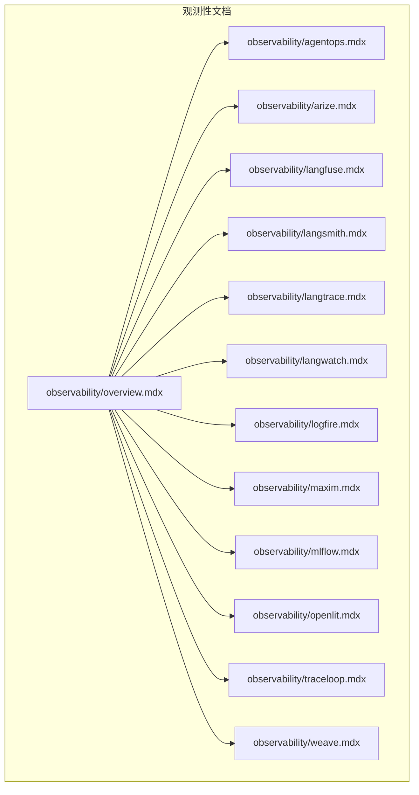
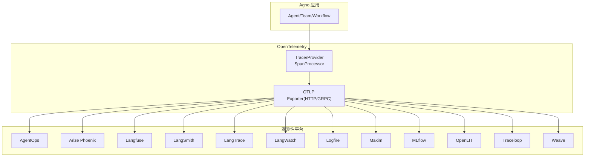
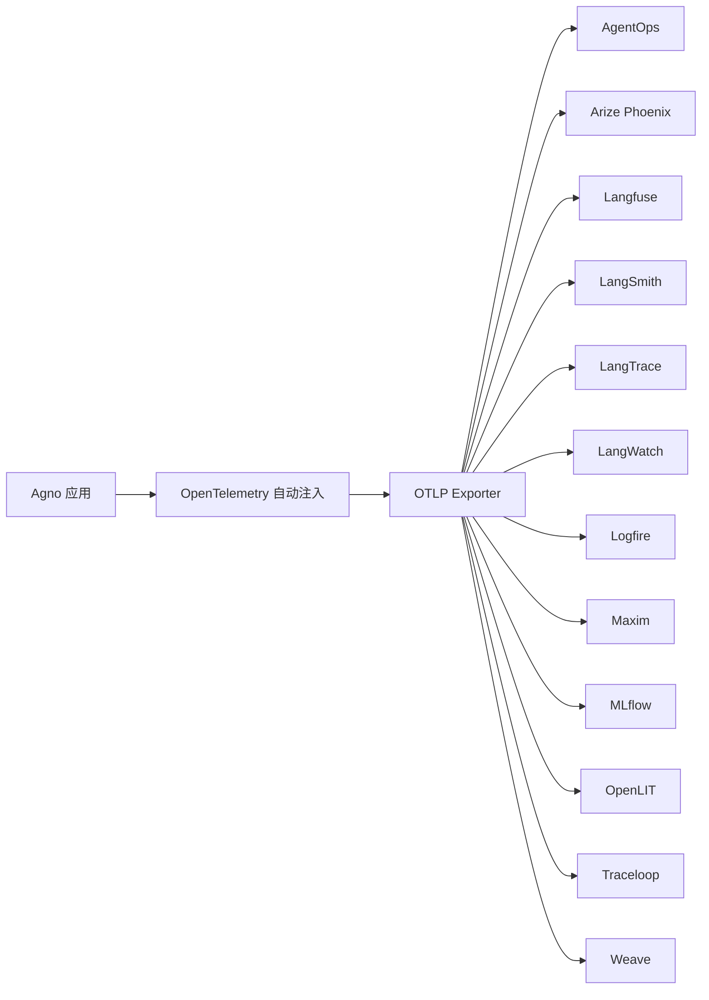

# 平台集成

<cite>
**本文引用的文件**   
- [observability/overview.mdx](file://observability/overview.mdx)
- [observability/agentops.mdx](file://observability/agentops.mdx)
- [observability/arize.mdx](file://observability/arize.mdx)
- [observability/langfuse.mdx](file://observability/langfuse.mdx)
- [observability/langsmith.mdx](file://observability/langsmith.mdx)
- [observability/langtrace.mdx](file://observability/langtrace.mdx)
- [observability/langwatch.mdx](file://observability/langwatch.mdx)
- [observability/logfire.mdx](file://observability/logfire.mdx)
- [observability/maxim.mdx](file://observability/maxim.mdx)
- [observability/mlflow.mdx](file://observability/mlflow.mdx)
- [observability/openlit.mdx](file://observability/openlit.mdx)
- [observability/traceloop.mdx](file://observability/traceloop.mdx)
- [observability/weave.mdx](file://observability/weave.mdx)
- [telemetry.mdx](file://telemetry.mdx)
</cite>

## 目录
1. [简介](#简介)
2. [项目结构](#项目结构)
3. [核心组件](#核心组件)
4. [架构总览](#架构总览)
5. [详细组件分析](#详细组件分析)
6. [依赖关系分析](#依赖关系分析)
7. [性能考量](#性能考量)
8. [故障排除指南](#故障排除指南)
9. [结论](#结论)
10. [附录](#附录)

## 简介
本章节面向希望在 Agno 中集成多种 OpenTelemetry 兼容观测性平台的用户，系统介绍如何将 AgentOps、Arize Phoenix、Langfuse、LangSmith、LangTrace、LangWatch、Logfire、Maxim、MLflow、OpenLIT、Traceloop 和 Weave 等平台接入到 Agno 的可观测性体系中。文档覆盖各平台的前置条件、API 密钥与导出配置、典型用法与最佳实践，并对平台特性与适用场景进行对比，帮助用户按需选择。

## 项目结构
与平台集成相关的内容集中在 observability 目录下，每个平台一个独立文档，统一遵循“前置条件—环境变量—发送追踪—注意事项”的组织方式；telemetry 文档则说明 Agno 自身的遥测行为与隐私控制。

**图表来源**
- [observability/overview.mdx](file://observability/overview.mdx)
- [observability/agentops.mdx](file://observability/agentops.mdx)
- [observability/arize.mdx](file://observability/arize.mdx)
- [observability/langfuse.mdx](file://observability/langfuse.mdx)
- [observability/langsmith.mdx](file://observability/langsmith.mdx)
- [observability/langtrace.mdx](file://observability/langtrace.mdx)
- [observability/langwatch.mdx](file://observability/langwatch.mdx)
- [observability/logfire.mdx](file://observability/logfire.mdx)
- [observability/maxim.mdx](file://observability/maxim.mdx)
- [observability/mlflow.mdx](file://observability/mlflow.mdx)
- [observability/openlit.mdx](file://observability/openlit.mdx)
- [observability/traceloop.mdx](file://observability/traceloop.mdx)
- [observability/weave.mdx](file://observability/weave.mdx)

**章节来源**
- [observability/overview.mdx](file://observability/overview.mdx)

## 核心组件
- OpenTelemetry 支持：Agno 对 OpenTelemetry 提供原生支持，可自动注入、灵活导出至任意兼容后端，并允许扩展自定义追踪。
- 平台适配：仓库明确列出 Arize Phoenix、Langfuse、LangSmith、LangTrace、Logfire、Maxim、MLflow、OpenLIT、Traceloop、Weave 等平台均通过 OpenTelemetry 兼容后端实现对接。
- 遥测控制：Agno 自身收集匿名使用数据，用户可通过环境变量或实例级参数关闭。

**章节来源**
- [observability/overview.mdx](file://observability/overview.mdx)
- [telemetry.mdx](file://telemetry.mdx)

## 架构总览
下图展示 Agno 与各观测性平台的集成路径：通过 OpenTelemetry（OTel）自动注入与导出器，将 Span/Trace 发送到目标平台。部分平台提供 SDK 或封装以简化配置。

**图表来源**
- [observability/agentops.mdx](file://observability/agentops.mdx)
- [observability/arize.mdx](file://observability/arize.mdx)
- [observability/langfuse.mdx](file://observability/langfuse.mdx)
- [observability/langsmith.mdx](file://observability/langsmith.mdx)
- [observability/langtrace.mdx](file://observability/langtrace.mdx)
- [observability/langwatch.mdx](file://observability/langwatch.mdx)
- [observability/logfire.mdx](file://observability/logfire.mdx)
- [observability/maxim.mdx](file://observability/maxim.mdx)
- [observability/mlflow.mdx](file://observability/mlflow.mdx)
- [observability/openlit.mdx](file://observability/openlit.mdx)
- [observability/traceloop.mdx](file://observability/traceloop.mdx)
- [observability/weave.mdx](file://observability/weave.mdx)

## 详细组件分析

### AgentOps
- 前置条件：安装 AgentOps 包；准备 API Key。
- 环境变量：设置 AGENTOPS_API_KEY。
- 使用要点：调用初始化函数以启用自动注入；随后创建并运行 Agent 即可采集模型调用等追踪。
- 最佳实践：在应用启动阶段尽早初始化；生产环境确保密钥安全存储与轮换。

**章节来源**
- [observability/agentops.mdx](file://observability/agentops.mdx)

### Arize Phoenix
- 前置条件：安装 arize-phoenix、openai、openinference-instrumentation-agno、opentelemetry-sdk、opentelemetry-exporter-otlp。
- 环境变量：设置 PHOENIX_CLIENT_HEADERS（含 API Key）、PHOENIX_COLLECTOR_ENDPOINT（云端或本地）。
- 使用要点：通过 register 启用自动注入；本地开发可用 phoenix serve 启动本地收集器。
- 最佳实践：根据部署位置选择合适的端点；结合工具与模型调用进行可视化分析。

**章节来源**
- [observability/arize.mdx](file://observability/arize.mdx)

### Langfuse
- 前置条件：安装 agno、openai、langfuse、opentelemetry-sdk、opentelemetry-exporter-otlp、openinference-instrumentation-agno。
- 环境变量：设置 LANGFUSE_PUBLIC_KEY、LANGFUSE_SECRET_KEY；OTEL_EXPORTER_OTLP_ENDPOINT 指向 Langfuse OTLP 端点。
- 使用要点：配置 TracerProvider 与 OTLPSpanExporter；通过 AgnoInstrumentor 启用自动注入；支持 OpenLIT 方式。
- 最佳实践：按区域选择端点（US/EU/本地）；注意认证头格式与授权方式。

**章节来源**
- [observability/langfuse.mdx](file://observability/langfuse.mdx)

### LangSmith
- 前置条件：安装 openai、openinference-instrumentation-agno、opentelemetry-sdk、opentelemetry-exporter-otlp。
- 环境变量：设置 LANGSMITH_API_KEY、LANGSMITH_TRACING、LANGSMITH_ENDPOINT（按区域选择）、LANGSMITH_PROJECT。
- 使用要点：配置 OTLP Exporter 并设置请求头；通过 AgnoInstrumentor 启用自动注入。
- 最佳实践：确保项目名与工作区一致；按数据驻留地选择端点。

**章节来源**
- [observability/langsmith.mdx](file://observability/langsmith.mdx)

### LangTrace
- 前置条件：安装 langtrace-python-sdk。
- 环境变量：设置 LANGTRACE_API_KEY。
- 使用要点：调用 langtrace.init() 初始化；创建 Agent 即可自动追踪。
- 最佳实践：在执行任何 Agent 调用前完成初始化；适合快速上手与最小配置。

**章节来源**
- [observability/langtrace.mdx](file://observability/langtrace.mdx)

### LangWatch
- 前置条件：安装 langwatch、agno、openai、openinference-instrumentation-agno。
- 环境变量：设置 LANGWATCH_API_KEY。
- 使用要点：通过 langwatch.setup(instrumentors=[AgnoInstrumentor()]) 自动注入；无需手动配置 OTel。
- 最佳实践：利用其封装减少样板代码；支持 RAG 数据、评估与守卫护栏等高级能力。

**章节来源**
- [observability/langwatch.mdx](file://observability/langwatch.mdx)

### Logfire
- 前置条件：安装 agno、openai、opentelemetry-sdk、opentelemetry-exporter-otlp、openinference-instrumentation-agno。
- 环境变量：设置 LOGFIRE_WRITE_TOKEN；OTEL_EXPORTER_OTLP_ENDPOINT 指向 Logfire 区域端点（US/EU）。
- 使用要点：配置 TracerProvider 与 Exporter；通过 AgnoInstrumentor 启用自动注入。
- 最佳实践：按数据区域选择端点；在仪表板查看追踪与性能指标。

**章节来源**
- [observability/logfire.mdx](file://observability/logfire.mdx)

### Maxim
- 前置条件：安装 agno、openai、maxim-py；或单独安装 maxim-py。
- 环境变量：设置 MAXIM_API_KEY、MAXIM_LOG_REPO_ID、OPENAI_API_KEY。
- 使用要点：调用 instrument_agno(Maxim().logger()) 进行自动注入；支持单 Agent 与多 Agent 团队。
- 最佳实践：在创建或执行任何 Agent 前调用 instrument_agno()；开启调试模式便于排障。

**章节来源**
- [observability/maxim.mdx](file://observability/maxim.mdx)

### MLflow
- 前置条件：安装 mlflow、agno、opentelemetry-exporter-otlp、openinference-instrumentation-agno。
- 环境变量：设置 MLFLOW_TRACKING_URI、MLFLOW_EXPERIMENT_NAME。
- 使用要点：在启动时调用 mlflow.agno.autolog()；Agent 执行过程自动记录模型/工具调用与步骤。
- 最佳实践：本地或托管 MLflow Server 均可；建议在 AgentOS 场景中同样启用。

**章节来源**
- [observability/mlflow.mdx](file://observability/mlflow.mdx)

### OpenLIT
- 前置条件：安装 agno、openai、openlit；可选部署 OpenLIT（Docker/K8s）。
- 环境变量：可选设置 OTEL_EXPORTER_OTLP_ENDPOINT（本地或自托管）。
- 使用要点：调用 openlit.init() 启用自动注入；支持开发模式直接输出到控制台；可追踪多 Agent 团队。
- 最佳实践：零代码注入（CLI）与代码注入（SDK）二选一；自托管保证数据隐私。

**章节来源**
- [observability/openlit.mdx](file://observability/openlit.mdx)

### Traceloop
- 前置条件：安装 agno、openai、traceloop-sdk。
- 环境变量：设置 TRACELOOP_API_KEY。
- 使用要点：在应用启动时调用 Traceloop.init()；支持开发禁用批处理、工作流装饰器、异步 Agent 与工具调用追踪。
- 最佳实践：生产环境默认批处理，开发时可禁用；可通过环境变量控制是否记录提示与补全内容。

**章节来源**
- [observability/traceloop.mdx](file://observability/traceloop.mdx)

### Weave（Weights & Biases）
- 前置条件：安装 weave。
- 环境变量：设置 WANDB_API_KEY。
- 使用要点：调用 weave.init("project-name") 初始化；通过 @weave.op() 装饰需要记录的函数。
- 最佳实践：为关键流程打点；结合 Weave UI 查看模型调用与结果。

**章节来源**
- [observability/weave.mdx](file://observability/weave.mdx)

## 依赖关系分析
- 统一依赖链：Agno → OpenTelemetry 自动注入 → OTLP Exporter → 平台后端。
- 平台差异：
  - 封装型 SDK（如 AgentOps、LangTrace、LangWatch、Maxim、Traceloop、Weave）：降低配置复杂度，适合快速集成。
  - OTLP 直连型（如 Arize Phoenix、Langfuse、LangSmith、Logfire、MLflow、OpenLIT）：更灵活可控，适合自托管与企业合规。
- 选择建议：
  - 快速上手：AgentOps、LangWatch、LangTrace、Traceloop、Weave。
  - 企业自托管与合规：Arize Phoenix、Langfuse、LangSmith、Logfire、MLflow、OpenLIT。
  - 多 Agent 团队与评估：Maxim、OpenLIT、Traceloop。

**图表来源**
- [observability/agentops.mdx](file://observability/agentops.mdx)
- [observability/arize.mdx](file://observability/arize.mdx)
- [observability/langfuse.mdx](file://observability/langfuse.mdx)
- [observability/langsmith.mdx](file://observability/langsmith.mdx)
- [observability/langtrace.mdx](file://observability/langtrace.mdx)
- [observability/langwatch.mdx](file://observability/langwatch.mdx)
- [observability/logfire.mdx](file://observability/logfire.mdx)
- [observability/maxim.mdx](file://observability/maxim.mdx)
- [observability/mlflow.mdx](file://observability/mlflow.mdx)
- [observability/openlit.mdx](file://observability/openlit.mdx)
- [observability/traceloop.mdx](file://observability/traceloop.mdx)
- [observability/weave.mdx](file://observability/weave.mdx)

## 性能考量
- 批处理与延迟：多数平台默认启用批处理以优化网络开销；开发阶段可禁用批处理以便即时查看。
- 端点选择：按数据驻留地选择最近端点，减少网络延迟与合规风险。
- 资源占用：在高并发或多 Agent 场景中，合理配置导出器与采样策略，避免对业务造成额外负载。
- 安全传输：优先使用 HTTPS 端点与受控网络访问，防止敏感数据泄露。

## 故障排除指南
- 环境变量未生效
  - 确认密钥与端点已正确设置；检查变量命名与值格式。
  - 参考各平台“注意事项”小节中的关键配置项。
- 导出失败或无数据
  - 核查 OTLP Exporter 端点与认证头；确认网络可达性与防火墙规则。
  - 对于 Arize Phoenix/OpenLIT 等，确认本地收集器是否正常运行。
- 初始化顺序错误
  - 某些平台要求在创建 Agent 之前完成 SDK 初始化（如 Maxim、Traceloop、Weave）。
- 数据隐私与合规
  - 如需禁用内容记录，可在相应平台设置隐私开关（例如 Traceloop 的内容开关）。
  - Agno 自身遥测可通过环境变量或实例参数关闭，避免额外数据上传。

**章节来源**
- [observability/maxim.mdx](file://observability/maxim.mdx)
- [observability/traceloop.mdx](file://observability/traceloop.mdx)
- [observability/arize.mdx](file://observability/arize.mdx)
- [observability/openlit.mdx](file://observability/openlit.mdx)
- [telemetry.mdx](file://telemetry.mdx)

## 结论
通过 OpenTelemetry，Agno 能够与主流观测性平台无缝集成。不同平台在易用性、自托管能力、功能深度与隐私控制方面各有侧重。建议根据团队技术栈、合规要求与运维能力选择合适方案，并在开发与生产环境中分别采用相应的配置与监控策略。

## 附录
- 平台特性与适用场景速览
  - AgentOps：简单易用，适合快速验证与演示。
  - Arize Phoenix：强大的可视化与分析能力，适合本地或云端部署。
  - Langfuse：多区域支持与 OpenLIT 兼容，适合多团队协作。
  - LangSmith：LangChain 生态集成良好，适合链式追踪与项目管理。
  - LangTrace：轻量初始化，适合快速上手。
  - LangWatch：自动注入与高级功能（RAG、评估、守卫护栏），适合综合观测。
  - Logfire：Pydantic 生态与区域化端点，适合数据隐私优先场景。
  - Maxim：多 Agent 团队与评估能力突出，适合复杂协作系统。
  - MLflow：内置 GenAI 追踪与实验管理，适合机器学习管线集成。
  - OpenLIT：开源自托管，零代码注入，适合隐私敏感与研发驱动场景。
  - Traceloop：OpenLLMetry 生态与工作流装饰器，适合可观测性工程化。
  - Weave：W&B 生态与细粒度打点，适合模型与实验管理。