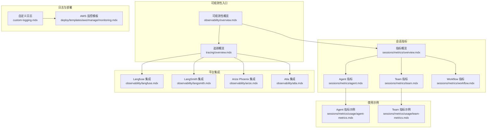
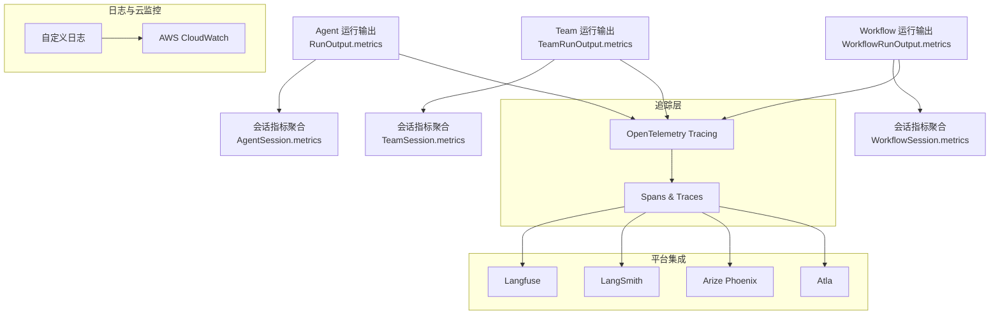
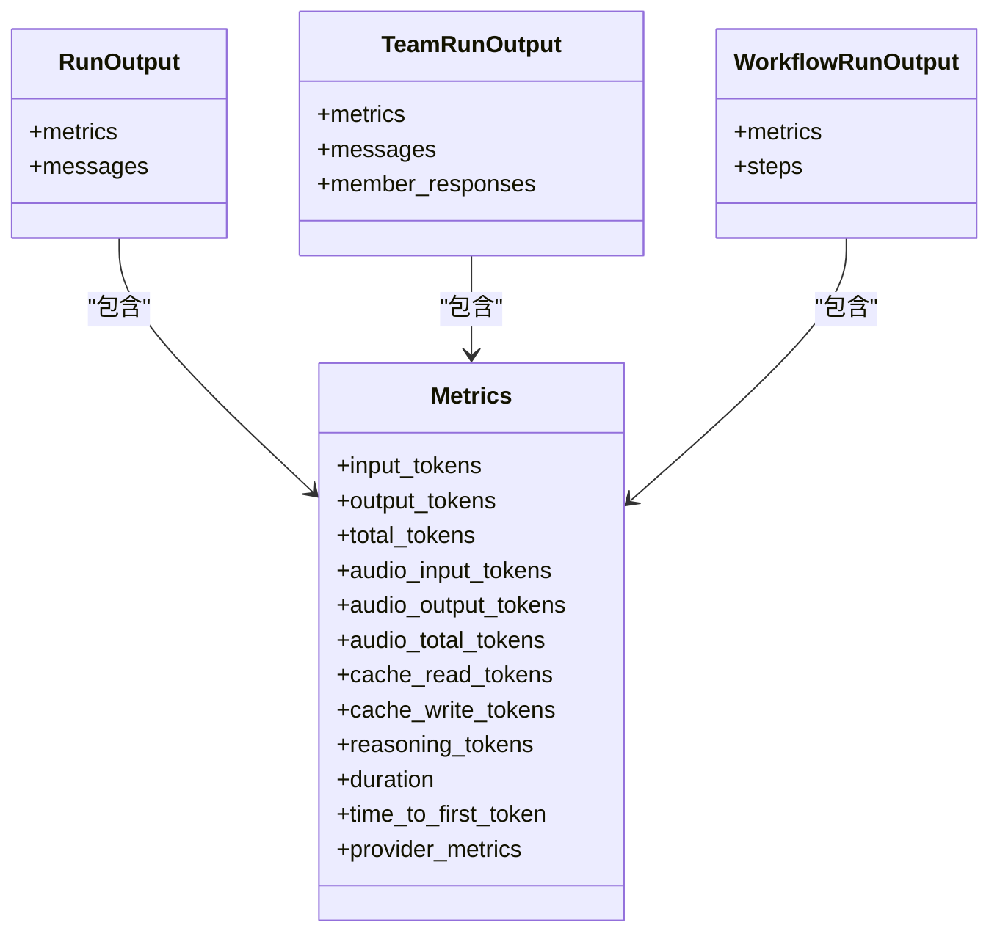
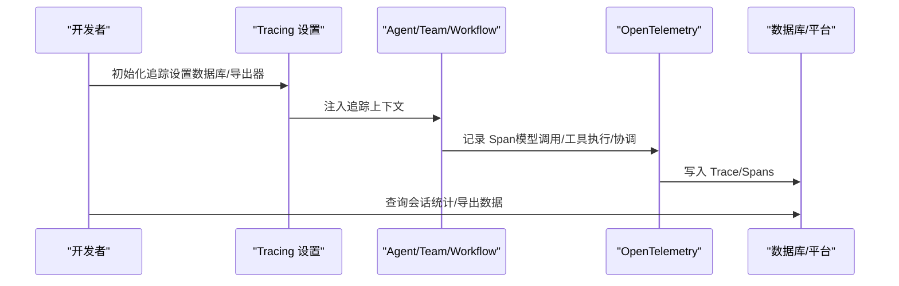
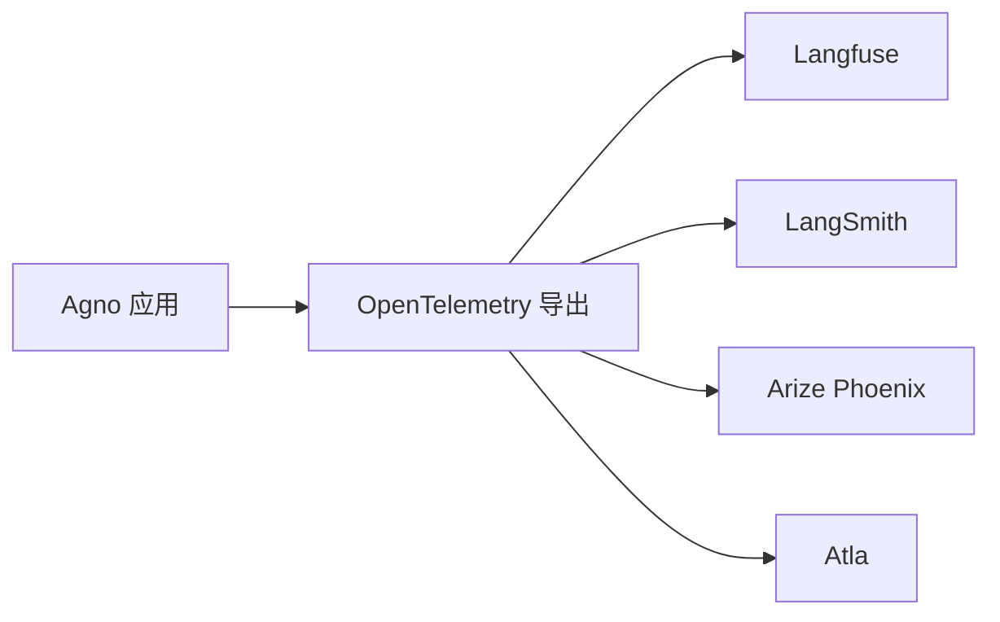
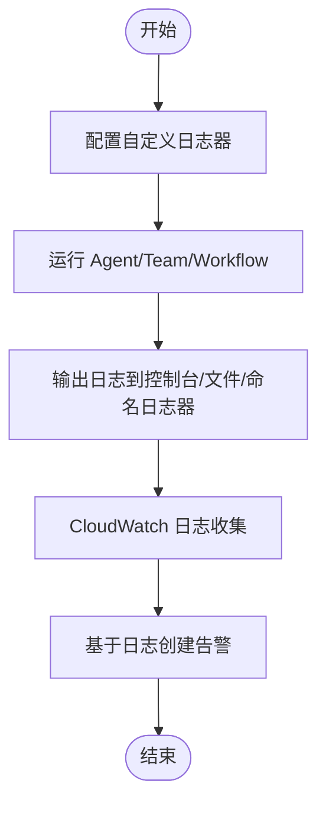
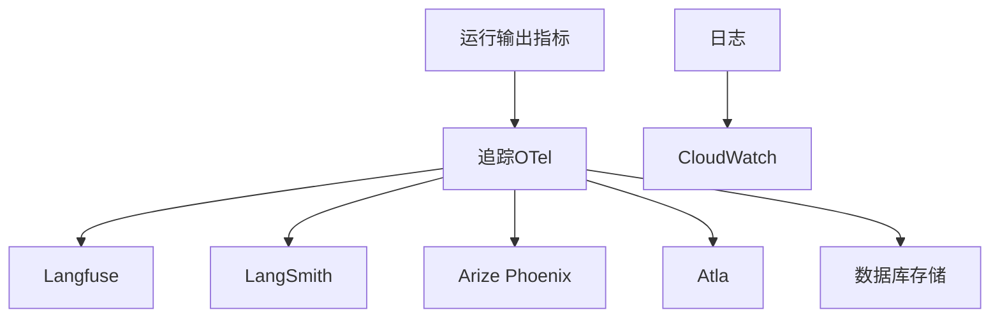

# 监控指标

<cite>
**本文引用的文件**
- [observability/overview.mdx](file://observability/overview.mdx)
- [tracing/overview.mdx](file://tracing/overview.mdx)
- [sessions/metrics/overview.mdx](file://sessions/metrics/overview.mdx)
- [sessions/metrics/agent.mdx](file://sessions/metrics/agent.mdx)
- [sessions/metrics/team.mdx](file://sessions/metrics/team.mdx)
- [sessions/metrics/workflow.mdx](file://sessions/metrics/workflow.mdx)
- [sessions/metrics/usage/agent-metrics.mdx](file://sessions/metrics/usage/agent-metrics.mdx)
- [sessions/metrics/usage/team-metrics.mdx](file://sessions/metrics/usage/team-metrics.mdx)
- [observability/langfuse.mdx](file://observability/langfuse.mdx)
- [observability/langsmith.mdx](file://observability/langsmith.mdx)
- [observability/arize.mdx](file://observability/arize.mdx)
- [observability/atla.mdx](file://observability/atla.mdx)
- [custom-logging.mdx](file://custom-logging.mdx)
- [deploy/templates/aws/manage/monitoring.mdx](file://deploy/templates/aws/manage/monitoring.mdx)
- [performance.mdx](file://performance.mdx)
- [evals/performance/overview.mdx](file://evals/performance/overview.mdx)
- [evals/reliability/overview.mdx](file://evals/reliability/overview.mdx)
- [evals/accuracy/overview.mdx](file://evals/accuracy/overview.mdx)
- [reference-api/schema/traces/get-trace-statistics-by-session.mdx](file://reference-api/schema/traces/get-trace-statistics-by-session.mdx)
</cite>

## 目录
1. [引言](#引言)
2. [项目结构](#项目结构)
3. [核心组件](#核心组件)
4. [架构总览](#架构总览)
5. [详细组件分析](#详细组件分析)
6. [依赖关系分析](#依赖关系分析)
7. [性能考量](#性能考量)
8. [故障排查指南](#故障排查指南)
9. [结论](#结论)
10. [附录](#附录)

## 引言
本技术文档围绕可观测性中的“监控指标”主题，系统阐述在 Agno 生态中如何定义、采集、分析与应用监控指标，以支撑性能优化、容量规划与稳定性保障。文档覆盖以下方面：
- 指标分类：性能指标、使用统计、错误率、用户体验指标
- 指标定义、采集频率与存储策略
- 关键性能指标（KPI）的计算方法与阈值设定
- 基于指标的性能优化与容量规划实践
- 实际指标配置示例、仪表板与告警建议
- 指标数据的长期存储与趋势分析

## 项目结构
本仓库提供了可观测性的多条路径：会话级运行指标（Agent/Team/Workflow）、分布式追踪（OpenTelemetry）、第三方平台集成（Langfuse/LangSmith/Arize Phoenix/Atla），以及日志与云监控模板。

**图表来源**
- [observability/overview.mdx](file://observability/overview.mdx)
- [tracing/overview.mdx](file://tracing/overview.mdx)
- [sessions/metrics/overview.mdx](file://sessions/metrics/overview.mdx)
- [sessions/metrics/agent.mdx](file://sessions/metrics/agent.mdx)
- [sessions/metrics/team.mdx](file://sessions/metrics/team.mdx)
- [sessions/metrics/workflow.mdx](file://sessions/metrics/workflow.mdx)
- [sessions/metrics/usage/agent-metrics.mdx](file://sessions/metrics/usage/agent-metrics.mdx)
- [sessions/metrics/usage/team-metrics.mdx](file://sessions/metrics/usage/team-metrics.mdx)
- [observability/langfuse.mdx](file://observability/langfuse.mdx)
- [observability/langsmith.mdx](file://observability/langsmith.mdx)
- [observability/arize.mdx](file://observability/arize.mdx)
- [observability/atla.mdx](file://observability/atla.mdx)
- [custom-logging.mdx](file://custom-logging.mdx)
- [deploy/templates/aws/manage/monitoring.mdx](file://deploy/templates/aws/manage/monitoring.mdx)

**章节来源**
- [observability/overview.mdx](file://observability/overview.mdx)
- [tracing/overview.mdx](file://tracing/overview.mdx)
- [sessions/metrics/overview.mdx](file://sessions/metrics/overview.mdx)

## 核心组件
- 会话指标（Agent/Team/Workflow）
  - 提供消息级、运行级、会话级聚合指标，覆盖 token 使用、时延、首 token 时间等关键维度。
  - 支持按会话获取聚合指标，便于趋势分析与报表生成。
- 分布式追踪（OpenTelemetry）
  - 自动捕获 Agent/Team/Workflow 的执行轨迹，支持导出到 Arize Phoenix、Langfuse、LangSmith 等平台。
  - 数据可落库查询，亦可对接外部平台进行可视化与告警。
- 平台集成
  - Langfuse/LangSmith/Arize Phoenix/Atla 提供开箱即用的观测平台能力，便于统一管理与分析。
- 日志与云监控
  - 自定义日志器配置，支持文件与命名日志器；AWS 模板提供 CloudWatch 日志查看与告警示例。

**章节来源**
- [sessions/metrics/agent.mdx](file://sessions/metrics/agent.mdx)
- [sessions/metrics/team.mdx](file://sessions/metrics/team.mdx)
- [sessions/metrics/workflow.mdx](file://sessions/metrics/workflow.mdx)
- [tracing/overview.mdx](file://tracing/overview.mdx)
- [observability/langfuse.mdx](file://observability/langfuse.mdx)
- [observability/langsmith.mdx](file://observability/langsmith.mdx)
- [observability/arize.mdx](file://observability/arize.mdx)
- [observability/atla.mdx](file://observability/atla.mdx)
- [custom-logging.mdx](file://custom-logging.mdx)
- [deploy/templates/aws/manage/monitoring.mdx](file://deploy/templates/aws/manage/monitoring.mdx)

## 架构总览
下图展示从“运行输出指标”到“追踪与平台集成”的整体链路，以及“日志与云监控”作为补充观测手段：

**图表来源**
- [sessions/metrics/agent.mdx](file://sessions/metrics/agent.mdx)
- [sessions/metrics/team.mdx](file://sessions/metrics/team.mdx)
- [sessions/metrics/workflow.mdx](file://sessions/metrics/workflow.mdx)
- [tracing/overview.mdx](file://tracing/overview.mdx)
- [observability/langfuse.mdx](file://observability/langfuse.mdx)
- [observability/langsmith.mdx](file://observability/langsmith.mdx)
- [observability/arize.mdx](file://observability/arize.mdx)
- [observability/atla.mdx](file://observability/atla.mdx)
- [custom-logging.mdx](file://custom-logging.mdx)
- [deploy/templates/aws/manage/monitoring.mdx](file://deploy/templates/aws/manage/monitoring.mdx)

## 详细组件分析

### 会话指标（Agent/Team/Workflow）
- Agent 指标
  - 覆盖输入/输出/音频 token、缓存读写 token、推理 token、总 token、时延、首 token 时间、提供商特定指标等。
  - 支持消息级、运行级、会话级聚合，便于分层分析。
- Team 指标
  - 在 Agent 指标基础上，增加成员级指标与团队级聚合，支持开启成员响应存储以便分析成员表现。
- Workflow 指标
  - 包含工作流总时长与步骤级指标（执行器类型/名称、时延、token 等），并提供会话级聚合用于长期趋势分析。

**图表来源**
- [sessions/metrics/agent.mdx](file://sessions/metrics/agent.mdx)
- [sessions/metrics/team.mdx](file://sessions/metrics/team.mdx)
- [sessions/metrics/workflow.mdx](file://sessions/metrics/workflow.mdx)

**章节来源**
- [sessions/metrics/agent.mdx](file://sessions/metrics/agent.mdx)
- [sessions/metrics/team.mdx](file://sessions/metrics/team.mdx)
- [sessions/metrics/workflow.mdx](file://sessions/metrics/workflow.mdx)

### 分布式追踪（OpenTelemetry）
- 自动捕获 Agent/Team/Workflow 的执行细节，形成 Trace 与 Span，支持数据库存储与外部平台导出。
- 可通过 API 查询会话级统计信息，便于构建仪表板与告警。

**图表来源**
- [tracing/overview.mdx](file://tracing/overview.mdx)
- [reference-api/schema/traces/get-trace-statistics-by-session.mdx](file://reference-api/schema/traces/get-trace-statistics-by-session.mdx)

**章节来源**
- [tracing/overview.mdx](file://tracing/overview.mdx)
- [reference-api/schema/traces/get-trace-statistics-by-session.mdx](file://reference-api/schema/traces/get-trace-statistics-by-session.mdx)

### 平台集成（Langfuse/LangSmith/Arize Phoenix/Atla）
- Langfuse/LangSmith：通过 OpenInference/OpenLIT 将追踪发送至云端平台，支持调试、成本跟踪与行为分析。
- Arize Phoenix：本地或云端部署，提供可视化与分析能力。
- Atla：面向 AI Agent 的实时监控、自动化评估与性能分析平台。

**图表来源**
- [observability/langfuse.mdx](file://observability/langfuse.mdx)
- [observability/langsmith.mdx](file://observability/langsmith.mdx)
- [observability/arize.mdx](file://observability/arize.mdx)
- [observability/atla.mdx](file://observability/atla.mdx)

**章节来源**
- [observability/langfuse.mdx](file://observability/langfuse.mdx)
- [observability/langsmith.mdx](file://observability/langsmith.mdx)
- [observability/arize.mdx](file://observability/arize.mdx)
- [observability/atla.mdx](file://observability/atla.mdx)

### 日志与云监控
- 自定义日志：支持为 Agent/Team/Workflow 配置不同日志器，或使用命名日志器自动识别组件类型。
- AWS 模板：提供 CloudWatch 日志查看、健康检查验证、任务失败告警示例与保留策略配置。

**图表来源**
- [custom-logging.mdx](file://custom-logging.mdx)
- [deploy/templates/aws/manage/monitoring.mdx](file://deploy/templates/aws/manage/monitoring.mdx)

**章节来源**
- [custom-logging.mdx](file://custom-logging.mdx)
- [deploy/templates/aws/manage/monitoring.mdx](file://deploy/templates/aws/manage/monitoring.mdx)

## 依赖关系分析
- 组件耦合
  - 会话指标与运行输出强相关，是后续追踪与平台集成的数据基础。
  - 追踪层对运行输出无侵入，通过 OpenTelemetry 自动注入。
  - 平台集成依赖追踪导出能力，形成“追踪 → 平台”的解耦链路。
- 外部依赖
  - OpenTelemetry 生态（导出器、SDK）
  - 第三方观测平台（Langfuse/LangSmith/Arize Phoenix/Atla）
  - 云服务（AWS CloudWatch）

**图表来源**
- [sessions/metrics/agent.mdx](file://sessions/metrics/agent.mdx)
- [tracing/overview.mdx](file://tracing/overview.mdx)
- [observability/langfuse.mdx](file://observability/langfuse.mdx)
- [observability/langsmith.mdx](file://observability/langsmith.mdx)
- [observability/arize.mdx](file://observability/arize.mdx)
- [observability/atla.mdx](file://observability/atla.mdx)
- [custom-logging.mdx](file://custom-logging.mdx)
- [deploy/templates/aws/manage/monitoring.mdx](file://deploy/templates/aws/manage/monitoring.mdx)

**章节来源**
- [sessions/metrics/agent.mdx](file://sessions/metrics/agent.mdx)
- [tracing/overview.mdx](file://tracing/overview.mdx)
- [observability/langfuse.mdx](file://observability/langfuse.mdx)
- [observability/langsmith.mdx](file://observability/langsmith.mdx)
- [observability/arize.mdx](file://observability/arize.mdx)
- [observability/atla.mdx](file://observability/atla.mdx)
- [custom-logging.mdx](file://custom-logging.mdx)
- [deploy/templates/aws/manage/monitoring.mdx](file://deploy/templates/aws/manage/monitoring.mdx)

## 性能考量
- 指标采集频率
  - 会话指标：按会话聚合，适合周期性汇总与报表生成。
  - 追踪：非阻塞、零代码注入，适合全量采集与离线分析。
- 存储策略
  - 会话指标：轻量结构，适合长期归档与趋势分析。
  - 追踪：可落库或导出至平台，结合保留策略平衡成本与可用性。
- 性能基准
  - 提供实例化时间与内存占用的基准对比，强调最小化开销与并行化工具调用。

**章节来源**
- [performance.mdx](file://performance.mdx)
- [evals/performance/overview.mdx](file://evals/performance/overview.mdx)

## 故障排查指南
- 追踪与日志联动
  - 使用追踪定位异常 Span，结合日志快速定位问题根因。
- AWS 监控
  - 通过 CloudWatch 日志过滤错误模式，结合任务失败告警实现主动预警。
- 自定义日志
  - 为不同组件配置独立日志器，便于分域排查。

**章节来源**
- [tracing/overview.mdx](file://tracing/overview.mdx)
- [custom-logging.mdx](file://custom-logging.mdx)
- [deploy/templates/aws/manage/monitoring.mdx](file://deploy/templates/aws/manage/monitoring.mdx)

## 结论
通过“会话指标 + 分布式追踪 + 平台集成 + 日志与云监控”的组合，Agno 能够提供端到端的可观测性方案。建议以会话指标为基础，结合追踪与平台能力进行深度分析，并以日志与云监控作为补充，最终实现以指标驱动的性能优化与容量规划。

## 附录

### 指标分类与定义
- 性能指标
  - 时延（duration）、首 token 时间（time_to_first_token）
  - 步骤级时延（Workflow）
- 使用统计
  - 输入/输出/音频/推理 token、缓存读写 token、总 token
- 错误率
  - 基于追踪与日志的异常检测与告警
- 用户体验指标
  - 首 token 时间、总时延、工具调用成功率

**章节来源**
- [sessions/metrics/agent.mdx](file://sessions/metrics/agent.mdx)
- [sessions/metrics/team.mdx](file://sessions/metrics/team.mdx)
- [sessions/metrics/workflow.mdx](file://sessions/metrics/workflow.mdx)

### KPI 计算与阈值建议
- KPI 示例
  - 平均时延（秒）= 会话内所有运行/步骤时延均值
  - 平均首 token 时间（秒）= 会话内首 token 时间均值
  - Token 效率 = 总 token / 工具调用次数（衡量工具使用效率）
- 阈值设定
  - 时延：P95 ≤ X 秒（依据业务 SLA）
  - 首 token：P95 ≤ Y 秒
  - 错误率：≤ Z%
  - Token 成本：单位请求成本 ≤ C

[本节为通用指导，不直接分析具体文件]

### 采集频率与存储策略
- 采集频率
  - 会话指标：每会话一次聚合
  - 追踪：实时采集，批量导出
- 存储策略
  - 短期：平台/数据库高可用存储
  - 长期：冷热分层，压缩归档，保留策略按合规要求设定

[本节为通用指导，不直接分析具体文件]

### 实际配置示例与仪表板建议
- 会话指标示例
  - Agent/Team 指标示例脚本展示了如何打印消息级、运行级与会话级指标。
- 仪表板建议
  - 时延趋势（折线图）、Token 使用分布（柱状图）、错误率（面积图）、首 token 分布（直方图）

**章节来源**
- [sessions/metrics/usage/agent-metrics.mdx](file://sessions/metrics/usage/agent-metrics.mdx)
- [sessions/metrics/usage/team-metrics.mdx](file://sessions/metrics/usage/team-metrics.mdx)

### 告警规则与通知机制
- 告警规则
  - 时延 P95 超过阈值
  - 首 token 时间异常升高
  - 错误率连续 N 次超过阈值
  - Token 成本异常波动
- 通知机制
  - 云监控告警（如 AWS CloudWatch）与平台集成（如 Atla/LangSmith）联动

**章节来源**
- [deploy/templates/aws/manage/monitoring.mdx](file://deploy/templates/aws/manage/monitoring.mdx)
- [observability/atla.mdx](file://observability/atla.mdx)
- [observability/langsmith.mdx](file://observability/langsmith.mdx)

### 长期存储与趋势分析
- 长期存储
  - 会话指标与追踪数据均可落库或导出至平台，结合保留策略实现长期保存。
- 趋势分析
  - 基于会话指标的周/月聚合，结合平台可视化能力进行趋势分析与容量预测。

**章节来源**
- [sessions/metrics/overview.mdx](file://sessions/metrics/overview.mdx)
- [tracing/overview.mdx](file://tracing/overview.mdx)