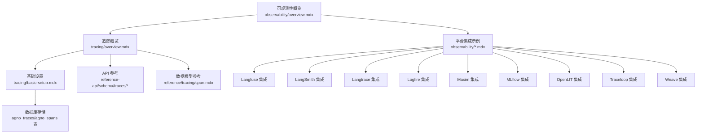
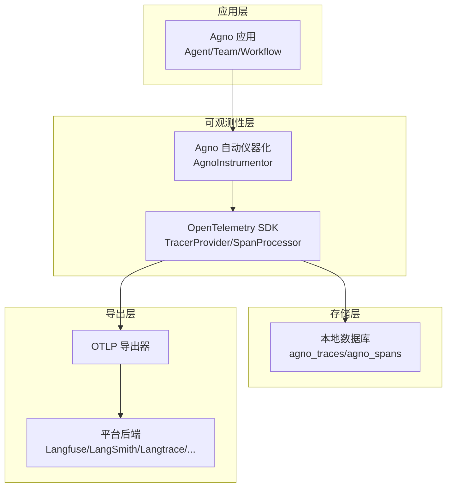
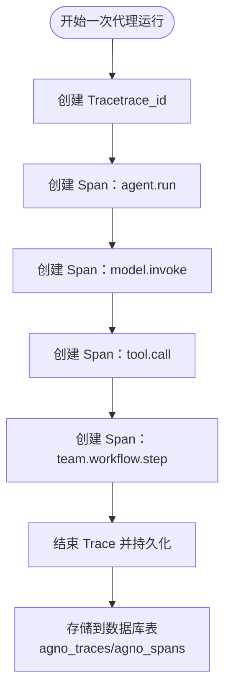
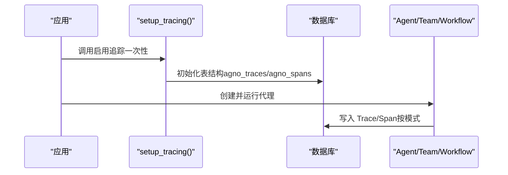
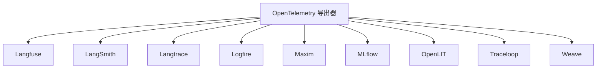
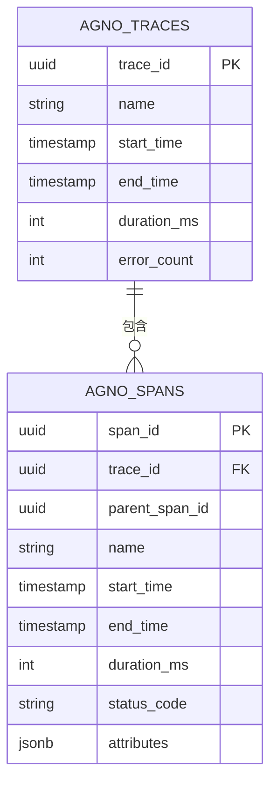
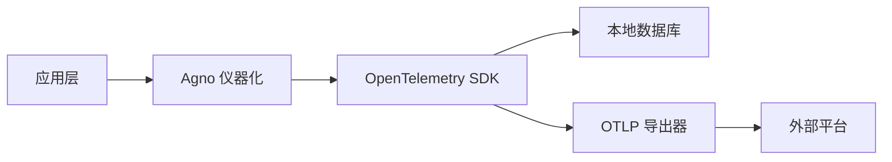

# 观察性基础概念

<cite>
**本文引用的文件**
- [observability/overview.mdx](file://observability/overview.mdx)
- [tracing/overview.mdx](file://tracing/overview.mdx)
- [tracing/basic-setup.mdx](file://tracing/basic-setup.mdx)
- [observability/langfuse.mdx](file://observability/langfuse.mdx)
- [observability/langsmith.mdx](file://observability/langsmith.mdx)
- [observability/langtrace.mdx](file://observability/langtrace.mdx)
- [observability/logfire.mdx](file://observability/logfire.mdx)
- [observability/maxim.mdx](file://observability/maxim.mdx)
- [observability/mlflow.mdx](file://observability/mlflow.mdx)
- [observability/openlit.mdx](file://observability/openlit.mdx)
- [observability/traceloop.mdx](file://observability/traceloop.mdx)
- [observability/weave.mdx](file://observability/weave.mdx)
- [TBD/pages/cookbook/observability/overview.mdx](file://TBD/pages/cookbook/observability/overview.mdx)
- [telemetry.mdx](file://telemetry.mdx)
- [reference/tracing/span.mdx](file://reference/tracing/span.mdx)
- [reference-api/schema/traces/list-traces.mdx](file://reference-api/schema/traces/list-traces.mdx)
- [reference-api/schema/traces/get-trace-or-span-detail.mdx](file://reference-api/schema/traces/get-trace-or-span-detail.mdx)
- [reference-api/schema/traces/search-traces-with-advanced-filters.mdx](file://reference-api/schema/traces/search-traces-with-advanced-filters.mdx)
</cite>

## 目录
1. [引言](#引言)
2. [项目结构](#项目结构)
3. [核心组件](#核心组件)
4. [架构总览](#架构总览)
5. [详细组件分析](#详细组件分析)
6. [依赖关系分析](#依赖关系分析)
7. [性能考量](#性能考量)
8. [故障排查指南](#故障排查指南)
9. [结论](#结论)
10. [附录](#附录)

## 引言
本文件系统性阐述 Agno 的可观测性基础概念与实现方式，重点说明在 AI 应用中引入可观测性的价值：通过监控、追踪与调试，帮助理解代理执行流程、跟踪性能与使用情况、并快速定位问题。Agno 基于 OpenTelemetry 提供原生支持，覆盖自动仪器化、灵活导出与可扩展的自定义追踪能力，并兼容多种主流后端平台。

## 项目结构
围绕可观测性的内容主要分布在以下路径：
- 概览与总览：observability/overview.mdx、tracing/overview.mdx
- 快速上手与配置：tracing/basic-setup.mdx
- 各平台集成示例：observability/*.mdx（如 langfuse、langsmith、langtrace、logfire、maxim、mlflow、openlit、traceloop、weave）
- 教程与示例集合：TBD/pages/cookbook/observability/overview.mdx
- 平台遥测控制：telemetry.mdx
- 数据模型与查询接口：reference/tracing/span.mdx、reference-api/schema/traces/*

**图示来源**
- [observability/overview.mdx:1-25](file://observability/overview.mdx#L1-L25)
- [tracing/overview.mdx:1-158](file://tracing/overview.mdx#L1-L158)
- [tracing/basic-setup.mdx:1-233](file://tracing/basic-setup.mdx#L1-L233)

**章节来源**
- [observability/overview.mdx:1-25](file://observability/overview.mdx#L1-L25)
- [tracing/overview.mdx:1-158](file://tracing/overview.mdx#L1-L158)

## 核心组件
- OpenTelemetry 支持：Agno 将 OpenTelemetry 作为分布式追踪与可观测性的行业标准，提供自动仪器化、灵活导出与可定制追踪能力。
- 追踪系统：自动捕获代理运行、模型调用、工具执行、团队与工作流操作等关键事件，形成 Trace 与 Span 的层次结构。
- 数据存储：默认将追踪数据写入本地数据库（SQLite/PostgreSQL 等），也可同时导出到外部平台。
- 平台集成：内置对 Arize Phoenix、Langfuse、LangSmith、Langtrace、Logfire、Maxim、MLflow、OpenLIT、Traceloop、Weave 等后端的支持。

**章节来源**
- [observability/overview.mdx:7-23](file://observability/overview.mdx#L7-L23)
- [tracing/overview.mdx:23-89](file://tracing/overview.mdx#L23-L89)

## 架构总览
下图展示 Agno 可观测性在系统中的位置与交互关系：应用层通过 OpenTelemetry 自动仪器化，生成 Trace/Span；这些数据既可落库用于本地分析，也可经由 OTLP 导出器发送至外部平台进行可视化与分析。

**图示来源**
- [tracing/overview.mdx:17-87](file://tracing/overview.mdx#L17-L87)
- [observability/langfuse.mdx:36-79](file://observability/langfuse.mdx#L36-L79)
- [observability/langsmith.mdx:36-80](file://observability/langsmith.mdx#L36-L80)

## 详细组件分析

### 组件一：追踪与 Span 概念
- Trace：一次完整的代理执行，从开始到结束，具有唯一 trace_id。
- Span：Trace 内的一个具体操作，具备父子层级关系，记录操作名、时间戳、上下文、关系与元数据。
- 自动捕获范围：代理运行、模型调用、工具执行、团队与工作流协调等。

**图示来源**
- [tracing/overview.mdx:39-89](file://tracing/overview.mdx#L39-L89)

**章节来源**
- [tracing/overview.mdx:39-89](file://tracing/overview.mdx#L39-L89)

### 组件二：基础设置与数据库存储
- 安装依赖：OpenTelemetry API/SDK 与 Agno 专用仪器化包。
- 启用追踪：通过 SDK 或 AgentOS 参数启用；推荐在应用启动时调用一次。
- 存储策略：建议使用独立数据库集中存放所有 Trace/Span，便于跨代理查询与分析。
- 处理模式：批量处理（生产）与简单处理（开发）两种模式，权衡延迟与性能。

**图示来源**
- [tracing/basic-setup.mdx:21-95](file://tracing/basic-setup.mdx#L21-L95)

**章节来源**
- [tracing/basic-setup.mdx:9-233](file://tracing/basic-setup.mdx#L9-L233)

### 组件三：平台集成与导出
- Arize Phoenix：支持本地或云端部署，可通过 OpenInference 与 OTLP 导出。
- Langfuse：支持 OpenInference 与 OpenLIT 两种方式，配置 OTLP 端点与认证头。
- LangSmith：通过环境变量配置 API Key、端点与项目，启用 OTLP 导出。
- Langtrace：使用 Langtrace SDK 初始化，自动追踪代理执行。
- Logfire：通过 OpenInference 与 OTLP 导出，配置写入令牌与区域端点。
- Maxim：一行集成，自动追踪与日志，支持多代理系统。
- MLflow：通过 `mlflow.agno.autolog()` 自动采集 OpenTelemetry 原生追踪。
- OpenLIT：自托管 OpenTelemetry 原生平台，支持 CLI 与代码初始化。
- Traceloop：基于 OpenLLMetry 扩展，支持装饰器组织自定义工作流。
- Weave：通过装饰器记录模型调用，适合轻量级日志与可视化。

**图示来源**
- [observability/langfuse.mdx:36-79](file://observability/langfuse.mdx#L36-L79)
- [observability/langsmith.mdx:36-80](file://observability/langsmith.mdx#L36-L80)
- [observability/langtrace.mdx:35-58](file://observability/langtrace.mdx#L35-L58)
- [observability/logfire.mdx:35-69](file://observability/logfire.mdx#L35-L69)
- [observability/maxim.mdx:44-77](file://observability/maxim.mdx#L44-L77)
- [observability/mlflow.mdx:54-75](file://observability/mlflow.mdx#L54-L75)
- [observability/openlit.mdx:54-152](file://observability/openlit.mdx#L54-L152)
- [observability/traceloop.mdx:35-179](file://observability/traceloop.mdx#L35-L179)
- [observability/weave.mdx:26-48](file://observability/weave.mdx#L26-L48)

**章节来源**
- [observability/langfuse.mdx:1-133](file://observability/langfuse.mdx#L1-L133)
- [observability/langsmith.mdx:1-87](file://observability/langsmith.mdx#L1-L87)
- [observability/langtrace.mdx:1-65](file://observability/langtrace.mdx#L1-L65)
- [observability/logfire.mdx:1-82](file://observability/logfire.mdx#L1-L82)
- [observability/maxim.mdx:1-205](file://observability/maxim.mdx#L1-L205)
- [observability/mlflow.mdx:1-135](file://observability/mlflow.mdx#L1-L135)
- [observability/openlit.mdx:1-257](file://observability/openlit.mdx#L1-L257)
- [observability/traceloop.mdx:1-187](file://observability/traceloop.mdx#L1-L187)
- [observability/weave.mdx:1-56](file://observability/weave.mdx#L1-L56)

### 组件四：教程与示例集合
- 平台示例清单：涵盖 Langfuse、Arize Phoenix、AgentOps、LangSmith、Langtrace、Langwatch、Logfire、Weave、Opik、Maxim、Atla 等平台的示例文件。
- 运行指引：提供克隆仓库、安装依赖、设置密钥与运行示例的步骤。

**章节来源**
- [TBD/pages/cookbook/observability/overview.mdx:36-213](file://TBD/pages/cookbook/observability/overview.mdx#L36-L213)

### 组件五：数据模型与查询接口
- 数据模型：Span 包含 trace_id、parent_span_id、operation 名称、时间戳、状态码、属性（如 token 使用）等字段。
- 查询接口：提供列出 Trace、获取 Trace/Spans 详情、高级过滤搜索等 API。

**图示来源**
- [tracing/overview.mdx:165-169](file://tracing/overview.mdx#L165-L169)
- [reference/tracing/span.mdx:86-122](file://reference/tracing/span.mdx#L86-L122)

**章节来源**
- [reference/tracing/span.mdx:86-122](file://reference/tracing/span.mdx#L86-L122)
- [reference-api/schema/traces/list-traces.mdx:1-3](file://reference-api/schema/traces/list-traces.mdx#L1-L3)
- [reference-api/schema/traces/get-trace-or-span-detail.mdx:1-3](file://reference-api/schema/traces/get-trace-or-span-detail.mdx#L1-L3)
- [reference-api/schema/traces/search-traces-with-advanced-filters.mdx:1-3](file://reference-api/schema/traces/search-traces-with-advanced-filters.mdx#L1-L3)

## 依赖关系分析
- 低耦合：应用层仅需一次启用追踪，后续自动捕获；导出层通过 OTLP 与平台解耦。
- 外部依赖：各平台通过环境变量或 SDK 初始化，再由 OpenTelemetry 导出器统一发送。
- 数据一致性：Trace/Span 通过唯一标识关联，确保跨平台与本地查询的一致性。

**图示来源**
- [tracing/basic-setup.mdx:21-95](file://tracing/basic-setup.mdx#L21-L95)
- [observability/mlflow.mdx:54-75](file://observability/mlflow.mdx#L54-L75)

**章节来源**
- [tracing/basic-setup.mdx:21-95](file://tracing/basic-setup.mdx#L21-L95)
- [observability/mlflow.mdx:54-75](file://observability/mlflow.mdx#L54-L75)

## 性能考量
- 批量处理：生产环境建议开启批量处理，降低数据库写入压力，减少对代理执行的性能影响。
- 即时处理：开发/调试阶段可使用简单处理模式，以便立即看到 Trace。
- 独立数据库：将追踪数据与业务数据分离，避免相互影响，便于独立扩展与查询。

**章节来源**
- [tracing/basic-setup.mdx:173-221](file://tracing/basic-setup.mdx#L173-L221)

## 故障排查指南
- 确认已正确安装 OpenTelemetry 与 Agno 仪器化依赖，并在创建代理前调用启用函数。
- 检查导出端点与认证信息（如 OTLP 端点、API Key、写入令牌等）是否正确配置。
- 若未看到 Trace，确认是否启用了批量处理且尚未达到导出阈值；必要时切换到简单处理模式验证。
- 如需本地验证，可使用平台提供的本地部署或开发模式（如 OpenLIT 控制台输出、MLflow 本地服务器）。

**章节来源**
- [observability/langfuse.mdx:125-133](file://observability/langfuse.mdx#L125-L133)
- [observability/langsmith.mdx:82-87](file://observability/langsmith.mdx#L82-L87)
- [observability/logfire.mdx:72-81](file://observability/logfire.mdx#L72-L81)
- [observability/openlit.mdx:246-257](file://observability/openlit.mdx#L246-L257)
- [observability/mlflow.mdx:77-87](file://observability/mlflow.mdx#L77-L87)

## 结论
Agno 的可观测性以 OpenTelemetry 为核心，结合自动仪器化、灵活导出与可扩展的追踪能力，既能满足本地数据库存储与查询，又能无缝对接多种外部平台。通过 Trace/Span 的结构化数据，开发者可以深入理解代理行为、优化性能、追踪成本与使用情况，并快速定位问题。建议在生产环境采用批量处理与独立数据库策略，在开发阶段使用简单处理与本地导出来加速迭代。

## 附录

### OpenTelemetry 兼容后端一览与支持情况
- Arize Phoenix：支持 OpenInference 与 OTLP 导出，支持本地与云端部署。
- Langfuse：支持 OpenInference 与 OpenLIT，提供多区域端点与认证方式。
- LangSmith：通过环境变量配置 API Key、端点与项目，启用 OTLP 导出。
- Langtrace：使用 Langtrace SDK 初始化，自动追踪代理执行。
- Logfire：通过 OpenInference 与 OTLP 导出，支持多区域端点与写入令牌。
- Maxim：一行集成，自动追踪与日志，支持多代理系统与评估功能。
- MLflow：通过 `mlflow.agno.autolog()` 自动采集 OpenTelemetry 原生追踪。
- OpenLIT：自托管 OpenTelemetry 原生平台，支持 CLI 与代码初始化。
- Traceloop：基于 OpenLLMetry 扩展，支持装饰器组织自定义工作流。
- Weave：通过装饰器记录模型调用，适合轻量级日志与可视化。

**章节来源**
- [observability/overview.mdx:21-23](file://observability/overview.mdx#L21-L23)
- [TBD/pages/cookbook/observability/overview.mdx:181-196](file://TBD/pages/cookbook/observability/overview.mdx#L181-L196)

### 实际配置示例与最佳实践
- 基础设置：安装依赖、启用追踪、创建代理并运行，随后查询 Trace/Span。
- 平台集成：根据目标平台设置环境变量与端点，初始化对应 SDK 或导出器，即可自动发送追踪数据。
- 最佳实践：生产使用批量处理与独立数据库；开发使用简单处理与本地导出；确保在创建代理前完成初始化；合理设置队列大小与导出批次以平衡性能与延迟。

**章节来源**
- [tracing/basic-setup.mdx:9-131](file://tracing/basic-setup.mdx#L9-L131)
- [observability/langfuse.mdx:25-79](file://observability/langfuse.mdx#L25-L79)
- [observability/langsmith.mdx:17-80](file://observability/langsmith.mdx#L17-L80)
- [observability/maxim.mdx:32-77](file://observability/maxim.mdx#L32-L77)
- [observability/mlflow.mdx:36-75](file://observability/mlflow.mdx#L36-L75)
- [observability/openlit.mdx:40-152](file://observability/openlit.mdx#L40-L152)