# 观察性系统

<cite>
**本文引用的文件**
- [observability/overview.mdx](file://observability/overview.mdx)
- [observability/agentops.mdx](file://observability/agentops.mdx)
- [observability/arize.mdx](file://observability/arize.mdx)
- [observability/langfuse.mdx](file://observability/langfuse.mdx)
- [observability/langsmith.mdx](file://observability/langsmith.mdx)
- [observability/langtrace.mdx](file://observability/langtrace.mdx)
- [observability/logfire.mdx](file://observability/logfire.mdx)
- [observability/maxim.mdx](file://observability/maxim.mdx)
- [observability/mlflow.mdx](file://observability/mlflow.mdx)
- [observability/openlit.mdx](file://observability/openlit.mdx)
- [tracing/overview.mdx](file://tracing/overview.mdx)
- [tracing/basic-setup.mdx](file://tracing/basic-setup.mdx)
- [custom-logging.mdx](file://custom-logging.mdx)
</cite>

## 目录
1. [引言](#引言)
2. [项目结构](#项目结构)
3. [核心组件](#核心组件)
4. [架构总览](#架构总览)
5. [详细组件分析](#详细组件分析)
6. [依赖关系分析](#依赖关系分析)
7. [性能考虑](#性能考虑)
8. [故障排查指南](#故障排查指南)
9. [结论](#结论)
10. [附录](#附录)

## 引言
本技术文档面向在 AI 应用中构建观察性系统的团队，系统性阐述可观测性的核心价值与实践路径。在复杂多智能体与工具协作场景下，仅靠会话记录难以完整还原执行全貌；通过分布式追踪、性能指标、使用统计、错误率与用户体验指标的采集与分析，可显著提升调试效率、定位性能瓶颈并持续优化系统表现。

Agno 提供两类观测能力：
- 基于 OpenTelemetry 的原生追踪（Tracing）：自动捕获 Agent/Team/Workflow 的运行轨迹，支持数据库存储与外部导出。
- 第三方平台集成：通过 OpenInference/OpenTelemetry 协议对接 Arize Phoenix、Langfuse、LangSmith、AgentOps、Maxim、MLflow、OpenLIT、Logfire、Langtrace 等平台，实现统一可视化与分析。

## 项目结构
与“观察性系统”直接相关的文档主要分布在以下位置：
- observability：第三方平台集成指南与概览
- tracing：Agno 自身的 OpenTelemetry 追踪能力与数据库存储
- custom-logging：自定义日志配置与输出策略

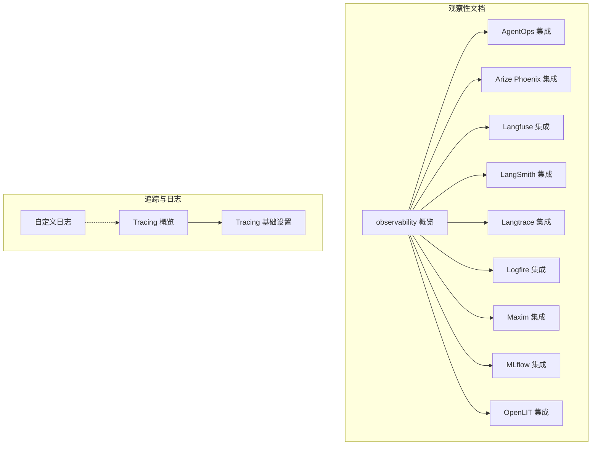

图表来源
- [observability/overview.mdx:1-25](file://observability/overview.mdx#L1-L25)
- [tracing/overview.mdx:1-158](file://tracing/overview.mdx#L1-L158)

章节来源
- [observability/overview.mdx:1-25](file://observability/overview.mdx#L1-L25)
- [tracing/overview.mdx:1-158](file://tracing/overview.mdx#L1-L158)

## 核心组件
- 分布式追踪（Tracing）
  - 以 OpenTelemetry 为核心，自动捕获 Agent/Team/Workflow 的执行轨迹（Trace/Span），支持本地数据库存储与外部导出。
  - 关键收益：调试、性能、成本跟踪、行为分析、审计留痕。
- 第三方平台集成
  - 通过 OpenInference/OpenTelemetry 协议，将 Agno 的追踪数据发送至 Arize Phoenix、Langfuse、LangSmith、AgentOps、Maxim、MLflow、OpenLIT、Logfire、Langtrace 等平台进行可视化与分析。
- 日志体系
  - 支持自定义日志器、文件输出、命名日志器等，满足结构化日志、错误日志与审计日志的多样化需求。

章节来源
- [tracing/overview.mdx:12-37](file://tracing/overview.mdx#L12-L37)
- [observability/overview.mdx:9-23](file://observability/overview.mdx#L9-L23)
- [custom-logging.mdx:8-11](file://custom-logging.mdx#L8-L11)

## 架构总览
下图展示了 Agno 在不同环境下的观察性架构：内部 Tracing 存储与外部平台导出两条路径并行，既保证数据主权，又便于接入生态工具。

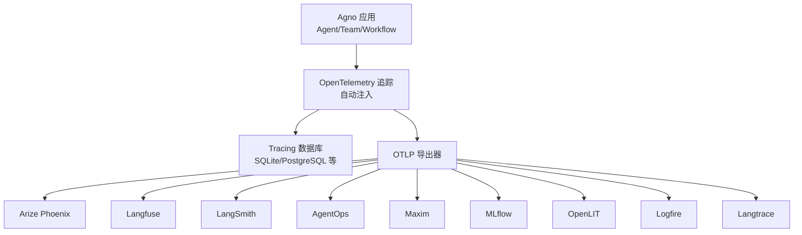

图表来源
- [observability/overview.mdx:14-23](file://observability/overview.mdx#L14-L23)
- [tracing/overview.mdx:17-89](file://tracing/overview.mdx#L17-L89)

## 详细组件分析

### 组件一：Tracing（分布式追踪）
- 能力概述
  - 基于 OpenTelemetry，自动捕获 Agent/Team/Workflow 的运行轨迹，包含模型调用、工具执行、成员交互等。
  - 数据以 Trace/Span 形式存储，支持数据库查询与过滤。
- 快速开始
  - 安装依赖后，在应用启动时调用 Tracing 初始化函数，即可对后续所有 Agent/Team/Workflow 自动追踪。
- 处理模式
  - 批量处理：适合生产，降低数据库写入压力，略有延迟。
  - 简单处理：适合开发调试，立即落库，轻微性能开销。
- 数据库设计
  - 自动生成高阶 Trace 表与细粒度 Span 表，包含 trace_id、parent_span_id、操作名、时间戳、上下文等字段。

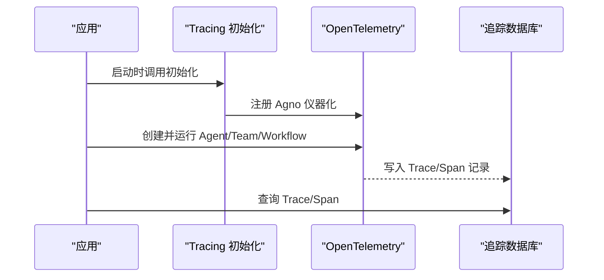

图表来源
- [tracing/basic-setup.mdx:21-95](file://tracing/basic-setup.mdx#L21-L95)
- [tracing/overview.mdx:81-131](file://tracing/overview.mdx#L81-L131)

章节来源
- [tracing/overview.mdx:12-131](file://tracing/overview.mdx#L12-L131)
- [tracing/basic-setup.mdx:21-221](file://tracing/basic-setup.mdx#L21-L221)

### 组件二：第三方平台集成（Arize Phoenix）
- 集成方式
  - 使用 OpenInference 与 Phoenix 注册器，自动注入并发送 Trace 至 Arize Phoenix。
  - 支持云端与本地 Collector（phoenix serve）两种部署形态。
- 关键步骤
  - 安装依赖、配置 API Key、设置 Collector Endpoint、注册 Tracer Provider、运行 Agent 并在平台查看 Trace。

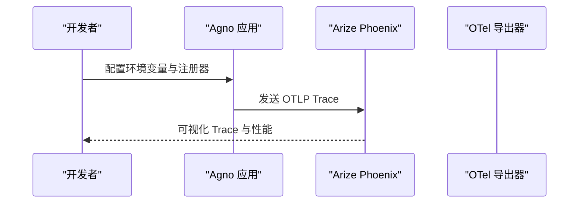

图表来源
- [observability/arize.mdx:33-115](file://observability/arize.mdx#L33-L115)

章节来源
- [observability/arize.mdx:1-122](file://observability/arize.mdx#L1-L122)

### 组件三：第三方平台集成（Langfuse）
- 集成方式
  - 通过 OpenInference 或 OpenLIT，结合 OTLP 导出器将 Trace 发送到 Langfuse。
  - 支持多区域端点与本地部署。
- 关键步骤
  - 安装依赖、配置公私钥、设置 OTLP 端点与头部、注册 Tracer Provider、运行 Agent。

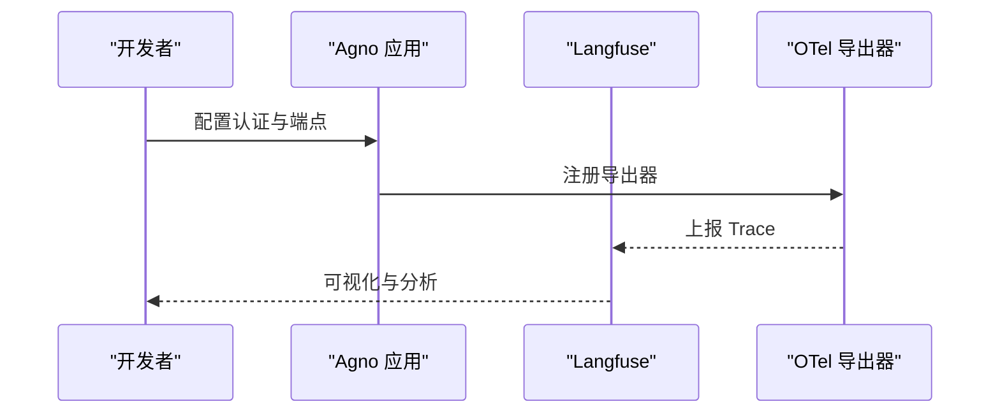

图表来源
- [observability/langfuse.mdx:34-123](file://observability/langfuse.mdx#L34-L123)

章节来源
- [observability/langfuse.mdx:1-133](file://observability/langfuse.mdx#L1-L133)

### 组件四：第三方平台集成（LangSmith）
- 集成方式
  - 使用 OpenInference 与 OTLP 导出器，将 Trace 发送到 LangSmith。
  - 支持多区域端点与项目隔离。
- 关键步骤
  - 创建账户与 API Key、设置环境变量、安装依赖、注册 Tracer Provider、运行 Agent。

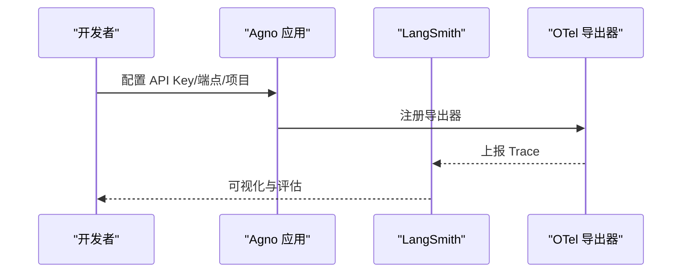

图表来源
- [observability/langsmith.mdx:36-80](file://observability/langsmith.mdx#L36-L80)

章节来源
- [observability/langsmith.mdx:1-87](file://observability/langsmith.mdx#L1-L87)

### 组件五：第三方平台集成（AgentOps）
- 集成方式
  - 通过 AgentOps SDK 初始化，自动记录模型调用与 Agent 生命周期事件。
- 关键步骤
  - 安装包、获取 API Key、设置环境变量、初始化 SDK、运行 Agent。

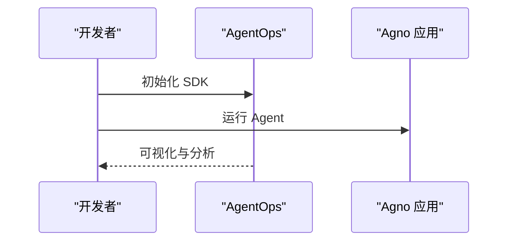

图表来源
- [observability/agentops.mdx:26-44](file://observability/agentops.mdx#L26-L44)

章节来源
- [observability/agentops.mdx:1-53](file://observability/agentops.mdx#L1-L53)

### 组件六：第三方平台集成（Maxim）
- 集成方式
  - 通过 Maxim 的 Agno 仪器化钩子，自动追踪 Agent/Team 的交互、工具调用、性能指标与错误率。
- 关键步骤
  - 安装依赖、配置 API Key 与仓库 ID、初始化仪器化、运行 Agent/Team。

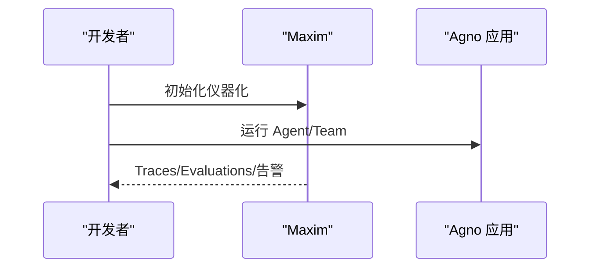

图表来源
- [observability/maxim.mdx:42-167](file://observability/maxim.mdx#L42-L167)

章节来源
- [observability/maxim.mdx:1-205](file://observability/maxim.mdx#L1-L205)

### 组件七：第三方平台集成（MLflow）
- 集成方式
  - 通过 `mlflow.agno.autolog()` 一行代码开启自动追踪，无需修改业务代码。
- 关键步骤
  - 安装依赖、启动 MLflow Server、设置 Tracking URI 与实验名、启用自动追踪、运行 Agent。

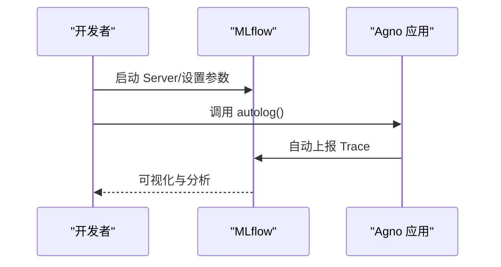

图表来源
- [observability/mlflow.mdx:54-128](file://observability/mlflow.mdx#L54-L128)

章节来源
- [observability/mlflow.mdx:1-135](file://observability/mlflow.mdx#L1-L135)

### 组件八：第三方平台集成（OpenLIT）
- 集成方式
  - 通过 OpenLIT 初始化与 OTLP 导出器，支持本地/自托管与 CLI 零代码注入。
- 关键步骤
  - 安装依赖、部署 OpenLIT、配置 OTLP 端点、初始化 OpenLIT、运行 Agent/Team。

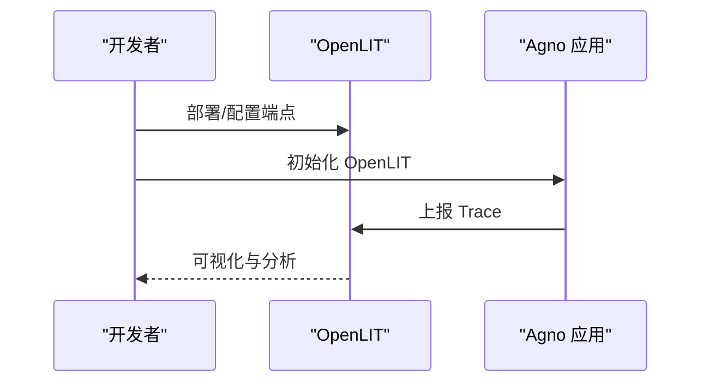

图表来源
- [observability/openlit.mdx:52-192](file://observability/openlit.mdx#L52-L192)

章节来源
- [observability/openlit.mdx:1-257](file://observability/openlit.mdx#L1-L257)

### 组件九：第三方平台集成（Logfire）
- 集成方式
  - 通过 OpenInference 与 OTLP 导出器，将 Trace 发送到 Logfire（按区域选择端点）。
- 关键步骤
  - 安装依赖、配置 Write Token、设置端点、注册 Tracer Provider、运行 Agent。

图表来源
- [observability/logfire.mdx:33-70](file://observability/logfire.mdx#L33-L70)

章节来源
- [observability/logfire.mdx:1-82](file://observability/logfire.mdx#L1-L82)

### 组件十：第三方平台集成（Langtrace）
- 集成方式
  - 通过 Langtrace SDK 初始化，自动注入并发送 Trace。
- 关键步骤
  - 安装依赖、配置 API Key、初始化 SDK、运行 Agent。

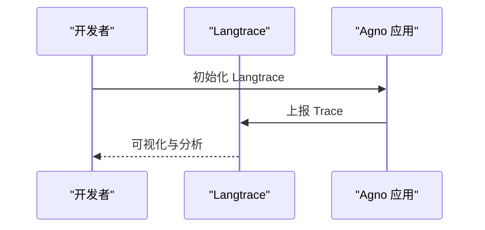

图表来源
- [observability/langtrace.mdx:33-58](file://observability/langtrace.mdx#L33-L58)

章节来源
- [observability/langtrace.mdx:1-65](file://observability/langtrace.mdx#L1-L65)

### 组件十一：日志收集与分析（自定义日志）
- 能力概述
  - 支持自定义日志器、文件输出、命名日志器，分别应用于 Agent/Team/Workflow，满足结构化日志、错误日志与审计日志需求。
- 关键步骤
  - 配置自定义 Logger、FileHandler、Formatter，或使用命名日志器（如 agno、agno-team、agno-workflow）。

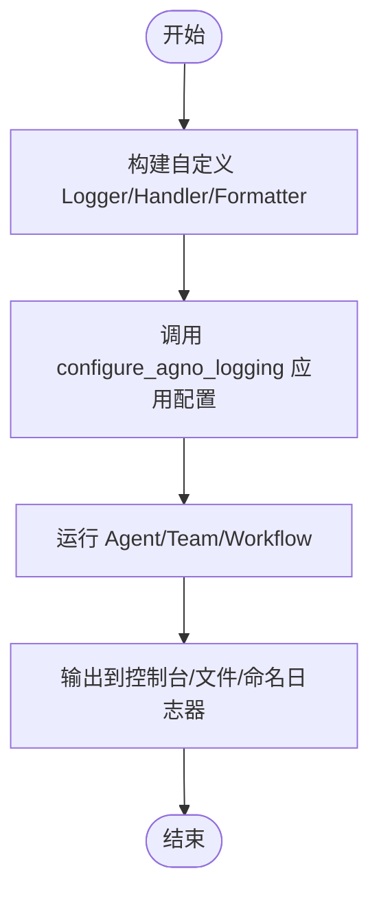

图表来源
- [custom-logging.mdx:12-181](file://custom-logging.mdx#L12-L181)

章节来源
- [custom-logging.mdx:1-193](file://custom-logging.mdx#L1-L193)

## 依赖关系分析
- 平台兼容性
  - Agno 明确支持 Arize Phoenix、Langfuse、LangSmith、Langtrace、Logfire、Maxim、MLflow、OpenLIT、AgentOps 等平台，均基于 OpenTelemetry 协议。
- 内部与外部协同
  - Agno 内部 Tracing 采用 OpenTelemetry 标准，既可本地数据库存储，也可通过 OTLP 导出器流向任意兼容平台，形成“内聚+外联”的观测闭环。

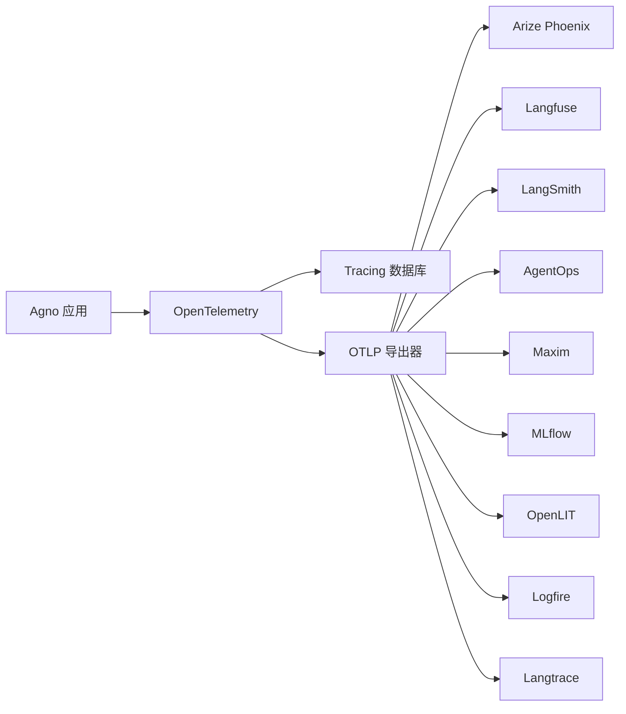

图表来源
- [observability/overview.mdx:14-23](file://observability/overview.mdx#L14-L23)
- [tracing/overview.mdx:81-89](file://tracing/overview.mdx#L81-L89)

章节来源
- [observability/overview.mdx:14-23](file://observability/overview.mdx#L14-L23)
- [tracing/overview.mdx:81-89](file://tracing/overview.mdx#L81-L89)

## 性能考虑
- 处理模式选择
  - 生产环境建议使用批量处理，降低数据库写入压力，减少对 Agent 执行的性能影响。
  - 开发/调试阶段可使用简单处理，以便即时看到 Trace。
- 导出与网络
  - OTLP 导出器的端点与认证需合理配置，避免网络抖动导致导出失败。
- 数据库分离
  - 将 Tracing 数据库与业务数据库分离，有利于独立扩展与简化查询。

章节来源
- [tracing/basic-setup.mdx:173-221](file://tracing/basic-setup.mdx#L173-L221)

## 故障排查指南
- 症状：无法看到 Trace
  - 检查是否在创建 Agent 之前完成 Tracing 初始化。
  - 确认 OTLP 端点、认证头或 API Key 是否正确。
- 症状：导出失败或延迟过高
  - 切换批量处理模式，调整队列大小与导出批次。
  - 校验网络连通性与平台端点可用性。
- 症状：日志格式不符合预期
  - 检查自定义 Logger/Formatter 配置，确认命名日志器是否按约定命名（agno、agno-team、agno-workflow）。
- 症状：多 Agent/Team 共享 Tracing 数据
  - 使用独立 Tracing 数据库，并在 AgentOS 中传递该数据库实例，确保统一访问。

章节来源
- [tracing/basic-setup.mdx:55-95](file://tracing/basic-setup.mdx#L55-L95)
- [custom-logging.mdx:136-181](file://custom-logging.mdx#L136-L181)

## 结论
通过内置的 OpenTelemetry Tracing 与对主流观察性平台的无缝集成，Agno 能够在保障数据主权的前提下，提供从分布式追踪到可视化分析的完整能力。建议在生产环境采用批量处理与独立 Tracing 数据库，并结合平台特性（如 Maxim 的评估与告警、MLflow 的自动追踪、OpenLIT 的零代码注入）构建符合自身需求的观测体系。

## 附录
- 快速对照表（平台与关键要点）
  - Arize Phoenix：OpenInference 注册器、Collector 端点、云/本地部署
  - Langfuse：OpenInference/OpenLIT、多区域端点、公私钥认证
  - LangSmith：OpenInference、API Key/项目/端点
  - AgentOps：SDK 初始化、API Key 环境变量
  - Maxim：仪器化钩子、API Key/仓库 ID、多 Agent/Team 场景
  - MLflow：autolog、Server 启动、Tracking URI/实验名
  - OpenLIT：自托管/CLI 注入、OTLP 端点、零代码注入
  - Logfire：OpenInference、Write Token、区域端点
  - Langtrace：SDK 初始化、API Key

章节来源
- [observability/arize.mdx:1-122](file://observability/arize.mdx#L1-L122)
- [observability/langfuse.mdx:1-133](file://observability/langfuse.mdx#L1-L133)
- [observability/langsmith.mdx:1-87](file://observability/langsmith.mdx#L1-L87)
- [observability/agentops.mdx:1-53](file://observability/agentops.mdx#L1-L53)
- [observability/maxim.mdx:1-205](file://observability/maxim.mdx#L1-L205)
- [observability/mlflow.mdx:1-135](file://observability/mlflow.mdx#L1-L135)
- [observability/openlit.mdx:1-257](file://observability/openlit.mdx#L1-L257)
- [observability/logfire.mdx:1-82](file://observability/logfire.mdx#L1-L82)
- [observability/langtrace.mdx:1-65](file://observability/langtrace.mdx#L1-L65)