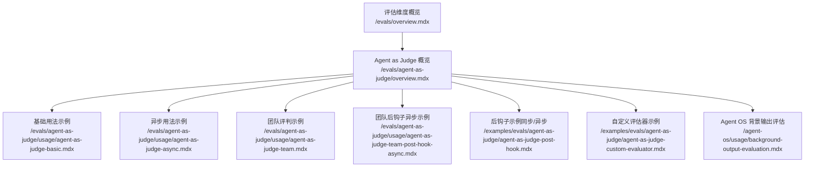
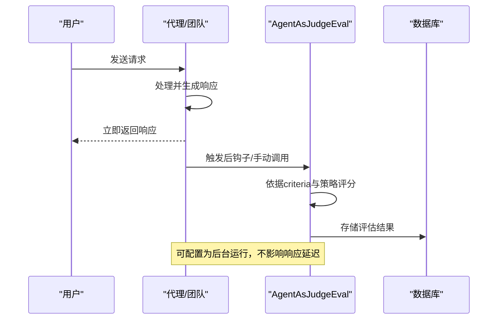
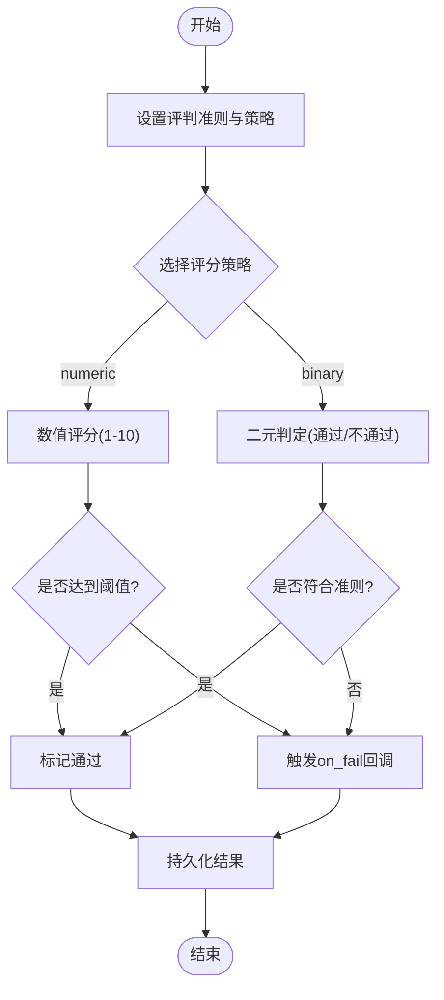
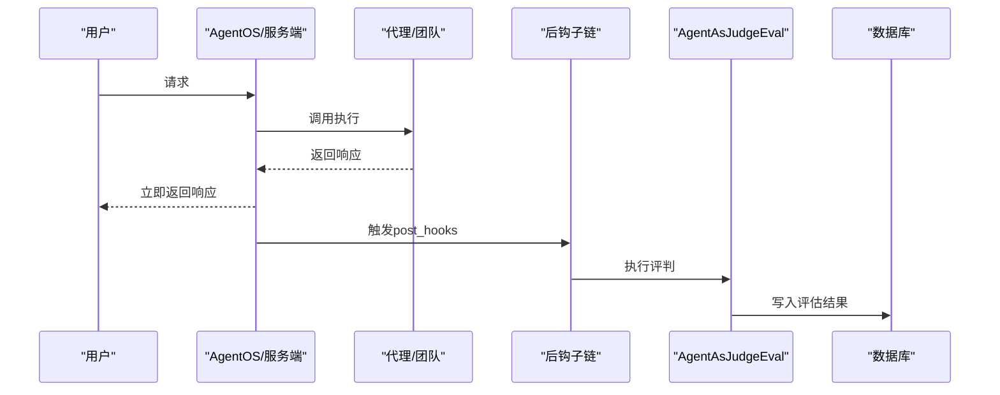
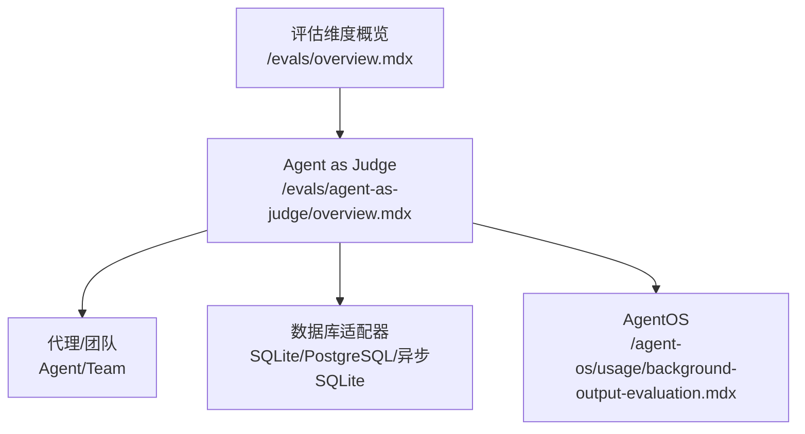

# 代理作为评判者

<cite>
**本文引用的文件**
- [evals/agent-as-judge/overview.mdx](file://evals/agent-as-judge/overview.mdx)
- [evals/agent-as-judge/usage/agent-as-judge-basic.mdx](file://evals/agent-as-judge/usage/agent-as-judge-basic.mdx)
- [evals/agent-as-judge/usage/agent-as-judge-async.mdx](file://evals/agent-as-judge/usage/agent-as-judge-async.mdx)
- [evals/agent-as-judge/usage/agent-as-judge-team.mdx](file://evals/agent-as-judge/usage/agent-as-judge-team.mdx)
- [evals/agent-as-judge/usage/agent-as-judge-team-post-hook-async.mdx](file://evals/agent-as-judge/usage/agent-as-judge-team-post-hook-async.mdx)
- [examples/evals/agent-as-judge/agent-as-judge-basic.mdx](file://examples/evals/agent-as-judge/agent-as-judge-basic.mdx)
- [examples/evals/agent-as-judge/agent-as-judge-post-hook.mdx](file://examples/evals/agent-as-judge/agent-as-judge-post-hook.mdx)
- [examples/evals/agent-as-judge/agent-as-judge-custom-evaluator.mdx](file://examples/evals/agent-as-judge/agent-as-judge-custom-evaluator.mdx)
- [agent-os/usage/background-output-evaluation.mdx](file://agent-os/usage/background-output-evaluation.mdx)
- [evals/overview.mdx](file://evals/overview.mdx)
</cite>

## 目录
1. [简介](#简介)
2. [项目结构](#项目结构)
3. [核心组件](#核心组件)
4. [架构总览](#架构总览)
5. [详细组件分析](#详细组件分析)
6. [依赖关系分析](#依赖关系分析)
7. [性能考量](#性能考量)
8. [故障排查指南](#故障排查指南)
9. [结论](#结论)
10. [附录](#附录)

## 简介
本技术文档围绕“代理作为评判者”（Agent as Judge）展开，系统阐述如何基于 LLM-as-a-judge 方法论，为代理与团队输出建立可定制的质量标准与评分体系。文档覆盖以下主题：
- 自定义质量标准的定义与评分策略设计
- 基本评判、二元评判、自定义评估器、后钩子集成、团队评判、指导原则集成等使用场景
- 评判标准制定方法：准则设定、评分规则定义、流程优化
- 异步评判的实现方法与最佳实践
- 具体代码示例与实际应用案例，帮助构建灵活且可靠的评判系统

## 项目结构
与“代理作为评判者”直接相关的文档主要分布在以下路径：
- 评估维度概览：/evals/overview.mdx
- Agent as Judge 概览与参数说明：/evals/agent-as-judge/overview.mdx
- 使用示例（基础、异步、团队、后钩子、自定义评估器）：
  - /evals/agent-as-judge/usage/agent-as-judge-basic.mdx
  - /evals/agent-as-judge/usage/agent-as-judge-async.mdx
  - /evals/agent-as-judge/usage/agent-as-judge-team.mdx
  - /evals/agent-as-judge/usage/agent-as-judge-team-post-hook-async.mdx
  - /examples/evals/agent-as-judge/agent-as-judge-basic.mdx
  - /examples/evals/agent-as-judge/agent-as-judge-post-hook.mdx
  - /examples/evals/agent-as-judge/agent-as-judge-custom-evaluator.mdx
- Agent OS 背景输出评估：/agent-os/usage/background-output-evaluation.mdx

**图表来源**
- [evals/overview.mdx:1-65](file://evals/overview.mdx#L1-L65)
- [evals/agent-as-judge/overview.mdx:1-150](file://evals/agent-as-judge/overview.mdx#L1-L150)
- [evals/agent-as-judge/usage/agent-as-judge-basic.mdx:1-91](file://evals/agent-as-judge/usage/agent-as-judge-basic.mdx#L1-L91)
- [evals/agent-as-judge/usage/agent-as-judge-async.mdx:1-91](file://evals/agent-as-judge/usage/agent-as-judge-async.mdx#L1-L91)
- [evals/agent-as-judge/usage/agent-as-judge-team.mdx:1-101](file://evals/agent-as-judge/usage/agent-as-judge-team.mdx#L1-L101)
- [evals/agent-as-judge/usage/agent-as-judge-team-post-hook-async.mdx:1-106](file://evals/agent-as-judge/usage/agent-as-judge-team-post-hook-async.mdx#L1-L106)
- [examples/evals/agent-as-judge/agent-as-judge-post-hook.mdx:1-110](file://examples/evals/agent-as-judge/agent-as-judge-post-hook.mdx#L1-L110)
- [examples/evals/agent-as-judge/agent-as-judge-custom-evaluator.mdx:1-71](file://examples/evals/agent-as-judge/agent-as-judge-custom-evaluator.mdx#L1-L71)
- [agent-os/usage/background-output-evaluation.mdx:1-160](file://agent-os/usage/background-output-evaluation.mdx#L1-L160)

**章节来源**
- [evals/overview.mdx:1-65](file://evals/overview.mdx#L1-L65)
- [evals/agent-as-judge/overview.mdx:1-150](file://evals/agent-as-judge/overview.mdx#L1-L150)

## 核心组件
- AgentAsJudgeEval：用于定义评判标准、评分策略与阈值，并对单次或批量输入/输出进行评估；支持同步与异步运行。
- AgentAsJudgeEvaluation / AgentAsJudgeResult：评估执行过程与结果的数据结构，包含分数、是否通过、原因等字段。
- 评估器模型/评估器代理：可使用默认模型或自定义评估器代理，以满足更严格的评判需求。
- 数据库持久化：支持将评估结果写入 SQLite、PostgreSQL、异步 SQLite 等数据库，便于后续查询与分析。
- 后钩子集成：可在代理或团队的 post_hooks 中挂载 Agent as Judge，实现自动化的后台评估。

关键参数与能力要点（来自概览文档）：
- criteria：评判准则描述（必填）
- scoring_strategy：评分策略，支持 numeric（1-10 数值评分）与 binary（通过/不通过）
- threshold：数值评分策略下的及格阈值（仅 numeric 生效）
- on_fail：评估失败时触发的回调函数
- additional_guidelines：除主准则外的附加指导
- model / evaluator_agent：指定评判使用的模型或自定义评估器代理
- run_in_background：后台运行评估（非阻塞）
- db：评估结果存储目标

**章节来源**
- [evals/agent-as-judge/overview.mdx:91-128](file://evals/agent-as-judge/overview.mdx#L91-L128)

## 架构总览
下图展示了从用户请求到响应返回与后台评估执行的整体流程，体现“代理作为评判者”的核心交互：

**图表来源**
- [agent-os/usage/background-output-evaluation.mdx:116-125](file://agent-os/usage/background-output-evaluation.mdx#L116-L125)
- [evals/agent-as-judge/overview.mdx:111-128](file://evals/agent-as-judge/overview.mdx#L111-L128)

## 详细组件分析

### 组件一：基本评判（numeric/binary）
- 场景：对单次输入/输出进行评分，支持数值评分与二元判定。
- 关键点：
  - numeric 策略：1-10 分，配合 threshold 判定是否通过
  - binary 策略：仅判定通过/不通过
  - 支持 on_fail 回调处理失败情况
- 示例参考：
  - 基础用法与数值评分、失败回调：/evals/agent-as-judge/usage/agent-as-judge-basic.mdx
  - 同步/异步对比示例：/examples/evals/agent-as-judge/agent-as-judge-basic.mdx

**图表来源**
- [evals/agent-as-judge/overview.mdx:95-100](file://evals/agent-as-judge/overview.mdx#L95-L100)
- [evals/agent-as-judge/usage/agent-as-judge-basic.mdx:18-22](file://evals/agent-as-judge/usage/agent-as-judge-basic.mdx#L18-L22)

**章节来源**
- [evals/agent-as-judge/usage/agent-as-judge-basic.mdx:1-91](file://evals/agent-as-judge/usage/agent-as-judge-basic.mdx#L1-L91)
- [examples/evals/agent-as-judge/agent-as-judge-basic.mdx:1-125](file://examples/evals/agent-as-judge/agent-as-judge-basic.mdx#L1-L125)

### 组件二：二元评判
- 场景：快速判定输出是否满足关键要求，适合高风险或合规场景。
- 关键点：
  - 无需阈值，直接判定通过/不通过
  - 可结合 additional_guidelines 提供更细粒度的判断依据
- 示例参考：
  - 团队输出二元评判：/evals/agent-as-judge/usage/agent-as-judge-team.mdx

**章节来源**
- [evals/agent-as-judge/usage/agent-as-judge-team.mdx:1-101](file://evals/agent-as-judge/usage/agent-as-judge-team.mdx#L1-L101)

### 组件三：自定义评估器
- 场景：需要更严格或特定领域的评判标准时，使用自定义评估器代理。
- 关键点：
  - 通过 evaluator_agent 参数注入专用评估代理
  - 评估代理可具备更强的领域知识或更严苛的评分倾向
- 示例参考：
  - 自定义评估器示例：/examples/evals/agent-as-judge/agent-as-judge-custom-evaluator.mdx

**章节来源**
- [examples/evals/agent-as-judge/agent-as-judge-custom-evaluator.mdx:1-71](file://examples/evals/agent-as-judge/agent-as-judge-custom-evaluator.mdx#L1-L71)

### 组件四：后钩子集成（Agent OS）
- 场景：在代理或团队完成响应后自动触发评判，且不阻塞用户响应。
- 关键点：
  - 将 AgentAsJudgeEval 作为 post_hooks 添加到 Agent/Team
  - run_in_background=true 实现后台运行
  - 结合 on_fail 进行告警或记录
- 示例参考：
  - Agent OS 背景输出评估：/agent-os/usage/background-output-evaluation.mdx
  - 后钩子示例（同步/异步）：/examples/evals/agent-as-judge/agent-as-judge-post-hook.mdx
  - 团队后钩子异步示例：/evals/agent-as-judge/usage/agent-as-judge-team-post-hook-async.mdx

**图表来源**
- [agent-os/usage/background-output-evaluation.mdx:47-60](file://agent-os/usage/background-output-evaluation.mdx#L47-L60)
- [evals/agent-as-judge/usage/agent-as-judge-team-post-hook-async.mdx:48-55](file://evals/agent-as-judge/usage/agent-as-judge-team-post-hook-async.mdx#L48-L55)

**章节来源**
- [agent-os/usage/background-output-evaluation.mdx:1-160](file://agent-os/usage/background-output-evaluation.mdx#L1-L160)
- [examples/evals/agent-as-judge/agent-as-judge-post-hook.mdx:1-110](file://examples/evals/agent-as-judge/agent-as-judge-post-hook.mdx#L1-L110)
- [evals/agent-as-judge/usage/agent-as-judge-team-post-hook-async.mdx:1-106](file://evals/agent-as-judge/usage/agent-as-judge-team-post-hook-async.mdx#L1-L106)

### 组件五：团队评判
- 场景：对多智能体协作产生的综合输出进行评判，关注完整性、一致性、专业性与协作表现。
- 关键点：
  - 可使用二元或数值策略
  - 输出通常来自 Team 的聚合响应
- 示例参考：
  - 团队评判示例：/evals/agent-as-judge/usage/agent-as-judge-team.mdx

**章节来源**
- [evals/agent-as-judge/usage/agent-as-judge-team.mdx:1-101](file://evals/agent-as-judge/usage/agent-as-judge-team.mdx#L1-L101)

### 组件六：指导原则集成
- 场景：在评判中引入额外的指导原则（如准确性、安全性、一致性），以提升评判的全面性。
- 关键点：
  - 通过 additional_guidelines 参数传入多条指导
  - 评估时综合考虑主准则与附加指导
- 示例参考：
  - Agent OS 背景输出评估中的附加指导：/agent-os/usage/background-output-evaluation.mdx

**章节来源**
- [agent-os/usage/background-output-evaluation.mdx:38-44](file://agent-os/usage/background-output-evaluation.mdx#L38-L44)

## 依赖关系分析
- 评估维度与 Agent as Judge 的关系：/evals/overview.mdx 展示了评估的四大维度，其中 Agent as Judge 专注于“自定义质量标准”的评分。
- Agent as Judge 与 Agent/Team/AgentOS 的耦合：
  - 通过 post_hooks 与 run_in_background 实现低耦合的后置评估
  - 通过 db 参数实现与存储层的解耦
- 与数据库的依赖：
  - 支持多种数据库适配器（SQLite、PostgreSQL、异步 SQLite），便于在不同环境中部署

**图表来源**
- [evals/overview.mdx:10-25](file://evals/overview.mdx#L10-L25)
- [evals/agent-as-judge/overview.mdx:111-128](file://evals/agent-as-judge/overview.mdx#L111-L128)
- [agent-os/usage/background-output-evaluation.mdx:22-60](file://agent-os/usage/background-output-evaluation.mdx#L22-L60)

**章节来源**
- [evals/overview.mdx:1-65](file://evals/overview.mdx#L1-L65)
- [evals/agent-as-judge/overview.mdx:1-150](file://evals/agent-as-judge/overview.mdx#L1-L150)

## 性能考量
- 异步运行与后台评估
  - 使用 run_in_background 在不阻塞响应的前提下完成评估，适合生产环境的质量监控与审计
  - 参考：/agent-os/usage/background-output-evaluation.mdx
- 评分策略选择
  - numeric 策略提供更精细的反馈，但可能增加 LLM 推理成本；binary 策略更轻量
  - 参考：/evals/agent-as-judge/overview.mdx
- 数据库写入与查询
  - 评估结果持久化有助于长期追踪与报表生成，建议在高并发场景下选择高性能数据库（如 PostgreSQL）
  - 参考：/examples/evals/agent-as-judge/agent-as-judge-basic.mdx

[本节为通用性能建议，不直接分析具体文件]

## 故障排查指南
- 评估失败回调
  - on_fail 回调可用于记录失败原因、触发告警或进入降级流程
  - 参考：/evals/agent-as-judge/usage/agent-as-judge-basic.mdx
- 结果持久化验证
  - 通过 db.get_eval_runs() 查询最近评估记录，确认结果已正确写入
  - 参考：/evals/agent-as-judge/usage/agent-as-judge-basic.mdx
- 后台评估未生效
  - 确认已启用 run_in_background 并正确挂载到 post_hooks
  - 参考：/agent-os/usage/background-output-evaluation.mdx

**章节来源**
- [evals/agent-as-judge/usage/agent-as-judge-basic.mdx:18-22](file://evals/agent-as-judge/usage/agent-as-judge-basic.mdx#L18-L22)
- [agent-os/usage/background-output-evaluation.mdx:116-125](file://agent-os/usage/background-output-evaluation.mdx#L116-L125)

## 结论
“代理作为评判者”提供了灵活、可扩展的质量评估框架，既能满足快速二元判定，也能支持精细化数值评分与自定义评估器。通过后钩子与后台运行机制，可在不影响用户体验的前提下实现持续的质量监控与合规审计。结合指导原则与多数据库适配，可构建稳定可靠的评判系统，支撑从开发测试到生产的全生命周期质量保障。

[本节为总结性内容，不直接分析具体文件]

## 附录

### A. 评判标准制定方法
- 明确评判准则（criteria）：聚焦于业务关键指标（如准确性、专业性、安全性）
- 设计评分规则：选择 numeric 或 binary 策略，设定阈值或判定条件
- 引入指导原则（additional_guidelines）：细化评分细节，确保一致性
- 流程优化：优先使用后台评估减少延迟，必要时在关键路径采用同步评估

**章节来源**
- [evals/agent-as-judge/overview.mdx:95-100](file://evals/agent-as-judge/overview.mdx#L95-L100)
- [agent-os/usage/background-output-evaluation.mdx:38-44](file://agent-os/usage/background-output-evaluation.mdx#L38-L44)

### B. 异步评判最佳实践
- 使用 run_in_background 实现非阻塞评估
- 在 Agent/Team 的 post_hooks 中统一挂载评估器
- 配置 on_fail 回调进行告警与日志记录
- 选择合适的数据库适配器以支撑高并发写入

**章节来源**
- [evals/agent-as-judge/overview.mdx:109](file://evals/agent-as-judge/overview.mdx#L109)
- [agent-os/usage/background-output-evaluation.mdx:47-60](file://agent-os/usage/background-output-evaluation.mdx#L47-L60)

### C. 示例清单与路径
- 基础用法与数值评分、失败回调：/evals/agent-as-judge/usage/agent-as-judge-basic.mdx
- 异步用法与异步回调：/evals/agent-as-judge/usage/agent-as-judge-async.mdx
- 团队输出二元评判：/evals/agent-as-judge/usage/agent-as-judge-team.mdx
- 团队后钩子异步示例：/evals/agent-as-judge/usage/agent-as-judge-team-post-hook-async.mdx
- 后钩子示例（同步/异步）：/examples/evals/agent-as-judge/agent-as-judge-post-hook.mdx
- 自定义评估器示例：/examples/evals/agent-as-judge/agent-as-judge-custom-evaluator.mdx
- Agent OS 背景输出评估：/agent-os/usage/background-output-evaluation.mdx

**章节来源**
- [evals/agent-as-judge/usage/agent-as-judge-basic.mdx:1-91](file://evals/agent-as-judge/usage/agent-as-judge-basic.mdx#L1-L91)
- [evals/agent-as-judge/usage/agent-as-judge-async.mdx:1-91](file://evals/agent-as-judge/usage/agent-as-judge-async.mdx#L1-L91)
- [evals/agent-as-judge/usage/agent-as-judge-team.mdx:1-101](file://evals/agent-as-judge/usage/agent-as-judge-team.mdx#L1-L101)
- [evals/agent-as-judge/usage/agent-as-judge-team-post-hook-async.mdx:1-106](file://evals/agent-as-judge/usage/agent-as-judge-team-post-hook-async.mdx#L1-L106)
- [examples/evals/agent-as-judge/agent-as-judge-post-hook.mdx:1-110](file://examples/evals/agent-as-judge/agent-as-judge-post-hook.mdx#L1-L110)
- [examples/evals/agent-as-judge/agent-as-judge-custom-evaluator.mdx:1-71](file://examples/evals/agent-as-judge/agent-as-judge-custom-evaluator.mdx#L1-L71)
- [agent-os/usage/background-output-evaluation.mdx:1-160](file://agent-os/usage/background-output-evaluation.mdx#L1-L160)