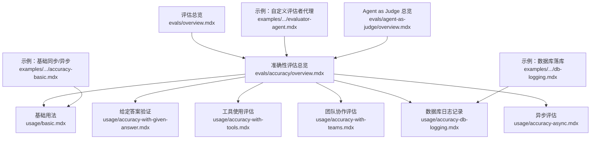
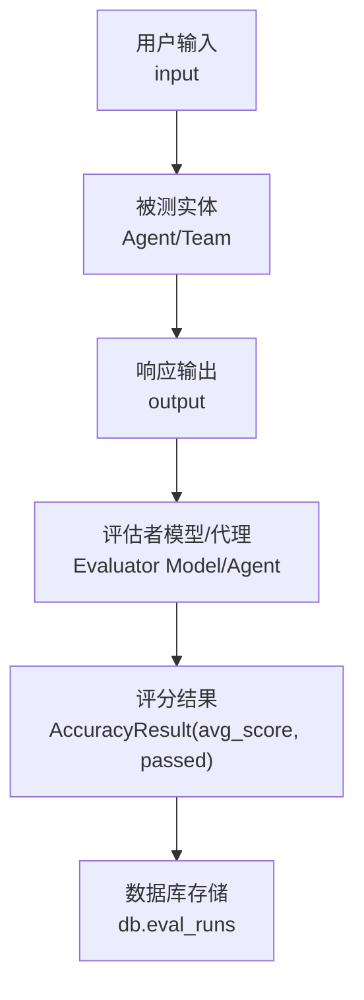
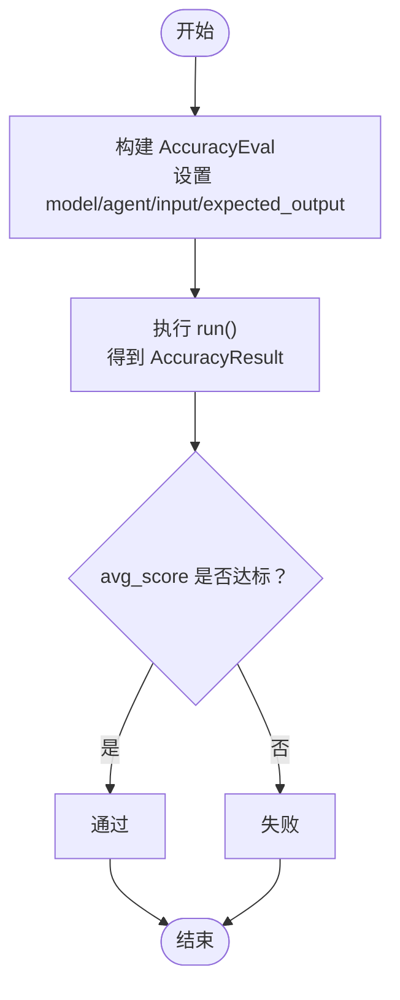
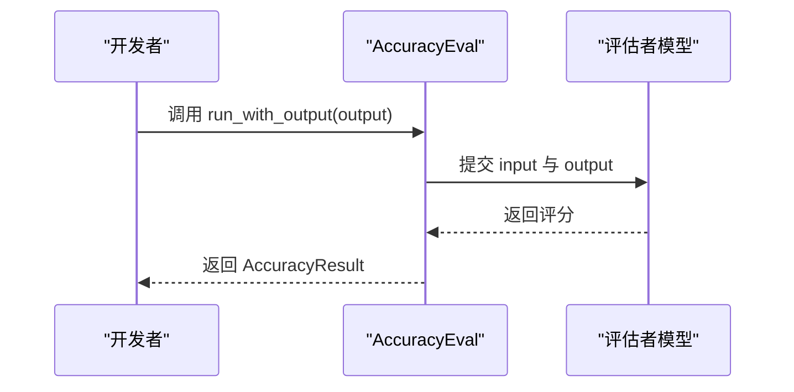
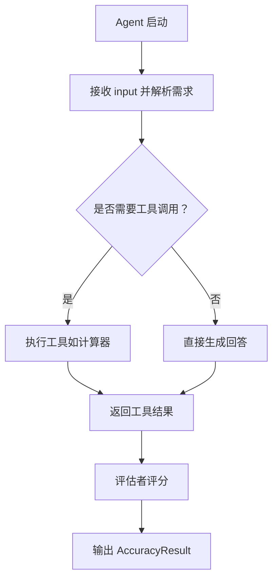
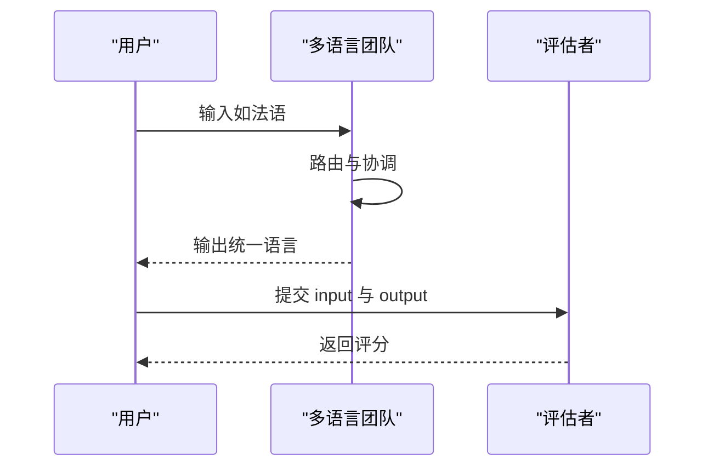
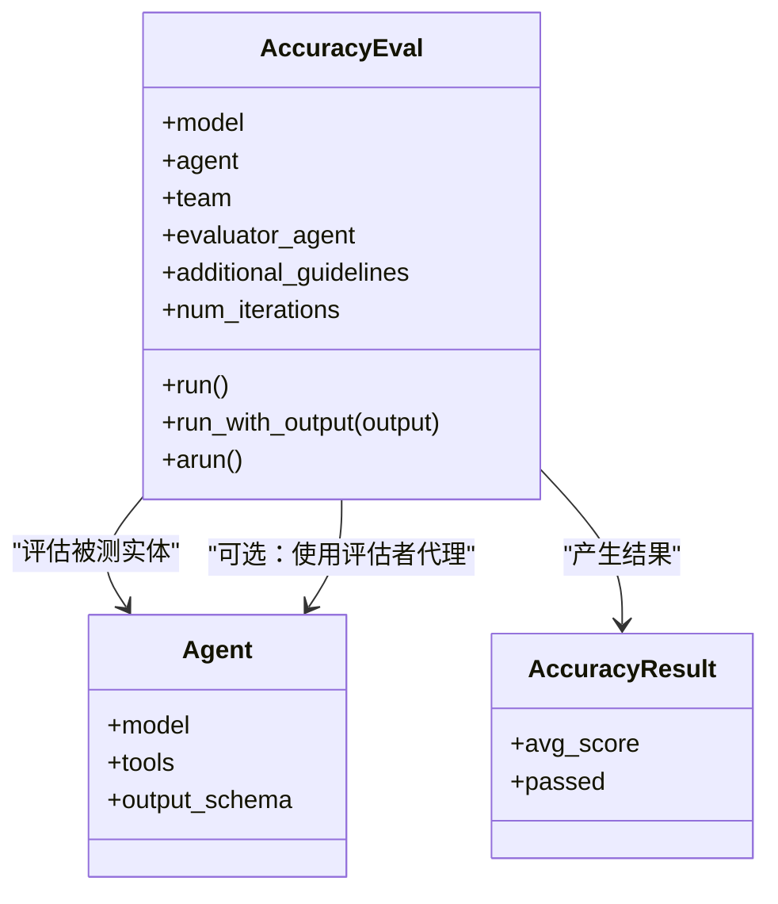
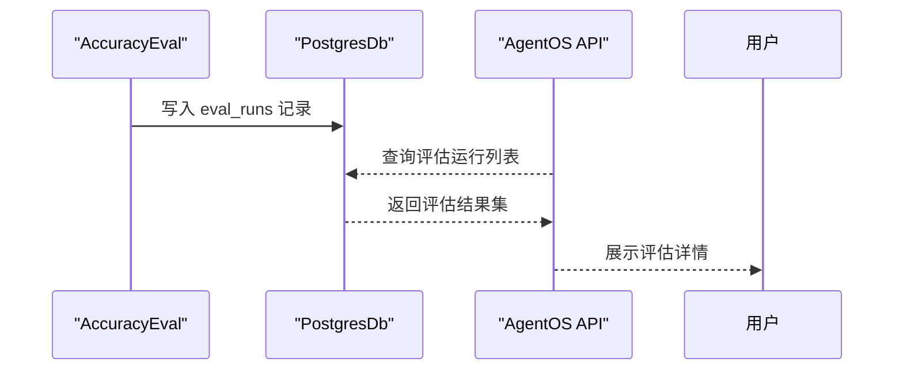
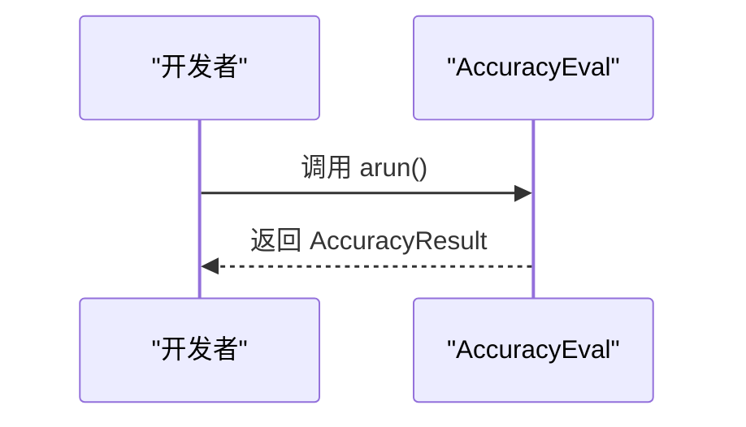
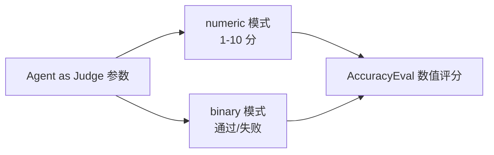

# 准确性评估

<cite>
**本文引用的文件**
- [evals/overview.mdx](file://evals/overview.mdx)
- [evals/accuracy/overview.mdx](file://evals/accuracy/overview.mdx)
- [evals/accuracy/usage/basic.mdx](file://evals/accuracy/usage/basic.mdx)
- [evals/accuracy/usage/accuracy-with-given-answer.mdx](file://evals/accuracy/usage/accuracy-with-given-answer.mdx)
- [evals/accuracy/usage/accuracy-with-tools.mdx](file://evals/accuracy/usage/accuracy-with-tools.mdx)
- [evals/accuracy/usage/accuracy-with-teams.mdx](file://evals/accuracy/usage/accuracy-with-teams.mdx)
- [evals/accuracy/usage/accuracy-db-logging.mdx](file://evals/accuracy/usage/accuracy-db-logging.mdx)
- [evals/accuracy/usage/accuracy-async.mdx](file://evals/accuracy/usage/accuracy-async.mdx)
- [examples/evals/accuracy/accuracy-basic.mdx](file://examples/evals/accuracy/accuracy-basic.mdx)
- [examples/evals/accuracy/evaluator-agent.mdx](file://examples/evals/accuracy/evaluator-agent.mdx)
- [examples/evals/accuracy/db-logging.mdx](file://examples/evals/accuracy/db-logging.mdx)
- [evals/agent-as-judge/overview.mdx](file://evals/agent-as-judge/overview.mdx)
</cite>

## 目录
1. [简介](#简介)
2. [项目结构](#项目结构)
3. [核心组件](#核心组件)
4. [架构总览](#架构总览)
5. [详细组件分析](#详细组件分析)
6. [依赖关系分析](#依赖关系分析)
7. [性能考量](#性能考量)
8. [故障排查指南](#故障排查指南)
9. [结论](#结论)
10. [附录](#附录)

## 简介
本文件系统化阐述“准确性评估”的技术方案与实践路径，围绕以下目标展开：
- 深入解释 LLM-as-a-judge 方法论与评分标准制定
- 覆盖四大典型使用场景：基础准确性测试、给定答案的准确性验证、工具使用的准确性评估、团队协作的准确性评估
- 说明配置选项：评估参数、指导原则、阈值策略与结果验证
- 提供数据库日志记录与异步评估的实现要点
- 给出可直接对照的示例路径，帮助开发者快速落地

## 项目结构
准确性评估相关文档集中在 evals/accuracy 下，并与 Agent as Judge 的评分体系形成互补。下图给出与本主题相关的文档与示例分布概览。

图表来源
- [evals/overview.mdx:1-66](file://evals/overview.mdx#L1-L66)
- [evals/accuracy/overview.mdx:1-359](file://evals/accuracy/overview.mdx#L1-L359)
- [evals/accuracy/usage/basic.mdx:1-65](file://evals/accuracy/usage/basic.mdx#L1-L65)
- [evals/accuracy/usage/accuracy-with-given-answer.mdx:1-58](file://evals/accuracy/usage/accuracy-with-given-answer.mdx#L1-L58)
- [evals/accuracy/usage/accuracy-with-tools.mdx:1-63](file://evals/accuracy/usage/accuracy-with-tools.mdx#L1-L63)
- [evals/accuracy/usage/accuracy-with-teams.mdx:1-88](file://evals/accuracy/usage/accuracy-with-teams.mdx#L1-L88)
- [evals/accuracy/usage/accuracy-db-logging.mdx:1-74](file://evals/accuracy/usage/accuracy-db-logging.mdx#L1-L74)
- [evals/accuracy/usage/accuracy-async.mdx:1-68](file://evals/accuracy/usage/accuracy-async.mdx#L1-L68)
- [examples/evals/accuracy/accuracy-basic.mdx:1-77](file://examples/evals/accuracy/accuracy-basic.mdx#L1-L77)
- [examples/evals/accuracy/evaluator-agent.mdx:1-60](file://examples/evals/accuracy/evaluator-agent.mdx#L1-L60)
- [examples/evals/accuracy/db-logging.mdx:1-63](file://examples/evals/accuracy/db-logging.mdx#L1-L63)
- [evals/agent-as-judge/overview.mdx:93-100](file://evals/agent-as-judge/overview.mdx#L93-L100)

章节来源
- [evals/overview.mdx:1-66](file://evals/overview.mdx#L1-L66)
- [evals/accuracy/overview.mdx:1-359](file://evals/accuracy/overview.mdx#L1-L359)

## 核心组件
- AccuracyEval：准确性评估主入口，支持传入 Agent 或 Team，提供 run/run_with_output/arun 等执行方式；支持 additional_guidelines、num_iterations、evaluator_agent 等配置项。
- AccuracyResult：评估结果对象，包含平均分、通过状态等指标，便于断言与后续处理。
- 数据库集成：通过 db 参数将评估运行记录持久化到数据库，便于追踪与查询。
- 异步评估：提供 arun 接口，适合批量或高并发场景。
- 自定义评估者代理：通过 evaluator_agent 使用独立 Agent 执行评分，结合输出模式（如 AccuracyAgentResponse）提升稳定性与一致性。

章节来源
- [evals/accuracy/overview.mdx:12-76](file://evals/accuracy/overview.mdx#L12-L76)
- [evals/accuracy/usage/basic.mdx:18-32](file://evals/accuracy/usage/basic.mdx#L18-L32)
- [evals/accuracy/usage/accuracy-with-given-answer.mdx:16-25](file://evals/accuracy/usage/accuracy-with-given-answer.mdx#L16-L25)
- [evals/accuracy/usage/accuracy-with-tools.mdx:18-29](file://evals/accuracy/usage/accuracy-with-tools.mdx#L18-L29)
- [evals/accuracy/usage/accuracy-with-teams.mdx:45-54](file://evals/accuracy/usage/accuracy-with-teams.mdx#L45-L54)
- [evals/accuracy/usage/accuracy-db-logging.mdx:26-41](file://evals/accuracy/usage/accuracy-db-logging.mdx#L26-L41)
- [evals/accuracy/usage/accuracy-async.mdx:21-35](file://evals/accuracy/usage/accuracy-async.mdx#L21-L35)
- [examples/evals/accuracy/evaluator-agent.mdx:23-44](file://examples/evals/accuracy/evaluator-agent.mdx#L23-L44)

## 架构总览
下图展示“LLM-as-a-judge”在准确性评估中的角色：由一个专门的评估模型（或评估者代理）对被测 Agent/Team 的输出进行评分，评分依据预设的标准与指导原则，最终生成可验证的结果。

图表来源
- [evals/accuracy/overview.mdx:8-14](file://evals/accuracy/overview.mdx#L8-L14)
- [evals/accuracy/usage/basic.mdx:18-32](file://evals/accuracy/usage/basic.mdx#L18-L32)
- [evals/accuracy/usage/accuracy-db-logging.mdx:26-41](file://evals/accuracy/usage/accuracy-db-logging.mdx#L26-L41)

## 详细组件分析

### 基础准确性测试
- 场景要点：以固定输入与期望输出为基准，评估模型对步骤与结论的覆盖程度。
- 关键配置：model（用于评分）、agent、input、expected_output、additional_guidelines、num_iterations。
- 断言与验证：通过 AccuracyResult 的 avg_score 判断是否达标。
- 示例路径：
  - [evals/accuracy/usage/basic.mdx:18-32](file://evals/accuracy/usage/basic.mdx#L18-L32)
  - [examples/evals/accuracy/accuracy-basic.mdx:24-57](file://examples/evals/accuracy/accuracy-basic.mdx#L24-L57)

图表来源
- [evals/accuracy/usage/basic.mdx:18-32](file://evals/accuracy/usage/basic.mdx#L18-L32)
- [examples/evals/accuracy/accuracy-basic.mdx:24-57](file://examples/evals/accuracy/accuracy-basic.mdx#L24-L57)

章节来源
- [evals/accuracy/usage/basic.mdx:18-32](file://evals/accuracy/usage/basic.mdx#L18-L32)
- [examples/evals/accuracy/accuracy-basic.mdx:24-57](file://examples/evals/accuracy/accuracy-basic.mdx#L24-L57)

### 给定答案的准确性验证
- 场景要点：无需运行被测实体，直接对给定输出进行评分，适合离线验证与回归测试。
- 关键接口：run_with_output(output, ...)。
- 示例路径：
  - [evals/accuracy/usage/accuracy-with-given-answer.mdx:16-25](file://evals/accuracy/usage/accuracy-with-given-answer.mdx#L16-L25)

图表来源
- [evals/accuracy/usage/accuracy-with-given-answer.mdx:16-25](file://evals/accuracy/usage/accuracy-with-given-answer.mdx#L16-L25)

章节来源
- [evals/accuracy/usage/accuracy-with-given-answer.mdx:16-25](file://evals/accuracy/usage/accuracy-with-given-answer.mdx#L16-L25)

### 工具使用的准确性评估
- 场景要点：在具备工具能力的 Agent 上进行数值计算、比较等任务，重点在于工具调用的正确性与输出格式。
- 关键配置：agent 需包含所需工具；必要时在 instructions 中强调使用工具。
- 示例路径：
  - [evals/accuracy/usage/accuracy-with-tools.mdx:18-29](file://evals/accuracy/usage/accuracy-with-tools.mdx#L18-L29)

图表来源
- [evals/accuracy/usage/accuracy-with-tools.mdx:18-29](file://evals/accuracy/usage/accuracy-with-tools.mdx#L18-L29)

章节来源
- [evals/accuracy/usage/accuracy-with-tools.mdx:18-29](file://evals/accuracy/usage/accuracy-with-tools.mdx#L18-L29)

### 团队协作的准确性评估
- 场景要点：多智能体协作路由与语言切换，评估整体响应的准确性与一致性。
- 关键配置：team、respond_directly、markdown、instructions 等。
- 示例路径：
  - [evals/accuracy/usage/accuracy-with-teams.mdx:45-54](file://evals/accuracy/usage/accuracy-with-teams.mdx#L45-L54)

图表来源
- [evals/accuracy/usage/accuracy-with-teams.mdx:45-54](file://evals/accuracy/usage/accuracy-with-teams.mdx#L45-L54)

章节来源
- [evals/accuracy/usage/accuracy-with-teams.mdx:45-54](file://evals/accuracy/usage/accuracy-with-teams.mdx#L45-L54)

### 自定义评估者代理（LLM-as-a-judge）
- 场景要点：使用独立 Agent 作为评估者，结合输出模式（如 AccuracyAgentResponse）稳定评分结构。
- 关键配置：evaluator_agent、output_schema、additional_guidelines。
- 示例路径：
  - [examples/evals/accuracy/evaluator-agent.mdx:23-44](file://examples/evals/accuracy/evaluator-agent.mdx#L23-L44)

图表来源
- [examples/evals/accuracy/evaluator-agent.mdx:23-44](file://examples/evals/accuracy/evaluator-agent.mdx#L23-L44)
- [evals/accuracy/overview.mdx:47-76](file://evals/accuracy/overview.mdx#L47-L76)

章节来源
- [examples/evals/accuracy/evaluator-agent.mdx:23-44](file://examples/evals/accuracy/evaluator-agent.mdx#L23-L44)
- [evals/accuracy/overview.mdx:47-76](file://evals/accuracy/overview.mdx#L47-L76)

### 数据库日志记录与结果查询
- 场景要点：将评估运行记录持久化到数据库，便于历史对比、趋势分析与 API 查询。
- 关键配置：db（数据库实例）、eval_table（表名）。
- 示例路径：
  - [evals/accuracy/usage/accuracy-db-logging.mdx:26-41](file://evals/accuracy/usage/accuracy-db-logging.mdx#L26-L41)
  - [examples/evals/accuracy/db-logging.mdx:47-63](file://examples/evals/accuracy/db-logging.mdx#L47-L63)

图表来源
- [evals/accuracy/usage/accuracy-db-logging.mdx:26-41](file://evals/accuracy/usage/accuracy-db-logging.mdx#L26-L41)
- [examples/evals/accuracy/db-logging.mdx:47-63](file://examples/evals/accuracy/db-logging.mdx#L47-L63)

章节来源
- [evals/accuracy/usage/accuracy-db-logging.mdx:26-41](file://evals/accuracy/usage/accuracy-db-logging.mdx#L26-L41)
- [examples/evals/accuracy/db-logging.mdx:47-63](file://examples/evals/accuracy/db-logging.mdx#L47-L63)

### 异步评估
- 场景要点：在高并发或批量评估场景中使用 arun，提升吞吐与资源利用率。
- 关键配置：num_iterations、additional_guidelines。
- 示例路径：
  - [evals/accuracy/usage/accuracy-async.mdx:21-35](file://evals/accuracy/usage/accuracy-async.mdx#L21-L35)
  - [examples/evals/accuracy/accuracy-basic.mdx:59-62](file://examples/evals/accuracy/accuracy-basic.mdx#L59-L62)

图表来源
- [evals/accuracy/usage/accuracy-async.mdx:21-35](file://evals/accuracy/usage/accuracy-async.mdx#L21-L35)
- [examples/evals/accuracy/accuracy-basic.mdx:59-62](file://examples/evals/accuracy/accuracy-basic.mdx#L59-L62)

章节来源
- [evals/accuracy/usage/accuracy-async.mdx:21-35](file://evals/accuracy/usage/accuracy-async.mdx#L21-L35)
- [examples/evals/accuracy/accuracy-basic.mdx:59-62](file://examples/evals/accuracy/accuracy-basic.mdx#L59-L62)

## 依赖关系分析
- 评估维度与评分策略：Agent as Judge 提供了更灵活的评分策略（numeric/binary），可与 AccuracyEval 的 numeric 评分配合使用，形成“双层评分”机制。
- 评分参数映射：
  - criteria：评估标准（必填）
  - scoring_strategy：numeric 或 binary
  - threshold：numeric 模式下的通过阈值
  - additional_guidelines：补充指导原则
  - on_fail：失败回调（可选）

图表来源
- [evals/agent-as-judge/overview.mdx:93-100](file://evals/agent-as-judge/overview.mdx#L93-L100)

章节来源
- [evals/agent-as-judge/overview.mdx:93-100](file://evals/agent-as-judge/overview.mdx#L93-L100)

## 性能考量
- 异步执行：在批量评估或多轮迭代中优先使用 arun，减少等待时间。
- 迭代次数控制：num_iterations 增加会提高稳定性但也会增加成本，建议按场景权衡。
- 评估者模型选择：评估者模型与被测模型的差异有助于发现隐藏问题，但需平衡成本与延迟。
- 数据库写入：批量写入时注意事务与索引设计，避免阻塞。

## 故障排查指南
- 评分过低
  - 检查 additional_guidelines 是否明确、具体
  - 调整 evaluator_agent 的输出模式与提示词
  - 对工具类任务，确认工具可用且被正确调用
- 结果未落库
  - 确认 db 实例初始化与 eval_table 名称正确
  - 检查数据库连接字符串与权限
- 异步评估无响应
  - 确保事件循环正确启动
  - 检查网络与模型服务可用性
- 结果不可复现
  - 固定随机种子与模型参数
  - 记录 input、expected_output、guidelines 完整上下文

## 结论
准确性评估通过 LLM-as-a-judge 将“人”的判断标准化、自动化，结合工具与团队场景，形成从单点到协作的全栈评估能力。配合数据库落库与异步执行，可在保证质量的同时提升效率。建议以基础用法起步，逐步引入自定义评估者、工具验证与团队评估，并建立持续跟踪与回归测试流程。

## 附录
- 快速参考清单
  - 选择合适的评估者模型或自定义评估者代理
  - 明确 additional_guidelines 与阈值策略
  - 在工具与团队场景中分别验证调用与路由逻辑
  - 使用 db 参数开启评估记录落库
  - 在高并发场景采用异步评估
  - 通过 AccuracyResult 的 avg_score 与 passed 做断言与报告