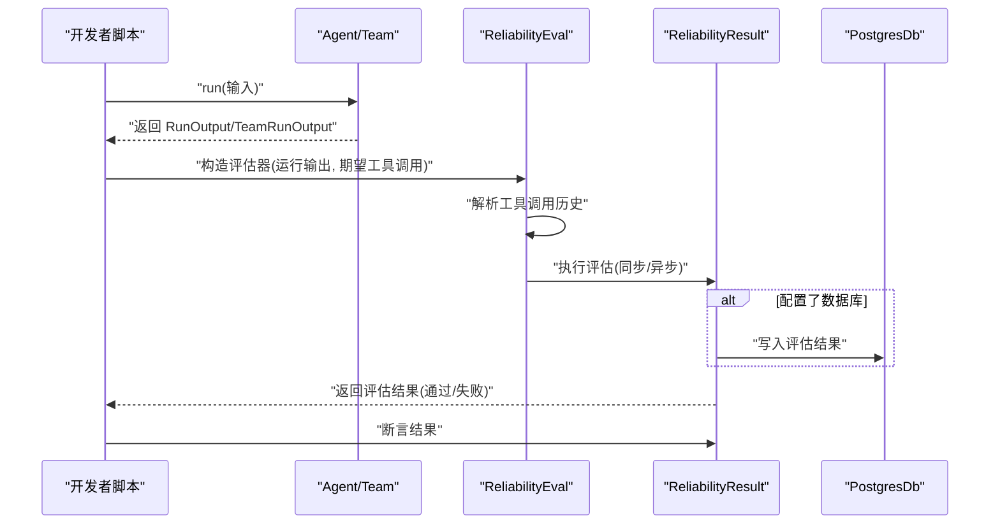
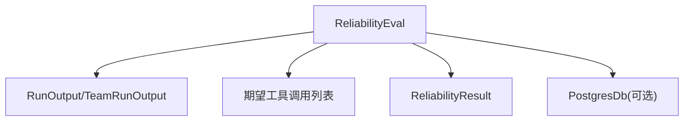

# 可靠性评估

<cite>
**本文引用的文件**
- [evals/reliability/overview.mdx](file://evals/reliability/overview.mdx)
- [evals/reliability/usage/basic.mdx](file://evals/reliability/usage/basic.mdx)
- [evals/reliability/usage/reliability-async.mdx](file://evals/reliability/usage/reliability-async.mdx)
- [evals/reliability/usage/reliability-db-logging.mdx](file://evals/reliability/usage/reliability-db-logging.mdx)
- [evals/reliability/usage/reliability-single-tool.mdx](file://evals/reliability/usage/reliability-single-tool.mdx)
- [evals/reliability/usage/reliability-with-multiple-tools.mdx](file://evals/reliability/usage/reliability-with-multiple-tools.mdx)
- [evals/reliability/usage/reliability-with-teams.mdx](file://evals/reliability/usage/reliability-with-teams.mdx)
- [evals/reliability/usage/reliability-team-advanced.mdx](file://evals/reliability/usage/reliability-team-advanced.mdx)
- [examples/evals/reliability/db-logging.mdx](file://examples/evals/reliability/db-logging.mdx)
- [examples/evals/reliability/reliability-async.mdx](file://examples/evals/reliability/reliability-async.mdx)
- [examples/evals/reliability/overview.mdx](file://examples/evals/reliability/overview.mdx)
- [examples/evals/reliability/team/ai-news.mdx](file://examples/evals/reliability/team/ai-news.mdx)
- [examples/evals/reliability/multiple-tool-calls/overview.mdx](file://examples/evals/reliability/multiple-tool-calls/overview.mdx)
- [examples/evals/reliability/single-tool-calls/overview.mdx](file://examples/evals/reliability/single-tool-calls/overview.mdx)
- [evals/overview.mdx](file://evals/overview.mdx)
- [docs.json](file://docs.json)
</cite>

## 目录
1. [简介](#简介)
2. [项目结构](#项目结构)
3. [核心组件](#核心组件)
4. [架构总览](#架构总览)
5. [详细组件分析](#详细组件分析)
6. [依赖关系分析](#依赖关系分析)
7. [性能考量](#性能考量)
8. [故障排查指南](#故障排查指南)
9. [结论](#结论)
10. [附录](#附录)

## 简介
本技术文档围绕“可靠性评估”主题，系统阐述如何在智能代理系统中验证工具调用的稳定性、错误处理的有效性以及系统容错能力。可靠性评估覆盖以下关键维度：
- 工具调用稳定性：确保代理按预期调用工具，且顺序与参数符合设计。
- 错误处理有效性：在模型响应异常、工具调用失败或外部服务不可用时，代理能优雅降级或重试。
- 容错能力测试：通过构造不同失败场景（如网络抖动、限流、工具异常），验证系统的恢复与可观测性。

可靠性评估支持多种使用场景：
- 基础可靠性测试：单轮工具调用正确性校验。
- 异步可靠性测试：在异步运行环境中执行评估，避免阻塞主流程。
- 单一工具可靠性测试：针对单一工具调用进行断言。
- 多工具可靠性测试：对多步骤工具编排进行序列化校验。
- 团队可靠性测试：验证团队协作中的任务委派与成员工具调用。

同时，文档提供配置方法与实践建议，包括错误场景设计、重试机制测试、异常处理验证，以及数据库日志记录的实现路径，并给出具体示例路径以帮助开发者快速落地。

## 项目结构
可靠性评估相关内容主要分布在以下位置：
- 核心说明与概览：evals/reliability/overview.mdx
- 使用示例与教程：evals/reliability/usage/*.mdx
- 示例工程与演示：examples/evals/reliability/* 与 examples/evals/reliability/team/*、multiple-tool-calls/*、single-tool-calls/*
- 评估框架总览与导航：evals/overview.mdx、docs.json 中的评估模块索引

下图展示可靠性评估相关文档与示例的组织关系：

```mermaid
graph TB
A["可靠性评估概览<br/>evals/reliability/overview.mdx"] --> B["基础用法<br/>evals/reliability/usage/basic.mdx"]
A --> C["异步评估<br/>evals/reliability/usage/reliability-async.mdx"]
A --> D["数据库日志记录<br/>evals/reliability/usage/reliability-db-logging.mdx"]
A --> E["单一工具测试<br/>evals/reliability/usage/reliability-single-tool.mdx"]
A --> F["多工具测试<br/>evals/reliability/usage/reliability-with-multiple-tools.mdx"]
A --> G["团队测试<br/>evals/reliability/usage/reliability-with-teams.mdx"]
A --> H["团队高级测试<br/>evals/reliability/usage/reliability-team-advanced.mdx"]
I["示例概览<br/>examples/evals/reliability/overview.mdx"] --> J["示例：数据库日志<br/>examples/evals/reliability/db-logging.mdx"]
I --> K["示例：异步评估<br/>examples/evals/reliability/reliability-async.mdx"]
I --> L["示例：团队-新闻<br/>examples/evals/reliability/team/ai-news.mdx"]
I --> M["示例：多工具-计算器<br/>examples/evals/reliability/multiple-tool-calls/overview.mdx"]
I --> N["示例：单工具-计算器<br/>examples/evals/reliability/single-tool-calls/overview.mdx"]
```

图表来源
- [evals/reliability/overview.mdx:1-248](file://evals/reliability/overview.mdx#L1-L248)
- [evals/reliability/usage/basic.mdx:1-70](file://evals/reliability/usage/basic.mdx#L1-L70)
- [evals/reliability/usage/reliability-async.mdx:1-77](file://evals/reliability/usage/reliability-async.mdx#L1-L77)
- [evals/reliability/usage/reliability-db-logging.mdx:1-72](file://evals/reliability/usage/reliability-db-logging.mdx#L1-L72)
- [evals/reliability/usage/reliability-single-tool.mdx:1-70](file://evals/reliability/usage/reliability-single-tool.mdx#L1-L70)
- [evals/reliability/usage/reliability-with-multiple-tools.mdx:1-72](file://evals/reliability/usage/reliability-with-multiple-tools.mdx#L1-L72)
- [evals/reliability/usage/reliability-with-teams.mdx:1-90](file://evals/reliability/usage/reliability-with-teams.mdx#L1-L90)
- [evals/reliability/usage/reliability-team-advanced.mdx:1-90](file://evals/reliability/usage/reliability-team-advanced.mdx#L1-L90)
- [examples/evals/reliability/overview.mdx:1-12](file://examples/evals/reliability/overview.mdx#L1-L12)
- [examples/evals/reliability/db-logging.mdx:1-68](file://examples/evals/reliability/db-logging.mdx#L1-L68)
- [examples/evals/reliability/reliability-async.mdx:1-64](file://examples/evals/reliability/reliability-async.mdx#L1-L64)
- [examples/evals/reliability/team/ai-news.mdx:44-77](file://examples/evals/reliability/team/ai-news.mdx#L44-L77)
- [examples/evals/reliability/multiple-tool-calls/overview.mdx:1-8](file://examples/evals/reliability/multiple-tool-calls/overview.mdx#L1-L8)
- [examples/evals/reliability/single-tool-calls/overview.mdx:1-8](file://examples/evals/reliability/single-tool-calls/overview.mdx#L1-L8)

章节来源
- [evals/reliability/overview.mdx:1-248](file://evals/reliability/overview.mdx#L1-L248)
- [evals/overview.mdx:1-100](file://evals/overview.mdx#L1-L100)
- [docs.json:2807-2831](file://docs.json#L2807-L2831)

## 核心组件
可靠性评估的核心由以下组件构成：
- 评估器：ReliabilityEval，负责接收代理或团队的运行输出，对比期望工具调用序列，生成可靠性结果。
- 结果对象：ReliabilityResult，封装评估通过/失败状态、断言方法与可选的打印输出。
- 运行输出：Agent 的 RunOutput 或 Team 的 TeamRunOutput，承载一次执行期间的工具调用历史与中间态。
- 数据库适配：PostgresDb 等数据库客户端，用于将评估结果持久化到数据库表中，便于后续查询与可视化。

典型调用链路如下：
- 构造 Agent/Team 并执行 run，得到 RunOutput/TeamRunOutput。
- 构造 ReliabilityEval，传入运行输出与期望工具调用列表。
- 调用 run 或 arun 执行评估，得到 ReliabilityResult。
- 使用断言方法判断评估是否通过；若配置了数据库，则评估结果会写入数据库表。

章节来源
- [evals/reliability/overview.mdx:16-47](file://evals/reliability/overview.mdx#L16-L47)
- [evals/reliability/usage/basic.mdx:10-38](file://evals/reliability/usage/basic.mdx#L10-L38)
- [evals/reliability/usage/reliability-db-logging.mdx:9-40](file://evals/reliability/usage/reliability-db-logging.mdx#L9-L40)

## 架构总览
下图展示了从“代理/团队执行”到“可靠性评估与结果持久化”的整体流程：

图表来源
- [evals/reliability/usage/reliability-async.mdx:11-44](file://evals/reliability/usage/reliability-async.mdx#L11-L44)
- [evals/reliability/usage/reliability-db-logging.mdx:10-40](file://evals/reliability/usage/reliability-db-logging.mdx#L10-L40)
- [examples/evals/reliability/db-logging.mdx:43-53](file://examples/evals/reliability/db-logging.mdx#L43-L53)

## 详细组件分析

### 组件A：基础可靠性测试（单一工具）
- 目标：验证代理在给定输入下是否调用了期望的单一工具。
- 关键点：
  - 构造 Agent 并注入所需工具集。
  - 执行 run 获取 RunOutput。
  - 使用 ReliabilityEval 指定 expected_tool_calls 为单个工具名。
  - 调用 run/print_results 断言通过。
- 示例路径：
  - [evals/reliability/usage/basic.mdx:10-38](file://evals/reliability/usage/basic.mdx#L10-L38)
  - [evals/reliability/usage/reliability-single-tool.mdx:10-38](file://evals/reliability/usage/reliability-single-tool.mdx#L10-L38)
  - [examples/evals/reliability/single-tool-calls/overview.mdx:1-8](file://examples/evals/reliability/single-tool-calls/overview.mdx#L1-L8)

章节来源
- [evals/reliability/usage/basic.mdx:1-70](file://evals/reliability/usage/basic.mdx#L1-L70)
- [evals/reliability/usage/reliability-single-tool.mdx:1-70](file://evals/reliability/usage/reliability-single-tool.mdx#L1-L70)

### 组件B：异步可靠性测试
- 目标：在异步运行环境中执行可靠性评估，避免阻塞主线程。
- 关键点：
  - 使用 asyncio.run 调用 ReliabilityEval 的 arun 方法。
  - 保持与同步评估一致的输入与断言逻辑。
- 示例路径：
  - [evals/reliability/usage/reliability-async.mdx:10-44](file://evals/reliability/usage/reliability-async.mdx#L10-L44)
  - [examples/evals/reliability/reliability-async.mdx:23-49](file://examples/evals/reliability/reliability-async.mdx#L23-L49)

章节来源
- [evals/reliability/usage/reliability-async.mdx:1-77](file://evals/reliability/usage/reliability-async.mdx#L1-L77)
- [examples/evals/reliability/reliability-async.mdx:1-64](file://examples/evals/reliability/reliability-async.mdx#L1-L64)

### 组件C：多工具可靠性测试
- 目标：验证代理在多步骤任务中是否按序调用了多个工具。
- 关键点：
  - 在工具集中启用多个功能（例如加法、乘法、幂运算）。
  - 通过自然语言指令引导代理分步执行。
  - expected_tool_calls 按执行顺序列出工具名。
- 示例路径：
  - [evals/reliability/usage/reliability-with-multiple-tools.mdx:9-39](file://evals/reliability/usage/reliability-with-multiple-tools.mdx#L9-L39)
  - [examples/evals/reliability/multiple-tool-calls/overview.mdx:1-8](file://examples/evals/reliability/multiple-tool-calls/overview.mdx#L1-L8)

章节来源
- [evals/reliability/usage/reliability-with-multiple-tools.mdx:1-72](file://evals/reliability/usage/reliability-with-multiple-tools.mdx#L1-L72)

### 组件D：团队可靠性测试
- 目标：验证团队在任务委派与成员工具调用上的可靠性。
- 关键点：
  - 团队成员具备相应工具能力（如股票价格查询）。
  - 期望工具调用包含委派工具与成员工具。
  - 使用 TeamRunOutput 作为评估输入。
- 示例路径：
  - [evals/reliability/usage/reliability-with-teams.mdx:12-57](file://evals/reliability/usage/reliability-with-teams.mdx#L12-L57)
  - [evals/reliability/usage/reliability-team-advanced.mdx:12-57](file://evals/reliability/usage/reliability-team-advanced.mdx#L12-L57)
  - [examples/evals/reliability/team/ai-news.mdx:44-63](file://examples/evals/reliability/team/ai-news.mdx#L44-L63)

章节来源
- [evals/reliability/usage/reliability-with-teams.mdx:1-90](file://evals/reliability/usage/reliability-with-teams.mdx#L1-L90)
- [evals/reliability/usage/reliability-team-advanced.mdx:1-90](file://evals/reliability/usage/reliability-team-advanced.mdx#L1-L90)
- [examples/evals/reliability/team/ai-news.mdx:44-77](file://examples/evals/reliability/team/ai-news.mdx#L44-L77)

### 组件E：数据库日志记录
- 目标：将可靠性评估结果持久化到数据库，便于追踪与报表。
- 关键点：
  - 初始化 PostgresDb 并指定评估表名。
  - 在 ReliabilityEval 中传入 db 参数。
  - 执行 run 后自动写入数据库。
- 示例路径：
  - [evals/reliability/usage/reliability-db-logging.mdx:9-40](file://evals/reliability/usage/reliability-db-logging.mdx#L9-L40)
  - [examples/evals/reliability/db-logging.mdx:22-53](file://examples/evals/reliability/db-logging.mdx#L22-L53)

章节来源
- [evals/reliability/usage/reliability-db-logging.mdx:1-72](file://evals/reliability/usage/reliability-db-logging.mdx#L1-L72)
- [examples/evals/reliability/db-logging.mdx:1-68](file://examples/evals/reliability/db-logging.mdx#L1-L68)

### 组件F：概览与导航
- 目标：统一入口与示例索引，帮助用户快速定位所需场景。
- 关键点：
  - reliability/overview.mdx 提供总体说明与示例链接。
  - examples/evals/reliability/overview.mdx 提供示例清单。
- 示例路径：
  - [evals/reliability/overview.mdx:1-248](file://evals/reliability/overview.mdx#L1-L248)
  - [examples/evals/reliability/overview.mdx:1-12](file://examples/evals/reliability/overview.mdx#L1-L12)

章节来源
- [evals/reliability/overview.mdx:1-248](file://evals/reliability/overview.mdx#L1-L248)
- [examples/evals/reliability/overview.mdx:1-12](file://examples/evals/reliability/overview.mdx#L1-L12)

## 依赖关系分析
可靠性评估的依赖关系如下：
- 评估器依赖运行输出（Agent/Team 的执行结果）与期望工具调用列表。
- 可选依赖数据库适配器，用于结果持久化。
- 示例工程依赖 OpenAI 模型与计算器工具，用于演示工具调用与评估。

图表来源
- [evals/reliability/usage/reliability-db-logging.mdx:33-38](file://evals/reliability/usage/reliability-db-logging.mdx#L33-L38)
- [examples/evals/reliability/db-logging.mdx:43-50](file://examples/evals/reliability/db-logging.mdx#L43-L50)

章节来源
- [evals/reliability/usage/reliability-db-logging.mdx:1-72](file://evals/reliability/usage/reliability-db-logging.mdx#L1-L72)
- [examples/evals/reliability/db-logging.mdx:1-68](file://examples/evals/reliability/db-logging.mdx#L1-L68)

## 性能考量
- 异步评估：在高并发或多评估场景中，优先采用异步评估以减少阻塞与提升吞吐。
- 结果持久化：数据库写入应考虑批量提交与索引优化，避免成为瓶颈。
- 工具调用序列：尽量减少不必要的中间态与重复调用，降低评估成本。
- 日志与监控：结合平台提供的评估接口与可视化，持续观察评估趋势与失败率。

## 故障排查指南
常见问题与解决思路：
- 评估未通过
  - 检查 expected_tool_calls 是否与实际调用顺序一致。
  - 确认工具名称大小写与拼写。
  - 查看 print_results 输出，定位具体失败步骤。
- 数据库写入失败
  - 校验数据库连接字符串与表名。
  - 确认数据库权限与表结构存在。
- 异步评估报错
  - 确保 arun 调用环境支持事件循环。
  - 检查第三方依赖版本兼容性。
- 团队评估异常
  - 确认团队成员工具可用性与委派逻辑。
  - 检查 paused run 的 requirements 字段是否影响评估。

章节来源
- [evals/reliability/usage/reliability-with-teams.mdx:8-9](file://evals/reliability/usage/reliability-with-teams.mdx#L8-L9)
- [evals/reliability/usage/reliability-async.mdx:35-40](file://evals/reliability/usage/reliability-async.mdx#L35-L40)

## 结论
可靠性评估是保障智能代理系统稳定运行的关键手段。通过覆盖单工具、多工具与团队协作等场景，并结合异步执行与数据库日志记录，可以有效验证工具调用稳定性、错误处理能力与系统容错水平。建议在开发与集成阶段持续引入可靠性评估，配合平台化的评估接口与可视化，形成闭环的质量保障体系。

## 附录
- 评估框架总览与导航：参见 [evals/overview.mdx:1-100](file://evals/overview.mdx#L1-L100) 与 [docs.json:2807-2831](file://docs.json#L2807-L2831) 中的评估模块索引。
- 示例工程运行方式：参考各示例文件中的“运行示例”小节，按步骤克隆仓库、创建虚拟环境并执行对应脚本。