# 性能评估

<cite>
**本文引用的文件**
- [性能评估总览](file://evals/performance/overview.mdx)
- [简单响应性能评估](file://evals/performance/usage/performance-simple-response.mdx)
- [异步性能评估](file://evals/performance/usage/performance-async.mdx)
- [带内存更新的性能评估](file://evals/performance/usage/performance-with-memory.mdx)
- [数据库日志记录的性能评估](file://evals/performance/usage/performance-db-logging.mdx)
- [代理实例化性能评估](file://evals/performance/usage/performance-agent-instantiation.mdx)
- [团队实例化性能评估](file://evals/performance/usage/performance-team-instantiation.mdx)
- [知识库性能优化建议](file://knowledge/concepts/performance-tips.mdx)
- [性能基准与内存测量](file://performance.mdx)
- [会话指标（Agent）](file://sessions/metrics/usage/agent-metrics.mdx)
- [模型调用指标示例](file://examples/models/meta/llama-openai/metrics.mdx)
- [跟踪与数据库集成](file://tracing/basic-setup.mdx)
- [AgentOS 跟踪概览](file://agent-os/tracing/overview.mdx)
- [跟踪到数据库示例](file://examples/integrations/observability/trace-to-database.mdx)
- [Span 查询与分析](file://reference/tracing/span.mdx)
</cite>

## 目录
1. [简介](#简介)
2. [项目结构](#项目结构)
3. [核心组件](#核心组件)
4. [架构总览](#架构总览)
5. [详细组件分析](#详细组件分析)
6. [依赖关系分析](#依赖关系分析)
7. [性能考量](#性能考量)
8. [故障排查指南](#故障排查指南)
9. [结论](#结论)
10. [附录](#附录)

## 简介
本文件面向开发者与平台工程师，系统性阐述 Agno 的性能评估能力与最佳实践，覆盖以下主题：
- 核心概念：延迟测量、内存使用监控、系统资源消耗分析
- 使用场景：简单响应性能测试、异步性能评估、内存性能测试、存储性能测试、团队性能测试、代理实例化性能测试、团队实例化性能测试
- 配置方法：性能指标定义、测试环境设置、结果分析标准
- 数据库日志记录与可观测性：如何将评估结果持久化、查询与可视化
- 性能优化建议：从向量数据库、分块策略、并发处理到检索增强的优化路径
- 基准测试案例与参考路径：通过仓库中的示例脚本与文档，快速复现与扩展评估

## 项目结构
围绕“性能评估”的文档与示例主要分布在如下位置：
- 评估总览与示例：evals/performance/*
- 评估使用示例：evals/performance/usage/*
- 知识库性能优化：knowledge/concepts/performance-tips.mdx
- 基准与内存测量：performance.mdx
- 指标与会话度量：sessions/metrics/*
- 可观测性与跟踪：tracing/*、agent-os/tracing/*
- 示例：examples/integrations/observability/trace-to-database.mdx

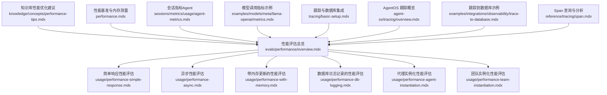

**图表来源**
- [性能评估总览](file://evals/performance/overview.mdx)
- [简单响应性能评估](file://evals/performance/usage/performance-simple-response.mdx)
- [异步性能评估](file://evals/performance/usage/performance-async.mdx)
- [带内存更新的性能评估](file://evals/performance/usage/performance-with-memory.mdx)
- [数据库日志记录的性能评估](file://evals/performance/usage/performance-db-logging.mdx)
- [代理实例化性能评估](file://evals/performance/usage/performance-agent-instantiation.mdx)
- [团队实例化性能评估](file://evals/performance/usage/performance-team-instantiation.mdx)
- [知识库性能优化建议](file://knowledge/concepts/performance-tips.mdx)
- [性能基准与内存测量](file://performance.mdx)
- [会话指标（Agent）](file://sessions/metrics/usage/agent-metrics.mdx)
- [模型调用指标示例](file://examples/models/meta/llama-openai/metrics.mdx)
- [跟踪与数据库集成](file://tracing/basic-setup.mdx)
- [AgentOS 跟踪概览](file://agent-os/tracing/overview.mdx)
- [跟踪到数据库示例](file://examples/integrations/observability/trace-to-database.mdx)
- [Span 查询与分析](file://reference/tracing/span.mdx)

**章节来源**
- [性能评估总览](file://evals/performance/overview.mdx)
- [性能基准与内存测量](file://performance.mdx)

## 核心组件
- 性能评估器（PerformanceEval）
  - 用于包装被测函数（同步或异步），执行多次迭代与预热运行，并输出延迟与内存指标摘要
  - 支持禁用运行时测量、调试模式、内存增长追踪、Top-N 内存分配展示等参数
- 代理（Agent）与团队（Team）
  - 作为被测对象，可配置工具、数据库、历史上下文、内存更新策略等
- 数据库（Db）
  - 用于持久化会话、记忆、存储与评估结果；支持 SQLite、PostgreSQL 等
- 跟踪与可观测性（Tracing）
  - 将执行过程拆分为 Trace 与 Span，支持批量导出、队列控制与统一数据库存储
- 指标与会话度量
  - 提供会话级指标查询接口，辅助定位性能瓶颈

**章节来源**
- [性能评估总览](file://evals/performance/overview.mdx)
- [简单响应性能评估](file://evals/performance/usage/performance-simple-response.mdx)
- [异步性能评估](file://evals/performance/usage/performance-async.mdx)
- [带内存更新的性能评估](file://evals/performance/usage/performance-with-memory.mdx)
- [数据库日志记录的性能评估](file://evals/performance/usage/performance-db-logging.mdx)
- [代理实例化性能评估](file://evals/performance/usage/performance-agent-instantiation.mdx)
- [团队实例化性能评估](file://evals/performance/usage/performance-team-instantiation.mdx)
- [会话指标（Agent）](file://sessions/metrics/usage/agent-metrics.mdx)
- [跟踪与数据库集成](file://tracing/basic-setup.mdx)

## 架构总览
下图展示了典型“性能评估”工作流：测试函数（同步/异步）由 PerformanceEval 包装，按配置执行多次迭代与预热；在需要时，将评估结果写入数据库；同时，系统可启用跟踪以捕获更细粒度的执行信息。

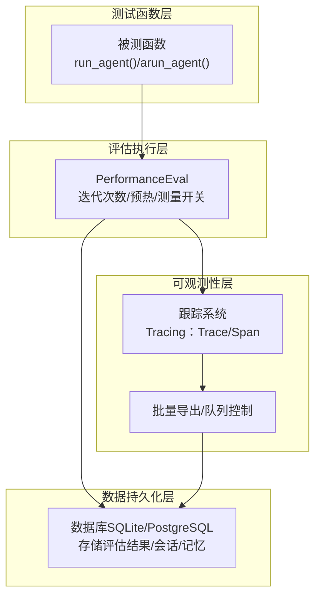

**图表来源**
- [性能评估总览](file://evals/performance/overview.mdx)
- [数据库日志记录的性能评估](file://evals/performance/usage/performance-db-logging.mdx)
- [跟踪与数据库集成](file://tracing/basic-setup.mdx)
- [AgentOS 跟踪概览](file://agent-os/tracing/overview.mdx)

## 详细组件分析

### 组件一：简单响应性能测试
- 目标：测量单次推理的延迟与内存占用
- 关键点：
  - 使用 PerformanceEval 包装同步函数
  - 设置迭代次数与预热轮数
  - 输出结果与摘要
- 典型流程：

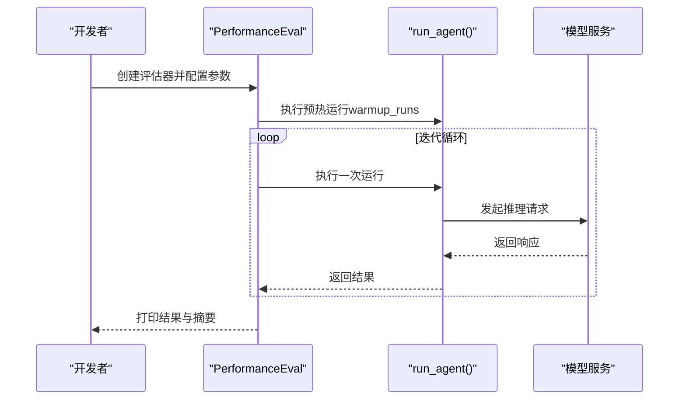

**图表来源**
- [简单响应性能评估](file://evals/performance/usage/performance-simple-response.mdx)
- [性能评估总览](file://evals/performance/overview.mdx)

**章节来源**
- [简单响应性能评估](file://evals/performance/usage/performance-simple-response.mdx)
- [性能评估总览](file://evals/performance/overview.mdx)

### 组件二：异步性能评估
- 目标：对异步函数进行性能评估
- 关键点：
  - 使用 asyncio 运行异步评估
  - 使用 PerformanceEval.arun 执行
- 典型流程：

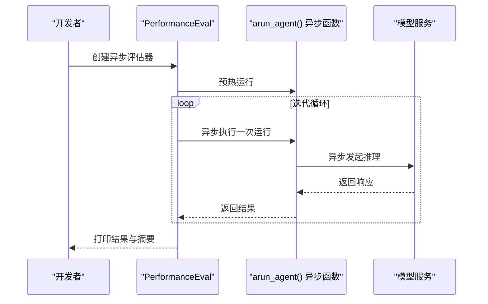

**图表来源**
- [异步性能评估](file://evals/performance/usage/performance-async.mdx)
- [性能评估总览](file://evals/performance/overview.mdx)

**章节来源**
- [异步性能评估](file://evals/performance/usage/performance-async.mdx)
- [性能评估总览](file://evals/performance/overview.mdx)

### 组件三：内存性能测试（含内存更新）
- 目标：评估包含记忆更新的运行对内存的影响
- 关键点：
  - 传入数据库实例以启用记忆功能
  - 可开启内存增长追踪与 Top-N 分配展示
- 典型流程：

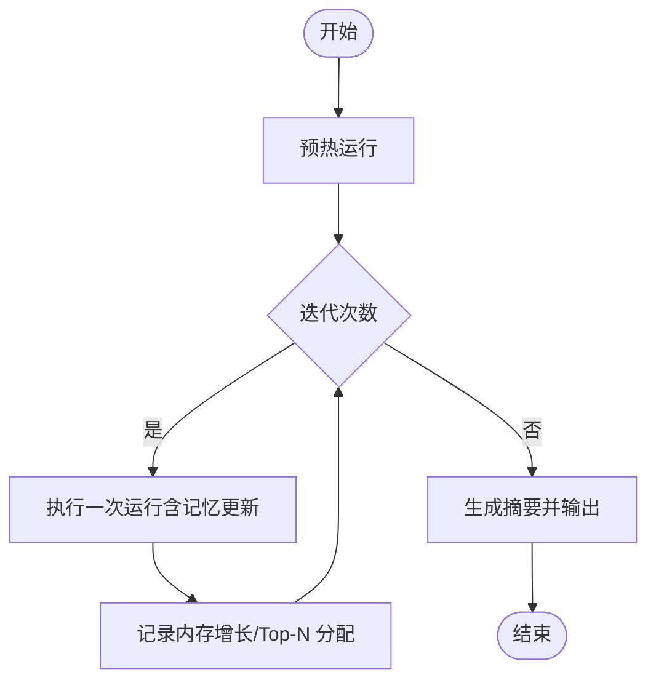

**图表来源**
- [带内存更新的性能评估](file://evals/performance/usage/performance-with-memory.mdx)
- [性能评估总览](file://evals/performance/overview.mdx)

**章节来源**
- [带内存更新的性能评估](file://evals/performance/usage/performance-with-memory.mdx)
- [性能评估总览](file://evals/performance/overview.mdx)

### 组件四：存储性能测试
- 目标：评估包含历史上下文与存储访问的运行性能
- 关键点：
  - 通过数据库连接进行上下文与历史读写
  - 可对比不同存储后端的性能差异
- 典型流程：

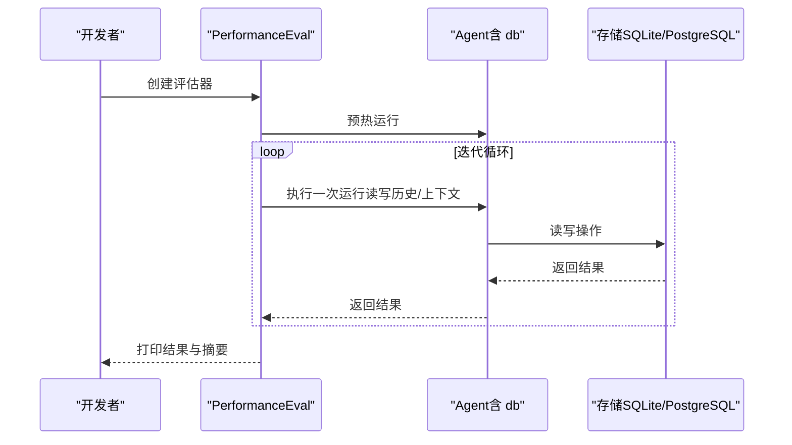

**图表来源**
- [数据库日志记录的性能评估](file://evals/performance/usage/performance-db-logging.mdx)
- [性能评估总览](file://evals/performance/overview.mdx)

**章节来源**
- [数据库日志记录的性能评估](file://evals/performance/usage/performance-db-logging.mdx)
- [性能评估总览](file://evals/performance/overview.mdx)

### 组件五：团队性能测试
- 目标：评估多成员团队在复杂任务下的性能表现
- 关键点：
  - 团队可配置多个成员与共享数据库
  - 支持并发执行与内存增长追踪
- 典型流程：

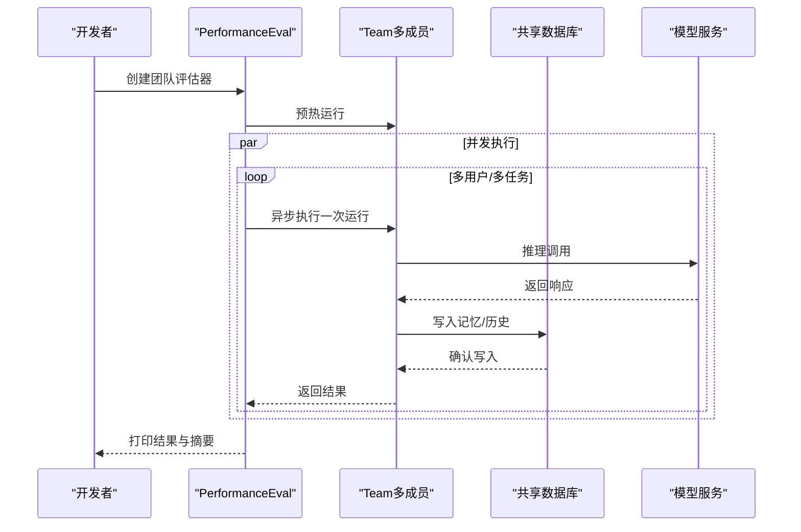

**图表来源**
- [团队实例化性能评估](file://evals/performance/usage/performance-team-instantiation.mdx)
- [性能评估总览](file://evals/performance/overview.mdx)

**章节来源**
- [团队实例化性能评估](file://evals/performance/usage/performance-team-instantiation.mdx)
- [性能评估总览](file://evals/performance/overview.mdx)

### 组件六：代理/团队实例化性能测试
- 目标：评估对象创建阶段的性能（实例化时间与内存）
- 关键点：
  - 通过大量重复实例化来统计分布
  - 可对比不同配置（如是否带工具）对实例化性能的影响
- 典型流程：

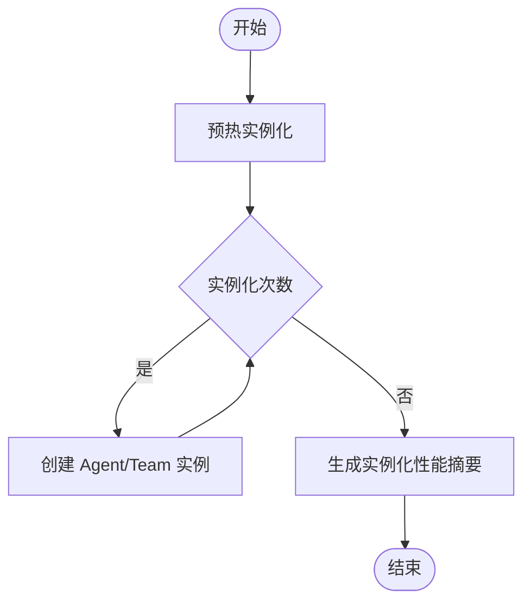

**图表来源**
- [代理实例化性能评估](file://evals/performance/usage/performance-agent-instantiation.mdx)
- [团队实例化性能评估](file://evals/performance/usage/performance-team-instantiation.mdx)
- [性能评估总览](file://evals/performance/overview.mdx)

**章节来源**
- [代理实例化性能评估](file://evals/performance/usage/performance-agent-instantiation.mdx)
- [团队实例化性能评估](file://evals/performance/usage/performance-team-instantiation.mdx)
- [性能评估总览](file://evals/performance/overview.mdx)

### 组件七：数据库日志记录与结果分析
- 目标：将评估结果持久化至数据库，便于后续查询与分析
- 关键点：
  - 在评估器中传入数据库实例
  - 结果表名可自定义
  - 可结合 AgentOS API 查询评估运行
- 典型流程：

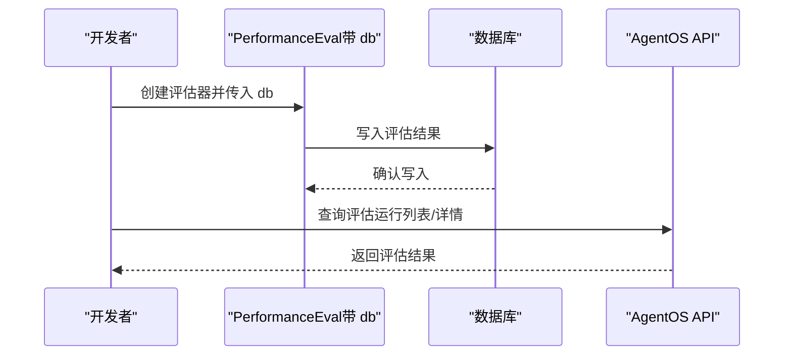

**图表来源**
- [数据库日志记录的性能评估](file://evals/performance/usage/performance-db-logging.mdx)
- [性能评估总览](file://evals/performance/overview.mdx)

**章节来源**
- [数据库日志记录的性能评估](file://evals/performance/usage/performance-db-logging.mdx)
- [性能评估总览](file://evals/performance/overview.mdx)

### 组件八：可观测性与跟踪（Span/Trace）
- 目标：通过跟踪系统获取细粒度的执行耗时、错误与令牌用量等信息
- 关键点：
  - 使用专用跟踪数据库，避免与业务数据混杂
  - 支持批量导出与队列控制
  - 可查询 Trace 与 Span，构建树形结构进行分析
- 典型流程：

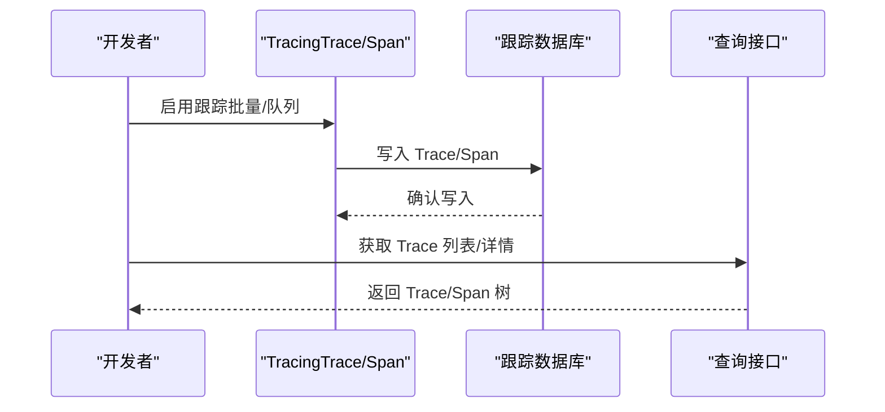

**图表来源**
- [跟踪与数据库集成](file://tracing/basic-setup.mdx)
- [AgentOS 跟踪概览](file://agent-os/tracing/overview.mdx)
- [Span 查询与分析](file://reference/tracing/span.mdx)
- [跟踪到数据库示例](file://examples/integrations/observability/trace-to-database.mdx)

**章节来源**
- [跟踪与数据库集成](file://tracing/basic-setup.mdx)
- [AgentOS 跟踪概览](file://agent-os/tracing/overview.mdx)
- [Span 查询与分析](file://reference/tracing/span.mdx)
- [跟踪到数据库示例](file://examples/integrations/observability/trace-to-database.mdx)

## 依赖关系分析
- 低耦合设计
  - PerformanceEval 仅依赖被测函数签名（同步/异步），与具体模型、工具解耦
  - 数据库与跟踪系统通过注入方式接入，便于替换与扩展
- 关键依赖链
  - 评估器 → 被测函数 → 模型服务
  - 评估器 → 数据库（可选）
  - 评估器 → 跟踪系统（可选）
- 潜在风险
  - 多数据库混用可能导致可观测性碎片化，建议使用专用跟踪数据库
  - 内存增长追踪依赖外部库，需确保环境一致

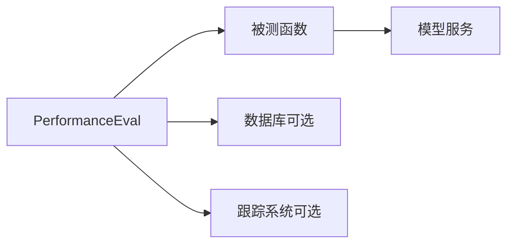

**图表来源**
- [性能评估总览](file://evals/performance/overview.mdx)
- [数据库日志记录的性能评估](file://evals/performance/usage/performance-db-logging.mdx)
- [跟踪与数据库集成](file://tracing/basic-setup.mdx)

**章节来源**
- [性能评估总览](file://evals/performance/overview.mdx)
- [跟踪与数据库集成](file://tracing/basic-setup.mdx)

## 性能考量
- 延迟测量
  - 使用 PerformanceEval 的迭代与预热机制，减少冷启动抖动
  - 对于异步函数，使用 arun 并行执行以提升吞吐
- 内存使用监控
  - 开启内存增长追踪与 Top-N 分配，定位热点对象
  - 在团队场景中关注并发任务对内存峰值的影响
- 系统资源消耗
  - 优先选择异步 API 与并行执行，降低阻塞等待
  - 合理配置跟踪系统的批量导出与队列大小，平衡实时性与开销
- 基准与对比
  - 参考官方基准（实例化时间与内存占用），结合自身硬件与部署环境复测
  - 对比不同框架/实现的相对性能，聚焦最小化开销与内存占用

**章节来源**
- [性能基准与内存测量](file://performance.mdx)
- [性能评估总览](file://evals/performance/overview.mdx)
- [跟踪与数据库集成](file://tracing/basic-setup.mdx)

## 故障排查指南
- 评估结果异常
  - 检查迭代次数与预热轮数是否合理
  - 确认被测函数是否包含外部 I/O 或缓存影响
- 内存泄漏或增长过快
  - 启用内存增长追踪，查看 Top-N 分配
  - 检查是否存在未释放的资源或重复对象
- 数据库写入失败
  - 确认数据库连接与权限
  - 检查表名与字段类型是否匹配
- 跟踪数据缺失
  - 确认已启用跟踪并配置专用数据库
  - 检查批量导出与队列设置是否导致延迟
- 指标不可见或为空
  - 确认已正确调用会话指标查询接口
  - 检查 Agent 是否在运行期间产生会话数据

**章节来源**
- [带内存更新的性能评估](file://evals/performance/usage/performance-with-memory.mdx)
- [数据库日志记录的性能评估](file://evals/performance/usage/performance-db-logging.mdx)
- [跟踪与数据库集成](file://tracing/basic-setup.mdx)
- [AgentOS 跟踪概览](file://agent-os/tracing/overview.mdx)
- [会话指标（Agent）](file://sessions/metrics/usage/agent-metrics.mdx)

## 结论
通过 PerformanceEval 与配套的数据库与跟踪能力，Agno 提供了从延迟、内存到系统资源的全栈性能评估方案。结合知识库性能优化建议与基准测试，开发者可以系统地识别瓶颈、验证改进效果，并在生产环境中持续监控与迭代。

## 附录
- 快速开始
  - 安装依赖：参见各使用示例的步骤说明
  - 导出模型密钥：按示例导出对应环境变量
  - 运行示例：根据示例脚本路径执行
- 参考路径
  - 简单响应性能测试：[示例路径](file://evals/performance/usage/performance-simple-response.mdx)
  - 异步性能评估：[示例路径](file://evals/performance/usage/performance-async.mdx)
  - 带内存更新的性能评估：[示例路径](file://evals/performance/usage/performance-with-memory.mdx)
  - 数据库日志记录的性能评估：[示例路径](file://evals/performance/usage/performance-db-logging.mdx)
  - 代理实例化性能评估：[示例路径](file://evals/performance/usage/performance-agent-instantiation.mdx)
  - 团队实例化性能评估：[示例路径](file://evals/performance/usage/performance-team-instantiation.mdx)
  - 知识库性能优化建议：[参考路径](file://knowledge/concepts/performance-tips.mdx)
  - 性能基准与内存测量：[参考路径](file://performance.mdx)
  - 会话指标（Agent）：[参考路径](file://sessions/metrics/usage/agent-metrics.mdx)
  - 模型调用指标示例：[参考路径](file://examples/models/meta/llama-openai/metrics.mdx)
  - 跟踪与数据库集成：[参考路径](file://tracing/basic-setup.mdx)
  - AgentOS 跟踪概览：[参考路径](file://agent-os/tracing/overview.mdx)
  - 跟踪到数据库示例：[参考路径](file://examples/integrations/observability/trace-to-database.mdx)
  - Span 查询与分析：[参考路径](file://reference/tracing/span.mdx)