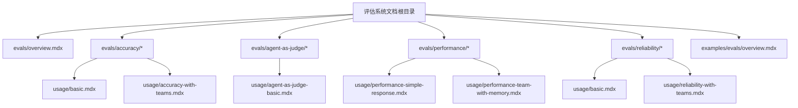
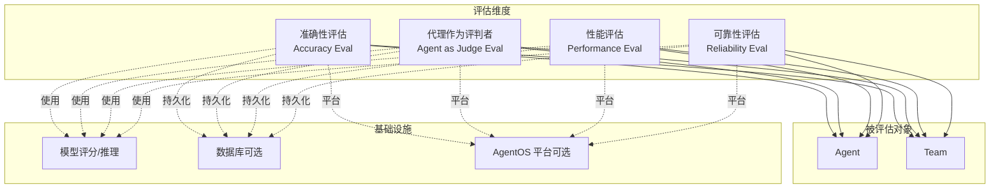
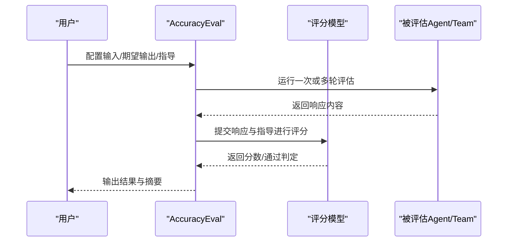
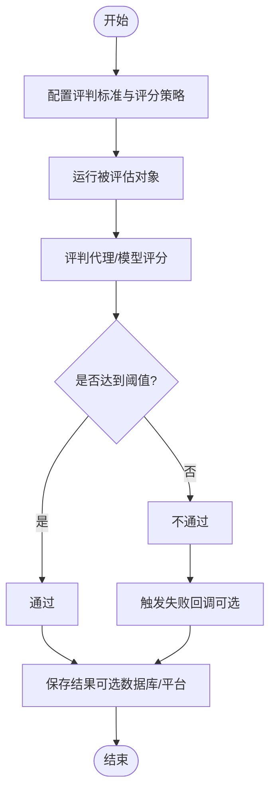
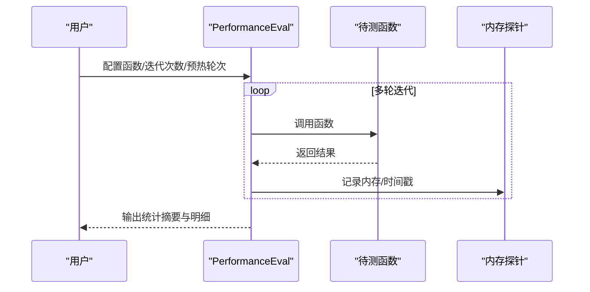
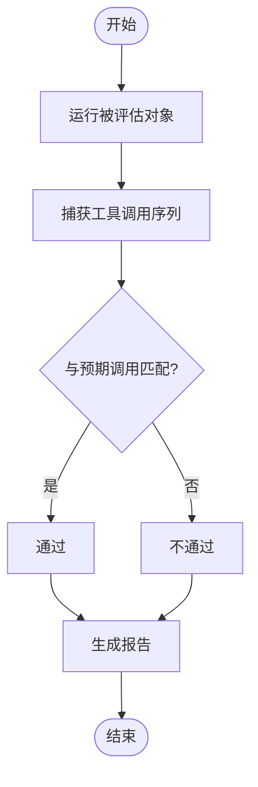
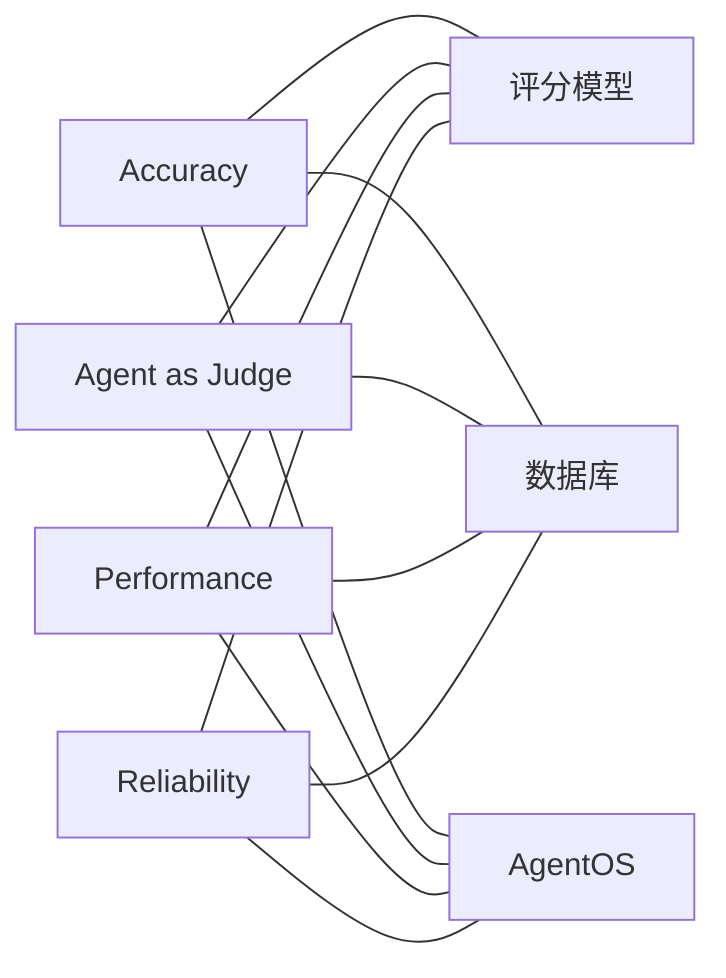

# 评估系统

<cite>
**本文引用的文件**
- [evals/overview.mdx](file://evals/overview.mdx)
- [evals/accuracy/overview.mdx](file://evals/accuracy/overview.mdx)
- [evals/agent-as-judge/overview.mdx](file://evals/agent-as-judge/overview.mdx)
- [evals/performance/overview.mdx](file://evals/performance/overview.mdx)
- [evals/reliability/overview.mdx](file://evals/reliability/overview.mdx)
- [evals/accuracy/usage/basic.mdx](file://evals/accuracy/usage/basic.mdx)
- [evals/accuracy/usage/accuracy-with-teams.mdx](file://evals/accuracy/usage/accuracy-with-teams.mdx)
- [evals/agent-as-judge/usage/agent-as-judge-basic.mdx](file://evals/agent-as-judge/usage/agent-as-judge-basic.mdx)
- [evals/performance/usage/performance-simple-response.mdx](file://evals/performance/usage/performance-simple-response.mdx)
- [evals/performance/usage/performance-team-with-memory.mdx](file://evals/performance/usage/performance-team-with-memory.mdx)
- [evals/reliability/usage/basic.mdx](file://evals/reliability/usage/basic.mdx)
- [evals/reliability/usage/reliability-with-teams.mdx](file://evals/reliability/usage/reliability-with-teams.mdx)
- [examples/evals/overview.mdx](file://examples/evals/overview.mdx)
</cite>

## 目录
1. [简介](#简介)
2. [项目结构](#项目结构)
3. [核心组件](#核心组件)
4. [架构总览](#架构总览)
5. [详细组件分析](#详细组件分析)
6. [依赖关系分析](#依赖关系分析)
7. [性能考量](#性能考量)
8. [故障排查指南](#故障排查指南)
9. [结论](#结论)
10. [附录](#附录)

## 简介
本文件面向评估系统使用者与维护者，系统性阐述如何在多维评估维度下衡量智能体（Agent）与团队（Team）的质量：准确性（Accuracy）、代理作为评判者（Agent as Judge）、性能（Performance）、可靠性（Reliability）。文档覆盖评估指标定义、方法选择、流程设计、结果解读与可操作的实践建议，并结合仓库中的示例路径，帮助开发者快速落地评估方案并持续优化系统表现。

## 项目结构
评估相关文档集中在 evals 目录下，按评估维度划分子目录，每个维度提供概览与使用示例，涵盖基础用法、异步执行、工具集成、团队评估、数据库持久化等主题。示例目录 examples/evals 提供可直接运行的案例清单，便于快速上手。

**图表来源**
- [evals/overview.mdx:1-66](file://evals/overview.mdx#L1-L66)
- [evals/accuracy/overview.mdx:1-359](file://evals/accuracy/overview.mdx#L1-L359)
- [evals/agent-as-judge/overview.mdx:1-150](file://evals/agent-as-judge/overview.mdx#L1-L150)
- [evals/performance/overview.mdx:1-452](file://evals/performance/overview.mdx#L1-L452)
- [evals/reliability/overview.mdx:1-248](file://evals/reliability/overview.mdx#L1-L248)
- [examples/evals/overview.mdx:1-12](file://examples/evals/overview.mdx#L1-L12)

**章节来源**
- [evals/overview.mdx:1-66](file://evals/overview.mdx#L1-L66)
- [examples/evals/overview.mdx:1-12](file://examples/evals/overview.mdx#L1-L12)

## 核心组件
- 准确性评估（Accuracy Eval）
  - 通过“大模型作为评判者”（LLM-as-a-judge）对比期望输出与实际响应，给出评分或通过判定。
  - 支持单智能体与团队评估；支持给定输出直接评分；支持异步评估；支持附加指导原则。
- 代理作为评判者（Agent as Judge Eval）
  - 自定义质量标准（如“专业语气”、“事实准确”、“用户友好”），由评判代理对输出进行数值或二元评分，并可设置阈值与失败回调。
- 性能评估（Performance Eval）
  - 测量延迟与内存占用，支持函数级评估、异步函数、工具使用影响、内存更新、存储读写、实例化开销等多场景。
- 可靠性评估（Reliability Eval）
  - 验证是否执行了预期工具调用、错误处理能力、速率限制行为等，支持单智能体与团队。

**章节来源**
- [evals/accuracy/overview.mdx:12-359](file://evals/accuracy/overview.mdx#L12-L359)
- [evals/agent-as-judge/overview.mdx:10-150](file://evals/agent-as-judge/overview.mdx#L10-L150)
- [evals/performance/overview.mdx:11-452](file://evals/performance/overview.mdx#L11-L452)
- [evals/reliability/overview.mdx:16-248](file://evals/reliability/overview.mdx#L16-L248)

## 架构总览
评估系统围绕“输入/期望输出/工具/模型”构建，不同维度的评估器以统一的运行接口（同步/异步）执行评估，并可选地将结果持久化到数据库或平台端点，便于长期追踪与可视化。

**图表来源**
- [evals/accuracy/overview.mdx:12-359](file://evals/accuracy/overview.mdx#L12-L359)
- [evals/agent-as-judge/overview.mdx:10-150](file://evals/agent-as-judge/overview.mdx#L10-L150)
- [evals/performance/overview.mdx:11-452](file://evals/performance/overview.mdx#L11-L452)
- [evals/reliability/overview.mdx:16-248](file://evals/reliability/overview.mdx#L16-L248)

## 详细组件分析

### 准确性评估（Accuracy Eval）
- 设计要点
  - 输入与期望输出明确，必要时附加评判指导（如步骤完整性、格式要求）。
  - 评分模型与被评估模型解耦，避免自评偏差。
  - 支持迭代多次取平均分，提升稳定性。
- 典型场景
  - 基础计算题：通过工具完成中间步骤，最终给出正确答案。
  - 团队路由：根据语言自动路由至合适成员，输出应符合预期。
  - 给定输出评分：无需真实运行，仅对已有输出打分。
  - 异步评估：适合批量或并发场景。
- 结果解读
  - 数值评分（如 1-10）或通过/不通过（阈值设定）。
  - 多轮迭代取均值，关注方差与异常样本。
- 实践建议
  - 构建多样化测试集，覆盖边界与反例。
  - 将评测结果接入平台，形成趋势图与回归告警。

**图表来源**
- [evals/accuracy/overview.mdx:12-359](file://evals/accuracy/overview.mdx#L12-L359)

**章节来源**
- [evals/accuracy/overview.mdx:12-359](file://evals/accuracy/overview.mdx#L12-L359)
- [evals/accuracy/usage/basic.mdx:1-65](file://evals/accuracy/usage/basic.mdx#L1-L65)
- [evals/accuracy/usage/accuracy-with-teams.mdx:1-88](file://evals/accuracy/usage/accuracy-with-teams.mdx#L1-L88)

### 代理作为评判者（Agent as Judge Eval）
- 设计要点
  - 明确评判标准（Criteria），可选数值评分（1-10）或二元通过/不通过。
  - 支持自定义评判代理（Evaluator Agent），以更强的判准提升一致性。
  - 可设置阈值与失败回调，便于自动化治理与再触发。
- 典型场景
  - 文档质量：清晰度、初学者友好度、术语使用规范。
  - 技术准确性：深度、严谨性、参考来源标注。
- 结果解读
  - 分数分布与通过率随时间变化，识别退化与波动。
  - 失败样例用于迭代评判标准与提示词。
- 实践建议
  - 将评判标准结构化为可复用的模板。
  - 对失败样例进行人工复核与归因，驱动标准微调。

**图表来源**
- [evals/agent-as-judge/overview.mdx:10-150](file://evals/agent-as-judge/overview.mdx#L10-L150)

**章节来源**
- [evals/agent-as-judge/overview.mdx:10-150](file://evals/agent-as-judge/overview.mdx#L10-L150)
- [evals/agent-as-judge/usage/agent-as-judge-basic.mdx:1-91](file://evals/agent-as-judge/usage/agent-as-judge-basic.mdx#L1-L91)

### 性能评估（Performance Eval）
- 设计要点
  - 关注延迟与内存增长，区分“响应耗时”与“内存增长”两类指标。
  - 支持函数级评估、异步函数、工具使用、内存更新、存储读写、实例化开销等场景。
  - 可配置预热轮次、迭代次数与调试模式，便于定位瓶颈。
- 典型场景
  - 单次响应性能：简洁回答、无工具调用。
  - 工具使用性能：工具初始化与调用对整体性能的影响。
  - 内存更新性能：开启记忆更新后的内存增长趋势。
  - 存储读写性能：历史记录读取/写入对性能的影响。
  - 实例化性能：Agent/Team 的构造成本。
- 结果解读
  - 延迟分布（均值/中位数/分位数）、内存峰值与增长速率。
  - 不同配置下的对比，识别回归点。
- 实践建议
  - 在 CI 中固定场景做回归对比，建立基线。
  - 对高内存增长场景引入上限与回收策略验证。

**图表来源**
- [evals/performance/overview.mdx:11-452](file://evals/performance/overview.mdx#L11-L452)

**章节来源**
- [evals/performance/overview.mdx:11-452](file://evals/performance/overview.mdx#L11-L452)
- [evals/performance/usage/performance-simple-response.mdx:1-72](file://evals/performance/usage/performance-simple-response.mdx#L1-L72)
- [evals/performance/usage/performance-team-with-memory.mdx:1-126](file://evals/performance/usage/performance-team-with-memory.mdx#L1-L126)

### 可靠性评估（Reliability Eval）
- 设计要点
  - 关注“是否执行了预期工具调用”，以及错误处理与限流行为。
  - 支持单智能体与团队，团队场景需考虑任务委派工具调用。
- 典型场景
  - 单工具调用：确保关键步骤（如阶乘、乘方）被正确调用。
  - 多工具调用：复杂问题需要多个工具串联。
  - 团队协作：委派任务给成员并调用外部工具获取信息。
- 结果解读
  - 通过/不通过，失败时输出未命中工具列表与原因。
  - 结合日志与回放，定位模型未按预期调用工具的原因。
- 实践建议
  - 将“预期工具调用”标准化为测试用例，随代码演进同步维护。
  - 对易错工具增加重试与降级策略，并纳入可靠性评估。

**图表来源**
- [evals/reliability/overview.mdx:16-248](file://evals/reliability/overview.mdx#L16-L248)

**章节来源**
- [evals/reliability/overview.mdx:16-248](file://evals/reliability/overview.mdx#L16-L248)
- [evals/reliability/usage/basic.mdx:1-70](file://evals/reliability/usage/basic.mdx#L1-L70)
- [evals/reliability/usage/reliability-with-teams.mdx:1-90](file://evals/reliability/usage/reliability-with-teams.mdx#L1-L90)

## 依赖关系分析
- 维度内聚性
  - 各评估维度职责清晰：Accuracy 聚焦“是否正确”，Agent as Judge 聚焦“主观质量”，Performance 聚焦“资源消耗”，Reliability 聚焦“动作一致性”。
- 维度间耦合
  - 评估器共享统一的运行接口（同步/异步）、可选数据库与平台集成，降低重复开发成本。
- 外部依赖
  - 评分模型（如 gpt-5-mini/gpt-5.2）与第三方工具（计算器、股票查询、新闻检索等）。
  - 数据库（SQLite/PostgreSQL）与 AgentOS 平台用于结果持久化与可视化。

**图表来源**
- [evals/accuracy/overview.mdx:12-359](file://evals/accuracy/overview.mdx#L12-L359)
- [evals/agent-as-judge/overview.mdx:10-150](file://evals/agent-as-judge/overview.mdx#L10-L150)
- [evals/performance/overview.mdx:11-452](file://evals/performance/overview.mdx#L11-L452)
- [evals/reliability/overview.mdx:16-248](file://evals/reliability/overview.mdx#L16-L248)

**章节来源**
- [evals/accuracy/overview.mdx:12-359](file://evals/accuracy/overview.mdx#L12-L359)
- [evals/agent-as-judge/overview.mdx:10-150](file://evals/agent-as-judge/overview.mdx#L10-L150)
- [evals/performance/overview.mdx:11-452](file://evals/performance/overview.mdx#L11-L452)
- [evals/reliability/overview.mdx:16-248](file://evals/reliability/overview.mdx#L16-L248)

## 性能考量
- 评估开销控制
  - 合理设置迭代次数与预热轮次，避免长尾噪声。
  - 对异步场景使用 arun 接口，减少阻塞。
- 资源监控
  - 在工具密集与内存更新场景启用内存增长跟踪，识别泄漏与峰值。
- 可观测性
  - 将评估结果接入平台，形成趋势图与回归告警，支撑持续优化。

## 故障排查指南
- 准确性评估
  - 若评分过低：检查期望输出与指导语是否清晰；尝试提高评分模型能力；扩大测试集覆盖边界。
  - 若结果不稳定：增加迭代次数取均值；排除随机性因素（如温度、采样策略）。
- 代理作为评判者
  - 若频繁不通过：调整阈值或细化评判标准；检查失败回调是否正确触发并记录原因。
- 性能评估
  - 若延迟异常：对比工具调用前后差异；检查数据库写入/读取路径；确认实例化成本。
  - 若内存增长异常：排查会话历史累积与缓存清理策略；确认数据库连接池配置。
- 可靠性评估
  - 若工具调用缺失：检查工具注册与权限；确认提示词是否引导模型按顺序调用；对团队场景检查委派逻辑。

## 结论
评估系统通过“准确性、代理作为评判者、性能、可靠性”四个维度，为智能体与团队提供全面的质量画像。建议从简单准确性起步，逐步扩展到代理作为评判者与性能、可靠性评估，形成跨维度的持续评估闭环，并将结果沉淀到平台，驱动产品迭代与工程优化。

## 附录
- 快速开始
  - 安装依赖与导出密钥后，运行各维度示例脚本，观察输出与摘要。
- 示例清单
  - 参考 examples/evals/overview.mdx 获取可运行示例列表与简要说明。

**章节来源**
- [examples/evals/overview.mdx:1-12](file://examples/evals/overview.mdx#L1-L12)