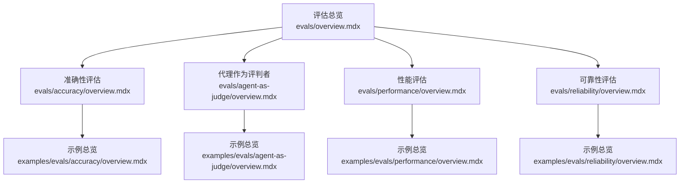
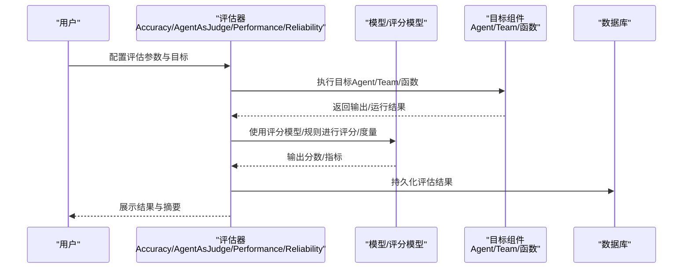
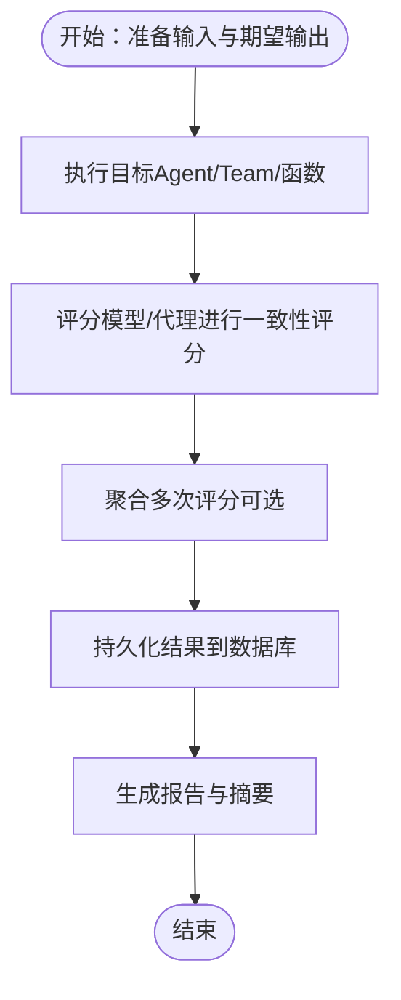
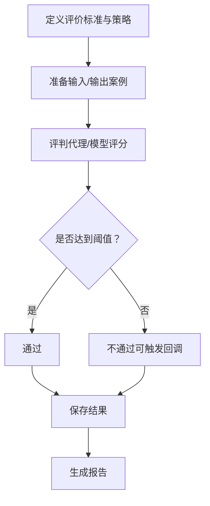
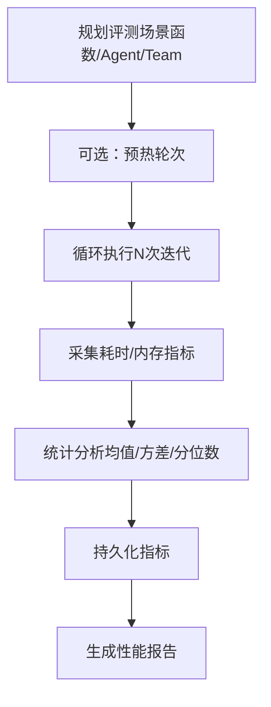
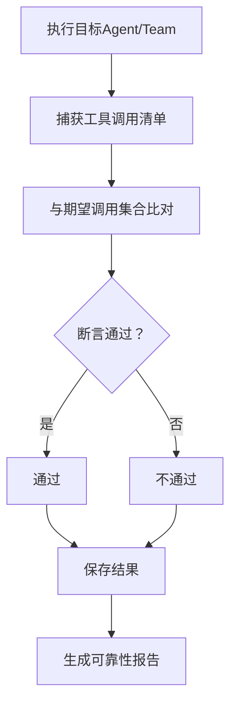
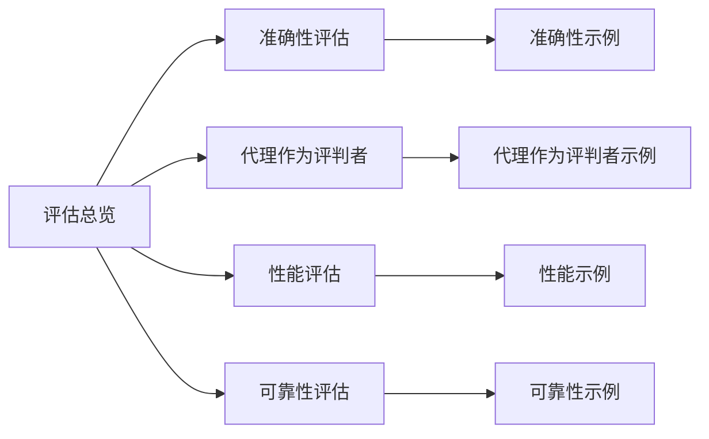

# 评估系统概述

<cite>
**本文引用的文件**
- [evals/overview.mdx](file://evals/overview.mdx)
- [evals/accuracy/overview.mdx](file://evals/accuracy/overview.mdx)
- [evals/agent-as-judge/overview.mdx](file://evals/agent-as-judge/overview.mdx)
- [evals/performance/overview.mdx](file://evals/performance/overview.mdx)
- [evals/reliability/overview.mdx](file://evals/reliability/overview.mdx)
- [examples/evals/accuracy/overview.mdx](file://examples/evals/accuracy/overview.mdx)
- [examples/evals/agent-as-judge/overview.mdx](file://examples/evals/agent-as-judge/overview.mdx)
- [examples/evals/performance/overview.mdx](file://examples/evals/performance/overview.mdx)
- [examples/evals/reliability/overview.mdx](file://examples/evals/reliability/overview.mdx)
</cite>

## 目录
1. [简介](#简介)
2. [项目结构](#项目结构)
3. [核心组件](#核心组件)
4. [架构总览](#架构总览)
5. [详细组件分析](#详细组件分析)
6. [依赖关系分析](#依赖关系分析)
7. [性能考量](#性能考量)
8. [故障排查指南](#故障排查指南)
9. [结论](#结论)
10. [附录](#附录)

## 简介
本文件面向希望系统性评估智能代理（Agent）与团队（Team）质量的读者，提供评估系统的整体概览与实操指南。评估系统通过四大维度帮助构建可量化、可追踪、可持续改进的质量保障体系：
- 准确性评估：衡量代理输出与期望答案的一致性，常采用“大模型即评判者”（LLM-as-a-judge）方法。
- 代理作为评判者：定义自定义质量标准，由另一个代理或模型对输出进行评分。
- 性能评估：关注响应延迟与内存占用等运行时指标，支持同步与异步函数评测。
- 可靠性评估：验证工具调用是否符合预期、错误处理是否稳健、速率限制是否被尊重。

评估系统的价值在于：
- 将主观的质量判断转化为可重复、可比较的客观指标；
- 在开发迭代中持续监控质量趋势，辅助回归检测；
- 为不同场景（如工具调用、多模态、团队协作）提供针对性的评测策略；
- 与平台集成，统一存储与可视化评测结果，便于跨版本对比与归档。

## 项目结构
评估相关文档集中在 evals 目录下，并配套 examples 中的示例，覆盖四大维度的使用方式与最佳实践。

图表来源
- [evals/overview.mdx:1-66](file://evals/overview.mdx#L1-L66)
- [evals/accuracy/overview.mdx:1-359](file://evals/accuracy/overview.mdx#L1-L359)
- [evals/agent-as-judge/overview.mdx:1-150](file://evals/agent-as-judge/overview.mdx#L1-L150)
- [evals/performance/overview.mdx:1-452](file://evals/performance/overview.mdx#L1-L452)
- [evals/reliability/overview.mdx:1-248](file://evals/reliability/overview.mdx#L1-L248)
- [examples/evals/accuracy/overview.mdx:1-15](file://examples/evals/accuracy/overview.mdx#L1-L15)
- [examples/evals/agent-as-judge/overview.mdx:1-17](file://examples/evals/agent-as-judge/overview.mdx#L1-L17)
- [examples/evals/performance/overview.mdx:1-20](file://examples/evals/performance/overview.mdx#L1-L20)
- [examples/evals/reliability/overview.mdx:1-13](file://examples/evals/reliability/overview.mdx#L1-L13)

章节来源
- [evals/overview.mdx:1-66](file://evals/overview.mdx#L1-L66)

## 核心组件
- 评估维度与入口
  - 准确性评估：以期望输出为基准，结合 LLM-as-a-judge 进行一致性打分。
  - 代理作为评判者：自定义质量标准，支持数值或二元评分策略。
  - 性能评估：测量函数执行耗时与内存增长，支持同步与异步函数。
  - 可靠性评估：校验工具调用序列与错误处理行为，支持单代理与团队。

- 平台与持久化
  - 支持将评估结果写入数据库（如 SQLite、PostgreSQL），并通过 AgentOS 平台统一查看与管理。

章节来源
- [evals/accuracy/overview.mdx:1-359](file://evals/accuracy/overview.mdx#L1-L359)
- [evals/agent-as-judge/overview.mdx:1-150](file://evals/agent-as-judge/overview.mdx#L1-L150)
- [evals/performance/overview.mdx:1-452](file://evals/performance/overview.mdx#L1-L452)
- [evals/reliability/overview.mdx:1-248](file://evals/reliability/overview.mdx#L1-L248)

## 架构总览
评估系统围绕“输入-执行-评分/度量-记录”的闭环工作流展开，典型流程如下：

图表来源
- [evals/accuracy/overview.mdx:12-76](file://evals/accuracy/overview.mdx#L12-L76)
- [evals/agent-as-judge/overview.mdx:10-81](file://evals/agent-as-judge/overview.mdx#L10-L81)
- [evals/performance/overview.mdx:11-42](file://evals/performance/overview.mdx#L11-L42)
- [evals/reliability/overview.mdx:16-47](file://evals/reliability/overview.mdx#L16-L47)

## 详细组件分析

### 准确性评估（Accuracy Evals）
- 目标
  - 衡量代理输出与期望答案的匹配程度，支持数值与步骤要求等多维判定。
- 适用场景
  - 数值计算、逻辑推理、步骤式任务、工具辅助问答等。
- 实现原理
  - 提供输入与期望输出，由评分模型（可为独立模型或“代理即评判者”）对输出进行一致性评分；支持多次迭代取平均分。
- 关键能力
  - 支持 Agent/Team 两种目标对象；
  - 支持传入已知输出直接评分；
  - 支持异步执行；
  - 可配置额外指导原则提升评分稳定性。
- 最佳实践
  - 先从简单用例起步，逐步引入复杂场景；
  - 多样化测试集覆盖边界条件；
  - 结合工具使用场景设计评分规则；
  - 使用平台记录与对比历史结果。

图表来源
- [evals/accuracy/overview.mdx:12-76](file://evals/accuracy/overview.mdx#L12-L76)

章节来源
- [evals/accuracy/overview.mdx:1-359](file://evals/accuracy/overview.mdx#L1-L359)
- [examples/evals/accuracy/overview.mdx:1-15](file://examples/evals/accuracy/overview.mdx#L1-L15)

### 代理作为评判者（Agent as Judge Evals）
- 目标
  - 定义定制化质量标准，由代理对输出进行评分，灵活适配业务语义。
- 适用场景
  - 专业性、友好度、技术准确性、合规性等主观质量维度。
- 实现原理
  - 明确评价标准与评分策略（数值 1-10 或二元通过/不通过），必要时提供额外指导原则；可指定专用“评判代理”以强化风格或标准。
- 关键能力
  - 支持单次或批量案例；
  - 支持失败回调与阈值控制；
  - 支持异步评测；
  - 可与数据库集成记录结果。
- 最佳实践
  - 评分策略与阈值应与业务目标一致；
  - 对复杂标准建议使用“评判代理”并明确指令；
  - 批量评测前先小规模验证评分一致性。

图表来源
- [evals/agent-as-judge/overview.mdx:10-81](file://evals/agent-as-judge/overview.mdx#L10-L81)

章节来源
- [evals/agent-as-judge/overview.mdx:1-150](file://evals/agent-as-judge/overview.mdx#L1-L150)
- [examples/evals/agent-as-judge/overview.mdx:1-17](file://examples/evals/agent-as-judge/overview.mdx#L1-L17)

### 性能评估（Performance Evals）
- 目标
  - 测量响应延迟与内存占用，识别性能瓶颈与资源增长趋势。
- 适用场景
  - 基线响应时间、工具调用开销、内存更新、并发场景、团队协作等。
- 实现原理
  - 包装待测函数（同步/异步），在多次迭代中采集耗时与内存数据；可选择关闭/开启预热轮次；支持开启内存增长跟踪。
- 关键能力
  - 支持 Agent/Team/函数三种目标；
  - 支持异步函数评测；
  - 支持与数据库集成记录指标；
  - 可打印详细结果与摘要。
- 最佳实践
  - 先做基线评测，再叠加工具、存储、并发等变量；
  - 合理设置迭代次数与预热轮次；
  - 关注内存增长而非仅延迟，避免资源泄漏。

图表来源
- [evals/performance/overview.mdx:11-42](file://evals/performance/overview.mdx#L11-L42)

章节来源
- [evals/performance/overview.mdx:1-452](file://evals/performance/overview.mdx#L1-L452)
- [examples/evals/performance/overview.mdx:1-20](file://examples/evals/performance/overview.mdx#L1-L20)

### 可靠性评估（Reliability Evals）
- 目标
  - 验证代理/团队是否按预期发起工具调用、是否正确处理异常与限流。
- 适用场景
  - 工具链路完整性、多步骤工具编排、团队任务委派、错误恢复与重试。
- 实现原理
  - 基于一次运行的工具调用清单，比对期望调用集合；支持断言通过/失败；可对 Agent/Team 的运行输出进行评估。
- 关键能力
  - 支持单工具与多工具调用验证；
  - 支持团队级工具委派与成员交互；
  - 支持异步评测；
  - 可与数据库集成记录结果。
- 最佳实践
  - 明确每条路径的期望工具调用序列；
  - 覆盖正常路径与异常路径；
  - 团队场景下关注委派与协作的正确性。

图表来源
- [evals/reliability/overview.mdx:16-47](file://evals/reliability/overview.mdx#L16-L47)

章节来源
- [evals/reliability/overview.mdx:1-248](file://evals/reliability/overview.mdx#L1-L248)
- [examples/evals/reliability/overview.mdx:1-13](file://examples/evals/reliability/overview.mdx#L1-L13)

## 依赖关系分析
评估系统在文档层面呈现为“总览 → 维度 → 示例”的层级结构，各维度相互独立又可组合使用，形成全面的质量画像。

图表来源
- [evals/overview.mdx:1-66](file://evals/overview.mdx#L1-L66)
- [examples/evals/accuracy/overview.mdx:1-15](file://examples/evals/accuracy/overview.mdx#L1-L15)
- [examples/evals/agent-as-judge/overview.mdx:1-17](file://examples/evals/agent-as-judge/overview.mdx#L1-L17)
- [examples/evals/performance/overview.mdx:1-20](file://examples/evals/performance/overview.mdx#L1-L20)
- [examples/evals/reliability/overview.mdx:1-13](file://examples/evals/reliability/overview.mdx#L1-L13)

## 性能考量
- 评测成本控制
  - 合理设置迭代次数与预热轮次，避免过长评测时间；
  - 异步评测优先用于高并发或长耗时场景。
- 内存与资源
  - 开启内存增长跟踪，关注峰值与增长速率；
  - 在团队与存储场景下，注意上下文累积与历史加载的影响。
- 数据持久化与可观测性
  - 使用数据库统一记录指标，便于趋势分析与回归定位；
  - 通过平台接口查询与导出评估结果，支撑自动化流水线。

## 故障排查指南
- 准确性评估
  - 若评分不稳定，检查评分模型与指导原则是否清晰；尝试增加迭代次数取平均分。
  - 使用“代理即评判者”模式时，确保评判代理的指令明确且无歧义。
- 代理作为评判者
  - 数值评分波动较大时，考虑调整阈值或评分策略；二元评分适合强约束场景。
  - 批量评测失败时，先单案例验证，再扩大范围。
- 性能评估
  - 延迟异常升高时，逐项排除工具、存储、并发等因素；关注内存泄漏迹象。
  - 异步评测需确保事件循环与资源释放正确。
- 可靠性评估
  - 工具调用缺失时，检查代理/团队的工具注册与路由逻辑；
  - 团队场景下核对委派工具与成员职责划分。

## 结论
评估系统通过“准确性、代理作为评判者、性能、可靠性”四维评测，为智能代理与团队提供可落地的质量保障方案。建议从简单用例起步，逐步扩展到复杂场景与批量评测，并结合平台与数据库实现持续追踪与改进。通过统一的评估流程与结果解读方法，能够在研发全生命周期中稳定提升智能体质量。

## 附录

### 快速开始：基础质量检查
以下示例展示如何使用评估系统进行基本的质量检查，涵盖准确性评估的最小可用流程。

- 步骤
  - 准备目标：Agent/Team 或待测函数；
  - 准备输入与期望输出（或质量标准）；
  - 选择评估维度（准确性/代理作为评判者/性能/可靠性）；
  - 执行评测并查看结果；
  - 可选：将结果写入数据库并通过平台查看。

- 示例参考
  - 准确性评估（最小示例）：[evals/overview.mdx:29-49](file://evals/overview.mdx#L29-L49)
  - 代理作为评判者（最小示例）：[evals/agent-as-judge/overview.mdx:14-44](file://evals/agent-as-judge/overview.mdx#L14-L44)
  - 性能评估（最小示例）：[evals/performance/overview.mdx:13-42](file://evals/performance/overview.mdx#L13-L42)
  - 可靠性评估（最小示例）：[evals/reliability/overview.mdx:20-47](file://evals/reliability/overview.mdx#L20-L47)

章节来源
- [evals/overview.mdx:27-66](file://evals/overview.mdx#L27-L66)