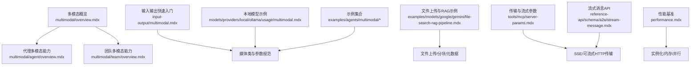
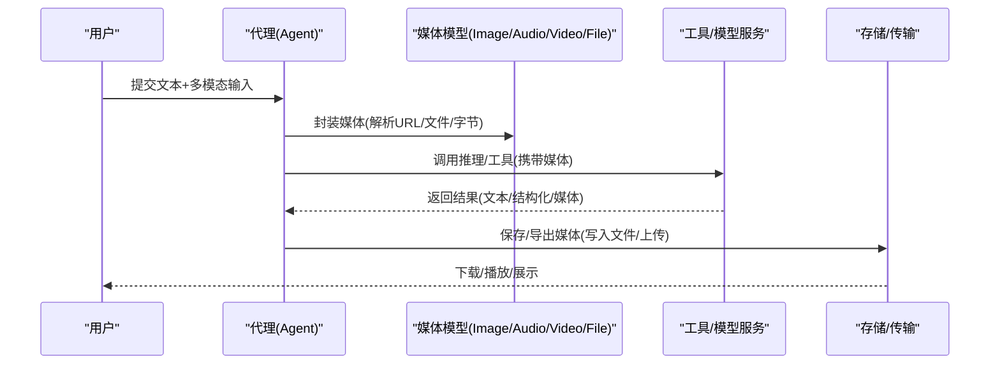
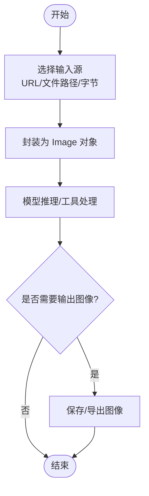
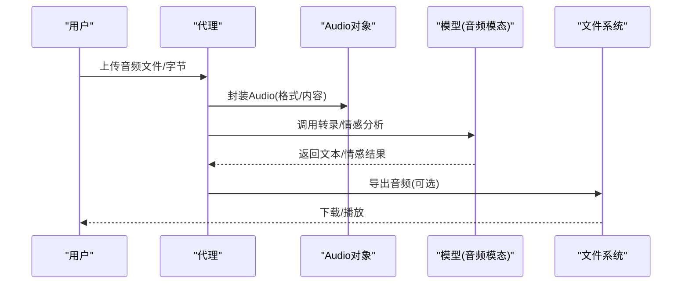
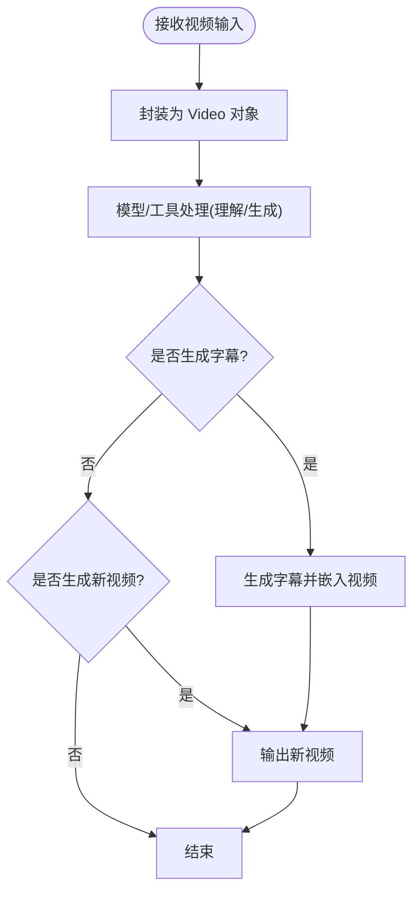
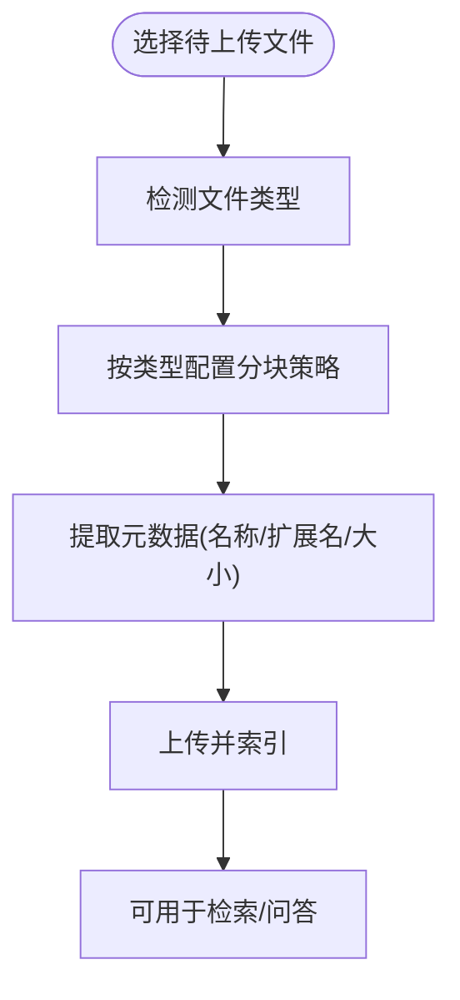
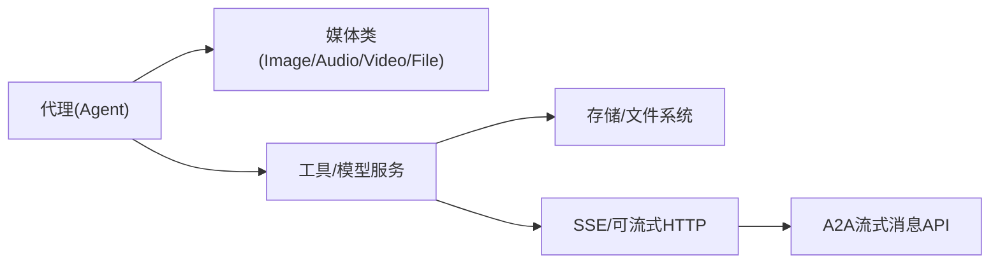

# 多模态支持

<cite>
**本文引用的文件**
- [input-output/multimodal.mdx](file://input-output/multimodal.mdx)
- [multimodal/overview.mdx](file://multimodal/overview.mdx)
- [multimodal/agent/overview.mdx](file://multimodal/agent/overview.mdx)
- [multimodal/team/overview.mdx](file://multimodal/team/overview.mdx)
- [models/providers/local/ollama/usage/multimodal.mdx](file://models/providers/local/ollama/usage/multimodal.mdx)
- [examples/agents/multimodal/audio-input-output.mdx](file://examples/agents/multimodal/audio-input-output.mdx)
- [examples/agents/multimodal/image-to-audio.mdx](file://examples/agents/multimodal/image-to-audio.mdx)
- [examples/agents/multimodal/video-caption.mdx](file://examples/agents/multimodal/video-caption.mdx)
- [examples/agents/multimodal/image-to-structured-output.mdx](file://examples/agents/multimodal/image-to-structured-output.mdx)
- [examples/agents/multimodal/media-input-for-tool.mdx](file://examples/agents/multimodal/media-input-for-tool.mdx)
- [examples/models/google/gemini/file-search-rag-pipeline.mdx](file://examples/models/google/gemini/file-search-rag-pipeline.mdx)
- [tools/mcp/server-params.mdx](file://tools/mcp/server-params.mdx)
- [reference-api/schema/a2a/stream-message.mdx](file://reference-api/schema/a2a/stream-message.mdx)
- [performance.mdx](file://performance.mdx)
- [other/v2-changelog.mdx](file://other/v2-changelog.mdx)
</cite>

## 目录
1. [简介](#简介)
2. [项目结构](#项目结构)
3. [核心组件](#核心组件)
4. [架构总览](#架构总览)
5. [详细组件分析](#详细组件分析)
6. [依赖分析](#依赖分析)
7. [性能考虑](#性能考虑)
8. [故障排查指南](#故障排查指南)
9. [结论](#结论)
10. [附录](#附录)

## 简介
本技术文档围绕多模态输入输出系统，系统性说明如何在代理（Agent）与团队（Team）中处理文本、图像、音频、视频与文件等多类型数据。文档覆盖以下关键主题：
- 多模态数据的统一模型与参数规范（如 Image、Audio、Video、File）
- 输入路径：URL、本地文件路径、字节内容（含 Base64）与格式标注
- 输出路径：生成图片与音频，以及跨模态组合（如图像转文本再转语音）
- 媒体处理要点：图像上传、格式转换、尺寸调整、音频/视频流式传输与实时处理
- 文件上传与下载：分块上传、进度跟踪与元数据管理
- 在代理中集成多模态能力的实际示例与最佳实践
- 性能优化建议与规模化部署策略

## 项目结构
该仓库提供了从概念到示例、从 API 规范到性能评测的完整多模态能力体系：
- 概念与总览：multimodal/overview.mdx、multimodal/agent/overview.mdx、multimodal/team/overview.mdx
- 快速入门与 I/O 模型：input-output/multimodal.mdx
- 本地模型示例：models/providers/local/ollama/usage/multimodal.mdx
- 丰富示例：agents/multimodal 与 teams/multimodal 下的多种用例
- 文件处理与 RAG：examples/models/google/gemini/file-search-rag-pipeline.mdx
- 传输与流式：tools/mcp/server-params.mdx、reference-api/schema/a2a/stream-message.mdx
- 性能基准与优化：performance.mdx
- 变更与迁移：other/v2-changelog.mdx

**图表来源**
- [multimodal/overview.mdx:1-37](file://multimodal/overview.mdx#L1-L37)
- [multimodal/agent/overview.mdx:179-275](file://multimodal/agent/overview.mdx#L179-L275)
- [multimodal/team/overview.mdx:57-80](file://multimodal/team/overview.mdx#L57-L80)
- [input-output/multimodal.mdx:11-18](file://input-output/multimodal.mdx#L11-L18)
- [models/providers/local/ollama/usage/multimodal.mdx:7-24](file://models/providers/local/ollama/usage/multimodal.mdx#L7-L24)
- [examples/models/google/gemini/file-search-rag-pipeline.mdx:44-75](file://examples/models/google/gemini/file-search-rag-pipeline.mdx#L44-L75)
- [tools/mcp/server-params.mdx:26-37](file://tools/mcp/server-params.mdx#L26-L37)
- [reference-api/schema/a2a/stream-message.mdx:1-3](file://reference-api/schema/a2a/stream-message.mdx#L1-L3)
- [performance.mdx:1-67](file://performance.mdx#L1-L67)

**章节来源**
- [multimodal/overview.mdx:1-37](file://multimodal/overview.mdx#L1-L37)
- [input-output/multimodal.mdx:11-18](file://input-output/multimodal.mdx#L11-L18)
- [models/providers/local/ollama/usage/multimodal.mdx:7-24](file://models/providers/local/ollama/usage/multimodal.mdx#L7-L24)

## 核心组件
- 统一媒体类
  - Image：支持 url、filepath、content（字节）三种来源
  - Audio：除 url、filepath、content（字节）外，新增 format 字段
  - Video：支持 url、filepath、content（字节）
  - File：支持 url、filepath、content（字节）
- 内容标准与工具
  - 支持 from_base64、get_content_bytes、to_base64、to_dict 等方法
  - 自动校验：三选一（url、filepath、content），自动分配唯一 ID
  - 统一以字节存储，便于跨模型与传输层使用

这些能力在以下文件中得到体现：
- 媒体类与参数规范：[input-output/multimodal.mdx:11-18](file://input-output/multimodal.mdx#L11-L18)
- 统一媒体架构与方法：[other/v2-changelog.mdx:159-178](file://other/v2-changelog.mdx#L159-L178)

**章节来源**
- [input-output/multimodal.mdx:11-18](file://input-output/multimodal.mdx#L11-L18)
- [other/v2-changelog.mdx:159-178](file://other/v2-changelog.mdx#L159-L178)

## 架构总览
下图展示了多模态数据在代理中的典型流转：输入媒体经由统一模型封装后进入推理或工具调用，随后可能生成新的媒体输出（如图片、音频），并通过工具或 API 进行持久化或流式传输。

**图表来源**
- [input-output/multimodal.mdx:20-214](file://input-output/multimodal.mdx#L20-L214)
- [examples/agents/multimodal/audio-input-output.mdx:44-53](file://examples/agents/multimodal/audio-input-output.mdx#L44-L53)
- [examples/agents/multimodal/image-to-audio.mdx:36-60](file://examples/agents/multimodal/image-to-audio.mdx#L36-L60)

## 详细组件分析

### 图像处理（上传、格式转换、尺寸调整）
- 输入方式
  - URL：直接通过网络获取图像
  - 本地文件：通过 filepath 读取
  - 字节内容：content（字节）或 from_base64
- 处理流程
  - 统一封装为 Image 对象
  - 可结合模型进行视觉理解、结构化输出或图像生成
- 示例参考
  - 本地 Ollama 多模态示例：[models/providers/local/ollama/usage/multimodal.mdx:7-24](file://models/providers/local/ollama/usage/multimodal.mdx#L7-L24)
  - 结构化输出示例（图像→结构化）：[examples/agents/multimodal/image-to-structured-output.mdx:44-56](file://examples/agents/multimodal/image-to-structured-output.mdx#L44-L56)

**图表来源**
- [input-output/multimodal.mdx:15](file://input-output/multimodal.mdx#L15)
- [models/providers/local/ollama/usage/multimodal.mdx:14-23](file://models/providers/local/ollama/usage/multimodal.mdx#L14-L23)

**章节来源**
- [models/providers/local/ollama/usage/multimodal.mdx:7-24](file://models/providers/local/ollama/usage/multimodal.mdx#L7-L24)
- [examples/agents/multimodal/image-to-structured-output.mdx:44-56](file://examples/agents/multimodal/image-to-structured-output.mdx#L44-L56)

### 音频处理（转录、情感分析、流式与实时）
- 输入
  - 通过 Audio 对象传入文件路径、字节内容与格式
- 处理
  - 转录：将音频转为文本
  - 情感分析：对多说话人音频进行情感识别
  - 流式与实时：通过模型配置开启音频模态，实现实时响应
- 输出
  - 文本或结构化结果；或生成音频（语音/音乐）
- 示例参考
  - 音频输入输出：[examples/agents/multimodal/audio-input-output.mdx:44-53](file://examples/agents/multimodal/audio-input-output.mdx#L44-L53)
  - 图像→文本→音频：[examples/agents/multimodal/image-to-audio.mdx:36-60](file://examples/agents/multimodal/image-to-audio.mdx#L36-L60)

**图表来源**
- [examples/agents/multimodal/audio-input-output.mdx:31-53](file://examples/agents/multimodal/audio-input-output.mdx#L31-L53)
- [examples/agents/multimodal/image-to-audio.mdx:46-60](file://examples/agents/multimodal/image-to-audio.mdx#L46-L60)

**章节来源**
- [examples/agents/multimodal/audio-input-output.mdx:1-68](file://examples/agents/multimodal/audio-input-output.mdx#L1-L68)
- [examples/agents/multimodal/image-to-audio.mdx:1-75](file://examples/agents/multimodal/image-to-audio.mdx#L1-L75)

### 视频处理（输入、生成、字幕与短视频）
- 输入
  - 使用 Video 对象传入 URL/文件路径/字节
  - 当前部分模型支持视频输入（如 Gemini）
- 处理
  - 视频理解：生成描述或结构化输出
  - 视频生成：通过外部工具/模型生成新视频
  - 字幕生成：基于视频内容生成字幕
  - 短视频：将长视频切片生成短视频
- 示例参考
  - 视频输入示例：[multimodal/agent/usage/video_input.mdx:10-27](file://multimodal/agent/usage/video_input.mdx#L10-L27)
  - 视频字幕示例：[examples/agents/multimodal/video-caption.mdx:50-54](file://examples/agents/multimodal/video-caption.mdx#L50-L54)

**图表来源**
- [multimodal/agent/usage/video_input.mdx:17-27](file://multimodal/agent/usage/video_input.mdx#L17-L27)
- [examples/agents/multimodal/video-caption.mdx:50-54](file://examples/agents/multimodal/video-caption.mdx#L50-L54)

**章节来源**
- [multimodal/agent/usage/video_input.mdx:1-27](file://multimodal/agent/usage/video_input.mdx#L1-L27)
- [examples/agents/multimodal/video-caption.mdx:1-67](file://examples/agents/multimodal/video-caption.mdx#L1-L67)

### 文件处理（上传、分块、元数据与检索）
- 上传与分块
  - 根据文件类型（如代码/文档）采用不同分块策略（token 数量与重叠）
- 元数据
  - 基于文件属性（名称、扩展名、大小）注入元数据
- 示例参考
  - 文件搜索与 RAG 管线：[examples/models/google/gemini/file-search-rag-pipeline.mdx:44-75](file://examples/models/google/gemini/file-search-rag-pipeline.mdx#L44-L75)

**图表来源**
- [examples/models/google/gemini/file-search-rag-pipeline.mdx:44-75](file://examples/models/google/gemini/file-search-rag-pipeline.mdx#L44-L75)

**章节来源**
- [examples/models/google/gemini/file-search-rag-pipeline.mdx:44-75](file://examples/models/google/gemini/file-search-rag-pipeline.mdx#L44-L75)

### 代理中集成多模态能力（示例路径）
- 图像输入与结构化输出：[examples/agents/multimodal/image-to-structured-output.mdx:44-56](file://examples/agents/multimodal/image-to-structured-output.mdx#L44-L56)
- 工具访问媒体输入：[examples/agents/multimodal/media-input-for-tool.mdx:118-140](file://examples/agents/multimodal/media-input-for-tool.mdx#L118-L140)
- 音频输入输出与导出：[examples/agents/multimodal/audio-input-output.mdx:44-53](file://examples/agents/multimodal/audio-input-output.mdx#L44-L53)
- 图像→文本→音频：[examples/agents/multimodal/image-to-audio.mdx:36-60](file://examples/agents/multimodal/image-to-audio.mdx#L36-L60)

**章节来源**
- [examples/agents/multimodal/image-to-structured-output.mdx:44-56](file://examples/agents/multimodal/image-to-structured-output.mdx#L44-L56)
- [examples/agents/multimodal/media-input-for-tool.mdx:118-140](file://examples/agents/multimodal/media-input-for-tool.mdx#L118-L140)
- [examples/agents/multimodal/audio-input-output.mdx:44-53](file://examples/agents/multimodal/audio-input-output.mdx#L44-L53)
- [examples/agents/multimodal/image-to-audio.mdx:36-60](file://examples/agents/multimodal/image-to-audio.mdx#L36-L60)

## 依赖分析
- 组件耦合
  - 代理与媒体类解耦：通过统一的媒体封装，代理仅感知抽象接口
  - 工具与模型解耦：媒体经由工具/模型服务完成具体处理
- 传输与流式
  - MCP 的 SSE 与可流式 HTTP 传输参数，用于实时/流式响应
  - A2A 流式消息 API 支持持续输出
- 外部依赖
  - 各模型提供商（OpenAI、Gemini、Ollama 等）的多模态能力差异
  - 存储与文件系统（下载/上传/导出）

**图表来源**
- [tools/mcp/server-params.mdx:26-37](file://tools/mcp/server-params.mdx#L26-L37)
- [reference-api/schema/a2a/stream-message.mdx:1-3](file://reference-api/schema/a2a/stream-message.mdx#L1-L3)

**章节来源**
- [tools/mcp/server-params.mdx:26-37](file://tools/mcp/server-params.mdx#L26-L37)
- [reference-api/schema/a2a/stream-message.mdx:1-3](file://reference-api/schema/a2a/stream-message.mdx#L1-L3)

## 性能考虑
- 实例化与内存
  - 代理实例化时间与内存占用极低，适合大规模并发
- 异步与并行
  - 异步优先、最小内存占用、并行执行与后台线程
- 评测与基准
  - 提供基准测试脚本与评测框架，便于自测与对比
- 最佳实践
  - 合理选择模型与模态（文本/音频/图像/视频）
  - 控制媒体尺寸与格式，减少传输与处理开销
  - 利用流式传输与分块上传，提升用户体验

**章节来源**
- [performance.mdx:1-67](file://performance.mdx#L1-L67)

## 故障排查指南
- 媒体类参数校验
  - 确保仅提供一种内容来源（url、filepath、content），避免冲突
  - 使用统一的媒体类方法（如 get_content_bytes、to_base64）确保一致性
- 传输与流式
  - SSE/可流式 HTTP 参数需正确设置超时与读取超时
  - 关注连接关闭时的行为（terminate_on_close）
- 文件上传
  - 分块策略与元数据需与目标模型/检索系统兼容
  - 注意文件大小与网络稳定性，必要时启用断点续传（见附录）

**章节来源**
- [other/v2-changelog.mdx:175-178](file://other/v2-changelog.mdx#L175-L178)
- [tools/mcp/server-params.mdx:26-37](file://tools/mcp/server-params.mdx#L26-L37)

## 结论
本多模态支持体系以统一媒体类为核心，覆盖从输入到输出的全链路能力，并通过丰富的示例与性能基准帮助开发者高效构建多模态应用。建议在实际工程中：
- 明确媒体来源与格式，统一使用媒体类封装
- 根据场景选择合适的模型与模态组合
- 利用流式与分块机制优化大文件与实时交互体验
- 借助性能评测与最佳实践持续优化系统表现

## 附录
- 代码示例路径（不含具体代码内容）
  - 图像输入与结构化输出：[examples/agents/multimodal/image-to-structured-output.mdx:44-56](file://examples/agents/multimodal/image-to-structured-output.mdx#L44-L56)
  - 工具访问媒体输入：[examples/agents/multimodal/media-input-for-tool.mdx:118-140](file://examples/agents/multimodal/media-input-for-tool.mdx#L118-L140)
  - 音频输入输出与导出：[examples/agents/multimodal/audio-input-output.mdx:44-53](file://examples/agents/multimodal/audio-input-output.mdx#L44-L53)
  - 图像→文本→音频：[examples/agents/multimodal/image-to-audio.mdx:36-60](file://examples/agents/multimodal/image-to-audio.mdx#L36-L60)
  - 视频输入与字幕：[multimodal/agent/usage/video_input.mdx:10-27](file://multimodal/agent/usage/video_input.mdx#L10-L27)、[examples/agents/multimodal/video-caption.mdx:50-54](file://examples/agents/multimodal/video-caption.mdx#L50-L54)
  - 文件上传与分块：[examples/models/google/gemini/file-search-rag-pipeline.mdx:44-75](file://examples/models/google/gemini/file-search-rag-pipeline.mdx#L44-L75)
- 传输与流式参数
  - [tools/mcp/server-params.mdx:26-37](file://tools/mcp/server-params.mdx#L26-L37)
  - [reference-api/schema/a2a/stream-message.mdx:1-3](file://reference-api/schema/a2a/stream-message.mdx#L1-L3)
- 性能评测与基准
  - [performance.mdx:1-67](file://performance.mdx#L1-L67)