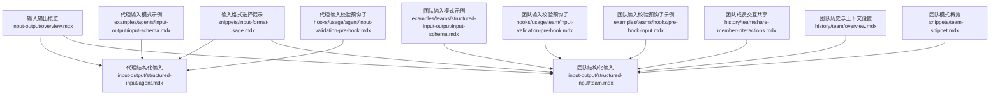
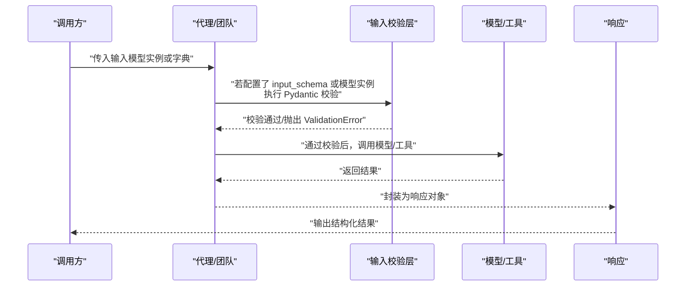
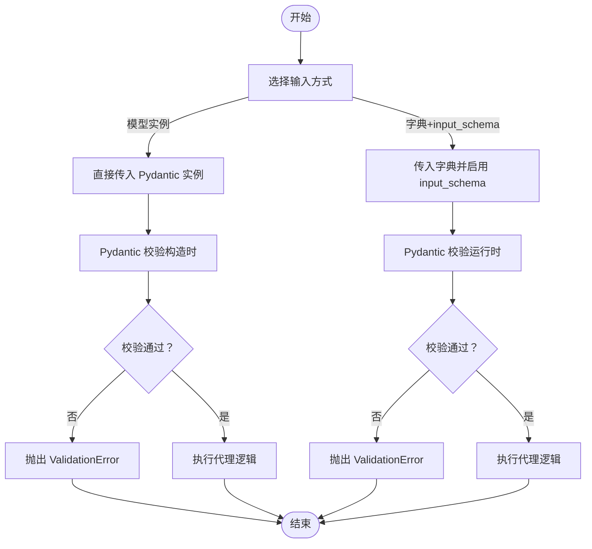
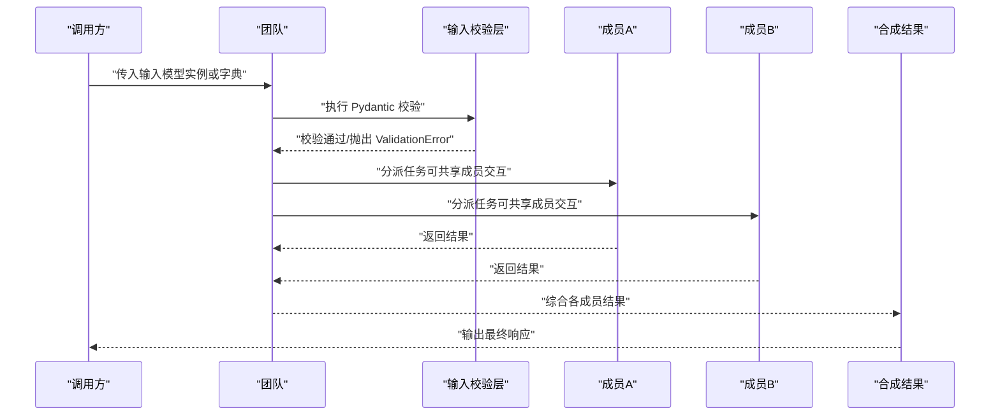
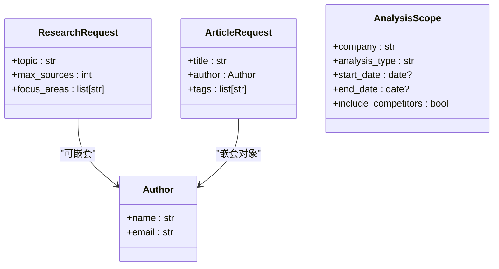
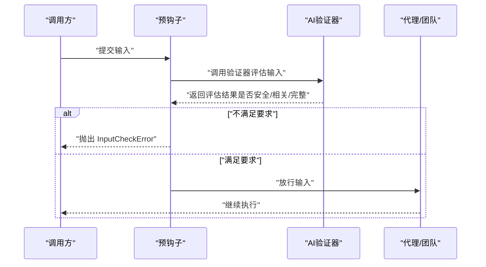
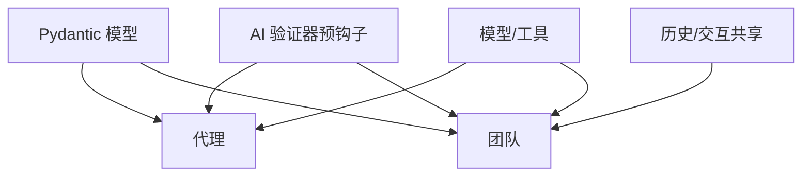

# 结构化输入

<cite>
**本文引用的文件**
- [input-output/structured-input/agent.mdx](file://input-output/structured-input/agent.mdx)
- [input-output/structured-input/team.mdx](file://input-output/structured-input/team.mdx)
- [input-output/overview.mdx](file://input-output/overview.mdx)
- [_snippets/input-format-usage.mdx](file://_snippets/input-format-usage.mdx)
- [examples/agents/input-output/input-schema.mdx](file://examples/agents/input-output/input-schema.mdx)
- [examples/teams/structured-input-output/input-schema.mdx](file://examples/teams/structured-input-output/input-schema.mdx)
- [hooks/usage/agent/input-validation-pre-hook.mdx](file://hooks/usage/agent/input-validation-pre-hook.mdx)
- [hooks/usage/team/input-validation-pre-hook.mdx](file://hooks/usage/team/input-validation-pre-hook.mdx)
- [examples/teams/hooks/pre-hook-input.mdx](file://examples/teams/hooks/pre-hook-input.mdx)
- [history/team/share-member-interactions.mdx](file://history/team/share-member-interactions.mdx)
- [history/team/overview.mdx](file://history/team/overview.mdx)
- [_snippets/team-snippet.mdx](file://_snippets/team-snippet.mdx)
</cite>

## 目录
1. [简介](#简介)
2. [项目结构](#项目结构)
3. [核心组件](#核心组件)
4. [架构总览](#架构总览)
5. [详细组件分析](#详细组件分析)
6. [依赖分析](#依赖分析)
7. [性能考虑](#性能考虑)
8. [故障排查指南](#故障排查指南)
9. [结论](#结论)
10. [附录](#附录)

## 简介
本文件面向需要在代理与团队中实现“结构化输入”的开发者，系统性说明如何使用 Pydantic 模型对输入数据进行验证与格式化，并覆盖以下主题：
- 输入模式的定义：字段类型、约束条件与描述信息
- 代理级输入验证：单个代理的输入模式配置与验证流程
- 团队级输入处理：团队成员间的输入共享与协调机制
- 复杂输入模型示例：嵌套对象、列表与可选字段
- 最佳实践：如何设计健壮的输入验证体系

## 项目结构
围绕“结构化输入”，相关文档与示例主要分布在如下位置：
- 输入输出概览与基础用法
- 代理与团队的结构化输入文档
- 输入格式选择提示
- 示例：代理与团队的输入模式使用
- 钩子与前置校验（预钩子）示例
- 团队协作与历史共享机制

**图表来源**
- [input-output/overview.mdx:1-100](file://input-output/overview.mdx#L1-L100)
- [input-output/structured-input/agent.mdx:1-187](file://input-output/structured-input/agent.mdx#L1-L187)
- [input-output/structured-input/team.mdx:1-224](file://input-output/structured-input/team.mdx#L1-L224)
- [_snippets/input-format-usage.mdx:1-4](file://_snippets/input-format-usage.mdx#L1-L4)
- [examples/agents/input-output/input-schema.mdx:1-81](file://examples/agents/input-output/input-schema.mdx#L1-L81)
- [examples/teams/structured-input-output/input-schema.mdx:1-128](file://examples/teams/structured-input-output/input-schema.mdx#L1-L128)
- [hooks/usage/agent/input-validation-pre-hook.mdx:1-177](file://hooks/usage/agent/input-validation-pre-hook.mdx#L1-L177)
- [hooks/usage/team/input-validation-pre-hook.mdx:1-177](file://hooks/usage/team/input-validation-pre-hook.mdx#L1-L177)
- [examples/teams/hooks/pre-hook-input.mdx:41-119](file://examples/teams/hooks/pre-hook-input.mdx#L41-L119)
- [history/team/share-member-interactions.mdx:1-40](file://history/team/share-member-interactions.mdx#L1-L40)
- [history/team/overview.mdx:20-54](file://history/team/overview.mdx#L20-L54)
- [_snippets/team-snippet.mdx:1-6](file://_snippets/team-snippet.mdx#L1-L6)

**章节来源**
- [input-output/overview.mdx:1-100](file://input-output/overview.mdx#L1-L100)
- [input-output/structured-input/agent.mdx:1-187](file://input-output/structured-input/agent.mdx#L1-L187)
- [input-output/structured-input/team.mdx:1-224](file://input-output/structured-input/team.mdx#L1-L224)
- [_snippets/input-format-usage.mdx:1-4](file://_snippets/input-format-usage.mdx#L1-L4)
- [examples/agents/input-output/input-schema.mdx:1-81](file://examples/agents/input-output/input-schema.mdx#L1-L81)
- [examples/teams/structured-input-output/input-schema.mdx:1-128](file://examples/teams/structured-input-output/input-schema.mdx#L1-L128)
- [hooks/usage/agent/input-validation-pre-hook.mdx:1-177](file://hooks/usage/agent/input-validation-pre-hook.mdx#L1-L177)
- [hooks/usage/team/input-validation-pre-hook.mdx:1-177](file://hooks/usage/team/input-validation-pre-hook.mdx#L1-L177)
- [examples/teams/hooks/pre-hook-input.mdx:41-119](file://examples/teams/hooks/pre-hook-input.mdx#L41-L119)
- [history/team/share-member-interactions.mdx:1-40](file://history/team/share-member-interactions.mdx#L1-L40)
- [history/team/overview.mdx:20-54](file://history/team/overview.mdx#L20-L54)
- [_snippets/team-snippet.mdx:1-6](file://_snippets/team-snippet.mdx#L1-L6)

## 核心组件
- 代理结构化输入
  - 支持直接传入 Pydantic 模型实例或通过 input_schema 对字典自动校验
  - 字段约束（如范围、长度、正则等）由 Pydantic 自动执行
- 团队结构化输入
  - 同样支持模型实例或 input_schema；团队运行前统一校验
  - 可结合成员交互共享与历史上下文提升协作效率
- 输入格式选择
  - 在代码内构建输入时优先使用 Pydantic 模型实例
  - 来自外部（API、文件、用户输入）时使用 input_schema 进行自动校验
- 预钩子与安全校验
  - 使用 AI 验证器在请求进入 LLM 前进行安全性、相关性与细节完整性检查
- 复杂输入模型
  - 嵌套对象、列表、可选字段、日期类型等常见组合

**章节来源**
- [input-output/structured-input/agent.mdx:7-71](file://input-output/structured-input/agent.mdx#L7-L71)
- [input-output/structured-input/team.mdx:7-106](file://input-output/structured-input/team.mdx#L7-L106)
- [_snippets/input-format-usage.mdx:1-4](file://_snippets/input-format-usage.mdx#L1-L4)
- [hooks/usage/agent/input-validation-pre-hook.mdx:25-78](file://hooks/usage/agent/input-validation-pre-hook.mdx#L25-L78)
- [hooks/usage/team/input-validation-pre-hook.mdx:25-78](file://hooks/usage/team/input-validation-pre-hook.mdx#L25-L78)

## 架构总览
下图展示了从“输入到执行”的整体流程，强调结构化输入在代理与团队中的作用。

**图表来源**
- [input-output/structured-input/agent.mdx:13-71](file://input-output/structured-input/agent.mdx#L13-L71)
- [input-output/structured-input/team.mdx:13-106](file://input-output/structured-input/team.mdx#L13-L106)
- [hooks/usage/agent/input-validation-pre-hook.mdx:25-78](file://hooks/usage/agent/input-validation-pre-hook.mdx#L25-L78)
- [hooks/usage/team/input-validation-pre-hook.mdx:25-78](file://hooks/usage/team/input-validation-pre-hook.mdx#L25-L78)

## 详细组件分析

### 代理级输入验证
- 直接传入模型实例
  - 在创建模型实例时即触发 Pydantic 校验，非法数据会立即抛出异常
- 使用 input_schema
  - 将 Pydantic 模型类赋给 input_schema，运行时对传入字典进行自动校验
- 错误处理
  - 通过捕获 Pydantic 的 ValidationError，定位字段与约束问题
- 常见模式
  - API 请求处理器：对外部请求进行自动校验
  - 配置驱动任务：从文件或环境加载配置并校验
  - 嵌套模型：将复杂输入拆分为多个子模型，便于维护与复用

**图表来源**
- [input-output/structured-input/agent.mdx:13-71](file://input-output/structured-input/agent.mdx#L13-L71)

**章节来源**
- [input-output/structured-input/agent.mdx:13-187](file://input-output/structured-input/agent.mdx#L13-L187)
- [examples/agents/input-output/input-schema.mdx:1-81](file://examples/agents/input-output/input-schema.mdx#L1-L81)

### 团队级输入处理
- 直接传入模型实例或使用 input_schema
- 团队成员间可通过历史与交互共享提升协作效率
- 常见模式
  - 多主题研究：对列表长度与内容进行约束
  - 限定范围分析：日期范围与可选字段
  - 嵌套配置：源优先级与深度控制

**图表来源**
- [input-output/structured-input/team.mdx:13-106](file://input-output/structured-input/team.mdx#L13-L106)
- [history/team/share-member-interactions.mdx:10-27](file://history/team/share-member-interactions.mdx#L10-L27)

**章节来源**
- [input-output/structured-input/team.mdx:13-224](file://input-output/structured-input/team.mdx#L13-L224)
- [examples/teams/structured-input-output/input-schema.mdx:1-128](file://examples/teams/structured-input-output/input-schema.mdx#L1-L128)
- [history/team/share-member-interactions.mdx:1-40](file://history/team/share-member-interactions.mdx#L1-L40)
- [history/team/overview.mdx:20-54](file://history/team/overview.mdx#L20-L54)
- [_snippets/team-snippet.mdx:1-6](file://_snippets/team-snippet.mdx#L1-L6)

### 复杂输入模型示例
- 嵌套对象
  - 将作者信息拆分为独立模型，便于复用与扩展
- 列表与可选字段
  - 对列表长度、元素类型与默认值进行约束
- 日期与可空类型
  - 使用可选日期类型，支持空值场景
- 正则与范围
  - 使用正则表达式限制枚举值，使用 ge/le 控制数值范围

**图表来源**
- [input-output/structured-input/agent.mdx:154-182](file://input-output/structured-input/agent.mdx#L154-L182)
- [input-output/structured-input/team.mdx:161-187](file://input-output/structured-input/team.mdx#L161-L187)
- [examples/teams/structured-input-output/input-schema.mdx:23-40](file://examples/teams/structured-input-output/input-schema.mdx#L23-L40)

**章节来源**
- [input-output/structured-input/agent.mdx:154-182](file://input-output/structured-input/agent.mdx#L154-L182)
- [input-output/structured-input/team.mdx:161-219](file://input-output/structured-input/team.mdx#L161-L219)
- [examples/teams/structured-input-output/input-schema.mdx:23-40](file://examples/teams/structured-input-output/input-schema.mdx#L23-L40)

### 预钩子与输入安全校验
- 代理与团队均可注册预钩子，在请求进入 LLM 前进行二次校验
- 典型校验维度：安全性、相关性、细节完整性
- 可结合 AI 验证器生成评分与建议，未达标则抛出自定义错误

**图表来源**
- [hooks/usage/agent/input-validation-pre-hook.mdx:25-78](file://hooks/usage/agent/input-validation-pre-hook.mdx#L25-L78)
- [hooks/usage/team/input-validation-pre-hook.mdx:25-78](file://hooks/usage/team/input-validation-pre-hook.mdx#L25-L78)
- [examples/teams/hooks/pre-hook-input.mdx:41-97](file://examples/teams/hooks/pre-hook-input.mdx#L41-L97)

**章节来源**
- [hooks/usage/agent/input-validation-pre-hook.mdx:1-177](file://hooks/usage/agent/input-validation-pre-hook.mdx#L1-L177)
- [hooks/usage/team/input-validation-pre-hook.mdx:1-177](file://hooks/usage/team/input-validation-pre-hook.mdx#L1-L177)
- [examples/teams/hooks/pre-hook-input.mdx:41-119](file://examples/teams/hooks/pre-hook-input.mdx#L41-L119)

## 依赖分析
- 组件耦合
  - 代理与团队均依赖 Pydantic 进行输入校验
  - 预钩子与 AI 验证器形成解耦的安全层
  - 团队协作依赖历史与交互共享机制
- 外部依赖
  - LLM 模型（如 OpenAIResponses）
  - 工具集（如 HackerNews、YFinance、WebSearch）

**图表来源**
- [input-output/structured-input/agent.mdx:13-71](file://input-output/structured-input/agent.mdx#L13-L71)
- [input-output/structured-input/team.mdx:13-106](file://input-output/structured-input/team.mdx#L13-L106)
- [hooks/usage/agent/input-validation-pre-hook.mdx:25-78](file://hooks/usage/agent/input-validation-pre-hook.mdx#L25-L78)
- [hooks/usage/team/input-validation-pre-hook.mdx:25-78](file://hooks/usage/team/input-validation-pre-hook.mdx#L25-L78)
- [history/team/share-member-interactions.mdx:10-27](file://history/team/share-member-interactions.mdx#L10-L27)

**章节来源**
- [input-output/overview.mdx:30-59](file://input-output/overview.mdx#L30-L59)
- [input-output/structured-input/agent.mdx:13-71](file://input-output/structured-input/agent.mdx#L13-L71)
- [input-output/structured-input/team.mdx:13-106](file://input-output/structured-input/team.mdx#L13-L106)
- [hooks/usage/agent/input-validation-pre-hook.mdx:25-78](file://hooks/usage/agent/input-validation-pre-hook.mdx#L25-L78)
- [hooks/usage/team/input-validation-pre-hook.mdx:25-78](file://hooks/usage/team/input-validation-pre-hook.mdx#L25-L78)
- [history/team/share-member-interactions.mdx:10-27](file://history/team/share-member-interactions.mdx#L10-L27)

## 性能考虑
- 校验时机
  - 模型实例方式在构造时校验，避免重复开销
  - input_schema 方式在运行时校验，适合外部输入
- 预钩子成本
  - AI 验证器会引入额外延迟，建议仅在必要场景启用
- 数据规模
  - 大型嵌套结构与长列表会增加校验时间，应合理拆分与限制

## 故障排查指南
- 常见错误
  - Pydantic ValidationError：检查字段类型、范围、必填与约束
  - 预钩子拒绝：查看评估结果与建议，调整输入内容
- 排查步骤
  - 确认输入格式与 input_schema 是否匹配
  - 检查嵌套模型字段是否正确
  - 对于团队，确认成员交互共享与历史上下文配置是否合理

**章节来源**
- [input-output/structured-input/agent.mdx:72-96](file://input-output/structured-input/agent.mdx#L72-L96)
- [input-output/structured-input/team.mdx:108-131](file://input-output/structured-input/team.mdx#L108-L131)
- [hooks/usage/agent/input-validation-pre-hook.mdx:60-78](file://hooks/usage/agent/input-validation-pre-hook.mdx#L60-L78)
- [hooks/usage/team/input-validation-pre-hook.mdx:60-78](file://hooks/usage/team/input-validation-pre-hook.mdx#L60-L78)

## 结论
通过 Pydantic 模型与 input_schema，代理与团队可以实现强类型的结构化输入，显著提升数据质量与系统稳定性。配合预钩子与团队协作机制，可在保证安全与相关性的前提下，实现高效、可维护的多智能体工作流。

## 附录
- 快速参考
  - 输入格式选择：内部构建用模型实例；外部输入用 input_schema
  - 常用约束：min_length/max_length、ge/le、pattern、default、可选类型
  - 团队协作：开启成员交互共享与历史上下文，减少重复工作
  - 安全校验：在预钩子中集成 AI 验证器，确保输入安全与质量

**章节来源**
- [_snippets/input-format-usage.mdx:1-4](file://_snippets/input-format-usage.mdx#L1-L4)
- [input-output/overview.mdx:17-59](file://input-output/overview.mdx#L17-L59)
- [history/team/overview.mdx:20-54](file://history/team/overview.mdx#L20-L54)
- [_snippets/team-snippet.mdx:1-6](file://_snippets/team-snippet.mdx#L1-L6)