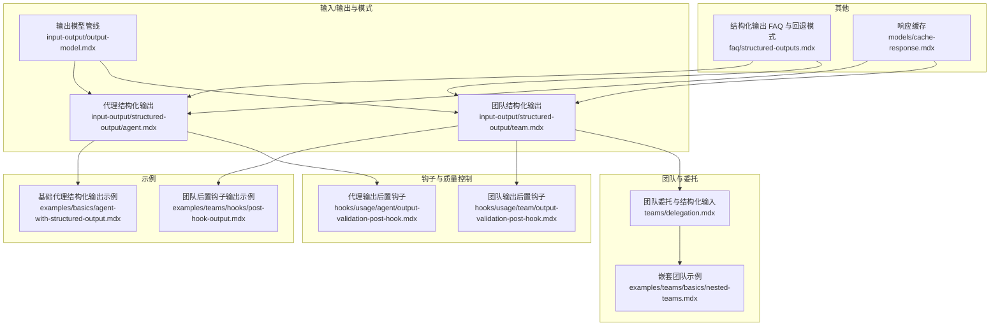
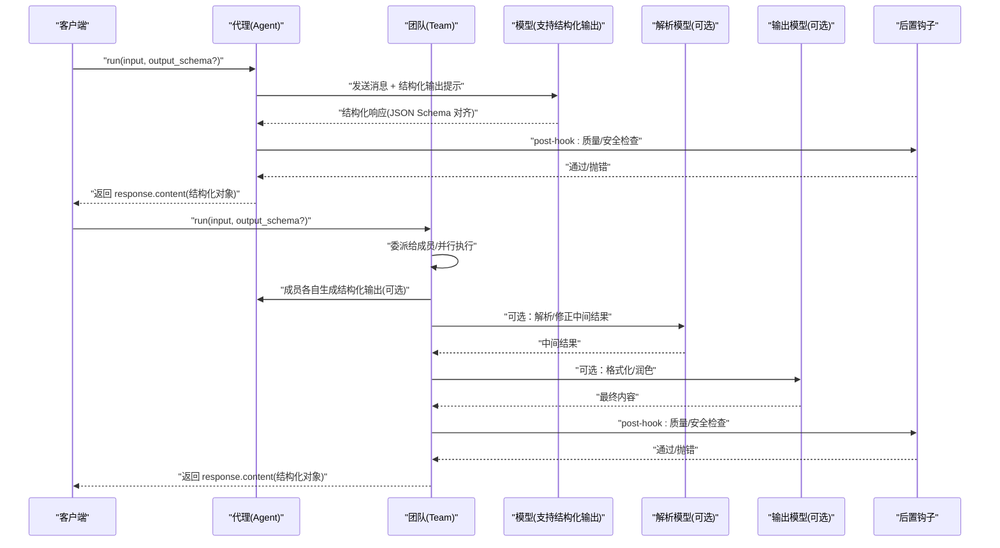
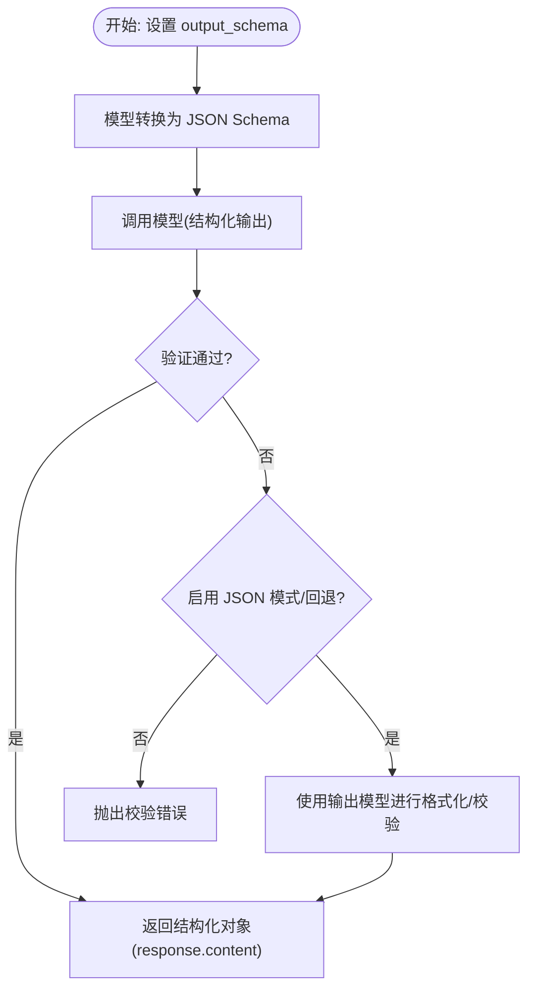
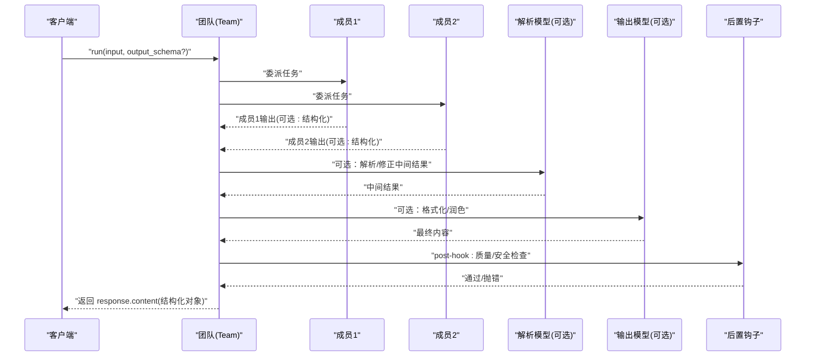
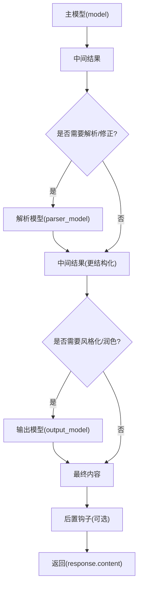
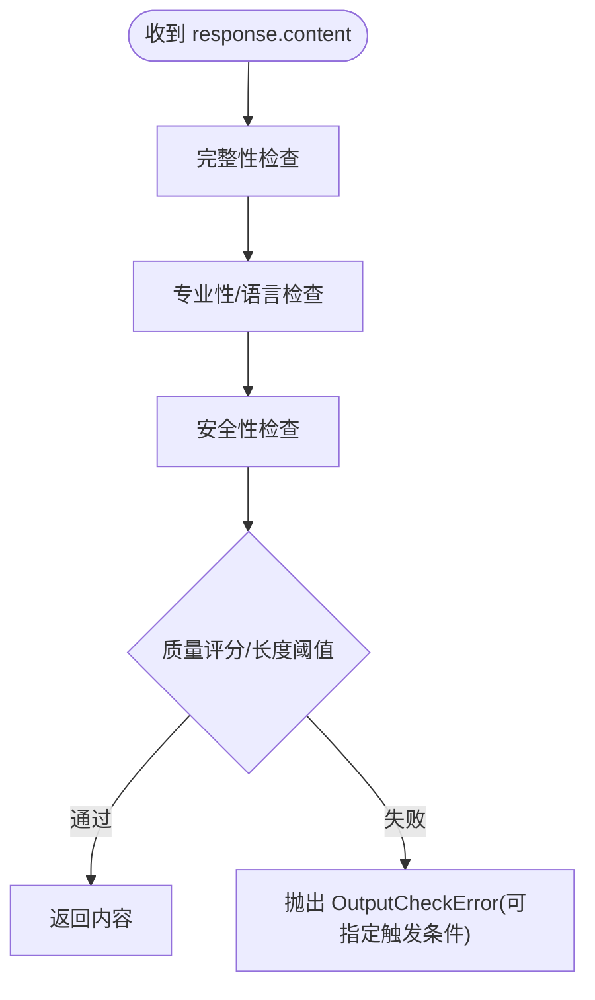
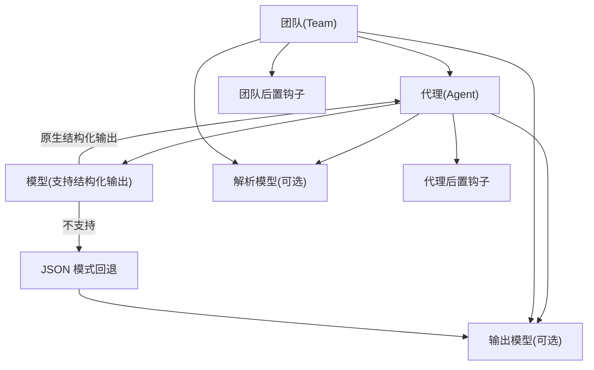

# 结构化输出

<cite>
**本文引用的文件**
- [input-output/structured-output/agent.mdx](file://input-output/structured-output/agent.mdx)
- [input-output/structured-output/team.mdx](file://input-output/structured-output/team.mdx)
- [input-output/output-model.mdx](file://input-output/output-model.mdx)
- [examples/basics/agent-with-structured-output.mdx](file://examples/basics/agent-with-structured-output.mdx)
- [examples/teams/hooks/post-hook-output.mdx](file://examples/teams/hooks/post-hook-output.mdx)
- [hooks/usage/agent/output-validation-post-hook.mdx](file://hooks/usage/agent/output-validation-post-hook.mdx)
- [hooks/usage/team/output-validation-post-hook.mdx](file://hooks/usage/team/output-validation-post-hook.mdx)
- [examples/teams/basics/nested-teams.mdx](file://examples/teams/basics/nested-teams.mdx)
- [teams/delegation.mdx](file://teams/delegation.mdx)
- [faq/structured-outputs.mdx](file://faq/structured-outputs.mdx)
- [models/cache-response.mdx](file://models/cache-response.mdx)
</cite>

## 目录
1. [简介](#简介)
2. [项目结构](#项目结构)
3. [核心组件](#核心组件)
4. [架构总览](#架构总览)
5. [详细组件分析](#详细组件分析)
6. [依赖关系分析](#依赖关系分析)
7. [性能考虑](#性能考虑)
8. [故障排查指南](#故障排查指南)
9. [结论](#结论)
10. [附录](#附录)

## 简介
本文件面向需要在代理与团队级别实现“结构化输出”的开发者，系统性说明如何使用 Pydantic 模型对输出进行验证与格式化，涵盖以下主题：
- 输出模式（Schema）的定义方式：字段约束、默认值、描述信息
- 代理级别的输出处理：单个代理的输出验证与序列化流程
- 团队级别的输出整合：多代理输出的合成与最终结构化
- 实战示例路径：复杂嵌套结构、枚举类型、自定义校验规则
- 性能优化与错误处理策略：缓存、回退模式、后置钩子与安全校验

## 项目结构
围绕结构化输出的相关内容主要分布在如下位置：
- 输入/输出与模式：input-output/structured-output/*.mdx、input-output/output-model.mdx
- 示例：examples/*/agent-with-structured-output.mdx、examples/teams/hooks/post-hook-output.mdx 等
- 钩子与质量控制：hooks/usage/*/output-validation-post-hook.mdx
- 团队协作与委托：teams/delegation.mdx、examples/teams/basics/nested-teams.mdx
- FAQ 与回退模式：faq/structured-outputs.mdx
- 性能与缓存：models/cache-response.mdx

**图表来源**
- [input-output/structured-output/agent.mdx:1-201](file://input-output/structured-output/agent.mdx#L1-L201)
- [input-output/structured-output/team.mdx:1-184](file://input-output/structured-output/team.mdx#L1-L184)
- [input-output/output-model.mdx:1-224](file://input-output/output-model.mdx#L1-L224)
- [examples/basics/agent-with-structured-output.mdx:1-177](file://examples/basics/agent-with-structured-output.mdx#L1-L177)
- [examples/teams/hooks/post-hook-output.mdx:1-515](file://examples/teams/hooks/post-hook-output.mdx#L1-L515)
- [hooks/usage/agent/output-validation-post-hook.mdx:1-125](file://hooks/usage/agent/output-validation-post-hook.mdx#L1-L125)
- [hooks/usage/team/output-validation-post-hook.mdx:1-125](file://hooks/usage/team/output-validation-post-hook.mdx#L1-L125)
- [teams/delegation.mdx:232-280](file://teams/delegation.mdx#L232-L280)
- [examples/teams/basics/nested-teams.mdx:54-100](file://examples/teams/basics/nested-teams.mdx#L54-L100)
- [faq/structured-outputs.mdx:1-78](file://faq/structured-outputs.mdx#L1-L78)
- [models/cache-response.mdx:20-53](file://models/cache-response.mdx#L20-L53)

**章节来源**
- [input-output/structured-output/agent.mdx:1-201](file://input-output/structured-output/agent.mdx#L1-L201)
- [input-output/structured-output/team.mdx:1-184](file://input-output/structured-output/team.mdx#L1-L184)
- [input-output/output-model.mdx:1-224](file://input-output/output-model.mdx#L1-L224)

## 核心组件
- 代理结构化输出
  - 使用 Pydantic 模型作为 output_schema，确保模型支持时由模型侧进行严格结构化输出；不支持时可启用 JSON 模式回退。
  - 支持在运行时覆盖 output_schema，以适配不同任务的输出格式。
  - 可与工具协同工作：先执行工具调用，再按 schema 格式化最终结果。

- 团队结构化输出
  - 在团队上设置 output_schema，由团队领导聚合成员输出并合成最终结构化对象。
  - 支持成员各自拥有 output_schema，以保证中间输出一致性，最终由团队 schema 控制合成结果。
  - 支持运行时覆盖团队 schema，或同时为成员与团队分别设置 schema。

- 输出模型管线
  - 提供多模型组合能力：主模型负责推理/工具调用，输出模型负责格式化，必要时使用解析模型（parser_model）进一步提取/修正。
  - 支持通过 output_model_prompt 与 parser_model_prompt 自定义风格与格式。

- 后置钩子与质量控制
  - 代理与团队均可配置输出后置钩子，对 content 进行二次校验与增强（如完整性、专业性、安全性、长度等）。
  - 失败时抛出 OutputCheckError，并可指定触发条件（CheckTrigger），便于上层拦截与重试/降级。

**章节来源**
- [input-output/structured-output/agent.mdx:9-201](file://input-output/structured-output/agent.mdx#L9-L201)
- [input-output/structured-output/team.mdx:9-184](file://input-output/structured-output/team.mdx#L9-L184)
- [input-output/output-model.mdx:10-224](file://input-output/output-model.mdx#L10-L224)
- [hooks/usage/agent/output-validation-post-hook.mdx:32-125](file://hooks/usage/agent/output-validation-post-hook.mdx#L32-L125)
- [hooks/usage/team/output-validation-post-hook.mdx:32-125](file://hooks/usage/team/output-validation-post-hook.mdx#L32-L125)

## 架构总览
下图展示了从“请求到结构化输出”的端到端流程，涵盖代理与团队两个层级：

**图表来源**
- [input-output/structured-output/agent.mdx:35-42](file://input-output/structured-output/agent.mdx#L35-L42)
- [input-output/structured-output/team.mdx:52-61](file://input-output/structured-output/team.mdx#L52-L61)
- [input-output/output-model.mdx:10-31](file://input-output/output-model.mdx#L10-L31)
- [hooks/usage/agent/output-validation-post-hook.mdx:32-99](file://hooks/usage/agent/output-validation-post-hook.mdx#L32-L99)
- [hooks/usage/team/output-validation-post-hook.mdx:51-99](file://hooks/usage/team/output-validation-post-hook.mdx#L51-L99)

## 详细组件分析

### 代理结构化输出（Agent）
- 定义与使用
  - 通过 Pydantic 模型定义 output_schema，代理在运行时将模型转换为 JSON Schema 并传递给模型侧，随后对响应进行验证，最终返回结构化对象。
  - 支持在运行时覆盖 output_schema，以适配不同任务。
  - 可与工具协同：工具调用完成后，代理仍会按 schema 格式化最终输出。

- 字段设计要点
  - 使用 Field 的 description 引导模型生成；结合约束（如 ge/le、min_length/max_length、Literal 枚举）提升稳定性。
  - 对不确定字段使用 Optional 类型；对列表/字典使用 default_factory 或显式默认值。

- 嵌套与复杂结构
  - 支持嵌套模型与列表元素为模型；适合生成报告、清单、对比表等结构化数据。

- 回退与兼容
  - 当模型不支持结构化输出时，可通过 use_json_mode 启用 JSON 模式回退，并在需要时配合输出模型（output_model）进行二次校验与格式化。

**图表来源**
- [input-output/structured-output/agent.mdx:35-42](file://input-output/structured-output/agent.mdx#L35-L42)
- [faq/structured-outputs.mdx:12-78](file://faq/structured-outputs.mdx#L12-L78)
- [input-output/output-model.mdx:16-31](file://input-output/output-model.mdx#L16-L31)

**章节来源**
- [input-output/structured-output/agent.mdx:9-201](file://input-output/structured-output/agent.mdx#L9-L201)
- [faq/structured-outputs.mdx:6-78](file://faq/structured-outputs.mdx#L6-L78)
- [input-output/output-model.mdx:16-31](file://input-output/output-model.mdx#L16-L31)

### 团队结构化输出（Team）
- 工作原理
  - 团队在 output_schema 设置后，会委派成员执行任务并收集结果，最后由团队领导将各成员输出合成到一个符合团队 schema 的对象中。
  - 成员可各自设置 output_schema，确保中间输出一致；团队 schema 控制最终合成结果。

- 成员与团队的 schema 组合
  - 可同时为成员与团队设置 schema，形成“中间结构化 + 最终结构化”的双层保障。
  - 支持运行时覆盖团队 schema，或在成员间差异化使用 schema。

- 嵌套与协调
  - 支持嵌套团队，父团队协调子团队的输出，最终合成统一的结构化响应。
  - 可通过 determine_input_for_members=False 将结构化输入直接传给成员，提升灵活性。

**图表来源**
- [input-output/structured-output/team.mdx:52-61](file://input-output/structured-output/team.mdx#L52-L61)
- [examples/teams/hooks/post-hook-output.mdx:218-281](file://examples/teams/hooks/post-hook-output.mdx#L218-L281)
- [examples/teams/basics/nested-teams.mdx:67-77](file://examples/teams/basics/nested-teams.mdx#L67-L77)
- [teams/delegation.mdx:232-280](file://teams/delegation.mdx#L232-L280)

**章节来源**
- [input-output/structured-output/team.mdx:9-184](file://input-output/structured-output/team.mdx#L9-L184)
- [examples/teams/hooks/post-hook-output.mdx:1-515](file://examples/teams/hooks/post-hook-output.mdx#L1-L515)
- [examples/teams/basics/nested-teams.mdx:54-100](file://examples/teams/basics/nested-teams.mdx#L54-L100)
- [teams/delegation.mdx:232-280](file://teams/delegation.mdx#L232-L280)

### 输出模型管线（多模型组合）
- 设计维度
  - 单模型：选择推理能力强的模型作为主模型，必要时用输出模型进行格式化或成本优化。
  - 多模型：主模型负责推理/工具调用，解析模型用于提取/修正，输出模型用于润色与风格化。

- 关键参数
  - model：主模型
  - output_schema：用于结构化输出的模式
  - output_model：格式化/润色模型
  - output_model_prompt：输出模型风格指令
  - parser_model：解析/修正模型
  - parser_model_prompt：解析模型指令

- 典型场景
  - 更好的写作：主模型收集事实，输出模型润色为文章
  - 成本优化：主模型复杂推理，输出模型廉价格式化
  - 弱模型强结构化：主模型弱但有工具，解析模型强结构化输出

**图表来源**
- [input-output/output-model.mdx:16-31](file://input-output/output-model.mdx#L16-L31)
- [input-output/output-model.mdx:131-224](file://input-output/output-model.mdx#L131-L224)

**章节来源**
- [input-output/output-model.mdx:10-224](file://input-output/output-model.mdx#L10-L224)

### 后置钩子与质量控制
- 代理后置钩子
  - 可对 response.content 进行完整性、专业性、安全性与长度等检查；不满足阈值时抛出 OutputCheckError，并指定触发条件。

- 团队后置钩子
  - 对团队合成后的 response.content 进行质量评估；可进一步格式化为结构化摘要、提取关键洞察、生成行动项等。

- 实践建议
  - 将“安全/合规”前置到输入阶段（Pre-Hook），将“质量/风格”后置到输出阶段（Post-Hook）。
  - 对于团队输出，可先做“综合性/一致性/专业性”评估，再进行“结构化摘要/行动项”增强。

**图表来源**
- [hooks/usage/agent/output-validation-post-hook.mdx:32-99](file://hooks/usage/agent/output-validation-post-hook.mdx#L32-L99)
- [hooks/usage/team/output-validation-post-hook.mdx:51-99](file://hooks/usage/team/output-validation-post-hook.mdx#L51-L99)
- [examples/teams/hooks/post-hook-output.mdx:46-120](file://examples/teams/hooks/post-hook-output.mdx#L46-L120)

**章节来源**
- [hooks/usage/agent/output-validation-post-hook.mdx:32-125](file://hooks/usage/agent/output-validation-post-hook.mdx#L32-L125)
- [hooks/usage/team/output-validation-post-hook.mdx:51-125](file://hooks/usage/team/output-validation-post-hook.mdx#L51-L125)
- [examples/teams/hooks/post-hook-output.mdx:46-281](file://examples/teams/hooks/post-hook-output.mdx#L46-L281)

### 实际示例路径（不含代码片段）
- 代理结构化输出
  - [示例：基础代理结构化输出:1-177](file://examples/basics/agent-with-structured-output.mdx#L1-L177)
  - [示例：A2A 接口结构化输出:1-89](file://examples/agent-os/interfaces/a2a/structured-output.mdx#L1-L89)

- 团队结构化输出
  - [示例：团队后置钩子输出:1-515](file://examples/teams/hooks/post-hook-output.mdx#L1-L515)
  - [示例：嵌套团队:54-100](file://examples/teams/basics/nested-teams.mdx#L54-L100)

- 输出模型管线
  - [示例：更好的写作/成本优化/结构化输出:131-224](file://input-output/output-model.mdx#L131-L224)

- 回退与兼容
  - [FAQ：结构化输出 vs JSON 模式:6-78](file://faq/structured-outputs.mdx#L6-L78)

**章节来源**
- [examples/basics/agent-with-structured-output.mdx:1-177](file://examples/basics/agent-with-structured-output.mdx#L1-L177)
- [examples/agent-os/interfaces/a2a/structured-output.mdx:1-89](file://examples/agent-os/interfaces/a2a/structured-output.mdx#L1-L89)
- [examples/teams/hooks/post-hook-output.mdx:1-515](file://examples/teams/hooks/post-hook-output.mdx#L1-L515)
- [examples/teams/basics/nested-teams.mdx:54-100](file://examples/teams/basics/nested-teams.mdx#L54-L100)
- [input-output/output-model.mdx:131-224](file://input-output/output-model.mdx#L131-L224)
- [faq/structured-outputs.mdx:6-78](file://faq/structured-outputs.mdx#L6-L78)

## 依赖关系分析
- 组件耦合
  - 代理与团队均依赖模型能力（原生结构化输出或 JSON 模式回退）
  - 输出模型管线与钩子为可插拔扩展点，降低与主流程耦合度
  - 团队模式与委托策略影响中间输出形态与最终合成逻辑

- 外部依赖
  - 主流大模型提供商普遍支持结构化输出（OpenAI、Anthropic、Google 等）
  - 对于不支持的模型，可通过 JSON 模式与输出模型/解析模型组合实现

**图表来源**
- [input-output/structured-output/agent.mdx:35-42](file://input-output/structured-output/agent.mdx#L35-L42)
- [input-output/structured-output/team.mdx:52-61](file://input-output/structured-output/team.mdx#L52-L61)
- [faq/structured-outputs.mdx:12-78](file://faq/structured-outputs.mdx#L12-L78)
- [input-output/output-model.mdx:16-31](file://input-output/output-model.mdx#L16-L31)

**章节来源**
- [input-output/structured-output/agent.mdx:35-42](file://input-output/structured-output/agent.mdx#L35-L42)
- [input-output/structured-output/team.mdx:52-61](file://input-output/structured-output/team.mdx#L52-L61)
- [faq/structured-outputs.mdx:12-78](file://faq/structured-outputs.mdx#L12-L78)
- [input-output/output-model.mdx:16-31](file://input-output/output-model.mdx#L16-L31)

## 性能考虑
- 响应缓存
  - 在开发与测试阶段启用缓存可显著降低等待时间、减少重复调用、稳定测试结果。
  - 注意：不要在生产中对动态内容使用缓存，避免过期数据影响业务。

- 模型选择与成本
  - 推理与格式化分离：昂贵模型负责复杂推理，便宜模型负责格式化，平衡成本与质量。
  - 多模型管线：弱模型 + 解析模型 + 输出模型，兼顾结构化与风格化需求。

- 委托与并行
  - 团队可并行委派任务，缩短整体延迟；但需权衡合成成本与令牌开销。

**章节来源**
- [models/cache-response.mdx:20-53](file://models/cache-response.mdx#L20-L53)
- [input-output/output-model.mdx:160-192](file://input-output/output-model.mdx#L160-L192)
- [teams/delegation.mdx:267-280](file://teams/delegation.mdx#L267-L280)

## 故障排查指南
- 结构化输出失败
  - 若模型不支持结构化输出，启用 use_json_mode 并配合输出模型进行二次校验。
  - 检查 output_schema 是否过于严格，适当放宽约束或拆分 schema。

- 输出质量不佳
  - 使用后置钩子对完整性、专业性、安全性与长度进行检查；根据阈值调整提示词与规则。
  - 对团队输出，先做“综合性/一致性/专业性”评估，再进行“结构化摘要/行动项”增强。

- 团队合成异常
  - 确认成员是否各自设置了合适的中间 schema，避免合成阶段出现字段缺失或冲突。
  - 对于嵌套团队，明确父团队的协调职责与输入/输出边界。

- 缓存相关问题
  - 开发阶段可开启缓存加速迭代；生产环境避免缓存动态内容。

**章节来源**
- [faq/structured-outputs.mdx:12-78](file://faq/structured-outputs.mdx#L12-L78)
- [hooks/usage/agent/output-validation-post-hook.mdx:32-99](file://hooks/usage/agent/output-validation-post-hook.mdx#L32-L99)
- [hooks/usage/team/output-validation-post-hook.mdx:51-99](file://hooks/usage/team/output-validation-post-hook.mdx#L51-L99)
- [examples/teams/hooks/post-hook-output.mdx:218-281](file://examples/teams/hooks/post-hook-output.mdx#L218-L281)
- [models/cache-response.mdx:20-53](file://models/cache-response.mdx#L20-L53)

## 结论
通过 Pydantic 模型驱动的结构化输出体系，可以在代理与团队两个层级实现“可信、可预测、可扩展”的输出格式。结合输出模型管线、后置钩子与缓存策略，可以兼顾质量、成本与性能，构建稳健的结构化输出系统。建议优先采用原生结构化输出，不支持时使用 JSON 模式回退并配合输出模型/解析模型，同时以钩子保障质量与安全。

## 附录
- 相关文档与示例
  - [代理结构化输出:1-201](file://input-output/structured-output/agent.mdx#L1-L201)
  - [团队结构化输出:1-184](file://input-output/structured-output/team.mdx#L1-L184)
  - [输出模型管线:1-224](file://input-output/output-model.mdx#L1-L224)
  - [代理后置钩子示例:1-125](file://hooks/usage/agent/output-validation-post-hook.mdx#L1-L125)
  - [团队后置钩子示例:1-125](file://hooks/usage/team/output-validation-post-hook.mdx#L1-L125)
  - [团队嵌套示例:54-100](file://examples/teams/basics/nested-teams.mdx#L54-L100)
  - [团队委托与结构化输入:232-280](file://teams/delegation.mdx#L232-L280)
  - [结构化输出 FAQ 与回退模式:1-78](file://faq/structured-outputs.mdx#L1-L78)
  - [响应缓存:20-53](file://models/cache-response.mdx#L20-L53)