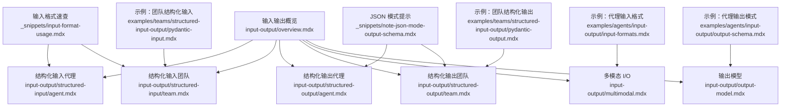
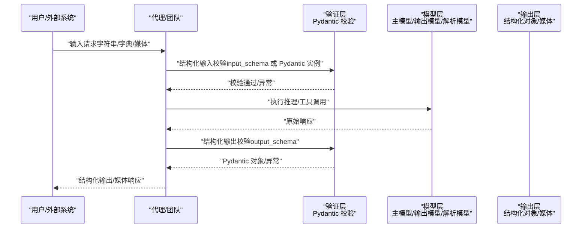
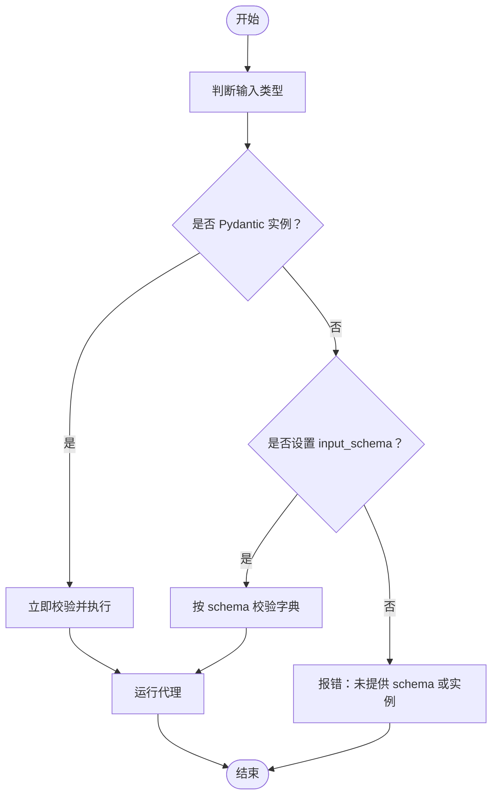
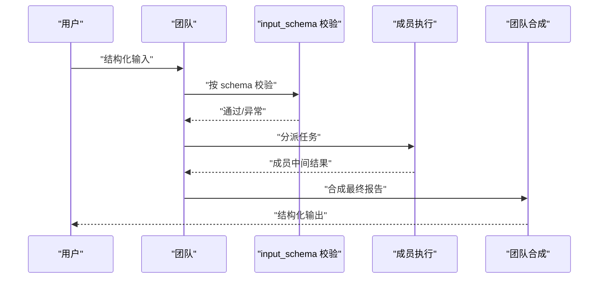
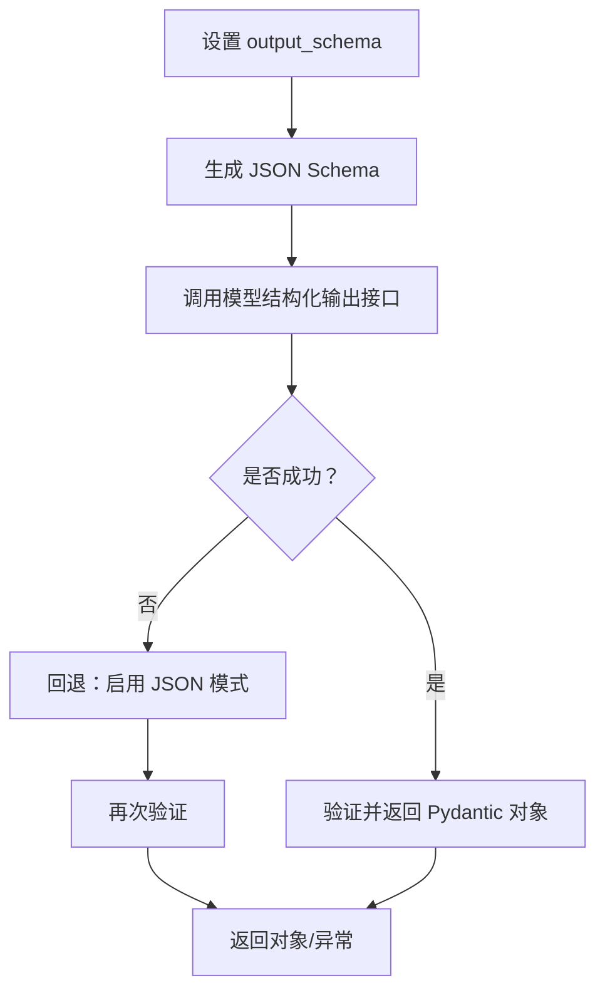
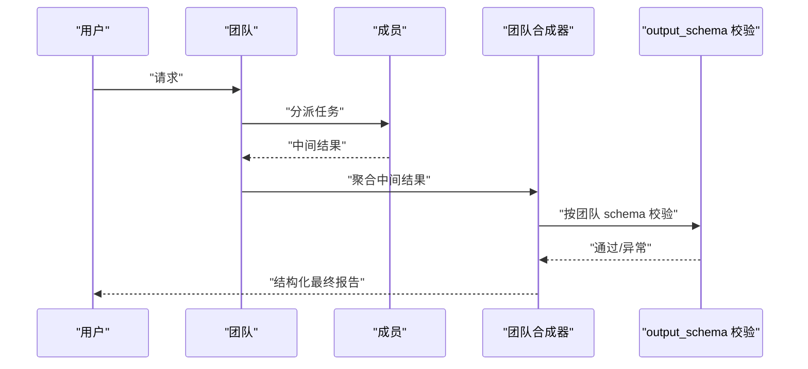
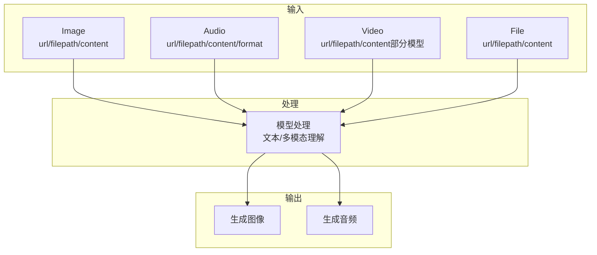
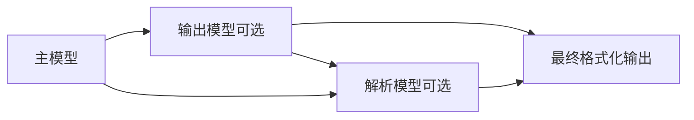
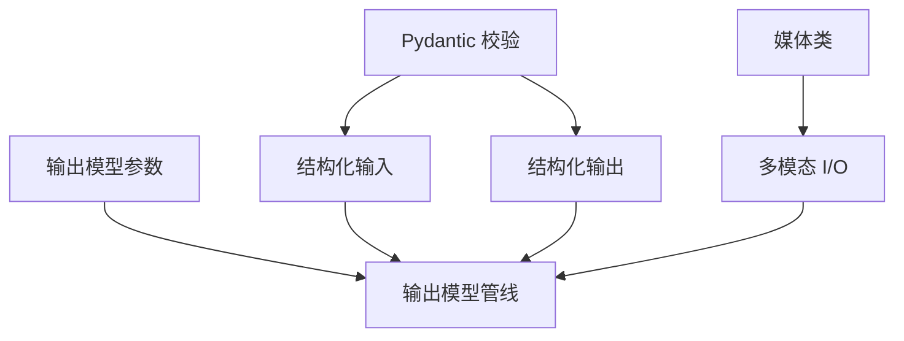

# 输入输出系统

<cite>
**本文引用的文件**
- [input-output/overview.mdx](file://input-output/overview.mdx)
- [input-output/structured-input/agent.mdx](file://input-output/structured-input/agent.mdx)
- [input-output/structured-input/team.mdx](file://input-output/structured-input/team.mdx)
- [input-output/structured-output/agent.mdx](file://input-output/structured-output/agent.mdx)
- [input-output/structured-output/team.mdx](file://input-output/structured-output/team.mdx)
- [input-output/multimodal.mdx](file://input-output/multimodal.mdx)
- [input-output/output-model.mdx](file://input-output/output-model.mdx)
- [_snippets/input-format-usage.mdx](file://_snippets/input-format-usage.mdx)
- [_snippets/note-json-mode-output-schema.mdx](file://_snippets/note-json-mode-output-schema.mdx)
- [examples/agents/input-output/input-formats.mdx](file://examples/agents/input-output/input-formats.mdx)
- [examples/agents/input-output/output-schema.mdx](file://examples/agents/input-output/output-schema.mdx)
- [examples/teams/structured-input-output/pydantic-input.mdx](file://examples/teams/structured-input-output/pydantic-input.mdx)
- [examples/teams/structured-input-output/pydantic-output.mdx](file://examples/teams/structured-input-output/pydantic-output.mdx)
</cite>

## 目录
1. [简介](#简介)
2. [项目结构](#项目结构)
3. [核心组件](#核心组件)
4. [架构总览](#架构总览)
5. [详细组件分析](#详细组件分析)
6. [依赖关系分析](#依赖关系分析)
7. [性能考量](#性能考量)
8. [故障排查指南](#故障排查指南)
9. [结论](#结论)
10. [附录](#附录)

## 简介
本技术文档围绕输入输出系统展开，系统性阐述以下主题：
- 数据格式标准化：以字符串为基础，逐步引入结构化输入与输出，确保数据在进入与离开智能体时具备可验证、可解析的一致形态。
- 结构化处理：通过 Pydantic 模型对输入进行“入站校验”，对输出进行“出站校验”，保证数据质量与一致性。
- 多模态支持：覆盖文本、图像、音频、视频与文件的输入输出路径，并给出典型用法与注意事项。
- 输出模型管线：介绍主模型、输出模型与解析模型的组合策略，满足不同场景下的“推理能力、呈现风格、结构约束”的差异化需求。
- 实践指南：提供代理输入/团队输入的配置与验证、代理输出/团队输出的格式化与序列化、多模态数据处理流程，以及 Pydantic 模型、JSON Schema 与自定义输出格式的最佳实践。

## 项目结构
输入输出系统主要由以下文档构成：
- 概览：介绍输入输出的使用场景与高级特性（多模态、输出模型）。
- 结构化输入：分别面向代理与团队，说明如何使用 Pydantic 模型或 input_schema 对输入进行验证。
- 结构化输出：说明如何通过 output_schema 将模型输出约束为 Pydantic 对象；同时介绍 per-run 覆盖与 JSON 模式回退。
- 多模态 I/O：定义媒体类与快速上手示例，涵盖图片、音频、视频与文件的输入输出。
- 输出模型：讲解主模型、输出模型与解析模型的组合与提示词定制，实现“更强推理 + 更佳写作/成本优化 + 更强结构化”。

图表来源
- [input-output/overview.mdx:1-100](file://input-output/overview.mdx#L1-L100)
- [input-output/structured-input/agent.mdx:1-187](file://input-output/structured-input/agent.mdx#L1-L187)
- [input-output/structured-input/team.mdx:1-224](file://input-output/structured-input/team.mdx#L1-L224)
- [input-output/structured-output/agent.mdx:1-201](file://input-output/structured-output/agent.mdx#L1-L201)
- [input-output/structured-output/team.mdx:1-184](file://input-output/structured-output/team.mdx#L1-L184)
- [input-output/multimodal.mdx:1-219](file://input-output/multimodal.mdx#L1-L219)
- [input-output/output-model.mdx:1-224](file://input-output/output-model.mdx#L1-L224)
- [_snippets/input-format-usage.mdx:1-4](file://_snippets/input-format-usage.mdx#L1-L4)
- [_snippets/note-json-mode-output-schema.mdx:1-3](file://_snippets/note-json-mode-output-schema.mdx#L1-L3)
- [examples/agents/input-output/input-formats.mdx:1-56](file://examples/agents/input-output/input-formats.mdx#L1-L56)
- [examples/agents/input-output/output-schema.mdx:1-45](file://examples/agents/input-output/output-schema.mdx#L1-L45)
- [examples/teams/structured-input-output/pydantic-input.mdx:1-103](file://examples/teams/structured-input-output/pydantic-input.mdx#L1-L103)
- [examples/teams/structured-input-output/pydantic-output.mdx:1-90](file://examples/teams/structured-input-output/pydantic-output.mdx#L1-L90)

章节来源
- [input-output/overview.mdx:1-100](file://input-output/overview.mdx#L1-L100)
- [input-output/structured-input/agent.mdx:1-187](file://input-output/structured-input/agent.mdx#L1-L187)
- [input-output/structured-input/team.mdx:1-224](file://input-output/structured-input/team.mdx#L1-L224)
- [input-output/structured-output/agent.mdx:1-201](file://input-output/structured-output/agent.mdx#L1-L201)
- [input-output/structured-output/team.mdx:1-184](file://input-output/structured-output/team.mdx#L1-L184)
- [input-output/multimodal.mdx:1-219](file://input-output/multimodal.mdx#L1-L219)
- [input-output/output-model.mdx:1-224](file://input-output/output-model.mdx#L1-L224)
- [_snippets/input-format-usage.mdx:1-4](file://_snippets/input-format-usage.mdx#L1-L4)
- [_snippets/note-json-mode-output-schema.mdx:1-3](file://_snippets/note-json-mode-output-schema.mdx#L1-L3)
- [examples/agents/input-output/input-formats.mdx:1-56](file://examples/agents/input-output/input-formats.mdx#L1-L56)
- [examples/agents/input-output/output-schema.mdx:1-45](file://examples/agents/input-output/output-schema.mdx#L1-L45)
- [examples/teams/structured-input-output/pydantic-input.mdx:1-103](file://examples/teams/structured-input-output/pydantic-input.mdx#L1-L103)
- [examples/teams/structured-input-output/pydantic-output.mdx:1-90](file://examples/teams/structured-input-output/pydantic-output.mdx#L1-L90)

## 核心组件
- 结构化输入（代理/团队）
  - 使用 Pydantic 模型实例直接传入 input，或在初始化时设置 input_schema，自动对字典输入进行校验。
  - 典型用法：API 请求处理器、配置驱动任务、嵌套模型与列表字段。
- 结构化输出（代理/团队）
  - 通过 output_schema 将模型输出约束为 Pydantic 对象；支持 per-run 覆盖与 JSON 模式回退。
  - 团队层面仅对最终合成结果进行结构化，成员中间结果保持原样（除非成员自身也设置了 output_schema）。
- 多模态 I/O
  - 媒体类包括 Image、Audio、Video、File；支持 URL、本地路径与二进制内容。
  - 视频输入当前仅部分模型支持；音频输入需启用相应模态与语音参数。
- 输出模型
  - 主模型负责推理与工具调用；输出模型负责改写/格式化；解析模型用于从弱模型输出中抽取强结构。
  - 可通过 output_model_prompt 与 parser_model_prompt 定制风格、格式与提取规则。

章节来源
- [input-output/structured-input/agent.mdx:7-71](file://input-output/structured-input/agent.mdx#L7-L71)
- [input-output/structured-input/team.mdx:7-106](file://input-output/structured-input/team.mdx#L7-L106)
- [input-output/structured-output/agent.mdx:9-57](file://input-output/structured-output/agent.mdx#L9-L57)
- [input-output/structured-output/team.mdx:9-76](file://input-output/structured-output/team.mdx#L9-L76)
- [input-output/multimodal.mdx:11-214](file://input-output/multimodal.mdx#L11-L214)
- [input-output/output-model.mdx:10-128](file://input-output/output-model.mdx#L10-L128)

## 架构总览
下图展示了从请求到响应的关键路径，涵盖结构化输入、结构化输出与多模态媒体的处理要点：

图表来源
- [input-output/structured-input/agent.mdx:13-71](file://input-output/structured-input/agent.mdx#L13-L71)
- [input-output/structured-output/agent.mdx:35-44](file://input-output/structured-output/agent.mdx#L35-L44)
- [input-output/output-model.mdx:10-31](file://input-output/output-model.mdx#L10-L31)

## 详细组件分析

### 结构化输入（代理）
- 使用 Pydantic 模型实例作为 input，立即触发校验，失败抛出 ValidationError。
- 在 Agent 初始化时设置 input_schema，可对来自外部的字典输入进行自动校验。
- 常见模式：API 请求处理器、配置驱动任务、嵌套模型与日期类型字段。

图表来源
- [input-output/structured-input/agent.mdx:13-71](file://input-output/structured-input/agent.mdx#L13-L71)
- [_snippets/input-format-usage.mdx:1-4](file://_snippets/input-format-usage.mdx#L1-L4)

章节来源
- [input-output/structured-input/agent.mdx:13-71](file://input-output/structured-input/agent.mdx#L13-L71)
- [_snippets/input-format-usage.mdx:1-4](file://_snippets/input-format-usage.mdx#L1-L4)

### 结构化输入（团队）
- 支持对团队整体输入进行结构化校验，既可直接传入 Pydantic 实例，也可在 Team 初始化时设置 input_schema。
- 团队成员可独立拥有自己的 input_schema，便于分治与协作。

图表来源
- [input-output/structured-input/team.mdx:13-106](file://input-output/structured-input/team.mdx#L13-L106)

章节来源
- [input-output/structured-input/team.mdx:13-106](file://input-output/structured-input/team.mdx#L13-L106)

### 结构化输出（代理）
- 通过 output_schema 将模型输出转换为 Pydantic 对象，提升可解析性与类型安全。
- 工作机制：将 Pydantic 模型转为 JSON Schema → 传递给模型结构化输出接口 → 验证并返回对象。
- 支持 per-run 覆盖 schema；当模型不支持原生结构化输出时，可通过 use_json_mode 启用 JSON 模式回退。

图表来源
- [input-output/structured-output/agent.mdx:35-57](file://input-output/structured-output/agent.mdx#L35-L57)
- [_snippets/note-json-mode-output-schema.mdx:1-3](file://_snippets/note-json-mode-output-schema.mdx#L1-L3)

章节来源
- [input-output/structured-output/agent.mdx:35-57](file://input-output/structured-output/agent.mdx#L35-L57)
- [_snippets/note-json-mode-output-schema.mdx:1-3](file://_snippets/note-json-mode-output-schema.mdx#L1-L3)

### 结构化输出（团队）
- 团队层面设置 output_schema，仅对最终合成结果进行结构化；成员中间结果保持原样（除非成员自身也设置了 output_schema）。
- 支持成员级 schema 与团队级 schema 的组合，形成“多视角聚合 + 最终结构化”的输出闭环。

图表来源
- [input-output/structured-output/team.mdx:52-76](file://input-output/structured-output/team.mdx#L52-L76)

章节来源
- [input-output/structured-output/team.mdx:52-76](file://input-output/structured-output/team.mdx#L52-L76)

### 多模态 I/O
- 媒体类：Image、Audio、Video、File，均支持 url、filepath、content（字节）三种输入方式。
- 快速上手：图片（URL/文件/多图）、音频（文件/字节）、视频（Gemini 模型支持）、文件（PDF 等）。
- 输出：图像生成（如 DALL·E 工具）、音频生成（配置模态与语音参数后保存）。

图表来源
- [input-output/multimodal.mdx:11-214](file://input-output/multimodal.mdx#L11-L214)

章节来源
- [input-output/multimodal.mdx:11-214](file://input-output/multimodal.mdx#L11-L214)

### 输出模型（主模型/输出模型/解析模型）
- 三阶段流水线：主模型负责推理与工具调用；输出模型负责改写/格式化；解析模型负责从弱模型输出中抽取强结构。
- 参数与提示词：
  - output_model_prompt：定制输出模型的风格、语气与格式。
  - parser_model_prompt：定制解析模型的提取规则与格式要求。
- 典型用例：更好写作、成本优化、严格 JSON 结构化输出。

图表来源
- [input-output/output-model.mdx:10-128](file://input-output/output-model.mdx#L10-L128)

章节来源
- [input-output/output-model.mdx:10-128](file://input-output/output-model.mdx#L10-L128)

## 依赖关系分析
- 结构化输入依赖 Pydantic 进行校验；input_schema 与 Pydantic 实例互斥但均可在运行前完成校验。
- 结构化输出依赖模型对 JSON Schema 的支持；不支持原生结构化输出时，使用 JSON 模式回退。
- 多模态 I/O 依赖媒体类与模型的模态配置；视频输入存在平台/模型限制。
- 输出模型通过参数组合实现“推理 + 写作 + 结构化”的解耦与优化。

图表来源
- [input-output/structured-input/agent.mdx:13-71](file://input-output/structured-input/agent.mdx#L13-L71)
- [input-output/structured-output/agent.mdx:35-57](file://input-output/structured-output/agent.mdx#L35-L57)
- [input-output/multimodal.mdx:11-214](file://input-output/multimodal.mdx#L11-L214)
- [input-output/output-model.mdx:16-31](file://input-output/output-model.mdx#L16-L31)

章节来源
- [input-output/structured-input/agent.mdx:13-71](file://input-output/structured-input/agent.mdx#L13-L71)
- [input-output/structured-output/agent.mdx:35-57](file://input-output/structured-output/agent.mdx#L35-L57)
- [input-output/multimodal.mdx:11-214](file://input-output/multimodal.mdx#L11-L214)
- [input-output/output-model.mdx:16-31](file://input-output/output-model.mdx#L16-L31)

## 性能考量
- 结构化输出优先选择原生支持的模型，避免 JSON 模式回退带来的额外开销与不确定性。
- 多模态输入建议控制媒体尺寸与数量，减少传输与处理时间。
- 输出模型管线应权衡“推理能力、写作能力、结构化能力”与成本，合理选择模型组合与提示词长度。

## 故障排查指南
- 输入校验异常（ValidationError）
  - 现象：传入数据不符合 Pydantic 字段约束或列表为空。
  - 排查：检查字段范围、必填项、类型与描述信息；确认是否使用了 input_schema。
  - 参考示例：代理与团队的输入校验示例。
- 输出校验失败
  - 现象：模型输出无法被 schema 验证。
  - 排查：确认模型是否支持原生结构化输出；必要时启用 JSON 模式回退并调整 schema。
- 多模态问题
  - 现象：视频输入不生效或音频输出无声。
  - 排查：确认所用模型支持对应模态；检查音频语音参数与文件格式。

章节来源
- [input-output/structured-input/agent.mdx:72-95](file://input-output/structured-input/agent.mdx#L72-L95)
- [input-output/structured-input/team.mdx:108-130](file://input-output/structured-input/team.mdx#L108-L130)
- [input-output/structured-output/agent.mdx:184-195](file://input-output/structured-output/agent.mdx#L184-L195)
- [input-output/multimodal.mdx:109-111](file://input-output/multimodal.mdx#L109-L111)

## 结论
输入输出系统通过“结构化输入 + 结构化输出 + 多模态 I/O + 输出模型管线”的组合，实现了从数据采集、验证、推理到最终呈现的全链路标准化与可扩展性。开发者可根据业务需求选择合适的输入/输出策略与模型组合，在保证数据质量的同时兼顾性能与成本。

## 附录
- 示例参考
  - 代理输入格式示例：[examples/agents/input-output/input-formats.mdx:1-56](file://examples/agents/input-output/input-formats.mdx#L1-L56)
  - 代理输出模式示例：[examples/agents/input-output/output-schema.mdx:1-45](file://examples/agents/input-output/output-schema.mdx#L1-L45)
  - 团队结构化输入示例：[examples/teams/structured-input-output/pydantic-input.mdx:1-103](file://examples/teams/structured-input-output/pydantic-input.mdx#L1-L103)
  - 团队结构化输出示例：[examples/teams/structured-input-output/pydantic-output.mdx:1-90](file://examples/teams/structured-input-output/pydantic-output.mdx#L1-L90)