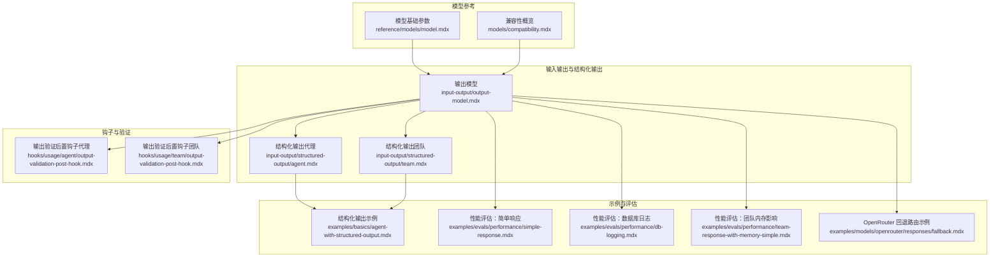
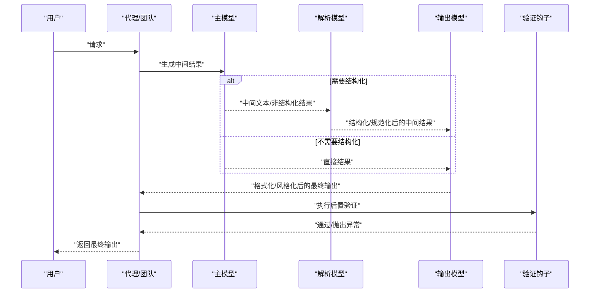
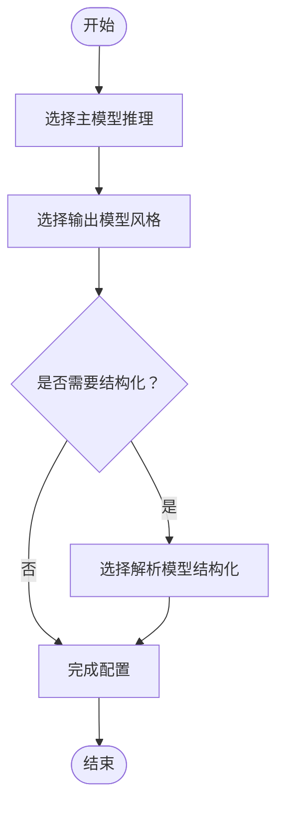
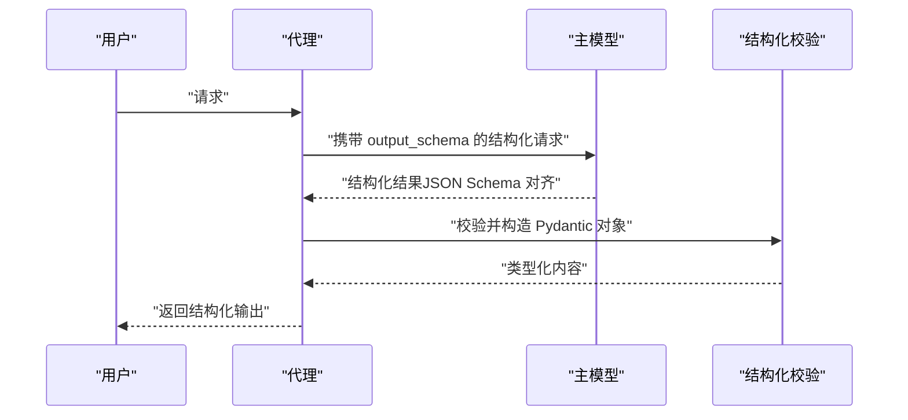
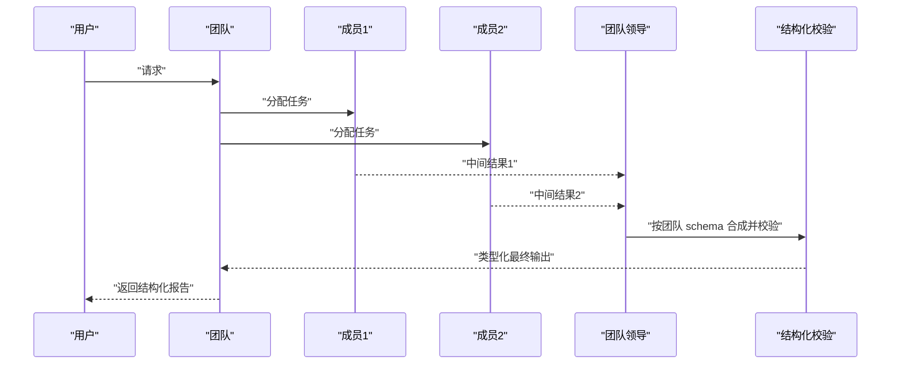
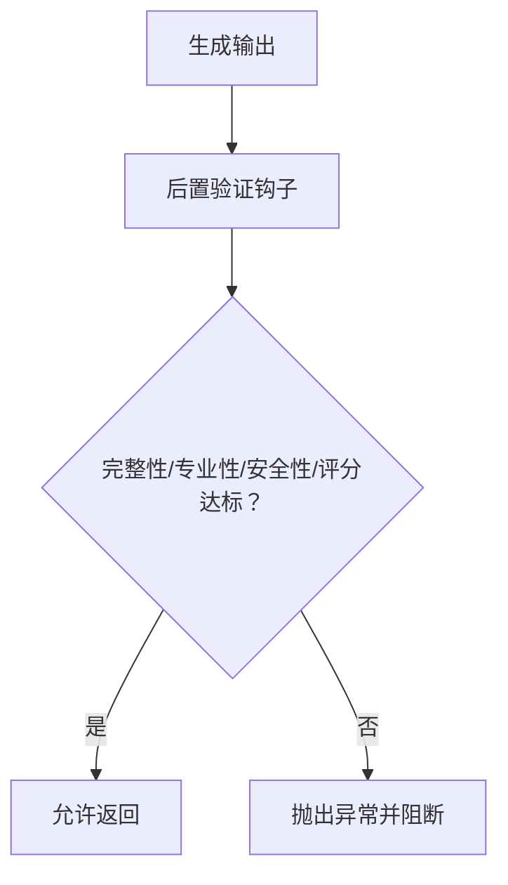
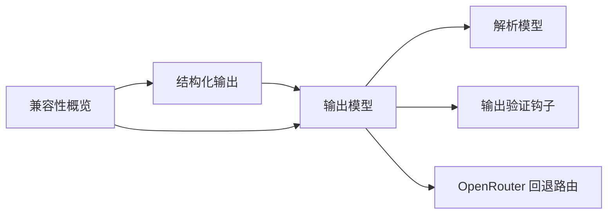

# 输出模型

<cite>
**本文引用的文件**
- [输出模型](file://input-output/output-model.mdx)
- [结构化输出（代理）](file://input-output/structured-output/agent.mdx)
- [结构化输出（团队）](file://input-output/structured-output/team.mdx)
- [模型基础参数](file://reference/models/model.mdx)
- [兼容性概览](file://models/compatibility.mdx)
- [代理结构化输出示例](file://examples/basics/agent-with-structured-output.mdx)
- [输出验证后置钩子（代理）](file://hooks/usage/agent/output-validation-post-hook.mdx)
- [输出验证后置钩子（团队）](file://hooks/usage/team/output-validation-post-hook.mdx)
- [OpenRouter 响应模型参考](file://reference/models/openrouter-responses.mdx)
- [OpenRouter 回退路由示例](file://examples/models/openrouter/responses/fallback.mdx)
- [性能评估：简单响应](file://examples/evals/performance/simple-response.mdx)
- [性能评估：数据库日志记录](file://examples/evals/performance/db-logging.mdx)
- [性能评估：团队内存影响](file://examples/evals/performance/team-response-with-memory-simple.mdx)
- [输入格式使用说明](file://_snippets/input-format-usage.mdx)
</cite>

## 目录
1. [简介](#简介)
2. [项目结构](#项目结构)
3. [核心组件](#核心组件)
4. [架构总览](#架构总览)
5. [详细组件分析](#详细组件分析)
6. [依赖关系分析](#依赖关系分析)
7. [性能考量](#性能考量)
8. [故障排除指南](#故障排除指南)
9. [结论](#结论)
10. [附录](#附录)

## 简介
本文件面向输出模型系统，系统性阐述如何通过“主模型 + 辅助模型”的组合提升输出质量并控制成本。内容覆盖：
- 输出模型选择策略：基于推理能力、呈现风格、结构化能力的三维度设计
- 成本效益与性能对比：以实例化开销、响应时延、内存增长等指标进行评估
- 场景化应用：专用模型、通用模型、混合模型的适用场景与配置要点
- 配置方法：参数调优、格式转换、回退路由与验证钩子
- 实际集成：在代理与团队中集成输出模型的步骤与示例路径
- 质量与稳定性：性能监控、质量评估、故障排除与常见问题

## 项目结构
输出模型相关内容主要分布在以下模块：
- 输入输出与结构化输出：定义结构化输出、输出模型与提示词定制
- 模型参考：统一的模型参数与行为规范
- 兼容性：各模型提供商对工具调用、结构化输出、多模态的支持差异
- 示例与评估：结构化输出示例、性能评估、回退路由与输出验证钩子
- 钩子与验证：输出质量与安全的后置验证流程

图表来源
- [输出模型](file://input-output/output-model.mdx)
- [结构化输出（代理）](file://input-output/structured-output/agent.mdx)
- [结构化输出（团队）](file://input-output/structured-output/team.mdx)
- [模型基础参数](file://reference/models/model.mdx)
- [兼容性概览](file://models/compatibility.mdx)
- [结构化输出示例](file://examples/basics/agent-with-structured-output.mdx)
- [性能评估：简单响应](file://examples/evals/performance/simple-response.mdx)
- [性能评估：数据库日志记录](file://examples/evals/performance/db-logging.mdx)
- [性能评估：团队内存影响](file://examples/evals/performance/team-response-with-memory-simple.mdx)
- [OpenRouter 回退路由示例](file://examples/models/openrouter/responses/fallback.mdx)
- [输出验证后置钩子（代理）](file://hooks/usage/agent/output-validation-post-hook.mdx)
- [输出验证后置钩子（团队）](file://hooks/usage/team/output-validation-post-hook.mdx)

章节来源
- [输出模型](file://input-output/output-model.mdx)
- [结构化输出（代理）](file://input-output/structured-output/agent.mdx)
- [结构化输出（团队）](file://input-output/structured-output/team.mdx)
- [模型基础参数](file://reference/models/model.mdx)
- [兼容性概览](file://models/compatibility.mdx)

## 核心组件
- 主模型（model）：负责推理与工具调用，强调逻辑能力
- 输出模型（output_model）：负责格式化与风格化，强调写作与呈现
- 解析模型（parser_model）：负责二次抽取与结构化，强调结构化输出与校验
- 结构化输出（output_schema）：约束最终输出的数据形态，支持原生结构化或 JSON 模式回退
- 提示词定制：output_model_prompt 与 parser_model_prompt 控制风格、语气与格式
- 验证钩子：输出质量与安全的后置检查，失败时抛出异常阻止返回

章节来源
- [输出模型](file://input-output/output-model.mdx)
- [结构化输出（代理）](file://input-output/structured-output/agent.mdx)
- [结构化输出（团队）](file://input-output/structured-output/team.mdx)
- [输出验证后置钩子（代理）](file://hooks/usage/agent/output-validation-post-hook.mdx)
- [输出验证后置钩子（团队）](file://hooks/usage/team/output-validation-post-hook.mdx)

## 架构总览
输出模型的典型流水线由“主推理 → 可选解析 → 输出格式化/验证”构成，支持单模型与多模型组合。

图表来源
- [输出模型](file://input-output/output-model.mdx)
- [结构化输出（代理）](file://input-output/structured-output/agent.mdx)
- [结构化输出（团队）](file://input-output/structured-output/team.mdx)
- [输出验证后置钩子（代理）](file://hooks/usage/agent/output-validation-post-hook.mdx)
- [输出验证后置钩子（团队）](file://hooks/usage/team/output-validation-post-hook.mdx)

## 详细组件分析

### 组件一：输出模型参数与选择策略
- 参数清单与职责
  - model：主推理模型
  - output_schema：结构化输出约束
  - output_model：输出格式化/风格化模型
  - output_model_prompt：输出模型的风格/语气/格式指令
  - parser_model：二次解析/抽取模型
  - parser_model_prompt：解析模型的抽取规则与格式要求
- 选择维度
  - 推理（Logic）：主模型需具备强推理与工具调用能力
  - 表达（Style）：输出模型需具备优秀的写作与风格化能力
  - 结构（Schema）：当主模型不支持原生结构化时，引入解析模型与结构化模式

图表来源
- [输出模型](file://input-output/output-model.mdx)

章节来源
- [输出模型](file://input-output/output-model.mdx)

### 组件二：结构化输出（代理）
- 核心机制
  - 将 Pydantic 模型转为 JSON Schema，传递给模型的结构化输出接口
  - 对响应进行校验，返回类型化的 Pydantic 对象
  - 支持在运行时覆盖 schema，便于多任务复用
- 与工具协作
  - 代理先调用工具获取数据，再按 schema 返回结构化结果
- 设计建议
  - 使用字段描述与约束，提高生成质量
  - 对不确定字段使用可空类型
  - 复用 use_json_mode 作为原生不支持结构化时的回退

图表来源
- [结构化输出（代理）](file://input-output/structured-output/agent.mdx)
- [结构化输出示例](file://examples/basics/agent-with-structured-output.mdx)

章节来源
- [结构化输出（代理）](file://input-output/structured-output/agent.mdx)
- [结构化输出示例](file://examples/basics/agent-with-structured-output.mdx)

### 组件三：结构化输出（团队）
- 核心机制
  - 团队成员各自产出中间结果，团队领导综合合成
  - 最终输出受 output_schema 约束，成员内部可独立设置 schema
- 运行时覆盖
  - 支持在每次 run 时覆盖团队级 schema，满足多任务场景
- 设计建议
  - 成员 schema 聚合多视角洞察，团队 schema 负责最终合成

图表来源
- [结构化输出（团队）](file://input-output/structured-output/team.mdx)

章节来源
- [结构化输出（团队）](file://input-output/structured-output/team.mdx)

### 组件四：格式转换与风格定制
- output_model_prompt
  - 用于指定输出模型的风格、语气与格式，替代默认系统提示
  - 适用于需要特定受众或格式（如技术文档、高管摘要）的场景
- parser_model_prompt
  - 用于解析模型的抽取规则与格式约束
  - 默认系统提示通常足够，仅在默认失败或需要严格规则时自定义

章节来源
- [输出模型](file://input-output/output-model.mdx)

### 组件五：回退与稳定性（OpenRouter）
- 动态回退路由
  - 当主模型不可用或受限时，自动尝试备用模型序列
  - 适合高可用与弹性部署场景
- 集成方式
  - 在模型初始化时配置 models 列表，实现自动回退

章节来源
- [OpenRouter 响应模型参考](file://reference/models/openrouter-responses.mdx)
- [OpenRouter 回退路由示例](file://examples/models/openrouter/responses/fallback.mdx)

### 组件六：质量与安全验证（后置钩子）
- 验证维度
  - 完整性：是否覆盖问题要点
  - 专业性：语言是否得体
  - 安全性：是否包含不当内容
  - 质量评分：阈值控制
- 触发时机
  - 输出生成后执行，失败则抛出异常阻止返回
- 适用范围
  - 代理与团队均支持

图表来源
- [输出验证后置钩子（代理）](file://hooks/usage/agent/output-validation-post-hook.mdx)
- [输出验证后置钩子（团队）](file://hooks/usage/team/output-validation-post-hook.mdx)

章节来源
- [输出验证后置钩子（代理）](file://hooks/usage/agent/output-validation-post-hook.mdx)
- [输出验证后置钩子（团队）](file://hooks/usage/team/output-validation-post-hook.mdx)

## 依赖关系分析
- 组件耦合
  - 输出模型与结构化输出存在强关联：当主模型不支持原生结构化时，必须引入解析模型与 schema
  - 输出模型与验证钩子存在弱耦合：验证钩子独立于具体模型，但依赖输出内容
- 外部依赖
  - 模型提供商能力差异显著：部分不支持原生结构化或工具调用，需借助 JSON 模式或框架特性
  - OpenRouter 提供动态回退路由，增强可用性与弹性

图表来源
- [兼容性概览](file://models/compatibility.mdx)
- [输出模型](file://input-output/output-model.mdx)
- [结构化输出（代理）](file://input-output/structured-output/agent.mdx)
- [结构化输出（团队）](file://input-output/structured-output/team.mdx)
- [OpenRouter 响应模型参考](file://reference/models/openrouter-responses.mdx)

章节来源
- [兼容性概览](file://models/compatibility.mdx)
- [输出模型](file://input-output/output-model.mdx)
- [结构化输出（代理）](file://input-output/structured-output/agent.mdx)
- [结构化输出（团队）](file://input-output/structured-output/team.mdx)
- [OpenRouter 响应模型参考](file://reference/models/openrouter-responses.mdx)

## 性能考量
- 实例化与启动开销
  - 通过性能评估工具对实例化次数进行基准测试，评估不同框架/库的初始化成本
- 响应时延
  - 单轮响应的端到端时延评估，区分冷启动与热启动
- 内存增长
  - 长时间运行或频繁调用导致的内存占用变化，关注团队运行场景下的内存影响
- 数据库日志与度量
  - 将评估结果写入数据库，便于趋势分析与回归检测

章节来源
- [性能评估：简单响应](file://examples/evals/performance/simple-response.mdx)
- [性能评估：数据库日志记录](file://examples/evals/performance/db-logging.mdx)
- [性能评估：团队内存影响](file://examples/evals/performance/team-response-with-memory-simple.mdx)

## 故障排除指南
- 结构化输出失败
  - 若主模型不支持原生结构化，启用 JSON 模式回退，并确保 schema 描述清晰
  - 使用解析模型进行二次抽取与校验，必要时提供明确的抽取规则提示
- 输出质量不达标
  - 引入输出验证钩子，设定完整性、专业性、安全性与质量评分阈值
  - 对于团队输出，可在成员层与团队层分别设置 schema，确保中间与最终输出一致
- 可用性与弹性
  - 使用 OpenRouter 的动态回退路由，避免单一模型故障导致的服务中断
- 输入格式与来源
  - 代码构建输入时使用 Pydantic 实例；外部来源使用 input_schema 进行校验与转换

章节来源
- [结构化输出（代理）](file://input-output/structured-output/agent.mdx)
- [结构化输出（团队）](file://input-output/structured-output/team.mdx)
- [输出验证后置钩子（代理）](file://hooks/usage/agent/output-validation-post-hook.mdx)
- [输出验证后置钩子（团队）](file://hooks/usage/team/output-validation-post-hook.mdx)
- [OpenRouter 回退路由示例](file://examples/models/openrouter/responses/fallback.mdx)
- [输入格式使用说明](file://_snippets/input-format-usage.mdx)

## 结论
通过“主模型 + 辅助模型”的组合，可以在保证推理能力的同时，显著提升输出质量与一致性，并在成本敏感场景下实现降本增效。结合结构化输出、格式化提示词、解析模型与验证钩子，可形成从输入到输出的全链路质量保障体系。同时，利用性能评估与回退路由，可进一步提升系统的稳定性与弹性。

## 附录
- 快速参考
  - 输出模型参数：model、output_schema、output_model、output_model_prompt、parser_model、parser_model_prompt
  - 结构化输出：原生结构化优先，不支持时启用 JSON 模式回退
  - 验证钩子：完整性、专业性、安全性与质量评分
  - 回退路由：OpenRouter 动态回退模型列表
  - 输入格式：代码构建使用 Pydantic 实例；外部来源使用 input_schema