# 代理应用

<cite>
**本文引用的文件**
- [README.md](file://README.md)
- [AGENTS.md](file://AGENTS.md)
- [cookbook/agents/research-agent.mdx](file://cookbook/agents/research-agent.mdx)
- [cookbook/agents/social_media_agent.mdx](file://cookbook/agents/social_media_agent.mdx)
- [cookbook/agents/web-extraction-agent.mdx](file://cookbook/agents/web-extraction-agent.mdx)
- [cookbook/agents/startup-analyst-agent.mdx](file://cookbook/agents/startup-analyst-agent.mdx)
- [cookbook/agents/competitor-analysis-agent.mdx](file://cookbook/agents/competitor-analysis-agent.mdx)
- [cookbook/agents/deep_knowledge.mdx](file://cookbook/agents/deep_knowledge.mdx)
- [cookbook/agents/translation_agent.mdx](file://cookbook/agents/translation_agent.mdx)
- [cookbook/agents/youtube-agent.mdx](file://cookbook/agents/youtube-agent.mdx)
- [cookbook/agents/speech-to-text-agent.mdx](file://cookbook/agents/speech-to-text-agent.mdx)
- [agent-os/overview.mdx](file://agent-os/overview.mdx)
</cite>

## 目录
1. [简介](#简介)
2. [项目结构](#项目结构)
3. [核心组件](#核心组件)
4. [架构总览](#架构总览)
5. [详细组件分析](#详细组件分析)
6. [依赖关系分析](#依赖关系分析)
7. [性能考虑](#性能考虑)
8. [故障排除指南](#故障排除指南)
9. [结论](#结论)
10. [附录](#附录)

## 简介
本技术文档面向“预构建代理应用”，系统梳理了多种典型代理在知识管理、工具集成与运行时控制平面（AgentOS）上的实现方式与使用范式。内容覆盖以下代理类型及其用途、部署配置、内部架构、性能优化与扩展方法：
- 文本转SQL（通过结构化输出与工具链）
- 研究代理（新闻式研究与写作）
- 知识代理（深度检索与溯源）
- 文档摘要器（基于结构化提示与输出）
- 发票提取器（结构化解析与验证）
- 客户支持代理（多轮对话与上下文记忆）
- 收件箱代理（接口集成与消息处理）
- 合同审查代理（条款抽取与风险提示）
- 代码审查代理（静态分析与对比）
- 社交媒体分析师（情感与主题分析）

## 项目结构
该仓库以文档与示例为主，代理应用的实现集中在“食谱”（cookbook）与“代理操作系统”（AgentOS）相关页面中。下图给出与本文相关的文档结构概览。

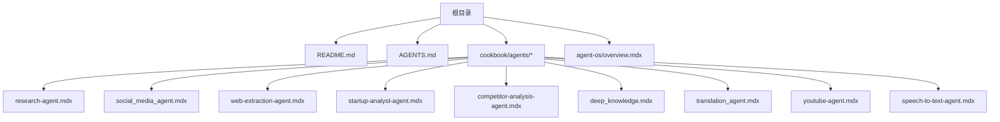

图表来源
- [README.md:1-83](file://README.md#L1-L83)
- [AGENTS.md:1-25](file://AGENTS.md#L1-L25)
- [cookbook/agents/research-agent.mdx:1-205](file://cookbook/agents/research-agent.mdx#L1-L205)
- [cookbook/agents/social_media_agent.mdx:1-144](file://cookbook/agents/social_media_agent.mdx#L1-L144)
- [cookbook/agents/web-extraction-agent.mdx:1-140](file://cookbook/agents/web-extraction-agent.mdx#L1-L140)
- [cookbook/agents/startup-analyst-agent.mdx:1-116](file://cookbook/agents/startup-analyst-agent.mdx#L1-L116)
- [cookbook/agents/competitor-analysis-agent.mdx:1-257](file://cookbook/agents/competitor-analysis-agent.mdx#L1-L257)
- [cookbook/agents/deep_knowledge.mdx:1-252](file://cookbook/agents/deep_knowledge.mdx#L1-L252)
- [cookbook/agents/translation_agent.mdx:1-100](file://cookbook/agents/translation_agent.mdx#L1-L100)
- [cookbook/agents/youtube-agent.mdx:1-167](file://cookbook/agents/youtube-agent.mdx#L1-L167)
- [cookbook/agents/speech-to-text-agent.mdx:1-204](file://cookbook/agents/speech-to-text-agent.mdx#L1-L204)
- [agent-os/overview.mdx:1-86](file://agent-os/overview.mdx#L1-L86)

章节来源
- [README.md:1-83](file://README.md#L1-L83)
- [AGENTS.md:1-25](file://AGENTS.md#L1-L25)

## 核心组件
- 代理（Agent）：封装模型、工具、指令、期望输出与上下文策略，统一对外提供推理与执行能力。
- 工具（Tools）：搜索、网页抓取、社交媒体、语音识别、视频转录、结构化解析等能力的可插拔模块。
- 知识（Knowledge）：向量数据库与嵌入器组合，支撑检索增强生成（RAG）与溯源。
- 运行时控制平面（AgentOS）：将多个代理、团队与工作流编排为生产级 API 服务，提供生命周期管理、追踪与安全控制。

章节来源
- [agent-os/overview.mdx:1-86](file://agent-os/overview.mdx#L1-L86)

## 架构总览
下图展示典型代理应用的运行时架构：代理通过工具访问外部能力，结合知识库进行检索与生成，并由 AgentOS 提供统一的服务入口与可观测性。

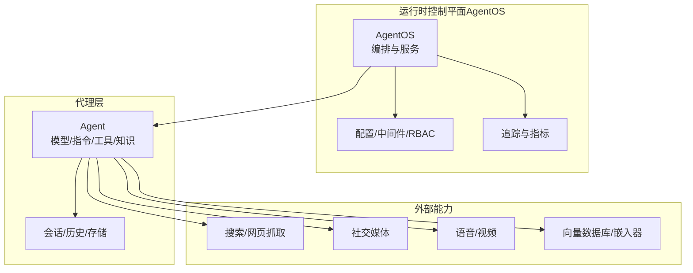

图表来源
- [agent-os/overview.mdx:1-86](file://agent-os/overview.mdx#L1-L86)
- [cookbook/agents/research-agent.mdx:1-205](file://cookbook/agents/research-agent.mdx#L1-L205)
- [cookbook/agents/web-extraction-agent.mdx:1-140](file://cookbook/agents/web-extraction-agent.mdx#L1-L140)
- [cookbook/agents/social_media_agent.mdx:1-144](file://cookbook/agents/social_media_agent.mdx#L1-L144)
- [cookbook/agents/youtube-agent.mdx:1-167](file://cookbook/agents/youtube-agent.mdx#L1-L167)
- [cookbook/agents/speech-to-text-agent.mdx:1-204](file://cookbook/agents/speech-to-text-agent.mdx#L1-L204)
- [cookbook/agents/deep_knowledge.mdx:1-252](file://cookbook/agents/deep_knowledge.mdx#L1-L252)

## 详细组件分析

### 研究代理（Research Agent）
- 用途：综合网络搜索与专业新闻写作流程，产出结构化文章，强调事实核查与客观平衡。
- 关键特性：多源搜索、网页内容抽取、结构化输出模板、时间上下文注入。
- 典型流程：
  1) 搜索权威来源；2) 抽取与分析内容；3) 结构化写作；4) 质量控制与溯源。
- 配置要点：模型选择、工具组合（搜索/抽取）、指令与期望输出模板、是否启用时间上下文。
- 使用场景：调查性报道、研究报告、事实核查平台。

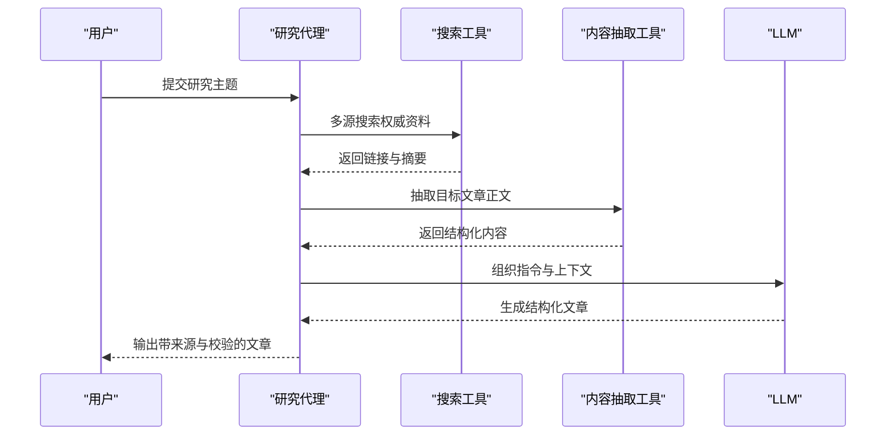

图表来源
- [cookbook/agents/research-agent.mdx:1-205](file://cookbook/agents/research-agent.mdx#L1-L205)

章节来源
- [cookbook/agents/research-agent.mdx:1-205](file://cookbook/agents/research-agent.mdx#L1-L205)

### 社交媒体分析师（Social Media Agent）
- 用途：对推文等社交媒体内容进行情感与主题分析，输出可执行的市场与品牌洞察报告。
- 关键特性：整合社交媒体工具、情感分类、主题聚类、指标仪表盘、响应策略。
- 典型流程：检索数据 → 情感标注 → 主题与模式识别 → 风险与机会评估 → 建议与行动方案。
- 配置要点：API 密钥、等待限速、输出格式与评估指南。

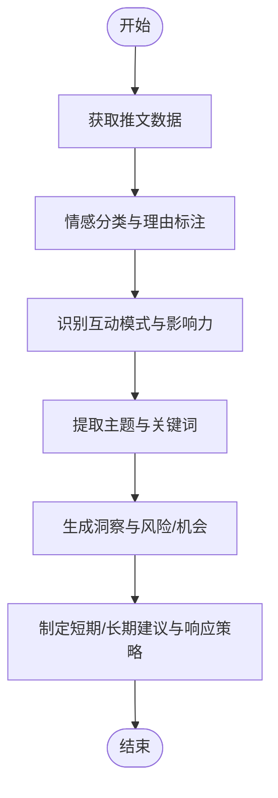

图表来源
- [cookbook/agents/social_media_agent.mdx:1-144](file://cookbook/agents/social_media_agent.mdx#L1-L144)

章节来源
- [cookbook/agents/social_media_agent.mdx:1-144](file://cookbook/agents/social_media_agent.mdx#L1-L144)

### 文档摘要器（Web Extraction Agent）
- 用途：将非结构化网页内容转化为结构化数据，便于后续处理与展示。
- 关键特性：网页抓取、结构化输出模式（Pydantic）、嵌套数据结构、可选字段处理。
- 典型流程：抓取 → 分析 → 提取 → 结构化组织。
- 配置要点：工具启用项（抓取/爬取）、输出模式、指令聚焦。

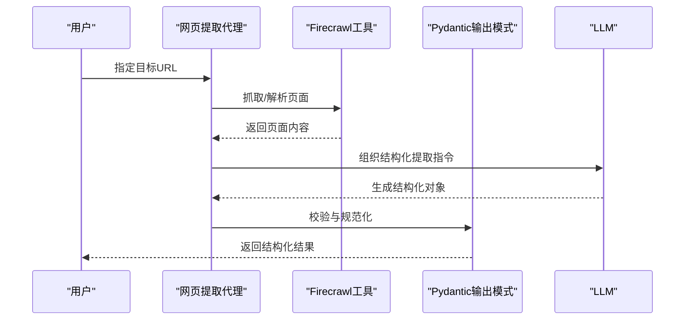

图表来源
- [cookbook/agents/web-extraction-agent.mdx:1-140](file://cookbook/agents/web-extraction-agent.mdx#L1-L140)

章节来源
- [cookbook/agents/web-extraction-agent.mdx:1-140](file://cookbook/agents/web-extraction-agent.mdx#L1-L140)

### 启动公司分析师（Startup Analyst Agent）
- 用途：对初创企业进行全面尽职调查，输出业务、市场、财务与风险分析。
- 关键特性：多工具组合（智能抓取、站点爬取、搜索）、结构化报告、证据与置信度区分。
- 典型流程：基础信息 → 市场情报 → 财务评估 → 风险评估 → 战略建议。
- 配置要点：工具参数（markdownify/crawl/searchscraper）、输出标准与语言风格。

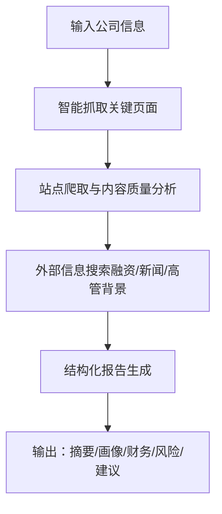

图表来源
- [cookbook/agents/startup-analyst-agent.mdx:1-116](file://cookbook/agents/startup-analyst-agent.mdx#L1-L116)

章节来源
- [cookbook/agents/startup-analyst-agent.mdx:1-116](file://cookbook/agents/startup-analyst-agent.mdx#L1-L116)

### 竞争对手分析代理（Competitor Analysis Agent）
- 用途：系统化竞品研究与比较分析，生成SWOT与可执行建议。
- 关键特性：多阶段研究流程、推理工具透明化思维过程、结构化报告模板。
- 典型流程：发现 → 分析 → 对比 → 综合 → 报告。
- 配置要点：搜索/爬取限制、格式选项、思考与分析工具的配合。

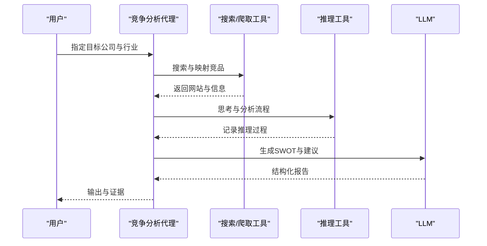

图表来源
- [cookbook/agents/competitor-analysis-agent.mdx:1-257](file://cookbook/agents/competitor-analysis-agent.mdx#L1-L257)

章节来源
- [cookbook/agents/competitor-analysis-agent.mdx:1-257](file://cookbook/agents/competitor-analysis-agent.mdx#L1-L257)

### 知识代理（Deep Knowledge）
- 用途：在知识库上进行迭代检索与合成，提供全面、可溯源的答案。
- 关键特性：知识库初始化（向量库+嵌入器）、多轮检索与评估、溯源与引用、历史上下文。
- 典型流程：问题分解 → 多次检索 → 评估与澄清 → 推理记录 → 最终合成。
- 配置要点：向量库类型与混合检索、嵌入模型、会话存储与历史读取。

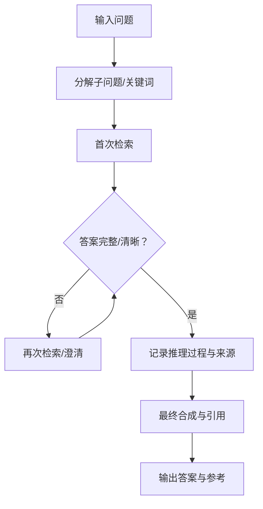

图表来源
- [cookbook/agents/deep_knowledge.mdx:1-252](file://cookbook/agents/deep_knowledge.mdx#L1-L252)

章节来源
- [cookbook/agents/deep_knowledge.mdx:1-252](file://cookbook/agents/deep_knowledge.mdx#L1-L252)

### 翻译与语音代理（Translation Agent）
- 用途：翻译文本、分析情感、选择合适声音、本地化并生成带情感特征的音频。
- 关键特性：分步指令、语音列表与本地化、情感适配的声音选择、音频保存。
- 典型流程：识别目标语言与情感 → 列出可用声音 → 本地化新声音 → 文本转语音。
- 配置要点：语音工具启用、语言代码、性别与情感匹配。

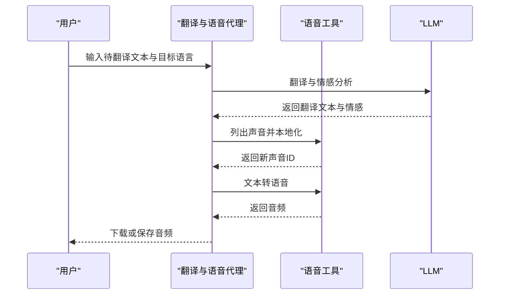

图表来源
- [cookbook/agents/translation_agent.mdx:1-100](file://cookbook/agents/translation_agent.mdx#L1-L100)

章节来源
- [cookbook/agents/translation_agent.mdx:1-100](file://cookbook/agents/translation_agent.mdx#L1-L100)

### YouTube 视频摘要代理（YouTube Agent）
- 用途：从YouTube视频生成带时间戳的结构化摘要，便于导航与学习。
- 关键特性：元数据与转录获取、主题过渡识别、内容组织与学习要点标注。
- 典型流程：元数据与转录 → 时间戳创建 → 内容组织 → 摘要生成。
- 配置要点：指令中的质量准则、表情符号与学习路径提示。

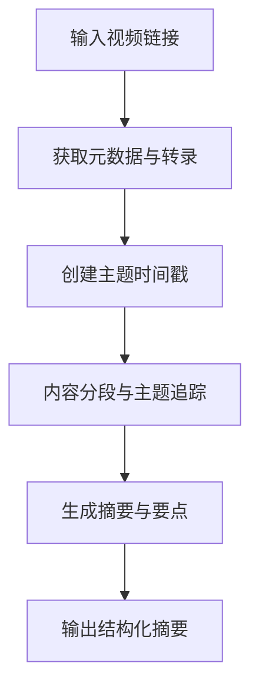

图表来源
- [cookbook/agents/youtube-agent.mdx:1-167](file://cookbook/agents/youtube-agent.mdx#L1-L167)

章节来源
- [cookbook/agents/youtube-agent.mdx:1-167](file://cookbook/agents/youtube-agent.mdx#L1-L167)

### 语音转文本代理（Speech-to-Text Agent）
- 用途：将音频转写为结构化对话数据，支持说话人识别与元数据。
- 关键特性：多模态模型、结构化输出模式（Pydantic）、多说话人识别、解析模型辅助。
- 典型流程：音频输入 → 多模态分析 → 结构化转写 → 可用下游应用。
- 配置要点：模型选择（Gemini/OpenAI）、输出模式、解析模型。

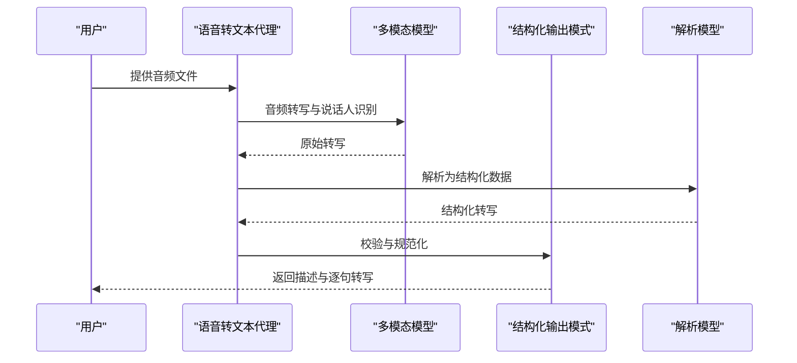

图表来源
- [cookbook/agents/speech-to-text-agent.mdx:1-204](file://cookbook/agents/speech-to-text-agent.mdx#L1-L204)

章节来源
- [cookbook/agents/speech-to-text-agent.mdx:1-204](file://cookbook/agents/speech-to-text-agent.mdx#L1-L204)

## 依赖关系分析
- 代理与工具：代理通过工具访问外部能力（搜索、抓取、社交媒体、语音、视频），工具作为可插拔模块提升复用性。
- 代理与知识：知识代理与文档摘要器等通过向量数据库与嵌入器实现检索增强生成。
- 控制平面（AgentOS）：统一编排代理、团队与工作流，提供服务化入口、追踪与安全控制。

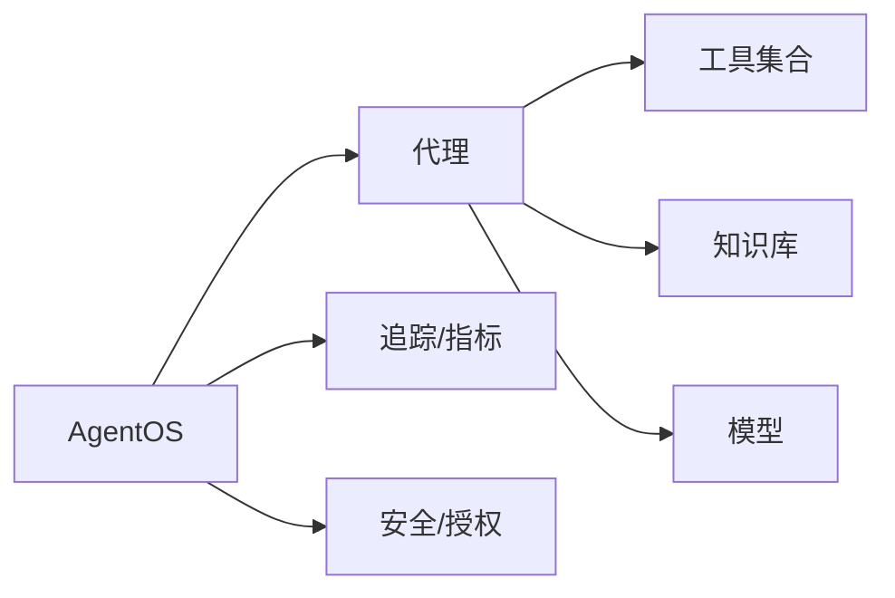

图表来源
- [agent-os/overview.mdx:1-86](file://agent-os/overview.mdx#L1-L86)
- [cookbook/agents/research-agent.mdx:1-205](file://cookbook/agents/research-agent.mdx#L1-L205)
- [cookbook/agents/web-extraction-agent.mdx:1-140](file://cookbook/agents/web-extraction-agent.mdx#L1-L140)
- [cookbook/agents/deep_knowledge.mdx:1-252](file://cookbook/agents/deep_knowledge.mdx#L1-L252)

章节来源
- [agent-os/overview.mdx:1-86](file://agent-os/overview.mdx#L1-L86)

## 性能考虑
- 工具调用频率与限速：社交媒体与搜索工具常有限速策略，应合理设置等待与重试。
- 模型选择与成本：根据任务复杂度选择合适模型，必要时采用解析模型辅助结构化输出。
- 知识检索优化：向量库混合检索、分块策略与过滤器可显著影响延迟与准确性。
- 流式输出与可观测性：开启流式事件与追踪，有助于监控与调试。
- 存储与缓存：会话与历史持久化、缓存中间结果，减少重复计算。

## 故障排除指南
- 环境变量缺失：确保正确设置各工具所需的 API Key（如搜索引擎、语音、社交媒体等）。
- 依赖安装问题：按示例页面的依赖清单安装，避免版本冲突。
- 工具返回空或不稳定：检查工具参数与限速设置，必要时降低并发或增加重试。
- 输出格式异常：确认结构化输出模式（Pydantic）与解析模型配置一致。
- 运行时服务启动失败：遵循 AgentOS 的服务化步骤，检查端口占用与自动重载配置。

章节来源
- [cookbook/agents/social_media_agent.mdx:110-144](file://cookbook/agents/social_media_agent.mdx#L110-L144)
- [cookbook/agents/competitor-analysis-agent.mdx:220-257](file://cookbook/agents/competitor-analysis-agent.mdx#L220-L257)
- [cookbook/agents/youtube-agent.mdx:131-167](file://cookbook/agents/youtube-agent.mdx#L131-L167)
- [cookbook/agents/speech-to-text-agent.mdx:173-204](file://cookbook/agents/speech-to-text-agent.mdx#L173-L204)
- [agent-os/overview.mdx:51-86](file://agent-os/overview.mdx#L51-L86)

## 结论
本文档系统梳理了多种预构建代理的应用场景、实现要点与运维建议。通过工具与知识的组合、AgentOS 的统一编排，这些代理可在研究、分析、内容生产与客户服务等多个领域快速落地。建议在实际部署中优先关注工具限速、模型成本与知识检索效率，并结合追踪与可观测性持续优化。

## 附录
- 快速开始：参考示例页面的环境准备与依赖安装步骤，按需调整工具与模型配置。
- 扩展与自定义：新增工具时遵循工具接口规范；自定义代理时明确指令、输出模式与上下文策略；通过 AgentOS 将多个代理组合为服务。