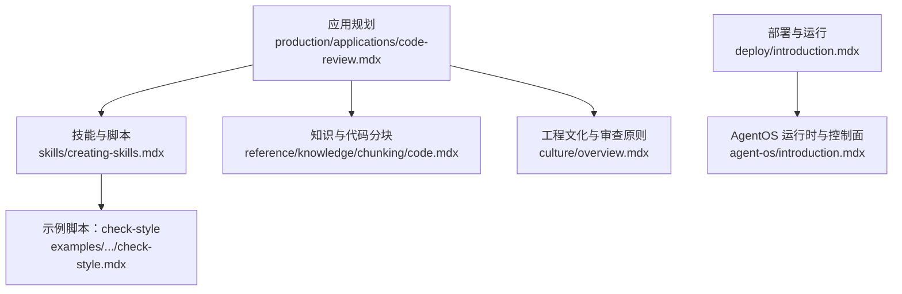
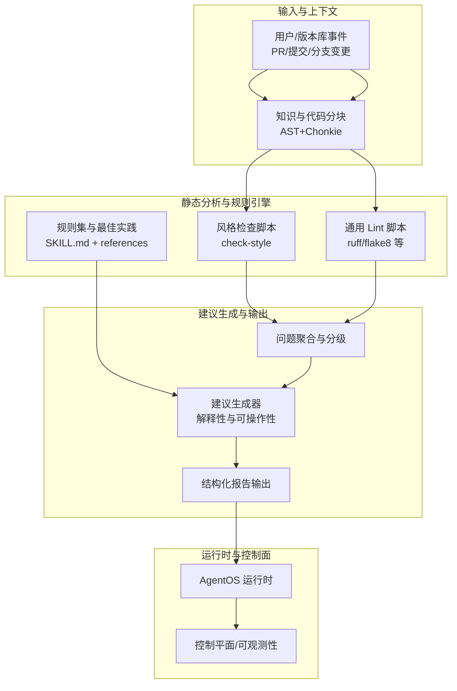
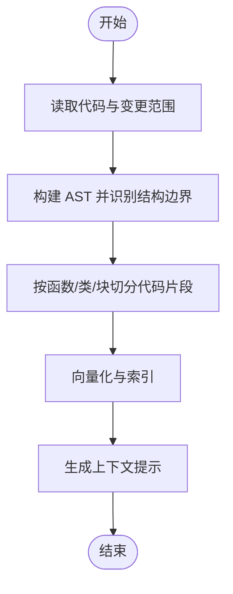
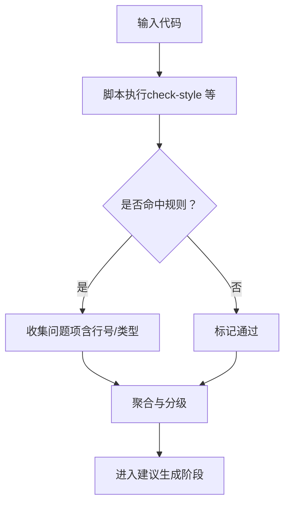
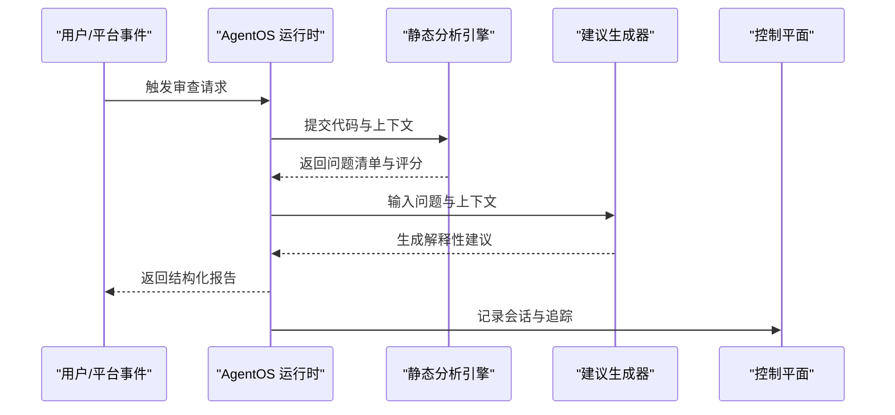
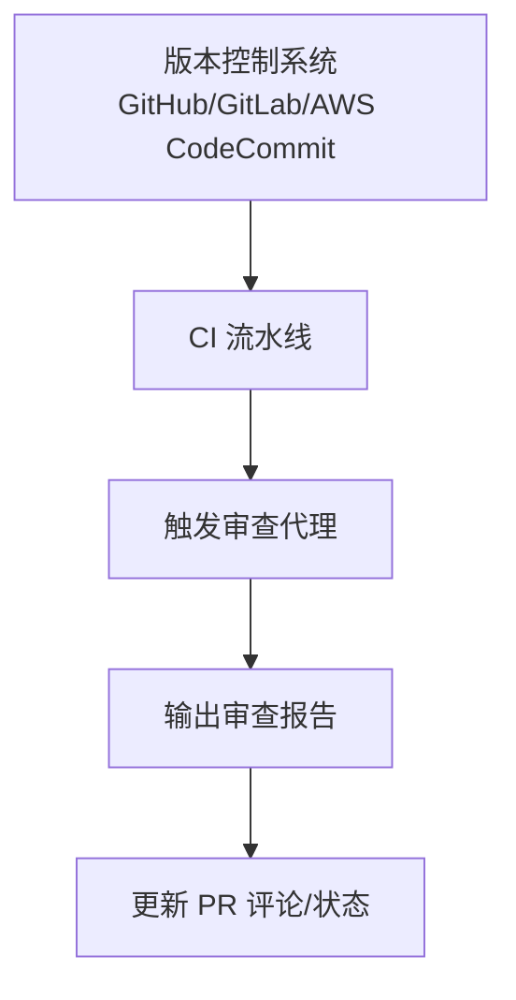
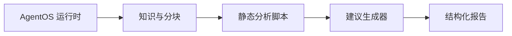

# 代码审查代理

<cite>
**本文引用的文件**
- [production/applications/code-review.mdx](file://production/applications/code-review.mdx)
- [skills/creating-skills.mdx](file://skills/creating-skills.mdx)
- [examples/agents/skills/sample-skills/code-review/scripts/check-style.mdx](file://examples/agents/skills/sample-skills/code-review/scripts/check-style.mdx)
- [reference/knowledge/chunking/code.mdx](file://reference/knowledge/chunking/code.mdx)
- [culture/overview.mdx](file://culture/overview.mdx)
- [deploy/introduction.mdx](file://deploy/introduction.mdx)
- [agent-os/introduction.mdx](file://agent-os/introduction.mdx)
</cite>

## 目录
1. [引言](#引言)
2. [项目结构](#项目结构)
3. [核心组件](#核心组件)
4. [架构总览](#架构总览)
5. [详细组件分析](#详细组件分析)
6. [依赖关系分析](#依赖关系分析)
7. [性能考虑](#性能考虑)
8. [故障排查指南](#故障排查指南)
9. [结论](#结论)
10. [附录](#附录)

## 引言
本技术文档面向“代码审查代理”应用，系统阐述其自动分析代码质量、识别潜在问题与提供改进建议的机制与实现路径。文档覆盖从代码解析、静态分析到最佳实践检查的全流程，并给出部署步骤、配置要点、版本控制集成思路、内部架构（代码理解、问题检测、建议生成）、性能优化建议、多语言支持方法以及扩展与自定义审查规则的开发指导。

## 项目结构
围绕代码审查代理的关键资料主要分布在以下模块：
- 应用规划与使用场景：production/applications/code-review.mdx
- 技能体系与脚本执行：skills/creating-skills.mdx 及示例脚本 check-style.mdx
- 知识管理与代码分块：reference/knowledge/chunking/code.mdx
- 工程文化与审查原则：culture/overview.mdx
- 部署与运行环境：deploy/introduction.mdx
- AgentOS 运行时与控制面：agent-os/introduction.mdx

**图示来源**
- [production/applications/code-review.mdx:1-35](file://production/applications/code-review.mdx#L1-L35)
- [skills/creating-skills.mdx:1-219](file://skills/creating-skills.mdx#L1-L219)
- [examples/agents/skills/sample-skills/code-review/scripts/check-style.mdx:1-98](file://examples/agents/skills/sample-skills/code-review/scripts/check-style.mdx#L1-L98)
- [reference/knowledge/chunking/code.mdx:1-12](file://reference/knowledge/chunking/code.mdx#L1-L12)
- [culture/overview.mdx:273-287](file://culture/overview.mdx#L273-L287)
- [deploy/introduction.mdx:1-102](file://deploy/introduction.mdx#L1-L102)
- [agent-os/introduction.mdx:1-113](file://agent-os/introduction.mdx#L1-L113)

**章节来源**
- [production/applications/code-review.mdx:1-35](file://production/applications/code-review.mdx#L1-L35)
- [skills/creating-skills.mdx:1-219](file://skills/creating-skills.mdx#L1-L219)
- [examples/agents/skills/sample-skills/code-review/scripts/check-style.mdx:1-98](file://examples/agents/skills/sample-skills/code-review/scripts/check-style.mdx#L1-L98)
- [reference/knowledge/chunking/code.mdx:1-12](file://reference/knowledge/chunking/code.mdx#L1-L12)
- [culture/overview.mdx:273-287](file://culture/overview.mdx#L273-L287)
- [deploy/introduction.mdx:1-102](file://deploy/introduction.mdx#L1-L102)
- [agent-os/introduction.mdx:1-113](file://agent-os/introduction.mdx#L1-L113)

## 核心组件
- 应用层（代码审查代理）
  - 职责：接收代码输入，输出结构化审查报告，包含问题定位、风险等级、改进建议与可选修复示例。
  - 规划特性：PR 分析摘要、缺陷与安全扫描、风格与规范强制、性能建议、测试覆盖率推荐、文档缺口识别。
  - 使用场景：自动化 PR 审查、新人导师式辅助、安全导向代码审计、代码一致性保障、预合并质量门禁。
- 技能与脚本（静态分析与风格检查）
  - 技能目录结构：包含 SKILL.md（元数据与流程）、scripts/（可执行脚本）、references/（参考文档）。
  - 示例脚本：check-style 负责行长度、尾随空白、命名风格（snake_case 与 camelCase 识别）、单字符变量等基础规则检查。
- 知识与分块（上下文增强）
  - 采用基于 AST 的代码分块策略，结合 Chonkie 识别函数、类、块等自然边界，提升检索与审查的语义相关性。
- 工程文化与审查原则
  - 明确审查优先级：先安全、后健壮性、再可读性与性能；强调“为什么”与“如何修复”的解释性建议。
- 部署与运行（AgentOS）
  - 提供容器化部署模板与接口暴露（Slack、Discord、MCP、AG-UI），并以 AgentOS 作为统一运行时与控制平面。

**章节来源**
- [production/applications/code-review.mdx:11-34](file://production/applications/code-review.mdx#L11-L34)
- [skills/creating-skills.mdx:9-219](file://skills/creating-skills.mdx#L9-L219)
- [examples/agents/skills/sample-skills/code-review/scripts/check-style.mdx:21-67](file://examples/agents/skills/sample-skills/code-review/scripts/check-style.mdx#L21-L67)
- [reference/knowledge/chunking/code.mdx:6-8](file://reference/knowledge/chunking/code.mdx#L6-L8)
- [culture/overview.mdx:273-287](file://culture/overview.mdx#L273-L287)
- [agent-os/introduction.mdx:40-91](file://agent-os/introduction.mdx#L40-L91)

## 架构总览
代码审查代理的总体架构由“输入与上下文”、“静态分析与规则引擎”、“建议生成与输出”三大部分组成，并通过 AgentOS 提供统一运行时与控制面能力。

**图示来源**
- [production/applications/code-review.mdx:15-22](file://production/applications/code-review.mdx#L15-L22)
- [skills/creating-skills.mdx:87-138](file://skills/creating-skills.mdx#L87-L138)
- [examples/agents/skills/sample-skills/code-review/scripts/check-style.mdx:21-67](file://examples/agents/skills/sample-skills/code-review/scripts/check-style.mdx#L21-L67)
- [reference/knowledge/chunking/code.mdx:6-8](file://reference/knowledge/chunking/code.mdx#L6-L8)
- [agent-os/introduction.mdx:40-91](file://agent-os/introduction.mdx#L40-L91)

## 详细组件分析

### 组件一：代码解析与上下文理解
- 代码分块策略
  - 基于 AST 的结构化分块，保留函数、类、块等自然边界，避免破坏语义完整性。
  - 与检索/召回结合，确保审查聚焦在相关代码段。
- 上下文增强
  - 结合 PR 描述、变更文件列表、提交历史与团队规范，形成多维上下文提示。

**图示来源**
- [reference/knowledge/chunking/code.mdx:6-8](file://reference/knowledge/chunking/code.mdx#L6-L8)

**章节来源**
- [reference/knowledge/chunking/code.mdx:6-8](file://reference/knowledge/chunking/code.mdx#L6-L8)

### 组件二：静态分析与规则引擎
- 技能与脚本
  - 技能目录包含元数据、流程说明与可执行脚本；脚本需具备可执行权限与标准输出格式。
  - 示例脚本覆盖行长度、尾随空白、命名风格、单字符变量等常见问题。
- 规则集与最佳实践
  - 通过 SKILL.md 定义“何时使用”“处理流程”“最佳实践”，并配合 references 提供风格指南与约束。

**图示来源**
- [skills/creating-skills.mdx:87-138](file://skills/creating-skills.mdx#L87-L138)
- [examples/agents/skills/sample-skills/code-review/scripts/check-style.mdx:21-67](file://examples/agents/skills/sample-skills/code-review/scripts/check-style.mdx#L21-L67)

**章节来源**
- [skills/creating-skills.mdx:87-138](file://skills/creating-skills.mdx#L87-L138)
- [examples/agents/skills/sample-skills/code-review/scripts/check-style.mdx:21-67](file://examples/agents/skills/sample-skills/code-review/scripts/check-style.mdx#L21-L67)

### 组件三：建议生成与输出
- 建议生成器
  - 在问题分级基础上，结合工程文化与审查原则，提供“为什么”“如何修复”的解释性建议。
  - 输出结构化报告，便于在控制面展示与审计追踪。
- 控制面与运行时
  - AgentOS 提供统一 API、会话与内存存储、可观测性与安全控制，支撑审查代理的生产化运行。

**图示来源**
- [agent-os/introduction.mdx:40-91](file://agent-os/introduction.mdx#L40-L91)
- [culture/overview.mdx:273-287](file://culture/overview.mdx#L273-L287)

**章节来源**
- [agent-os/introduction.mdx:40-91](file://agent-os/introduction.mdx#L40-L91)
- [culture/overview.mdx:273-287](file://culture/overview.mdx#L273-L287)

### 组件四：部署与版本控制集成
- 部署模板与接口
  - 支持 Docker、Railway、AWS 等模板；可通过 Slack、Discord、MCP、AG-UI 暴露接口。
- 版本控制集成
  - 建议在 CI 中触发审查代理：对 PR 变更文件进行分块与静态分析，输出报告并作为质量门禁的一部分。
  - 对关键分支（如 main/master）启用更强规则集与更严格建议生成策略。

**图示来源**
- [deploy/introduction.mdx:11-101](file://deploy/introduction.mdx#L11-L101)

**章节来源**
- [deploy/introduction.mdx:11-101](file://deploy/introduction.mdx#L11-L101)

## 依赖关系分析
- 组件耦合
  - 审查代理依赖 AgentOS 运行时以获得统一 API、安全与可观测性；依赖知识系统完成代码分块与检索。
  - 静态分析脚本通过技能体系加载，遵循统一的元数据与执行约定。
- 外部依赖
  - Lint 工具链（如 ruff/flake8）与向量数据库（如 PgVector/LanceDB）用于性能与检索优化。
- 循环依赖
  - 当前设计为单向依赖（运行时→分析引擎→建议生成→输出），未见循环依赖迹象。

**图示来源**
- [agent-os/introduction.mdx:40-91](file://agent-os/introduction.mdx#L40-L91)
- [reference/knowledge/chunking/code.mdx:6-8](file://reference/knowledge/chunking/code.mdx#L6-L8)
- [skills/creating-skills.mdx:87-138](file://skills/creating-skills.mdx#L87-L138)

**章节来源**
- [agent-os/introduction.mdx:40-91](file://agent-os/introduction.mdx#L40-L91)
- [reference/knowledge/chunking/code.mdx:6-8](file://reference/knowledge/chunking/code.mdx#L6-L8)
- [skills/creating-skills.mdx:87-138](file://skills/creating-skills.mdx#L87-L138)

## 性能考虑
- 代码分块与检索
  - 使用 AST 分块减少无关上下文，提高检索效率；对大文件采用分块并行处理。
- 静态分析并行化
  - 将不同语言/规则的脚本并行执行，缩短整体耗时；对重复计算结果进行缓存。
- 向量化与索引
  - 对常用规则与风格指南建立向量索引，加速检索与上下文生成。
- 运行时优化
  - 利用 AgentOS 的 SSE 流式输出与会话隔离，降低前端等待时间与资源占用。

[本节为通用性能建议，不直接分析具体文件，故无“章节来源”]

## 故障排查指南
- 脚本执行失败
  - 检查脚本 shebang 与可执行权限；确认标准输出 JSON 格式正确；捕获异常并返回错误信息。
- 规则误报/漏报
  - 调整规则阈值或增加启发式条件；结合 references 中的风格指南进行人工校验。
- 性能瓶颈
  - 评估分块粒度与检索深度；对大型仓库启用增量分析与缓存策略。
- 控制面与运行时
  - 通过 AgentOS 控制面板查看会话与追踪日志，定位异常步骤与耗时点。

**章节来源**
- [examples/agents/skills/sample-skills/code-review/scripts/check-style.mdx:73-84](file://examples/agents/skills/sample-skills/code-review/scripts/check-style.mdx#L73-L84)
- [skills/creating-skills.mdx:170-192](file://skills/creating-skills.mdx#L170-L192)
- [agent-os/introduction.mdx:76-91](file://agent-os/introduction.mdx#L76-L91)

## 结论
代码审查代理通过“结构化分块 + 静态分析 + 建议生成”的闭环，结合 AgentOS 的运行时与控制面能力，能够稳定地在 CI/PR 场景中提供高质量、可解释的代码审查服务。依托技能体系与脚本化规则，系统具备良好的扩展性与可维护性；通过工程文化与审查原则的内嵌，确保建议既专业又易落地。

[本节为总结性内容，不直接分析具体文件，故无“章节来源”]

## 附录

### A. 部署步骤（概要）
- 选择模板：Docker/Railway/AWS
- 添加应用：在模板基础上添加代码审查代理应用
- 连接接口：Slack/Discord/MCP/AG-UI
- 配置环境变量与密钥（本地 secrets、生产 Secrets Manager）

**章节来源**
- [deploy/introduction.mdx:11-101](file://deploy/introduction.mdx#L11-L101)

### B. 配置参数（示例维度）
- 模型与提示词：根据审查复杂度调整模型与上下文长度
- 规则集开关：按语言/模块启用/禁用特定规则
- 输出格式：JSON/Markdown/HTML，适配不同消费端
- 缓存与并行：分块大小、并发度、缓存策略

[本节为通用配置建议，不直接分析具体文件，故无“章节来源”]

### C. 多语言代码支持方法
- 分块策略：针对不同语言采用对应 AST 解析器与分块规则
- 规则集：为每种语言维护独立的脚本与规则集
- Lint 工具：为各语言绑定官方或社区认可的静态分析工具

**章节来源**
- [reference/knowledge/chunking/code.mdx:6-8](file://reference/knowledge/chunking/code.mdx#L6-L8)

### D. 扩展与自定义审查规则开发指导
- 新增技能
  - 创建技能目录，编写 SKILL.md（含元数据与流程）、scripts/（可执行脚本）、references/（参考文档）
  - 遵循名称与字段限制，确保可验证性
- 自定义脚本
  - 保持 shebang 与标准输出格式；对异常进行捕获与错误返回
  - 与现有规则协同，避免重复与冲突
- 最佳实践
  - 先安全、后健壮、再可读；解释“为什么”与“如何修复”
  - 与知识系统联动，持续优化规则与建议生成

**章节来源**
- [skills/creating-skills.mdx:24-61](file://skills/creating-skills.mdx#L24-L61)
- [skills/creating-skills.mdx:170-219](file://skills/creating-skills.mdx#L170-L219)
- [examples/agents/skills/sample-skills/code-review/scripts/check-style.mdx:73-84](file://examples/agents/skills/sample-skills/code-review/scripts/check-style.mdx#L73-L84)
- [culture/overview.mdx:273-287](file://culture/overview.mdx#L273-L287)