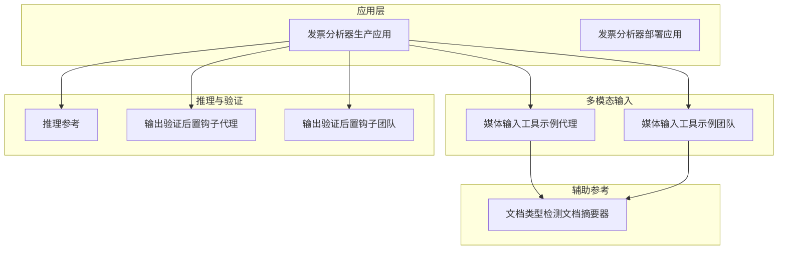
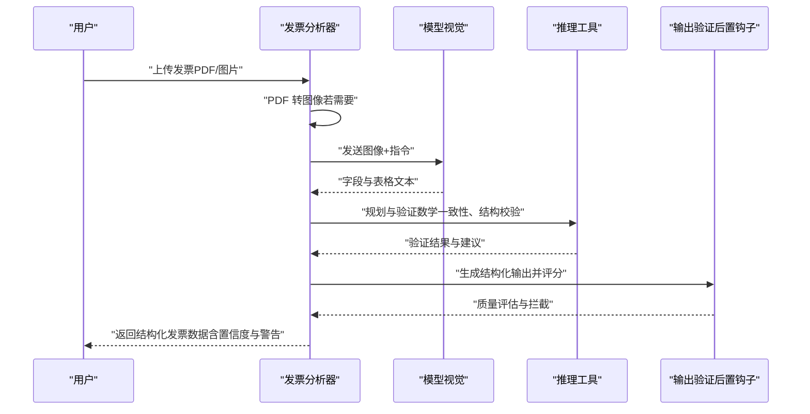
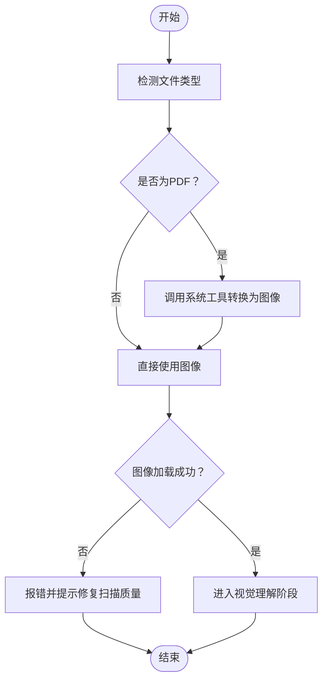
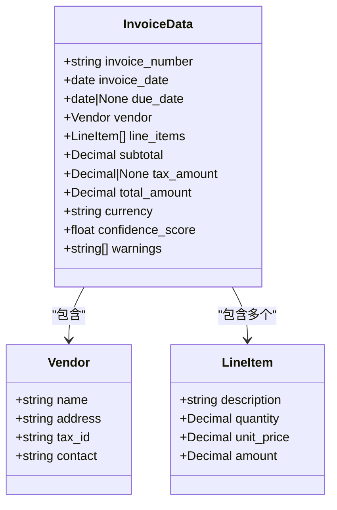
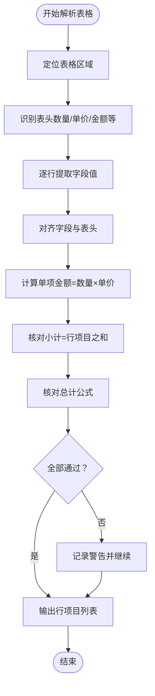
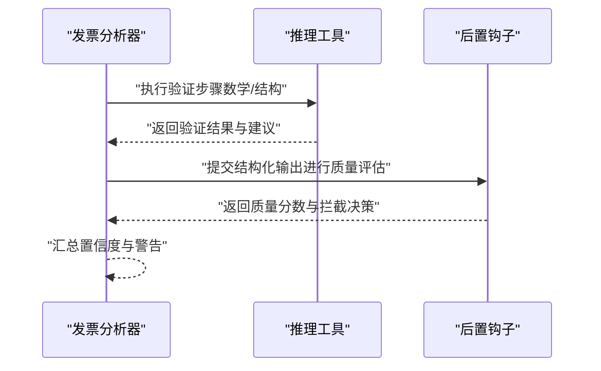
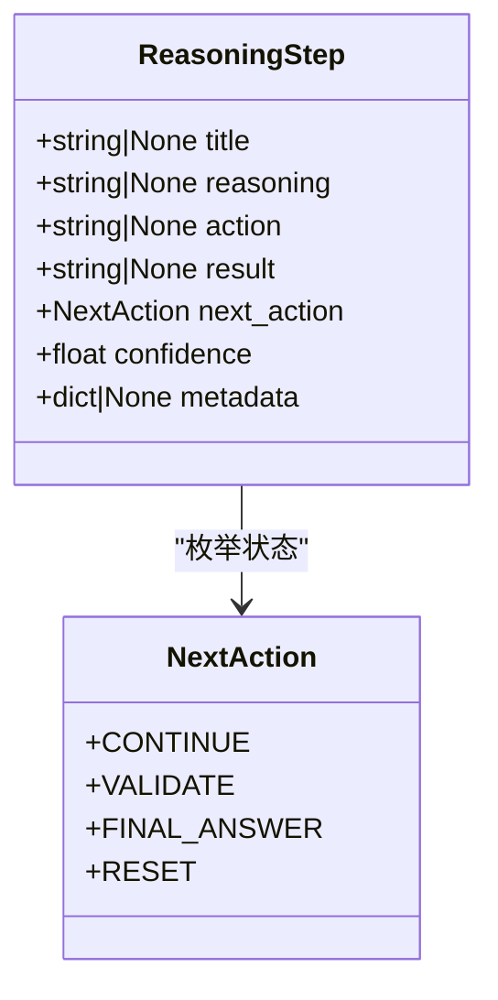
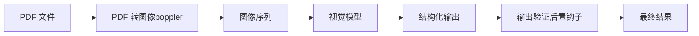

# 发票提取代理

<cite>
**本文引用的文件**
- [发票分析器（生产应用）](file://production/applications/invoice-analyst.mdx)
- [发票分析器（部署应用）](file://deploy/apps/agents/invoice-extractor.mdx)
- [媒体输入工具示例（代理）](file://examples/agents/multimodal/media-input-for-tool.mdx)
- [媒体输入工具示例（团队）](file://examples/teams/multimodal/media-input-for-tool.mdx)
- [输出验证后置钩子（代理）](file://hooks/usage/agent/output-validation-post-hook.mdx)
- [输出验证后置钩子（团队）](file://hooks/usage/team/output-validation-post-hook.mdx)
- [推理参考](file://reference/reasoning/reasoning.mdx)
- [推理步骤（示例）](file://examples/reasoning/tools/reasoning-tools.mdx)
- [推理步骤（Cerebras Llama 示例）](file://examples/reasoning/tools/cerebras-llama-reasoning-tools.mdx)
- [文档类型检测（文档摘要器）](file://production/applications/document-summarizer.mdx)
</cite>

## 目录
1. [简介](#简介)
2. [项目结构](#项目结构)
3. [核心组件](#核心组件)
4. [架构总览](#架构总览)
5. [详细组件分析](#详细组件分析)
6. [依赖关系分析](#依赖关系分析)
7. [性能考虑](#性能考虑)
8. [故障排查指南](#故障排查指南)
9. [结论](#结论)
10. [附录](#附录)

## 简介
本技术文档面向“发票提取代理”应用，系统阐述其从发票文档中提取结构化数据的完整流程：包括文档加载与预处理、视觉理解与字段抽取、表格解析与行项目提取、数据校验与置信度评分，以及最终的结构化输出生成。文档还覆盖部署步骤、配置参数、支持的文件格式、内部架构设计、性能优化策略、多格式处理方法、扩展与自定义提取规则开发等。

## 项目结构
发票提取代理的核心能力由以下部分构成：
- 应用层：生产应用页面提供端到端使用说明与运行示例。
- 多模态输入：通过工具访问上传的媒体文件（PDF/图片），并模拟 OCR 文本提取。
- 推理与验证：利用推理工具进行分步规划与验证，结合输出后置钩子保障质量。
- 配置与运行：通过环境变量与模型配置启用视觉能力，并以结构化模式输出。

**图示来源**
- [发票分析器（生产应用）:1-201](file://production/applications/invoice-analyst.mdx#L1-L201)
- [发票分析器（部署应用）:1-9](file://deploy/apps/agents/invoice-extractor.mdx#L1-L9)
- [媒体输入工具示例（代理）:1-141](file://examples/agents/multimodal/media-input-for-tool.mdx#L1-L141)
- [媒体输入工具示例（团队）:1-43](file://examples/teams/multimodal/media-input-for-tool.mdx#L1-L43)
- [输出验证后置钩子（代理）:51-125](file://hooks/usage/agent/output-validation-post-hook.mdx#L51-L125)
- [输出验证后置钩子（团队）:51-210](file://hooks/usage/team/output-validation-post-hook.mdx#L51-L210)
- [文档类型检测（文档摘要器）:155-183](file://production/applications/document-summarizer.mdx#L155-L183)

**章节来源**
- [发票分析器（生产应用）:1-201](file://production/applications/invoice-analyst.mdx#L1-L201)
- [发票分析器（部署应用）:1-9](file://deploy/apps/agents/invoice-extractor.mdx#L1-L9)

## 核心组件
- 视觉理解与结构化输出
  - 使用具备视觉能力的模型对发票图像/页面进行布局理解与字段抽取。
  - 输出采用结构化模式（如 Pydantic 模型），确保字段完整性与类型一致性。
- 表格解析与行项目提取
  - 基于视觉理解定位表格区域，解析行项目（数量、单价、金额等）。
  - 对齐字段与表头，保证数值计算的一致性。
- 数据验证与置信度评分
  - 执行数学一致性检查（单项金额=数量×单价）、小计与总计核对。
  - 生成置信度分数与警告列表，便于人工复核。
- 多模态输入与文档预处理
  - 支持 PDF 与图片格式；PDF 需要转换为图像以便视觉模型处理。
  - 提供工具访问上传文件的能力，模拟 OCR 文本提取过程。
- 推理与质量控制
  - 使用推理工具进行分步规划与交叉验证。
  - 结合输出后置钩子进行质量评估与拦截低质量响应。

**章节来源**
- [发票分析器（生产应用）:129-183](file://production/applications/invoice-analyst.mdx#L129-L183)
- [媒体输入工具示例（代理）:25-76](file://examples/agents/multimodal/media-input-for-tool.mdx#L25-L76)
- [媒体输入工具示例（团队）:22-43](file://examples/teams/multimodal/media-input-for-tool.mdx#L22-L43)
- [输出验证后置钩子（代理）:51-125](file://hooks/usage/agent/output-validation-post-hook.mdx#L51-L125)
- [输出验证后置钩子（团队）:51-210](file://hooks/usage/team/output-validation-post-hook.mdx#L51-L210)

## 架构总览
发票提取代理的整体工作流如下：

**图示来源**
- [发票分析器（生产应用）:137-183](file://production/applications/invoice-analyst.mdx#L137-L183)
- [推理参考:1-26](file://reference/reasoning/reasoning.mdx#L1-L26)
- [输出验证后置钩子（代理）:51-125](file://hooks/usage/agent/output-validation-post-hook.mdx#L51-L125)
- [输出验证后置钩子（团队）:51-210](file://hooks/usage/team/output-validation-post-hook.mdx#L51-L210)

## 详细组件分析

### 组件一：文档加载与预处理
- 输入格式支持
  - 图片：直接进入视觉理解阶段。
  - PDF：需转换为图像（依赖系统工具），再送入视觉模型。
- 工具访问媒体文件
  - 通过工具注入的文件序列访问内容，模拟 OCR 文本提取，便于后续结构化解析。
- 典型流程
  - 判断文件类型与内容可用性。
  - 若为 PDF，调用系统工具进行转换。
  - 将图像序列送入模型进行视觉理解。

**图示来源**
- [媒体输入工具示例（代理）:33-76](file://examples/agents/multimodal/media-input-for-tool.mdx#L33-L76)
- [媒体输入工具示例（团队）:29-43](file://examples/teams/multimodal/media-input-for-tool.mdx#L29-L43)
- [发票分析器（生产应用）:176-195](file://production/applications/invoice-analyst.mdx#L176-L195)

**章节来源**
- [媒体输入工具示例（代理）:25-76](file://examples/agents/multimodal/media-input-for-tool.mdx#L25-L76)
- [媒体输入工具示例（团队）:22-43](file://examples/teams/multimodal/media-input-for-tool.mdx#L22-L43)
- [发票分析器（生产应用）:176-195](file://production/applications/invoice-analyst.mdx#L176-L195)

### 组件二：视觉理解与字段抽取
- 视觉模型能力
  - 使用具备视觉能力的模型，无需额外视觉工具。
  - 通过指令引导模型理解发票布局并抽取关键字段。
- 输出模式
  - 使用结构化模式（如 Pydantic 模型）约束输出，确保字段与类型一致。
- 字段示例
  - 发票号、日期、到期日、供应商信息、行项目列表、小计、税额、总计、币种、置信度、警告列表。

**图示来源**
- [发票分析器（生产应用）:151-166](file://production/applications/invoice-analyst.mdx#L151-L166)

**章节来源**
- [发票分析器（生产应用）:129-166](file://production/applications/invoice-analyst.mdx#L129-L166)

### 组件三：表格解析与行项目提取
- 解析策略
  - 基于视觉理解定位表格区域，识别表头与行项。
  - 对齐字段与表头，提取数量、单价、金额等数值字段。
- 数学一致性
  - 单项金额 ≈ 数量 × 单价。
  - 小计 ≈ 行项目金额之和。
  - 总计 ≈ 小计 + 税额 - 折扣 + 运费（如有）。

**图示来源**
- [发票分析器（生产应用）:168-175](file://production/applications/invoice-analyst.mdx#L168-L175)

**章节来源**
- [发票分析器（生产应用）:168-175](file://production/applications/invoice-analyst.mdx#L168-L175)

### 组件四：数据验证与置信度评分
- 验证规则
  - 数学一致性检查（单项、小计、总计）。
  - 类型与范围检查（日期、金额、币种）。
- 置信度与警告
  - 为每条提取结果给出置信度分数。
  - 记录潜在问题（如舍入差异、隐藏费用、多页发票的部分小计）。
- 后置钩子质量控制
  - 在输出前执行质量评估，拦截不合规响应（如内容过短、不安全、不专业）。

**图示来源**
- [发票分析器（生产应用）:168-183](file://production/applications/invoice-analyst.mdx#L168-L183)
- [输出验证后置钩子（代理）:51-125](file://hooks/usage/agent/output-validation-post-hook.mdx#L51-L125)
- [输出验证后置钩子（团队）:51-210](file://hooks/usage/team/output-validation-post-hook.mdx#L51-L210)

**章节来源**
- [发票分析器（生产应用）:168-183](file://production/applications/invoice-analyst.mdx#L168-L183)
- [输出验证后置钩子（代理）:51-125](file://hooks/usage/agent/output-validation-post-hook.mdx#L51-L125)
- [输出验证后置钩子（团队）:51-210](file://hooks/usage/team/output-validation-post-hook.mdx#L51-L210)

### 组件五：推理与质量控制
- 推理步骤
  - 明确任务、分解子任务、制定计划、执行与验证、最终答案。
  - 支持迭代与自我修正，提升准确性。
- 推理工具示例
  - 提供结构化的推理步骤数据结构，便于在不同模型间复用。

**图示来源**
- [推理参考:1-26](file://reference/reasoning/reasoning.mdx#L1-L26)
- [推理步骤（示例）:38-71](file://examples/reasoning/tools/reasoning-tools.mdx#L38-L71)
- [推理步骤（Cerebras Llama 示例）:38-71](file://examples/reasoning/tools/cerebras-llama-reasoning-tools.mdx#L38-L71)

**章节来源**
- [推理参考:1-26](file://reference/reasoning/reasoning.mdx#L1-L26)
- [推理步骤（示例）:38-71](file://examples/reasoning/tools/reasoning-tools.mdx#L38-L71)
- [推理步骤（Cerebras Llama 示例）:38-71](file://examples/reasoning/tools/cerebras-llama-reasoning-tools.mdx#L38-L71)

## 依赖关系分析
- 外部系统依赖
  - PDF 转图像：依赖系统工具（poppler）。
  - 视觉模型：使用具备视觉能力的模型（如 GPT-5.2 或 Gemini）。
- 内部模块耦合
  - 文档预处理与视觉理解解耦，便于替换 OCR 实现或图像增强。
  - 推理工具与验证钩子独立，可按需启用或替换。
- 可能的循环依赖
  - 当前设计以单向数据流为主，未见明显循环依赖。

**图示来源**
- [发票分析器（生产应用）:137-183](file://production/applications/invoice-analyst.mdx#L137-L183)
- [媒体输入工具示例（代理）:33-76](file://examples/agents/multimodal/media-input-for-tool.mdx#L33-L76)

**章节来源**
- [发票分析器（生产应用）:137-183](file://production/applications/invoice-analyst.mdx#L137-L183)
- [媒体输入工具示例（代理）:33-76](file://examples/agents/multimodal/media-input-for-tool.mdx#L33-L76)

## 性能考虑
- 图像预处理
  - 优先使用高分辨率扫描件，减少 OCR 与视觉理解误差。
  - 对倾斜、模糊、光照不均的图像进行预处理（如去噪、矫正、对比度增强）。
- 模型选择与批处理
  - 根据吞吐需求选择合适模型；对多页发票采用批处理策略。
  - 控制并发与队列长度，避免模型过载。
- 缓存与重用
  - 对重复发票或相似模板建立缓存，复用已验证的结构化结果。
- 输出验证成本
  - 合理设置后置钩子阈值，避免过度拦截导致延迟增加。
- I/O 优化
  - PDF 转图像时尽量并行处理多页，减少磁盘 IO。

## 故障排查指南
- PDF 转换失败
  - 确认系统已安装 poppler（macOS 使用 Homebrew，Ubuntu/Debian 使用 apt）。
- 扫描件质量差
  - 低质量扫描可能导致视觉理解与 OCR 准确率下降，建议改善扫描质量。
- 数学验证警告
  - 常见原因包括舍入差异、隐藏费用、多页发票的部分小计等，需人工复核。
- 输出质量低
  - 通过输出验证后置钩子拦截低质量响应；提高置信度阈值或优化输入质量。

**章节来源**
- [发票分析器（生产应用）:176-195](file://production/applications/invoice-analyst.mdx#L176-L195)
- [输出验证后置钩子（代理）:51-125](file://hooks/usage/agent/output-validation-post-hook.mdx#L51-L125)
- [输出验证后置钩子（团队）:51-210](file://hooks/usage/team/output-validation-post-hook.mdx#L51-L210)

## 结论
发票提取代理通过“视觉理解 + 结构化输出 + 表格解析 + 数据验证”的闭环流程，实现了从发票文档到结构化数据的自动化提取。借助推理工具与后置钩子，系统在准确性与稳定性方面得到显著提升。配合合理的性能优化与故障排查策略，可在生产环境中高效稳定地处理多格式发票。

## 附录

### 部署与运行
- 环境准备
  - Python 3.12+、OpenAI API 密钥、poppler（用于 PDF 转图像）。
- 安装与运行
  - 创建并激活虚拟环境，安装依赖，设置环境变量，运行示例脚本完成单发票提取、批量处理与数据验证。

**章节来源**
- [发票分析器（生产应用）:24-108](file://production/applications/invoice-analyst.mdx#L24-L108)

### 支持的文件格式
- 图片：JPG、PNG 等常见光栅图像。
- PDF：文本型 PDF 可直接解析；扫描版 PDF 需先转图像再进行视觉理解。

**章节来源**
- [发票分析器（生产应用）:137-149](file://production/applications/invoice-analyst.mdx#L137-L149)
- [文档类型检测（文档摘要器）:155-170](file://production/applications/document-summarizer.mdx#L155-L170)

### 扩展与自定义提取规则
- 自定义字段与规则
  - 在结构化输出模式中新增字段，补充数学验证规则与警告逻辑。
- 推理工具增强
  - 通过推理步骤细化提取策略，引入多路径验证与交叉确认。
- 工具链集成
  - 将 OCR 服务替换为更高质量的第三方方案，保持接口兼容。

**章节来源**
- [发票分析器（生产应用）:129-183](file://production/applications/invoice-analyst.mdx#L129-L183)
- [推理参考:1-26](file://reference/reasoning/reasoning.mdx#L1-L26)