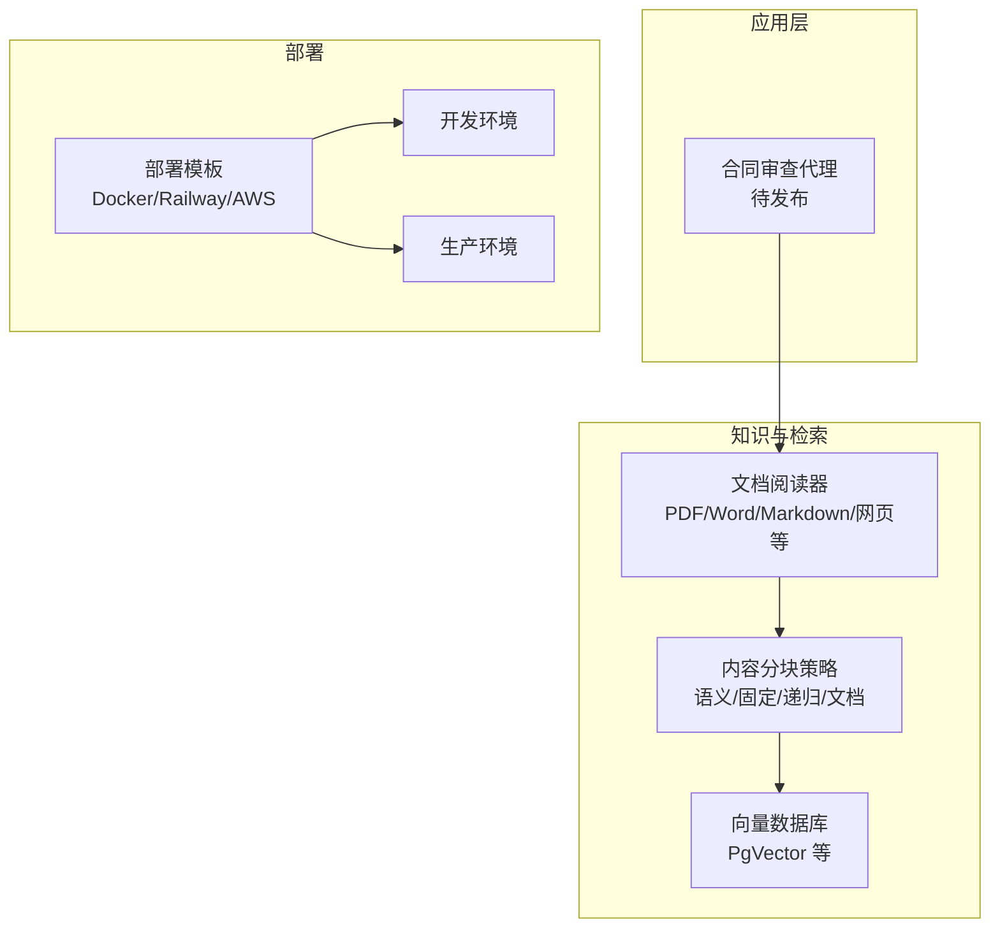
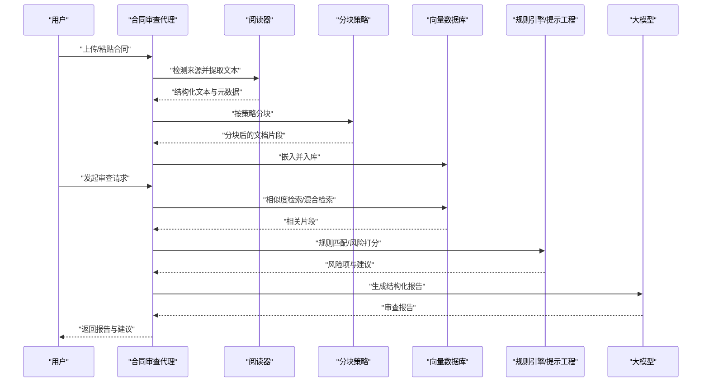
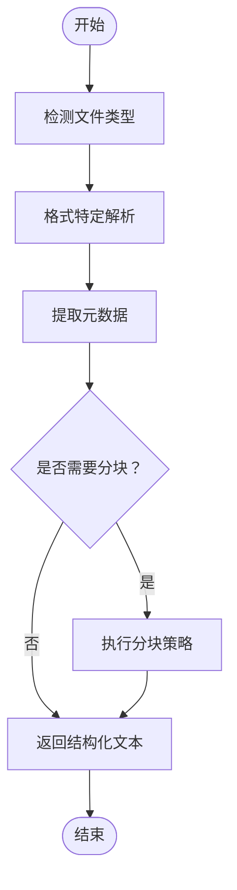
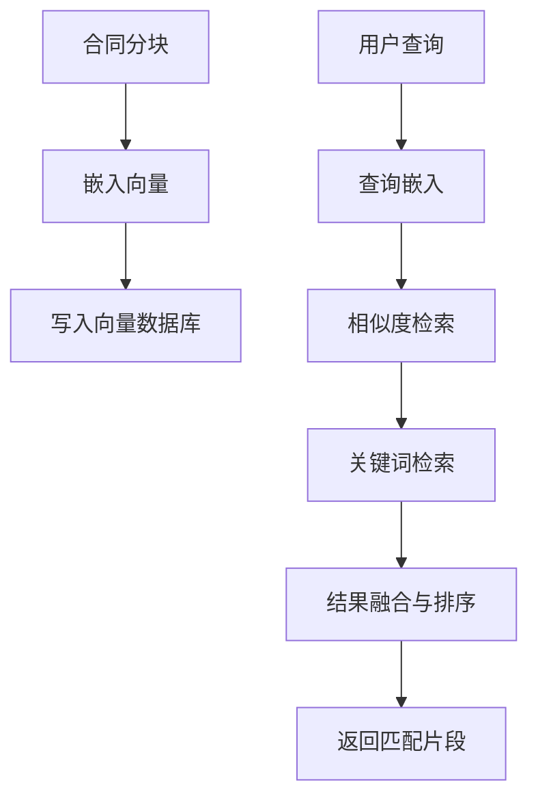
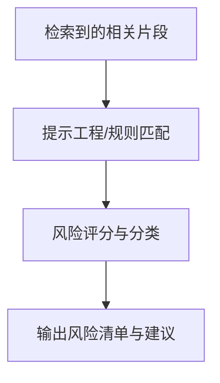
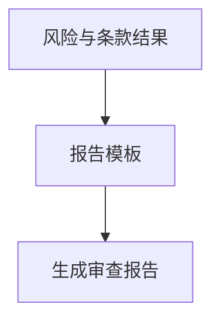
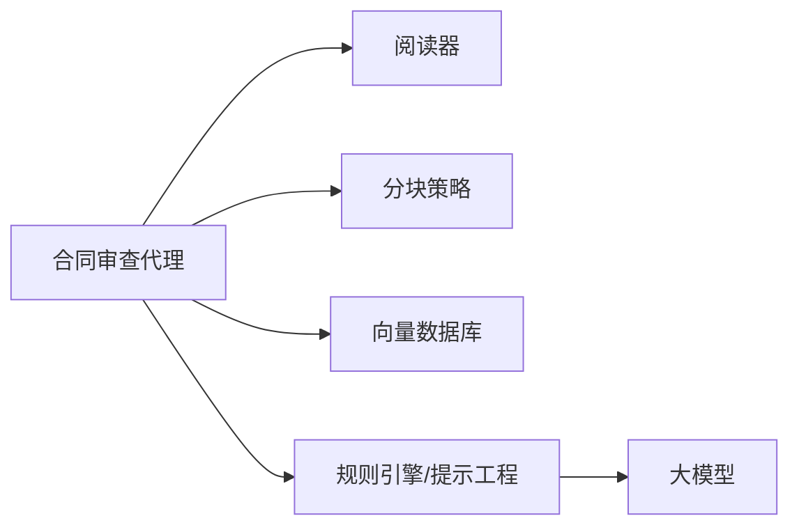

# 合同审查代理

<cite>
**本文引用的文件**
- [contract-review.mdx](file://production/applications/contract-review.mdx)
- [contract-review.mdx](file://deploy/apps/agents/contract-review.mdx)
- [document-summarizer.mdx](file://production/applications/document-summarizer.mdx)
- [readers.mdx](file://cookbook/knowledge/readers.mdx)
- [overview.mdx](file://knowledge/concepts/readers/overview.mdx)
- [vector-db.mdx](file://knowledge/concepts/vector-db.mdx)
- [overview.mdx](file://knowledge/concepts/chunking/overview.mdx)
- [pgvector.mdx](file://TBD/pages/reference/vector-db/pgvector.mdx)
- [deploy-overview.mdx](file://TBD/pages/deploy/overview.mdx)
- [templates.mdx](file://TBD/pages/deploy/templates.mdx)
</cite>

## 目录
1. [简介](#简介)
2. [项目结构](#项目结构)
3. [核心组件](#核心组件)
4. [架构总览](#架构总览)
5. [详细组件分析](#详细组件分析)
6. [依赖关系分析](#依赖关系分析)
7. [性能考虑](#性能考虑)
8. [故障排查指南](#故障排查指南)
9. [结论](#结论)
10. [附录](#附录)

## 简介
本技术文档面向“合同审查代理”应用，系统性阐述其在法律文本解析、条款匹配与风险评估方面的设计思路与实现路径。尽管当前仓库中合同审查代理仍处于规划阶段，但本文基于现有知识体系（如文档阅读器、分块策略、向量数据库与部署模板）给出可落地的架构蓝图、流程图与实施建议，帮助读者快速理解并开展定制化开发。

## 项目结构
合同审查代理属于“应用层”产品形态，当前以“待发布”的形式存在于生产应用页面与部署页面中；其核心能力将依托于知识库与检索增强（RAG）基础设施，包括：
- 文档读取：支持 PDF、Word、Markdown、网页等多种来源
- 内容分块：语义分块、固定大小、递归分块等策略
- 向量存储：PgVector 等向量数据库，支撑相似度检索
- 部署模板：Docker 与云平台模板，便于本地与生产环境快速上线

图表来源
- [contract-review.mdx:1-35](file://production/applications/contract-review.mdx#L1-L35)
- [contract-review.mdx:1-9](file://deploy/apps/agents/contract-review.mdx#L1-L9)
- [readers.mdx:23-38](file://cookbook/knowledge/readers.mdx#L23-L38)
- [overview.mdx:30-60](file://knowledge/concepts/chunking/overview.mdx#L30-L60)
- [vector-db.mdx:32-89](file://knowledge/concepts/vector-db.mdx#L32-L89)
- [deploy-overview.mdx:9-140](file://TBD/pages/deploy/overview.mdx#L9-L140)
- [templates.mdx:1-79](file://TBD/pages/deploy/templates.mdx#L1-L79)

章节来源
- [contract-review.mdx:1-35](file://production/applications/contract-review.mdx#L1-L35)
- [contract-review.mdx:1-9](file://deploy/apps/agents/contract-review.mdx#L1-L9)

## 核心组件
- 文档读取器（Readers）
  - 支持多种格式（PDF、Word、Markdown、网页等），负责从源文件中提取文本与元数据，并可选择进行分块
- 内容分块（Chunking）
  - 提供多种分块策略（语义、固定大小、递归、文档、Markdown、CSV 行、聚合式、代码、自定义），以适配不同合同类型与检索需求
- 向量数据库（Vector DB）
  - 存储嵌入向量，支持相似度检索与混合检索（向量 + 关键词），提升合同条款匹配与风险定位的准确性
- 部署模板（Templates）
  - 提供 Docker 与云平台模板，支持开发与生产环境一键部署

章节来源
- [readers.mdx:23-38](file://cookbook/knowledge/readers.mdx#L23-L38)
- [overview.mdx:30-60](file://knowledge/concepts/chunking/overview.mdx#L30-L60)
- [vector-db.mdx:32-89](file://knowledge/concepts/vector-db.mdx#L32-L89)
- [deploy-overview.mdx:9-140](file://TBD/pages/deploy/overview.mdx#L9-L140)
- [templates.mdx:1-79](file://TBD/pages/deploy/templates.mdx#L1-L79)

## 架构总览
合同审查代理的整体工作流如下：接收合同输入 → 通过阅读器解析为结构化文本 → 使用分块策略切分为可检索片段 → 将片段嵌入并存入向量数据库 → 用户发起审查请求时，先对查询进行嵌入检索，再结合规则引擎与大模型生成审查报告。

图表来源
- [document-summarizer.mdx:128-139](file://production/applications/document-summarizer.mdx#L128-L139)
- [readers.mdx:23-38](file://cookbook/knowledge/readers.mdx#L23-L38)
- [overview.mdx:62-80](file://knowledge/concepts/chunking/overview.mdx#L62-L80)
- [vector-db.mdx:9-31](file://knowledge/concepts/vector-db.mdx#L9-L31)

## 详细组件分析

### 组件一：法律文本解析与标准化
- 能力概述
  - 自动识别合同来源（PDF、Word、Markdown、网页等），抽取正文与元信息，统一为结构化文本
  - 可选地进行分块，以便后续嵌入与检索
- 关键流程
  - 源类型检测 → 格式特定解析 → 元数据提取 → 可选分块
- 建议实践
  - 对扫描版 PDF，建议结合 OCR 工具或使用具备视觉能力的代理
  - 对网页类合同，注意静态内容提取，避免动态渲染导致的内容缺失

图表来源
- [overview.mdx:16-31](file://knowledge/concepts/readers/overview.mdx#L16-L31)
- [readers.mdx:23-38](file://cookbook/knowledge/readers.mdx#L23-L38)

章节来源
- [overview.mdx:16-31](file://knowledge/concepts/readers/overview.mdx#L16-L31)
- [readers.mdx:23-38](file://cookbook/knowledge/readers.mdx#L23-L38)

### 组件二：条款匹配与检索增强（RAG）
- 能力概述
  - 将合同分块后嵌入向量数据库，支持相似度检索与混合检索（向量 + 关键词）
  - 针对常见合同类型（如 NDA、服务协议、租赁协议等）建立标准模板库，用于对比与差异标注
- 关键流程
  - 分块策略选择 → 嵌入向量计算 → 向量入库 → 查询嵌入 → 检索与融合排序
- 建议实践
  - 优先采用语义分块，确保上下文完整性
  - 对结构化强的合同（如服务级别协议）可采用“文档分块”保留段落/章节边界
  - 结合关键词过滤，提升检索准确率

图表来源
- [overview.mdx:62-80](file://knowledge/concepts/chunking/overview.mdx#L62-L80)
- [vector-db.mdx:9-31](file://knowledge/concepts/vector-db.mdx#L9-L31)

章节来源
- [overview.mdx:82-94](file://knowledge/concepts/chunking/overview.mdx#L82-L94)
- [vector-db.mdx:23-31](file://knowledge/concepts/vector-db.mdx#L23-L31)

### 组件三：风险评估与规则引擎
- 能力概述
  - 基于预置规则与提示工程，识别异常条款（如不合理的违约金、模糊表述、单方面解除权等）
  - 输出风险等级、影响范围与改进建议
- 关键流程
  - 片段检索 → 规则匹配/提示调用 → 风险评分 → 结构化输出
- 建议实践
  - 将规则模块化，便于按合同类型切换与扩展
  - 引入置信度与可解释性，辅助人工复核

图表来源
- [document-summarizer.mdx:128-139](file://production/applications/document-summarizer.mdx#L128-L139)

章节来源
- [document-summarizer.mdx:128-139](file://production/applications/document-summarizer.mdx#L128-L139)

### 组件四：报告生成与可视化
- 能力概述
  - 将风险项、关键条款与建议整合为结构化报告，支持摘要、要点与红圈标注建议
- 关键流程
  - 结果聚合 → 报告模板填充 → 输出（文本/富文本/结构化 JSON）

图表来源
- [document-summarizer.mdx:141-153](file://production/applications/document-summarizer.mdx#L141-L153)

章节来源
- [document-summarizer.mdx:141-153](file://production/applications/document-summarizer.mdx#L141-L153)

## 依赖关系分析
- 外部依赖
  - 文档阅读器：PDF/Word/Markdown/网页等
  - 分块策略：语义/固定/递归/文档等
  - 向量数据库：PgVector 等
  - 部署模板：Docker/Railway/AWS
- 内部耦合
  - 合同审查代理与阅读器、分块策略、向量数据库形成强耦合链路
  - 规则引擎与大模型作为“审查决策层”，与检索层解耦，便于独立演进

图表来源
- [readers.mdx:23-38](file://cookbook/knowledge/readers.mdx#L23-L38)
- [overview.mdx:30-60](file://knowledge/concepts/chunking/overview.mdx#L30-L60)
- [vector-db.mdx:32-89](file://knowledge/concepts/vector-db.mdx#L32-L89)

章节来源
- [readers.mdx:23-38](file://cookbook/knowledge/readers.mdx#L23-L38)
- [overview.mdx:30-60](file://knowledge/concepts/chunking/overview.mdx#L30-L60)
- [vector-db.mdx:32-89](file://knowledge/concepts/vector-db.mdx#L32-L89)

## 性能考虑
- 分块策略选择
  - 通用合同建议使用“语义分块”，兼顾上下文与检索精度
  - 结构化强的合同可采用“文档分块”，保留段落/章节边界
- 向量检索优化
  - 启用混合检索（向量 + 关键词），提升召回与精确度
  - 控制分块大小（默认约 5000 字符），小块适合精准问题，大块适合上下文问答
- 异步与并发
  - 使用异步插入与检索接口，提升批量处理吞吐
- 部署与资源
  - 开发环境推荐 Docker，生产环境可选云托管模板，按流量弹性伸缩

章节来源
- [overview.mdx:118-126](file://knowledge/concepts/chunking/overview.mdx#L118-L126)
- [vector-db.mdx:108-117](file://knowledge/concepts/vector-db.mdx#L108-L117)
- [deploy-overview.mdx:9-140](file://TBD/pages/deploy/overview.mdx#L9-L140)
- [templates.mdx:28-79](file://TBD/pages/deploy/templates.mdx#L28-L79)

## 故障排查指南
- PDF 提取为空
  - 扫描版 PDF 不支持纯文本提取，需结合 OCR 或使用具备视觉能力的代理
- 网页内容不完整
  - 动态渲染页面可能无法完全提取，建议使用静态 HTML 提取工具
- 低置信度
  - 文档质量差、内容模糊或缺少上下文，建议人工复核并补充背景信息

章节来源
- [document-summarizer.mdx:165-177](file://production/applications/document-summarizer.mdx#L165-L177)

## 结论
合同审查代理以“阅读器 + 分块 + 向量检索 + 规则引擎 + 大模型”为核心路径，既可覆盖多类型合同的自动化审查，又可通过模板与规则灵活扩展。借助现有知识库与部署模板，可在本地快速验证原型，并平滑迁移到生产环境。

## 附录

### 部署步骤（基于现有模板）
- 选择模板
  - Docker 模板：适合本地开发与快速验证
  - 云平台模板：Railway/AWS 等，提供一键部署与扩缩容
- 环境准备
  - 开发环境：Docker Compose
  - 生产环境：根据所选云平台配置容器编排与密钥管理
- 运行与验证
  - 在开发环境启动服务，接入知识库与向量数据库
  - 上传样例合同，验证解析、检索与报告生成流程

章节来源
- [deploy-overview.mdx:9-140](file://TBD/pages/deploy/overview.mdx#L9-L140)
- [templates.mdx:1-79](file://TBD/pages/deploy/templates.mdx#L1-L79)

### 合同模板支持与扩展
- 模板支持
  - 基于向量库的标准模板库，按合同类型（NDA、服务协议、租赁协议等）维护
- 扩展方法
  - 新增模板：将标准条款嵌入向量库，更新检索策略
  - 规则扩展：新增/调整规则集，支持按合同类型切换
  - 报告模板：按需调整报告字段与呈现方式

章节来源
- [contract-review.mdx:15-22](file://production/applications/contract-review.mdx#L15-L22)