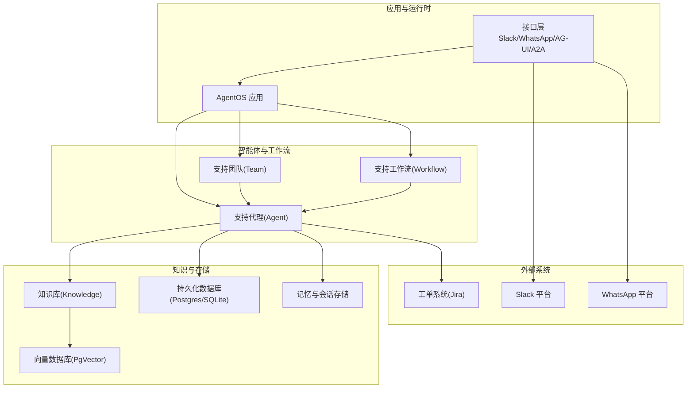
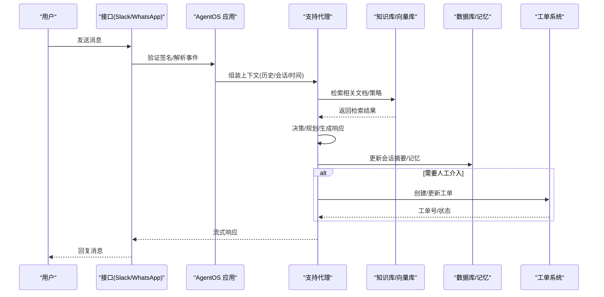
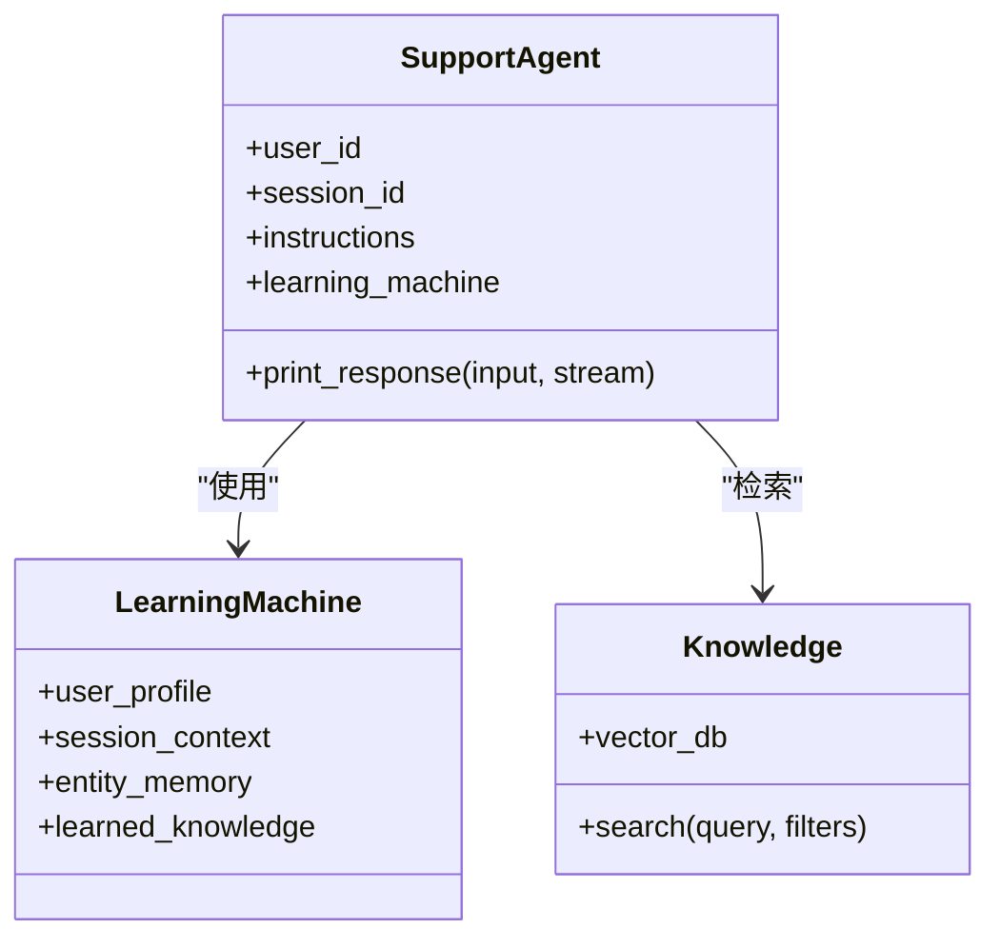
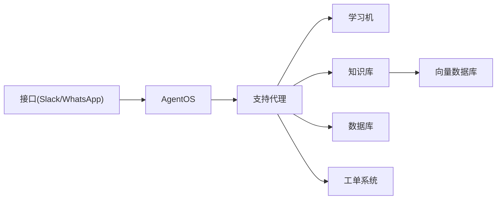

# 客户支持代理

<cite>
**本文引用的文件**
- [cookbook/learning/support-agent.mdx](file://cookbook/learning/support-agent.mdx)
- [examples/learning/patterns/support-agent.mdx](file://examples/learning/patterns/support-agent.mdx)
- [history/workflow/multi-purpose-cli.mdx](file://history/workflow/multi-purpose-cli.mdx)
- [production/applications/customer-support.mdx](file://production/applications/customer-support.mdx)
- [knowledge/concepts/search-and-retrieval/overview.mdx](file://knowledge/concepts/search-and-retrieval/overview.mdx)
- [agent-os/interfaces/overview.mdx](file://agent-os/interfaces/overview.mdx)
- [agent-os/interfaces/slack/introduction.mdx](file://agent-os/interfaces/slack/introduction.mdx)
- [agent-os/interfaces/whatsapp/introduction.mdx](file://agent-os/interfaces/whatsapp/introduction.mdx)
- [agent-os/features/knowledge-management.mdx](file://agent-os/features/knowledge-management.mdx)
- [agent-os/usage/extra-configuration.mdx](file://agent-os/usage/extra-configuration.mdx)
- [deploy/introduction.mdx](file://deploy/introduction.mdx)
- [sessions/overview.mdx](file://sessions/overview.mdx)
- [memory/agent/multi-user-multi-session-chat.mdx](file://memory/agent/multi-user-multi-session-chat.mdx)
- [learning/stores/session-context.mdx](file://learning/stores/session-context.mdx)
- [examples/tools/jira-tools.mdx](file://examples/tools/jira-tools.mdx)
- [performance.mdx](file://performance.mdx)
- [observability/overview.mdx](file://observability/overview.mdx)
- [examples/agent-os/client-a2a/error-handling.mdx](file://examples/agent-os/client-a2a/error-handling.mdx)
</cite>

## 目录
1. [简介](#简介)
2. [项目结构](#项目结构)
3. [核心组件](#核心组件)
4. [架构总览](#架构总览)
5. [详细组件分析](#详细组件分析)
6. [依赖关系分析](#依赖关系分析)
7. [性能考虑](#性能考虑)
8. [故障排查指南](#故障排查指南)
9. [结论](#结论)
10. [附录](#附录)

## 简介
本技术文档面向“客户支持代理”应用，系统性阐述其如何处理客户查询、提供自动化支持与问题解决，涵盖对话管理、知识库集成、工单系统对接、多渠道支持（Slack、WhatsApp）以及部署与配置要点。文档同时给出内部架构说明（意图识别、上下文管理、响应生成）、性能优化建议、客户体验提升方法，并提供扩展与自定义支持流程的实践指导。

## 项目结构
围绕客户支持代理的关键内容主要分布在以下区域：
- 学习与模式：支持代理的多租户学习模式、会话上下文与实体记忆、已学知识复用
- 工作流与团队：多步支持流程、分级路由与升级
- 知识与检索：传统RAG与智能RAG（Agentic RAG），元数据过滤与动态检索
- 接口与部署：Slack/WhatsApp等多渠道接入、AgentOS接口与模板部署
- 会话与记忆：用户级与会话级隔离、历史与摘要、跨会话续聊
- 性能与可观测性：基准与内存占用、OpenTelemetry追踪与监控

图表来源
- [agent-os/interfaces/overview.mdx:43-67](file://agent-os/interfaces/overview.mdx#L43-L67)
- [agent-os/interfaces/slack/introduction.mdx:50-75](file://agent-os/interfaces/slack/introduction.mdx#L50-L75)
- [agent-os/interfaces/whatsapp/introduction.mdx:54-77](file://agent-os/interfaces/whatsapp/introduction.mdx#L54-L77)
- [cookbook/learning/support-agent.mdx:42-65](file://cookbook/learning/support-agent.mdx#L42-L65)
- [examples/learning/patterns/support-agent.mdx:55-84](file://examples/learning/patterns/support-agent.mdx#L55-L84)

章节来源
- [agent-os/interfaces/overview.mdx:1-68](file://agent-os/interfaces/overview.mdx#L1-L68)
- [agent-os/interfaces/slack/introduction.mdx:1-100](file://agent-os/interfaces/slack/introduction.mdx#L1-L100)
- [agent-os/interfaces/whatsapp/introduction.mdx:1-98](file://agent-os/interfaces/whatsapp/introduction.mdx#L1-L98)
- [cookbook/learning/support-agent.mdx:1-120](file://cookbook/learning/support-agent.mdx#L1-L120)
- [examples/learning/patterns/support-agent.mdx:1-146](file://examples/learning/patterns/support-agent.mdx#L1-L146)

## 核心组件
- 支持代理（Agent）
  - 多租户命名空间隔离的实体记忆
  - 会话上下文规划与进度跟踪
  - 用户画像与已学知识的持续积累
  - 基于知识库的检索增强生成
- 支持团队（Team）
  - 多角色协作：接待员、技术专家、升级管理者
  - 历史与上下文在成员间共享
- 支持工作流（Workflow）
  - 多步骤支持流程：问题采集、技术诊断、升级与记录
  - 会话状态驱动的步骤管理
- 知识库与检索
  - 向量相似检索、混合检索、元数据过滤
  - 动态查询重写与多次检索组合
- 接口与多渠道
  - Slack：事件路由、签名验证、线程会话
  - WhatsApp：Webhook、签名验证、多媒体消息处理
- 会话与记忆
  - 用户级与会话级隔离
  - 历史注入与会话摘要
  - 跨会话续聊与状态恢复

章节来源
- [cookbook/learning/support-agent.mdx:42-65](file://cookbook/learning/support-agent.mdx#L42-L65)
- [examples/learning/patterns/support-agent.mdx:55-84](file://examples/learning/patterns/support-agent.mdx#L55-L84)
- [history/workflow/multi-purpose-cli.mdx:27-52](file://history/workflow/multi-purpose-cli.mdx#L27-L52)
- [knowledge/concepts/search-and-retrieval/overview.mdx:99-152](file://knowledge/concepts/search-and-retrieval/overview.mdx#L99-L152)
- [agent-os/interfaces/slack/introduction.mdx:50-85](file://agent-os/interfaces/slack/introduction.mdx#L50-L85)
- [agent-os/interfaces/whatsapp/introduction.mdx:54-97](file://agent-os/interfaces/whatsapp/introduction.mdx#L54-L97)
- [sessions/overview.mdx:47-86](file://sessions/overview.mdx#L47-L86)
- [memory/agent/multi-user-multi-session-chat.mdx:63-106](file://memory/agent/multi-user-multi-session-chat.mdx#L63-L106)

## 架构总览
下图展示从用户输入到响应输出的端到端流程，包括意图识别、上下文管理、知识检索与响应生成：

图表来源
- [agent-os/interfaces/slack/introduction.mdx:80-85](file://agent-os/interfaces/slack/introduction.mdx#L80-L85)
- [agent-os/interfaces/whatsapp/introduction.mdx:91-97](file://agent-os/interfaces/whatsapp/introduction.mdx#L91-L97)
- [cookbook/learning/support-agent.mdx:42-65](file://cookbook/learning/support-agent.mdx#L42-L65)
- [examples/tools/jira-tools.mdx:84-95](file://examples/tools/jira-tools.mdx#L84-L95)

## 详细组件分析

### 支持代理（Agent）
- 多租户与学习
  - 实体记忆按组织命名空间隔离，避免跨租户干扰
  - 已学知识采用“代理式学习”，成功方案自动沉淀
- 上下文与会话
  - 启用会话规划，跟踪目标、计划与进度
  - 可选择注入历史轮次与时间信息
- 知识检索
  - 支持混合检索与元数据过滤
  - 允许查询重写与多次检索组合

图表来源
- [cookbook/learning/support-agent.mdx:42-65](file://cookbook/learning/support-agent.mdx#L42-L65)
- [examples/learning/patterns/support-agent.mdx:55-84](file://examples/learning/patterns/support-agent.mdx#L55-L84)

章节来源
- [cookbook/learning/support-agent.mdx:42-65](file://cookbook/learning/support-agent.mdx#L42-L65)
- [examples/learning/patterns/support-agent.mdx:55-84](file://examples/learning/patterns/support-agent.mdx#L55-L84)
- [learning/stores/session-context.mdx:134-164](file://learning/stores/session-context.mdx#L134-L164)

### 支持团队（Team）
- 角色分工：接待员（收集信息）、技术专家（诊断与解决）、升级管理者（复杂问题）
- 成员间共享历史与上下文，确保交接连贯

章节来源
- [examples/teams/context-management/few-shot-learning.mdx:75-93](file://examples/teams/context-management/few-shot-learning.mdx#L75-L93)

### 支持工作流（Workflow）
- 多步骤流程：问题采集、技术诊断、升级与记录
- 通过会话状态维护步骤列表与分配关系，支持状态更新与备注

章节来源
- [history/workflow/multi-purpose-cli.mdx:27-52](file://history/workflow/multi-purpose-cli.mdx#L27-L52)
- [examples/workflows/advanced-concepts/session-state/state-with-team.mdx:224-256](file://examples/workflows/advanced-concepts/session-state/state-with-team.mdx#L224-L256)

### 知识库与检索
- 传统RAG：固定检索并注入上下文
- 智能RAG（Agentic RAG）：由代理自主决定是否检索、何时检索、如何重写查询、是否二次检索
- 元数据过滤：按部门/类型等筛选目标内容
- 动态更新：支持增量插入与刷新

章节来源
- [knowledge/concepts/search-and-retrieval/overview.mdx:99-152](file://knowledge/concepts/search-and-retrieval/overview.mdx#L99-L152)
- [agent-os/features/knowledge-management.mdx:18-78](file://agent-os/features/knowledge-management.mdx#L18-L78)

### 多渠道接口（Slack/WhatsApp）
- Slack
  - 事件路由、签名验证、线程会话、流式回复
  - 支持仅@提及或全频道消息响应
- WhatsApp
  - Webhook验证、签名校验、多媒体消息处理
  - 用户手机号作为user_id与session_id，天然会话隔离

章节来源
- [agent-os/interfaces/slack/introduction.mdx:50-85](file://agent-os/interfaces/slack/introduction.mdx#L50-L85)
- [agent-os/interfaces/whatsapp/introduction.mdx:54-97](file://agent-os/interfaces/whatsapp/introduction.mdx#L54-L97)

### 会话与记忆
- 用户级与会话级隔离，支持并发多用户多会话
- 历史注入控制、会话摘要以降低token成本
- 跨会话续聊与状态恢复

章节来源
- [sessions/overview.mdx:47-86](file://sessions/overview.mdx#L47-L86)
- [memory/agent/multi-user-multi-session-chat.mdx:63-106](file://memory/agent/multi-user-multi-session-chat.mdx#L63-L106)

### 工单系统对接（以Jira为例）
- 查询问题详情、添加工作日志、创建/更新工单
- 与支持代理结合，实现自动/半自动升级与闭环

章节来源
- [examples/tools/jira-tools.mdx:84-95](file://examples/tools/jira-tools.mdx#L84-L95)

## 依赖关系分析
- 组件耦合
  - 支持代理依赖学习机、知识库与数据库
  - 接口层通过FastAPI路由挂载，解耦平台差异
  - 工作流与团队通过会话状态与历史共享实现协作
- 外部依赖
  - Slack/WhatsApp平台事件与Webhook
  - 向量数据库（PgVector）与嵌入模型
  - 工单系统（如Jira）REST API

图表来源
- [cookbook/learning/support-agent.mdx:42-65](file://cookbook/learning/support-agent.mdx#L42-L65)
- [agent-os/interfaces/overview.mdx:43-67](file://agent-os/interfaces/overview.mdx#L43-L67)
- [examples/tools/jira-tools.mdx:84-95](file://examples/tools/jira-tools.mdx#L84-L95)

章节来源
- [agent-os/interfaces/overview.mdx:43-67](file://agent-os/interfaces/overview.mdx#L43-L67)
- [cookbook/learning/support-agent.mdx:42-65](file://cookbook/learning/support-agent.mdx#L42-L65)

## 性能考虑
- 初始化与内存
  - 框架在实例化时间与内存占用方面具备优势，适合高并发与长生命周期场景
- 异步与并行
  - 异步优先、最小内存、并行执行与后台线程，降低延迟
- 检索优化
  - 使用混合检索与元数据过滤减少无关返回
  - 会话摘要压缩长历史，降低token消耗
- 可观测性
  - OpenTelemetry集成，支持分布式追踪与监控

章节来源
- [performance.mdx:1-67](file://performance.mdx#L1-L67)
- [observability/overview.mdx:1-25](file://observability/overview.mdx#L1-L25)
- [learning/stores/session-context.mdx:134-164](file://learning/stores/session-context.mdx#L134-L164)

## 故障排查指南
- 接口连接错误
  - 检查服务可用性、超时设置与网络连通
- Slack签名验证失败
  - 核对令牌与签名密钥、事件订阅路径
- WhatsApp签名与权限
  - 校验verify token与app secret；确认Webhook回调地址
- 错误处理模式
  - 使用重试、停止条件与后置钩子，避免循环与“幻觉”
- 日志与追踪
  - 结合OpenTelemetry后端定位异常路径

章节来源
- [examples/agent-os/client-a2a/error-handling.mdx:48-151](file://examples/agent-os/client-a2a/error-handling.mdx#L48-L151)
- [agent-os/interfaces/slack/introduction.mdx:94-100](file://agent-os/interfaces/slack/introduction.mdx#L94-L100)
- [agent-os/interfaces/whatsapp/introduction.mdx:91-97](file://agent-os/interfaces/whatsapp/introduction.mdx#L91-L97)
- [examples/tools/exceptions/retry-tool-call.mdx:41-82](file://examples/tools/exceptions/retry-tool-call.mdx#L41-L82)
- [examples/tools/exceptions/stop-agent-exception.mdx:44-79](file://examples/tools/exceptions/stop-agent-exception.mdx#L44-L79)

## 结论
客户支持代理通过“学习型代理 + 多渠道接口 + 智能检索 + 会话记忆”的组合，实现了从自动应答到智能升级的全链路支持。依托AgentOS的模块化接口与可插拔设计，可在不同平台快速落地，并通过可观测性与性能优化保障生产稳定性。建议在生产中结合业务场景定制意图识别、分级路由与升级策略，持续迭代知识库与学习策略，以提升客户体验与解决效率。

## 附录

### 部署与配置要点
- 模板与应用
  - 选择空白画布或预置解决方案，添加Agent/Team/Workflow
  - 通过模板部署至Docker/Railway/AWS
- 接口暴露
  - 在AgentOS中注册Slack/WhatsApp等接口，挂载协议路由
- 配置文件
  - 使用YAML传递额外配置（聊天快捷提示、数据库域配置等）

章节来源
- [deploy/introduction.mdx:1-102](file://deploy/introduction.mdx#L1-L102)
- [agent-os/interfaces/overview.mdx:52-67](file://agent-os/interfaces/overview.mdx#L52-L67)
- [agent-os/usage/extra-configuration.mdx:1-161](file://agent-os/usage/extra-configuration.mdx#L1-L161)

### 扩展与自定义支持流程
- 自定义工具与工单对接
  - 将外部系统（如Jira）封装为工具，供代理调用
- 多租户与命名空间
  - 利用实体记忆命名空间实现组织级隔离
- 会话与历史
  - 控制历史注入轮次与启用会话摘要，平衡成本与效果
- 多渠道协同
  - 同一Agent通过Slack/WhatsApp并行服务，保持一致上下文与状态

章节来源
- [examples/tools/jira-tools.mdx:84-95](file://examples/tools/jira-tools.mdx#L84-L95)
- [cookbook/learning/support-agent.mdx:56-60](file://cookbook/learning/support-agent.mdx#L56-L60)
- [sessions/overview.mdx:47-86](file://sessions/overview.mdx#L47-L86)
- [agent-os/interfaces/slack/introduction.mdx:50-85](file://agent-os/interfaces/slack/introduction.mdx#L50-L85)
- [agent-os/interfaces/whatsapp/introduction.mdx:54-97](file://agent-os/interfaces/whatsapp/introduction.mdx#L54-L97)