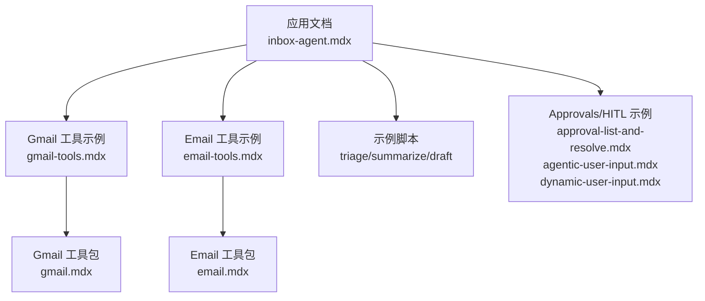
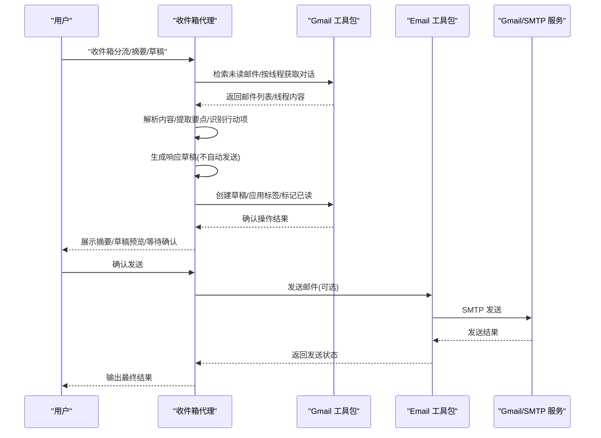
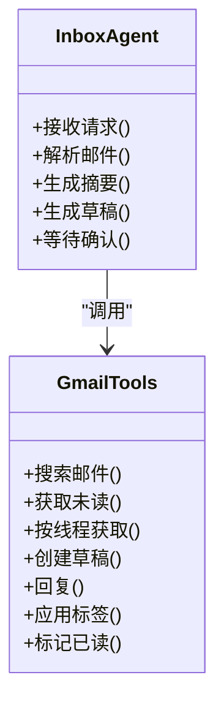
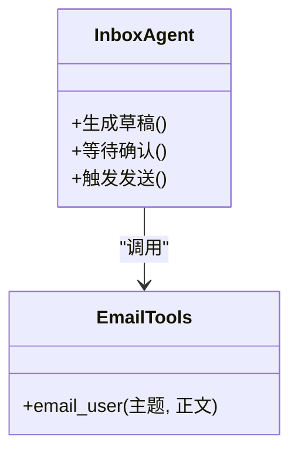
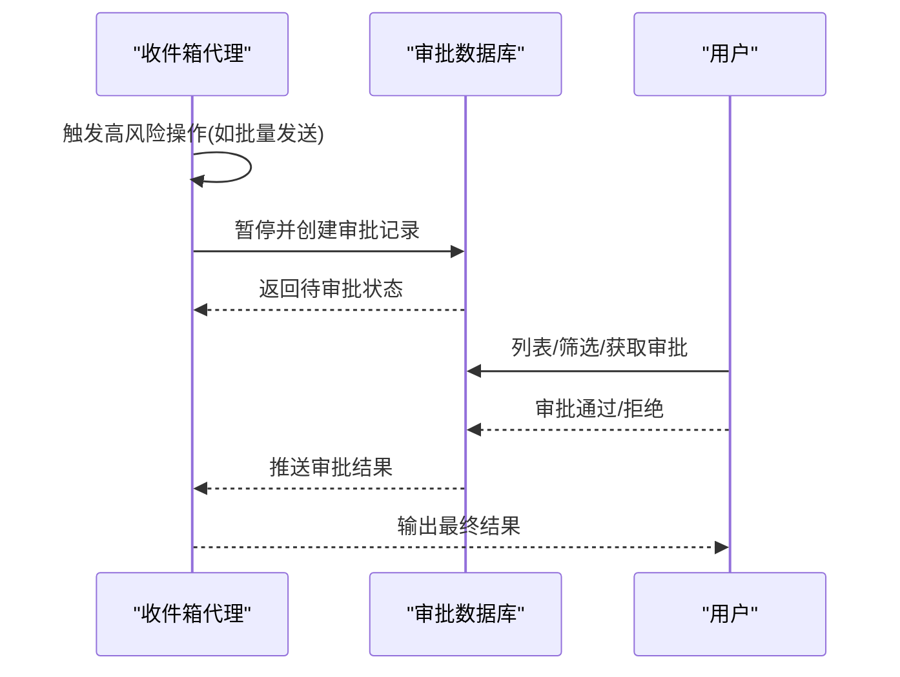
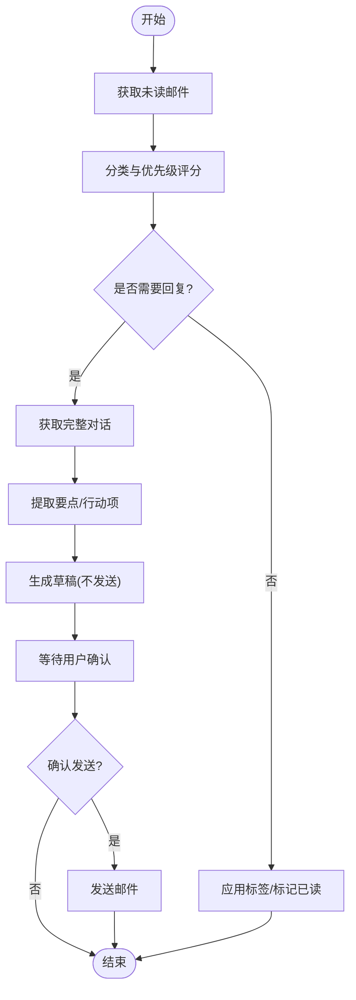
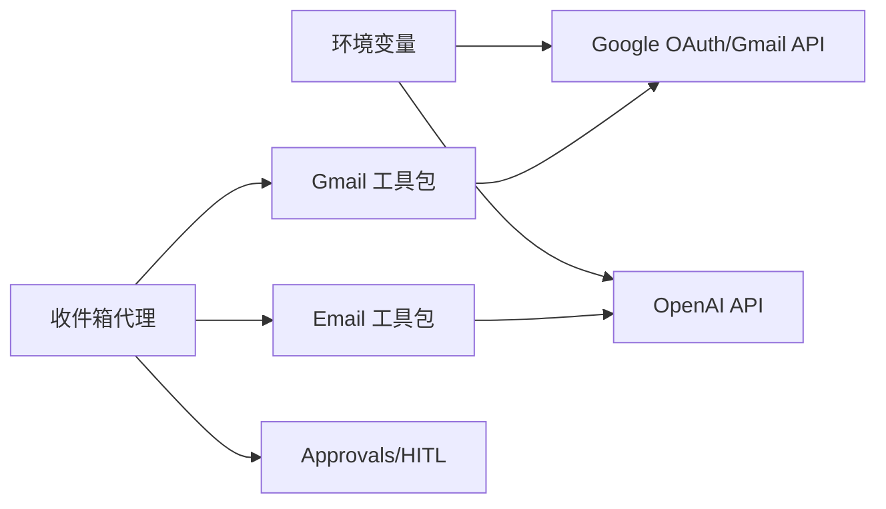

# 收件箱代理

<cite>
**本文引用的文件**
- [inbox-agent.mdx](file://production/applications/inbox-agent.mdx)
- [gmail-tools.mdx](file://examples/tools/gmail-tools.mdx)
- [email.mdx](file://tools/toolkits/social/email.mdx)
- [email-tools.mdx](file://examples/tools/email-tools.mdx)
- [agentic-user-input.mdx](file://examples/agents/human-in-the-loop/agentic-user-input.mdx)
- [dynamic-user-input.mdx](file://hitl/dynamic-user-input.mdx)
- [approval-list-and-resolve.mdx](file://examples/agents/approvals/approval-list-and-resolve.mdx)
</cite>

## 目录
1. [简介](#简介)
2. [项目结构](#项目结构)
3. [核心组件](#核心组件)
4. [架构总览](#架构总览)
5. [详细组件分析](#详细组件分析)
6. [依赖关系分析](#依赖关系分析)
7. [性能考虑](#性能考虑)
8. [故障排查指南](#故障排查指南)
9. [结论](#结论)
10. [附录](#附录)

## 简介
本技术文档面向“收件箱代理”应用，系统阐述其自动处理邮件与消息的能力：邮件解析、分类过滤、自动化回复与安全控制。文档覆盖部署步骤、配置参数、消息处理流程、内部架构（邮件协议集成、内容分析与响应生成）、性能优化与批量处理方法，并提供扩展与自定义邮件规则的开发指导。

## 项目结构
收件箱代理以“示例应用”的形式组织在仓库中，核心由以下部分构成：
- 应用说明与使用指南：位于生产级应用文档中，包含安装、运行、配置与故障排查。
- 工具与集成：Gmail 工具包与通用 Email 工具包，分别用于 Gmail 协议集成与通用 SMTP 发送。
- 示例脚本：提供三类典型场景的示例脚本，涵盖收件箱分流、主题摘要与草稿回复。
- 人机交互与审批：提供 Approvals 与 Human-in-the-Loop 能力，确保高风险操作需要人工确认。

**图表来源**
- [inbox-agent.mdx:1-222](file://production/applications/inbox-agent.mdx#L1-L222)
- [gmail-tools.mdx:27-183](file://examples/tools/gmail-tools.mdx#L27-L183)
- [email-tools.mdx:1-72](file://examples/tools/email-tools.mdx#L1-L72)
- [email.mdx:1-52](file://tools/toolkits/social/email.mdx#L1-L52)

**章节来源**
- [inbox-agent.mdx:18-82](file://production/applications/inbox-agent.mdx#L18-L82)

## 核心组件
- 邮件协议集成
  - Gmail 工具包：提供检索未读邮件、按线程获取完整对话、搜索、创建草稿、回复、打标签、标记已读等能力。
  - Email 工具包：提供向用户发送邮件的能力，支持 SMTP 参数配置。
- 内容分析与响应生成
  - 基于模型的邮件解析与摘要提取，结合上下文与历史会话，生成结构化摘要与行动项。
  - 响应草稿生成，保持语气一致与上下文相关性。
- 自动化与安全控制
  - 分类与优先级：将邮件分为紧急、需处理、知会、订阅、垃圾等类别，并设定时间窗。
  - 安全特性：禁止自动发送、需要显式确认、默认只读模式、钓鱼检测提示。
- 批量处理与工作流
  - 使用条件表达式与工作流进行批量路由与处理。
  - 通过 Approvals/HITL 机制对批量高风险操作进行人工审批。

**章节来源**
- [inbox-agent.mdx:127-194](file://production/applications/inbox-agent.mdx#L127-L194)
- [gmail-tools.mdx:27-110](file://examples/tools/gmail-tools.mdx#L27-L110)
- [email.mdx:32-47](file://tools/toolkits/social/email.mdx#L32-L47)

## 架构总览
下图展示收件箱代理从“接收请求”到“生成草稿并等待确认”的端到端流程，以及与 Gmail/Email 工具包的交互关系。

**图表来源**
- [inbox-agent.mdx:127-194](file://production/applications/inbox-agent.mdx#L127-L194)
- [gmail-tools.mdx:27-110](file://examples/tools/gmail-tools.mdx#L27-L110)
- [email.mdx:32-47](file://tools/toolkits/social/email.mdx#L32-L47)

## 详细组件分析

### 组件一：Gmail 工具包与收件箱代理集成
- 功能清单
  - 获取未读邮件、按线程获取完整对话、搜索邮件、创建草稿、回复、应用标签、标记已读。
- 典型用法
  - 仅读模式：限制为搜索、读取、打标签、标记已读。
  - 安全模式：排除发送/回复能力，仅允许草稿。
  - 完整功能：默认启用全部能力。
- 安全与合规
  - 默认不自动发送；任何发送均需显式确认。
  - 提供钓鱼检测提示，避免误发敏感信息。

**图表来源**
- [gmail-tools.mdx:27-110](file://examples/tools/gmail-tools.mdx#L27-L110)
- [inbox-agent.mdx:176-187](file://production/applications/inbox-agent.mdx#L176-L187)

**章节来源**
- [gmail-tools.mdx:27-110](file://examples/tools/gmail-tools.mdx#L27-L110)
- [inbox-agent.mdx:176-194](file://production/applications/inbox-agent.mdx#L176-L194)

### 组件二：Email 工具包与发送控制
- 功能清单
  - 向用户发送邮件，支持设置发件人、发件名称、收件人与凭据。
  - 当前在 Gmail 上可用。
- 安全控制
  - 仅在用户明确确认后执行发送。
  - 可通过 Approvals/HITL 流程进行人工审批。

**图表来源**
- [email.mdx:32-47](file://tools/toolkits/social/email.mdx#L32-L47)
- [email-tools.mdx:17-46](file://examples/tools/email-tools.mdx#L17-L46)

**章节来源**
- [email.mdx:32-47](file://tools/toolkits/social/email.mdx#L32-L47)
- [email-tools.mdx:17-46](file://examples/tools/email-tools.mdx#L17-L46)

### 组件三：人机交互与审批（Approvals/HITL）
- Approvals
  - 对高风险操作（如批量发送）进行暂停与审批，支持查询、计数、过滤与单条获取。
- Human-in-the-Loop
  - 在运行过程中动态收集用户输入，满足工具调用所需数据或确认。
- 实践建议
  - 将批量发送、删除数据等高风险动作纳入 Approvals。
  - 对需要外部数据的场景使用 HITL，确保代理在缺失信息时暂停并请求补充。

**图表来源**
- [approval-list-and-resolve.mdx:48-123](file://examples/agents/approvals/approval-list-and-resolve.mdx#L48-L123)

**章节来源**
- [approval-list-and-resolve.mdx:48-123](file://examples/agents/approvals/approval-list-and-resolve.mdx#L48-L123)
- [agentic-user-input.mdx:40-79](file://examples/agents/human-in-the-loop/agentic-user-input.mdx#L40-L79)
- [dynamic-user-input.mdx:51-93](file://hitl/dynamic-user-input.mdx#L51-L93)

### 组件四：消息处理流程（收件箱分流、摘要与草稿）
- 收件箱分流
  - 获取未读邮件，按类别与优先级评分，决定后续处理策略。
- 主题摘要
  - 获取完整对话，抽取关键点与行动项，形成结构化摘要。
- 草稿回复
  - 基于上下文与语气匹配生成草稿，不自动发送，等待确认。

**图表来源**
- [inbox-agent.mdx:88-126](file://production/applications/inbox-agent.mdx#L88-L126)

**章节来源**
- [inbox-agent.mdx:88-126](file://production/applications/inbox-agent.mdx#L88-L126)

## 依赖关系分析
- 外部依赖
  - Google OAuth 凭证与 Gmail API：用于认证与访问 Gmail。
  - OpenAI API：用于内容理解、摘要与草稿生成。
- 内部依赖
  - Gmail 工具包与 Email 工具包作为代理工具集。
  - Approvals/HITL 数据库与工具链，保障高风险操作的安全性。
- 配置参数
  - 环境变量：OpenAI 密钥、Google 客户端 ID/Secret、项目 ID、重定向 URI。
  - 工具参数：Gmail 工具包的 include/exclude 工具集合、Email 工具包的发件人/收件人与凭据。

**图表来源**
- [inbox-agent.mdx:71-82](file://production/applications/inbox-agent.mdx#L71-L82)
- [gmail-tools.mdx:40-49](file://examples/tools/gmail-tools.mdx#L40-L49)
- [email.mdx:32-41](file://tools/toolkits/social/email.mdx#L32-L41)

**章节来源**
- [inbox-agent.mdx:71-82](file://production/applications/inbox-agent.mdx#L71-L82)
- [gmail-tools.mdx:40-49](file://examples/tools/gmail-tools.mdx#L40-L49)
- [email.mdx:32-41](file://tools/toolkits/social/email.mdx#L32-L41)

## 性能考虑
- 批量处理
  - 使用工作流与条件表达式对高优先级任务进行快速分流，减少重复扫描。
  - 对大量邮件采用分页/分批处理，避免一次性请求过大导致超时。
- 缓存与去重
  - 对已处理的线程 ID 进行缓存，避免重复处理同一对话。
  - 对相似内容的摘要结果进行缓存，降低重复生成成本。
- 并发与限流
  - Gmail API 存在速率限制，建议在批量操作时增加退避与并发控制。
  - 对 OpenAI 请求进行队列化与限速，避免突发高峰导致失败。
- 存储与索引
  - 使用 Approvals/HITL 的数据库存储审批状态，确保高可用与可追踪。
  - 对历史会话与摘要进行持久化，便于后续检索与审计。

[本节为通用性能建议，无需特定文件引用]

## 故障排查指南
- OAuth 认证失败
  - 检查客户端 ID/Secret 是否正确，确认重定向 URI 已在 Google Cloud 控制台配置。
- Gmail API 未启用
  - 登录 Google Cloud 控制台，在“API 与服务 > 启用 API 和服务”中启用 Gmail API。
- Token 过期
  - 删除本地 token 文件后重新触发 OAuth 流程。
- 发送失败或未发送
  - 确认代理处于“草稿模式”，需要用户确认后才会真正发送。
  - 检查 Approvals/HITL 是否存在待审批任务阻塞发送。

**章节来源**
- [inbox-agent.mdx:195-216](file://production/applications/inbox-agent.mdx#L195-L216)

## 结论
收件箱代理通过 Gmail 与 Email 工具包实现对邮件的自动解析、分类与草稿生成，并以 Approvals/HITL 机制确保高风险操作的人工把关。配合工作流与条件表达式，可实现高效的批量处理与安全可控的自动化。建议在生产环境中严格遵循安全策略、合理设计分类与优先级规则，并结合缓存与限流策略提升整体性能与稳定性。

[本节为总结性内容，无需特定文件引用]

## 附录

### 部署与运行步骤
- 克隆仓库并创建虚拟环境。
- 安装依赖。
- 设置 Google OAuth 与 Gmail API 凭证。
- 配置环境变量（OpenAI、Google）。
- 首次运行将打开浏览器进行 OAuth 认证。
- 运行示例脚本：收件箱分流、主题摘要、草稿回复。

**章节来源**
- [inbox-agent.mdx:24-82](file://production/applications/inbox-agent.mdx#L24-L82)

### 配置参数参考
- 环境变量
  - OpenAI：OPENAI_API_KEY
  - Google：GOOGLE_CLIENT_ID、GOOGLE_CLIENT_SECRET、GOOGLE_PROJECT_ID、GOOGLE_REDIRECT_URI
- Gmail 工具包参数
  - creds、credentials_path、token_path、scopes、port
- Email 工具包参数
  - receiver_email、sender_name、sender_email、sender_passkey、enable_email_user、all

**章节来源**
- [inbox-agent.mdx:71-82](file://production/applications/inbox-agent.mdx#L71-L82)
- [gmail-tools.mdx:40-49](file://examples/tools/gmail-tools.mdx#L40-L49)
- [email.mdx:32-41](file://tools/toolkits/social/email.mdx#L32-L41)

### 扩展与自定义邮件规则
- 自定义分类与优先级
  - 在代理系统消息中定义新的类别与评分规则，结合上下文与历史会话进行判断。
- 自定义工作流
  - 使用 CEL 表达式与工作流对不同优先级进行路由，实现差异化处理。
- 安全增强
  - 将批量发送、删除等高风险动作纳入 Approvals，必要时引入 HITL 动态输入。

**章节来源**
- [inbox-agent.mdx:156-175](file://production/applications/inbox-agent.mdx#L156-L175)
- [gmail-tools.mdx:27-110](file://examples/tools/gmail-tools.mdx#L27-L110)
- [approval-list-and-resolve.mdx:48-123](file://examples/agents/approvals/approval-list-and-resolve.mdx#L48-L123)