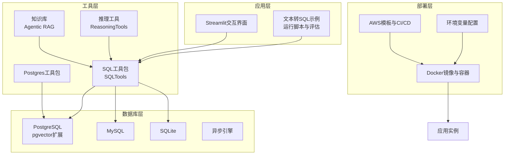
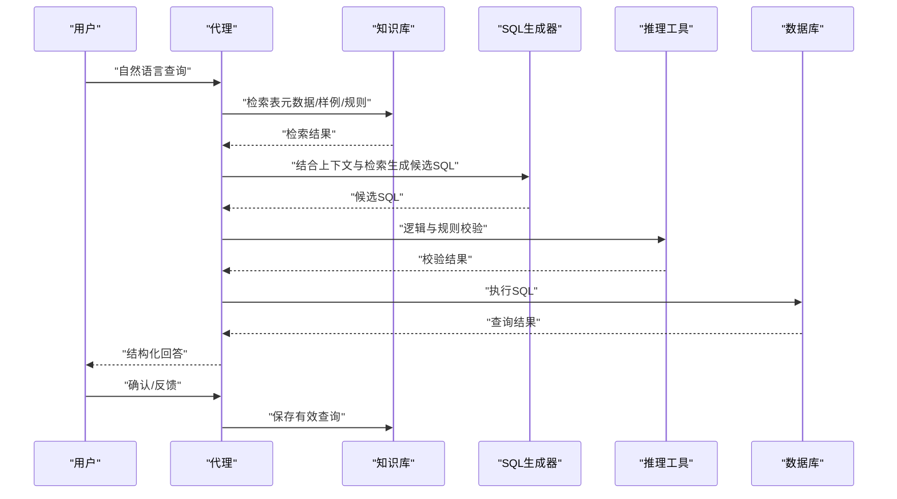
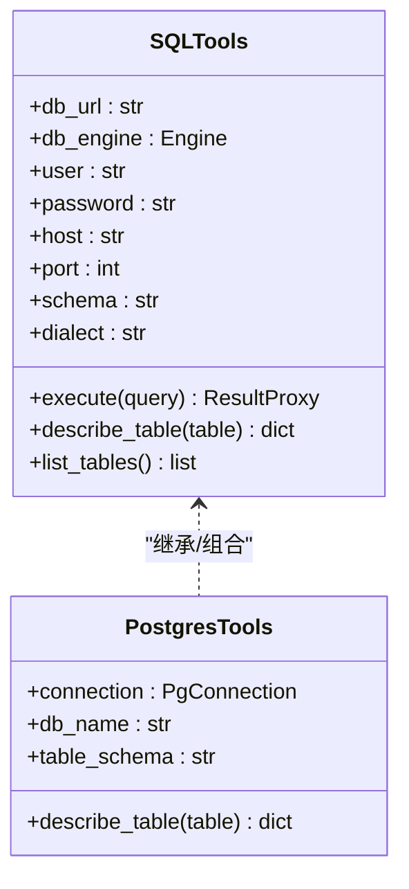
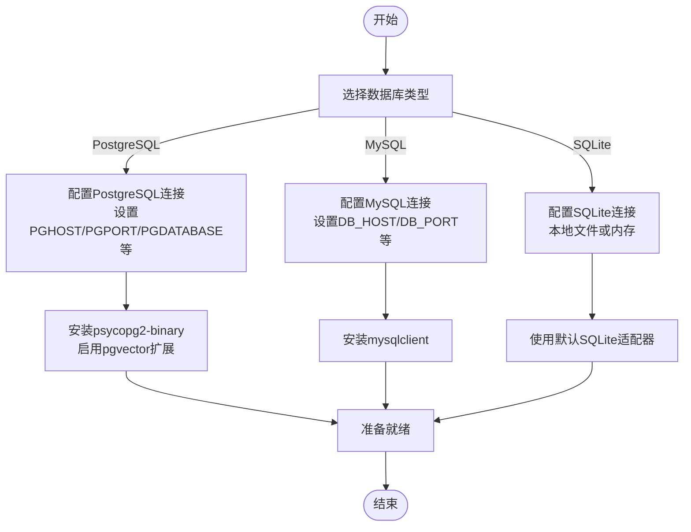
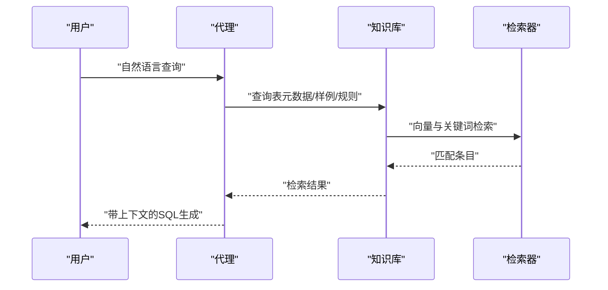
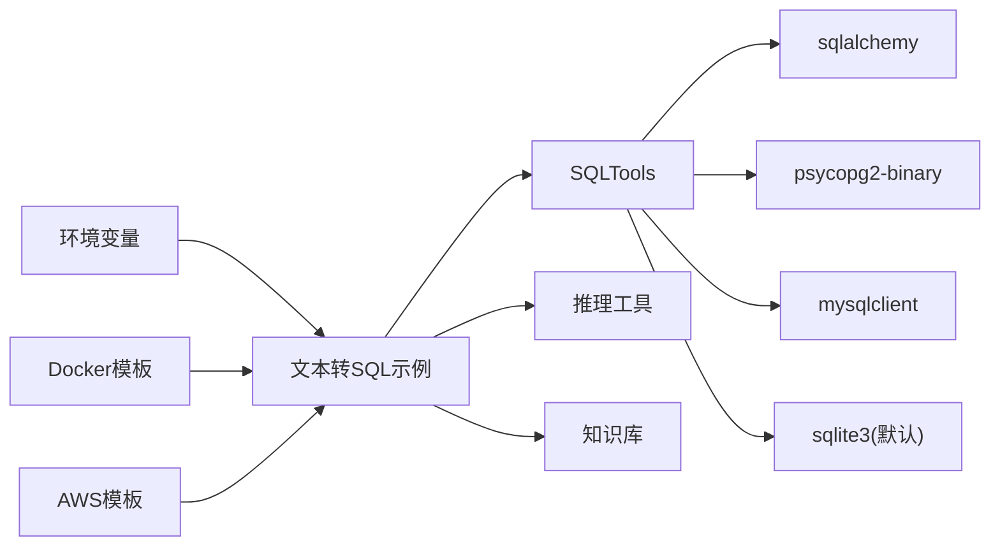

# 文本转SQL代理

<cite>
**本文引用的文件**
- [text-to-sql.mdx](file://production/applications/text-to-sql.mdx)
- [sql.mdx](file://tools/toolkits/database/sql.mdx)
- [postgres.mdx](file://tools/toolkits/database/postgres.mdx)
- [text-to-sql.mdx](file://cookbook/streamlit/text-to-sql.mdx)
- [postgres-params.mdx](file://database/providers/postgres/db-postgres-params.mdx)
- [async-postgres-params.mdx](file://database/providers/async-postgres/db-async-postgres-params.mdx)
- [mysql-params.mdx](file://database/providers/mysql/db-mysql-params.mdx)
- [async-mysql-params.mdx](file://database/providers/async-mysql/db-async-mysql-params.mdx)
- [sqlite-params.mdx](file://database/providers/sqlite/db-sqlite-params.mdx)
- [async-sqlite-params.mdx](file://database/providers/async-sqlite/db-async-sqlite-params.mdx)
- [env-vars.mdx](file://production/templates/customize-aws/env-vars.mdx)
- [deploy.mdx](file://deploy/templates/docker/deploy.mdx)
- [configure.mdx](file://deploy/templates/aws/configure/overview.mdx)
- [deploy.mdx](file://deploy/templates/aws/deploy.mdx)
</cite>

## 目录
1. [简介](#简介)
2. [项目结构](#项目结构)
3. [核心组件](#核心组件)
4. [架构总览](#架构总览)
5. [详细组件分析](#详细组件分析)
6. [依赖关系分析](#依赖关系分析)
7. [性能考虑](#性能考虑)
8. [故障排除指南](#故障排除指南)
9. [结论](#结论)
10. [附录](#附录)

## 简介
本技术文档面向“文本转SQL代理”应用，系统性阐述其如何将自然语言查询转换为SQL语句，覆盖数据库连接配置、SQL工具集成、查询优化策略、部署与配置参数、使用示例、内部架构（自然语言理解、SQL生成算法、数据库交互）、性能优化建议以及常见问题排查。该代理基于知识库驱动的查询生成与自学习回路，结合向量检索与推理工具，实现对复杂自然语言到结构化SQL的稳健转换。

## 项目结构
文本转SQL代理的核心能力由以下模块协同实现：
- 应用层：生产级示例与运行脚本，展示从自然语言到SQL执行的完整流程
- 工具层：SQL工具包与数据库适配器，提供统一的数据库连接与查询执行接口
- 数据库层：支持PostgreSQL、MySQL、SQLite等异步/同步数据库，可选pgvector扩展
- 部署层：Docker与AWS模板，提供环境变量管理、数据库迁移与安全配置

**图表来源**
- [text-to-sql.mdx:1-260](file://production/applications/text-to-sql.mdx#L1-L260)
- [sql.mdx:1-76](file://tools/toolkits/database/sql.mdx#L1-L76)
- [postgres.mdx:59-71](file://tools/toolkits/database/postgres.mdx#L59-L71)
- [text-to-sql.mdx:1-33](file://cookbook/streamlit/text-to-sql.mdx#L1-L33)

**章节来源**
- [text-to-sql.mdx:1-260](file://production/applications/text-to-sql.mdx#L1-L260)
- [sql.mdx:1-76](file://tools/toolkits/database/sql.mdx#L1-L76)
- [postgres.mdx:59-71](file://tools/toolkits/database/postgres.mdx#L59-L71)
- [text-to-sql.mdx:1-33](file://cookbook/streamlit/text-to-sql.mdx#L1-L33)

## 核心组件
- SQL工具包（SQLTools）：封装数据库连接、查询执行与结果处理，支持多种数据库方言与适配器
- 推理工具（ReasoningTools）：在SQL生成前后提供逻辑校验与规则约束
- 知识库（Agentic RAG）：存储表元数据、样本查询与规则，用于检索增强的查询生成
- 数据库适配器：PostgreSQL（含pgvector）、MySQL、SQLite（同步/异步），通过URL或连接对象配置
- 部署与环境：Docker与AWS模板，支持环境变量注入、数据库迁移与安全配置

**章节来源**
- [sql.mdx:1-76](file://tools/toolkits/database/sql.mdx#L1-L76)
- [postgres.mdx:59-71](file://tools/toolkits/database/postgres.mdx#L59-L71)
- [text-to-sql.mdx:142-165](file://production/applications/text-to-sql.mdx#L142-L165)

## 架构总览
文本转SQL代理采用“知识驱动+工具编排”的架构模式：
- 自然语言输入经由系统提示词与历史上下文参与，结合知识库检索得到表元数据与样例
- SQL生成器根据语义模型与检索结果构造候选SQL，推理工具进行合理性检查
- 执行阶段调用SQL工具包连接目标数据库，执行并返回结果
- 用户验证后，有效查询被保存至知识库，形成自学习闭环

**图表来源**
- [text-to-sql.mdx:142-165](file://production/applications/text-to-sql.mdx#L142-L165)
- [sql.mdx:1-76](file://tools/toolkits/database/sql.mdx#L1-L76)

## 详细组件分析

### 组件A：SQL工具包（SQLTools）
- 职责：统一数据库连接、SQL执行、结果解析与错误处理
- 关键参数：db_url、db_engine、user、password、host、port、schema、dialect
- 支持数据库：PostgreSQL（psycopg2-binary）、MySQL（mysqlclient）、SQLite（默认）
- 异步支持：PostgreSQL/MySQL/SQLite均提供异步适配器

**图表来源**
- [sql.mdx:67-76](file://tools/toolkits/database/sql.mdx#L67-L76)
- [postgres.mdx:59-71](file://tools/toolkits/database/postgres.mdx#L59-L71)

**章节来源**
- [sql.mdx:1-76](file://tools/toolkits/database/sql.mdx#L1-L76)
- [postgres.mdx:59-71](file://tools/toolkits/database/postgres.mdx#L59-L71)

### 组件B：数据库连接与配置
- PostgreSQL：推荐使用pgvector扩展；支持同步与异步引擎
- MySQL：需安装mysqlclient适配器；提供同步与异步示例
- SQLite：提供同步与异步参数配置
- 环境变量：通过模板注入数据库主机、端口、用户、密码与数据库名

**图表来源**
- [postgres-params.mdx](file://database/providers/postgres/db-postgres-params.mdx)
- [async-postgres-params.mdx](file://database/providers/async-postgres/db-async-postgres-params.mdx)
- [mysql-params.mdx](file://database/providers/mysql/db-mysql-params.mdx)
- [async-mysql-params.mdx](file://database/providers/async-mysql/db-async-mysql-params.mdx)
- [sqlite-params.mdx](file://database/providers/sqlite/db-sqlite-params.mdx)
- [async-sqlite-params.mdx](file://database/providers/async-sqlite/db-async-sqlite-params.mdx)
- [env-vars.mdx:1-51](file://production/templates/customize-aws/env-vars.mdx#L1-L51)

**章节来源**
- [postgres-params.mdx](file://database/providers/postgres/db-postgres-params.mdx)
- [async-postgres-params.mdx](file://database/providers/async-postgres/db-async-postgres-params.mdx)
- [mysql-params.mdx](file://database/providers/mysql/db-mysql-params.mdx)
- [async-mysql-params.mdx](file://database/providers/async-mysql/db-async-mysql-params.mdx)
- [sqlite-params.mdx](file://database/providers/sqlite/db-sqlite-params.mdx)
- [async-sqlite-params.mdx](file://database/providers/async-sqlite/db-async-sqlite-params.mdx)
- [env-vars.mdx:1-51](file://production/templates/customize-aws/env-vars.mdx#L1-L51)

### 组件C：知识库与检索增强
- 知识库内容：表元数据、样本查询、数据质量规则、命名约定
- 检索策略：基于向量相似度与关键词的混合检索，提升相关性
- 自学习循环：用户验证后，有效查询与改进建议写入知识库，迭代优化

**图表来源**
- [text-to-sql.mdx:1-260](file://production/applications/text-to-sql.mdx#L1-L260)

**章节来源**
- [text-to-sql.mdx:1-260](file://production/applications/text-to-sql.mdx#L1-L260)

### 组件D：推理与规则校验
- 在SQL生成前后引入推理工具，确保语法正确性、字段一致性与业务规则
- 动态few-shot示例与规则帮助生成更稳健的SQL

**章节来源**
- [text-to-sql.mdx:142-165](file://production/applications/text-to-sql.mdx#L142-L165)

## 依赖关系分析
- 工具依赖：SQLTools依赖sqlalchemy与具体数据库适配器（如psycopg2-binary、mysqlclient）
- 运行时依赖：PostgreSQL容器（可选pgvector）、OpenAI API密钥
- 部署依赖：Docker镜像构建、AWS资源模板、环境变量与数据库迁移脚本

**图表来源**
- [sql.mdx:14-35](file://tools/toolkits/database/sql.mdx#L14-L35)
- [text-to-sql.mdx:28-32](file://production/applications/text-to-sql.mdx#L28-L32)
- [deploy.mdx:100-111](file://deploy/templates/docker/deploy.mdx#L100-L111)
- [configure.mdx:40-74](file://deploy/templates/aws/configure/overview.mdx#L40-L74)

**章节来源**
- [sql.mdx:14-35](file://tools/toolkits/database/sql.mdx#L14-L35)
- [text-to-sql.mdx:28-32](file://production/applications/text-to-sql.mdx#L28-L32)
- [deploy.mdx:100-111](file://deploy/templates/docker/deploy.mdx#L100-L111)
- [configure.mdx:40-74](file://deploy/templates/aws/configure/overview.mdx#L40-L74)

## 性能考虑
- 查询优化
  - 使用向量化检索加速表元数据与样例查询
  - 对复杂查询分步执行，避免一次性大结果集
  - 合理使用LIMIT与索引提示，减少扫描范围
- 连接与并发
  - 复用数据库连接池，控制最大连接数与超时时间
  - 异步引擎用于高并发场景，降低I/O阻塞
- 缓存与重用
  - 将常用查询与结果缓存于知识库，减少重复计算
  - 利用推理工具的规则缓存，快速校验相似结构
- 数据库选择
  - 大规模结构化数据优先选用PostgreSQL+pgvector
  - 小型或原型场景可使用SQLite，注意并发限制

[本节为通用性能建议，不直接分析特定文件，故无“章节来源”]

## 故障排除指南
- 数据库连接失败
  - 检查环境变量是否正确注入（主机、端口、用户、密码、数据库名）
  - 确认容器已启动且端口映射正确
- 适配器安装问题
  - PostgreSQL：确认psycopg2-binary版本与Python兼容
  - MySQL：确认mysqlclient安装与系统依赖满足要求
- 权限与迁移
  - 生产环境需在启动时执行数据库迁移（Alembic）
  - AWS模板中可通过CI/CD自动化执行
- 常见错误定位
  - 查看Docker日志与容器健康状态
  - 在AWS模板中检查ECR登录状态与RDS可用性

**章节来源**
- [env-vars.mdx:1-51](file://production/templates/customize-aws/env-vars.mdx#L1-L51)
- [deploy.mdx:100-111](file://deploy/templates/docker/deploy.mdx#L100-L111)
- [configure.mdx:40-74](file://deploy/templates/aws/configure/overview.mdx#L40-L74)
- [deploy.mdx:296-342](file://deploy/templates/aws/deploy.mdx#L296-L342)

## 结论
文本转SQL代理通过“知识驱动+工具编排+自学习回路”的设计，实现了从自然语言到SQL的稳健转换。依托SQL工具包与多数据库适配器，结合推理与规则校验，代理能够在不同规模与类型的数据库上稳定运行。配合完善的部署模板与环境变量管理，可快速完成本地开发到云端生产的落地。

[本节为总结性内容，不直接分析特定文件，故无“章节来源”]

## 附录

### 部署步骤与配置参数
- 本地开发
  - 创建虚拟环境并安装依赖
  - 设置OpenAI API密钥与数据库连接
  - 启动PostgreSQL（可选pgvector）容器
  - 运行示例脚本与评估
- 云端部署
  - 使用Docker模板构建镜像并推送
  - 使用AWS模板配置环境变量与数据库迁移
  - 通过CI/CD自动化构建与发布

**章节来源**
- [text-to-sql.mdx:33-96](file://production/applications/text-to-sql.mdx#L33-L96)
- [deploy.mdx:100-111](file://deploy/templates/docker/deploy.mdx#L100-L111)
- [configure.mdx:40-74](file://deploy/templates/aws/configure/overview.mdx#L40-L74)
- [deploy.mdx:296-342](file://deploy/templates/aws/deploy.mdx#L296-L342)

### 使用示例
- 基础查询：聚合、过滤与表发现
- 自学习循环：保存有效查询以改进未来响应
- 边界情况：复杂查询与错误处理测试
- 准确性评估：自动化测试脚本

**章节来源**
- [text-to-sql.mdx:100-141](file://production/applications/text-to-sql.mdx#L100-L141)

### 扩展与自定义SQL工具开发
- 新增数据库适配器：遵循SQLTools接口规范，提供连接与执行实现
- 自定义检索器：扩展知识库检索策略，支持更多语义与结构化特征
- 规则引擎：将业务规则与字段约束抽象为可配置规则集，供推理工具调用

[本节为概念性指导，不直接分析特定文件，故无“章节来源”]