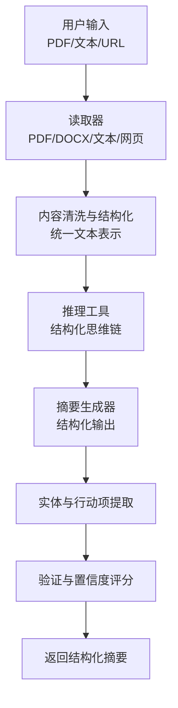
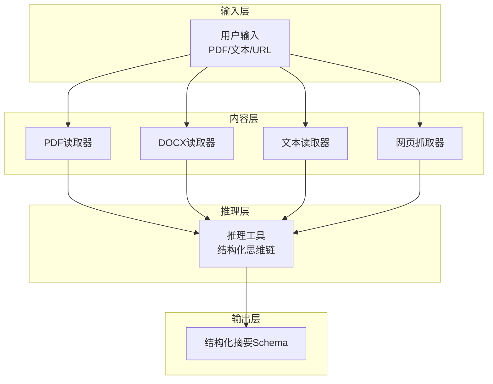
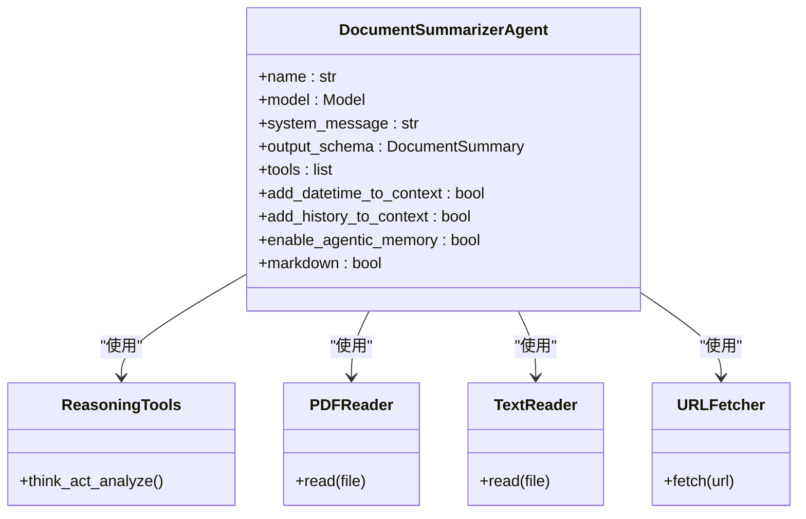
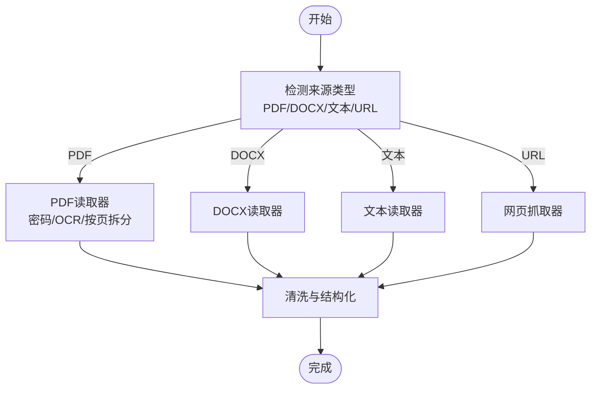
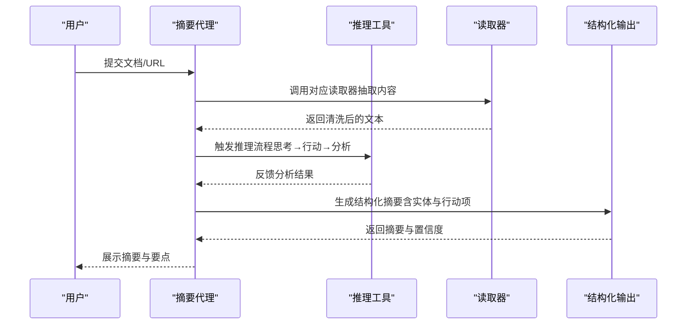
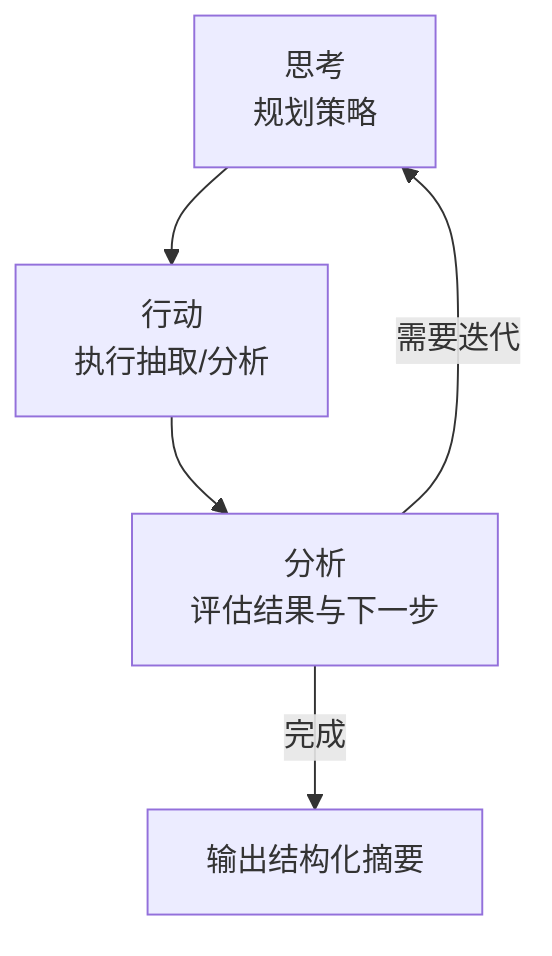
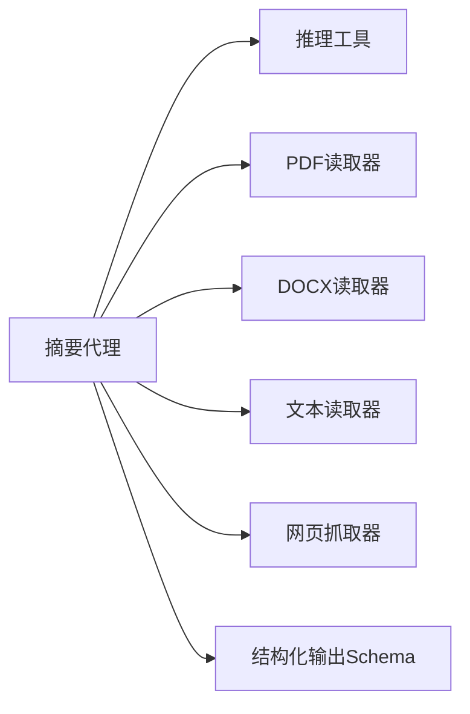

# 文档摘要代理

<cite>
**本文引用的文件**
- [document-summarizer.mdx](file://production/applications/document-summarizer.mdx)
- [reasoning.mdx](file://tools/toolkits/others/reasoning.mdx)
- [reasoning-tools.mdx](file://examples/reasoning/tools/reasoning-tools.mdx)
- [reasoning-agent.mdx](file://reasoning/overview.mdx)
- [pdf-reader-reference.mdx](file://reference/knowledge/reader/pdf.mdx)
- [docx-reader-reference.mdx](file://reference/knowledge/reader/docx.mdx)
- [text-reader-reference.mdx](file://reference/knowledge/reader/text.mdx)
- [pdf-reader-reference.mdx](file://reference/knowledge/reader/pdf.mdx)
- [pdf-reader-reference.mdx](file://reference/knowledge/reader/pdf.mdx)
- [pdf-reader-reference.mdx](file://reference/knowledge/reader/pdf.mdx)
- [pdf-reader-reference.mdx](file://reference/knowledge/reader/pdf.mdx)
- [pdf-reader-reference.mdx](file://reference/knowledge/reader/pdf.mdx)
- [pdf-reader-reference.mdx](file://reference/knowledge/reader/pdf.mdx)
- [pdf-reader-reference.mdx](file://reference/knowledge/reader/pdf.mdx)
- [pdf-reader-reference.mdx](file://reference/knowledge/reader/pdf.mdx)
- [pdf-reader-reference.mdx](file://reference/knowledge/reader/pdf.mdx)
- [pdf-reader-reference.mdx](file://reference/knowledge/reader/pdf.mdx)
- [pdf-reader-reference.mdx](file://reference/knowledge/reader/pdf.mdx)
- [pdf-reader-reference.mdx](file://reference/knowledge/reader/pdf.mdx)
- [pdf-reader-reference.mdx](file://reference/knowledge/reader/pdf.mdx)
- [pdf-reader-reference.mdx](file://reference/knowledge/reader/pdf.mdx)
- [pdf-reader-reference.mdx](file://reference/knowledge/reader/pdf.mdx)
- [pdf-reader-reference.mdx](file://reference/knowledge/reader/pdf.mdx)
- [pdf-reader-reference.mdx](file://reference/knowledge/reader/pdf.mdx)
- [pdf-reader-reference.mdx](file://reference/knowledge/reader/pdf.mdx)
- [pdf-reader-reference.mdx](file://reference/knowledge/reader/pdf.mdx)
- [pdf-reader-reference.mdx](file://reference/knowledge/reader/pdf.mdx)
- [pdf-reader-reference.mdx](file://reference/knowledge/reader/pdf.mdx)
- [pdf-reader-reference.mdx](file://reference/knowledge/reader/pdf.mdx)
- [pdf-reader-reference.mdx](file://reference/knowledge/reader/pdf.mdx)
- [pdf-reader-reference.mdx](file://reference/knowledge/reader/pdf.mdx)
- [pdf-reader-reference.mdx](file://reference/knowledge/reader/pdf.mdx)
- [pdf-reader-reference.mdx](file://reference/knowledge/reader/pdf.mdx)
- [pdf-reader-reference.mdx](file://reference/knowledge/reader/pdf.m......)
</cite>

## 目录
1. [简介](#简介)
2. [项目结构](#项目结构)
3. [核心组件](#核心组件)
4. [架构总览](#架构总览)
5. [详细组件分析](#详细组件分析)
6. [依赖关系分析](#依赖关系分析)
7. [性能考虑](#性能考虑)
8. [故障排查指南](#故障排查指南)
9. [结论](#结论)
10. [附录](#附录)

## 简介
本技术文档围绕“文档摘要代理”展开，系统阐述其如何自动提取文档关键信息并生成结构化摘要。内容涵盖文档解析、内容理解与摘要算法、部署步骤、配置参数、文件处理能力、内部架构（文档格式支持、内容提取策略、摘要生成机制）、性能优化建议、多语言文档处理方法、以及扩展与自定义摘要模板开发指导。目标是帮助读者从概念到实践全面掌握该代理的设计与使用。

## 项目结构
- 应用示例与部署：在生产应用页面中提供了“文档摘要代理”的完整使用流程，包括环境准备、安装依赖、运行示例与故障排查。
- 工具与推理：推理工具与推理代理为摘要过程提供“先思考再行动”的结构化思维链，提升复杂文档的理解与摘要质量。
- 读取器与内容抽取：PDF、DOCX、文本等读取器用于从不同来源抽取原始内容；网页抓取工具可辅助网络内容抽取。
- 输出模型：通过结构化输出模式（Pydantic）确保摘要字段一致、可验证且便于后续处理。

**章节来源**
- [document-summarizer.mdx:1-184](file://production/applications/document-summarizer.mdx#L1-L184)

## 核心组件
- 代理配置与工具集
  - 模型：使用具备推理能力的响应模型以支撑复杂理解任务。
  - 工具：包含推理工具、PDF/文本读取器、URL抓取工具，形成“先规划后执行”的工作流。
  - 上下文增强：启用时间、历史会话、记忆与Markdown输出，提升摘要可读性与一致性。
- 结构化输出
  - 使用Pydantic模型定义摘要字段，确保输出稳定、可验证，并支持后续处理与存储。
- 文档类型识别
  - 基于常见特征对报告、文章、会议纪要、论文、邮件等进行分类，辅助摘要策略选择。

**章节来源**
- [document-summarizer.mdx:99-127](file://production/applications/document-summarizer.mdx#L99-L127)
- [document-summarizer.mdx:141-153](file://production/applications/document-summarizer.mdx#L141-L153)
- [document-summarizer.mdx:155-164](file://production/applications/document-summarizer.mdx#L155-L164)

## 架构总览
文档摘要代理采用“工具驱动 + 结构化输出”的分层架构：
- 输入层：支持PDF、DOCX、TXT、MD与URL等多种来源。
- 内容层：通过读取器抽取文本，进行清洗与结构化处理。
- 推理层：利用推理工具进行计划、分析与迭代，提升摘要质量。
- 输出层：以结构化模式返回摘要、要点、实体、行动项、词数与置信度。

**图表来源**
- [document-summarizer.mdx:105-110](file://production/applications/document-summarizer.mdx#L105-L110)
- [reasoning.mdx:1-27](file://tools/toolkits/others/reasoning.mdx#L1-L27)

**章节来源**
- [document-summarizer.mdx:128-139](file://production/applications/document-summarizer.mdx#L128-L139)

## 详细组件分析

### 组件A：代理与工具配置
- 代理名称、模型与系统消息：明确角色与职责，确保行为一致性。
- 工具集合：推理工具用于规划与反思；PDF/文本读取器负责内容抽取；URL抓取器用于网页内容获取。
- 上下文增强：启用时间、历史、记忆与Markdown输出，提升摘要可读性与可追溯性。

**图表来源**
- [document-summarizer.mdx:100-116](file://production/applications/document-summarizer.mdx#L100-L116)
- [reasoning.mdx:10-25](file://tools/toolkits/others/reasoning.mdx#L10-L25)

**章节来源**
- [document-summarizer.mdx:99-127](file://production/applications/document-summarizer.mdx#L99-L127)

### 组件B：内容抽取与预处理
- PDF读取器：支持密码、图像OCR、按页拆分等选项，满足不同PDF场景。
- DOCX读取器：从Word文档中抽取文本。
- 文本读取器：处理TXT与MD文件。
- 网页抓取器：基于静态HTML解析，适合无JS渲染的页面；对JavaScript重度页面需结合其他方案。

**图表来源**
- [pdf-reader-reference.mdx:1-8](file://reference/knowledge/reader/pdf.mdx#L1-L8)
- [docx-reader-reference.mdx:1-8](file://reference/knowledge/reader/docx.mdx#L1-L8)
- [text-reader-reference.mdx:1-8](file://reference/knowledge/reader/text.mdx#L1-L8)

**章节来源**
- [pdf-reader-reference.mdx:1-8](file://reference/knowledge/reader/pdf.mdx#L1-L8)
- [docx-reader-reference.mdx:1-8](file://reference/knowledge/reader/docx.mdx#L1-L8)
- [text-reader-reference.mdx:1-8](file://reference/knowledge/reader/text.mdx#L1-L8)

### 组件C：摘要生成与结构化输出
- 输出Schema：标题、文档类型、摘要正文、关键要点、实体列表、行动项、词数、置信度。
- 文档类型识别：基于典型特征对报告、文章、会议纪要、论文、邮件进行分类，指导摘要策略。
- 置信度评分：用于评估摘要质量，低分时提示人工复核或补充上下文。

**图表来源**
- [document-summarizer.mdx:141-153](file://production/applications/document-summarizer.mdx#L141-L153)
- [document-summarizer.mdx:155-164](file://production/applications/document-summarizer.mdx#L155-L164)

**章节来源**
- [document-summarizer.mdx:141-153](file://production/applications/document-summarizer.mdx#L141-L153)
- [document-summarizer.mdx:155-164](file://production/applications/document-summarizer.mdx#L155-L164)

### 组件D：推理工具与思维链
- 结构化思维链：通过“思考→行动→分析”的循环，提升复杂问题的处理能力。
- 适用场景：文档解析、实体识别、行动项提取、摘要策略制定等。

**图表来源**
- [reasoning.mdx:238-253](file://tools/toolkits/others/reasoning.mdx#L238-L253)
- [reasoning-agent.mdx:153-184](file://reasoning/overview.mdx#L153-L184)

**章节来源**
- [reasoning.mdx:238-253](file://tools/toolkits/others/reasoning.mdx#L238-L253)
- [reasoning-agent.mdx:153-184](file://reasoning/overview.mdx#L153-L184)

## 依赖关系分析
- 代理依赖推理工具与多种读取器，形成“工具组合”的能力矩阵。
- 输出依赖结构化Schema，保证跨模块的一致性与可验证性。
- 配置参数影响上下文丰富度与输出风格（如Markdown开关）。

**图表来源**
- [document-summarizer.mdx:105-116](file://production/applications/document-summarizer.mdx#L105-L116)
- [document-summarizer.mdx:141-153](file://production/applications/document-summarizer.mdx#L141-L153)

**章节来源**
- [document-summarizer.mdx:105-116](file://production/applications/document-summarizer.mdx#L105-L116)
- [document-summarizer.mdx:141-153](file://production/applications/document-summarizer.mdx#L141-L153)

## 性能考虑
- 批量处理：对多文档场景，优先采用异步读取与批量处理，减少I/O等待。
- 分块策略：对长文档采用分块处理，避免单次请求超限；结合语义分块保持上下文连贯。
- 缓存与记忆：启用代理记忆与上下文缓存，降低重复计算成本。
- 模型选择：根据任务复杂度选择合适模型，兼顾速度与准确性。
- 置信度阈值：对低置信度输出进行二次校验或人工干预，避免错误传播。

## 故障排查指南
- PDF抽取为空
  - 原因：扫描版PDF（图像PDF）未启用OCR或不支持。
  - 处理：改用具备视觉能力的代理或先进行OCR处理。
- 网页内容不完整
  - 原因：JavaScript渲染导致静态解析缺失。
  - 处理：结合动态抓取工具或预渲染方案。
- 置信度低
  - 原因：文档质量差、内容模糊或上下文不足。
  - 处理：人工复核并补充背景信息，必要时调整摘要策略。

**章节来源**
- [document-summarizer.mdx:165-177](file://production/applications/document-summarizer.mdx#L165-L177)

## 结论
文档摘要代理通过“工具驱动 + 结构化输出 + 推理思维链”的设计，在多源文档（PDF、DOCX、文本、URL）上实现了高质量、可验证的摘要生成。配合实体与行动项提取、文档类型识别与置信度评分，能够满足企业知识管理与智能检索的实际需求。通过合理的性能优化与扩展策略，可进一步提升吞吐量与适应性。

## 附录

### 部署与运行步骤
- 克隆仓库、创建虚拟环境、安装依赖、设置API密钥后即可运行示例脚本。
- 支持基础摘要、实体抽取与批量处理三种典型用法。

**章节来源**
- [document-summarizer.mdx:23-59](file://production/applications/document-summarizer.mdx#L23-L59)
- [document-summarizer.mdx:61-96](file://production/applications/document-summarizer.mdx#L61-L96)

### 配置参数速览
- 模型：用于文档理解与摘要生成。
- 输出Schema：统一摘要字段与数据结构。
- 工具：推理工具、PDF/文本读取器、URL抓取器。
- 上下文增强：时间、历史、记忆与Markdown输出。

**章节来源**
- [document-summarizer.mdx:99-127](file://production/applications/document-summarizer.mdx#L99-L127)

### 多语言文档处理建议
- 网页抓取：使用语言过滤参数，限定目标语言，提高抽取精度。
- 文本编码：针对非UTF-8编码的文本文件，显式指定编码以避免乱码。
- OCR与图像PDF：对扫描版PDF启用OCR，确保文字可被正确抽取与理解。

**章节来源**
- [examples/tools/trafilatura-tools.mdx:200-221](file://examples/tools/trafilatura-tools.mdx#L200-L221)
- [knowledge/concepts/readers/overview.mdx:107-111](file://knowledge/concepts/readers/overview.mdx#L107-L111)

### 扩展与自定义摘要模板开发
- 自定义Schema：基于现有结构化输出Schema扩展字段（如主题标签、优先级映射等），确保与下游系统兼容。
- 自定义指令：为不同业务场景编写领域化的系统消息与提示词，引导模型聚焦关键信息。
- 自定义工具：引入新的读取器或抽取工具，覆盖特定格式或来源。
- 自定义推理策略：在推理工具基础上增加条件分支与策略选择逻辑，适配复杂文档类型。

**章节来源**
- [document-summarizer.mdx:141-153](file://production/applications/document-summarizer.mdx#L141-L153)
- [reasoning.mdx:10-25](file://tools/toolkits/others/reasoning.mdx#L10-L25)