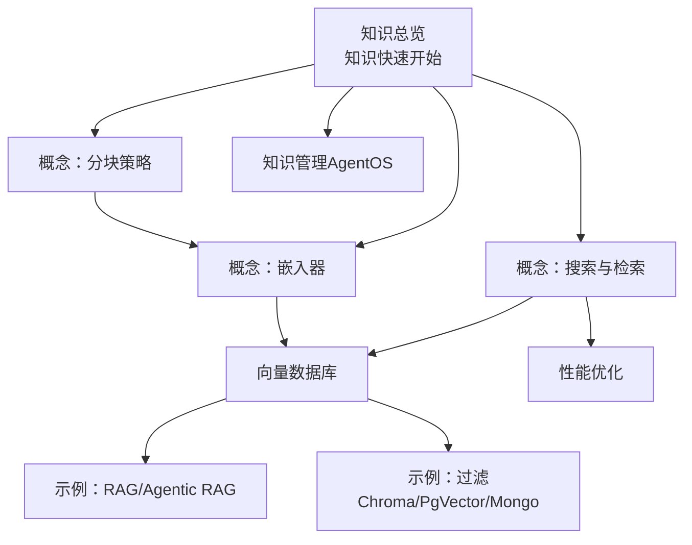
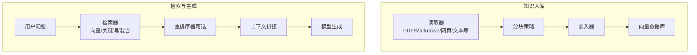
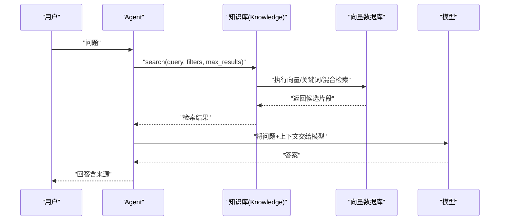
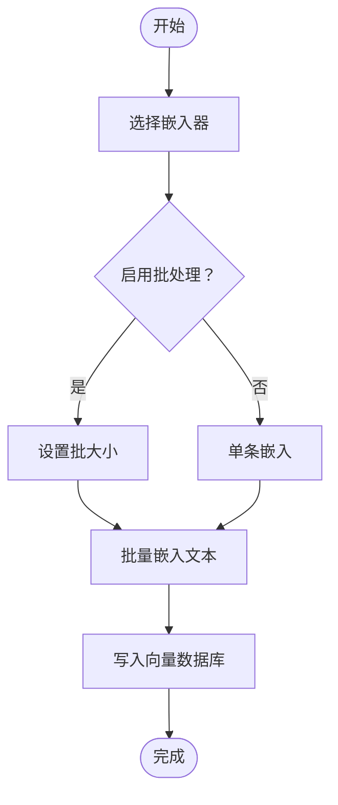
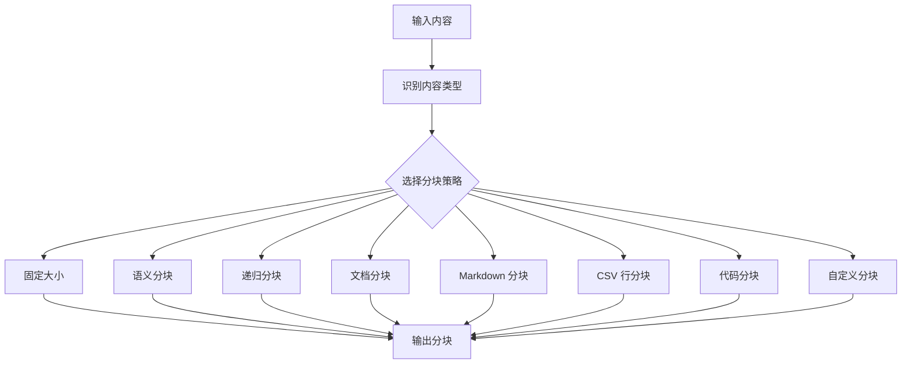
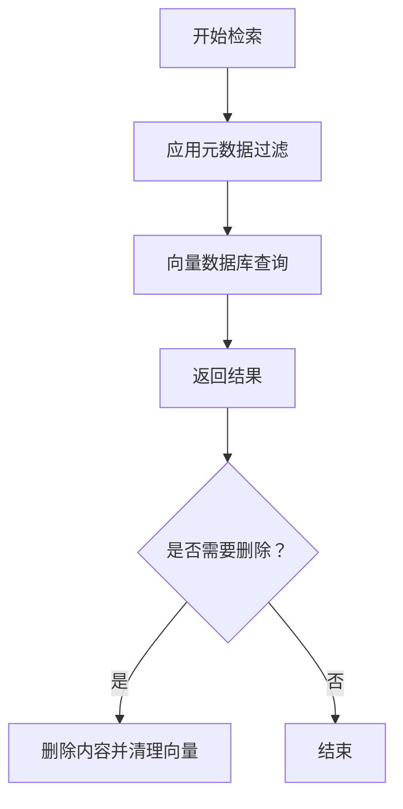
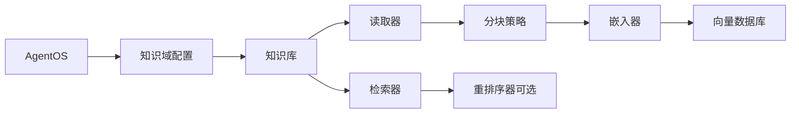

# 知识代理

<cite>
**本文引用的文件**
- [知识总览](file://knowledge/overview.mdx)
- [知识快速开始](file://knowledge/quickstart.mdx)
- [知识概念：搜索与检索](file://knowledge/concepts/search-and-retrieval/overview.mdx)
- [知识概念：嵌入器](file://knowledge/concepts/embedder/overview.mdx)
- [知识概念：分块策略](file://knowledge/concepts/chunking/overview.mdx)
- [知识术语](file://knowledge/terminology.mdx)
- [知识管理（AgentOS）](file://agent-os/features/knowledge-management.mdx)
- [知识概念：性能优化](file://knowledge/concepts/performance-tips.mdx)
- [知识示例：RAG（Sentence Transformers）](file://knowledge/agents/rag-sentence-transformer.mdx)
- [知识示例：Streamlit Agentic RAG](file://cookbook/streamlit/agentic-rag.mdx)
- [知识示例：向量数据库（LlamaIndex）](file://examples/knowledge/vector-db/llamaindex-db/llamaindex-db.mdx)
- [知识示例：过滤 ChromaDB](file://examples/knowledge/filters/vector-dbs/filtering-chroma-db.mdx)
- [知识示例：过滤 PgVector](file://examples/knowledge/filters/vector-dbs/filtering-pgvector.mdx)
- [知识示例：过滤 Mongo](file://examples/knowledge/filters/vector-dbs/filtering-mongo-db.mdx)
- [部署介绍](file://deploy/introduction.mdx)
- [Docker 部署模板](file://deploy/templates/docker/deploy.mdx)
- [AgentOS 配置](file://agent-os/config.mdx)
- [AgentOS 额外配置示例](file://agent-os/usage/extra-configuration.mdx)
- [生产环境运行（示例）](file://TBD/snippets/simple-agent-api-production.mdx)
- [知识内容数据库](file://knowledge/concepts/contents-db.mdx)
- [知识参考（API）](file://reference/knowledge/knowledge.mdx)
- [知识示例：快速开始](file://examples/knowledge/quickstart.mdx)
</cite>

## 目录
1. [简介](#简介)
2. [项目结构](#项目结构)
3. [核心组件](#核心组件)
4. [架构总览](#架构总览)
5. [详细组件分析](#详细组件分析)
6. [依赖关系分析](#依赖关系分析)
7. [性能考虑](#性能考虑)
8. [故障排查指南](#故障排查指南)
9. [结论](#结论)
10. [附录](#附录)

## 简介
本技术文档面向“知识代理”应用，系统阐述其如何基于知识库实现智能问答与信息检索。文档覆盖从数据读取、分块与嵌入、向量数据库存储，到检索与重排序、上下文管理与答案生成的完整链路；同时提供部署步骤、配置参数、知识库构建与维护方法，并给出性能优化与扩展实践建议。

## 项目结构
知识代理能力由多个知识概念与示例文档共同构成，围绕“读取-分块-嵌入-向量存储-检索-生成”的流水线组织内容。关键模块包括：
- 知识总览与快速开始：概览知识能力与入门示例
- 搜索与检索：向量/关键词/混合检索与重排序
- 嵌入器：文本向量化与批处理
- 分块策略：多种分块方式与配置
- 向量数据库：支持多种本地/托管向量库
- 过滤与元数据：按元数据筛选与验证
- 性能优化：数据库选择、异步加载、结果重排等
- 示例：RAG、Agentic RAG、过滤示例、LlamaIndex 集成
- 部署：AgentOS 部署、Docker 模板、生产运行

**图表来源**
- [知识总览:1-110](file://knowledge/overview.mdx#L1-L110)
- [知识快速开始:1-129](file://knowledge/quickstart.mdx#L1-L129)
- [知识概念：搜索与检索:1-255](file://knowledge/concepts/search-and-retrieval/overview.mdx#L1-L255)
- [知识概念：嵌入器:1-140](file://knowledge/concepts/embedder/overview.mdx#L1-L140)
- [知识概念：分块策略:1-143](file://knowledge/concepts/chunking/overview.mdx#L1-L143)
- [知识示例：RAG（Sentence Transformers）:1-120](file://knowledge/agents/rag-sentence-transformer.mdx#L1-L120)
- [知识示例：过滤 ChromaDB:1-124](file://examples/knowledge/filters/vector-dbs/filtering-chroma-db.mdx#L1-L124)
- [知识示例：过滤 PgVector:1-109](file://examples/knowledge/filters/vector-dbs/filtering-pgvector.mdx#L1-L109)
- [知识示例：过滤 Mongo:1-108](file://examples/knowledge/filters/vector-dbs/filtering-mongo-db.mdx#L1-L108)
- [知识概念：性能优化:1-226](file://knowledge/concepts/performance-tips.mdx#L1-L226)
- [知识管理（AgentOS）:1-78](file://agent-os/features/knowledge-management.mdx#L1-L78)

**章节来源**
- [知识总览:1-110](file://knowledge/overview.mdx#L1-L110)
- [知识快速开始:1-129](file://knowledge/quickstart.mdx#L1-L129)

## 核心组件
- 知识库（Knowledge）
  - 负责内容读取、分块、嵌入、存储与检索
  - 支持同步/异步批量插入、内容查询与删除
- 向量数据库（Vector DB）
  - 支持多种后端（如 Chroma、PgVector、LanceDB、Weaviate 等）
  - 提供向量相似度搜索、关键词/混合检索与可选重排序
- 嵌入器（Embedder）
  - 将文本转换为向量，支持批处理以提升吞吐
- 分块策略（Chunking）
  - 多种策略（固定大小、语义、递归、文档、Markdown、CSV 行、代码、自定义等）
- 过滤与元数据
  - 按元数据过滤检索结果，支持复杂条件与键校验
- AgentOS 知识管理
  - 提供图形化界面上传、编辑、删除知识条目，跟踪处理状态

**章节来源**
- [知识总览:1-110](file://knowledge/overview.mdx#L1-L110)
- [知识概念：搜索与检索:1-255](file://knowledge/concepts/search-and-retrieval/overview.mdx#L1-L255)
- [知识概念：嵌入器:1-140](file://knowledge/concepts/embedder/overview.mdx#L1-L140)
- [知识概念：分块策略:1-143](file://knowledge/concepts/chunking/overview.mdx#L1-L143)
- [知识管理（AgentOS）:1-78](file://agent-os/features/knowledge-management.mdx#L1-L78)
- [知识内容数据库:78-133](file://knowledge/concepts/contents-db.mdx#L78-L133)

## 架构总览
知识代理采用“读取-分块-嵌入-存储-检索-生成”的流水线式架构。Agent 决定何时检索（Agentic RAG），并将检索到的相关片段注入上下文，结合模型生成答案。

**图表来源**
- [知识总览:29-40](file://knowledge/overview.mdx#L29-L40)
- [知识概念：搜索与检索:10-42](file://knowledge/concepts/search-and-retrieval/overview.mdx#L10-L42)
- [知识概念：嵌入器:24-30](file://knowledge/concepts/embedder/overview.mdx#L24-L30)
- [知识概念：分块策略:7-28](file://knowledge/concepts/chunking/overview.mdx#L7-L28)

## 详细组件分析

### 组件一：知识库（Knowledge）与检索流程
- 入库流程：读取 → 分块 → 嵌入 → 存储
- 查询流程：解析问题 → 执行检索（向量/关键词/混合）→ 可选重排序 → 生成答案
- 支持异步批量插入与多源内容（文件、URL、文本）

**图表来源**
- [知识概念：搜索与检索:10-42](file://knowledge/concepts/search-and-retrieval/overview.mdx#L10-L42)
- [知识快速开始:106-112](file://knowledge/quickstart.mdx#L106-L112)

**章节来源**
- [知识总览:29-40](file://knowledge/overview.mdx#L29-L40)
- [知识概念：搜索与检索:95-130](file://knowledge/concepts/search-and-retrieval/overview.mdx#L95-L130)
- [知识快速开始:106-112](file://knowledge/quickstart.mdx#L106-L112)

### 组件二：嵌入器与向量数据库
- 嵌入器负责将文本转为向量，支持批处理以降低请求次数
- 向量数据库负责存储向量并提供相似度检索，支持多种后端
- 维度匹配与模型切换需注意兼容性（更换模型需重新嵌入）

**图表来源**
- [知识概念：嵌入器:61-88](file://knowledge/concepts/embedder/overview.mdx#L61-L88)
- [知识术语:71-71](file://knowledge/terminology.mdx#L71-L71)

**章节来源**
- [知识概念：嵌入器:32-88](file://knowledge/concepts/embedder/overview.mdx#L32-L88)
- [知识术语:62-68](file://knowledge/terminology.mdx#L62-L68)

### 组件三：分块策略与检索质量
- 不同内容类型选择不同分块策略，影响检索精度与上下文完整性
- 推荐根据内容特征选择：语义分块用于复杂文档，固定大小用于统一内容，Markdown/代码分块尊重结构

**图表来源**
- [知识概念：分块策略:30-60](file://knowledge/concepts/chunking/overview.mdx#L30-L60)
- [知识概念：分块策略:82-94](file://knowledge/concepts/chunking/overview.mdx#L82-L94)

**章节来源**
- [知识概念：分块策略:18-94](file://knowledge/concepts/chunking/overview.mdx#L18-L94)

### 组件四：过滤与元数据
- 通过元数据过滤缩小检索范围，提高速度与准确性
- 支持键校验与复杂条件（AND/OR/比较），并提供内容列表、详情与删除操作

**图表来源**
- [知识概念：搜索与检索:131-154](file://knowledge/concepts/search-and-retrieval/overview.mdx#L131-L154)
- [知识内容数据库:116-133](file://knowledge/concepts/contents-db.mdx#L116-L133)

**章节来源**
- [知识概念：搜索与检索:131-154](file://knowledge/concepts/search-and-retrieval/overview.mdx#L131-L154)
- [知识内容数据库:78-133](file://knowledge/concepts/contents-db.mdx#L78-L133)

### 组件五：AgentOS 知识管理
- 提供图形化界面上传、编辑、删除知识条目
- 支持文件、网页与文本三种来源，自动识别类型并使用对应读取器
- 显示处理状态，便于追踪可用内容

**章节来源**
- [知识管理（AgentOS）:1-78](file://agent-os/features/knowledge-management.mdx#L1-L78)

## 依赖关系分析
- 知识库依赖向量数据库与嵌入器；检索依赖搜索类型（向量/关键词/混合）与可选重排序器
- 分块策略影响嵌入质量与检索效果
- AgentOS 通过配置文件或类注入知识域配置，连接知识库与接口层

**图表来源**
- [AgentOS 配置:93-144](file://agent-os/config.mdx#L93-L144)
- [知识概念：搜索与检索:74-93](file://knowledge/concepts/search-and-retrieval/overview.mdx#L74-L93)
- [知识概念：嵌入器:24-30](file://knowledge/concepts/embedder/overview.mdx#L24-L30)
- [知识概念：分块策略:62-80](file://knowledge/concepts/chunking/overview.mdx#L62-L80)

**章节来源**
- [AgentOS 配置:81-144](file://agent-os/config.mdx#L81-L144)
- [知识概念：搜索与检索:74-93](file://knowledge/concepts/search-and-retrieval/overview.mdx#L74-L93)
- [知识概念：嵌入器:24-30](file://knowledge/concepts/embedder/overview.mdx#L24-L30)
- [知识概念：分块策略:62-80](file://knowledge/concepts/chunking/overview.mdx#L62-L80)

## 性能考虑
- 数据库选择：开发用零配置数据库（如 LanceDB/ChromaDB），生产用 PgVector 或托管服务（如 Pinecone）
- 异步批量：并发加载多源内容，减少等待时间
- 过滤先行：先按元数据过滤再检索，显著降低搜索范围
- 检索策略：混合检索通常最佳；必要时启用重排序器提升排序质量
- 嵌入维度：在性能与精度间权衡，适当降低维度可加速搜索
- 内容加载：跳过已处理文件、限制文件类型、控制批大小，避免内存压力

**章节来源**
- [知识概念：性能优化:11-90](file://knowledge/concepts/performance-tips.mdx#L11-L90)
- [知识概念：性能优化:154-226](file://knowledge/concepts/performance-tips.mdx#L154-L226)

## 故障排查指南
- 结果不相关
  - 检查分块策略与大小，尝试语义分块或增大 max_results
  - 添加元数据过滤缩小范围
- 内容加载慢
  - 使用 skip_if_exists、include/exclude 控制重复处理
  - 切换到固定大小分块或分批处理
- 内存问题
  - 减小批大小、降低分块大小、清理过期内容
- 搜索耗时
  - 记录搜索耗时，定位瓶颈；检查失败内容状态

**章节来源**
- [知识概念：性能优化:108-153](file://knowledge/concepts/performance-tips.mdx#L108-L153)
- [知识内容数据库:194-209](file://knowledge/concepts/contents-db.mdx#L194-L209)

## 结论
知识代理通过“读取-分块-嵌入-存储-检索-生成”的闭环，实现了对特定领域知识的高效检索与答案生成。合理选择嵌入器与向量数据库、优化分块策略与检索配置、配合元数据过滤与异步批量处理，可在保证准确性的同时显著提升性能。借助 AgentOS 的知识管理界面与 API，可便捷地构建、维护与扩展知识库，满足从个人到团队、从开发到生产的多样化需求。

## 附录

### 部署步骤与配置要点
- 选择模板：空白画布或预构建方案
- 添加应用：知识代理、研究代理、文本转 SQL 等
- 连接接口：Slack、Discord、MCP 或自定义 UI
- Docker 部署：准备镜像、设置环境变量、确保数据库启用扩展
- 生产运行：容器镜像构建与推送、云平台部署、密钥与连接字符串安全配置

**章节来源**
- [部署介绍:1-102](file://deploy/introduction.mdx#L1-L102)
- [Docker 部署模板:100-111](file://deploy/templates/docker/deploy.mdx#L100-L111)
- [生产环境运行（示例）:1-35](file://TBD/snippets/simple-agent-api-production.mdx#L1-L35)
- [AgentOS 额外配置示例:1-49](file://agent-os/usage/extra-configuration.mdx#L1-L49)

### 知识库构建与维护
- 构建：选择合适读取器与分块策略，配置嵌入器与向量数据库，批量插入内容
- 维护：定期清理过期内容、更新元数据、监控处理状态与失败项
- 扩展：自定义检索器、接入新知识源、引入重排序器

**章节来源**
- [知识快速开始:106-129](file://knowledge/quickstart.mdx#L106-L129)
- [知识内容数据库:78-133](file://knowledge/concepts/contents-db.mdx#L78-L133)
- [知识示例：过滤 ChromaDB:81-104](file://examples/knowledge/filters/vector-dbs/filtering-chroma-db.mdx#L81-L104)
- [知识示例：过滤 PgVector:83-109](file://examples/knowledge/filters/vector-dbs/filtering-pgvector.mdx#L83-L109)
- [知识示例：过滤 Mongo:85-108](file://examples/knowledge/filters/vector-dbs/filtering-mongo-db.mdx#L85-L108)

### 示例参考路径
- Agentic RAG（Streamlit）：[示例说明:1-44](file://cookbook/streamlit/agentic-rag.mdx#L1-L44)
- RAG（Sentence Transformers）：[示例代码与步骤:63-115](file://knowledge/agents/rag-sentence-transformer.mdx#L63-L115)
- LlamaIndex 集成：[示例代码与运行:67-117](file://examples/knowledge/vector-db/llamaindex-db/llamaindex-db.mdx#L67-L117)
- 快速开始示例：[示例代码与运行:1-50](file://examples/knowledge/quickstart.mdx#L1-L50)