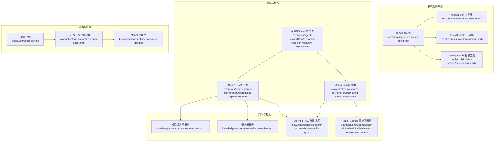
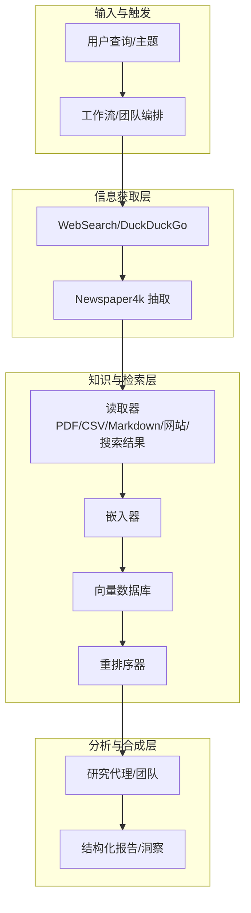
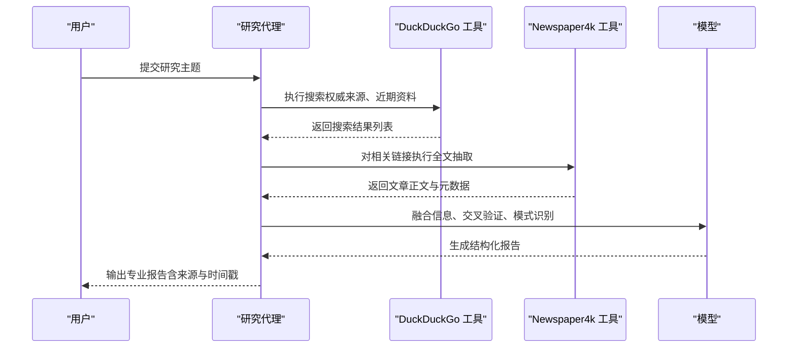
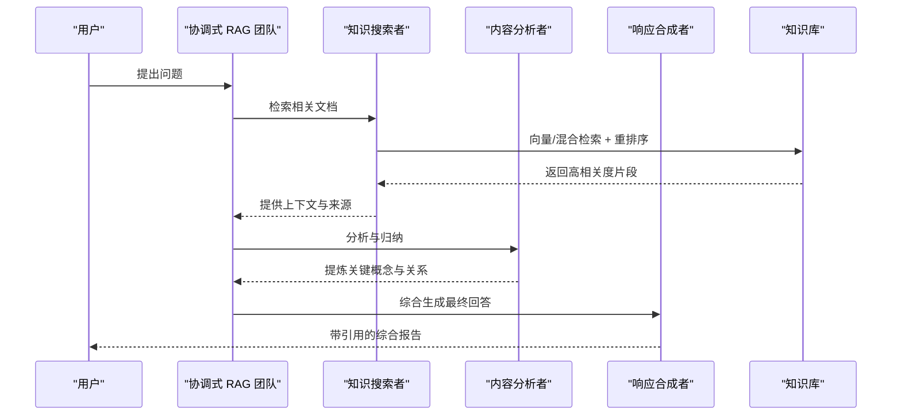
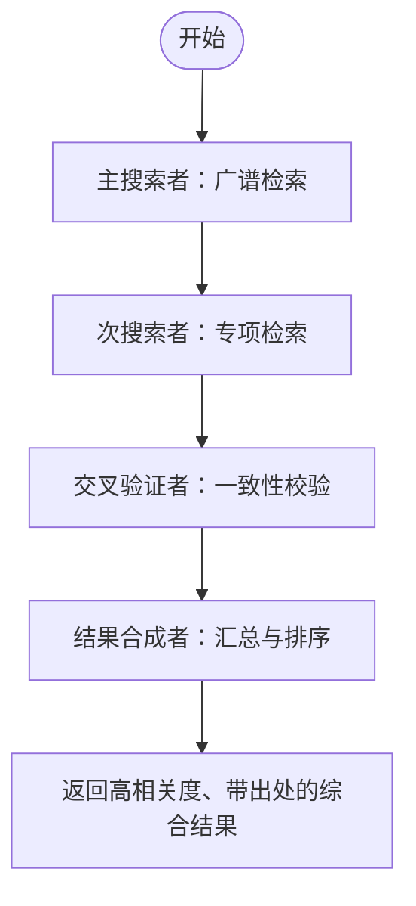
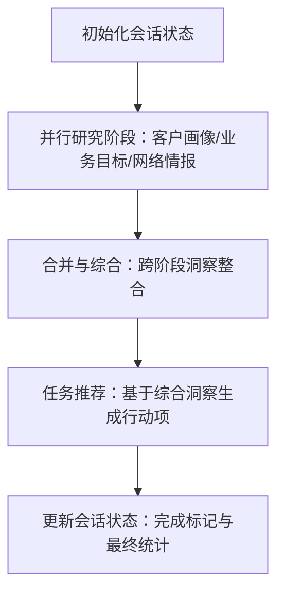
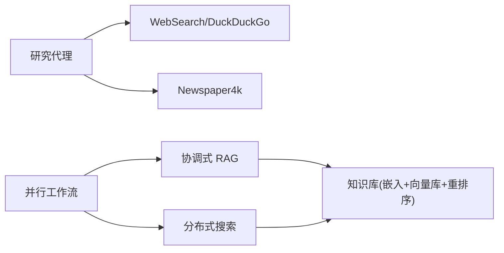

# 研究代理

<cite>
**本文引用的文件**   
- [cookbook/agents/research-agent.mdx](file://cookbook/agents/research-agent.mdx)
- [tools/toolkits/search/duckduckgo.mdx](file://tools/toolkits/search/duckduckgo.mdx)
- [tools/toolkits/web-scrape/newspaper4k.mdx](file://tools/toolkits/web-scrape/newspaper4k.mdx)
- [tools/toolkits/search/websearch.mdx](file://tools/toolkits/search/websearch.mdx)
- [examples/teams/search-coordination/coordinated-agentic-rag.mdx](file://examples/teams/search-coordination/coordinated-agentic-rag.mdx)
- [examples/teams/search-coordination/distributed-infinity-search.mdx](file://examples/teams/search-coordination/distributed-infinity-search.mdx)
- [examples/agent-os/workflow/customer-research-workflow-parallel.mdx](file://examples/agent-os/workflow/customer-research-workflow-parallel.mdx)
- [knowledge/concepts/readers/overview.mdx](file://knowledge/concepts/readers/overview.mdx)
- [knowledge/concepts/embedder/overview.mdx](file://knowledge/concepts/embedder/overview.mdx)
- [knowledge/concepts/search-and-retrieval/agentic-rag.mdx](file://knowledge/concepts/search-and-retrieval/agentic-rag.mdx)
- [examples/knowledge/vector-db/redis-db/redis-db-with-cohere-reranker.mdx](file://examples/knowledge/vector-db/redis-db/redis-db-with-cohere-reranker.mdx)
- [deploy/introduction.mdx](file://deploy/introduction.mdx)
- [production/applications/research-agent.mdx](file://production/applications/research-agent.mdx)
- [knowledge/concepts/performance-tips.mdx](file://knowledge/concepts/performance-tips.mdx)
</cite>

## 目录
1. [简介](#简介)
2. [项目结构](#项目结构)
3. [核心组件](#核心组件)
4. [架构总览](#架构总览)
5. [详细组件分析](#详细组件分析)
6. [依赖关系分析](#依赖关系分析)
7. [性能考量](#性能考量)
8. [故障排查指南](#故障排查指南)
9. [结论](#结论)
10. [附录](#附录)

## 简介
本技术文档围绕“研究代理”应用展开，系统阐述其在网络搜索、信息收集与分析方面的实现方式，涵盖搜索引擎集成（如 DuckDuckGo、WebSearch 多后端）、网页抓取与内容抽取（Newspaper4k）、知识库构建与检索（嵌入、重排序、向量数据库）以及团队协作与工作流编排。文档同时提供部署步骤、配置参数、使用场景、内部架构、性能优化与搜索质量提升方法，并给出扩展与自定义搜索工具的实践指导。

## 项目结构
研究代理相关能力在示例与参考文档中以多种形态呈现：单智能体研究流程、团队协作式 RAG、分布式搜索与重排序、并行工作流与会话状态管理，以及知识读取器、嵌入与重排序等基础设施。下图展示与研究代理直接相关的模块与文档组织关系：

**图表来源**
- [cookbook/agents/research-agent.mdx:1-205](file://cookbook/agents/research-agent.mdx#L1-L205)
- [tools/toolkits/search/websearch.mdx:1-72](file://tools/toolkits/search/websearch.mdx#L1-L72)
- [tools/toolkits/search/duckduckgo.mdx:1-55](file://tools/toolkits/search/duckduckgo.mdx#L1-L55)
- [tools/toolkits/web-scrape/newspaper4k.mdx:1-45](file://tools/toolkits/web-scrape/newspaper4k.mdx#L1-L45)
- [examples/teams/search-coordination/coordinated-agentic-rag.mdx:1-126](file://examples/teams/search-coordination/coordinated-agentic-rag.mdx#L1-L126)
- [examples/teams/search-coordination/distributed-infinity-search.mdx:1-190](file://examples/teams/search-coordination/distributed-infinity-search.mdx#L1-L190)
- [examples/agent-os/workflow/customer-research-workflow-parallel.mdx:1-818](file://examples/agent-os/workflow/customer-research-workflow-parallel.mdx#L1-L818)
- [knowledge/concepts/readers/overview.mdx:1-180](file://knowledge/concepts/readers/overview.mdx#L1-L180)
- [knowledge/concepts/embedder/overview.mdx:1-47](file://knowledge/concepts/embedder/overview.mdx#L1-L47)
- [knowledge/concepts/search-and-retrieval/agentic-rag.mdx:46-84](file://knowledge/concepts/search-and-retrieval/agentic-rag.mdx#L46-L84)
- [examples/knowledge/vector-db/redis-db/redis-db-with-cohere-reranker.mdx:1-66](file://examples/knowledge/vector-db/redis-db/redis-db-with-cohere-reranker.mdx#L1-L66)
- [deploy/introduction.mdx:1-102](file://deploy/introduction.mdx#L1-L102)
- [production/applications/research-agent.mdx:125-164](file://production/applications/research-agent.mdx#L125-L164)
- [knowledge/concepts/performance-tips.mdx:1-57](file://knowledge/concepts/performance-tips.mdx#L1-L57)

**章节来源**
- [cookbook/agents/research-agent.mdx:1-205](file://cookbook/agents/research-agent.mdx#L1-L205)
- [examples/teams/search-coordination/coordinated-agentic-rag.mdx:1-126](file://examples/teams/search-coordination/coordinated-agentic-rag.mdx#L1-L126)
- [examples/teams/search-coordination/distributed-infinity-search.mdx:1-190](file://examples/teams/search-coordination/distributed-infinity-search.mdx#L1-L190)
- [examples/agent-os/workflow/customer-research-workflow-parallel.mdx:1-818](file://examples/agent-os/workflow/customer-research-workflow-parallel.mdx#L1-L818)
- [knowledge/concepts/readers/overview.mdx:1-180](file://knowledge/concepts/readers/overview.mdx#L1-L180)
- [knowledge/concepts/embedder/overview.mdx:1-47](file://knowledge/concepts/embedder/overview.mdx#L1-L47)
- [knowledge/concepts/search-and-retrieval/agentic-rag.mdx:46-84](file://knowledge/concepts/search-and-retrieval/agentic-rag.mdx#L46-L84)
- [examples/knowledge/vector-db/redis-db/redis-db-with-cohere-reranker.mdx:1-66](file://examples/knowledge/vector-db/redis-db/redis-db-with-cohere-reranker.mdx#L1-L66)
- [deploy/introduction.mdx:1-102](file://deploy/introduction.mdx#L1-L102)
- [production/applications/research-agent.mdx:125-164](file://production/applications/research-agent.mdx#L125-L164)
- [knowledge/concepts/performance-tips.mdx:1-57](file://knowledge/concepts/performance-tips.mdx#L1-L57)

## 核心组件
- 搜索工具集
  - DuckDuckGo 工具集：面向 DuckDuckGo 的搜索与新闻功能封装，支持固定最大结果数、代理、超时与 SSL 校验等参数。
  - WebSearch 工具集：多后端元搜索（Google、Bing、Brave、Yandex、Yahoo 等），支持自动后端选择与显式指定。
- 内容抽取工具
  - Newspaper4k：从文章 URL 中抽取全文内容与摘要，支持长度限制与摘要开关。
- 知识与检索
  - 读取器：将 PDF、CSV、Markdown、YouTube、网站、搜索结果等转换为可嵌入的文档对象。
  - 嵌入器：将文本转为向量，支撑语义检索。
  - 重排序：交叉编码器对候选结果进行再排序，显著提升相关性。
  - 向量数据库：LanceDB、PgVector、Redis 等，承载向量索引与检索。
- 团队与工作流
  - 协调式 RAG：知识搜索-内容分析-响应合成的流水线。
  - 分布式 Infinity 搜索：多成员分布式搜索与 Infinity 重排序。
  - 并行工作流与会话状态：多阶段并行研究、结构化输出与状态持久化。

**章节来源**
- [tools/toolkits/search/duckduckgo.mdx:1-55](file://tools/toolkits/search/duckduckgo.mdx#L1-L55)
- [tools/toolkits/search/websearch.mdx:1-72](file://tools/toolkits/search/websearch.mdx#L1-L72)
- [tools/toolkits/web-scrape/newspaper4k.mdx:1-45](file://tools/toolkits/web-scrape/newspaper4k.mdx#L1-L45)
- [knowledge/concepts/readers/overview.mdx:1-180](file://knowledge/concepts/readers/overview.mdx#L1-L180)
- [knowledge/concepts/embedder/overview.mdx:1-47](file://knowledge/concepts/embedder/overview.mdx#L1-L47)
- [knowledge/concepts/search-and-retrieval/agentic-rag.mdx:46-84](file://knowledge/concepts/search-and-retrieval/agentic-rag.mdx#L46-L84)
- [examples/knowledge/vector-db/redis-db/redis-db-with-cohere-reranker.mdx:1-66](file://examples/knowledge/vector-db/redis-db/redis-db-with-cohere-reranker.mdx#L1-L66)
- [examples/teams/search-coordination/coordinated-agentic-rag.mdx:1-126](file://examples/teams/search-coordination/coordinated-agentic-rag.mdx#L1-L126)
- [examples/teams/search-coordination/distributed-infinity-search.mdx:1-190](file://examples/teams/search-coordination/distributed-infinity-search.mdx#L1-L190)
- [examples/agent-os/workflow/customer-research-workflow-parallel.mdx:1-818](file://examples/agent-os/workflow/customer-research-workflow-parallel.mdx#L1-L818)

## 架构总览
研究代理的总体架构由“搜索-抽取-检索-合成”闭环构成，结合团队协作与工作流编排，形成可扩展的研究体系：

**图表来源**
- [cookbook/agents/research-agent.mdx:34-127](file://cookbook/agents/research-agent.mdx#L34-L127)
- [tools/toolkits/search/websearch.mdx:1-72](file://tools/toolkits/search/websearch.mdx#L1-L72)
- [tools/toolkits/search/duckduckgo.mdx:1-55](file://tools/toolkits/search/duckduckgo.mdx#L1-L55)
- [tools/toolkits/web-scrape/newspaper4k.mdx:1-45](file://tools/toolkits/web-scrape/newspaper4k.mdx#L1-L45)
- [knowledge/concepts/readers/overview.mdx:1-180](file://knowledge/concepts/readers/overview.mdx#L1-L180)
- [knowledge/concepts/embedder/overview.mdx:1-47](file://knowledge/concepts/embedder/overview.mdx#L1-L47)
- [knowledge/concepts/search-and-retrieval/agentic-rag.mdx:46-84](file://knowledge/concepts/search-and-retrieval/agentic-rag.mdx#L46-L84)
- [examples/teams/search-coordination/coordinated-agentic-rag.mdx:1-126](file://examples/teams/search-coordination/coordinated-agentic-rag.mdx#L1-L126)
- [examples/teams/search-coordination/distributed-infinity-search.mdx:1-190](file://examples/teams/search-coordination/distributed-infinity-search.mdx#L1-L190)

## 详细组件分析

### 组件A：研究代理（单智能体）
- 角色与职责
  - 使用 DuckDuckGo 进行权威来源搜索，优先近期出版物与专家观点。
  - 使用 Newspaper4k 抽取相关文章全文，进行交叉验证与模式识别。
  - 结合指令模板与预期输出，生成符合纽约时报风格的专业报告。
- 关键参数与行为
  - 模型：OpenAI Responses（如 gpt-5.2）。
  - 工具：DuckDuckGoTools、Newspaper4kTools。
  - 输出：结构化 Markdown 报告，包含摘要、背景、关键发现、影响分析、未来展望与来源清单。
- 流程序列

**图表来源**
- [cookbook/agents/research-agent.mdx:43-127](file://cookbook/agents/research-agent.mdx#L43-L127)
- [tools/toolkits/search/duckduckgo.mdx:31-50](file://tools/toolkits/search/duckduckgo.mdx#L31-L50)
- [tools/toolkits/web-scrape/newspaper4k.mdx:29-40](file://tools/toolkits/web-scrape/newspaper4k.mdx#L29-L40)

**章节来源**
- [cookbook/agents/research-agent.mdx:1-205](file://cookbook/agents/research-agent.mdx#L1-L205)
- [tools/toolkits/search/duckduckgo.mdx:1-55](file://tools/toolkits/search/duckduckgo.mdx#L1-L55)
- [tools/toolkits/web-scrape/newspaper4k.mdx:1-45](file://tools/toolkits/web-scrape/newspaper4k.mdx#L1-L45)

### 组件B：协调式 RAG（团队）
- 角色分工
  - 知识搜索者：从知识库中检索相关信息，提供上下文与来源。
  - 内容分析者：对检索到的内容进行提炼、归纳与补缺。
  - 响应合成者：整合信息，生成带引用的综合回答。
- 检索增强
  - 混合检索（向量+关键词）+ 重排序（Cohere rerank）。
  - 支持共享知识库与成员响应可见性。
- 序列流程

**图表来源**
- [examples/teams/search-coordination/coordinated-agentic-rag.mdx:39-96](file://examples/teams/search-coordination/coordinated-agentic-rag.mdx#L39-L96)
- [knowledge/concepts/search-and-retrieval/agentic-rag.mdx:46-84](file://knowledge/concepts/search-and-retrieval/agentic-rag.mdx#L46-L84)

**章节来源**
- [examples/teams/search-coordination/coordinated-agentic-rag.mdx:1-126](file://examples/teams/search-coordination/coordinated-agentic-rag.mdx#L1-L126)
- [knowledge/concepts/search-and-retrieval/agentic-rag.mdx:46-84](file://knowledge/concepts/search-and-retrieval/agentic-rag.mdx#L46-L84)

### 组件C：分布式 Infinity 搜索（团队）
- 目标
  - 多成员并行搜索，统一交叉引用与验证，借助 Infinity 重排序器提升结果相关性。
- 关键点
  - 主搜索者先做广谱检索；次搜索者聚焦特定领域；交叉验证者校验一致性；合成者汇总并排序。
  - 使用 LanceDB + Cohere 嵌入 + Infinity 重排序。
- 流程图

**图表来源**
- [examples/teams/search-coordination/distributed-infinity-search.mdx:110-130](file://examples/teams/search-coordination/distributed-infinity-search.mdx#L110-L130)
- [knowledge/concepts/search-and-retrieval/agentic-rag.mdx:46-56](file://knowledge/concepts/search-and-retrieval/agentic-rag.mdx#L46-L56)

**章节来源**
- [examples/teams/search-coordination/distributed-infinity-search.mdx:1-190](file://examples/teams/search-coordination/distributed-infinity-search.mdx#L1-L190)
- [knowledge/concepts/search-and-retrieval/agentic-rag.mdx:46-56](file://knowledge/concepts/search-and-retrieval/agentic-rag.mdx#L46-L56)

### 组件D：并行工作流与会话状态（复杂业务）
- 设计要点
  - 初始化会话状态，记录研究阶段、信心评分与结构化输出。
  - 并行执行三类研究（客户画像、业务目标、网络情报），随后合并与推荐。
  - 使用结构化 Pydantic 模型约束输出，便于后续处理与存储。
- 流程图

**图表来源**
- [examples/agent-os/workflow/customer-research-workflow-parallel.mdx:251-715](file://examples/agent-os/workflow/customer-research-workflow-parallel.mdx#L251-L715)

**章节来源**
- [examples/agent-os/workflow/customer-research-workflow-parallel.mdx:1-818](file://examples/agent-os/workflow/customer-research-workflow-parallel.mdx#L1-L818)

### 组件E：知识读取器与嵌入/重排序
- 读取器
  - 自动根据扩展名或 URL 选择合适读取器（PDF、CSV、Markdown、YouTube、网站、搜索结果、Firecrawl 等）。
  - 支持分块、格式特定选项与异步批量处理。
- 嵌入与重排序
  - 默认使用 OpenAI 嵌入器，也可替换为 Cohere、SentenceTransformer、FastEmbed 等。
  - 重排序器（Cohere、Infinity、SentenceTransformer）对候选结果进行交叉编码重排。
- 数据库存储
  - 可选 LanceDB、PgVector、Redis 等，按需选择性能与运维复杂度。

**章节来源**
- [knowledge/concepts/readers/overview.mdx:1-180](file://knowledge/concepts/readers/overview.mdx#L1-L180)
- [knowledge/concepts/embedder/overview.mdx:1-47](file://knowledge/concepts/embedder/overview.mdx#L1-L47)
- [knowledge/concepts/search-and-retrieval/agentic-rag.mdx:46-84](file://knowledge/concepts/search-and-retrieval/agentic-rag.mdx#L46-L84)
- [examples/knowledge/vector-db/redis-db/redis-db-with-cohere-reranker.mdx:1-66](file://examples/knowledge/vector-db/redis-db/redis-db-with-cohere-reranker.mdx#L1-L66)

## 依赖关系分析
- 组件耦合
  - 研究代理与搜索工具（DuckDuckGo/WebSearch）强耦合，与抽取工具（Newspaper4k）弱耦合（可替换）。
  - 协调式 RAG 与分布式搜索依赖知识库（嵌入+向量数据库+重排序）。
  - 并行工作流依赖结构化输出模型与会话状态持久化。
- 外部依赖
  - 第三方搜索后端（DDGS 支持的多引擎）、向量数据库服务、重排序服务（Infinity/Cohere）。
- 循环依赖
  - 文档中未见循环导入或运行时循环调用；各组件通过明确的工具接口与知识库接口交互。

**图表来源**
- [cookbook/agents/research-agent.mdx:34-127](file://cookbook/agents/research-agent.mdx#L34-L127)
- [tools/toolkits/search/websearch.mdx:1-72](file://tools/toolkits/search/websearch.mdx#L1-L72)
- [tools/toolkits/search/duckduckgo.mdx:1-55](file://tools/toolkits/search/duckduckgo.mdx#L1-L55)
- [tools/toolkits/web-scrape/newspaper4k.mdx:1-45](file://tools/toolkits/web-scrape/newspaper4k.mdx#L1-L45)
- [examples/teams/search-coordination/coordinated-agentic-rag.mdx:24-96](file://examples/teams/search-coordination/coordinated-agentic-rag.mdx#L24-L96)
- [examples/teams/search-coordination/distributed-infinity-search.mdx:24-130](file://examples/teams/search-coordination/distributed-infinity-search.mdx#L24-L130)
- [examples/agent-os/workflow/customer-research-workflow-parallel.mdx:161-231](file://examples/agent-os/workflow/customer-research-workflow-parallel.mdx#L161-L231)

**章节来源**
- [cookbook/agents/research-agent.mdx:1-205](file://cookbook/agents/research-agent.mdx#L1-L205)
- [examples/teams/search-coordination/coordinated-agentic-rag.mdx:1-126](file://examples/teams/search-coordination/coordinated-agentic-rag.mdx#L1-L126)
- [examples/teams/search-coordination/distributed-infinity-search.mdx:1-190](file://examples/teams/search-coordination/distributed-infinity-search.mdx#L1-L190)
- [examples/agent-os/workflow/customer-research-workflow-parallel.mdx:1-818](file://examples/agent-os/workflow/customer-research-workflow-parallel.mdx#L1-L818)

## 性能考量
- 向量数据库选择
  - 开发/测试：LanceDB/ChromaDB（零配置）。
  - 生产：PgVector（SQL 友好，上限约百万级文档）；或托管服务（如 Pinecone）。
- 内容加载优化
  - 重复运行时跳过已存在文件（skip_if_exists）。
  - 批量插入时使用包含/排除规则，减少无关文件处理。
- 检索加速
  - 使用元数据过滤缩小搜索范围。
  - 采用混合检索（向量+关键词）与重排序，提高命中质量。
- 异步处理
  - 读取器与批量操作支持异步，提升 I/O 密集场景吞吐。
- 搜索深度与结果数
  - 根据主题复杂度调整最大结果数与搜索深度（快速/标准/全面）。

**章节来源**
- [knowledge/concepts/performance-tips.mdx:1-57](file://knowledge/concepts/performance-tips.mdx#L1-L57)
- [knowledge/concepts/readers/overview.mdx:125-138](file://knowledge/concepts/readers/overview.mdx#L125-L138)
- [production/applications/research-agent.mdx:148-164](file://production/applications/research-agent.mdx#L148-L164)

## 故障排查指南
- 搜索失败或结果质量差
  - 切换后端：WebSearch 支持自动或指定后端（Google/Bing/Brave/Yandex/Yahoo）。
  - 调整固定最大结果数、代理与超时设置。
  - DuckDuckGo 工具支持新闻搜索与修饰符参数，必要时启用。
- 抽取失败
  - 确认 Newspaper4k 依赖安装（newspaper4k、lxml_html_clean）。
  - 检查目标页面是否可被解析，必要时调整文章长度限制。
- 知识库检索慢或内存占用高
  - 选择合适的向量数据库（LanceDB/PgVector/Redis）。
  - 使用 skip_if_exists 与元数据过滤，减少无效扫描。
  - 合理分块大小与嵌入维度，避免过度切分。
- 分布式搜索与重排序
  - 确保 Infinity 服务正常运行（模型与端口配置正确）。
  - Cohere 重排序需要有效 API Key 与网络访问权限。
- 并行工作流状态异常
  - 检查会话状态初始化逻辑与数据库连接。
  - 确保结构化输出模型字段完整，避免空值导致的后续处理错误。

**章节来源**
- [tools/toolkits/search/websearch.mdx:34-71](file://tools/toolkits/search/websearch.mdx#L34-L71)
- [tools/toolkits/search/duckduckgo.mdx:31-50](file://tools/toolkits/search/duckduckgo.mdx#L31-L50)
- [tools/toolkits/web-scrape/newspaper4k.mdx:27-44](file://tools/toolkits/web-scrape/newspaper4k.mdx#L27-L44)
- [examples/teams/search-coordination/distributed-infinity-search.mdx:174-176](file://examples/teams/search-coordination/distributed-infinity-search.mdx#L174-L176)
- [examples/agent-os/workflow/customer-research-workflow-parallel.mdx:251-315](file://examples/agent-os/workflow/customer-research-workflow-parallel.mdx#L251-L315)

## 结论
研究代理通过“搜索-抽取-检索-合成”的闭环，结合团队协作与工作流编排，实现了从多源信息到高质量报告的自动化路径。依托灵活的搜索工具集、强大的知识读取与嵌入/重排序能力，以及可扩展的向量数据库与重排序服务，研究代理可在不同规模与复杂度场景中稳定运行。配合性能优化与故障排查策略，可进一步提升吞吐与质量。

## 附录

### 部署步骤（概览）
- 选择模板
  - 黑色画布：Docker、Railway、AWS。
  - 预置方案：Dash、Scout、Gcode。
- 添加应用
  - 研究代理、知识代理、文本转 SQL 等。
- 连接接口
  - Slack、Discord、MCP 或自定义 UI。
- 生产应用
  - 参考生产级研究代理应用文档，了解参数与运行方式。

**章节来源**
- [deploy/introduction.mdx:1-102](file://deploy/introduction.mdx#L1-L102)
- [production/applications/research-agent.mdx:125-164](file://production/applications/research-agent.mdx#L125-L164)

### 使用场景
- 投资研究：多源事实核查与趋势分析。
- 市场情报：竞品分析、行业动态与消费者画像。
- 合规与审计：法规解读、政策影响评估。
- 学术与智库：专题研究、跨学科综述。

### 搜索策略与质量提升
- 多后端对比：在不同引擎间切换，观察结果差异。
- 查询扩展：添加修饰符、限定站点、时间范围。
- 结果筛选：利用元数据过滤与人工初筛。
- 重排序：交叉编码器显著提升相关性。
- 迭代补缺：识别信息缺口，二次检索与补充抽取。

### 扩展与自定义
- 自定义搜索工具
  - 在现有工具接口基础上封装第三方搜索 API。
  - 定义统一的输入/输出规范，确保与 Agent/Team 的兼容性。
- 自定义读取器
  - 针对特定格式（如专利、财务报表）实现专用读取器。
  - 配置分块策略与元数据提取逻辑。
- 自定义重排序
  - 部署本地重排序服务或接入云服务。
  - 评估不同模型在领域内的效果，选择最优方案。