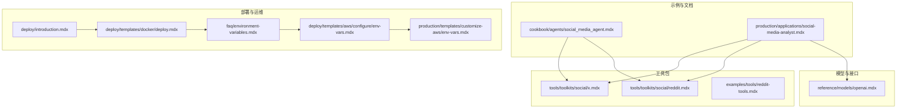
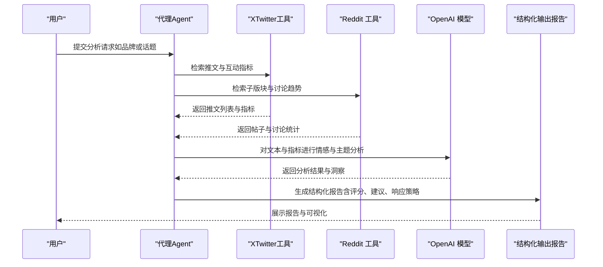
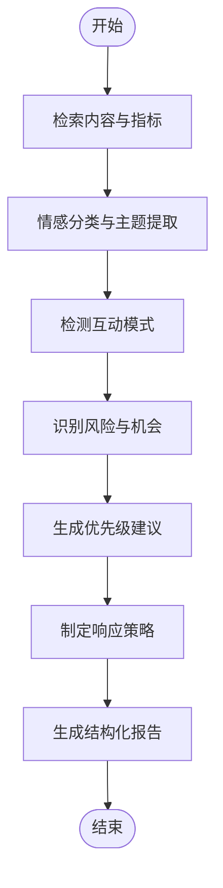
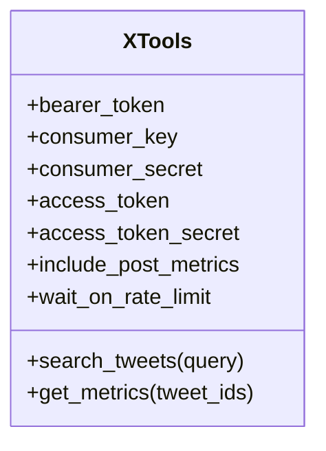
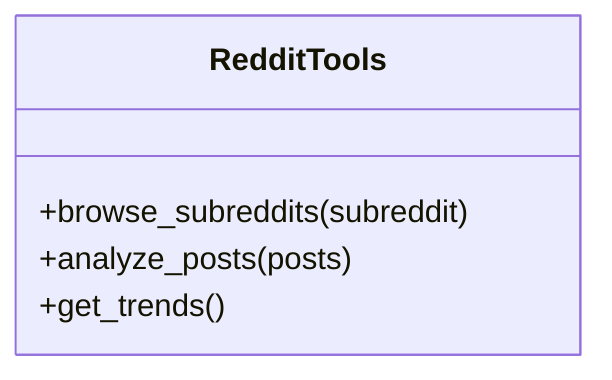
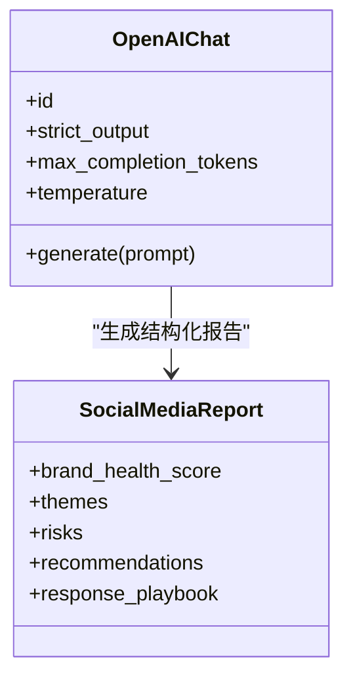
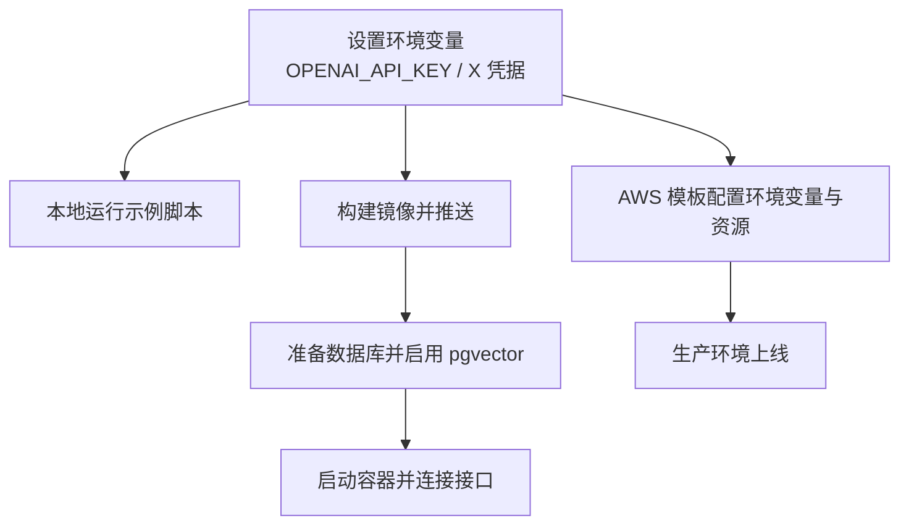
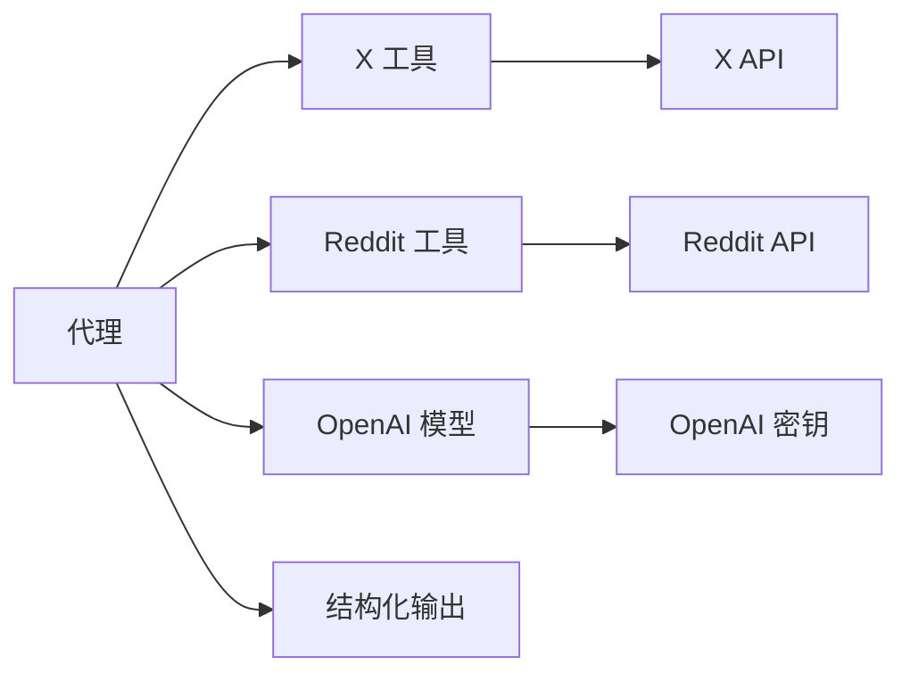

# 社交媒体分析师

<cite>
**本文引用的文件**
- [cookbook/agents/social_media_agent.mdx](file://cookbook/agents/social_media_agent.mdx)
- [production/applications/social-media-analyst.mdx](file://production/applications/social-media-analyst.mdx)
- [tools/toolkits/social/x.mdx](file://tools/toolkits/social/x.mdx)
- [tools/toolkits/social/reddit.mdx](file://tools/toolkits/social/reddit.mdx)
- [examples/tools/reddit-tools.mdx](file://examples/tools/reddit-tools.mdx)
- [reference/models/openai.mdx](file://reference/models/openai.mdx)
- [sessions/metrics/usage/agent-metrics.mdx](file://sessions/metrics/usage/agent-metrics.mdx)
- [sessions/metrics/usage/team-metrics.mdx](file://sessions/metrics/usage/team-metrics.mdx)
- [deploy/introduction.mdx](file://deploy/introduction.mdx)
- [deploy/templates/docker/deploy.mdx](file://deploy/templates/docker/deploy.mdx)
- [faq/environment-variables.mdx](file://faq/environment-variables.mdx)
- [deploy/templates/aws/configure/env-vars.mdx](file://deploy/templates/aws/configure/env-vars.mdx)
- [production/templates/customize-aws/env-vars.mdx](file://production/templates/customize-aws/env-vars.mdx)
</cite>

## 目录
1. [简介](#简介)
2. [项目结构](#项目结构)
3. [核心组件](#核心组件)
4. [架构总览](#架构总览)
5. [详细组件分析](#详细组件分析)
6. [依赖关系分析](#依赖关系分析)
7. [性能考虑](#性能考虑)
8. [故障排查指南](#故障排查指南)
9. [结论](#结论)
10. [附录](#附录)

## 简介
本技术文档面向“社交媒体分析师”应用，系统阐述其如何通过代理（Agent）在社交媒体平台上进行动态监控、趋势识别与洞察报告生成。文档覆盖以下关键主题：
- 数据采集：基于 X（Twitter）与 Reddit 的内容抓取与指标获取
- 内容分析：情感分类、主题提取、风险与机会识别
- 报告生成：结构化输出与可执行建议
- 部署与配置：本地与云端部署流程、环境变量管理
- 扩展与定制：多平台数据整合、自定义分析指标与扩展方法

## 项目结构
该应用由“示例与文档”“工具包”“模型与接口”“部署与运维”四部分组成：
- 示例与文档：提供社交媒体分析代理的使用示例与完整说明
- 工具包：封装对 X（Twitter）、Reddit 等平台的访问能力
- 模型与接口：OpenAI 模型接入与参数配置
- 部署与运维：Docker/AWS 模板与环境变量管理

**图表来源**
- [cookbook/agents/social_media_agent.mdx:1-144](file://cookbook/agents/social_media_agent.mdx#L1-L144)
- [production/applications/social-media-analyst.mdx:1-205](file://production/applications/social-media-analyst.mdx#L1-L205)
- [tools/toolkits/social/x.mdx:1-109](file://tools/toolkits/social/x.mdx#L1-L109)
- [tools/toolkits/social/reddit.mdx:1-27](file://tools/toolkits/social/reddit.mdx#L1-L27)
- [examples/tools/reddit-tools.mdx:1-68](file://examples/tools/reddit-tools.mdx#L1-L68)
- [reference/models/openai.mdx:1-53](file://reference/models/openai.mdx#L1-L53)
- [deploy/introduction.mdx:82-101](file://deploy/introduction.mdx#L82-L101)
- [deploy/templates/docker/deploy.mdx:100-111](file://deploy/templates/docker/deploy.mdx#L100-L111)
- [faq/environment-variables.mdx:1-63](file://faq/environment-variables.mdx#L1-L63)
- [deploy/templates/aws/configure/env-vars.mdx:1-38](file://deploy/templates/aws/configure/env-vars.mdx#L1-L38)
- [production/templates/customize-aws/env-vars.mdx:1-51](file://production/templates/customize-aws/env-vars.mdx#L1-L51)

**章节来源**
- [cookbook/agents/social_media_agent.mdx:1-144](file://cookbook/agents/social_media_agent.mdx#L1-L144)
- [production/applications/social-media-analyst.mdx:1-205](file://production/applications/social-media-analyst.mdx#L1-L205)

## 核心组件
- 代理（Agent）
  - 负责组织分析流程、调用工具并生成结构化报告
  - 使用 OpenAI 模型进行情感分析与综合研判
- 工具包（Toolkits）
  - X（Twitter）工具：检索推文、获取互动指标（点赞、转发、回复）
  - Reddit 工具：浏览子版块、分析帖子与讨论趋势
- 输出模式（Schema）
  - 结构化报告模板，包含品牌健康评分、主题聚类、风险与机会、响应策略等
- 配置与运行
  - 环境变量管理（OpenAI、X API 凭据）
  - 本地与 Docker/AWS 部署流程

**章节来源**
- [cookbook/agents/social_media_agent.mdx:18-102](file://cookbook/agents/social_media_agent.mdx#L18-L102)
- [production/applications/social-media-analyst.mdx:115-136](file://production/applications/social-media-analyst.mdx#L115-L136)
- [tools/toolkits/social/x.mdx:1-109](file://tools/toolkits/social/x.mdx#L1-L109)
- [tools/toolkits/social/reddit.mdx:1-27](file://tools/toolkits/social/reddit.mdx#L1-L27)
- [examples/tools/reddit-tools.mdx:1-68](file://examples/tools/reddit-tools.mdx#L1-L68)
- [reference/models/openai.mdx:1-53](file://reference/models/openai.mdx#L1-L53)

## 架构总览
下图展示从用户输入到最终报告的端到端流程，以及各组件之间的交互关系。

**图表来源**
- [cookbook/agents/social_media_agent.mdx:28-102](file://cookbook/agents/social_media_agent.mdx#L28-L102)
- [production/applications/social-media-analyst.mdx:147-159](file://production/applications/social-media-analyst.mdx#L147-L159)
- [tools/toolkits/social/x.mdx:41-50](file://tools/toolkits/social/x.mdx#L41-L50)
- [tools/toolkits/social/reddit.mdx:10-25](file://tools/toolkits/social/reddit.mdx#L10-L25)
- [reference/models/openai.mdx:1-53](file://reference/models/openai.mdx#L1-L53)

## 详细组件分析

### 组件一：代理（Agent）与分析流程
- 分析职责
  - 获取原始内容与互动指标
  - 进行情感分类与主题提取
  - 识别风险与机会，生成优先级建议
  - 输出可执行的响应策略
- 关键参数
  - 模型：OpenAI 模型用于综合分析
  - 工具：X 工具（带互动指标）、推理工具（规划分析）
  - 上下文增强：时间、历史会话、记忆启用
- 报告格式
  - 执行摘要、量化仪表盘、主题与代表性引述、竞争与市场信号、风险与机会、战略建议、响应手册

**图表来源**
- [cookbook/agents/social_media_agent.mdx:35-99](file://cookbook/agents/social_media_agent.mdx#L35-L99)
- [production/applications/social-media-analyst.mdx:147-159](file://production/applications/social-media-analyst.mdx#L147-L159)

**章节来源**
- [cookbook/agents/social_media_agent.mdx:18-102](file://cookbook/agents/social_media_agent.mdx#L18-L102)
- [production/applications/social-media-analyst.mdx:115-136](file://production/applications/social-media-analyst.mdx#L115-L136)

### 组件二：X（Twitter）工具与数据采集
- 功能
  - 搜索推文、获取互动指标（点赞、转发、回复）
  - 支持速率限制等待与重试
- 配置要点
  - 认证方式：Bearer Token 或 OAuth 四要素
  - include_post_metrics：是否返回互动指标
  - wait_on_rate_limit：遇到限流时自动等待与重试
- 使用场景
  - 品牌分析、竞品对比、热点话题追踪

**图表来源**
- [tools/toolkits/social/x.mdx:1-109](file://tools/toolkits/social/x.mdx#L1-L109)

**章节来源**
- [tools/toolkits/social/x.mdx:1-109](file://tools/toolkits/social/x.mdx#L1-L109)
- [production/applications/social-media-analyst.mdx:61-77](file://production/applications/social-media-analyst.mdx#L61-L77)

### 组件三：Reddit 工具与社区洞察
- 功能
  - 浏览子版块、分析帖子与讨论趋势
  - 尊重社区规范与速率限制
- 使用场景
  - 探索社区观点、识别新兴议题、辅助竞品分析

**图表来源**
- [tools/toolkits/social/reddit.mdx:1-27](file://tools/toolkits/social/reddit.mdx#L1-L27)
- [examples/tools/reddit-tools.mdx:1-68](file://examples/tools/reddit-tools.mdx#L1-L68)

**章节来源**
- [tools/toolkits/social/reddit.mdx:1-27](file://tools/toolkits/social/reddit.mdx#L1-L27)
- [examples/tools/reddit-tools.mdx:1-68](file://examples/tools/reddit-tools.mdx#L1-L68)

### 组件四：模型与输出模式（OpenAI）
- 模型接入
  - 通过 OpenAI Chat 模型进行情感与综合分析
  - 参数支持：温度、最大生成长度、严格结构化输出等
- 输出模式
  - 使用结构化 Schema 保证报告字段一致性（如品牌健康评分、主题、建议等）

**图表来源**
- [reference/models/openai.mdx:1-53](file://reference/models/openai.mdx#L1-L53)
- [production/applications/social-media-analyst.mdx:115-136](file://production/applications/social-media-analyst.mdx#L115-L136)

**章节来源**
- [reference/models/openai.mdx:1-53](file://reference/models/openai.mdx#L1-L53)
- [production/applications/social-media-analyst.mdx:115-136](file://production/applications/social-media-analyst.mdx#L115-L136)

### 组件五：部署与运行（本地/Docker/AWS）
- 本地运行
  - 创建虚拟环境、安装依赖、设置环境变量后直接运行示例脚本
- Docker 部署
  - 构建镜像、推送、设置 .env 中的环境变量、确保数据库启用 pgvector
- AWS 部署
  - 通过模板配置环境变量与资源，读取生产密钥与数据库信息

**图表来源**
- [production/applications/social-media-analyst.mdx:24-77](file://production/applications/social-media-analyst.mdx#L24-L77)
- [deploy/templates/docker/deploy.mdx:100-111](file://deploy/templates/docker/deploy.mdx#L100-L111)
- [deploy/introduction.mdx:82-101](file://deploy/introduction.mdx#L82-L101)
- [faq/environment-variables.mdx:1-63](file://faq/environment-variables.mdx#L1-L63)
- [deploy/templates/aws/configure/env-vars.mdx:1-38](file://deploy/templates/aws/configure/env-vars.mdx#L1-L38)
- [production/templates/customize-aws/env-vars.mdx:1-51](file://production/templates/customize-aws/env-vars.mdx#L1-L51)

**章节来源**
- [production/applications/social-media-analyst.mdx:24-77](file://production/applications/social-media-analyst.mdx#L24-L77)
- [deploy/templates/docker/deploy.mdx:100-111](file://deploy/templates/docker/deploy.mdx#L100-L111)
- [deploy/introduction.mdx:82-101](file://deploy/introduction.mdx#L82-L101)
- [faq/environment-variables.mdx:1-63](file://faq/environment-variables.mdx#L1-L63)
- [deploy/templates/aws/configure/env-vars.mdx:1-38](file://deploy/templates/aws/configure/env-vars.mdx#L1-L38)
- [production/templates/customize-aws/env-vars.mdx:1-51](file://production/templates/customize-aws/env-vars.mdx#L1-L51)

## 依赖关系分析
- 组件耦合
  - 代理依赖工具包（X、Reddit）获取数据；依赖模型进行分析；依赖输出模式保证结构化结果
- 外部依赖
  - X API、Reddit API、OpenAI API
- 配置与密钥
  - 环境变量集中管理，支持本地与 AWS 生产环境差异化配置

**图表来源**
- [cookbook/agents/social_media_agent.mdx:18-102](file://cookbook/agents/social_media_agent.mdx#L18-L102)
- [tools/toolkits/social/x.mdx:1-109](file://tools/toolkits/social/x.mdx#L1-L109)
- [tools/toolkits/social/reddit.mdx:1-27](file://tools/toolkits/social/reddit.mdx#L1-L27)
- [reference/models/openai.mdx:1-53](file://reference/models/openai.mdx#L1-L53)

**章节来源**
- [cookbook/agents/social_media_agent.mdx:18-102](file://cookbook/agents/social_media_agent.mdx#L18-L102)
- [tools/toolkits/social/x.mdx:1-109](file://tools/toolkits/social/x.mdx#L1-L109)
- [tools/toolkits/social/reddit.mdx:1-27](file://tools/toolkits/social/reddit.mdx#L1-L27)
- [reference/models/openai.mdx:1-53](file://reference/models/openai.mdx#L1-L53)

## 性能考虑
- 速率限制与退避
  - 合理设置 wait_on_rate_limit，必要时分批请求或升级至更高配额
- 生成长度与成本控制
  - 通过 max_completion_tokens 控制输出长度，平衡质量与成本
- 缓存与复用
  - 对重复查询的结果进行缓存，减少重复 API 调用
- 并发与批处理
  - 在允许范围内并发拉取数据，缩短整体分析时延
- 日志与可观测性
  - 利用会话度量（Agent/Team Metrics）跟踪性能瓶颈与耗时环节

**章节来源**
- [tools/toolkits/social/x.mdx:48-50](file://tools/toolkits/social/x.mdx#L48-L50)
- [reference/models/openai.mdx:24-26](file://reference/models/openai.mdx#L24-L26)
- [sessions/metrics/usage/agent-metrics.mdx:48-93](file://sessions/metrics/usage/agent-metrics.mdx#L48-L93)
- [sessions/metrics/usage/team-metrics.mdx:54-126](file://sessions/metrics/usage/team-metrics.mdx#L54-L126)

## 故障排查指南
- X API 认证失败
  - 检查是否正确设置四要素环境变量
- 速率限制错误
  - 启用 wait_on_rate_limit；对高吞吐场景考虑分批或升级配额
- 小众品牌结果有限
  - 报告中会标注数据局限性，结合上下文进行解读

**章节来源**
- [production/applications/social-media-analyst.mdx:180-198](file://production/applications/social-media-analyst.mdx#L180-L198)

## 结论
“社交媒体分析师”应用以代理为核心，结合 X（Twitter）与 Reddit 工具包、OpenAI 模型与结构化输出，形成从数据采集、内容分析到报告生成的闭环。通过合理的配置与部署策略，可在本地与云端稳定运行，并具备良好的扩展性与可维护性。

## 附录
- 快速开始
  - 克隆仓库、创建虚拟环境、安装依赖、设置环境变量、运行示例脚本
- 多平台数据整合
  - 可按需引入更多社交平台工具包，统一通过代理编排与输出
- 自定义分析指标
  - 在现有 Schema 基础上扩展字段，结合会话度量与团队协作评估效果

**章节来源**
- [production/applications/social-media-analyst.mdx:24-114](file://production/applications/social-media-analyst.mdx#L24-L114)
- [sessions/metrics/usage/agent-metrics.mdx:48-93](file://sessions/metrics/usage/agent-metrics.mdx#L48-L93)
- [sessions/metrics/usage/team-metrics.mdx:54-126](file://sessions/metrics/usage/team-metrics.mdx#L54-L126)