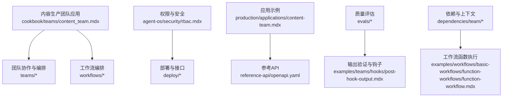
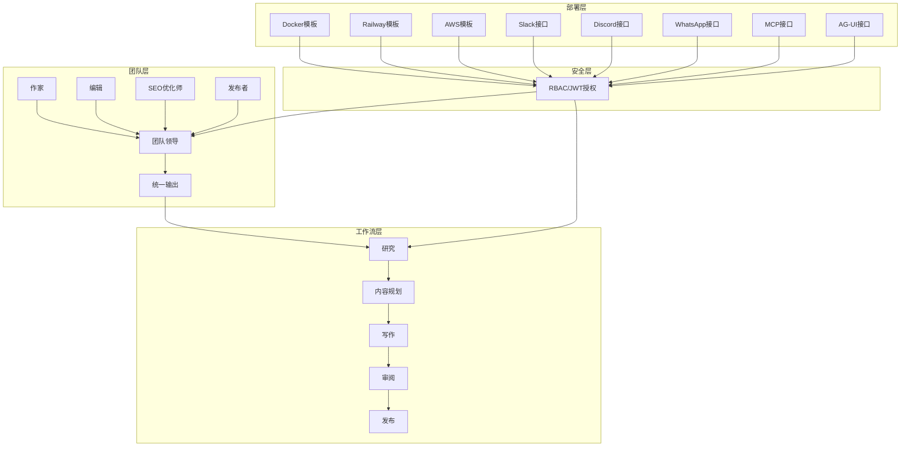
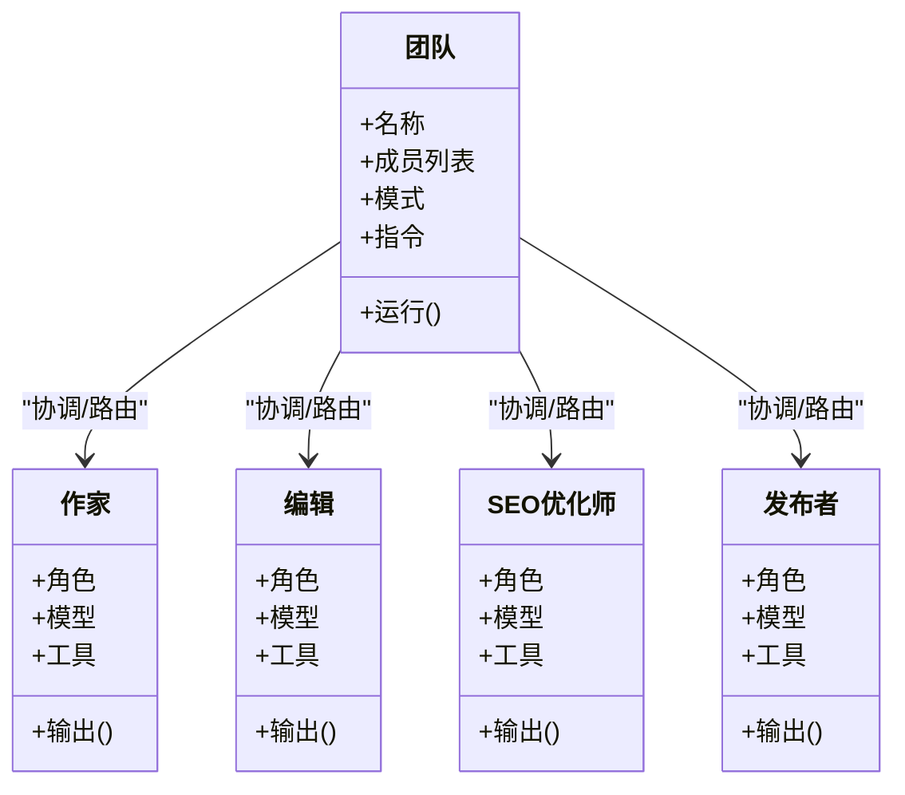
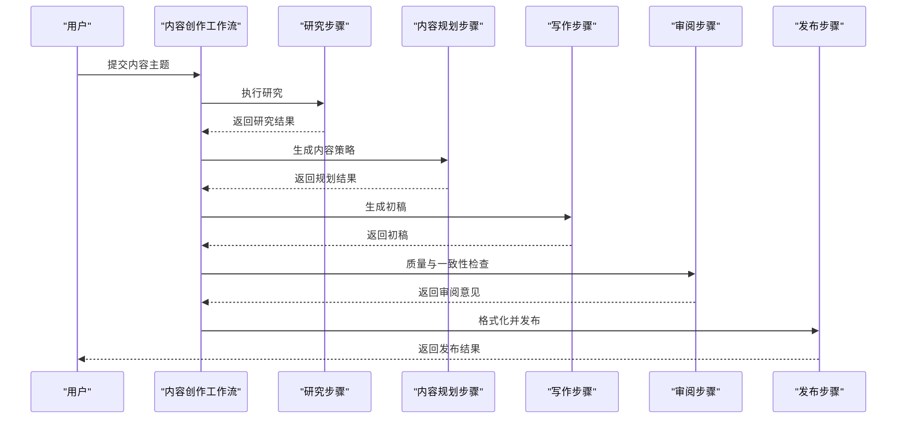
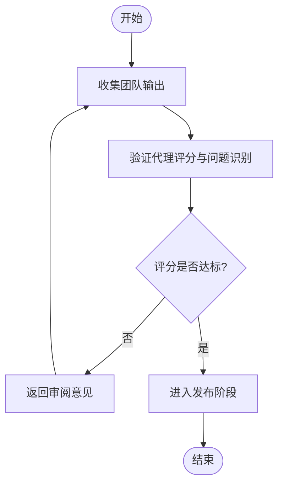
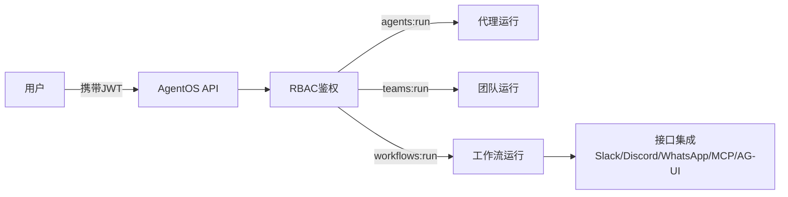
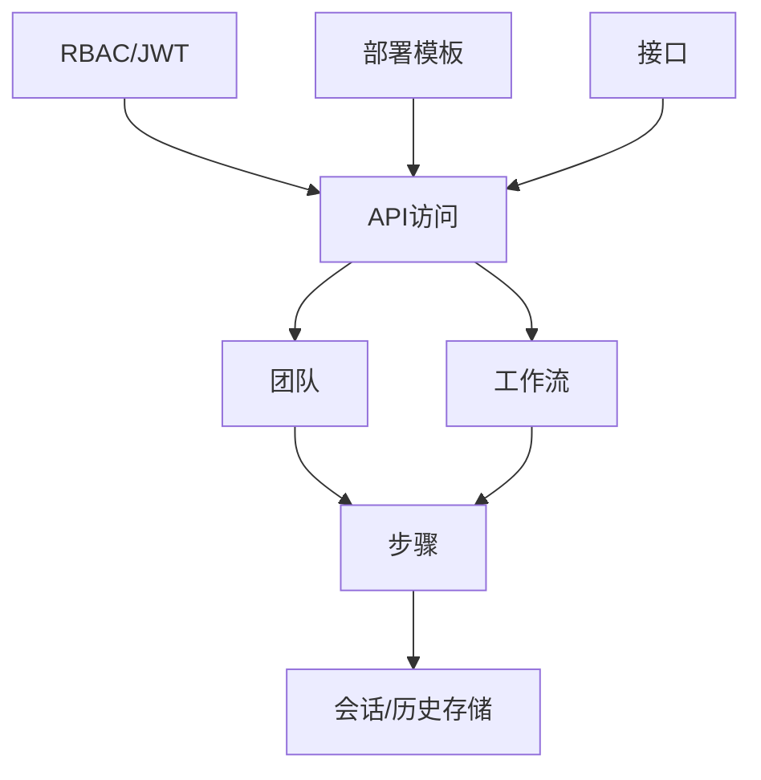

# 内容生产团队应用

<cite>
**本文引用的文件**
- [content_team.mdx](file://cookbook/teams/content_team.mdx)
- [teams.mdx](file://agent-os/studio/teams.mdx)
- [overview.mdx](file://teams/overview.mdx)
- [building-teams.mdx](file://teams/building-teams.mdx)
- [overview.mdx](file://workflows/overview.mdx)
- [rbac.mdx](file://agent-os/security/rbac.mdx)
- [introduction.mdx](file://deploy/introduction.mdx)
- [interfaces.mdx](file://deploy/interfaces.mdx)
- [content-team.mdx](file://production/applications/content-team.mdx)
- [openapi.yaml](file://reference-api/openapi.yaml)
- [evals/overview.mdx](file://evals/overview.mdx)
- [hooks/post-hook-output.mdx](file://examples/teams/hooks/post-hook-output.mdx)
- [dependencies/access-dependencies-in-tool.mdx](file://dependencies/team/access-dependencies-in-tool.mdx)
- [examples/teams/dependencies/dependencies-in-tools.mdx](file://examples/teams/dependencies/dependencies-in-tools.mdx)
- [examples/workflows/basic-workflows/function-workflows/function-workflow.mdx](file://examples/workflows/basic-workflows/function-workflows/function-workflow.mdx)
- [examples/workflows/advanced-concepts/history/history-in-function.mdx](file://examples/workflows/advanced-concepts/history/history-in-function.mdx)
</cite>

## 目录
1. [简介](#简介)
2. [项目结构](#项目结构)
3. [核心组件](#核心组件)
4. [架构总览](#架构总览)
5. [详细组件分析](#详细组件分析)
6. [依赖关系分析](#依赖关系分析)
7. [性能考虑](#性能考虑)
8. [故障排查指南](#故障排查指南)
9. [结论](#结论)
10. [附录](#附录)

## 简介
本技术文档面向内容生产团队应用，围绕“作家、编辑、SEO优化师、发布者”的角色分工与协作机制，系统阐述任务分配、内容审核与质量保障、工作流编排与版本控制、发布策略、权限管理与部署配置、以及性能监控与团队效率分析。文档同时提供可扩展的定制化开发指导与最佳实践建议，帮助团队在多智能体协作平台上高效构建与运营内容生产流水线。

## 项目结构
该仓库以“知识库/文档”形式组织内容，涵盖多智能体框架（AgentOS）、团队协作（Teams）、工作流编排（Workflows）、权限与安全（RBAC）、部署与接口（Interfaces）等主题。内容生产团队应用的相关资料主要分布在以下路径：
- 团队协作与编排：cookbook/teams、agent-os/studio、teams、workflows
- 权限与安全：agent-os/security
- 部署与接口：deploy
- 应用示例与参考：production/applications、reference-api
- 质量评估与监控：evals、examples/teams/hooks、examples/workflows

**图表来源**
- [content_team.mdx:1-107](file://cookbook/teams/content_team.mdx#L1-L107)
- [overview.mdx:1-135](file://teams/overview.mdx#L1-L135)
- [overview.mdx:1-102](file://workflows/overview.mdx#L1-L102)
- [rbac.mdx:1-410](file://agent-os/security/rbac.mdx#L1-L410)
- [introduction.mdx:1-102](file://deploy/introduction.mdx#L1-L102)
- [content-team.mdx:1-43](file://production/applications/content-team.mdx#L1-L43)
- [openapi.yaml:1241-14042](file://reference-api/openapi.yaml#L1241-L14042)
- [hooks/post-hook-output.mdx:63-88](file://examples/teams/hooks/post-hook-output.mdx#L63-L88)
- [examples/workflows/basic-workflows/function-workflows/function-workflow.mdx:115-154](file://examples/workflows/basic-workflows/function-workflows/function-workflow.mdx#L115-L154)

**章节来源**
- [content_team.mdx:1-107](file://cookbook/teams/content_team.mdx#L1-L107)
- [overview.mdx:1-135](file://teams/overview.mdx#L1-L135)
- [overview.mdx:1-102](file://workflows/overview.mdx#L1-L102)
- [rbac.mdx:1-410](file://agent-os/security/rbac.mdx#L1-L410)
- [introduction.mdx:1-102](file://deploy/introduction.mdx#L1-L102)
- [content-team.mdx:1-43](file://production/applications/content-team.mdx#L1-L43)
- [openapi.yaml:1241-14042](file://reference-api/openapi.yaml#L1241-L14042)

## 核心组件
- 多智能体团队（Teams）
  - 角色化成员：作家、编辑、SEO优化师、发布者
  - 协作模式：协调（coordinate）、路由（route）、广播（broadcast）、任务（tasks）
  - 成员动态工厂与缓存：按会话或用户上下文动态装配成员
- 工作流（Workflows）
  - 步骤编排：研究、规划、写作、审阅、发布
  - 条件/并行/循环/对话式交互
- 权限与安全（RBAC）
  - 基于JWT的作用域授权：agents:read/write/run、teams:read/write/run、workflows:read/write/run
  - 默认端点映射与自定义映射
- 部署与接口
  - 模板：Docker、Railway、AWS
  - 接口：Slack、Discord、WhatsApp、Telegram、MCP、AG-UI
- 质量评估与监控
  - 多维度评估：准确性、LLM作为评判者、性能（延迟/内存）、可靠性（工具调用/错误处理）
  - 输出验证钩子与后处理校验

**章节来源**
- [overview.mdx:79-100](file://teams/overview.mdx#L79-L100)
- [building-teams.mdx:152-190](file://teams/building-teams.mdx#L152-L190)
- [overview.mdx:49-68](file://workflows/overview.mdx#L49-L68)
- [rbac.mdx:52-108](file://agent-os/security/rbac.mdx#L52-L108)
- [introduction.mdx:11-101](file://deploy/introduction.mdx#L11-L101)
- [evals/overview.mdx:1-66](file://evals/overview.mdx#L1-L66)

## 架构总览
内容生产团队应用采用“团队+工作流”的双层协作架构：
- 团队层：负责角色化成员的协同与决策合成
- 工作流层：负责步骤化的流水线编排与状态持久化
- 安全层：基于JWT的细粒度授权
- 部署层：容器化模板与多平台接口暴露

**图表来源**
- [teams.mdx:10-40](file://agent-os/studio/teams.mdx#L10-L40)
- [overview.mdx:79-100](file://teams/overview.mdx#L79-L100)
- [overview.mdx:21-68](file://workflows/overview.mdx#L21-L68)
- [rbac.mdx:21-51](file://agent-os/security/rbac.mdx#L21-L51)
- [introduction.mdx:11-101](file://deploy/introduction.mdx#L11-L101)

## 详细组件分析

### 团队协作机制与角色分工
- 角色与职责
  - 作家：根据简报生成初稿
  - 编辑：校对清晰度、语法与风格
  - SEO优化师：提升搜索可见性
  - 发布者：格式化并发布到平台
- 协作模式
  - 协调（coordinate）：由团队领导综合各成员输出
  - 路由（route）：根据请求类型定向至特定成员
  - 广播（broadcast）：并行通知所有成员
  - 任务（tasks）：迭代式任务循环
- 动态成员与缓存
  - 支持成员工厂函数，按用户/会话动态装配
  - 可配置缓存键，避免重复解析

**图表来源**
- [content_team.mdx:33-64](file://cookbook/teams/content_team.mdx#L33-L64)
- [building-teams.mdx:152-190](file://teams/building-teams.mdx#L152-L190)

**章节来源**
- [content_team.mdx:16-31](file://cookbook/teams/content_team.mdx#L16-L31)
- [overview.mdx:79-100](file://teams/overview.mdx#L79-L100)
- [building-teams.mdx:152-190](file://teams/building-teams.mdx#L152-L190)

### 工作流编排与版本控制
- 流水线步骤
  - 研究：使用网络搜索工具收集素材
  - 规划：制定内容策略与分发渠道
  - 写作：生成文章初稿
  - 审阅：质量与一致性检查
  - 发布：格式化并发布到目标平台
- 版本与阶段
  - 工作流支持草稿/已发布阶段与当前版本号
  - 通过数据库持久化会话与历史

**图表来源**
- [overview.mdx:21-47](file://workflows/overview.mdx#L21-L47)
- [examples/workflows/basic-workflows/function-workflows/function-workflow.mdx:115-154](file://examples/workflows/basic-workflows/function-workflows/function-workflow.mdx#L115-L154)

**章节来源**
- [overview.mdx:49-68](file://workflows/overview.mdx#L49-L68)
- [examples/workflows/basic-workflows/function-workflows/function-workflow.mdx:115-154](file://examples/workflows/basic-workflows/function-workflows/function-workflow.mdx#L115-L154)

### 内容审核流程与质量保证
- 输出验证钩子
  - 使用专用验证代理对团队输出进行综合评分与问题识别
  - 关注全面性、协作整合、一致性、专业性与安全性
- 后处理校验
  - 在工具中访问团队指标与上下文，进行时间/情境分析与绩效评估
- 评估维度
  - 准确性、LLM作为评判者、性能（延迟/内存）、可靠性（工具调用/错误处理）

**图表来源**
- [hooks/post-hook-output.mdx:63-88](file://examples/teams/hooks/post-hook-output.mdx#L63-L88)
- [examples/teams/dependencies/dependencies-in-tools.mdx:61-88](file://examples/teams/dependencies/dependencies-in-tools.mdx#L61-L88)

**章节来源**
- [hooks/post-hook-output.mdx:63-88](file://examples/teams/hooks/post-hook-output.mdx#L63-L88)
- [examples/teams/dependencies/dependencies-in-tools.mdx:61-88](file://examples/teams/dependencies/dependencies-in-tools.mdx#L61-L88)
- [evals/overview.mdx:1-66](file://evals/overview.mdx#L1-L66)

### 权限管理与协作工具集成
- RBAC作用域
  - 系统：system:read
  - 代理：agents:read/write/delete/run 及 per-agent 运行范围
  - 团队：teams:read/write/delete/run 及 per-team 运行范围
  - 工作流：workflows:read/write/delete/run 及 per-workflow 运行范围
  - 会话、记忆、知识、指标、评估等
- JWT令牌结构
  - 包含 scopes、sub、session_id、aud 等声明
- 接口集成
  - Slack、Discord、WhatsApp、Telegram、MCP、AG-UI
  - 通过部署模板快速接入

**图表来源**
- [rbac.mdx:286-327](file://agent-os/security/rbac.mdx#L286-L327)
- [interfaces.mdx:1-38](file://deploy/interfaces.mdx#L1-L38)

**章节来源**
- [rbac.mdx:52-108](file://agent-os/security/rbac.mdx#L52-L108)
- [rbac.mdx:286-327](file://agent-os/security/rbac.mdx#L286-L327)
- [interfaces.mdx:1-38](file://deploy/interfaces.mdx#L1-L38)

### 部署配置与发布策略
- 模板选择
  - Docker：本地运行
  - Railway：云原生部署
  - AWS：企业级弹性
- 应用添加
  - 在模板基础上添加内容生产团队应用
- 接口暴露
  - 将应用暴露到Slack、Discord、WhatsApp、Telegram、MCP、AG-UI等平台
- 发布策略
  - 工作流支持草稿/已发布阶段与版本号管理，便于灰度与回滚

**章节来源**
- [introduction.mdx:11-101](file://deploy/introduction.mdx#L11-L101)
- [content-team.mdx:11-43](file://production/applications/content-team.mdx#L11-L43)
- [openapi.yaml:14018-14036](file://reference-api/openapi.yaml#L14018-L14036)

## 依赖关系分析
- 组件耦合
  - 团队与工作流：团队负责成员协作，工作流负责步骤编排；二者可通过步骤复用团队实例
  - 安全与部署：RBAC贯穿API访问控制，部署模板提供运行环境
- 外部依赖
  - 接口协议：MCP、AG-UI
  - 数据存储：PostgreSQL、SQLite、MongoDB等（工作流与会话持久化）
- 循环依赖
  - 文档结构未发现直接循环依赖；团队与工作流通过步骤与工具解耦

**图表来源**
- [overview.mdx:68-78](file://teams/overview.mdx#L68-L78)
- [overview.mdx:58-68](file://workflows/overview.mdx#L58-L68)
- [rbac.mdx:150-255](file://agent-os/security/rbac.mdx#L150-L255)
- [introduction.mdx:11-101](file://deploy/introduction.mdx#L11-L101)

**章节来源**
- [overview.mdx:68-78](file://teams/overview.mdx#L68-L78)
- [overview.mdx:58-68](file://workflows/overview.mdx#L58-L68)
- [rbac.mdx:150-255](file://agent-os/security/rbac.mdx#L150-L255)

## 性能考虑
- 评估维度
  - 准确性：LLM作为评判者进行评分
  - 性能：延迟与内存占用测量
  - 可靠性：工具调用与错误处理测试
- 实践建议
  - 先从准确性与可靠性入手，再引入性能评估
  - 使用多组测试用例覆盖边界场景
  - 持续跟踪指标随迭代的变化趋势
  - 结合团队与工作流的并发与缓存策略优化吞吐

**章节来源**
- [evals/overview.mdx:1-66](file://evals/overview.mdx#L1-L66)

## 故障排查指南
- RBAC鉴权失败
  - 401：缺少或无效的JWT令牌
  - 403：权限不足（scopes不匹配）
  - 检查令牌中的 scopes、aud、sub 等声明
- 授权配置
  - 使用 AuthorizationConfig 或中间件自定义scope映射
  - 默认排除健康检查与文档端点
- 工作流执行异常
  - 检查步骤顺序与输入输出
  - 开启历史记录与事件流以便定位问题
- 输出质量不达标
  - 引入验证代理与后处理工具，结合团队指标与上下文进行分析

**章节来源**
- [rbac.mdx:367-373](file://agent-os/security/rbac.mdx#L367-L373)
- [examples/workflows/advanced-concepts/history/history-in-function.mdx:186-216](file://examples/workflows/advanced-concepts/history/history-in-function.mdx#L186-L216)
- [hooks/post-hook-output.mdx:63-88](file://examples/teams/hooks/post-hook-output.mdx#L63-L88)

## 结论
内容生产团队应用通过“角色化团队+步骤化工作流”的组合，实现了从研究、规划、写作到发布的全链路自动化与可视化。配合RBAC权限体系、多平台接口集成与持续的质量评估，团队可在保证质量的同时提升协作效率与发布节奏。建议优先落地团队协作模式与工作流编排，逐步引入评估与监控，并以模板化部署快速扩展到不同平台。

## 附录
- 快速上手
  - 创建虚拟环境与安装依赖
  - 设置API密钥
  - 运行团队示例与工作流示例
- 扩展建议
  - 引入更多角色（如事实核查、A/B变体生成）
  - 结合知识库与检索增强
  - 使用会话与历史实现上下文连续性
  - 通过接口模板接入Slack/Discord等即时通讯平台

**章节来源**
- [content_team.mdx:72-107](file://cookbook/teams/content_team.mdx#L72-L107)
- [examples/workflows/basic-workflows/function-workflows/function-workflow.mdx:115-154](file://examples/workflows/basic-workflows/function-workflows/function-workflow.mdx#L115-L154)