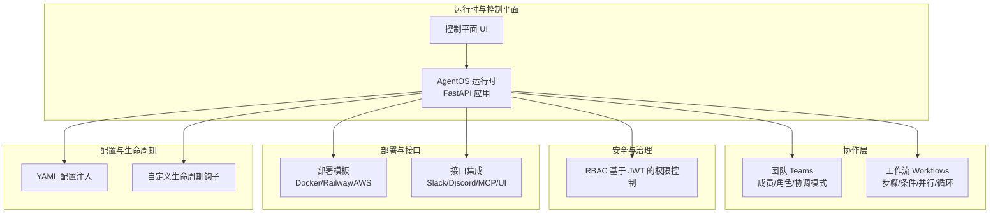
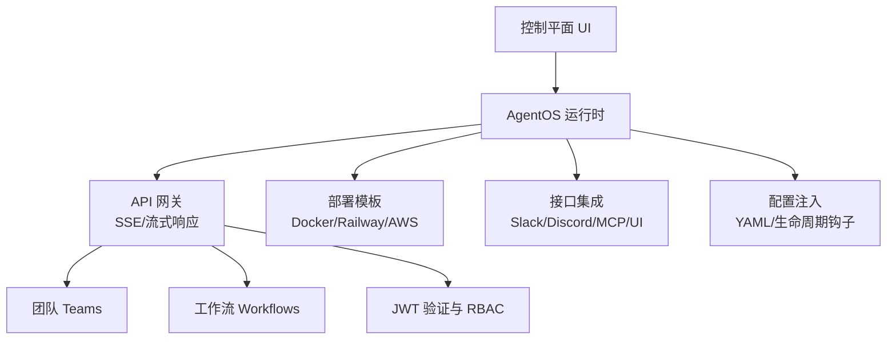
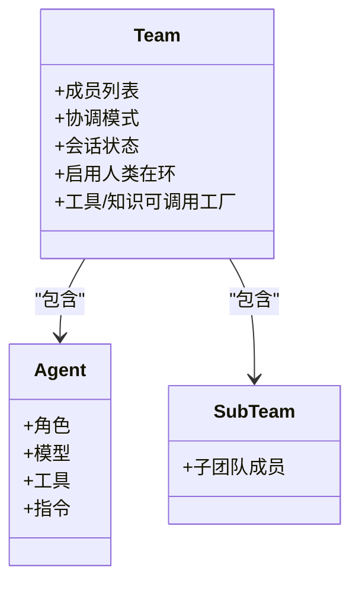
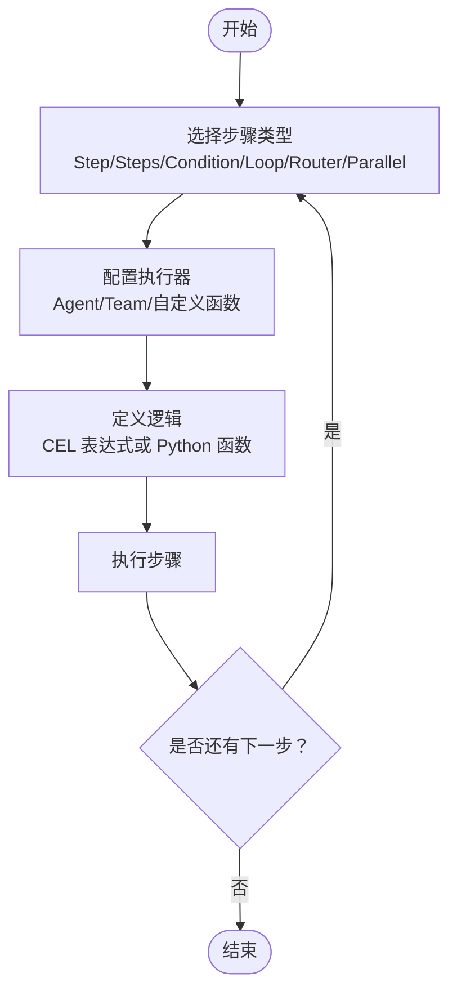
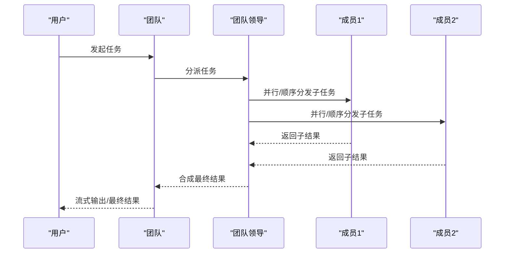
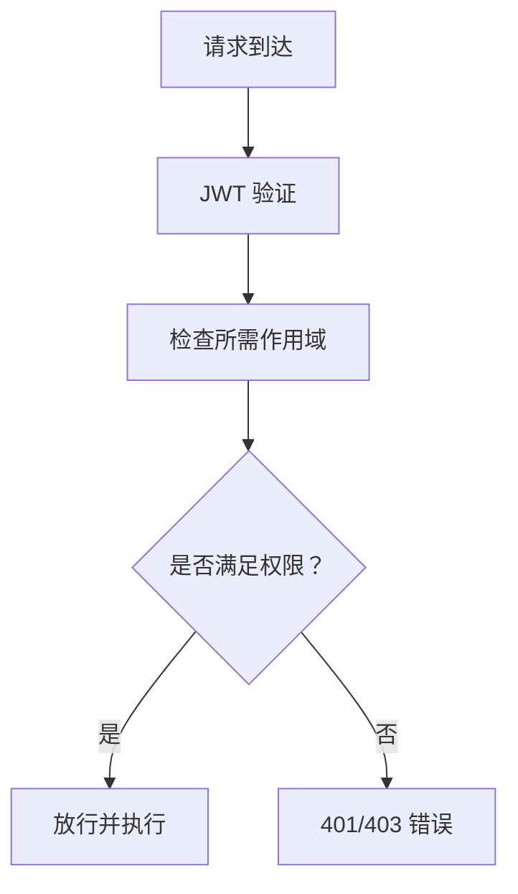
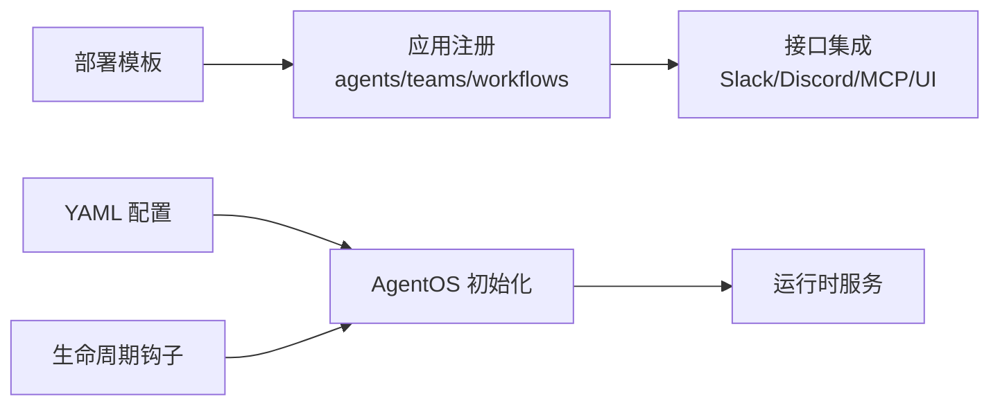
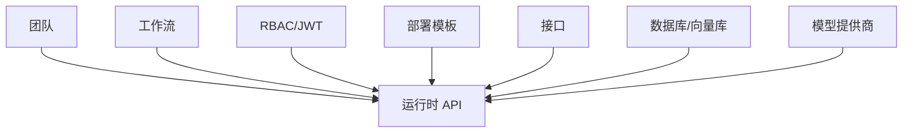

# 团队应用

<cite>
**本文引用的文件**
- [README.md](file://README.md)
- [agent-os/introduction.mdx](file://agent-os/introduction.mdx)
- [teams/overview.mdx](file://teams/overview.mdx)
- [agent-os/studio/teams.mdx](file://agent-os/studio/teams.mdx)
- [cookbook/teams/content_team.mdx](file://cookbook/teams/content_team.mdx)
- [agent-os/security/rbac.mdx](file://agent-os/security/rbac.mdx)
- [agent-os/studio/workflows.mdx](file://agent-os/studio/workflows.mdx)
- [workflows/overview.mdx](file://workflows/overview.mdx)
- [cookbook/teams/overview.mdx](file://cookbook/teams/overview.mdx)
- [deploy/introduction.mdx](file://deploy/introduction.mdx)
- [agent-os/usage/extra-configuration.mdx](file://agent-os/usage/extra-configuration.mdx)
- [agent-os/lifespan.mdx](file://agent-os/lifespan.mdx)
- [state/team/overview.mdx](file://state/team/overview.mdx)
- [_snippets/team-snippet.mdx](file://_snippets/team-snippet.mdx)
- [teams/delegation.mdx](file://teams/delegation.mdx)
</cite>

## 目录
1. [简介](#简介)
2. [项目结构](#项目结构)
3. [核心组件](#核心组件)
4. [架构总览](#架构总览)
5. [详细组件分析](#详细组件分析)
6. [依赖关系分析](#依赖关系分析)
7. [性能与扩展](#性能与扩展)
8. [故障排查指南](#故障排查指南)
9. [结论](#结论)
10. [附录](#附录)

## 简介
本技术文档面向“团队应用”的协作与管理，聚焦于多智能体团队（Teams）在内容生产场景中的组织方式、成员角色与协作模式、权限控制、部署配置、任务分配与状态同步、通信协议与冲突处理、性能监控与扩展策略，并提供定制化开发与最佳实践建议。文档以仓库中已有的团队、工作流、权限与部署相关资料为基础，结合可视化图示帮助读者快速理解系统设计与实现要点。

## 项目结构
该仓库是文档站点，围绕 AgentOS 运行时与控制平面、团队协作、工作流编排、权限控制与部署模板等主题提供说明与示例。团队应用的关键落点包括：
- 团队（Teams）：定义成员、角色、协调模式与执行策略
- 工作流（Workflows）：步骤化编排，支持条件、并行、循环与路由
- 权限控制（RBAC）：基于 JWT 的细粒度访问控制
- 部署与接口：Docker、Railway、AWS 等模板及 Slack/Discord/MCP 接口
- 配置与生命周期：YAML 配置注入、自定义生命周期钩子

**图表来源**
- [agent-os/introduction.mdx:40-61](file://agent-os/introduction.mdx#L40-L61)
- [deploy/introduction.mdx:7-101](file://deploy/introduction.mdx#L7-L101)

**章节来源**
- [README.md:1-83](file://README.md#L1-L83)
- [agent-os/introduction.mdx:40-61](file://agent-os/introduction.mdx#L40-L61)
- [deploy/introduction.mdx:7-101](file://deploy/introduction.mdx#L7-L101)

## 核心组件
- 团队（Team）
  - 成员可为 Agent 或子 Team；支持协调模式（coordinate/route/broadcast/tasks），默认 coordinate
  - 支持会话状态共享与工具/知识的可调用工厂缓存
  - 可启用人类在环（HITL）与暂停/继续能力
- 工作流（Workflow）
  - 步骤可为 Agent、Team 或自定义函数；支持顺序、并行、条件、循环、路由
  - 提供对话式工作流能力，便于交互式执行
- 权限控制（RBAC）
  - 基于 JWT 的层级作用域，覆盖系统、代理、团队、工作流、会话、记忆、知识、指标与评估
  - 支持自定义作用域映射与 JWKS 验证
- 部署与接口
  - 模板：Docker、Railway、AWS；接口：Slack、Discord、MCP、自定义 UI
  - 可通过配置文件注入额外参数，如快速提示、内存域配置等
- 生命周期与配置
  - 自定义 FastAPI 生命周期钩子用于启动/关闭逻辑
  - YAML 配置文件注入到 AgentOS，统一管理资源与行为

**章节来源**
- [teams/overview.mdx:66-101](file://teams/overview.mdx#L66-L101)
- [workflows/overview.mdx:49-68](file://workflows/overview.mdx#L49-L68)
- [agent-os/security/rbac.mdx:52-255](file://agent-os/security/rbac.mdx#L52-L255)
- [agent-os/studio/workflows.mdx:8-31](file://agent-os/studio/workflows.mdx#L8-L31)
- [agent-os/usage/extra-configuration.mdx:6-25](file://agent-os/usage/extra-configuration.mdx#L6-L25)
- [agent-os/lifespan.mdx:7-44](file://agent-os/lifespan.mdx#L7-L44)

## 架构总览
下图展示团队应用在 AgentOS 中的整体架构：运行时负责提供 API 与服务，控制平面用于管理与调试；团队与工作流作为上层编排单元，通过权限控制保障访问安全，通过部署模板与接口暴露给用户。

**图表来源**
- [agent-os/introduction.mdx:40-61](file://agent-os/introduction.mdx#L40-L61)
- [agent-os/studio/workflows.mdx:6-31](file://agent-os/studio/workflows.mdx#L6-L31)
- [agent-os/security/rbac.mdx:23-45](file://agent-os/security/rbac.mdx#L23-L45)
- [deploy/introduction.mdx:7-101](file://deploy/introduction.mdx#L7-L101)
- [agent-os/usage/extra-configuration.mdx:28-100](file://agent-os/usage/extra-configuration.mdx#L28-L100)
- [agent-os/lifespan.mdx:13-23](file://agent-os/lifespan.mdx#L13-L23)

## 详细组件分析

### 团队协作机制与成员管理
- 角色与分工
  - 内容生产团队可包含研究者（Researcher）、写手（Writer）、编辑（Editor）、SEO 优化师（SEO Specialist）、发布者（Publisher）等角色，每个角色具备明确职责与工具集
  - 示例团队采用“协调模式”（coordinate），由团队领导进行任务分解与结果整合
- 协作模式
  - 模式选择：coordinate（默认）、route（路由至单个专家）、broadcast（广播给所有成员）、tasks（任务列表迭代）
  - 模式影响延迟与错误处理策略：协调模式为顺序执行，路由模式更快，广播模式并行但合成有额外延迟，tasks 模式迭代直至完成或达到最大轮次
- 会话状态与共享
  - 通过 session_state 在团队成员间共享上下文数据，成员可在工具中读取 run_context.session_state 获取共享状态
  - 支持将会话状态加入上下文，便于跨成员推理与一致性维护

**图表来源**
- [teams/overview.mdx:66-101](file://teams/overview.mdx#L66-L101)
- [state/team/overview.mdx:14-38](file://state/team/overview.mdx#L14-L38)
- [_snippets/team-snippet.mdx:1-6](file://_snippets/team-snippet.mdx#L1-L6)

**章节来源**
- [cookbook/teams/content_team.mdx:20-71](file://cookbook/teams/content_team.mdx#L20-L71)
- [teams/overview.mdx:66-101](file://teams/overview.mdx#L66-L101)
- [state/team/overview.mdx:14-38](file://state/team/overview.mdx#L14-L38)
- [teams/delegation.mdx:280-299](file://teams/delegation.mdx#L280-L299)
- [_snippets/team-snippet.mdx:1-6](file://_snippets/team-snippet.mdx#L1-L6)

### 工作流程与任务分配
- 步骤类型
  - Step、Steps（顺序组）、Condition（条件分支）、Loop（循环）、Router（路由选择）、Parallel（并行）
- 执行控制
  - 支持 CEL 表达式或 Python 函数作为评估器、结束条件与选择器
  - 可在 Studio 中可视化拖拽构建复杂自动化流水线
- 与团队协作的关系
  - 工作流可将团队作为步骤执行器，实现“步骤级编排 + 团队级协作”的组合模式

**图表来源**
- [agent-os/studio/workflows.mdx:18-31](file://agent-os/studio/workflows.mdx#L18-L31)
- [workflows/overview.mdx:58-68](file://workflows/overview.mdx#L58-L68)

**章节来源**
- [agent-os/studio/workflows.mdx:8-31](file://agent-os/studio/workflows.mdx#L8-L31)
- [workflows/overview.mdx:49-68](file://workflows/overview.mdx#L49-L68)

### 通信协议、状态同步与冲突解决
- 通信协议
  - 运行时提供 SSE 兼容的流式响应，支持实时输出与事件推送
- 状态同步
  - 团队会话状态在成员间共享与更新，工具可通过 run_context 访问共享状态
  - 可将会话状态加入上下文，确保成员推理的一致性
- 冲突解决策略
  - 协调模式允许领导者聚合部分可用结果，路由模式直接返回成员结果，广播模式合成可用结果并标注缺失，tasks 模式跟踪失败/阻塞任务并重试或重新分配

**图表来源**
- [agent-os/introduction.mdx:9-13](file://agent-os/introduction.mdx#L9-L13)
- [state/team/overview.mdx:14-38](file://state/team/overview.mdx#L14-L38)
- [teams/delegation.mdx:280-299](file://teams/delegation.mdx#L280-L299)

**章节来源**
- [agent-os/introduction.mdx:9-13](file://agent-os/introduction.mdx#L9-L13)
- [state/team/overview.mdx:14-38](file://state/team/overview.mdx#L14-L38)
- [teams/delegation.mdx:280-299](file://teams/delegation.mdx#L280-L299)

### 权限与成员权限设置
- RBAC 结构
  - 层级作用域格式：resource:action、resource:<id>:action、resource:*:action、agent_os:admin
  - 覆盖范围：系统、代理、团队、工作流、会话、记忆、知识、指标、评估
- 默认映射
  - 不同端点对应所需作用域，例如 /teams/* 对应 teams:read/teams:write/teams:delete/teams:run 等
- 自定义映射与验证
  - 通过 JWT 中间件配置 verification_keys、algorithm、authorization 与 scope_mappings
  - 支持 JWKS 文件与环境变量配置
- 使用建议
  - 为不同角色授予最小必要权限；对特定资源使用带 id 的作用域；管理员使用 agent_os:admin

**图表来源**
- [agent-os/security/rbac.mdx:23-45](file://agent-os/security/rbac.mdx#L23-L45)
- [agent-os/security/rbac.mdx:153-255](file://agent-os/security/rbac.mdx#L153-L255)

**章节来源**
- [agent-os/security/rbac.mdx:52-255](file://agent-os/security/rbac.mdx#L52-L255)

### 部署配置与接口集成
- 模板与平台
  - Docker、Railway、AWS 等模板；可按需选择空白画布或预构建解决方案
- 应用与接口
  - 将 agents、teams、workflows 作为应用添加到部署；通过 Slack、Discord、MCP、自定义 UI 暴露
- 配置注入
  - 使用 YAML 配置文件注入额外参数（如快速提示、内存域配置），并在 AgentOS 初始化时传入
- 生命周期钩子
  - 通过自定义 FastAPI 生命周期钩子处理启动/关闭逻辑、资源初始化与清理、健康检查与后台任务

**图表来源**
- [deploy/introduction.mdx:7-101](file://deploy/introduction.mdx#L7-L101)
- [agent-os/usage/extra-configuration.mdx:28-100](file://agent-os/usage/extra-configuration.mdx#L28-L100)
- [agent-os/lifespan.mdx:13-23](file://agent-os/lifespan.mdx#L13-L23)

**章节来源**
- [deploy/introduction.mdx:7-101](file://deploy/introduction.mdx#L7-L101)
- [agent-os/usage/extra-configuration.mdx:6-25](file://agent-os/usage/extra-configuration.mdx#L6-L25)
- [agent-os/lifespan.mdx:7-44](file://agent-os/lifespan.mdx#L7-L44)

## 依赖关系分析
- 组件耦合
  - 团队与工作流均依赖运行时提供的 API；权限控制贯穿所有端点；部署模板与接口为外部集成点
- 外部依赖
  - 数据存储（PostgreSQL/PGVector/SQLite 等）、模型提供商（OpenAI/Anthropic 等）、第三方服务（Slack/Discord/MCP）
- 接口契约
  - 团队与工作流通过标准化的执行接口与上下文传递进行协作；RBAC 通过 JWT 中间件统一校验

**图表来源**
- [agent-os/introduction.mdx:40-61](file://agent-os/introduction.mdx#L40-L61)
- [agent-os/security/rbac.mdx:23-45](file://agent-os/security/rbac.mdx#L23-L45)
- [deploy/introduction.mdx:7-101](file://deploy/introduction.mdx#L7-L101)

**章节来源**
- [agent-os/introduction.mdx:40-61](file://agent-os/introduction.mdx#L40-L61)
- [agent-os/security/rbac.mdx:23-45](file://agent-os/security/rbac.mdx#L23-L45)
- [deploy/introduction.mdx:7-101](file://deploy/introduction.mdx#L7-L101)

## 性能与扩展
- 性能特性
  - 流式响应（SSE 兼容）提升用户体验；并行执行（Parallel/广播）缩短整体时延
  - 缓存与可调用工厂（Team.members/tools/knowledge）减少重复初始化开销
- 负载与扩展
  - 通过部署模板（Docker/Railway/AWS）实现弹性伸缩；接口层（Slack/Discord/MCP/UI）可水平扩展
  - 使用 PGVector 等向量数据库支撑大规模知识检索；数据库连接池与索引优化提升查询性能
- 监控与可观测性
  - 运行时内置追踪与日志；结合外部观测平台（Langfuse/LangSmith 等）进行指标采集与分析

[本节为通用性能讨论，不直接分析具体文件]

## 故障排查指南
- 权限问题
  - 401 未认证：检查 JWT 是否存在且有效；确认 audience 与 AgentOS id 匹配
  - 403 权限不足：核对 scopes 是否包含所需作用域；确认是否使用了带 id 的作用域
- 启动与关闭
  - 自定义生命周期钩子异常：检查 @asynccontextmanager 使用与资源释放逻辑
- 配置问题
  - YAML 配置未生效：确认配置文件路径与键名正确；检查 AgentOS 初始化时是否传入 config 参数
- 协作与状态
  - 成员状态不同步：确认 session_state 是否正确设置与传播；检查是否开启将会话状态加入上下文

**章节来源**
- [agent-os/security/rbac.mdx:367-373](file://agent-os/security/rbac.mdx#L367-L373)
- [agent-os/lifespan.mdx:7-44](file://agent-os/lifespan.mdx#L7-L44)
- [agent-os/usage/extra-configuration.mdx:28-100](file://agent-os/usage/extra-configuration.mdx#L28-L100)
- [state/team/overview.mdx:14-38](file://state/team/overview.mdx#L14-L38)

## 结论
团队应用通过“团队 + 工作流”的双层编排实现内容生产的高效协作：团队负责成员间的协调与状态共享，工作流负责步骤化的流程控制与可视化编排；RBAC 确保访问安全，部署模板与接口实现灵活接入；YAML 配置与生命周期钩子提供强大的可定制能力。遵循本文的最佳实践，可在保证安全与可维护性的前提下，实现高并发、低延迟的内容生产系统。

[本节为总结性内容，不直接分析具体文件]

## 附录
- 快速参考
  - 团队模式对照表：coordinate（协调）、route（路由）、broadcast（广播）、tasks（任务）
  - RBAC 默认映射：按端点查看所需作用域
  - 部署模板：Docker/Railway/AWS；接口：Slack/Discord/MCP/UI
- 定制化开发建议
  - 使用可调用工厂与缓存优化团队初始化
  - 通过 CEL 表达式简化条件与路由逻辑
  - 利用生命周期钩子集中处理资源与健康检查
  - 为不同角色配置最小权限的作用域集合

**章节来源**
- [_snippets/team-snippet.mdx:1-6](file://_snippets/team-snippet.mdx#L1-L6)
- [agent-os/security/rbac.mdx:153-255](file://agent-os/security/rbac.mdx#L153-L255)
- [deploy/introduction.mdx:7-101](file://deploy/introduction.mdx#L7-L101)
- [agent-os/lifespan.mdx:7-44](file://agent-os/lifespan.mdx#L7-L44)