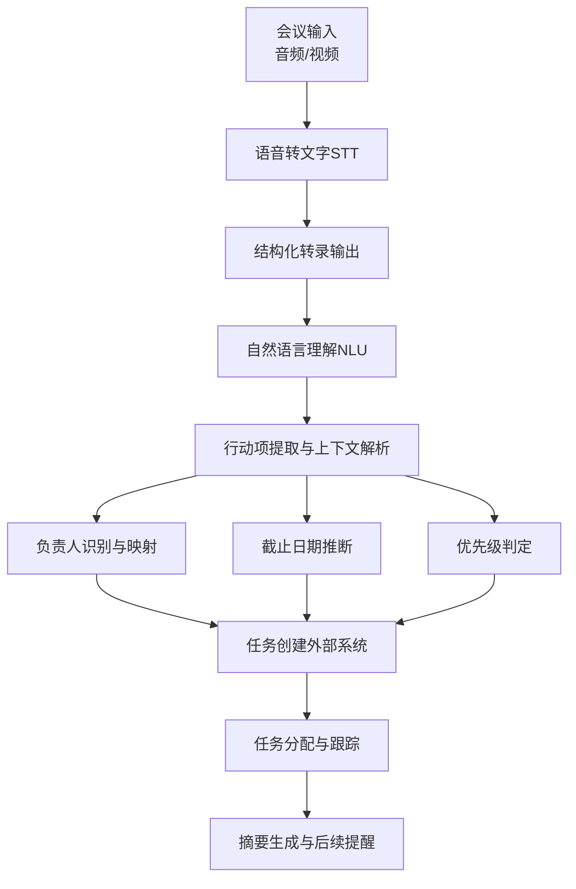
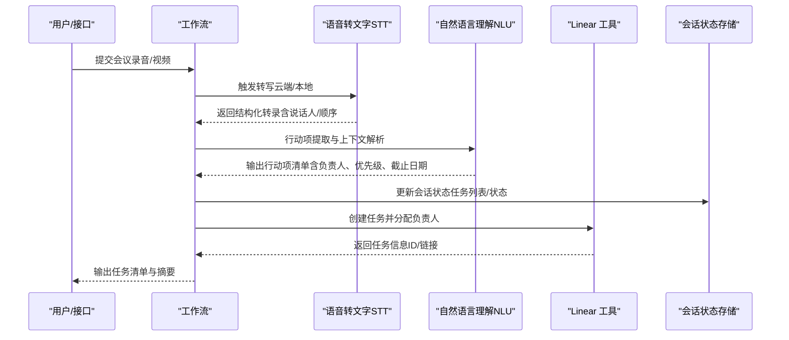
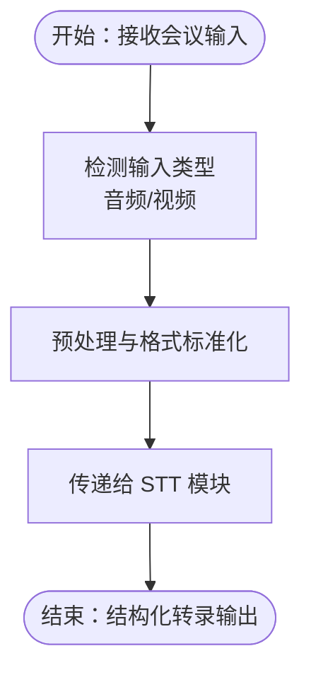
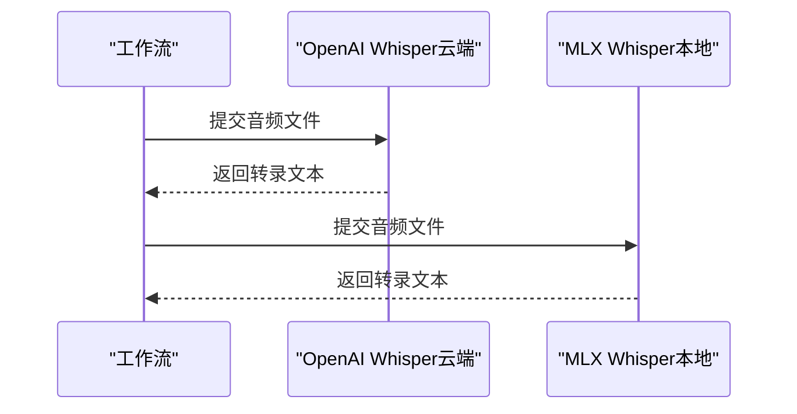
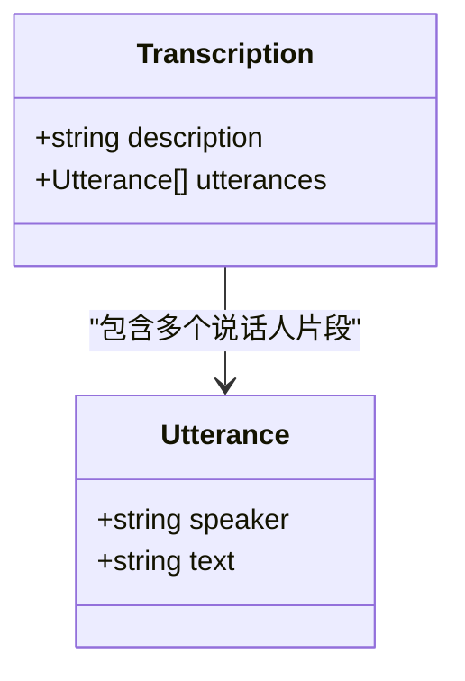
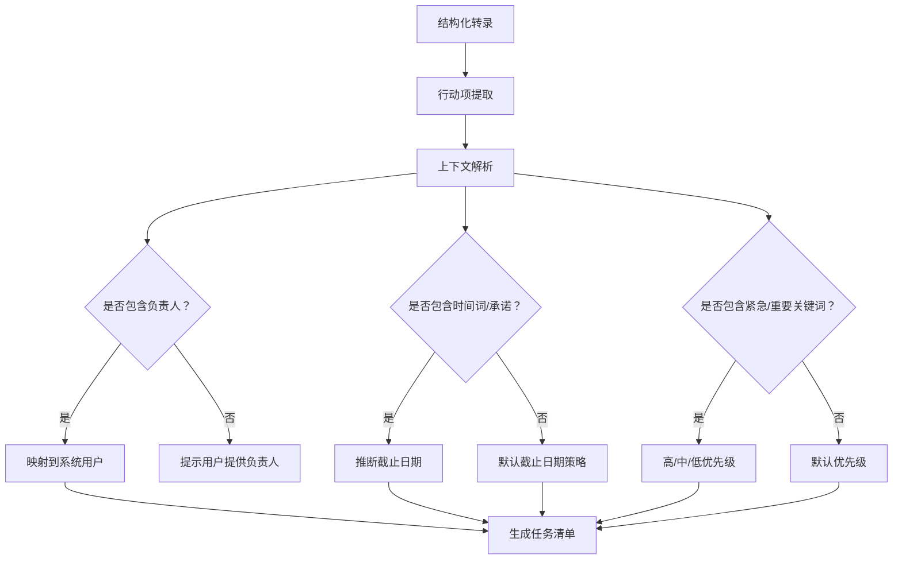
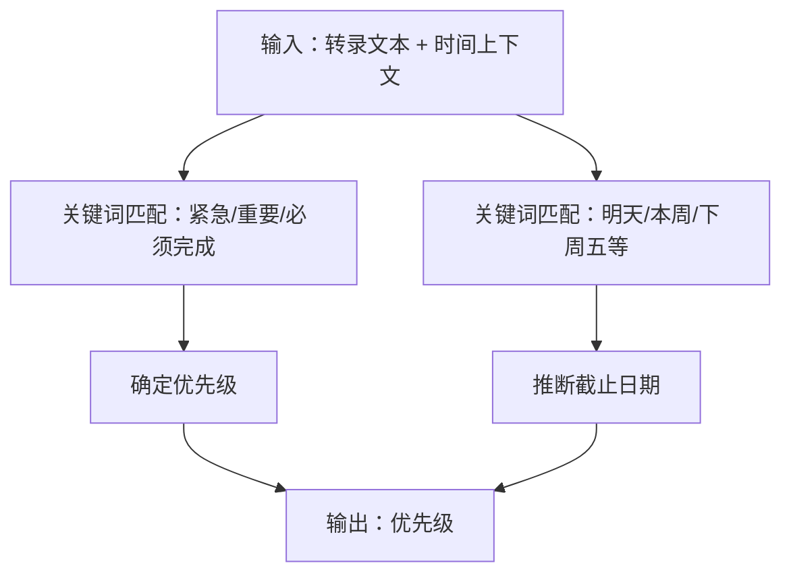
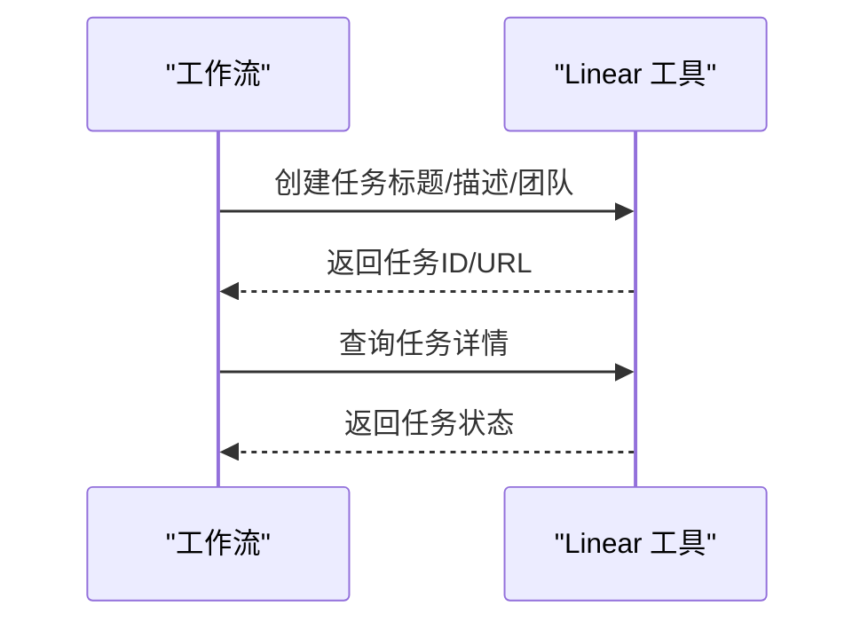
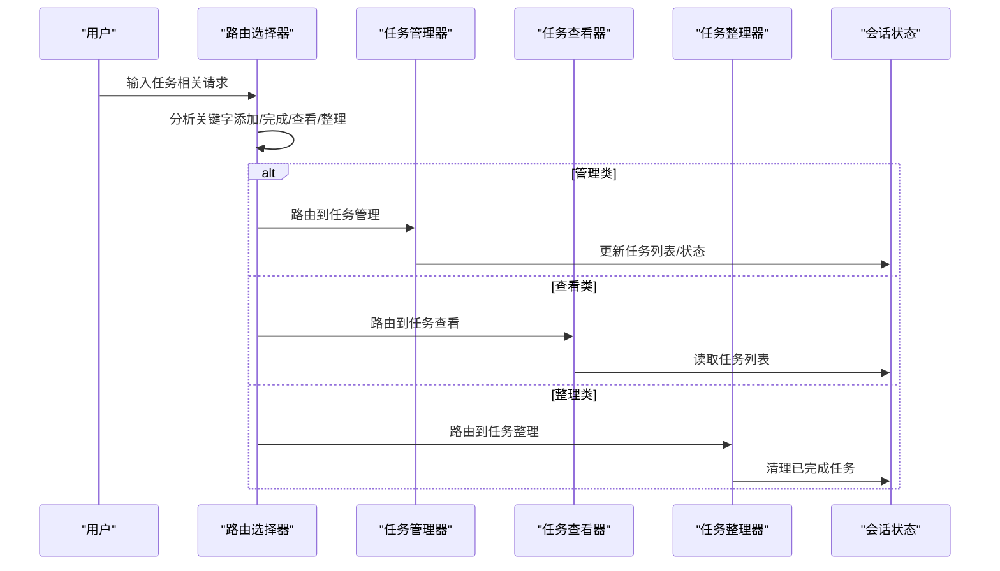
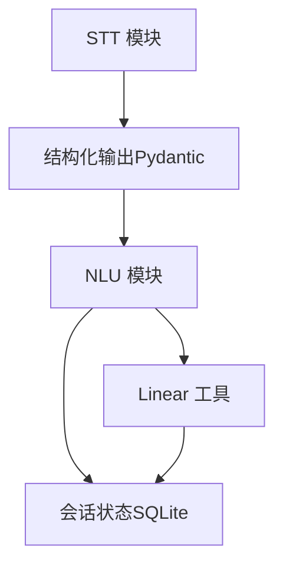

# 会议转任务工作流

<cite>
**本文引用的文件**
- [meeting-to-tasks（生产应用）.mdx](file://production/applications/meeting-to-tasks.mdx)
- [meeting-to-tasks（部署应用）.mdx](file://deploy/apps/workflows/meeting-to-tasks.mdx)
- [MLX 转写工具.md](file://tools/toolkits/others/mlx-transcribe.mdx)
- [语音转文本代理.md](file://cookbook/agents/speech-to-text-agent.mdx)
- [语音转文本（多模态使用）.mdx](file://multimodal/agent/usage/speech-to-text.mdx)
- [Linear 工具.md](file://examples/tools/linear-tools.mdx)
- [Linear 工具包.md](file://tools/toolkits/others/linear.mdx)
- [会话状态中的路由.md](file://examples/workflows/advanced-concepts/session-state/state-in-router.mdx)
- [团队任务模式基础.md](file://examples/teams/basics/task-mode.mdx)
- [会话状态与团队.md](file://examples/workflows/advanced-concepts/session-state/state-with-team.mdx)
- [时间指令上下文.md](file://context/agent/datetime-instructions.mdx)
</cite>

## 目录
1. [简介](#简介)
2. [项目结构](#项目结构)
3. [核心组件](#核心组件)
4. [架构总览](#架构总览)
5. [详细组件分析](#详细组件分析)
6. [依赖关系分析](#依赖关系分析)
7. [性能考虑](#性能考虑)
8. [故障排除指南](#故障排除指南)
9. [结论](#结论)
10. [附录](#附录)

## 简介
本技术文档围绕“会议转任务工作流”展开，目标是将会议录音或视频输入转化为可执行的任务清单，并在必要时映射到外部系统（如 Linear）。工作流覆盖以下关键环节：会议音频/视频输入处理、语音转文字（STT）、结构化转录、自然语言理解（NLU）以提取行动项、负责人识别、截止日期推断、任务优先级设定、任务创建与分配、以及摘要生成与后续提醒调度。

当前仓库中，“会议转任务”应用处于“即将推出”的规划阶段，但已提供了完整的流程设计、关键工具与组件参考，便于直接落地实施。

## 项目结构
与“会议转任务工作流”相关的内容主要分布在以下区域：
- 生产应用与部署应用页面：描述工作流目标、步骤与用例
- 多模态与语音转写：提供音频输入与转写能力
- 任务管理与会话状态：演示任务列表、优先级、状态与路由
- 外部系统集成：Linear 工具用于任务创建与查询
- 时间上下文：为截止日期推断提供时区与时钟支持

**章节来源**
- [meeting-to-tasks（生产应用）.mdx:11-34](file://production/applications/meeting-to-tasks.mdx#L11-L34)
- [语音转文本（多模态使用）.mdx:1-37](file://multimodal/agent/usage/speech-to-text.mdx#L1-L37)
- [语音转文本代理.md:20-29](file://cookbook/agents/speech-to-text-agent.mdx#L20-L29)

## 核心组件
- 会议输入与预处理
  - 支持音频/视频输入，可结合多模态能力进行结构化输出
  - 参考：[语音转文本（多模态使用）.mdx:1-37](file://multimodal/agent/usage/speech-to-text.mdx#L1-L37)，[语音转文本代理.md:20-29](file://cookbook/agents/speech-to-text-agent.mdx#L20-L29)
- 语音转文字（STT）
  - 提供 OpenAI Whisper 云端与本地 MLX Whisper 的转写能力
  - 参考：[MLX 转写工具.md:1-91](file://tools/toolkits/others/mlx-transcribe.mdx#L1-L91)，[语音转文本代理.md:31-92](file://cookbook/agents/speech-to-text-agent.mdx#L31-L92)
- 结构化转录与对话元数据
  - 使用 Pydantic 模型输出带说话人与顺序的结构化转录
  - 参考：[语音转文本代理.md:55-91](file://cookbook/agents/speech-to-text-agent.mdx#L55-L91)
- 自然语言理解（NLU）与行动项提取
  - 基于转录文本进行行动项抽取、上下文解析与负责人识别
  - 参考：[会议转任务（生产应用）.mdx:15-23](file://production/applications/meeting-to-tasks.mdx#L15-L23)
- 任务优先级与截止日期
  - 通过上下文与规则推断优先级与截止日期
  - 参考：[时间指令上下文.md:1-59](file://context/agent/datetime-instructions.mdx#L1-L59)
- 任务创建与分配
  - 集成 Linear 工具进行任务创建、查询与更新
  - 参考：[Linear 工具.md:1-63](file://examples/tools/linear-tools.mdx#L1-L63)，[Linear 工具包.md:1-38](file://tools/toolkits/others/linear.mdx#L1-L38)
- 会话状态与任务路由
  - 使用会话状态维护任务列表、状态与优先级；通过路由选择器智能分派到不同处理步骤
  - 参考：[会话状态中的路由.md:345-399](file://examples/workflows/advanced-concepts/session-state/state-in-router.mdx#L345-L399)，[会话状态与团队.md:174-232](file://examples/workflows/advanced-concepts/session-state/state-with-team.mdx#L174-L232)

**章节来源**
- [会议转任务（生产应用）.mdx:15-34](file://production/applications/meeting-to-tasks.mdx#L15-L34)
- [MLX 转写工具.md:1-91](file://tools/toolkits/others/mlx-transcribe.mdx#L1-L91)
- [语音转文本代理.md:55-91](file://cookbook/agents/speech-to-text-agent.mdx#L55-L91)
- [Linear 工具.md:1-63](file://examples/tools/linear-tools.mdx#L1-L63)
- [Linear 工具包.md:1-38](file://tools/toolkits/others/linear.mdx#L1-L38)
- [会话状态中的路由.md:345-399](file://examples/workflows/advanced-concepts/session-state/state-in-router.mdx#L345-L399)
- [会话状态与团队.md:174-232](file://examples/workflows/advanced-concepts/session-state/state-with-team.mdx#L174-L232)
- [时间指令上下文.md:1-59](file://context/agent/datetime-instructions.mdx#L1-L59)

## 架构总览
下图展示了从会议输入到任务创建与跟踪的端到端流程：

**图表来源**
- [语音转文本（多模态使用）.mdx:1-37](file://multimodal/agent/usage/speech-to-text.mdx#L1-L37)
- [语音转文本代理.md:31-92](file://cookbook/agents/speech-to-text-agent.mdx#L31-L92)
- [会议转任务（生产应用）.mdx:15-34](file://production/applications/meeting-to-tasks.mdx#L15-L34)
- [Linear 工具.md:1-63](file://examples/tools/linear-tools.mdx#L1-L63)
- [会话状态中的路由.md:345-399](file://examples/workflows/advanced-concepts/session-state/state-in-router.mdx#L345-L399)

## 详细组件分析

### 组件一：会议输入与预处理
- 输入类型：音频（WAV/MP3 等）与视频
- 处理方式：多模态 Agent 直接接收媒体输入，结合模型能力进行结构化输出
- 关键点：支持 URL 或本地文件；输出结构化转录，便于下游解析

**章节来源**
- [语音转文本（多模态使用）.mdx:1-37](file://multimodal/agent/usage/speech-to-text.mdx#L1-L37)
- [语音转文本代理.md:20-29](file://cookbook/agents/speech-to-text-agent.mdx#L20-L29)

### 组件二：语音转文字（STT）
- 云端 Whisper：OpenAI Whisper API，适合高准确度与稳定性
- 本地 Whisper：MLX Whisper，适合低延迟与隐私保护场景
- 输出：文本或结构化转录（含说话人）

**章节来源**
- [MLX 转写工具.md:1-91](file://tools/toolkits/others/mlx-transcribe.mdx#L1-L91)
- [语音转文本代理.md:31-92](file://cookbook/agents/speech-to-text-agent.mdx#L31-L92)

### 组件三：结构化转录与说话人识别
- 使用 Pydantic 模型定义 Utterance 与 Transcription，确保输出一致性
- 包含说话人名称、顺序与完整文本，便于后续 NLU 解析

**章节来源**
- [语音转文本代理.md:55-91](file://cookbook/agents/speech-to-text-agent.mdx#L55-L91)

### 组件四：自然语言理解（NLU）与行动项提取
- 行动项提取：基于转录文本抽取“要做什么”的明确指令
- 上下文解析：识别背景信息、前提条件与影响范围
- 负责人识别：从对话中提取提及的人员或角色
- 截止日期推断：结合时间词、承诺语义与上下文推断
- 优先级判定：根据紧急性、重要性与资源约束综合评估

**章节来源**
- [会议转任务（生产应用）.mdx:15-23](file://production/applications/meeting-to-tasks.mdx#L15-L23)
- [会话状态中的路由.md:345-399](file://examples/workflows/advanced-concepts/session-state/state-in-router.mdx#L345-L399)

### 组件五：任务优先级与截止日期
- 优先级：高/中/低，依据紧急性与影响范围
- 截止日期：结合时间指令上下文与时区信息推断
- 参考：启用时间上下文与时区标识，提升日期推理准确性

**章节来源**
- [时间指令上下文.md:1-59](file://context/agent/datetime-instructions.mdx#L1-L59)

### 组件六：任务创建与分配（Linear 集成）
- 功能：创建任务、查询任务、更新标题与描述
- 参数：项目/团队 ID、标题、描述、优先级等
- 流程：将提取的行动项映射为任务字段，调用工具创建并返回任务链接

**章节来源**
- [Linear 工具.md:1-63](file://examples/tools/linear-tools.mdx#L1-L63)
- [Linear 工具包.md:1-38](file://tools/toolkits/others/linear.mdx#L1-L38)

### 组件七：会话状态与任务路由
- 会话状态：维护任务列表、状态与优先级
- 路由选择器：根据用户请求关键字路由到“管理/查看/整理”等专用步骤
- 团队协作：通过工具在会话状态中增删改查任务，再由状态管理器更新状态

**章节来源**
- [会话状态中的路由.md:345-399](file://examples/workflows/advanced-concepts/session-state/state-in-router.mdx#L345-L399)
- [会话状态与团队.md:174-232](file://examples/workflows/advanced-concepts/session-state/state-with-team.mdx#L174-L232)

## 依赖关系分析
- 输入依赖：音频/视频文件与网络访问（云端 STT）
- 模型依赖：OpenAI Whisper（云端）、MLX Whisper（本地）
- 结构化输出：Pydantic 模型（Utterance、Transcription）
- 外部系统：Linear API（任务创建/查询/更新）
- 会话状态：SQLite（示例数据库），维护任务列表与状态

**章节来源**
- [语音转文本代理.md:55-91](file://cookbook/agents/speech-to-text-agent.mdx#L55-L91)
- [Linear 工具.md:1-63](file://examples/tools/linear-tools.mdx#L1-L63)
- [会话状态中的路由.md:405-418](file://examples/workflows/advanced-concepts/session-state/state-in-router.mdx#L405-L418)

## 性能考虑
- STT 选择
  - 云端 Whisper：准确率高，适合长会议与多说话人场景
  - 本地 MLX Whisper：低延迟、隐私友好，适合实时或离线场景
- 结构化输出
  - 使用 Pydantic 模型减少后处理开销，提高下游解析效率
- 会话状态
  - 将任务列表与状态持久化至 SQLite，避免重复计算与内存膨胀
- 并行化
  - 对多说话人会议，可并行处理不同说话人的片段以缩短总时延
- 缓存与重用
  - 对常用模板与规则（如优先级/截止日期推断）进行缓存，减少重复推理

[本节为通用建议，无需特定文件引用]

## 故障排除指南
- STT 失败或结果不完整
  - 检查音频质量与格式；尝试切换云端/本地 STT；确认网络连通性
  - 参考：[MLX 转写工具.md:1-91](file://tools/toolkits/others/mlx-transcribe.mdx#L1-L91)
- 结构化输出异常
  - 确认 Pydantic 模型定义与输出解析逻辑一致；检查模型版本兼容性
  - 参考：[语音转文本代理.md:55-91](file://cookbook/agents/speech-to-text-agent.mdx#L55-L91)
- 任务创建失败（Linear）
  - 校验 API 密钥与权限；确认项目/团队 ID 正确；检查任务字段映射
  - 参考：[Linear 工具包.md:1-38](file://tools/toolkits/others/linear.mdx#L1-L38)，[Linear 工具.md:1-63](file://examples/tools/linear-tools.mdx#L1-L63)
- 会话状态未更新
  - 确认工作流启用了会话状态；检查工具函数对 session_state 的读写逻辑
  - 参考：[会话状态中的路由.md:174-232](file://examples/workflows/advanced-concepts/session-state/state-in-router.mdx#L174-L232)，[会话状态与团队.md:174-232](file://examples/workflows/advanced-concepts/session-state/state-with-team.mdx#L174-L232)
- 截止日期推断不准
  - 增强时间指令上下文与规则覆盖；结合多轮对话上下文进行修正
  - 参考：[时间指令上下文.md:1-59](file://context/agent/datetime-instructions.mdx#L1-L59)

**章节来源**
- [MLX 转写工具.md:1-91](file://tools/toolkits/others/mlx-transcribe.mdx#L1-L91)
- [语音转文本代理.md:55-91](file://cookbook/agents/speech-to-text-agent.mdx#L55-L91)
- [Linear 工具包.md:1-38](file://tools/toolkits/others/linear.mdx#L1-L38)
- [Linear 工具.md:1-63](file://examples/tools/linear-tools.mdx#L1-L63)
- [会话状态中的路由.md:174-232](file://examples/workflows/advanced-concepts/session-state/state-in-router.mdx#L174-L232)
- [会话状态与团队.md:174-232](file://examples/workflows/advanced-concepts/session-state/state-with-team.mdx#L174-L232)
- [时间指令上下文.md:1-59](file://context/agent/datetime-instructions.mdx#L1-L59)

## 结论
“会议转任务工作流”通过将会议输入经由 STT 转为结构化转录，再利用 NLU 抽取行动项、识别负责人、推断截止日期与优先级，并最终在外部系统（如 Linear）创建与跟踪任务，形成闭环。结合会话状态与路由机制，可实现灵活的任务管理与协作。当前仓库已提供完整的流程设计与关键组件参考，便于快速落地与扩展。

[本节为总结，无需特定文件引用]

## 附录

### 配置参数与触发条件
- STT 配置
  - 云端：模型选择、音频格式、输出文本/JSON
  - 本地：模型权重、FFmpeg 安装、音频目录
- 结构化输出
  - Pydantic 模型字段：说话人、文本、描述、片段列表
- 任务创建（Linear）
  - 必填：项目/团队 ID、标题、描述
  - 可选：优先级、标签、截止日期
- 会话状态
  - 任务列表、状态、优先级、最后更新时间
- 触发条件
  - 接收会议录音/视频文件
  - 用户请求（添加/完成/查看/整理任务）

**章节来源**
- [MLX 转写工具.md:1-91](file://tools/toolkits/others/mlx-transcribe.mdx#L1-L91)
- [语音转文本代理.md:55-91](file://cookbook/agents/speech-to-text-agent.mdx#L55-L91)
- [Linear 工具.md:1-63](file://examples/tools/linear-tools.mdx#L1-L63)
- [Linear 工具包.md:1-38](file://tools/toolkits/others/linear.mdx#L1-L38)
- [会话状态中的路由.md:174-232](file://examples/workflows/advanced-concepts/session-state/state-in-router.mdx#L174-L232)
- [会话状态与团队.md:174-232](file://examples/workflows/advanced-concepts/session-state/state-with-team.mdx#L174-L232)

### 实际部署示例与集成指导
- 部署路径
  - 生产应用页面：[会议转任务（生产应用）.mdx:1-47](file://production/applications/meeting-to-tasks.mdx#L1-L47)
  - 部署应用页面：[会议转任务（部署应用）.mdx:1-10](file://deploy/apps/workflows/meeting-to-tasks.mdx#L1-L10)
- 集成步骤
  - 准备 STT 环境（云端/本地）
  - 配置结构化输出模型
  - 实现 NLU 行动项提取与负责人识别
  - 集成 Linear 工具进行任务创建与查询
  - 使用会话状态与路由实现任务管理

**章节来源**
- [会议转任务（生产应用）.mdx:1-47](file://production/applications/meeting-to-tasks.mdx#L1-L47)
- [会议转任务（部署应用）.mdx:1-10](file://deploy/apps/workflows/meeting-to-tasks.mdx#L1-L10)
- [Linear 工具.md:1-63](file://examples/tools/linear-tools.mdx#L1-L63)
- [Linear 工具包.md:1-38](file://tools/toolkits/others/linear.mdx#L1-L38)
- [会话状态中的路由.md:405-418](file://examples/workflows/advanced-concepts/session-state/state-in-router.mdx#L405-L418)