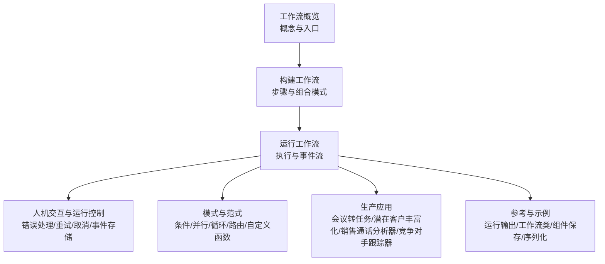
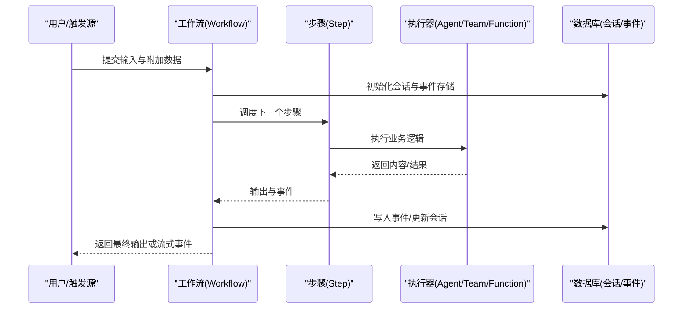
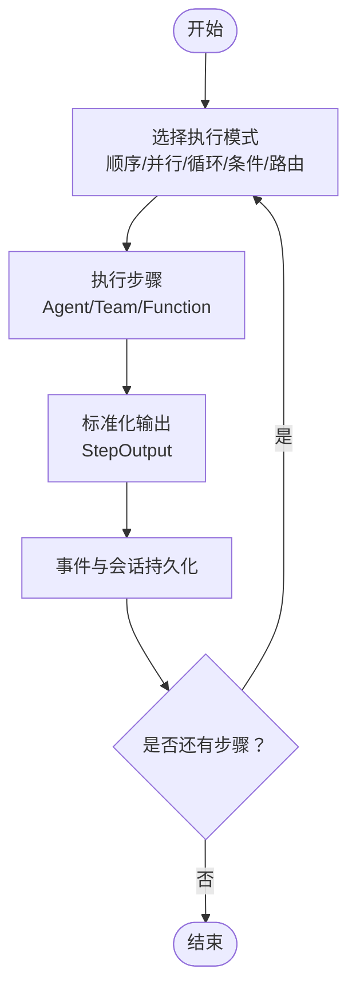
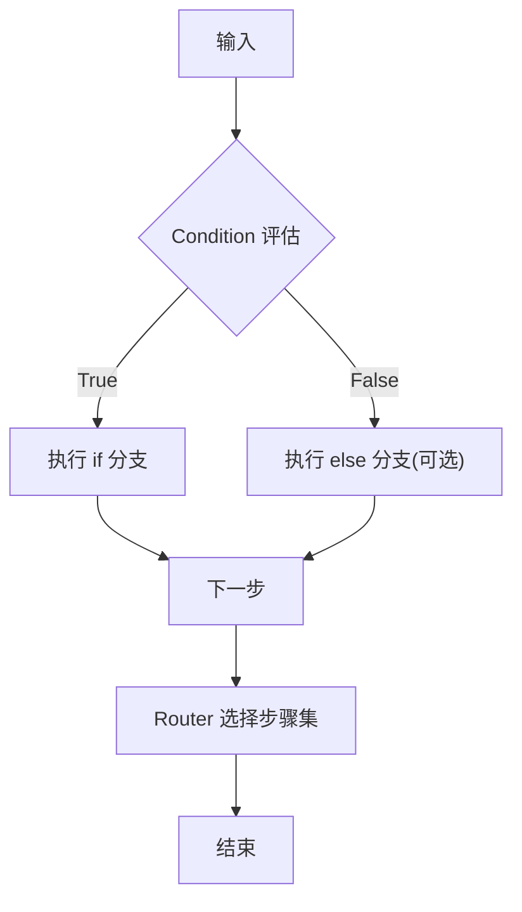
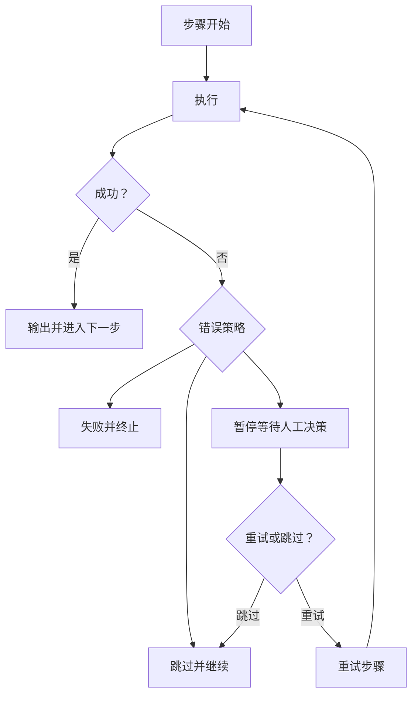
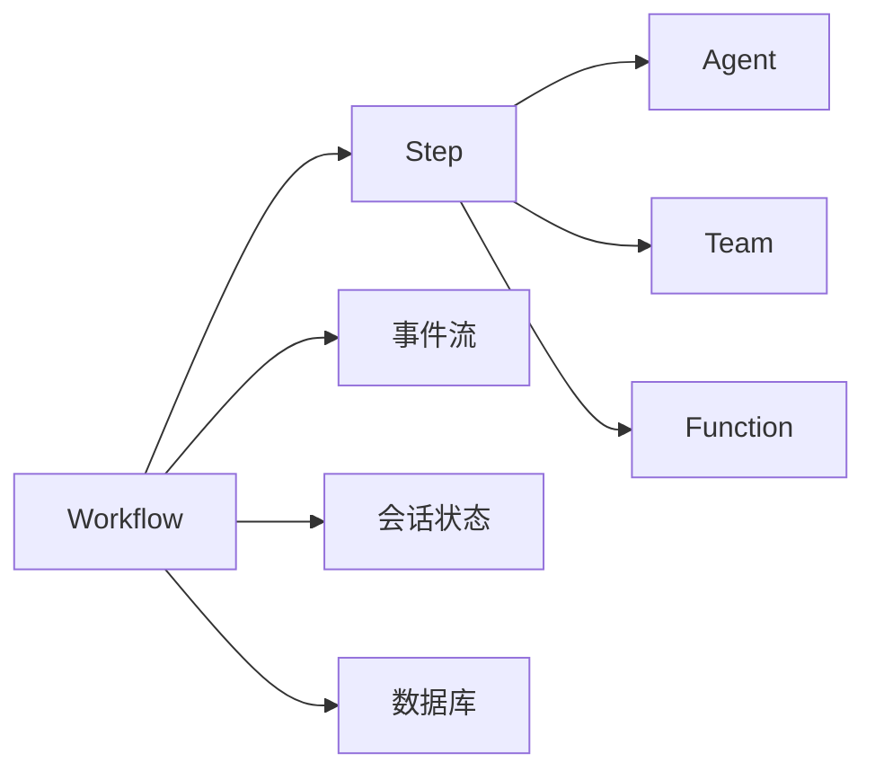

# 工作流应用

<cite>
**本文引用的文件**   
- [工作流概览](file://workflows/overview.mdx)
- [构建工作流](file://workflows/building-workflows.mdx)
- [运行工作流](file://workflows/running-workflows.mdx)
- [工作流模式：条件分支](file://workflows/workflow-patterns/conditional-workflow.mdx)
- [工作流模式：自定义函数步骤](file://workflows/workflow-patterns/custom-function-step-workflow.mdx)
- [工作流会话状态与团队协作](file://examples/workflows/advanced-concepts/session-state/state-with-team.mdx)
- [工作流取消与运行控制](file://examples/workflows/advanced-concepts/run-control/cancel-run.mdx)
- [工作流事件存储与事件过滤](file://examples/workflows/advanced-concepts/run-control/event-storage.mdx)
- [工作流序列化与持久化](file://examples/workflows/advanced-concepts/run-control/workflow-serialization.mdx)
- [工作流人机交互：错误处理与重试](file://workflows/hitl/error-handling.mdx)
- [工作流人机交互：条件确认](file://workflows/hitl/condition.mdx)
- [工作流组件保存示例](file://examples/components/save-workflow.mdx)
- [生产应用总览（工作流卡片）](file://production/applications/overview.mdx)
- [会议转任务（应用说明）](file://production/applications/meeting-to-tasks.mdx)
- [潜在客户丰富化（应用说明）](file://production/applications/lead-enrichment.mdx)
- [销售通话分析器（应用说明）](file://production/applications/sales-call-analyzer.mdx)
- [竞争对手跟踪器（应用说明）](file://production/applications/competitor-tracker.mdx)
- [工作流运行输出参考](file://reference/workflows/run-output)
- [工作流类参考](file://reference/workflows/workflow)
</cite>

## 目录
1. [简介](#简介)
2. [项目结构](#项目结构)
3. [核心组件](#核心组件)
4. [架构总览](#架构总览)
5. [详细组件分析](#详细组件分析)
6. [依赖关系分析](#依赖关系分析)
7. [性能考虑](#性能考虑)
8. [故障排查指南](#故障排查指南)
9. [结论](#结论)
10. [附录](#附录)

## 简介
本技术文档面向“工作流应用”的设计与落地，系统阐述在该平台中如何通过“工作流”编排“智能体（Agent）”“团队（Team）”与“自定义函数”，实现可预测、可审计、可扩展的自动化流程。文档覆盖以下关键主题：
- 编排能力与步骤管理：顺序、并行、循环、条件与路由等组合模式
- 自动化流程：输入/输出数据流、事件流、状态持久化与会话管理
- 典型应用：会议转任务、潜在客户丰富化、销售通话分析器、竞争对手跟踪器
- 部署配置、触发条件与输出处理
- 状态管理、错误处理与重试策略
- 性能优化、并发控制与资源管理
- 定制开发与集成扩展方案

## 项目结构
围绕“工作流”的知识体系主要分布在以下区域：
- 概念与使用指南：工作流概览、构建工作流、运行工作流
- 模式与范式：条件分支、自定义函数步骤、并行/循环/路由等
- 人机交互与运行控制：错误处理、条件确认、取消与事件存储
- 生产应用：会议转任务、潜在客户丰富化、销售通话分析器、竞争对手跟踪器
- 参考与示例：运行输出、工作流类、组件保存与序列化

**章节来源**
- [工作流概览:1-102](file://workflows/overview.mdx#L1-L102)
- [构建工作流:1-59](file://workflows/building-workflows.mdx#L1-L59)
- [运行工作流:1-619](file://workflows/running-workflows.mdx#L1-L619)

## 核心组件
- 工作流（Workflow）：顶层编排器，负责步骤调度、事件收集、会话状态与持久化
- 步骤（Step）：最小执行单元，封装一个执行器（Agent/Team/自定义函数）
- 组合控制结构：Loop、Parallel、Condition、Router，用于复杂流程编排
- 执行器（Agent/Team/Function）：具体业务执行者
- 运行输出（WorkflowRunOutput）与事件（WorkflowRunOutputEvent）：统一的输出与事件模型
- 会话状态（Session State）：跨步骤共享的数据容器
- 数据库适配：SQLite/PostgreSQL 等，支持事件存储与会话持久化

**章节来源**
- [构建工作流:11-16](file://workflows/building-workflows.mdx#L11-L16)
- [运行工作流:7-77](file://workflows/running-workflows.mdx#L7-L77)
- [工作流运行输出参考](file://reference/workflows/run-output)
- [工作流类参考](file://reference/workflows/workflow)

## 架构总览
下图展示从“输入到输出”的端到端执行路径，以及事件流与状态持久化的关键节点。

**图表来源**
- [运行工作流:15-71](file://workflows/running-workflows.mdx#L15-L71)
- [运行工作流:527-598](file://workflows/running-workflows.mdx#L527-L598)

**章节来源**
- [运行工作流:1-619](file://workflows/running-workflows.mdx#L1-L619)

## 详细组件分析

### 会议转任务（Meeting to Tasks）
- 应用定位：从会议录音/转录中提取行动项，映射负责人并自动在项目系统中创建任务
- 计划功能要点：转录处理、行动项抽取与上下文、负责人识别、截止日期推断、任务创建、摘要生成、跟进提醒
- 典型步骤序列：接收转录/录音 → 行动项抽取与归属 → 映射到系统用户 → 创建任务并设置优先级/截止日 → 生成会议摘要
- 触发条件：新会议录制完成或收到转录；可基于时间计划或接口触发
- 输出处理：返回任务创建结果、摘要与后续提醒安排
- 集成建议：对接语音转写服务、项目管理系统（如 Linear）、日历提醒

**章节来源**
- [会议转任务（应用说明）:1-47](file://production/applications/meeting-to-tasks.mdx#L1-L47)

### 潜在客户丰富化（Lead Enrichment）
- 应用定位：自动从公开数据源（LinkedIn、公司网站等）丰富 CRM 中的联系人信息，提升线索质量
- 计划功能要点：LinkedIn 专业信息提取、公司信息采集、职位与级别识别、技术栈识别、融资与规模数据、意图信号检测、CRM 字段填充
- 典型步骤序列：接收 CRM 新线索 → 搜索 LinkedIn → 抽取专业详情 → 采集公司信息 → 识别购买信号 → 评分 → 更新 CRM
- 触发条件：CRM 新增线索或定期批量扫描
- 输出处理：返回评分与更新后的 CRM 记录
- 集成建议：对接 CRM API、LinkedIn API、公共数据源与反爬虫策略

**章节来源**
- [潜在客户丰富化（应用说明）:1-48](file://production/applications/lead-enrichment.mdx#L1-L48)

### 销售通话分析器（Sales Call Analyzer）
- 应用定位：对销售通话录音进行转录、关键时刻识别、异议检测与分类、对话动态分析、通话质量评分与教练反馈
- 计划功能要点：转录与说话人分离、关键讨论主题识别、异议与回应提取、谈听比分析、下一步提取、成交阶段推荐、教练反馈生成
- 典型步骤序列：接收通话录音 → 转录与说话人标注 → 关键时刻识别 → 异议与回应分析 → 对话动态评估 → 质量评分 → 教练洞察
- 触发条件：通话录音上传或转录完成后触发
- 输出处理：返回评分、洞察与改进建议
- 集成建议：对接语音转写、NLP 分析与合规存储

**章节来源**
- [销售通话分析器（应用说明）:1-47](file://production/applications/sales-call-analyzer.mdx#L1-L47)

### 竞争对手跟踪器（Competitor Tracker）
- 应用定位：监控竞争对手网站、博客与社交媒体，检测定价、功能与定位变化，生成情报报告并发送告警
- 计划功能要点：网站内容监控、定价页变更检测、功能对比跟踪、博客与新闻监控、社交媒体情感跟踪、竞争情报报告、告警通知
- 典型步骤序列：按计划抓取竞争对手网站 → 检测内容变更 → 分类变更类型（定价/功能/定位）→ 与历史快照对比 → 生成变更摘要 → 发送告警 → 更新竞争情报库
- 触发条件：定时调度或手动触发
- 输出处理：返回变更摘要与告警
- 集成建议：对接网页抓取工具、变更检测算法与消息通道

**章节来源**
- [竞争对手跟踪器（应用说明）:1-48](file://production/applications/competitor-tracker.mdx#L1-L48)

### 工作流编排与步骤管理
- 步骤类型：Agent（智能体）、Team（团队）、Function（自定义函数）
- 组合模式：顺序、并行（Parallel）、循环（Loop）、条件（Condition）、路由（Router）
- 数据流：StepInput/StepOutput 标准化输入输出，确保跨步骤数据一致性
- 事件流：支持工作流启动/完成、步骤开始/完成、条件/并行/循环/路由执行事件
- 会话状态：通过 session_state 在步骤间共享与更新状态，支持团队协作式状态维护

**章节来源**
- [构建工作流:9-32](file://workflows/building-workflows.mdx#L9-L32)
- [工作流模式：自定义函数步骤:1-34](file://workflows/workflow-patterns/custom-function-step-workflow.mdx#L1-L34)
- [工作流会话状态与团队协作:187-222](file://examples/workflows/advanced-concepts/session-state/state-with-team.mdx#L187-L222)

### 条件分支与路由
- 条件（Condition）：基于评估函数在 if/else 分支之间切换；可结合人机交互（确认/拒绝）决定分支
- 路由（Router）：根据规则选择下一步骤集合
- 事件：条件执行开始/完成事件，便于可观测性与调试

**章节来源**
- [工作流模式：条件分支:1-37](file://workflows/workflow-patterns/conditional-workflow.mdx#L1-L37)
- [工作流人机交互：条件确认:65-107](file://workflows/hitl/condition.mdx#L65-L107)
- [运行工作流:462-525](file://workflows/running-workflows.mdx#L462-L525)

### 并行执行与循环
- 并行（Parallel）：多个步骤同时执行，聚合输出
- 循环（Loop）：重复执行直到满足条件
- 事件：并行/循环开始/完成事件，便于性能分析与问题定位

**章节来源**
- [运行工作流:488-517](file://workflows/running-workflows.mdx#L488-L517)

### 事件存储与事件过滤
- 存储：可通过 store_events=True 自动存储所有执行事件
- 过滤：通过 events_to_skip 控制噪声，仅保留关键事件
- 访问：通过 run_response.events 或数据库 runs 列访问

**章节来源**
- [运行工作流:527-598](file://workflows/running-workflows.mdx#L527-L598)

### 会话状态管理与团队协作
- 通过 session_state 在步骤间共享状态（如步骤列表、分配、状态、优先级）
- 团队协作：管理团队负责添加/删除步骤，状态管理团队负责更新状态与分配
- 示例：打印当前步骤清单、更新状态与重新分配

**章节来源**
- [工作流会话状态与团队协作:88-222](file://examples/workflows/advanced-concepts/session-state/state-with-team.mdx#L88-L222)

### 错误处理与重试策略
- 失败策略：fail（立即失败）、skip（跳过继续）、pause（暂停等待人工决策）
- 重试行为：根据错误类型（超时、限流、无效输入、资源不可用）采取不同策略
- 交互：在 pause 模式下，可对单步进行 retry/skip

**章节来源**
- [工作流人机交互：错误处理与重试:42-183](file://workflows/hitl/error-handling.mdx#L42-L183)

### 取消与运行控制
- 支持在运行过程中取消，取消后状态标记为 cancelled
- 可通过延时函数在运行中触发取消
- 取消后仍可读取最终运行结果与事件

**章节来源**
- [工作流取消与运行控制:72-108](file://examples/workflows/advanced-concepts/run-control/cancel-run.mdx#L72-L108)
- [运行工作流:81-197](file://workflows/running-workflows.mdx#L81-L197)

### 序列化与持久化
- 工作流可序列化保存与加载，便于版本化与复用
- 通过数据库持久化工作流定义、会话与事件

**章节来源**
- [工作流序列化与持久化:69-101](file://examples/workflows/advanced-concepts/run-control/workflow-serialization.mdx#L69-L101)
- [工作流组件保存示例:81-96](file://examples/components/save-workflow.mdx#L81-L96)

## 依赖关系分析
- 组件耦合：Workflow 依赖 Step/Agent/Team/Function；Step 依赖执行器；事件与会话依赖数据库
- 外部依赖：语音转写、CRM/项目系统、网页抓取、消息通道等
- 可能的循环依赖：通过组合控制结构避免直接循环；若存在自引用，需通过条件/循环终止

**图表来源**
- [构建工作流:11-16](file://workflows/building-workflows.mdx#L11-L16)
- [运行工作流:527-598](file://workflows/running-workflows.mdx#L527-L598)

**章节来源**
- [构建工作流:1-59](file://workflows/building-workflows.mdx#L1-L59)
- [运行工作流:1-619](file://workflows/running-workflows.mdx#L1-L619)

## 性能考虑
- 并发控制：合理使用 Parallel 以提升吞吐；注意外部服务限流与资源配额
- 事件存储：在调试阶段开启全量事件存储；生产环境通过 events_to_skip 减少噪声与存储开销
- 流式输出：启用 stream/stream_events 获取实时反馈，降低感知延迟
- 会话与持久化：选择合适的数据库与表结构，避免大字段频繁写入
- 模型与算力：根据任务复杂度选择合适模型与批处理策略

[本节为通用性能建议，不直接分析特定文件]

## 故障排查指南
- 查看事件：通过 run_response.events 或数据库 runs 列定位异常步骤与时间点
- 过滤噪声：在生产环境跳过 verbose 事件，聚焦关键事件
- 重试策略：针对超时/限流场景设置指数退避与最大重试次数
- 人机交互：在 pause 模式下逐个处理错误步骤，必要时取消并回滚
- 取消与恢复：在运行中取消后，检查最终状态与内容，必要时重建会话继续

**章节来源**
- [运行工作流:527-598](file://workflows/running-workflows.mdx#L527-L598)
- [工作流人机交互：错误处理与重试:42-183](file://workflows/hitl/error-handling.mdx#L42-L183)
- [工作流取消与运行控制:72-108](file://examples/workflows/advanced-concepts/run-control/cancel-run.mdx#L72-L108)

## 结论
通过“工作流”对“智能体/团队/函数”的统一编排，可以将复杂的业务流程转化为可预测、可审计、可扩展的自动化系统。结合事件存储、会话状态、条件/并行/循环/路由等模式，以及完善的错误处理与运行控制能力，能够支撑从会议转任务、潜在客户丰富化到销售通话分析与竞争对手跟踪等多样化应用场景。建议在生产环境中重视事件过滤、并发控制与资源管理，并通过序列化与持久化保障可运维性与可演进性。

[本节为总结性内容，不直接分析特定文件]

## 附录
- 参考文档
  - [工作流运行输出参考](file://reference/workflows/run-output)
  - [工作流类参考](file://reference/workflows/workflow)
- 生产应用导航
  - [生产应用总览（工作流卡片）:132-163](file://production/applications/overview.mdx#L132-L163)