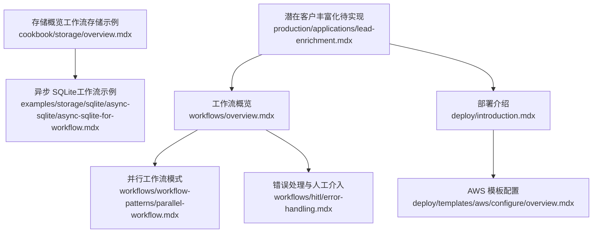
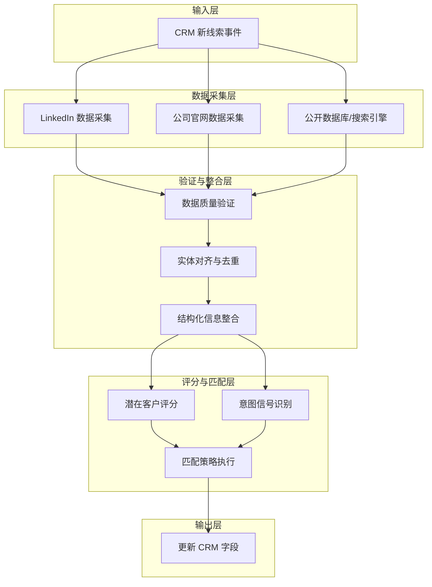
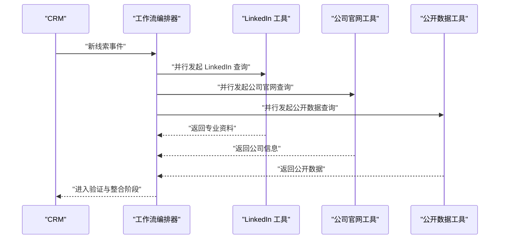
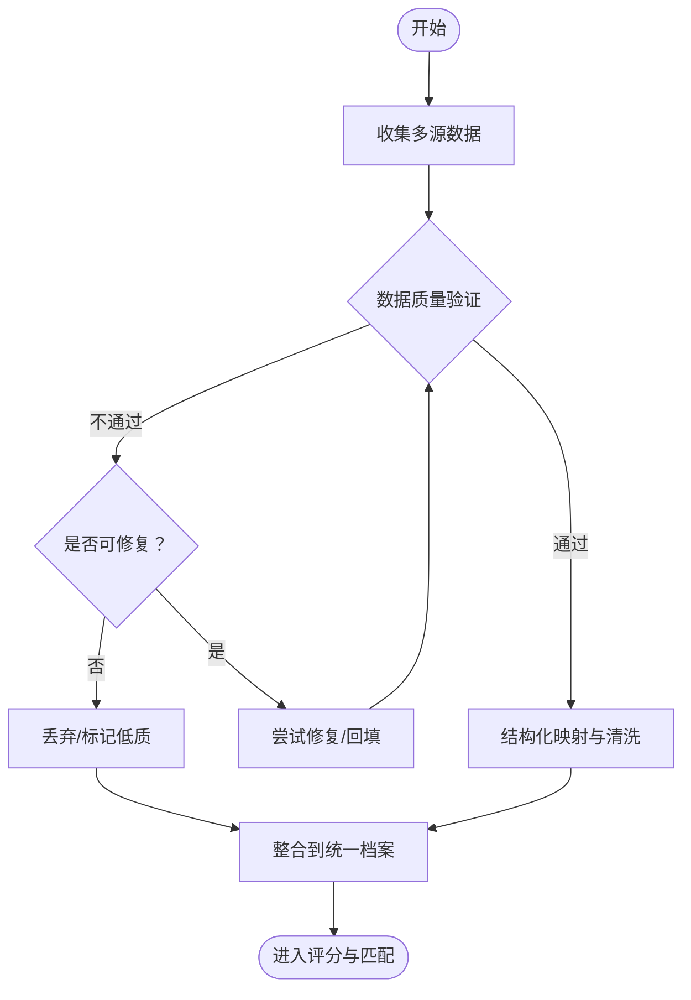
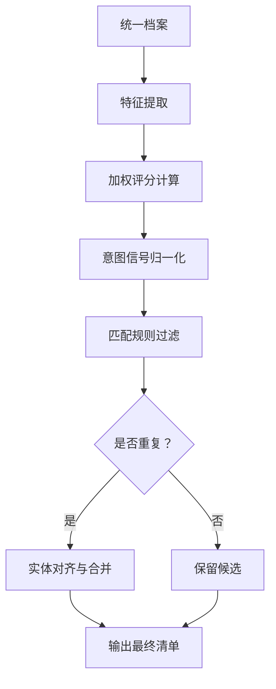
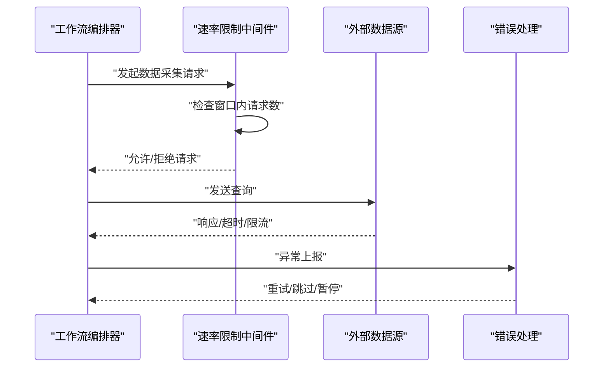
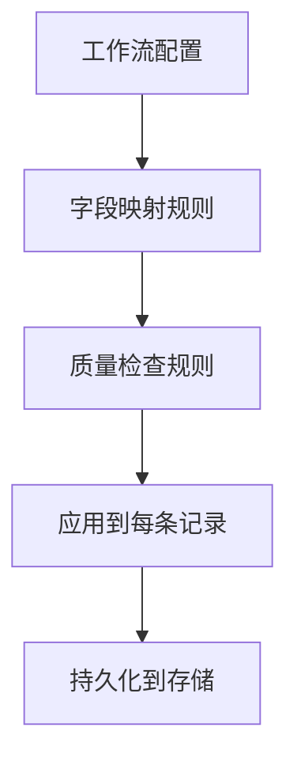
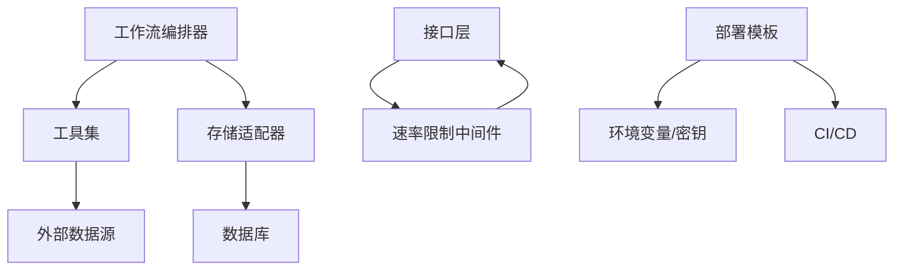
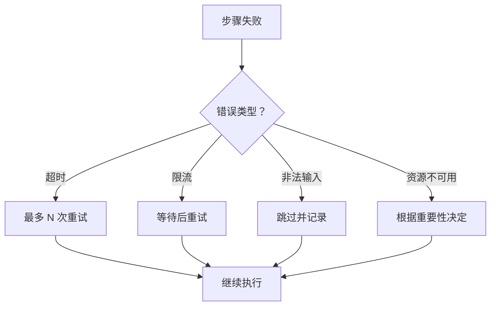

# 潜在客户丰富化工作流

<cite>
**本文档引用的文件**
- [潜在客户丰富化（待实现）](file://production/applications/lead-enrichment.mdx)
- [潜在客户丰富化（部署页面）](file://deploy/apps/workflows/lead-enrichment.mdx)
- [工作流概览](file://workflows/overview.mdx)
- [工作流并行执行](file://workflows/workflow-patterns/parallel-workflow.mdx)
- [工作流错误处理与人工介入](file://workflows/hitl/error-handling.mdx)
- [存储概览（工作流存储示例）](file://cookbook/storage/overview.mdx)
- [SQLite 异步存储（工作流示例）](file://examples/storage/sqlite/async-sqlite/async-sqlite-for-workflow.mdx)
- [自定义中间件（速率限制示例）](file://examples/agent-os/middleware/agent-os-with-custom-middleware.mdx)
- [部署介绍](file://deploy/introduction.mdx)
- [AWS 部署模板配置](file://deploy/templates/aws/configure/overview.mdx)
</cite>

## 目录
1. [简介](#简介)
2. [项目结构](#项目结构)
3. [核心组件](#核心组件)
4. [架构总览](#架构总览)
5. [详细组件分析](#详细组件分析)
6. [依赖关系分析](#依赖关系分析)
7. [性能考虑](#性能考虑)
8. [故障排查指南](#故障排查指南)
9. [结论](#结论)
10. [附录](#附录)

## 简介
本技术文档面向“潜在客户丰富化工作流”应用，基于现有仓库中的工作流框架能力与最佳实践，系统化阐述如何构建一个自动化收集与丰富潜在客户信息的端到端工作流。文档覆盖数据输入、外部数据源查询、信息验证与整合、评分与匹配策略、去重逻辑、并发处理、速率限制与错误恢复机制，并提供可落地的部署配置与最佳实践建议。

当前仓库中已存在“潜在客户丰富化（待实现）”与“潜在客户丰富化（部署页面）”两个占位页面，表明该应用处于规划或即将上线阶段；但工作流框架、并行执行、错误处理、存储持久化与部署模板等能力已在仓库中完整呈现，足以支撑本应用的快速落地与扩展。

## 项目结构
围绕潜在客户丰富化工作流，仓库中与之直接相关的知识域包括：
- 工作流基础与模式：工作流概览、并行工作流模式
- 错误处理与人工介入：工作流错误处理与人工干预
- 存储与会话状态：工作流存储示例与异步 SQLite 使用
- 部署与运行：部署介绍、AWS 模板配置

下图展示与潜在客户丰富化工作流相关的知识域与文件映射：

**图表来源**
- [工作流概览:1-102](file://workflows/overview.mdx#L1-L102)
- [工作流并行执行:1-44](file://workflows/workflow-patterns/parallel-workflow.mdx#L1-L44)
- [工作流错误处理与人工介入:42-183](file://workflows/hitl/error-handling.mdx#L42-L183)
- [存储概览（工作流存储示例）:170-185](file://cookbook/storage/overview.mdx#L170-L185)
- [SQLite 异步存储（工作流示例）:74-97](file://examples/storage/sqlite/async-sqlite/async-sqlite-for-workflow.mdx#L74-L97)
- [部署介绍:1-102](file://deploy/introduction.mdx#L1-L102)
- [AWS 部署模板配置:40-74](file://deploy/templates/aws/configure/overview.mdx#L40-L74)
- [潜在客户丰富化（待实现）:1-47](file://production/applications/lead-enrichment.mdx#L1-L47)

**章节来源**
- [工作流概览:1-102](file://workflows/overview.mdx#L1-L102)
- [部署介绍:1-102](file://deploy/introduction.mdx#L1-L102)

## 核心组件
- 工作流编排器：负责定义步骤、控制执行顺序与并发、管理会话状态与输出。
- 并行执行引擎：支持独立任务并发执行，缩短整体处理时延。
- 错误处理与人工介入：提供暂停、重试、跳过等策略，结合人工决策保障可靠性。
- 存储与持久化：通过数据库适配器（如 PostgreSQL、SQLite、内存）保存工作流状态与中间结果。
- 外部工具与数据源：通过工具调用对接外部数据源（如 LinkedIn、公司网站、公开数据库），并进行抽取与整合。
- 速率限制与安全：通过中间件或接口层实现请求节流与密钥管理。

**章节来源**
- [工作流概览:49-68](file://workflows/overview.mdx#L49-L68)
- [工作流并行执行:21-40](file://workflows/workflow-patterns/parallel-workflow.mdx#L21-L40)
- [工作流错误处理与人工介入:61-86](file://workflows/hitl/error-handling.mdx#L61-L86)
- [存储概览（工作流存储示例）:176-185](file://cookbook/storage/overview.mdx#L176-L185)
- [自定义中间件（速率限制示例）:40-67](file://examples/agent-os/middleware/agent-os-with-custom-middleware.mdx#L40-L67)

## 架构总览
潜在客户丰富化工作流的整体架构由“输入接收—并行数据采集—验证与整合—评分与匹配—去重—更新 CRM”的流水线构成。下图给出概念性架构示意（非具体代码映射）：

[此图为概念性架构示意，不对应具体源码文件，故无“图表来源”标注]

## 详细组件分析

### 组件一：数据输入与外部数据源查询
- 输入来源：CRM 新建线索事件触发工作流。
- 外部数据源：LinkedIn 专业资料、公司官网、公开数据库与搜索引擎。
- 执行方式：并行采集多个数据源，减少等待时间；失败时按策略重试或跳过。
- 工具与接口：通过工具调用封装外部 API，统一异常处理与重试逻辑。

[此图为概念性流程示意，不对应具体源码文件，故无“图表来源”标注]

**章节来源**
- [工作流并行执行:21-40](file://workflows/workflow-patterns/parallel-workflow.mdx#L21-L40)
- [工作流错误处理与人工介入:154-178](file://workflows/hitl/error-handling.mdx#L154-L178)

### 组件二：信息验证与数据整合
- 数据质量验证：一致性校验、字段完整性检查、来源可信度评估。
- 结构化整合：将多源异构数据映射到统一模型，生成标准化的潜在客户档案。
- 会话状态管理：使用工作流会话状态保存中间结果，便于后续步骤复用。

[此图为概念性流程示意，不对应具体源码文件，故无“图表来源”标注]

**章节来源**
- [工作流错误处理与人工介入:154-178](file://workflows/hitl/error-handling.mdx#L154-L178)
- [存储概览（工作流存储示例）:176-185](file://cookbook/storage/overview.mdx#L176-L185)

### 组件三：客户评分算法、匹配策略与去重逻辑
- 客户评分：综合职位层级、公司规模/融资轮次、技术栈契合度、意图信号等维度计算分数。
- 匹配策略：基于职位关键词、行业标签、地区偏好等规则进行初步筛选与优先级排序。
- 去重逻辑：以邮箱、LinkedIn ID、公司域名等关键字段进行实体对齐与去重，保留最高置信度记录。

[此图为概念性流程示意，不对应具体源码文件，故无“图表来源”标注]

### 组件四：并发处理、速率限制与错误恢复
- 并发处理：利用并行步骤同时拉取多个数据源，显著降低端到端延迟。
- 速率限制：通过中间件实现基于时间窗口的请求数量控制，避免外部服务限流。
- 错误恢复：支持暂停等待人工决策、自动重试与跳过策略，结合会话状态实现断点续跑。

**图表来源**
- [自定义中间件（速率限制示例）:40-67](file://examples/agent-os/middleware/agent-os-with-custom-middleware.mdx#L40-L67)
- [工作流错误处理与人工介入:42-86](file://workflows/hitl/error-handling.mdx#L42-L86)

**章节来源**
- [工作流并行执行:21-40](file://workflows/workflow-patterns/parallel-workflow.mdx#L21-L40)
- [自定义中间件（速率限制示例）:40-67](file://examples/agent-os/middleware/agent-os-with-custom-middleware.mdx#L40-L67)
- [工作流错误处理与人工介入:61-86](file://workflows/hitl/error-handling.mdx#L61-L86)

### 组件五：配置选项、数据映射规则与质量检查机制
- 配置选项：工作流 ID、步骤名称、并行组名、会话状态键、存储适配器参数。
- 数据映射规则：将外部字段映射到内部标准字段（如邮箱、职位、公司、技术栈）。
- 质量检查：字段必填性、格式合法性、范围合理性、来源一致性。

[此图为概念性流程示意，不对应具体源码文件，故无“图表来源”标注]

**章节来源**
- [工作流概览:58-68](file://workflows/overview.mdx#L58-L68)
- [存储概览（工作流存储示例）:176-185](file://cookbook/storage/overview.mdx#L176-L185)

## 依赖关系分析
- 工作流依赖于工具与外部数据源，工具调用需具备稳定的网络与认证配置。
- 存储依赖于数据库连接与迁移脚本，生产环境需确保连接池与事务一致性。
- 中间件依赖于网络与时间窗口参数，需根据外部服务 SLA 调整阈值。
- 部署模板提供环境变量、密钥管理与 CI/CD 流程，保障安全与可重复发布。

**图表来源**
- [工作流概览:1-102](file://workflows/overview.mdx#L1-L102)
- [部署介绍:1-102](file://deploy/introduction.mdx#L1-L102)
- [AWS 部署模板配置:40-74](file://deploy/templates/aws/configure/overview.mdx#L40-L74)

**章节来源**
- [部署介绍:1-102](file://deploy/introduction.mdx#L1-L102)
- [AWS 部署模板配置:40-74](file://deploy/templates/aws/configure/overview.mdx#L40-L74)

## 性能考虑
- 并行优先：尽可能将独立的数据采集步骤并行化，缩短端到端时延。
- 缓存与去重：对高频查询结果进行缓存，避免重复抓取；在整合阶段实施去重，减少无效计算。
- 分批与限速：对外部服务采用分批请求与指数退避重试，遵守速率限制。
- 存储优化：选择合适的存储后端（如异步 SQLite 或 PostgreSQL），合理设计索引与分区。
- 监控与可观测性：记录关键指标（成功率、延迟、重试次数），以便持续优化。

[本节为通用性能建议，不直接分析具体文件，故无“章节来源”标注]

## 故障排查指南
- 常见错误场景与处理建议：
  - 网络超时：自动重试若干次，超过阈值则跳过并记录日志。
  - 速率限制：等待固定时间后重试，或切换备用数据源。
  - 输入非法：直接跳过该步骤，避免无效循环。
  - 资源不可用：根据关键性决定重试或跳过。
- 人工介入：当步骤失败且需要人工决策时，工作流可暂停等待用户选择“重试/跳过”。

**图表来源**
- [工作流错误处理与人工介入:154-178](file://workflows/hitl/error-handling.mdx#L154-L178)

**章节来源**
- [工作流错误处理与人工介入:61-86](file://workflows/hitl/error-handling.mdx#L61-L86)
- [工作流错误处理与人工介入:154-178](file://workflows/hitl/error-handling.mdx#L154-L178)

## 结论
通过工作流框架的并行执行、错误处理与存储持久化能力，潜在客户丰富化工作流可在保证可靠性的同时显著提升吞吐与质量。结合速率限制中间件与部署模板的最佳实践，可实现从开发到生产的平滑落地。尽管当前仓库中“潜在客户丰富化”仍为占位页面，但现有能力足以支撑该应用的快速实现与迭代。

[本节为总结性内容，不直接分析具体文件，故无“章节来源”标注]

## 附录

### 部署配置示例与最佳实践
- 选择模板：黑胶画布或预置解决方案，按需扩展应用。
- 添加应用：将潜在客户丰富化工作流作为应用接入部署。
- 连接接口：通过 Slack、Discord、MCP 或自定义 UI 对外暴露。
- AWS 模板要点：数据库表定义与迁移、环境变量与密钥管理、Python 依赖、CI/CD 自动化、HTTPS 与域名配置。

**章节来源**
- [部署介绍:1-102](file://deploy/introduction.mdx#L1-L102)
- [AWS 部署模板配置:40-74](file://deploy/templates/aws/configure/overview.mdx#L40-L74)

### 工作流存储与会话状态参考
- 工作流存储示例：使用 PostgreSQL/SQLite/内存数据库保存工作流状态与版本。
- 异步 SQLite 示例：演示工作流在异步场景下的持久化与加载。

**章节来源**
- [存储概览（工作流存储示例）:176-185](file://cookbook/storage/overview.mdx#L176-L185)
- [SQLite 异步存储（工作流示例）:74-97](file://examples/storage/sqlite/async-sqlite/async-sqlite-for-workflow.mdx#L74-L97)