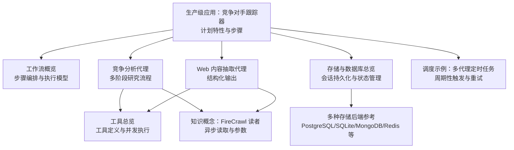
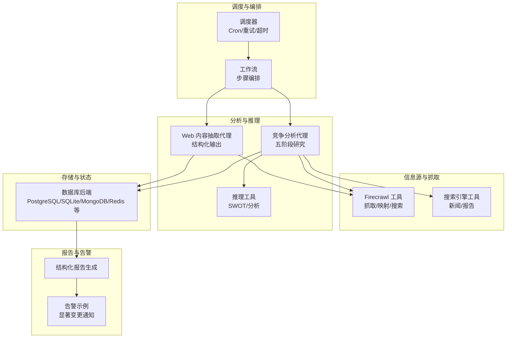
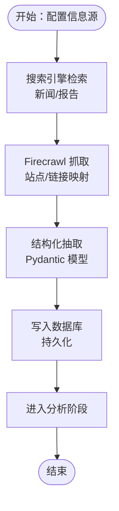
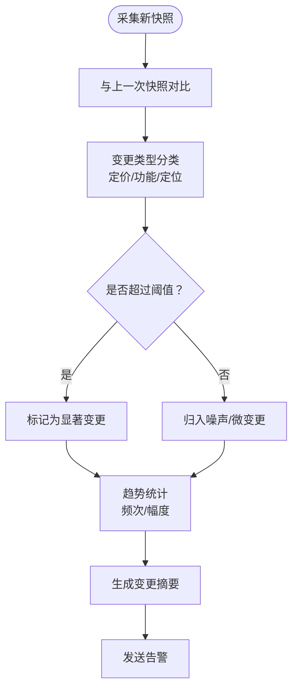
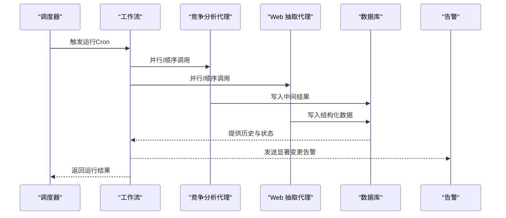
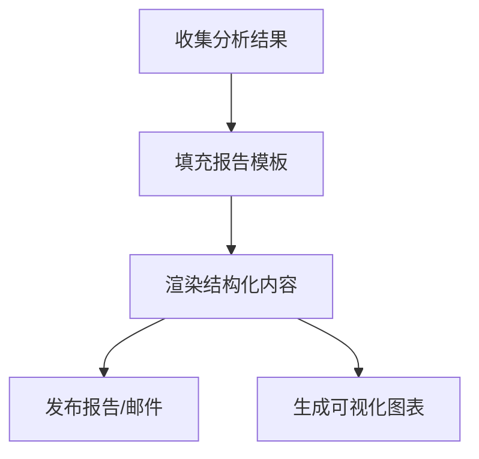
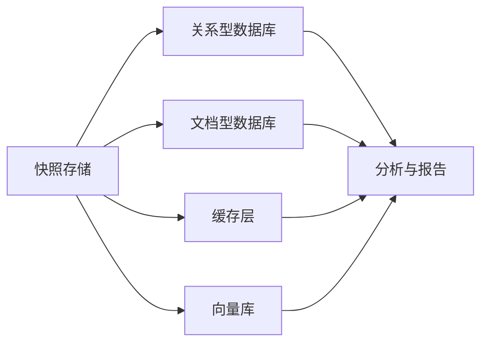
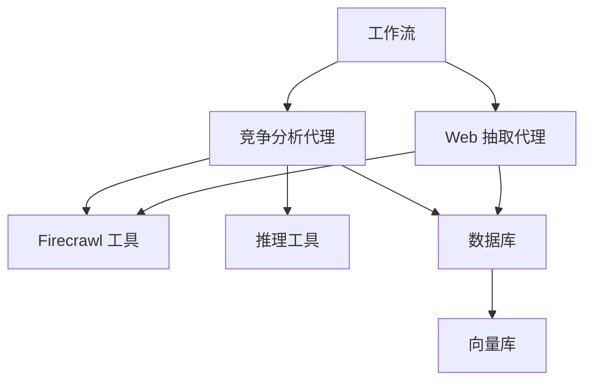

# 竞争对手跟踪器工作流

<cite>
**本文引用的文件**
- [生产级应用：竞争对手跟踪器](file://production/applications/competitor-tracker.mdx)
- [部署模板：竞争对手跟踪器](file://deploy/apps/workflows/competitor-tracker.mdx)
- [竞争分析代理](file://cookbook/agents/competitor-analysis-agent.mdx)
- [工作流概览](file://workflows/overview.mdx)
- [存储与数据库总览](file://database/overview.mdx)
- [存储：概述](file://cookbook/storage/overview.mdx)
- [工具总览](file://tools/overview.mdx)
- [调度示例：多代理定时任务](file://examples/agent-os/scheduler/multi-agent-schedules.mdx)
- [Web 内容抽取代理](file://cookbook/agents/web-extraction-agent.mdx)
- [知识概念：FireCrawl 读者](file://knowledge/concepts/readers/firecrawl-reader-async.mdx)
- [FireCrawl 工具参考](file://reference/knowledge/reader/firecrawl.mdx)
- [数据库：MongoDB 参考](file://reference/storage/mongodb.mdx)
- [数据库：PostgreSQL 参考](file://reference/storage/postgres.mdx)
- [数据库：SQLite 参考](file://reference/storage/sqlite.mdx)
- [数据库：SingleStore 参考](file://reference/storage/singlestore.mdx)
- [数据库：In-Memory 参考](file://reference/storage/memory.mdx)
- [数据库：DynamoDB 参考](file://reference/storage/dynamodb.mdx)
- [数据库：Firestore 参考](file://reference/storage/firestore.mdx)
- [数据库：GCS 参考](file://reference/storage/gcs.mdx)
- [数据库：JSON 参考](file://reference/storage/json.mdx)
- [数据库：Redis 参考](file://reference/storage/redis.mdx)
- [数据库：MySQL 参考](file://reference/storage/mysql.mdx)
- [数据库：SurrealDB 参考](file://reference/storage/surrealdb.mdx)
- [数据库：S3 参考](file://reference/storage/s3.mdx)
- [数据库：Supabase 参考](file://reference/storage/supabase.mdx)
- [数据库：Neon 参考](file://reference/storage/neon.mdx)
- [数据库：Cloudflare R2 参考](file://reference/storage/r2.mdx)
- [数据库：Azure Cosmos MongoDB 参考](file://reference/storage/azure_cosmos_mongodb.mdx)
- [数据库：LangChain 参考](file://reference/storage/langchain.mdx)
- [数据库：Lightrag 参考](file://reference/storage/lightrag.mdx)
- [数据库：LlamaIndex 参考](file://reference/storage/llamaindex.mdx)
- [数据库：Weaviate 参考](file://reference/storage/weaviate.mdx)
- [数据库：Upstash 参考](file://reference/storage/upstash.mdx)
- [数据库：ClickHouse 参考](file://reference/storage/clickhouse.mdx)
- [数据库：Cassandra 参考](file://reference/storage/cassandra.mdx)
- [数据库：Milvus 参考](file://reference/storage/milvus.mdx)
- [数据库：Couchbase 参考](file://reference/storage/couchbase.mdx)
- [数据库：Pinecone 参考](file://reference/storage/pinecone.mdx)
- [数据库：Qdrant 参考](file://reference/storage/qdrant.mdx)
- [数据库：Chroma 参考](file://reference/storage/chroma.mdx)
- [数据库：LanceDB 参考](file://reference/storage/lancedb.mdx)
- [数据库：PGVector 参考](file://reference/storage/pgvector.mdx)
- [数据库：Redis 向量库参考](file://reference/storage/redis-vector.mdx)
- [数据库：SingleStore 向量库参考](file://reference/storage/singlestore-vector.mdx)
- [数据库：SurrealDB 向量库参考](file://reference/storage/surrealdb-vector.mdx)
- [数据库：Weaviate 向量库参考](file://reference/storage/weaviate-vector.mdx)
- [数据库：Upstash 向量库参考](file://reference/storage/upstash-vector.mdx)
- [数据库：ClickHouse 向量库参考](file://reference/storage/clickhouse-vector.mdx)
- [数据库：Cassandra 向量库参考](file://reference/storage/cassandra-vector.mdx)
- [数据库：Milvus 向量库参考](file://reference/storage/milvus-vector.mdx)
- [数据库：Couchbase 向量库参考](file://reference/storage/couchbase-vector.mdx)
- [数据库：Pinecone 向量库参考](file://reference/storage/pinecone-vector.mdx)
- [数据库：Qdrant 向量库参考](file://reference/storage/qdrant-vector.mdx)
- [数据库：Chroma 向量库参考](file://reference/storage/chroma-vector.mdx)
- [数据库：LanceDB 向量库参考](file://reference/storage/lancedb-vector.mdx)
- [数据库：PGVector 向量库参考](file://reference/storage/pgvector-vector.mdx)
- [数据库：MongoDB 向量库参考](file://reference/storage/mongodb-vector.mdx)
- [数据库：Neo4j 参考](file://reference/storage/neo4j.mdx)
- [数据库：ArangoDB 参考](file://reference/storage/arangodb.mdx)
- [数据库：Dgraph 参考](file://reference/storage/dgraph.mdx)
- [数据库：JanusGraph 参考](file://reference/storage/janusgraph.mdx)
- [数据库：CrateDB 参考](file://reference/storage/cratedb.mdx)
- [数据库：QuestDB 参考](file://reference/storage/questdb.mdx)
- [数据库：TimescaleDB 参考](file://reference/storage/timescaledb.mdx)
- [数据库：CockroachDB 参考](file://reference/storage/cockroachdb.mdx)
- [数据库：YugabyteDB 参考](file://reference/storage/yugabytedb.mdx)
- [数据库：ScyllaDB 参考](file://reference/storage/scylladb.mdx)
- [数据库：RisingWave 参考](file://reference/storage/risingwave.mdx)
- [数据库：DuckDB 参考](file://reference/storage/duckdb.mdx)
- [数据库：OpenSearch 参考](file://reference/storage/opensearch.mdx)
- [数据库：Elasticsearch 参考](file://reference/storage/elasticsearch.mdx)
- [数据库：Solr 参考](file://reference/storage/solr.mdx)
- [数据库：Typesense 参考](file://reference/storage/typesense.mdx)
- [数据库：Meilisearch 参考](file://reference/storage/meilisearch.mdx)
- [数据库：Zilliz 参考](file://reference/storage/zilliz.mdx)
- [数据库：Vearch 参考](file://reference/storage/vearch.mdx)
- [数据库：Hydrogen 参考](file://reference/storage/hydrogen.mdx)
- [数据库：Kinetica 参考](file://reference/storage/kinetica.mdx)
- [数据库：MapD 参考](file://reference/storage/mapd.mdx)
- [数据库：Perspective 参考](file://reference/storage/perspective.mdx)
- [数据库：RethinkDB 参考](file://reference/storage/rethinkdb.mdx)
- [数据库：CockroachDB 参考](file://reference/storage/cockroachdb.mdx)
- [数据库：YugabyteDB 参考](file://reference/storage/yugabytedb.mdx)
- [数据库：ScyllaDB 参考](file://reference/storage/scylladb.mdx)
- [数据库：RisingWave 参考](file://reference/storage/risingwave.mdx)
- [数据库：DuckDB 参考](file://reference/storage/duckdb.mdx)
- [数据库：OpenSearch 参考](file://reference/storage/opensearch.mdx)
- [数据库：Elasticsearch 参考](file://reference/storage/elasticsearch.mdx)
- [数据库：Solr 参考](file://reference/storage/solr.mdx)
- [数据库：Typesense 参考](file://reference/storage/typesense.mdx)
- [数据库：Meilisearch 参考](file://reference/storage/meilisearch.mdx)
- [数据库：Zilliz 参考](file://reference/storage/zilliz.mdx)
- [数据库：Vearch 参考](file://reference/storage/vearch.mdx)
- [数据库：Hydrogen 参考](file://reference/storage/hydrogen.mdx)
- [数据库：Kinetica 参考](file://reference/storage/kinetica.mdx)
- [数据库：MapD 参考](file://reference/storage/mapd.mdx)
- [数据库：Perspective 参考](file://reference/storage/perspective.mdx)
- [数据库：RethinkDB 参考](file://reference/storage/rethinkdb.mdx)
</cite>

## 目录
1. [简介](#简介)
2. [项目结构](#项目结构)
3. [核心组件](#核心组件)
4. [架构总览](#架构总览)
5. [详细组件分析](#详细组件分析)
6. [依赖关系分析](#依赖关系分析)
7. [性能考量](#性能考量)
8. [故障排查指南](#故障排查指南)
9. [结论](#结论)
10. [附录](#附录)

## 简介
本技术文档面向“竞争对手跟踪器工作流”应用，系统化阐述其自动化监控与分析竞争对手动态的能力边界与实现路径。基于仓库中的现有材料，我们将从信息源配置（网站爬取、搜索引擎）、内容抓取与结构化抽取、变化检测与趋势分析、监控范围与告警、报告生成、数据更新频率与存储策略、以及可视化展示与部署配置等方面进行深入解析，并给出可操作的最佳实践。

## 项目结构
围绕竞争对手跟踪器工作流，仓库中与之直接相关的内容主要分布在以下区域：
- 应用与部署：生产级应用页面与部署模板
- 工作流与代理：工作流概览、竞争分析代理、Web 内容抽取代理
- 存储与数据库：数据库总览与多种存储后端参考
- 工具与接口：工具总览、FireCrawl 工具与读者、调度示例
- 知识与向量库：FireCrawl 读者与向量库参考

**图表来源**
- [生产级应用：竞争对手跟踪器:11-35](file://production/applications/competitor-tracker.mdx#L11-L35)
- [工作流概览:21-47](file://workflows/overview.mdx#L21-L47)
- [竞争分析代理:20-90](file://cookbook/agents/competitor-analysis-agent.mdx#L20-L90)
- [Web 内容抽取代理:20-90](file://cookbook/agents/web-extraction-agent.mdx#L20-L90)
- [工具总览:50-174](file://tools/overview.mdx#L50-L174)
- [知识概念：FireCrawl 读者:55-85](file://knowledge/concepts/readers/firecrawl-reader-async.mdx#L55-L85)
- [存储与数据库总览:20-103](file://database/overview.mdx#L20-L103)
- [调度示例：多代理定时任务:32-70](file://examples/agent-os/scheduler/multi-agent-schedules.mdx#L32-L70)

**章节来源**
- [生产级应用：竞争对手跟踪器:1-48](file://production/applications/competitor-tracker.mdx#L1-L48)
- [工作流概览:1-102](file://workflows/overview.mdx#L1-L102)
- [存储与数据库总览:1-130](file://database/overview.mdx#L1-L130)

## 核心组件
- 信息源与抓取层
  - 网站内容抓取：使用 Firecrawl 工具进行站点抓取、链接映射与格式化输出（Markdown/HTML/Links），支持限制抓取深度与结果数量。
  - 搜索引擎与新闻聚合：通过搜索引擎工具获取近期新闻与行业报告，辅助发现与验证竞争对手信息。
  - 结构化抽取：利用 Pydantic 模型对网页内容进行结构化抽取，确保跨站点一致性。
- 分析与推理层
  - 多阶段研究流程：发现—识别—分析—比较—合成—报告，贯穿推理工具以提升透明度与可解释性。
  - SWOT 分析与对比矩阵：对多个竞争对手进行特征、定价与定位的系统化比较。
- 工作流编排层
  - 步骤式流水线：顺序、并行、循环与条件分支，形成可重复、可观测的执行路径。
  - 会话与状态：通过数据库后端持久化会话、历史与中间状态，支撑跨轮次上下文与审计追踪。
- 监控与调度层
  - 周期性触发：基于 Cron 的定时任务，支持时区、重试与超时配置。
  - 异步事件与回放：长运行工作流可通过事件通道接收实时反馈与回放通知，便于监控与调试。
- 报告与告警层
  - 结构化报告：基于模板化的预期输出，生成包含摘要、方法论、对比矩阵与建议的报告。
  - 告警示例：在工作流步骤中集成告警发送（如显著变更通知），并与数据库同步以供后续分析。

**章节来源**
- [竞争分析代理:20-90](file://cookbook/agents/competitor-analysis-agent.mdx#L20-L90)
- [Web 内容抽取代理:20-90](file://cookbook/agents/web-extraction-agent.mdx#L20-L90)
- [工作流概览:21-47](file://workflows/overview.mdx#L21-L47)
- [存储与数据库总览:20-103](file://database/overview.mdx#L20-L103)
- [调度示例：多代理定时任务:32-70](file://examples/agent-os/scheduler/multi-agent-schedules.mdx#L32-L70)

## 架构总览
下图展示了竞争对手跟踪器工作流的端到端架构：由调度器驱动周期性运行，工作流协调多个代理完成信息收集与分析，工具负责外部交互（抓取、搜索、写库），数据库持久化状态与结果，最终生成报告并通过告警通道对外通知。

**图表来源**
- [调度示例：多代理定时任务:32-70](file://examples/agent-os/scheduler/multi-agent-schedules.mdx#L32-L70)
- [工作流概览:21-47](file://workflows/overview.mdx#L21-L47)
- [竞争分析代理:20-90](file://cookbook/agents/competitor-analysis-agent.mdx#L20-L90)
- [Web 内容抽取代理:20-90](file://cookbook/agents/web-extraction-agent.mdx#L20-L90)
- [存储与数据库总览:20-103](file://database/overview.mdx#L20-L103)

## 详细组件分析

### 组件一：信息源配置与内容抓取
- 配置要点
  - Firecrawl 工具启用搜索、抓取与站点映射，限定返回格式（Markdown/HTML/Links）与抓取深度/条目数。
  - 搜索引擎工具用于补充新闻与行业报告，提高发现效率。
  - 结构化抽取代理通过 Pydantic 模型统一输出字段，增强跨站点一致性。
- 数据流
  - 采集 → 解析 → 结构化 → 存储 → 分析
- 复杂度与优化
  - 抓取复杂度与站点规模、链接深度成正比；通过限制深度与结果数控制成本。
  - 并发抓取可提升吞吐，但需注意目标站点的速率限制与反爬策略。

**图表来源**
- [竞争分析代理:42-58](file://cookbook/agents/competitor-analysis-agent.mdx#L42-L58)
- [Web 内容抽取代理:74-90](file://cookbook/agents/web-extraction-agent.mdx#L74-L90)
- [知识概念：FireCrawl 读者:55-85](file://knowledge/concepts/readers/firecrawl-reader-async.mdx#L55-L85)

**章节来源**
- [竞争分析代理:42-90](file://cookbook/agents/competitor-analysis-agent.mdx#L42-L90)
- [Web 内容抽取代理:74-90](file://cookbook/agents/web-extraction-agent.mdx#L74-L90)
- [知识概念：FireCrawl 读者:55-85](file://knowledge/concepts/readers/firecrawl-reader-async.mdx#L55-L85)

### 组件二：变化检测与趋势分析
- 变化检测思路
  - 快照对比：定期保存站点快照，新旧版本逐项比对（内容、价格、功能列表）。
  - 变更分类：按“定价/功能/定位”三类标记，结合阈值与规则识别显著变更。
  - 趋势分析：基于时间序列的变更频次与幅度，识别短期波动与长期趋势。
- 实现建议
  - 将快照存入数据库，建立索引以加速比对。
  - 使用向量化/相似度算法辅助语义层面的微小变化识别。
  - 对高频变更设置降噪策略（如窗口内去重）。

**图表来源**
- [生产级应用：竞争对手跟踪器:25-35](file://production/applications/competitor-tracker.mdx#L25-L35)

**章节来源**
- [生产级应用：竞争对手跟踪器:25-35](file://production/applications/competitor-tracker.mdx#L25-L35)

### 组件三：工作流编排与执行控制
- 编排能力
  - 顺序、并行、循环与条件分支，支持复杂业务流程。
  - 会话状态持久化，确保跨步骤上下文一致与审计可追溯。
- 执行控制
  - 定时触发：Cron 表达式、时区、重试次数与超时。
  - 异步事件：长运行工作流通过事件通道推送进度与回放通知。

**图表来源**
- [工作流概览:21-47](file://workflows/overview.mdx#L21-L47)
- [调度示例：多代理定时任务:32-70](file://examples/agent-os/scheduler/multi-agent-schedules.mdx#L32-L70)
- [存储与数据库总览:20-103](file://database/overview.mdx#L20-L103)

**章节来源**
- [工作流概览:21-47](file://workflows/overview.mdx#L21-L47)
- [调度示例：多代理定时任务:32-70](file://examples/agent-os/scheduler/multi-agent-schedules.mdx#L32-L70)
- [存储与数据库总览:20-103](file://database/overview.mdx#L20-L103)

### 组件四：报告生成与可视化
- 报告模板
  - 包含摘要、方法论、市场概览、竞品分析、对比矩阵、SWOT、战略洞察与建议。
- 可视化建议
  - 对比矩阵与趋势图：基于数据库中的时间序列数据生成图表。
  - 告警仪表盘：展示最近变更数量、类型分布与热点竞品。

**图表来源**
- [竞争分析代理:91-200](file://cookbook/agents/competitor-analysis-agent.mdx#L91-L200)

**章节来源**
- [竞争分析代理:91-200](file://cookbook/agents/competitor-analysis-agent.mdx#L91-L200)

### 组件五：存储策略与数据更新频率
- 存储策略
  - 开发：SQLite/内存存储
  - 生产：PostgreSQL/MySQL/SurrealDB 等关系型或文档型数据库
  - 缓存：Redis 提升查询与会话读取性能
  - 向量库：PGVector/Chroma/LanceDB 等支持语义检索与相似度计算
- 更新频率
  - 建议：每日/每周快照，针对高变动领域可设为每小时级别
  - 通过调度器配置 Cron 与重试策略，平衡时效与成本

**图表来源**
- [存储与数据库总览:20-103](file://database/overview.mdx#L20-L103)
- [数据库：PostgreSQL 参考](file://reference/storage/postgres.mdx)
- [数据库：SQLite 参考](file://reference/storage/sqlite.mdx)
- [数据库：MongoDB 参考](file://reference/storage/mongodb.mdx)
- [数据库：Redis 参考](file://reference/storage/redis.mdx)
- [数据库：PGVector 参考](file://reference/storage/pgvector.mdx)
- [数据库：Chroma 参考](file://reference/storage/chroma.mdx)
- [数据库：LanceDB 参考](file://reference/storage/lancedb.mdx)

**章节来源**
- [存储与数据库总览:20-103](file://database/overview.mdx#L20-L103)
- [数据库：PostgreSQL 参考](file://reference/storage/postgres.mdx)
- [数据库：SQLite 参考](file://reference/storage/sqlite.mdx)
- [数据库：MongoDB 参考](file://reference/storage/mongodb.mdx)
- [数据库：Redis 参考](file://reference/storage/redis.mdx)
- [数据库：PGVector 参考](file://reference/storage/pgvector.mdx)
- [数据库：Chroma 参考](file://reference/storage/chroma.mdx)
- [数据库：LanceDB 参考](file://reference/storage/lancedb.mdx)

## 依赖关系分析
- 组件耦合
  - 工作流与代理：工作流编排代理执行，代理依赖工具与数据库。
  - 代理与工具：代理通过工具访问外部系统（抓取、搜索、推理）。
  - 工具与数据库：工具可读写数据库，实现状态持久化与中间结果存储。
- 外部依赖
  - Firecrawl：网站抓取与映射
  - 推理工具：SWOT 与分析
  - 各类数据库与向量库：存储与检索

**图表来源**
- [工作流概览:21-47](file://workflows/overview.mdx#L21-L47)
- [竞争分析代理:42-58](file://cookbook/agents/competitor-analysis-agent.mdx#L42-L58)
- [Web 内容抽取代理:74-76](file://cookbook/agents/web-extraction-agent.mdx#L74-L76)
- [存储与数据库总览:20-103](file://database/overview.mdx#L20-L103)

**章节来源**
- [工作流概览:21-47](file://workflows/overview.mdx#L21-L47)
- [竞争分析代理:42-58](file://cookbook/agents/competitor-analysis-agent.mdx#L42-L58)
- [Web 内容抽取代理:74-76](file://cookbook/agents/web-extraction-agent.mdx#L74-L76)
- [存储与数据库总览:20-103](file://database/overview.mdx#L20-L103)

## 性能考量
- 并发与限速
  - 工具并发执行可显著缩短整体耗时，但需遵守目标站点的速率限制与反爬策略。
- 存储与检索
  - 使用索引与缓存（Redis）降低查询延迟；对大文本采用分块与向量化检索。
- 更新频率与成本
  - 高频更新带来更高的带宽与算力消耗，应根据业务需求设定合理的调度周期。
- 异步事件与回放
  - 长运行工作流通过事件通道推送进度，有助于监控与资源调度。

**章节来源**
- [工具总览:156-174](file://tools/overview.mdx#L156-L174)
- [调度示例：多代理定时任务:32-70](file://examples/agent-os/scheduler/multi-agent-schedules.mdx#L32-L70)

## 故障排查指南
- 运行取消与状态
  - 支持运行取消与状态查询，便于在异常情况下快速止损与恢复。
- 事件回放与校验
  - 长运行工作流支持事件回放，可用于验证事件索引完整性与事件序列一致性。
- WebSocket 客户端
  - 通过 WebSocket 监听事件，处理连接关闭与错误消息，确保监控链路稳定。

**章节来源**
- [工作流概览:21-47](file://workflows/overview.mdx#L21-L47)
- [调度示例：多代理定时任务:32-70](file://examples/agent-os/scheduler/multi-agent-schedules.mdx#L32-L70)

## 结论
竞争对手跟踪器工作流通过“信息源配置—内容抓取—变化检测—趋势分析—报告生成—告警通知”的闭环，为企业提供持续的竞争情报能力。结合仓库中的工作流编排、代理设计、工具与存储参考，可在不同环境中灵活落地。建议优先在开发环境采用 SQLite/内存存储验证流程，再逐步迁移到生产数据库与向量库，并通过调度器与事件通道完善监控与可观测性。

## 附录
- 部署配置指南（基于现有材料）
  - 应用页面与部署模板：参考“生产级应用：竞争对手跟踪器”与“部署模板：竞争对手跟踪器”，明确功能范围与待办事项。
  - 存储后端选择：根据环境选择合适的数据库与向量库，参考对应参考文档。
  - 工具与读者：使用 Firecrawl 工具与读者进行内容抓取与读取，参考相应参考文档。
  - 调度与运行：通过调度器配置周期性任务，参考调度示例文档。

**章节来源**
- [生产级应用：竞争对手跟踪器:1-48](file://production/applications/competitor-tracker.mdx#L1-L48)
- [部署模板：竞争对手跟踪器:1-10](file://deploy/apps/workflows/competitor-tracker.mdx#L1-L10)
- [存储与数据库总览:20-103](file://database/overview.mdx#L20-L103)
- [知识概念：FireCrawl 读者:55-85](file://knowledge/concepts/readers/firecrawl-reader-async.mdx#L55-L85)
- [调度示例：多代理定时任务:32-70](file://examples/agent-os/scheduler/multi-agent-schedules.mdx#L32-L70)