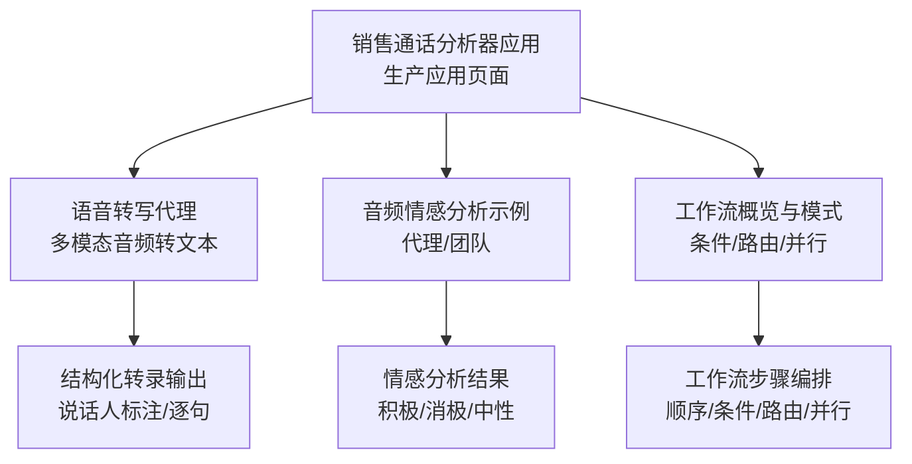
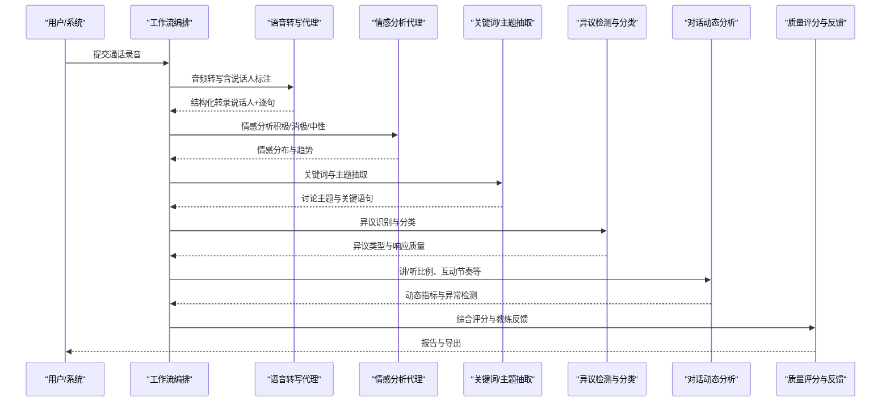
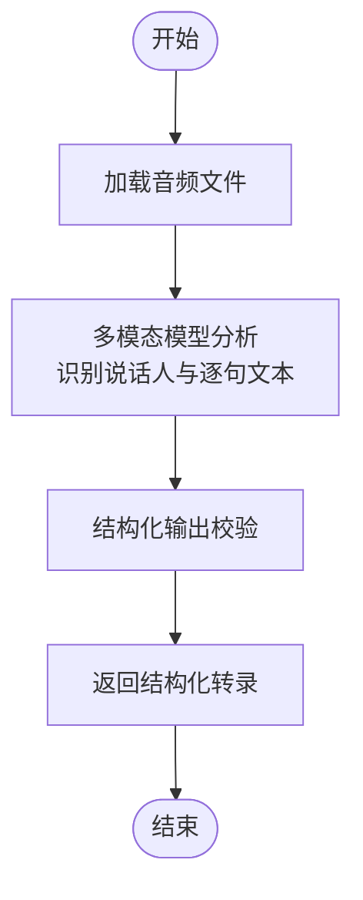
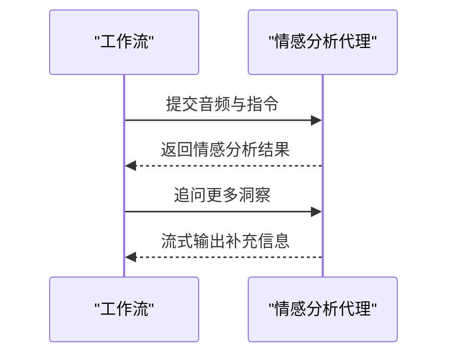
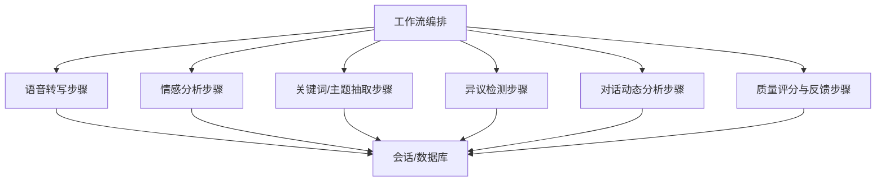

# 销售通话分析器工作流

<cite>
**本文引用的文件**
- [销售通话分析器.mdx](file://production/applications/sales-call-analyzer.mdx)
- [语音转写代理.mdx](file://cookbook/agents/speech-to-text-agent.mdx)
- [音频情感分析.mdx（代理）](file://examples/agents/multimodal/audio-sentiment-analysis.mdx)
- [音频情感分析.mdx（团队）](file://examples/teams/multimodal/audio-sentiment-analysis.mdx)
- [工作流概览.mdx](file://workflows/overview.mdx)
- [工作流步骤与函数.mdx](file://examples/workflows/basic-workflows/step-with-function/step-with-additional-data.mdx)
- [工作流条件与列表步骤.mdx](file://workflows/usage/condition-with-list-of-steps.mdx)
- [工作流并行执行与条件.mdx](file://examples/workflows/parallel-execution/parallel-with-condition.mdx)
- [工作流保存.mdx](file://examples/components/save-workflow.mdx)
- [工作流路由.mdx](file://workflows/hitl/router.mdx)
- [工作流条件.mdx](file://workflows/hitl/condition.mdx)
</cite>

## 目录
1. [简介](#简介)
2. [项目结构](#项目结构)
3. [核心组件](#核心组件)
4. [架构总览](#架构总览)
5. [详细组件分析](#详细组件分析)
6. [依赖关系分析](#依赖关系分析)
7. [性能考虑](#性能考虑)
8. [故障排查指南](#故障排查指南)
9. [结论](#结论)
10. [附录](#附录)

## 简介
本技术文档围绕“销售通话分析器工作流”展开，目标是基于语音识别、情感分析、关键词与话题抽取、异议检测与分类、对话动态分析、通话质量评分与教练反馈生成等能力，构建可扩展、可配置、可审计的自动化销售通话分析流水线。文档同时覆盖实时处理、批量分析与结果导出能力，并提供集成示例与性能调优建议。

## 项目结构
- 应用层：销售通话分析器应用页面，描述了工作流的规划功能与使用场景。
- 代理与示例：语音转写代理与音频情感分析示例，展示多模态输入输出与结构化数据处理。
- 工作流：工作流概览与多种工作流模式示例（条件、路由、并行、结构化输入输出），用于指导销售通话分析器的工作流编排。

**图表来源**
- [销售通话分析器.mdx:11-35](file://production/applications/sales-call-analyzer.mdx#L11-L35)
- [语音转写代理.mdx:20-29](file://cookbook/agents/speech-to-text-agent.mdx#L20-L29)
- [音频情感分析.mdx（代理）:24-32](file://examples/agents/multimodal/audio-sentiment-analysis.mdx#L24-L32)
- [音频情感分析.mdx（团队）:78-81](file://examples/teams/multimodal/audio-sentiment-analysis.mdx#L78-L81)
- [工作流概览.mdx:21-47](file://workflows/overview.mdx#L21-L47)

**章节来源**
- [销售通话分析器.mdx:11-47](file://production/applications/sales-call-analyzer.mdx#L11-L47)
- [工作流概览.mdx:21-47](file://workflows/overview.mdx#L21-L47)

## 核心组件
- 语音识别与转写
  - 多模态音频输入，支持WAV等格式；输出结构化转录，包含说话人标识与逐句文本。
  - 可结合解析模型进行结构化输出校验与增强。
- 情感分析
  - 基于音频内容进行情感倾向分析，支持会话式追问与历史上下文。
- 关键词与话题抽取
  - 在转写基础上进行主题识别与关键讨论点抽取，支撑后续异议与成交阶段判断。
- 异议检测与分类
  - 通过规则或模型对客户异议进行识别与归类，辅助评分与反馈。
- 对话动态分析
  - 计算“讲/听”比例、互动节奏、打断与重叠等指标，评估沟通效率。
- 成交阶段与下一步提取
  - 从对话中抽取明确的下一步行动项与所处销售阶段建议。
- 质量评分与教练反馈
  - 综合上述维度生成通话质量分与教练建议，支持批量复盘与持续改进。

**章节来源**
- [语音转写代理.mdx:20-29](file://cookbook/agents/speech-to-text-agent.mdx#L20-L29)
- [音频情感分析.mdx（代理）:24-32](file://examples/agents/multimodal/audio-sentiment-analysis.mdx#L24-L32)
- [音频情感分析.mdx（团队）:78-81](file://examples/teams/multimodal/audio-sentiment-analysis.mdx#L78-L81)
- [销售通话分析器.mdx:15-23](file://production/applications/sales-call-analyzer.mdx#L15-L23)

## 架构总览
销售通话分析器工作流采用“步骤编排 + 多模态分析 + 结构化输出”的架构。整体流程包括：接收录音 → 语音转写（含说话人标注）→ 主题与关键词抽取 → 异议识别与分类 → 动态分析 → 质量评分 → 教练反馈生成 → 报告与导出。

**图表来源**
- [销售通话分析器.mdx:25-35](file://production/applications/sales-call-analyzer.mdx#L25-L35)
- [语音转写代理.mdx:20-29](file://cookbook/agents/speech-to-text-agent.mdx#L20-L29)
- [音频情感分析.mdx（代理）:24-32](file://examples/agents/multimodal/audio-sentiment-analysis.mdx#L24-L32)

## 详细组件分析

### 语音识别与转写（多模态）
- 输入：音频文件（WAV等），支持本地或URL。
- 处理：多模态模型分析音频，识别说话人并生成逐句转录。
- 输出：结构化转录对象，包含描述与按顺序排列的说话人-话语列表。
- 扩展：可增加解析模型以稳定结构化输出。

**图表来源**
- [语音转写代理.mdx:20-29](file://cookbook/agents/speech-to-text-agent.mdx#L20-L29)
- [语音转写代理.mdx:55-64](file://cookbook/agents/speech-to-text-agent.mdx#L55-L64)

**章节来源**
- [语音转写代理.mdx:20-29](file://cookbook/agents/speech-to-text-agent.mdx#L20-L29)
- [语音转写代理.mdx:55-64](file://cookbook/agents/speech-to-text-agent.mdx#L55-L64)

### 情感分析（音频）
- 输入：音频内容与上下文。
- 处理：多模态情感分析，支持流式输出与历史上下文。
- 输出：情感倾向分布与进一步洞察，支持二次提问。

**图表来源**
- [音频情感分析.mdx（代理）:24-32](file://examples/agents/multimodal/audio-sentiment-analysis.mdx#L24-L32)
- [音频情感分析.mdx（代理）:42-53](file://examples/agents/multimodal/audio-sentiment-analysis.mdx#L42-L53)

**章节来源**
- [音频情感分析.mdx（代理）:24-32](file://examples/agents/multimodal/audio-sentiment-analysis.mdx#L24-L32)
- [音频情感分析.mdx（代理）:42-53](file://examples/agents/multimodal/audio-sentiment-analysis.mdx#L42-L53)

### 关键词与主题抽取
- 输入：结构化转录（说话人+文本）。
- 处理：在转写基础上进行主题建模与关键词抽取。
- 输出：讨论主题清单与关键语句索引，支撑后续异议与成交阶段判断。

**章节来源**
- [销售通话分析器.mdx:17-23](file://production/applications/sales-call-analyzer.mdx#L17-L23)

### 异议检测与分类
- 输入：转录与情感分析结果。
- 处理：基于规则或模型识别客户异议，进行分类（如价格、时间、竞品等）。
- 输出：异议类型、出现位置与响应质量评估。

**章节来源**
- [销售通话分析器.mdx:17-23](file://production/applications/sales-call-analyzer.mdx#L17-L23)

### 对话动态分析
- 输入：转录与说话人标注。
- 处理：统计“讲/听”比例、互动节奏、打断与重叠等指标。
- 输出：动态指标与异常检测，辅助质量评分。

**章节来源**
- [销售通话分析器.mdx:17-23](file://production/applications/sales-call-analyzer.mdx#L17-L23)

### 成交阶段与下一步提取
- 输入：转录与主题抽取结果。
- 处理：抽取明确的下一步行动项与所处销售阶段建议。
- 输出：阶段标签与行动项清单。

**章节来源**
- [销售通话分析器.mdx:17-23](file://production/applications/sales-call-analyzer.mdx#L17-L23)

### 质量评分与教练反馈
- 输入：转录、情感、主题、异议、动态与阶段信息。
- 处理：综合评分算法（如加权打分），生成教练反馈。
- 输出：通话质量分与改进建议。

**章节来源**
- [销售通话分析器.mdx:17-23](file://production/applications/sales-call-analyzer.mdx#L17-L23)

## 依赖关系分析
- 工作流编排依赖于步骤定义与控制逻辑（条件、路由、并行）。
- 分析步骤依赖于多模态代理与结构化输出。
- 数据存储与会话管理可用于审计与复盘。

**图表来源**
- [工作流概览.mdx:21-47](file://workflows/overview.mdx#L21-L47)
- [音频情感分析.mdx（代理）:28-31](file://examples/agents/multimodal/audio-sentiment-analysis.mdx#L28-L31)

**章节来源**
- [工作流概览.mdx:21-47](file://workflows/overview.mdx#L21-L47)
- [音频情感分析.mdx（代理）:28-31](file://examples/agents/multimodal/audio-sentiment-analysis.mdx#L28-L31)

## 性能考虑
- 实时处理
  - 使用流式输出与逐步处理，缩短首包延迟；对长音频采用分段转写与拼接策略。
- 批量分析
  - 并行化多个通话的转写与分析步骤；合理设置批大小与并发度，避免模型限流。
- 存储与缓存
  - 将中间结果与会话状态持久化，减少重复计算；对高频查询建立索引。
- 模型选择与解析
  - 在保证精度的前提下选择合适模型；必要时引入解析模型稳定结构化输出。
- 资源调度
  - 利用工作流的条件与路由能力，根据输入特征动态选择高/低复杂度路径。

[本节为通用性能建议，不直接分析具体文件]

## 故障排查指南
- 语音转写失败
  - 检查音频格式与长度；确认网络可达与鉴权配置；查看代理示例中的错误处理与重试策略。
- 情感分析不稳定
  - 确认多模态模型可用性与上下文长度限制；启用历史上下文时注意截断策略。
- 结构化输出异常
  - 使用解析模型进行二次校验；检查输出Schema与字段约束。
- 工作流卡顿或阻塞
  - 检查条件与路由分支是否正确；确认用户输入与确认节点是否完成。

**章节来源**
- [语音转写代理.mdx:73-78](file://cookbook/agents/speech-to-text-agent.mdx#L73-L78)
- [音频情感分析.mdx（代理）:42-53](file://examples/agents/multimodal/audio-sentiment-analysis.mdx#L42-L53)

## 结论
销售通话分析器工作流通过“多模态转写 + 情感分析 + 主题与异议抽取 + 动态分析 + 质量评分 + 教练反馈”的闭环，为企业提供可落地的销售过程洞察与持续改进工具。借助工作流的条件、路由与并行能力，系统可在不同业务场景下灵活适配，兼顾实时与批量分析需求，并支持结果导出与审计。

[本节为总结性内容，不直接分析具体文件]

## 附录

### 工作流配置参数与运行模式
- 步骤参数与用户输入
  - 支持在步骤中定义用户输入字段（如阈值、模式、批大小等），实现可配置的处理流程。
- 条件与路由
  - 条件步骤根据输入或前置结果选择分支；路由步骤允许用户选择分析深度（快速/深度/自定义）。
- 并行与条件组合
  - 可将并行分析与条件判断结合，针对不同类型通话自动分流到不同处理链路。

**章节来源**
- [工作流步骤与函数.mdx:84-119](file://examples/workflows/basic-workflows/step-with-function/step-with-additional-data.mdx#L84-L119)
- [工作流条件与列表步骤.mdx:93-121](file://workflows/usage/condition-with-list-of-steps.mdx#L93-L121)
- [工作流并行执行与条件.mdx:84-132](file://examples/workflows/parallel-execution/parallel-with-condition.mdx#L84-L132)
- [工作流路由.mdx:30-47](file://workflows/hitl/router.mdx#L30-L47)
- [工作流条件.mdx:29-44](file://workflows/hitl/condition.mdx#L29-L44)

### 报告生成与结果导出
- 报告内容
  - 包含转写摘要、情感分布、主题清单、异议类型与响应质量、动态指标、成交阶段与下一步、质量评分与教练建议。
- 导出方式
  - 支持将分析结果写入数据库或文件系统，便于后续报表与可视化。

**章节来源**
- [音频情感分析.mdx（代理）:28-31](file://examples/agents/multimodal/audio-sentiment-analysis.mdx#L28-L31)
- [音频情感分析.mdx（团队）:78-81](file://examples/teams/multimodal/audio-sentiment-analysis.mdx#L78-L81)

### 集成示例与最佳实践
- 快速集成
  - 参考语音转写代理与音频情感分析示例，快速搭建基础分析能力。
- 工作流保存与复用
  - 使用工作流保存示例，将编排好的步骤持久化，便于团队共享与版本管理。
- 评估与验证
  - 可参考评估示例，对分析结果进行人工或自动评估，持续优化模型与规则。

**章节来源**
- [语音转写代理.mdx:173-196](file://cookbook/agents/speech-to-text-agent.mdx#L173-L196)
- [音频情感分析.mdx（代理）:56-67](file://examples/agents/multimodal/audio-sentiment-analysis.mdx#L56-L67)
- [工作流保存.mdx:81-96](file://examples/components/save-workflow.mdx#L81-L96)