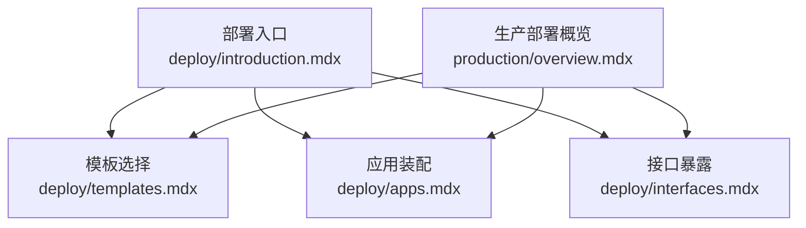
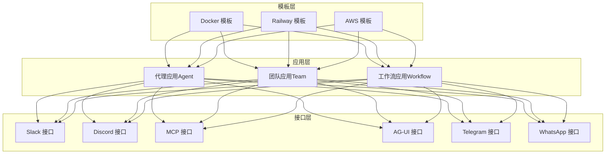
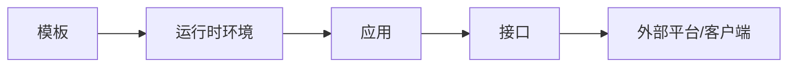

# 应用部署

<cite>
**本文引用的文件**
- [deploy/introduction.mdx](file://deploy/introduction.mdx)
- [deploy/apps.mdx](file://deploy/apps.mdx)
- [deploy/templates.mdx](file://deploy/templates.mdx)
- [deploy/interfaces.mdx](file://deploy/interfaces.mdx)
- [production/overview.mdx](file://production/overview.mdx)
</cite>

## 目录
1. [简介](#简介)
2. [项目结构](#项目结构)
3. [核心组件](#核心组件)
4. [架构总览](#架构总览)
5. [详细组件分析](#详细组件分析)
6. [依赖关系分析](#依赖关系分析)
7. [性能考量](#性能考量)
8. [故障排查指南](#故障排查指南)
9. [结论](#结论)
10. [附录](#附录)

## 简介
本技术文档面向在不同环境中部署基于 AgentOS 的应用，系统性阐述代理应用（Agent）、团队应用（Team）与工作流应用（Workflow）的部署方式、配置要点与最佳实践。文档覆盖从模板选择、应用装配到接口暴露的全流程，并补充安全、验证与监控建议，以及针对开发、测试、生产三类环境的差异化注意事项。

## 项目结构
本仓库以“部署”为主题，提供从模板到应用再到接口的分层内容组织：
- 模板层：提供可直接克隆并构建的生产就绪代码基，支持本地开发（Docker）、快速上线（Railway）、企业级部署（AWS）等路径。
- 应用层：内置多种 Agent、Team、Workflow 的典型场景，按需装配或替换。
- 接口层：将应用暴露至用户常用的平台与协议，如 Slack、Discord、MCP、AG-UI 等。

图表来源
- [deploy/introduction.mdx:1-102](file://deploy/introduction.mdx#L1-L102)
- [deploy/templates.mdx:1-48](file://deploy/templates.mdx#L1-L48)
- [deploy/apps.mdx:1-138](file://deploy/apps.mdx#L1-L138)
- [deploy/interfaces.mdx:1-38](file://deploy/interfaces.mdx#L1-L38)
- [production/overview.mdx:1-73](file://production/overview.mdx#L1-L73)

章节来源
- [deploy/introduction.mdx:1-102](file://deploy/introduction.mdx#L1-L102)
- [deploy/templates.mdx:1-48](file://deploy/templates.mdx#L1-L48)
- [deploy/apps.mdx:1-138](file://deploy/apps.mdx#L1-L138)
- [deploy/interfaces.mdx:1-38](file://deploy/interfaces.mdx#L1-L38)
- [production/overview.mdx:1-73](file://production/overview.mdx#L1-L73)

## 核心组件
- 模板（Template）
  - 提供生产就绪的代码基，内含 AgentOS、PostgreSQL 及目标平台的部署脚本。
  - 支持三种路径：Docker（本地/自托管）、Railway（快速上线）、AWS（企业级）。
- 应用（App）
  - 包括代理应用（Agent）、团队应用（Team）、工作流应用（Workflow），按业务场景装配。
  - 可根据需要替换或扩展，适配不同行业与流程。
- 接口（Interface）
  - 将应用连接到用户已使用的平台与协议，如 Slack、Discord、WhatsApp、Telegram、MCP、AG-UI。
  - 便于在不改变后端逻辑的前提下快速接入用户生态。

章节来源
- [deploy/templates.mdx:6-48](file://deploy/templates.mdx#L6-L48)
- [deploy/apps.mdx:6-138](file://deploy/apps.mdx#L6-L138)
- [deploy/interfaces.mdx:6-38](file://deploy/interfaces.mdx#L6-L38)
- [production/overview.mdx:6-73](file://production/overview.mdx#L6-L73)

## 架构总览
下图展示从模板到应用再到接口的整体部署架构，体现“模板—应用—接口”的三层关系与交互方向。

图表来源
- [deploy/templates.mdx:10-48](file://deploy/templates.mdx#L10-L48)
- [deploy/apps.mdx:9-138](file://deploy/apps.mdx#L9-L138)
- [deploy/interfaces.mdx:8-38](file://deploy/interfaces.mdx#L8-L38)

## 详细组件分析

### 模板层（Template）
- Docker 模板
  - 适合本地开发、测试与自托管部署，启动迅速，便于迭代。
- Railway 模板
  - 快速上线，无需管理基础设施，适合 MVP 与小规模生产。
- AWS 模板
  - 面向规模化与企业级需求，具备更高的可靠性与管控能力。

部署步骤建议（通用流程）
- 克隆模板代码基
- 配置环境变量与数据库连接
- 运行部署脚本或容器编排命令
- 验证服务可用性与日志输出
- 对接所需接口

章节来源
- [deploy/templates.mdx:10-48](file://deploy/templates.mdx#L10-L48)
- [production/overview.mdx:8-22](file://production/overview.mdx#L8-L22)

### 应用层（App）
- 代理应用（Agent）
  - 场景示例：文本转 SQL、研究代理、知识问答、文档摘要、发票提取、客户支持、收件箱代理、合同审查、代码评审、社交媒体分析等。
  - 特点：单体智能体，聚焦特定任务；可独立运行与扩展。
- 团队应用（Team）
  - 场景示例：内容生产团队（作者、编辑、SEO 优化、发布者协同）。
  - 特点：多角色协作，强调分工与编排。
- 工作流应用（Workflow）
  - 场景示例：会议转任务、潜在客户画像、销售电话分析、竞争对手追踪等。
  - 特点：流程化执行，支持条件分支、并行与回溯。

装配与替换策略
- 优先使用模板自带的应用作为起点
- 根据业务需求替换或新增应用
- 统一配置与接口对接，确保一致的可观测性与安全策略

章节来源
- [deploy/apps.mdx:9-138](file://deploy/apps.mdx#L9-L138)

### 接口层（Interface）
- 消息平台
  - Slack、Discord、WhatsApp、Telegram：将应用作为应用或机器人接入，实现消息驱动的交互。
- 协议
  - MCP（模型上下文协议）：用于任意 MCP 客户端的统一接入。
  - AG-UI：用于前端协议的对接，便于自定义界面。

对接流程建议
- 在接口侧完成平台凭证与回调地址配置
- 在应用侧启用对应接口适配器
- 建立双向验证与事件订阅机制
- 调试阶段开启详细日志，生产环境收敛日志级别

章节来源
- [deploy/interfaces.mdx:8-38](file://deploy/interfaces.mdx#L8-L38)
- [deploy/introduction.mdx:83-101](file://deploy/introduction.mdx#L83-L101)

## 依赖关系分析
- 模板与应用
  - 模板提供运行时环境与基础设施，应用在模板之上装配与运行。
- 应用与接口
  - 应用通过接口适配器对外暴露能力，接口负责协议转换与平台集成。
- 数据与存储
  - 模板通常包含数据库初始化脚本与连接参数，应用通过统一的配置读取数据库连接信息。

图表来源
- [deploy/templates.mdx:6-8](file://deploy/templates.mdx#L6-L8)
- [deploy/interfaces.mdx:6-7](file://deploy/interfaces.mdx#L6-L7)

章节来源
- [deploy/templates.mdx:6-8](file://deploy/templates.mdx#L6-L8)
- [deploy/interfaces.mdx:6-7](file://deploy/interfaces.mdx#L6-L7)

## 性能考量
- 启动与资源
  - Docker 模板适合本地压测与小规模预生产；Railway 适合快速扩容；AWS 模板适合高并发与弹性伸缩。
- 数据库连接
  - 使用连接池与超时重试策略；在高负载场景下评估连接数上限与查询优化。
- 并发与限流
  - 在接口层对平台速率限制进行适配；在应用层对模型调用与工具执行进行节流。
- 缓存与持久化
  - 对热点数据与中间结果进行缓存；对会话与历史记录进行持久化与归档。

## 故障排查指南
- 无法连接数据库
  - 检查数据库连接字符串、网络连通性与凭据；确认模板提供的初始化脚本已成功执行。
- 接口回调失败
  - 校验平台回调地址与签名；检查接口适配器的日志与错误码；确认防火墙与反向代理配置。
- 应用无响应或崩溃
  - 查看应用容器/进程日志；核对环境变量与依赖版本；在开发环境复现后再迁移至生产。
- 权限与鉴权问题
  - 确认平台应用的权限范围与令牌有效期；在接口侧启用最小权限原则与审计日志。

## 结论
通过模板—应用—接口的三层架构，AgentOS 能够在不同环境下快速落地。建议以模板为基线，按需装配应用，并通过标准化接口对接用户生态。同时，重视安全、可观测性与性能优化，确保在开发、测试与生产三类环境中的稳定交付。

## 附录
- 环境差异与注意事项
  - 开发环境：强调迭代速度与本地调试便利性，可采用 Docker 模板；降低日志级别，开启详细追踪。
  - 测试环境：模拟生产配置，验证接口与数据库连接；启用基础监控与告警。
  - 生产环境：关注高可用、弹性与合规；严格控制密钥与访问权限；建立变更与回滚流程。
- 安全与合规
  - 密钥管理：使用平台提供的密钥管理服务或安全存储；避免硬编码敏感信息。
  - 访问控制：最小权限原则；对平台与内部接口进行鉴权与授权。
  - 数据保护：对日志与传输进行加密；对敏感数据进行脱敏与归档策略。
- 部署后的验证与监控
  - 验证：端到端请求链路测试；接口回调与事件订阅验证；数据库写入与查询一致性校验。
  - 监控：关键指标（QPS、延迟、错误率、连接数）与日志聚合；异常告警与根因分析。