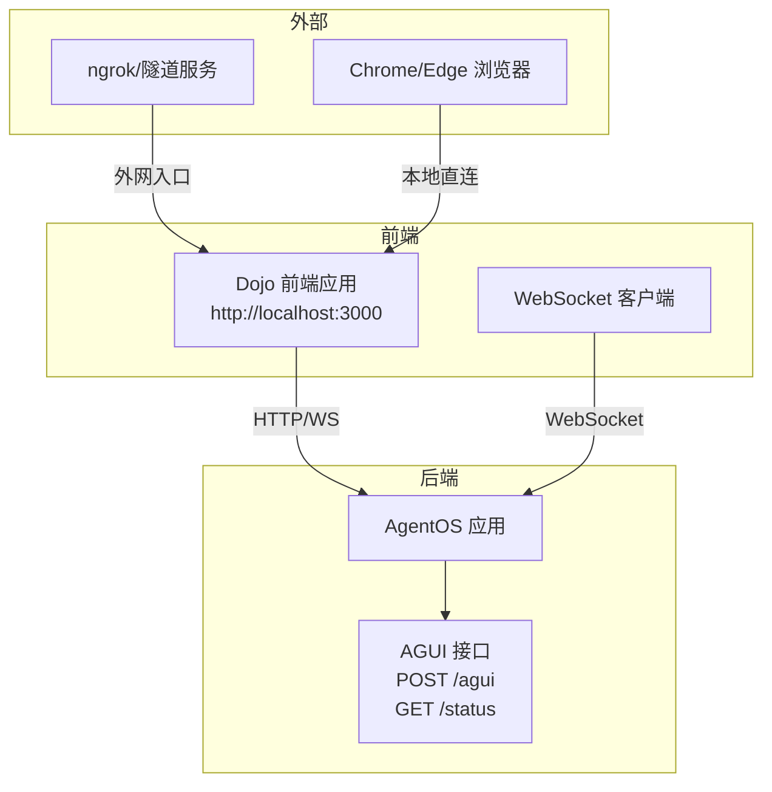
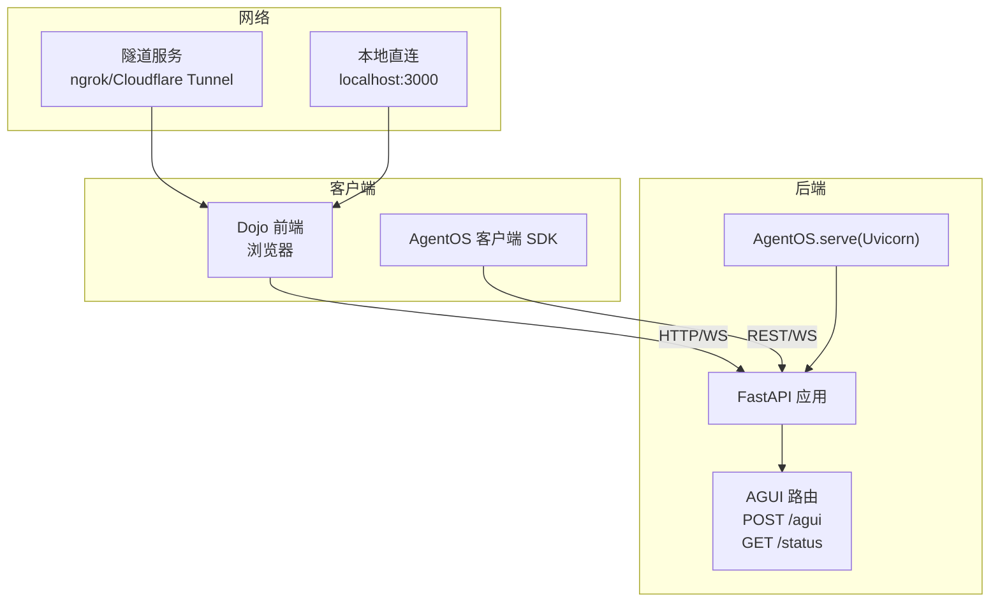
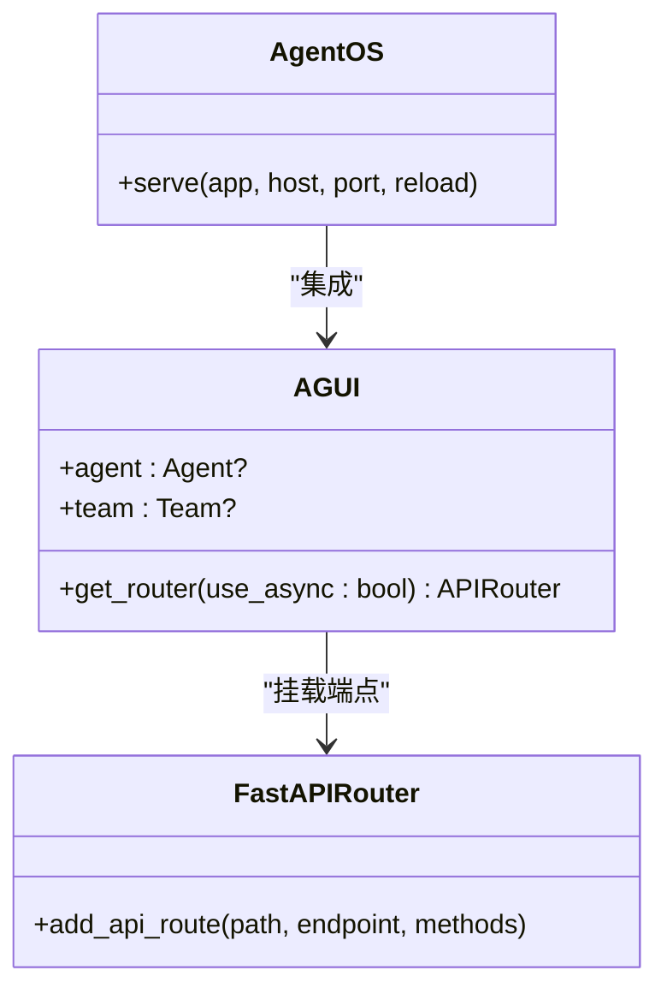
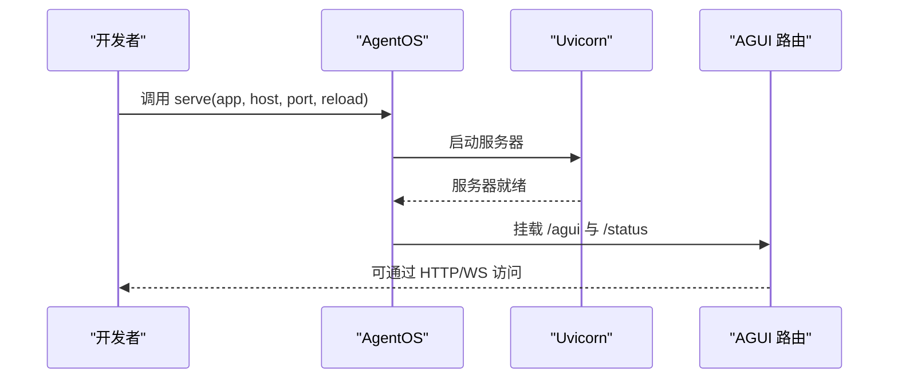
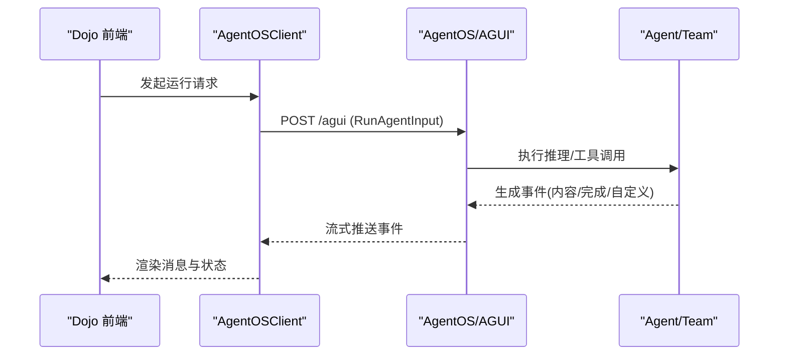
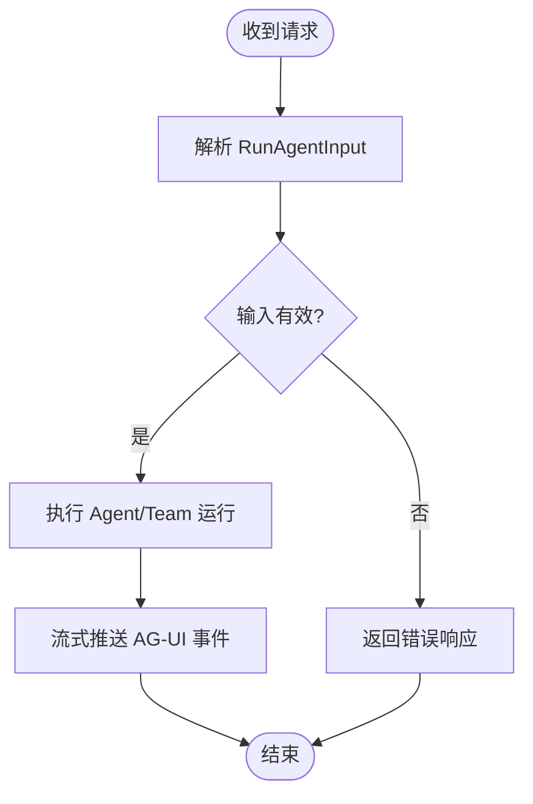
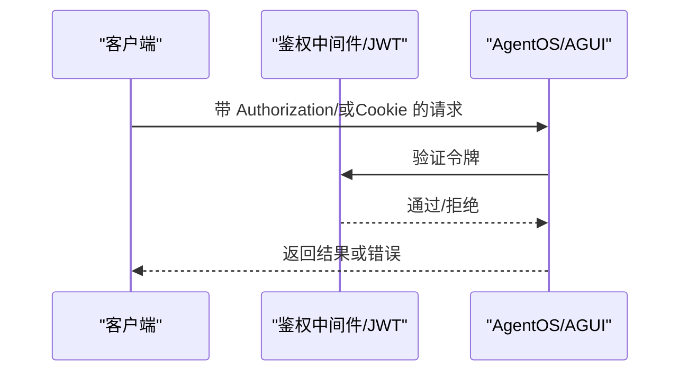
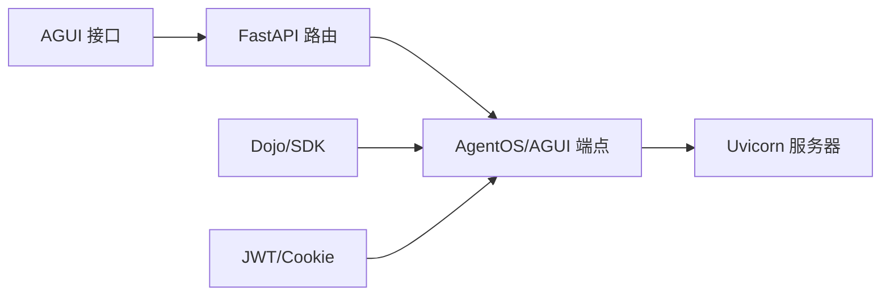

# AG-UI 接口部署

<cite>
**本文引用的文件**
- [agent-os/interfaces/ag-ui/introduction.mdx](file://agent-os/interfaces/ag-ui/introduction.mdx)
- [agent-os/usage/interfaces/ag-ui/basic.mdx](file://agent-os/usage/interfaces/ag-ui/basic.mdx)
- [examples/agent-os/interfaces/agui/multiple-instances.mdx](file://examples/agent-os/interfaces/agui/multiple-instances.mdx)
- [examples/agent-os/interfaces/agui/structured-output.mdx](file://examples/agent-os/interfaces/agui/structured-output.mdx)
- [examples/agent-os/interfaces/agui/agent-with-tools.mdx](file://examples/agent-os/interfaces/agui/agent-with-tools.mdx)
- [examples/agent-os/interfaces/agui/agent-with-silent-tools.mdx](file://examples/agent-os/interfaces/agui/agent-with-silent-tools.mdx)
- [reference-api/schema/agui/run-agent.mdx](file://reference-api/schema/agui/run-agent.mdx)
- [faq/agentos-connection.mdx](file://faq/agentos-connection.mdx)
- [examples/agent-os/client/run-agents.mdx](file://examples/agent-os/client/run-agents.mdx)
- [examples/agent-os/rbac/symmetric/basic.mdx](file://examples/agent-os/rbac/symmetric/basic.mdx)
- [examples/agent-os/rbac/asymmetric/basic.mdx](file://examples/agent-os/rbac/asymmetric/basic.mdx)
- [examples/agent-os/rbac/symmetric/with-cookie.mdx](file://examples/agent-os/rbac/symmetric/with-cookie.mdx)
- [reference/agents/remote-agent.mdx](file://reference/agents/remote-agent.mdx)
- [deploy/interfaces/ag-ui/overview.mdx](file://deploy/interfaces/ag-ui/overview.mdx)
</cite>

## 目录
1. [简介](#简介)
2. [项目结构](#项目结构)
3. [核心组件](#核心组件)
4. [架构总览](#架构总览)
5. [详细组件分析](#详细组件分析)
6. [依赖关系分析](#依赖关系分析)
7. [性能考量](#性能考量)
8. [故障排除指南](#故障排除指南)
9. [结论](#结论)
10. [附录](#附录)

## 简介
本技术文档面向 AG-UI 接口部署与前端集成，系统性阐述如何通过 AG-UI 协议连接前端界面，包括 AG-UI 服务器的搭建与配置、前端应用集成流程（WebSocket 连接、消息传递与状态同步）、AG-UI 协议配置（连接参数、认证与会话管理）、安全配置（访问控制与数据加密）、监控与调试方法、常见问题排查、用户体验优化与性能建议，以及与其他接口的协同工作方式。

## 项目结构
围绕 AG-UI 的部署与使用，仓库中与之直接相关的内容主要分布在以下位置：
- AG-UI 接口介绍与端点规范：agent-os/interfaces/ag-ui/introduction.mdx
- 基础示例与运行方式：agent-os/usage/interfaces/ag-ui/basic.mdx
- 多实例与端口配置示例：examples/agent-os/interfaces/agui/multiple-instances.mdx、examples/agent-os/interfaces/agui/structured-output.mdx
- 工具与静默工具示例：examples/agent-os/interfaces/agui/agent-with-tools.mdx、examples/agent-os/interfaces/agui/agent-with-silent-tools.mdx
- AG-UI 协议端点定义：reference-api/schema/agui/run-agent.mdx
- 连接与本地代理问题处理：faq/agentos-connection.mdx
- 客户端调用与事件流示例：examples/agent-os/client/run-agents.mdx
- RBAC 认证与令牌使用：examples/agent-os/rbac/symmetric/basic.mdx、examples/agent-os/rbac/asymmetric/basic.mdx、examples/agent-os/rbac/symmetric/with-cookie.mdx
- 远程 AgentOS 使用与鉴权：reference/agents/remote-agent.mdx
- 部署页面（待完善）：deploy/interfaces/ag-ui/overview.mdx

图表来源
- [agent-os/interfaces/ag-ui/introduction.mdx:123-130](file://agent-os/interfaces/ag-ui/introduction.mdx#L123-L130)
- [faq/agentos-connection.mdx:39-61](file://faq/agentos-connection.mdx#L39-L61)

章节来源
- [agent-os/interfaces/ag-ui/introduction.mdx:1-146](file://agent-os/interfaces/ag-ui/introduction.mdx#L1-L146)
- [agent-os/usage/interfaces/ag-ui/basic.mdx:1-72](file://agent-os/usage/interfaces/ag-ui/basic.mdx#L1-L72)
- [examples/agent-os/interfaces/agui/multiple-instances.mdx:59-80](file://examples/agent-os/interfaces/agui/multiple-instances.mdx#L59-L80)
- [examples/agent-os/interfaces/agui/structured-output.mdx:54-87](file://examples/agent-os/interfaces/agui/structured-output.mdx#L54-L87)
- [examples/agent-os/interfaces/agui/agent-with-tools.mdx:46-94](file://examples/agent-os/interfaces/agui/agent-with-tools.mdx#L46-L94)
- [examples/agent-os/interfaces/agui/agent-with-silent-tools.mdx:71-105](file://examples/agent-os/interfaces/agui/agent-with-silent-tools.mdx#L71-L105)
- [reference-api/schema/agui/run-agent.mdx:1-3](file://reference-api/schema/agui/run-agent.mdx#L1-L3)
- [faq/agentos-connection.mdx:39-61](file://faq/agentos-connection.mdx#L39-L61)
- [examples/agent-os/client/run-agents.mdx:53-113](file://examples/agent-os/client/run-agents.mdx#L53-L113)
- [examples/agent-os/rbac/symmetric/basic.mdx:105-152](file://examples/agent-os/rbac/symmetric/basic.mdx#L105-L152)
- [examples/agent-os/rbac/asymmetric/basic.mdx:142-184](file://examples/agent-os/rbac/asymmetric/basic.mdx#L142-L184)
- [examples/agent-os/rbac/symmetric/with-cookie.mdx:169-216](file://examples/agent-os/rbac/symmetric/with-cookie.mdx#L169-L216)
- [reference/agents/remote-agent.mdx:273-319](file://reference/agents/remote-agent.mdx#L273-L319)
- [deploy/interfaces/ag-ui/overview.mdx:1-8](file://deploy/interfaces/ag-ui/overview.mdx#L1-L8)

## 核心组件
- AGUI 接口：将 Agno Agent 或 Team 封装为符合 AG-UI 协议的 FastAPI 路由，挂载在应用上。
- AgentOS.serve：基于 Uvicorn 启动 FastAPI 应用，暴露 AGUI 路由与健康检查端点。
- 协议端点：
  - POST /agui：接收 RunAgentInput 并以 AG-UI 事件流形式返回。
  - GET /status：接口健康检查。
- 前端集成：推荐使用 Dojo（AG-UI 前端），通过 HTTP/WS 与后端交互；支持本地直连或通过隧道服务对外暴露。

章节来源
- [agent-os/interfaces/ag-ui/introduction.mdx:97-146](file://agent-os/interfaces/ag-ui/introduction.mdx#L97-L146)
- [reference-api/schema/agui/run-agent.mdx:1-3](file://reference-api/schema/agui/run-agent.mdx#L1-L3)

## 架构总览
下图展示了 AG-UI 的典型部署与交互架构：后端通过 AgentOS 暴露 AGUI 路由，前端（Dojo）通过 HTTP/WS 与其通信；本地开发可直接访问，生产环境可通过 ngrok 等隧道服务对外暴露。

图表来源
- [agent-os/interfaces/ag-ui/introduction.mdx:123-146](file://agent-os/interfaces/ag-ui/introduction.mdx#L123-L146)
- [faq/agentos-connection.mdx:39-61](file://faq/agentos-connection.mdx#L39-L61)

## 详细组件分析

### 组件一：AGUI 接口与端点
- 初始化参数
  - agent：可选，Agno Agent 实例
  - team：可选，Agno Team 实例
- 关键方法
  - get_router(use_async: bool = True)：返回 AG-UI 兼容的 FastAPI 路由并挂载端点
- 端点
  - POST /agui：主入口，接收 RunAgentInput，流式返回 AG-UI 事件
  - GET /status：健康检查

图表来源
- [agent-os/interfaces/ag-ui/introduction.mdx:104-146](file://agent-os/interfaces/ag-ui/introduction.mdx#L104-L146)

章节来源
- [agent-os/interfaces/ag-ui/introduction.mdx:104-146](file://agent-os/interfaces/ag-ui/introduction.mdx#L104-L146)

### 组件二：AgentOS 服务器启动与配置
- serve 参数
  - app：FastAPI 实例或导入字符串
  - host：绑定主机，默认 localhost
  - port：绑定端口，默认 7777
  - reload：开发模式自动重载
- 示例：多实例与不同端口配置、结构化输出示例分别使用不同端口进行演示

图表来源
- [agent-os/interfaces/ag-ui/introduction.mdx:132-146](file://agent-os/interfaces/ag-ui/introduction.mdx#L132-L146)
- [examples/agent-os/interfaces/agui/multiple-instances.mdx:59-80](file://examples/agent-os/interfaces/agui/multiple-instances.mdx#L59-L80)
- [examples/agent-os/interfaces/agui/structured-output.mdx:54-87](file://examples/agent-os/interfaces/agui/structured-output.mdx#L54-L87)

章节来源
- [agent-os/interfaces/ag-ui/introduction.mdx:132-146](file://agent-os/interfaces/ag-ui/introduction.mdx#L132-L146)
- [examples/agent-os/interfaces/agui/multiple-instances.mdx:59-80](file://examples/agent-os/interfaces/agui/multiple-instances.mdx#L59-L80)
- [examples/agent-os/interfaces/agui/structured-output.mdx:54-87](file://examples/agent-os/interfaces/agui/structured-output.mdx#L54-L87)

### 组件三：前端集成与消息传递
- 前端推荐使用 Dojo（AG-UI 前端），通过 HTTP/WS 与后端交互
- 客户端示例展示如何通过 AgentOSClient 发起非流式与流式运行，接收 RunContentEvent/RunCompletedEvent 等事件
- 自定义事件：工具中产生的自定义事件会以 AG-UI 自定义事件格式实时推送到前端

图表来源
- [examples/agent-os/client/run-agents.mdx:53-113](file://examples/agent-os/client/run-agents.mdx#L53-L113)
- [agent-os/interfaces/ag-ui/introduction.mdx:60-96](file://agent-os/interfaces/ag-ui/introduction.mdx#L60-L96)

章节来源
- [examples/agent-os/client/run-agents.mdx:53-113](file://examples/agent-os/client/run-agents.mdx#L53-L113)
- [agent-os/interfaces/ag-ui/introduction.mdx:60-96](file://agent-os/interfaces/ag-ui/introduction.mdx#L60-L96)

### 组件四：协议与端点定义
- AG-UI 协议端点定义位于 OpenAPI 片段中，明确 POST /agui 为主入口
- 端点行为：接收 RunAgentInput，流式返回 AG-UI 事件

图表来源
- [reference-api/schema/agui/run-agent.mdx:1-3](file://reference-api/schema/agui/run-agent.mdx#L1-L3)
- [agent-os/interfaces/ag-ui/introduction.mdx:123-130](file://agent-os/interfaces/ag-ui/introduction.mdx#L123-L130)

章节来源
- [reference-api/schema/agui/run-agent.mdx:1-3](file://reference-api/schema/agui/run-agent.mdx#L1-L3)
- [agent-os/interfaces/ag-ui/introduction.mdx:123-130](file://agent-os/interfaces/ag-ui/introduction.mdx#L123-L130)

### 组件五：认证与会话管理
- 对称 JWT：使用对称密钥签名与验证，示例中展示生成用户/管理员令牌并通过 Authorization 请求头传递
- 非对称 JWT：使用 RSA 签名（RS256），公钥用于验证
- Cookie 方案：示例中展示通过 Cookie 持有令牌
- 远程 AgentOS：支持通过 auth_token 参数传入令牌

图表来源
- [examples/agent-os/rbac/symmetric/basic.mdx:105-152](file://examples/agent-os/rbac/symmetric/basic.mdx#L105-L152)
- [examples/agent-os/rbac/asymmetric/basic.mdx:142-184](file://examples/agent-os/rbac/asymmetric/basic.mdx#L142-L184)
- [examples/agent-os/rbac/symmetric/with-cookie.mdx:169-216](file://examples/agent-os/rbac/symmetric/with-cookie.mdx#L169-L216)
- [reference/agents/remote-agent.mdx:310-319](file://reference/agents/remote-agent.mdx#L310-L319)

章节来源
- [examples/agent-os/rbac/symmetric/basic.mdx:105-152](file://examples/agent-os/rbac/symmetric/basic.mdx#L105-L152)
- [examples/agent-os/rbac/asymmetric/basic.mdx:142-184](file://examples/agent-os/rbac/asymmetric/basic.mdx#L142-L184)
- [examples/agent-os/rbac/symmetric/with-cookie.mdx:169-216](file://examples/agent-os/rbac/symmetric/with-cookie.mdx#L169-L216)
- [reference/agents/remote-agent.mdx:310-319](file://reference/agents/remote-agent.mdx#L310-L319)

### 组件六：工具与静默工具
- 工具示例：Agent 配置中启用工具，工具执行在服务端进行，前端可接收工具相关事件
- 静默工具：工具不产生可见内容，但可能产生内部事件或日志，前端仍可订阅 AG-UI 事件流

章节来源
- [examples/agent-os/interfaces/agui/agent-with-tools.mdx:46-94](file://examples/agent-os/interfaces/agui/agent-with-tools.mdx#L46-L94)
- [examples/agent-os/interfaces/agui/agent-with-silent-tools.mdx:71-105](file://examples/agent-os/interfaces/agui/agent-with-silent-tools.mdx#L71-L105)

## 依赖关系分析
- AGUI 依赖于 AG-UI 协议与 AgentOS 的路由机制
- AgentOS.serve 依赖 Uvicorn 提供的异步服务器
- 前端 Dojo 依赖 HTTP/WS 与后端交互
- 认证链路依赖 JWT（对称/非对称）或 Cookie

图表来源
- [agent-os/interfaces/ag-ui/introduction.mdx:97-146](file://agent-os/interfaces/ag-ui/introduction.mdx#L97-L146)
- [faq/agentos-connection.mdx:39-61](file://faq/agentos-connection.mdx#L39-L61)

章节来源
- [agent-os/interfaces/ag-ui/introduction.mdx:97-146](file://agent-os/interfaces/ag-ui/introduction.mdx#L97-L146)
- [faq/agentos-connection.mdx:39-61](file://faq/agentos-connection.mdx#L39-L61)

## 性能考量
- 事件流与分块：后端应采用流式事件推送，前端按内容块增量渲染，避免一次性大块传输
- 会话与历史：合理使用会话 ID 与历史上下文，避免重复加载与长上下文带来的延迟
- 工具执行：将计算密集型任务放在服务端，前端仅负责展示与交互
- 并发与资源：根据并发量调整 Uvicorn worker 数量与连接池大小
- 缓存与压缩：对静态资源与响应体进行缓存与压缩（如适用）

## 故障排除指南
- 本地连接问题
  - 使用 Chrome/Edge 浏览器访问本地服务
  - 通过 ngrok/Cloudflare Tunnel 将本地端口暴露到公网，再在前端使用提供的外网地址
- 端口冲突与多实例
  - 不同示例使用不同端口（如 7777、9001），确保端口未被占用
- 认证失败
  - 确认 Authorization 请求头或 Cookie 中的令牌正确且未过期
  - 对称/非对称密钥配置一致，公钥/私钥匹配
- 事件未到达前端
  - 检查工具是否正确产生并抛出 AG-UI 兼容的自定义事件
  - 确认前端已订阅对应事件流

章节来源
- [faq/agentos-connection.mdx:39-61](file://faq/agentos-connection.mdx#L39-L61)
- [examples/agent-os/interfaces/agui/multiple-instances.mdx:59-80](file://examples/agent-os/interfaces/agui/multiple-instances.mdx#L59-L80)
- [examples/agent-os/rbac/symmetric/basic.mdx:105-152](file://examples/agent-os/rbac/symmetric/basic.mdx#L105-L152)
- [examples/agent-os/rbac/asymmetric/basic.mdx:142-184](file://examples/agent-os/rbac/asymmetric/basic.mdx#L142-L184)
- [agent-os/interfaces/ag-ui/introduction.mdx:60-96](file://agent-os/interfaces/ag-ui/introduction.mdx#L60-L96)

## 结论
通过 AG-UI 协议，后端可以标准化地向前端提供实时交互体验。结合 AgentOS 的路由与服务器能力、Dojo 前端的事件驱动渲染，以及完善的认证与会话管理，能够快速搭建稳定、可扩展的智能体前端界面。生产部署时建议配合隧道服务与严格的访问控制策略，确保安全性与可用性。

## 附录
- 快速开始
  - 安装依赖：安装 agno 与 ag-ui-protocol
  - 启动后端：使用 AgentOS.serve 指定 app、host、port、reload
  - 启动前端：克隆 AG-UI 仓库，安装依赖并构建集成包，启动 Dojo
  - 访问：本地直连或通过隧道服务访问前端页面
- 参考示例
  - 基础示例与运行方式
  - 多实例与端口配置
  - 工具与静默工具示例
  - 客户端事件流示例
  - RBAC 对称/非对称/带 Cookie 示例
  - 远程 AgentOS 使用与鉴权

章节来源
- [agent-os/usage/interfaces/ag-ui/basic.mdx:1-72](file://agent-os/usage/interfaces/ag-ui/basic.mdx#L1-L72)
- [examples/agent-os/interfaces/agui/multiple-instances.mdx:59-80](file://examples/agent-os/interfaces/agui/multiple-instances.mdx#L59-L80)
- [examples/agent-os/interfaces/agui/agent-with-tools.mdx:46-94](file://examples/agent-os/interfaces/agui/agent-with-tools.mdx#L46-L94)
- [examples/agent-os/interfaces/agui/agent-with-silent-tools.mdx:71-105](file://examples/agent-os/interfaces/agui/agent-with-silent-tools.mdx#L71-L105)
- [examples/agent-os/client/run-agents.mdx:53-113](file://examples/agent-os/client/run-agents.mdx#L53-L113)
- [examples/agent-os/rbac/symmetric/basic.mdx:105-152](file://examples/agent-os/rbac/symmetric/basic.mdx#L105-L152)
- [examples/agent-os/rbac/asymmetric/basic.mdx:142-184](file://examples/agent-os/rbac/asymmetric/basic.mdx#L142-L184)
- [examples/agent-os/rbac/symmetric/with-cookie.mdx:169-216](file://examples/agent-os/rbac/symmetric/with-cookie.mdx#L169-L216)
- [reference/agents/remote-agent.mdx:273-319](file://reference/agents/remote-agent.mdx#L273-L319)
- [deploy/interfaces/ag-ui/overview.mdx:1-8](file://deploy/interfaces/ag-ui/overview.mdx#L1-L8)