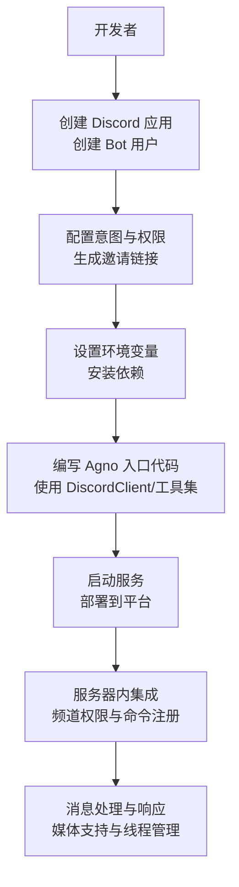
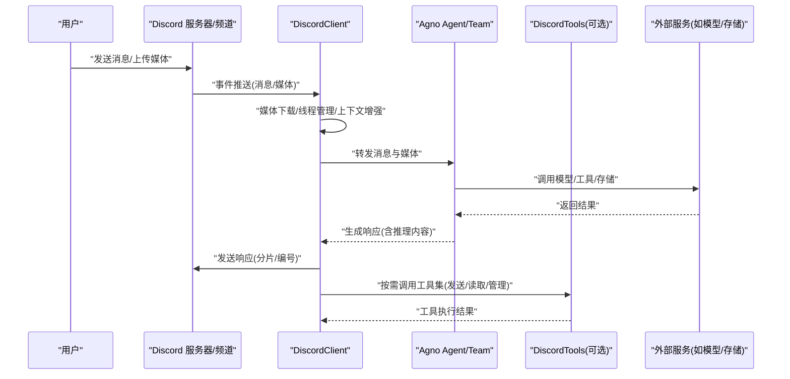
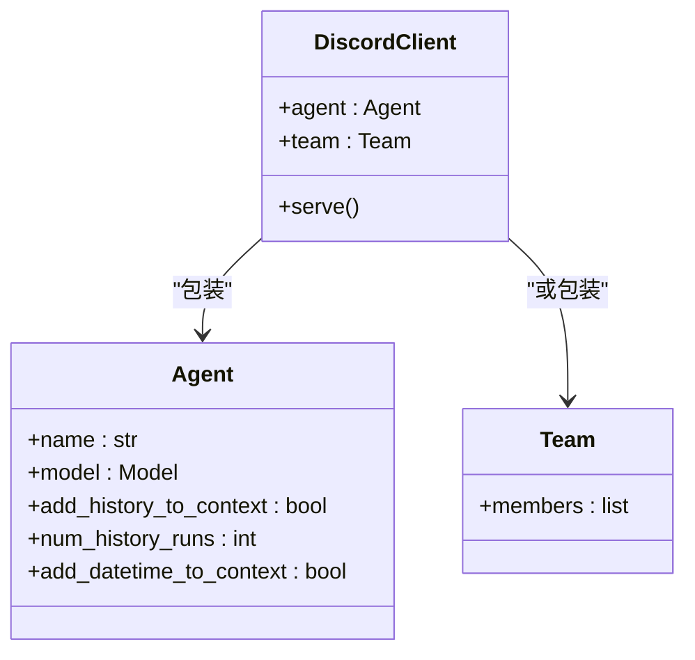
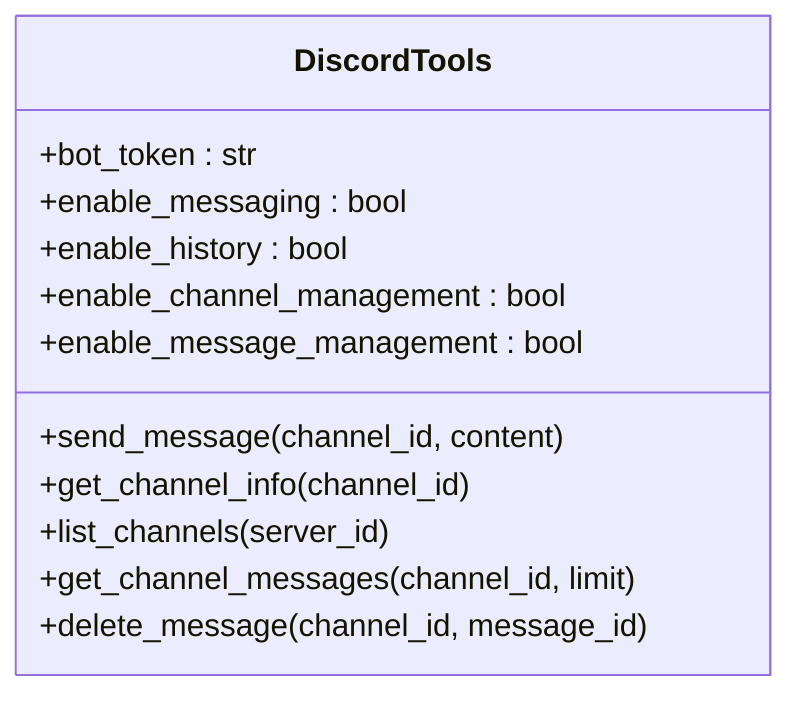
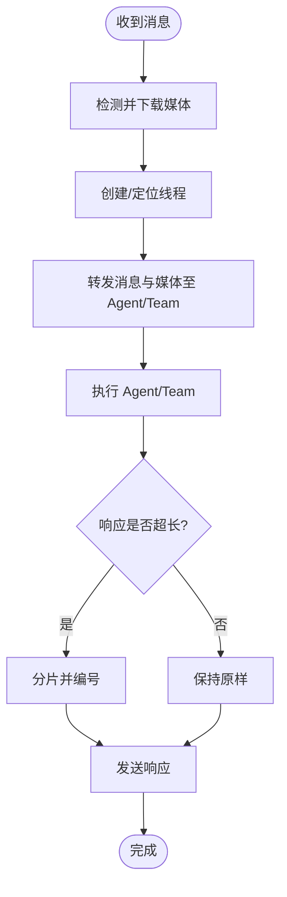
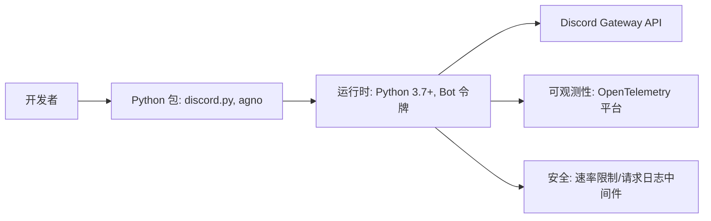

# Discord 接口部署

<cite>
**本文档引用的文件**
- [integrations/discord/overview.mdx](file://integrations/discord/overview.mdx)
- [deploy/interfaces/discord/overview.mdx](file://deploy/interfaces/discord/overview.mdx)
- [production/interfaces/discord.mdx](file://production/interfaces/discord.mdx)
- [_snippets/setup-discord-app.mdx](file://_snippets/setup-discord-app.mdx)
- [tools/toolkits/social/discord.mdx](file://tools/toolkits/social/discord.mdx)
- [examples/tools/discord-tools.mdx](file://examples/tools/discord-tools.mdx)
- [custom-logging.mdx](file://custom-logging.mdx)
- [observability/overview.mdx](file://observability/overview.mdx)
- [TBD/pages/cookbook/observability/overview.mdx](file://TBD/pages/cookbook/observability/overview.mdx)
- [telemetry.mdx](file://telemetry.mdx)
- [agent-os/usage/middleware/custom-middleware.mdx](file://agent-os/usage/middleware/custom-middleware.mdx)
</cite>

## 目录
1. [简介](#简介)
2. [项目结构](#项目结构)
3. [核心组件](#核心组件)
4. [架构总览](#架构总览)
5. [详细组件分析](#详细组件分析)
6. [依赖关系分析](#依赖关系分析)
7. [性能考量](#性能考量)
8. [故障排除指南](#故障排除指南)
9. [结论](#结论)
10. [附录](#附录)

## 简介
本技术文档面向希望在 Discord 上部署智能代理（Agent）的工程师与运维人员，系统讲解从应用创建、Bot 令牌获取与权限配置，到服务器集成、频道权限与命令注册的完整流程；同时覆盖消息处理机制、安全配置（令牌管理与 API 速率限制）、监控与日志记录、故障排除以及扩展性与性能优化建议。文档中的所有步骤与参数均基于仓库中现有的部署与集成文档。

## 项目结构
围绕 Discord 接口部署，仓库提供了多层级的参考材料：
- 集成概览：介绍如何通过 Agno 的 DiscordClient 将 Agent/Team 部署为 Discord Bot，并说明事件处理、媒体支持、消息格式化等特性。
- 部署与生产：提供端到端的部署步骤，包括应用创建、Bot 用户创建、权限与意图配置、环境变量设置、邀请机器人、测试验证等。
- 工具集：提供 DiscordTools 工具包，允许 Agent 在 Discord 中发送消息、读取消息历史、管理频道与删除消息。
- 观测性与日志：提供自定义日志配置、OpenTelemetry 支持与遥测控制，便于生产环境监控与调试。
- 安全与速率限制：提供通用中间件示例，展示如何在 FastAPI 应用中实现请求速率限制与请求日志记录。

**章节来源**
- [integrations/discord/overview.mdx:1-119](file://integrations/discord/overview.mdx#L1-L119)
- [deploy/interfaces/discord/overview.mdx:1-116](file://deploy/interfaces/discord/overview.mdx#L1-L116)
- [production/interfaces/discord.mdx:1-116](file://production/interfaces/discord.mdx#L1-L116)

## 核心组件
- DiscordClient：用于将 Agno 的 Agent 或 Team 包装为可运行的 Discord Bot，负责事件接收、消息处理、线程管理与响应发送。
- DiscordTools：作为工具集，使 Agent 能够在 Discord 中执行消息发送、读取消息历史、管理频道与删除消息等操作。
- 环境变量与配置：通过环境变量注入 Bot 令牌，确保安全与可移植性。
- 媒体与线程：自动为对话创建线程，支持图片、视频、音频与文件的下载与处理，长消息自动分片与编号显示。

**章节来源**
- [integrations/discord/overview.mdx:35-119](file://integrations/discord/overview.mdx#L35-L119)
- [tools/toolkits/social/discord.mdx:1-51](file://tools/toolkits/social/discord.mdx#L1-L51)
- [examples/tools/discord-tools.mdx:1-148](file://examples/tools/discord-tools.mdx#L1-L148)

## 架构总览
下图展示了从用户消息到 Agent 执行再到 Discord 响应的整体流程，以及与工具集的交互关系。

**图表来源**
- [integrations/discord/overview.mdx:53-119](file://integrations/discord/overview.mdx#L53-L119)
- [tools/toolkits/social/discord.mdx:15-51](file://tools/toolkits/social/discord.mdx#L15-L51)

**章节来源**
- [integrations/discord/overview.mdx:53-119](file://integrations/discord/overview.mdx#L53-L119)
- [tools/toolkits/social/discord.mdx:15-51](file://tools/toolkits/social/discord.mdx#L15-L51)

## 详细组件分析

### 组件一：DiscordClient（Bot 集成）
- 作用：封装 Agent/Team，接入 Discord 的 Gateway API，处理消息事件、媒体下载、线程创建与消息分片。
- 关键能力：
  - 自动线程创建与上下文维护
  - 多媒体支持（图片、视频、音频、文件）
  - 消息格式化（长文本分片、编号、斜体推理内容）
  - 事件处理：消息接收、媒体处理、线程管理、Agent/Team 执行、响应发送
- 环境变量：DISCORD_BOT_TOKEN
- 启动方式：serve()

**图表来源**
- [integrations/discord/overview.mdx:35-52](file://integrations/discord/overview.mdx#L35-L52)

**章节来源**
- [integrations/discord/overview.mdx:35-119](file://integrations/discord/overview.mdx#L35-L119)

### 组件二：DiscordTools（工具集）
- 作用：让 Agent 在 Discord 中具备发送消息、读取消息历史、管理频道与删除消息的能力。
- 参数与功能：
  - bot_token：认证令牌
  - enable_messaging、enable_history、enable_channel_management、enable_message_management：功能开关
  - 提供函数：send_message、get_channel_info、list_channels、get_channel_messages、delete_message
- 使用场景：Agent 作为“管理员”或“社区助手”，在指定频道内执行管理与查询任务。

**图表来源**
- [tools/toolkits/social/discord.mdx:28-47](file://tools/toolkits/social/discord.mdx#L28-L47)

**章节来源**
- [tools/toolkits/social/discord.mdx:1-51](file://tools/toolkits/social/discord.mdx#L1-L51)
- [examples/tools/discord-tools.mdx:1-148](file://examples/tools/discord-tools.mdx#L1-L148)

### 组件三：消息处理与线程管理流程
- 流程要点：
  - 接收消息与媒体
  - 下载并处理媒体（图片/视频/音频/文件）
  - 自动创建线程（用户名线程）
  - 将消息与媒体转发给 Agent/Team
  - 发送响应，必要时进行分片与编号
  - 显示推理内容（斜体）

**图表来源**
- [integrations/discord/overview.mdx:82-110](file://integrations/discord/overview.mdx#L82-L110)

**章节来源**
- [integrations/discord/overview.mdx:82-119](file://integrations/discord/overview.mdx#L82-L119)

## 依赖关系分析
- 开发者依赖：discord.py、agno
- 运行时依赖：Python 3.7+、Discord Bot 令牌、服务器权限
- 可观测性依赖：OpenTelemetry、各平台导出器（可选）
- 安全与中间件：FastAPI 中间件（速率限制、请求日志）

**图表来源**
- [_snippets/setup-discord-app.mdx:51-58](file://_snippets/setup-discord-app.mdx#L51-L58)
- [observability/overview.mdx:14-23](file://observability/overview.mdx#L14-L23)
- [agent-os/usage/middleware/custom-middleware.mdx:226-263](file://agent-os/usage/middleware/custom-middleware.mdx#L226-L263)

**章节来源**
- [_snippets/setup-discord-app.mdx:51-58](file://_snippets/setup-discord-app.mdx#L51-L58)
- [observability/overview.mdx:14-23](file://observability/overview.mdx#L14-L23)
- [agent-os/usage/middleware/custom-middleware.mdx:226-263](file://agent-os/usage/middleware/custom-middleware.mdx#L226-L263)

## 性能考量
- 消息分片与编号：对超过阈值的长消息进行分片与编号，避免 Discord 单次响应过大导致失败或延迟。
- 媒体处理：下载与处理视频/音频/文件会增加网络与 CPU 开销，建议在专用队列或异步任务中处理。
- 线程管理：为每个用户的首次消息创建线程，有助于上下文隔离，但需注意线程数量与清理策略。
- 速率限制：在 FastAPI 层面实现滑动窗口速率限制，防止滥用与触发 Discord API 限流。
- 日志与遥测：启用必要的日志与遥测，但避免在高并发场景下输出过大的请求/响应体，以免影响性能。

**章节来源**
- [integrations/discord/overview.mdx:106-110](file://integrations/discord/overview.mdx#L106-L110)
- [agent-os/usage/middleware/custom-middleware.mdx:226-263](file://agent-os/usage/middleware/custom-middleware.mdx#L226-L263)
- [custom-logging.mdx:140-181](file://custom-logging.mdx#L140-L181)

## 故障排除指南
- 连接问题
  - 确认 DISCORD_BOT_TOKEN 是否正确设置且未提交到版本控制。
  - 检查意图（Intents）是否已启用（消息内容意图、成员意图等）。
  - 确认 Bot 权限是否包含发送消息、读取历史、创建公共线程、附件与嵌入链接。
- 权限错误
  - 重新生成邀请链接，确保选择了正确的 scopes 与权限。
  - 在服务器中检查 Bot 的角色与权限上限，避免被低权限覆盖。
- 媒体处理失败
  - 检查媒体 URL 是否可访问，下载路径与磁盘空间是否充足。
  - 对大文件处理增加超时与重试逻辑。
- 速率限制与限流
  - 在应用层添加速率限制中间件，合理设置每 IP 每分钟请求数与时间窗口。
  - 记录并监控速率限制相关头部信息，及时调整策略。
- 日志与可观测性
  - 使用自定义日志配置，区分 Agent/Team/Workflow 的日志级别与输出目标。
  - 启用 OpenTelemetry 并选择合适的导出器，集中收集与分析追踪数据。
  - 如需关闭遥测，可通过环境变量或实例级配置禁用。

**章节来源**
- [_snippets/setup-discord-app.mdx:85-88](file://_snippets/setup-discord-app.mdx#L85-L88)
- [deploy/interfaces/discord/overview.mdx:98-103](file://deploy/interfaces/discord/overview.mdx#L98-L103)
- [agent-os/usage/middleware/custom-middleware.mdx:226-263](file://agent-os/usage/middleware/custom-middleware.mdx#L226-L263)
- [custom-logging.mdx:14-39](file://custom-logging.mdx#L14-L39)
- [observability/overview.mdx:14-23](file://observability/overview.mdx#L14-L23)
- [telemetry.mdx:58-90](file://telemetry.mdx#L58-L90)

## 结论
通过 Agno 的 DiscordClient 与 DiscordTools，可以快速将智能代理部署为功能完备的 Discord Bot。结合完善的媒体支持、线程管理与消息分片机制，能够在复杂社区场景中稳定运行。配合速率限制、请求日志与可观测性方案，可在生产环境中实现安全、可控与可观察的部署与运维。

## 附录

### A. 部署步骤清单
- 创建应用与 Bot 用户，复制并保存 Bot 令牌
- 启用所需意图，配置 Bot 权限
- 设置环境变量，安装依赖
- 编写入口代码，启动服务
- 生成邀请链接，将 Bot 邀请至服务器
- 在目标频道中测试消息与媒体处理

**章节来源**
- [deploy/interfaces/discord/overview.mdx:34-105](file://deploy/interfaces/discord/overview.mdx#L34-L105)
- [_snippets/setup-discord-app.mdx:1-88](file://_snippets/setup-discord-app.mdx#L1-L88)

### B. 环境变量与安全
- 必要变量：DISCORD_BOT_TOKEN
- 安全建议：不要将令牌提交到版本控制；使用环境变量或安全配置管理；定期轮换令牌

**章节来源**
- [integrations/discord/overview.mdx:74-81](file://integrations/discord/overview.mdx#L74-L81)
- [_snippets/setup-discord-app.mdx:85-88](file://_snippets/setup-discord-app.mdx#L85-L88)

### C. 观测性与日志配置
- 自定义日志：支持控制台、文件输出与多组件日志分离
- OpenTelemetry：支持多种平台导出，便于集中监控与调试
- 遥测：可按环境变量或实例级配置禁用

**章节来源**
- [custom-logging.mdx:14-181](file://custom-logging.mdx#L14-L181)
- [observability/overview.mdx:14-23](file://observability/overview.mdx#L14-L23)
- [TBD/pages/cookbook/observability/overview.mdx:1-213](file://TBD/pages/cookbook/observability/overview.mdx#L1-L213)
- [telemetry.mdx:58-90](file://telemetry.mdx#L58-L90)