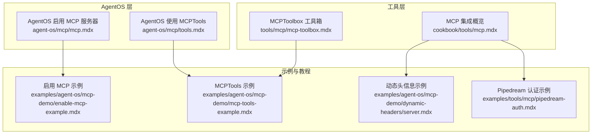
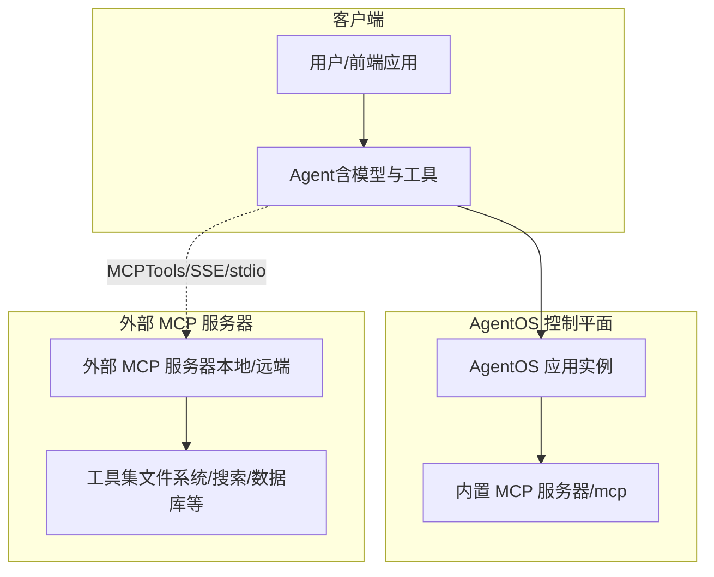
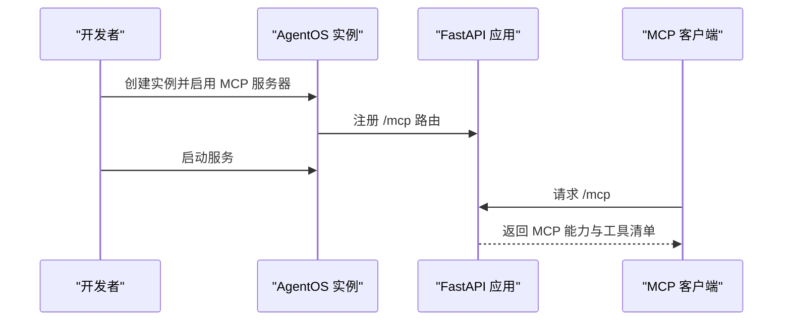
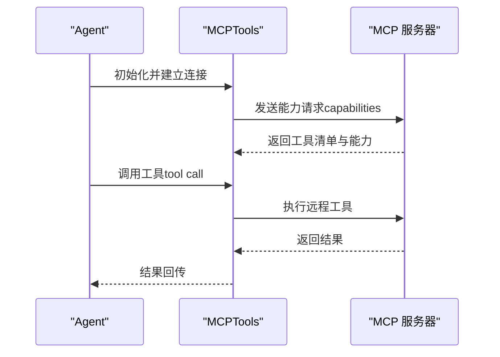
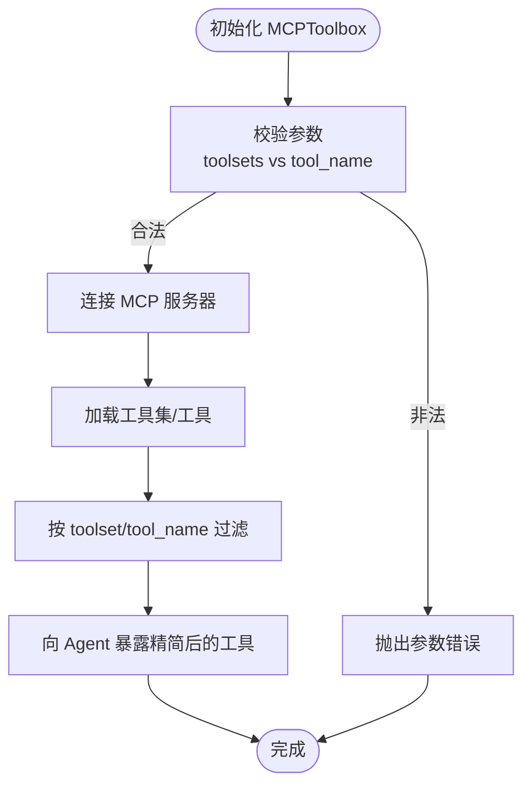
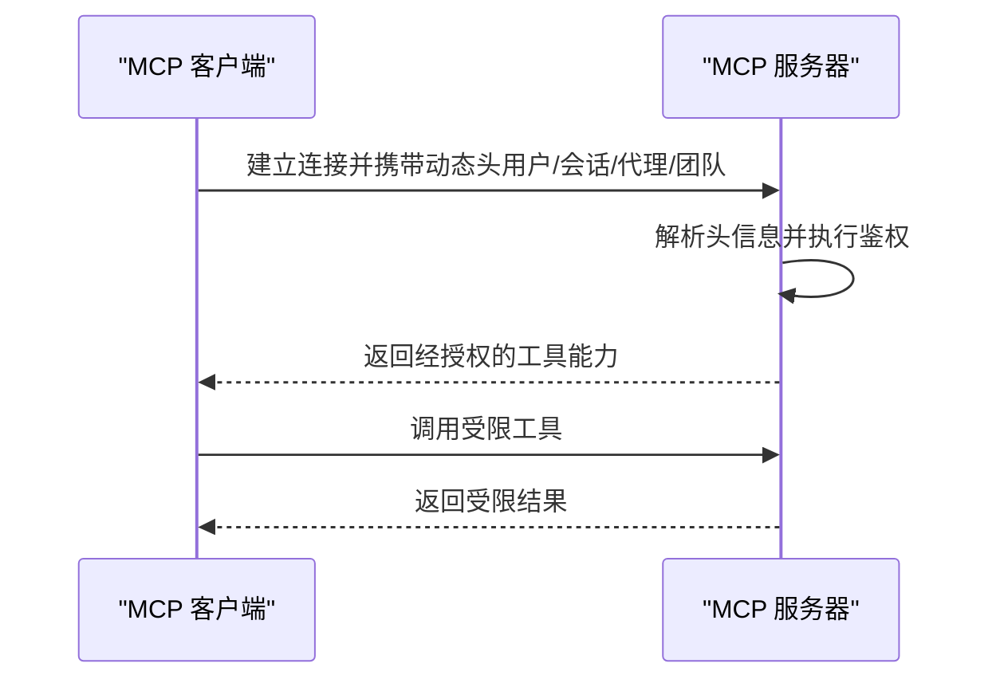
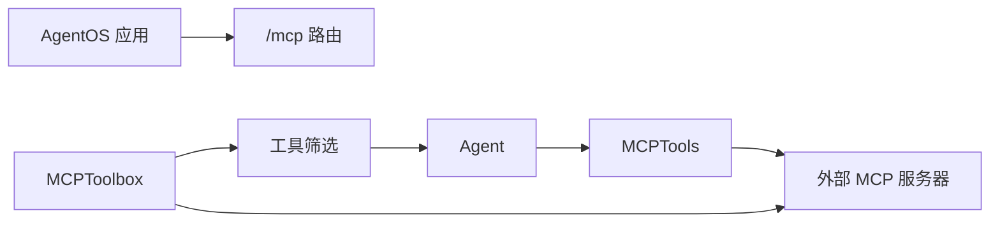

# MCP 接口部署

<cite>
**本文引用的文件**
- [agent-os/mcp/mcp.mdx](file://agent-os/mcp/mcp.mdx)
- [agent-os/mcp/tools.mdx](file://agent-os/mcp/tools.mdx)
- [agent-os/usage/mcp/enable-mcp-example.mdx](file://agent-os/usage/mcp/enable-mcp-example.mdx)
- [agent-os/usage/mcp/mcp-tools-example.mdx](file://agent-os/usage/mcp/mcp-tools-example.mdx)
- [cookbook/tools/mcp.mdx](file://cookbook/tools/mcp.mdx)
- [tools/mcp/mcp-toolbox.mdx](file://tools/mcp/mcp-toolbox.mdx)
- [examples/agent-os/mcp-demo/enable-mcp-example.mdx](file://examples/agent-os/mcp-demo/enable-mcp-example.mdx)
- [examples/agent-os/mcp-demo/mcp-tools-example.mdx](file://examples/agent-os/mcp-demo/mcp-tools-example.mdx)
- [examples/tools/mcp/pipedream-auth.mdx](file://examples/tools/mcp/pipedream-auth.mdx)
- [tools/mcp/usage/pipedream-auth.mdx](file://tools/mcp/usage/pipedream-auth.mdx)
- [examples/agent-os/mcp-demo/dynamic-headers/server.mdx](file://examples/agent-os/mcp-demo/dynamic-headers/server.mdx)
- [examples/tools/mcp/dynamic-headers/overview.mdx](file://examples/tools/mcp/dynamic-headers/overview.mdx)
</cite>

## 目录
1. [简介](#简介)
2. [项目结构](#项目结构)
3. [核心组件](#核心组件)
4. [架构总览](#架构总览)
5. [详细组件分析](#详细组件分析)
6. [依赖关系分析](#依赖关系分析)
7. [性能考量](#性能考量)
8. [故障排除指南](#故障排除指南)
9. [结论](#结论)
10. [附录](#附录)

## 简介
本技术文档面向希望使用 MCP（Model Context Protocol）协议对外暴露智能代理的工程团队，系统阐述如何在 AgentOS 中启用 MCP 服务器、如何在客户端侧通过 MCPTools 连接外部 MCP 服务、如何进行工具注册与能力声明、如何管理会话与生命周期、以及如何进行安全配置（认证与授权）、监控与调试、故障排除、扩展性与性能优化，以及与其他接口的集成最佳实践。

## 项目结构
围绕 MCP 的文档分布在以下模块：
- AgentOS 层：启用 MCP 服务器、在 AgentOS 内部使用 MCPTools、生命周期管理与注意事项
- 工具层：MCPTools 与 MCPToolbox 的使用示例、传输协议选择、工具过滤与认证参数
- 示例与教程：本地 MCP 服务器、动态头信息传递、Pipedream 认证接入等

**图表来源**
- [agent-os/mcp/mcp.mdx:1-48](file://agent-os/mcp/mcp.mdx#L1-L48)
- [agent-os/mcp/tools.mdx:1-57](file://agent-os/mcp/tools.mdx#L1-L57)
- [cookbook/tools/mcp.mdx:1-242](file://cookbook/tools/mcp.mdx#L1-L242)
- [tools/mcp/mcp-toolbox.mdx:1-252](file://tools/mcp/mcp-toolbox.mdx#L1-L252)
- [examples/agent-os/mcp-demo/enable-mcp-example.mdx:1-75](file://examples/agent-os/mcp-demo/enable-mcp-example.mdx#L1-L75)
- [examples/agent-os/mcp-demo/mcp-tools-example.mdx:1-75](file://examples/agent-os/mcp-demo/mcp-tools-example.mdx#L1-L75)
- [examples/agent-os/mcp-demo/dynamic-headers/server.mdx:1-47](file://examples/agent-os/mcp-demo/dynamic-headers/server.mdx#L1-L47)
- [examples/tools/mcp/pipedream-auth.mdx:1-30](file://examples/tools/mcp/pipedream-auth.mdx#L1-L30)

**章节来源**
- [agent-os/mcp/mcp.mdx:1-48](file://agent-os/mcp/mcp.mdx#L1-L48)
- [agent-os/mcp/tools.mdx:1-57](file://agent-os/mcp/tools.mdx#L1-L57)
- [cookbook/tools/mcp.mdx:1-242](file://cookbook/tools/mcp.mdx#L1-L242)
- [tools/mcp/mcp-toolbox.mdx:1-252](file://tools/mcp/mcp-toolbox.mdx#L1-L252)
- [examples/agent-os/mcp-demo/enable-mcp-example.mdx:1-75](file://examples/agent-os/mcp-demo/enable-mcp-example.mdx#L1-L75)
- [examples/agent-os/mcp-demo/mcp-tools-example.mdx:1-75](file://examples/agent-os/mcp-demo/mcp-tools-example.mdx#L1-L75)
- [examples/agent-os/mcp-demo/dynamic-headers/server.mdx:1-47](file://examples/agent-os/mcp-demo/dynamic-headers/server.mdx#L1-L47)
- [examples/tools/mcp/pipedream-auth.mdx:1-30](file://examples/tools/mcp/pipedream-auth.mdx#L1-L30)

## 核心组件
- AgentOS MCP 服务器：通过在创建 AgentOS 实例时开启 enable_mcp_server，即可在 /mcp 暴露 LLM 友好的 MCP 服务器端点，供外部客户端连接。
- MCPTools 客户端：在 Agent 中注入 MCPTools，即可连接到任意 MCP 服务器（本地或远端），支持多种传输协议（如 streamable-http、sse、stdio）。
- MCPToolbox：针对数据库 MCPToolbox 场景，提供按 toolset 或 tool 名称筛选工具的能力，减少“工具过载”，提升聚焦度与安全性。
- 生命周期与刷新：AgentOS 自动管理 MCPTools 的生命周期；若需刷新连接，可手动调用刷新机制。

**章节来源**
- [agent-os/mcp/mcp.mdx:9-13](file://agent-os/mcp/mcp.mdx#L9-L13)
- [agent-os/mcp/tools.mdx:11-16](file://agent-os/mcp/tools.mdx#L11-L16)
- [tools/mcp/mcp-toolbox.mdx:13-13](file://tools/mcp/mcp-toolbox.mdx#L13-L13)
- [agent-os/usage/mcp/enable-mcp-example.mdx:37-37](file://agent-os/usage/mcp/enable-mcp-example.mdx#L37-L37)

## 架构总览
下图展示了从 Agent 到 MCP 服务器的整体交互路径，包括 AgentOS 内置 MCP 服务器与外部 MCP 服务器两种场景。

**图表来源**
- [agent-os/mcp/mcp.mdx:7-19](file://agent-os/mcp/mcp.mdx#L7-L19)
- [cookbook/tools/mcp.mdx:10-20](file://cookbook/tools/mcp.mdx#L10-L20)
- [examples/agent-os/mcp-demo/enable-mcp-example.mdx:40-60](file://examples/agent-os/mcp-demo/enable-mcp-example.mdx#L40-L60)

## 详细组件分析

### 组件一：AgentOS 启用 MCP 服务器
- 启用方式：在创建 AgentOS 实例时设置 enable_mcp_server=True，即可在 /mcp 暴露 MCP 服务器。
- 默认行为：AgentOS 默认以 API 形式提供服务，启用 MCP 后在同一应用中同时提供 API 与 MCP。
- 测试访问：启动后可在本地浏览器访问 /mcp 端点进行测试。

**图表来源**
- [agent-os/mcp/mcp.mdx:9-13](file://agent-os/mcp/mcp.mdx#L9-L13)
- [examples/agent-os/mcp-demo/enable-mcp-example.mdx:40-60](file://examples/agent-os/mcp-demo/enable-mcp-example.mdx#L40-L60)

**章节来源**
- [agent-os/mcp/mcp.mdx:7-19](file://agent-os/mcp/mcp.mdx#L7-L19)
- [examples/agent-os/mcp-demo/enable-mcp-example.mdx:40-60](file://examples/agent-os/mcp-demo/enable-mcp-example.mdx#L40-L60)

### 组件二：MCPTools 客户端连接与传输协议
- 连接方式：在 Agent 中注入 MCPTools，并指定 transport 与 url（或命令行启动外部服务器）。
- 传输协议：支持 streamable-http、sse、stdio 等，根据场景选择合适协议。
- 工具过滤：可通过 include_tools/exclude_tools 精简可用工具集合。
- 生命周期：在 AgentOS 内部使用时，避免使用 reload=True，以免破坏 MCP 连接生命周期。

**图表来源**
- [cookbook/tools/mcp.mdx:10-20](file://cookbook/tools/mcp.mdx#L10-L20)
- [agent-os/mcp/tools.mdx:11-16](file://agent-os/mcp/tools.mdx#L11-L16)

**章节来源**
- [cookbook/tools/mcp.mdx:10-20](file://cookbook/tools/mcp.mdx#L10-L20)
- [agent-os/mcp/tools.mdx:11-16](file://agent-os/mcp/tools.mdx#L11-L16)

### 组件三：MCPToolbox 工具箱与工具筛选
- 适用场景：数据库 MCPToolbox 提供大量工具，MCPToolbox 支持按 toolset 或 tool 名称筛选，降低“工具过载”风险。
- 参数与函数：支持 url、toolsets/tool_name、headers、transport 等参数；提供 connect、load_toolset、load_tool、close 等函数。
- 生产建议：支持为不同工具集绑定认证令牌与参数，便于在多租户或多环境场景下安全使用。

**图表来源**
- [tools/mcp/mcp-toolbox.mdx:209-233](file://tools/mcp/mcp-toolbox.mdx#L209-L233)

**章节来源**
- [tools/mcp/mcp-toolbox.mdx:13-13](file://tools/mcp/mcp-toolbox.mdx#L13-L13)
- [tools/mcp/mcp-toolbox.mdx:209-233](file://tools/mcp/mcp-toolbox.mdx#L209-L233)

### 组件四：会话管理与生命周期
- AgentOS 内部：MCPTools 的生命周期由 AgentOS 管理，无需手动连接/断开；但注意不要在启用 MCP 的情况下使用 reload=True，以免破坏连接。
- 手动控制：如需显式控制连接，可使用 MCPToolbox 的 connect/close 方法，确保资源释放。

**章节来源**
- [agent-os/mcp/tools.mdx:11-16](file://agent-os/mcp/tools.mdx#L11-L16)
- [agent-os/mcp/tools.mdx:51-53](file://agent-os/mcp/tools.mdx#L51-L53)

### 组件五：安全配置（认证与授权）
- 动态头信息：客户端可通过 HTTP 头向 MCP 服务器传递用户/会话/代理/团队标识，服务器可据此个性化响应与鉴权。
- Pipedream 认证：通过环境变量传递访问令牌与项目信息，实现对第三方 MCP 服务的授权访问。
- 最佳实践：在生产中优先使用受控的传输协议与最小权限工具集，结合动态头与认证令牌实现细粒度授权。

**图表来源**
- [examples/agent-os/mcp-demo/dynamic-headers/server.mdx:25-42](file://examples/agent-os/mcp-demo/dynamic-headers/server.mdx#L25-L42)
- [examples/tools/mcp/pipedream-auth.mdx:14-22](file://examples/tools/mcp/pipedream-auth.mdx#L14-L22)

**章节来源**
- [examples/agent-os/mcp-demo/dynamic-headers/server.mdx:25-42](file://examples/agent-os/mcp-demo/dynamic-headers/server.mdx#L25-L42)
- [examples/tools/mcp/pipedream-auth.mdx:14-22](file://examples/tools/mcp/pipedream-auth.mdx#L14-L22)

## 依赖关系分析
- AgentOS 与 MCP 服务器：AgentOS 在自身应用内注册 /mcp 路由，作为 MCP 服务器对外提供能力。
- Agent 与 MCPTools：Agent 将 MCPTools 作为工具之一，通过工具调用间接访问外部 MCP 服务器。
- MCPToolbox 与 MCP 服务器：MCPToolbox 先连接 MCP 服务器获取全部工具，再按策略筛选后暴露给 Agent。

**图表来源**
- [agent-os/mcp/mcp.mdx:9-13](file://agent-os/mcp/mcp.mdx#L9-L13)
- [cookbook/tools/mcp.mdx:10-20](file://cookbook/tools/mcp.mdx#L10-L20)
- [tools/mcp/mcp-toolbox.mdx:109-114](file://tools/mcp/mcp-toolbox.mdx#L109-L114)

**章节来源**
- [agent-os/mcp/mcp.mdx:9-13](file://agent-os/mcp/mcp.mdx#L9-L13)
- [cookbook/tools/mcp.mdx:10-20](file://cookbook/tools/mcp.mdx#L10-L20)
- [tools/mcp/mcp-toolbox.mdx:109-114](file://tools/mcp/mcp-toolbox.mdx#L109-L114)

## 性能考量
- 工具集精简：通过 include_tools/exclude_tools 或 MCPToolbox 的工具集筛选，减少不必要的工具暴露，降低模型推理负担与网络往返。
- 传输协议选择：在低延迟场景优先考虑 streamable-http；需要事件推送时可采用 SSE；在进程内通信场景可考虑 stdio。
- 连接复用：尽量复用 MCP 连接，避免频繁建立/断开；在 AgentOS 中避免 reload=True，防止生命周期抖动。
- 资源释放：在手动管理模式下，确保在 finally 块中调用 close() 释放连接与资源。

[本节为通用指导，不直接分析具体文件]

## 故障排除指南
- 连接失败
  - 检查 MCP 服务器是否正常运行与可达（本地或远端）。
  - 确认传输协议与端口配置正确（如 streamable-http、sse、stdio）。
  - 若使用动态头，请确认客户端已正确设置头字段，服务器端能解析到所需信息。
- 协议错误
  - 校验 MCP 服务器端点路径（默认 /mcp），确保客户端 URL 一致。
  - 对于外部 MCP 服务器，确认其支持所选传输协议。
- 生命周期问题
  - 在 AgentOS 内部使用 MCPTools 时，不要启用 reload=True，以免破坏连接生命周期。
  - 如需手动控制，确保在 finally 中调用 close()。
- 认证失败
  - 对于 Pipedream 等第三方 MCP 服务，检查环境变量是否正确设置（如访问令牌、项目 ID、环境）。
  - 确保服务器端具备相应鉴权逻辑（如基于动态头的校验）。

**章节来源**
- [agent-os/mcp/tools.mdx:11-16](file://agent-os/mcp/tools.mdx#L11-L16)
- [agent-os/mcp/tools.mdx:51-53](file://agent-os/mcp/tools.mdx#L51-L53)
- [examples/tools/mcp/pipedream-auth.mdx:14-22](file://examples/tools/mcp/pipedream-auth.mdx#L14-L22)
- [examples/agent-os/mcp-demo/dynamic-headers/server.mdx:25-42](file://examples/agent-os/mcp-demo/dynamic-headers/server.mdx#L25-L42)

## 结论
通过在 AgentOS 中启用 MCP 服务器与在 Agent 中使用 MCPTools/MCPToolbox，可以快速构建标准化、可扩展的智能代理接口。结合工具筛选、动态头与认证机制，能够在保证安全的前提下灵活接入各类外部工具与数据源。遵循生命周期管理与传输协议选择的最佳实践，有助于获得更稳定、高性能的 MCP 部署体验。

[本节为总结性内容，不直接分析具体文件]

## 附录

### 部署流程（步骤化）
- 启用 AgentOS MCP 服务器
  - 在创建 AgentOS 实例时设置 enable_mcp_server=True。
  - 启动应用后访问 /mcp 进行测试。
- 客户端连接 MCP 服务器
  - 在 Agent 中注入 MCPTools，指定 transport 与 url。
  - 可选：使用 include_tools/exclude_tools 精简工具集。
- 工具注册与能力声明
  - 外部 MCP 服务器负责声明工具与能力；Agent 通过 MCPTools 获取并调用。
  - MCPToolbox 可在本地先加载全部工具，再按策略筛选后暴露给 Agent。
- 会话管理
  - 在 AgentOS 内部使用时，避免 reload=True。
  - 手动模式下，确保连接与关闭的配对调用。
- 安全配置
  - 使用动态头传递用户/会话/代理/团队信息。
  - 对第三方 MCP 服务（如 Pipedream）使用访问令牌与项目参数进行认证。

**章节来源**
- [agent-os/mcp/mcp.mdx:9-13](file://agent-os/mcp/mcp.mdx#L9-L13)
- [agent-os/usage/mcp/enable-mcp-example.mdx:37-37](file://agent-os/usage/mcp/enable-mcp-example.mdx#L37-L37)
- [cookbook/tools/mcp.mdx:10-20](file://cookbook/tools/mcp.mdx#L10-L20)
- [tools/mcp/mcp-toolbox.mdx:109-114](file://tools/mcp/mcp-toolbox.mdx#L109-L114)
- [agent-os/mcp/tools.mdx:11-16](file://agent-os/mcp/tools.mdx#L11-L16)
- [examples/agent-os/mcp-demo/dynamic-headers/server.mdx:25-42](file://examples/agent-os/mcp-demo/dynamic-headers/server.mdx#L25-L42)
- [examples/tools/mcp/pipedream-auth.mdx:14-22](file://examples/tools/mcp/pipedream-auth.mdx#L14-L22)