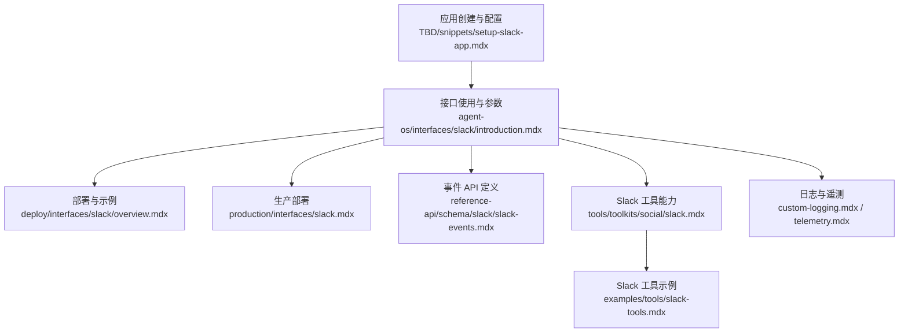
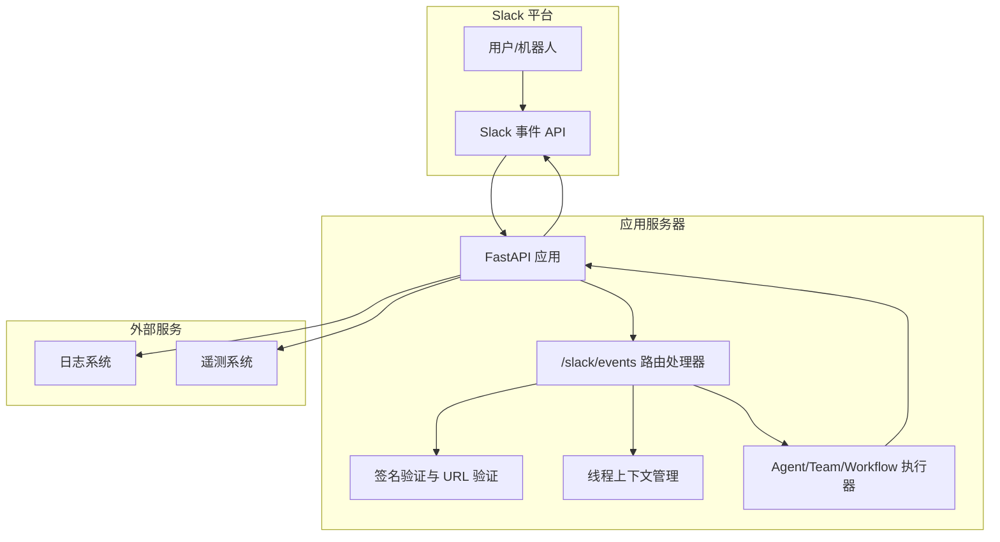
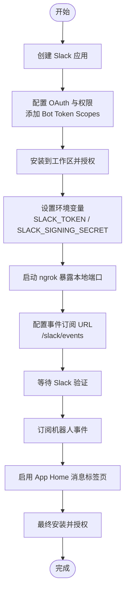
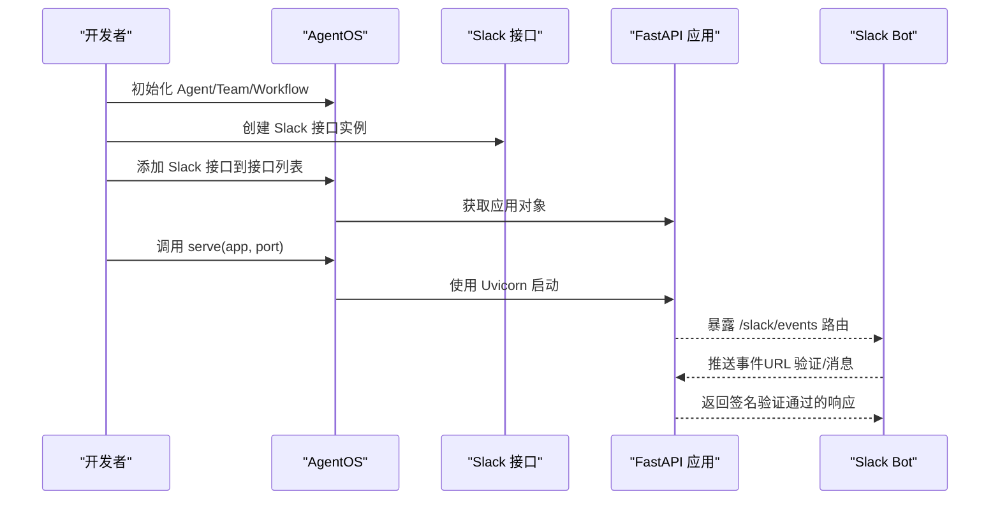
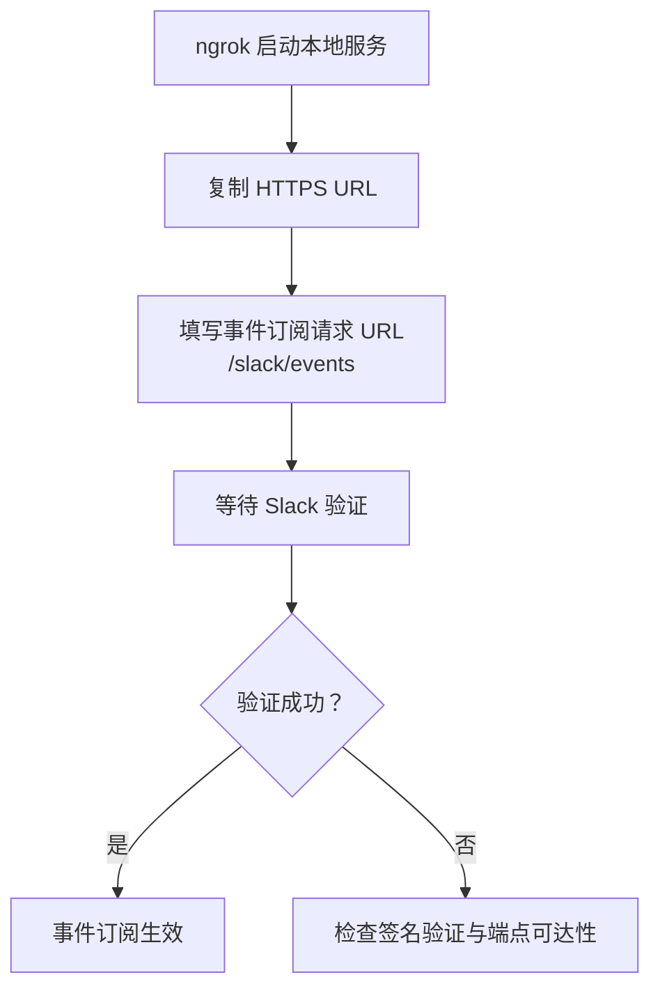
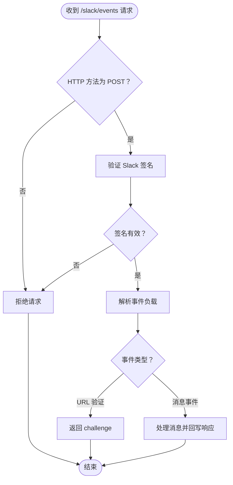
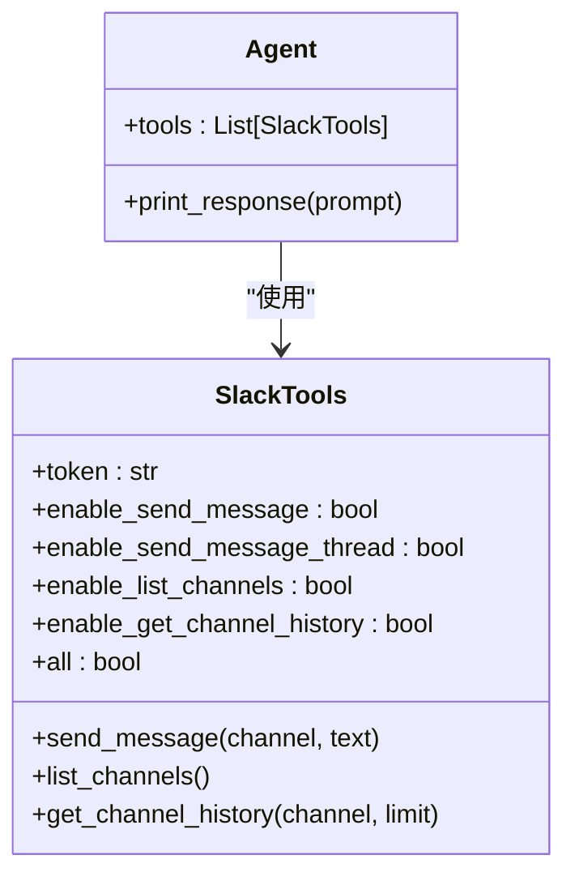
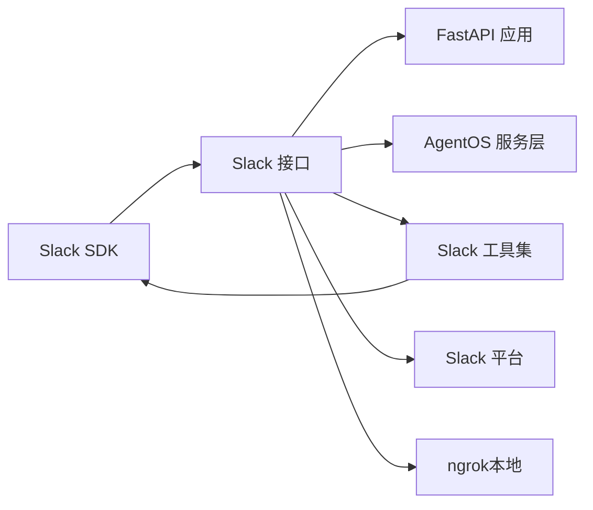

# Slack 接口部署

<cite>
**本文档引用的文件**
- [setup-slack-app.mdx](file://TBD/snippets/setup-slack-app.mdx)
- [Slack 接口介绍](file://agent-os/interfaces/slack/introduction.mdx)
- [Slack 部署概览](file://deploy/interfaces/slack/overview.mdx)
- [Slack 生产部署](file://production/interfaces/slack.mdx)
- [Slack 事件 API](file://reference-api/schema/slack/slack-events.mdx)
- [Slack 工具](file://tools/toolkits/social/slack.mdx)
- [Slack 工具示例](file://examples/tools/slack-tools.mdx)
- [自定义日志记录](file://custom-logging.mdx)
- [遥测配置](file://telemetry.mdx)
</cite>

## 目录
1. [简介](#简介)
2. [项目结构](#项目结构)
3. [核心组件](#核心组件)
4. [架构总览](#架构总览)
5. [详细组件分析](#详细组件分析)
6. [依赖关系分析](#依赖关系分析)
7. [性能考虑](#性能考虑)
8. [故障排除指南](#故障排除指南)
9. [结论](#结论)
10. [附录](#附录)

## 简介
本文件面向希望将智能代理部署为 Slack 应用的工程师与运维人员，系统化阐述从应用创建、OAuth 配置与权限设置，到 Slack Bot 部署（机器人权限、频道集成、命令处理）、Webhook 设置与验证、安全配置（OAuth 令牌管理与 API 密钥保护）、监控与日志记录，以及故障排除与性能优化等全流程实践。内容基于仓库中的 Slack 相关文档与示例，确保可操作性与可追溯性。

## 项目结构
围绕 Slack 接口部署的相关文档分布在以下位置：
- 应用创建与配置：TBD/snippets/setup-slack-app.mdx
- 接口使用与参数说明：agent-os/interfaces/slack/introduction.mdx
- 部署与示例：deploy/interfaces/slack/overview.mdx、production/interfaces/slack.mdx
- 事件 API 定义：reference-api/schema/slack/slack-events.mdx
- Slack 工具能力与参数：tools/toolkits/social/slack.mdx、examples/tools/slack-tools.mdx
- 日志与遥测：custom-logging.mdx、telemetry.mdx

**图表来源**
- [应用创建与配置:1-92](file://TBD/snippets/setup-slack-app.mdx#L1-L92)
- [Slack 接口介绍:1-100](file://agent-os/interfaces/slack/introduction.mdx#L1-L100)
- [Slack 部署概览:1-143](file://deploy/interfaces/slack/overview.mdx#L1-L143)
- [Slack 生产部署:1-143](file://production/interfaces/slack.mdx#L1-L143)
- [Slack 事件 API:1-3](file://reference-api/schema/slack/slack-events.mdx#L1-L3)
- [Slack 工具:1-66](file://tools/toolkits/social/slack.mdx#L1-L66)
- [Slack 工具示例:1-91](file://examples/tools/slack-tools.mdx#L1-L91)
- [自定义日志记录:1-193](file://custom-logging.mdx#L1-L193)
- [遥测配置:1-96](file://telemetry.mdx#L1-L96)

**章节来源**
- [应用创建与配置:1-92](file://TBD/snippets/setup-slack-app.mdx#L1-L92)
- [Slack 接口介绍:1-100](file://agent-os/interfaces/slack/introduction.mdx#L1-L100)
- [Slack 部署概览:1-143](file://deploy/interfaces/slack/overview.mdx#L1-L143)
- [Slack 生产部署:1-143](file://production/interfaces/slack.mdx#L1-L143)
- [Slack 事件 API:1-3](file://reference-api/schema/slack/slack-events.mdx#L1-L3)
- [Slack 工具:1-66](file://tools/toolkits/social/slack.mdx#L1-L66)
- [Slack 工具示例:1-91](file://examples/tools/slack-tools.mdx#L1-L91)
- [自定义日志记录:1-193](file://custom-logging.mdx#L1-L193)
- [遥测配置:1-96](file://telemetry.mdx#L1-L96)

## 核心组件
- Slack 接口（Slack）：封装 Agent/Team/Workflow，通过 FastAPI 挂载 Slack 事件路由，并将响应流式回写至 Slack 线程。
- AgentOS.serve：使用 Uvicorn 提供服务。
- 环境变量：SLACK_TOKEN（Bot User OAuth Token）、SLACK_SIGNING_SECRET（App Signing Secret）。
- 事件订阅：/slack/events 路由，支持 URL 验证与签名验证。
- 线程上下文：使用线程时间戳作为会话 ID，实现每线程独立对话上下文。

**章节来源**
- [Slack 接口介绍:50-100](file://agent-os/interfaces/slack/introduction.mdx#L50-L100)

## 架构总览
下图展示了从 Slack 事件到应用处理再到响应回写的端到端流程，包括本地开发时的 ngrok 外网穿透与生产环境的替代方案。

**图表来源**
- [Slack 接口介绍:76-86](file://agent-os/interfaces/slack/introduction.mdx#L76-L86)
- [Slack 部署概览:90-114](file://deploy/interfaces/slack/overview.mdx#L90-L114)
- [Slack 生产部署:90-114](file://production/interfaces/slack.mdx#L90-L114)
- [自定义日志记录:1-193](file://custom-logging.mdx#L1-L193)
- [遥测配置:1-96](file://telemetry.mdx#L1-L96)

## 详细组件分析

### 组件一：Slack 应用创建与 OAuth 配置
- 必备条件：具备工作区管理员权限、ngrok（本地开发）、Python 3.7+。
- 创建应用：从“从零开始”创建，选择目标工作区。
- OAuth 与权限：添加 Bot Token Scopes（如 app_mention、chat:write、im:* 等），安装到工作区并授权。
- 环境变量：在项目根目录创建 .env 或 .envrc，设置 SLACK_TOKEN 与 SLACK_SIGNING_SECRET，并确保被 shell 加载。
- 事件订阅：启用事件开关，填写请求 URL（形如 https://your-ngrok-url.ngrok.io/slack/events），等待 Slack 验证。
- 订阅事件：在“订阅机器人事件”中添加 app_mention、message.im、message.channels、message.groups。
- App Home：启用消息标签页并允许用户通过消息标签页发送斜杠命令与消息。
- 最终安装：回到“安装应用”，重新授权以应用新权限。

**图表来源**
- [应用创建与配置:11-82](file://TBD/snippets/setup-slack-app.mdx#L11-L82)

**章节来源**
- [应用创建与配置:1-92](file://TBD/snippets/setup-slack-app.mdx#L1-L92)

### 组件二：Slack Bot 部署与运行
- 基本步骤：创建 Agent/Team/Workflow，通过 Slack 接口包装并挂载到 FastAPI，使用 AgentOS.serve 启动服务。
- 关键点：线程时间戳自动作为会话 ID，保证每条线程内的上下文独立；默认仅响应 @提及与私信，可通过参数调整。
- 示例路径：cookbook/06_agent_os/interfaces/slack/basic.py（仓库示例）。

**图表来源**
- [Slack 接口介绍:18-46](file://agent-os/interfaces/slack/introduction.mdx#L18-L46)

**章节来源**
- [Slack 接口介绍:18-46](file://agent-os/interfaces/slack/introduction.mdx#L18-L46)

### 组件三：Slack Webhook 设置与验证
- 本地开发：使用 ngrok 将本地端口暴露为 HTTPS，复制提供的 URL。
- 请求 URL：在事件订阅中填写形如 https://your-ngrok-url.ngrok.io/slack/events。
- 验证流程：Slack 会向该 URL 发送验证请求，应用需正确返回 challenge 参数并通过签名验证。
- 生产环境：替换为稳定域名或托管平台提供的入口地址。

**图表来源**
- [Slack 部署概览:90-103](file://deploy/interfaces/slack/overview.mdx#L90-L103)
- [Slack 生产部署:90-103](file://production/interfaces/slack.mdx#L90-L103)

**章节来源**
- [Slack 部署概览:90-103](file://deploy/interfaces/slack/overview.mdx#L90-L103)
- [Slack 生产部署:90-103](file://production/interfaces/slack.mdx#L90-L103)

### 组件四：Slack 事件处理与安全配置
- 事件路由：POST /slack/events，负责 URL 验证、签名验证、消息解析与响应回写。
- 签名验证：应用需对每个请求进行 Slack 签名验证，失败则拒绝处理。
- 权限控制：通过 OAuth Scopes 控制机器人可执行的操作范围（如发送消息、读取私信历史等）。
- API 密钥保护：SLACK_TOKEN 与 SLACK_SIGNING_SECRET 严禁硬编码在源码中，应通过环境变量注入并在 CI/CD 中加密存储。

**图表来源**
- [Slack 接口介绍:80-86](file://agent-os/interfaces/slack/introduction.mdx#L80-L86)
- [Slack 事件 API:1-3](file://reference-api/schema/slack/slack-events.mdx#L1-L3)

**章节来源**
- [Slack 接口介绍:80-86](file://agent-os/interfaces/slack/introduction.mdx#L80-L86)
- [Slack 事件 API:1-3](file://reference-api/schema/slack/slack-events.mdx#L1-L3)

### 组件五：Slack 工具与命令处理
- 工具能力：SlackTools 支持发送消息、列出频道、获取频道历史等；可通过参数启用/禁用具体功能。
- 使用方式：在 Agent 中直接注入 SlackTools，即可在提示词中调用相应指令。
- 示例场景：只读 Agent 可仅启用列表与历史读取，避免误发消息。

**图表来源**
- [Slack 工具:46-62](file://tools/toolkits/social/slack.mdx#L46-L62)
- [Slack 工具示例:19-55](file://examples/tools/slack-tools.mdx#L19-L55)

**章节来源**
- [Slack 工具:1-66](file://tools/toolkits/social/slack.mdx#L1-L66)
- [Slack 工具示例:1-91](file://examples/tools/slack-tools.mdx#L1-L91)

## 依赖关系分析
- 组件耦合：
  - Slack 接口依赖 FastAPI 与 AgentOS 服务层。
  - 事件处理依赖 Slack SDK 的签名验证与事件解析。
  - 工具链依赖 slack-sdk 与相应的 OAuth 作用域。
- 外部依赖：
  - Slack 平台（事件 API、OAuth 与权限管理）。
  - ngrok（本地开发外网穿透）。
  - 环境变量与密钥管理（CI/CD 与运维平台）。

**图表来源**
- [Slack 接口介绍:50-56](file://agent-os/interfaces/slack/introduction.mdx#L50-L56)
- [Slack 工具:1-17](file://tools/toolkits/social/slack.mdx#L1-L17)

**章节来源**
- [Slack 接口介绍:50-56](file://agent-os/interfaces/slack/introduction.mdx#L50-L56)
- [Slack 工具:1-17](file://tools/toolkits/social/slack.mdx#L1-L17)

## 性能考虑
- 线程上下文复用：利用线程时间戳作为会话 ID，减少跨线程状态污染，提升并发稳定性。
- 流式响应：将长回复拆分并流式回写，改善用户体验与网络传输效率。
- 事件批处理：在高并发场景下，合理安排事件队列与异步处理，避免阻塞主事件循环。
- 资源隔离：将日志与遥测输出分离，避免 IO 成为瓶颈。
- CDN/反向代理：生产环境建议通过反向代理或 CDN 缓存静态资源，降低后端压力。

[本节为通用性能建议，不直接分析特定文件]

## 故障排除指南
- 环境变量未设置：确认 SLACK_TOKEN 与 SLACK_SIGNING_SECRET 已正确注入且可被应用读取。
- 事件订阅未验证：检查 ngrok 是否运行、请求 URL 是否指向 /slack/events、Slack 是否能访问到应用。
- 权限不足：核对 OAuth Scopes 是否包含 app_mention、chat:write、im:* 等必要权限，并重新安装应用。
- 签名验证失败：检查签名算法与密钥一致性，确保请求头与负载校验通过。
- 机器人未入频道：邀请机器人加入目标频道或私信，再尝试触发消息。
- 日志与遥测：开启自定义日志与遥测，定位异常堆栈与运行指标。

**章节来源**
- [Slack 接口介绍:94-100](file://agent-os/interfaces/slack/introduction.mdx#L94-L100)
- [自定义日志记录:1-193](file://custom-logging.mdx#L1-L193)
- [遥测配置:1-96](file://telemetry.mdx#L1-L96)

## 结论
通过标准化的应用创建、OAuth 配置与权限管理，结合 Slack 接口的事件路由与签名验证机制，可以快速、安全地将智能代理部署为 Slack Bot。配合工具链与命令处理能力，可在多线程上下文中提供一致的交互体验。生产环境中建议采用稳定的入口与密钥管理策略，并结合日志与遥测体系实现可观测性与持续优化。

[本节为总结性内容，不直接分析特定文件]

## 附录

### A. 环境变量与密钥管理清单
- SLACK_TOKEN：Bot User OAuth Token（来自 OAuth & Permissions）
- SLACK_SIGNING_SECRET：App Signing Secret（来自 Basic Information > App Credentials）
- 可选：OPENAI_API_KEY（用于模型调用）

**章节来源**
- [应用创建与配置:36-48](file://TBD/snippets/setup-slack-app.mdx#L36-L48)
- [Slack 接口介绍:12-16](file://agent-os/interfaces/slack/introduction.mdx#L12-L16)

### B. 事件订阅与路由对照表
- 事件 API：POST /slack/events
- 订阅事件：app_mention、message.im、message.channels、message.groups
- URL 验证：应用需返回 challenge 参数

**章节来源**
- [Slack 事件 API:1-3](file://reference-api/schema/slack/slack-events.mdx#L1-L3)
- [Slack 部署概览:105-114](file://deploy/interfaces/slack/overview.mdx#L105-L114)
- [Slack 生产部署:105-114](file://production/interfaces/slack.mdx#L105-L114)

### C. 日志与遥测配置要点
- 自定义日志：支持文件输出、多命名日志器、按组件级别输出。
- 遥测：默认匿名收集运行指标，可通过环境变量或实例级配置关闭。

**章节来源**
- [自定义日志记录:1-193](file://custom-logging.mdx#L1-L193)
- [遥测配置:1-96](file://telemetry.mdx#L1-L96)