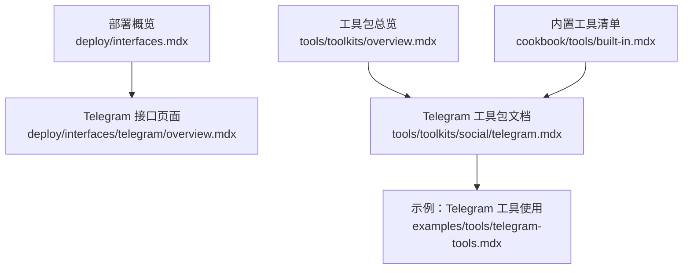
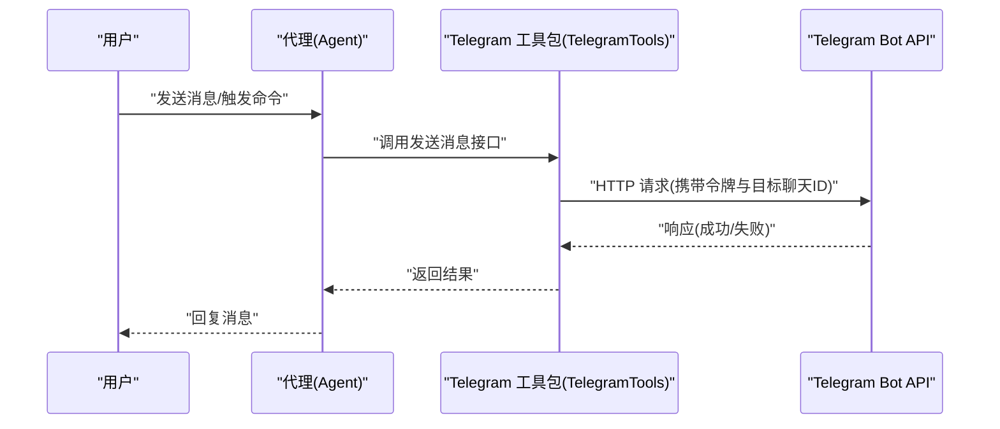
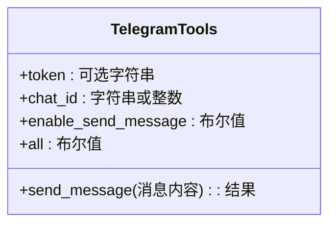
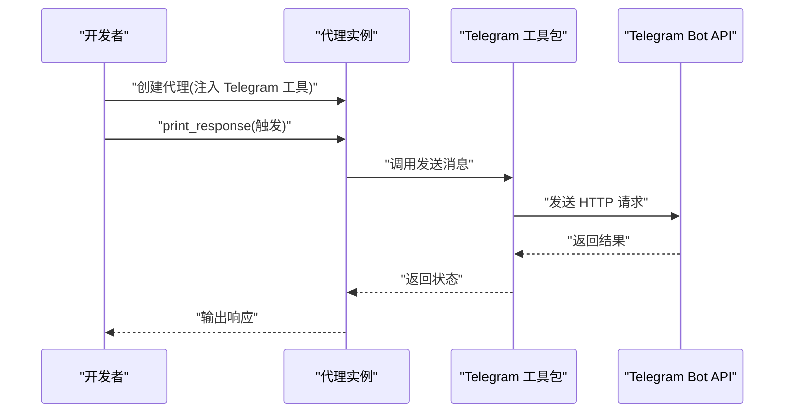
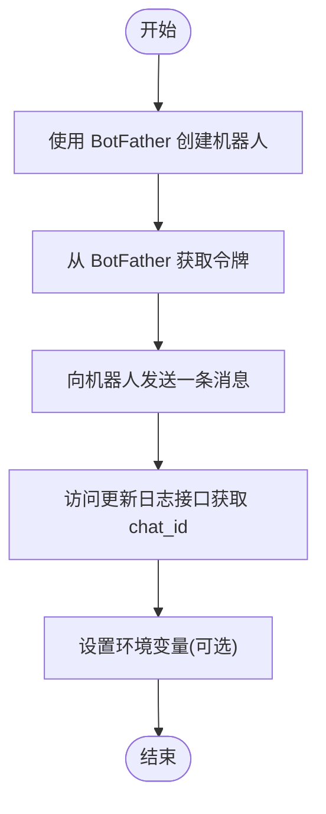
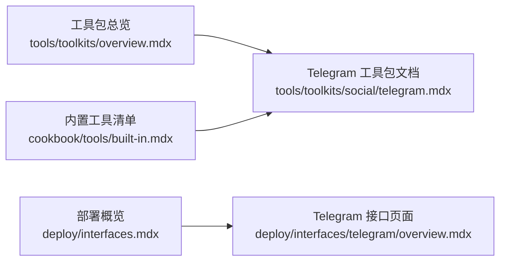

# Telegram 接口部署

<cite>
**本文引用的文件**
- [deploy/interfaces.mdx](file://deploy/interfaces.mdx)
- [deploy/interfaces/telegram/overview.mdx](file://deploy/interfaces/telegram/overview.mdx)
- [tools/toolkits/social/telegram.mdx](file://tools/toolkits/social/telegram.mdx)
- [examples/tools/telegram-tools.mdx](file://examples/tools/telegram-tools.mdx)
- [cookbook/tools/built-in.mdx](file://cookbook/tools/built-in.mdx)
- [tools/toolkits/overview.mdx](file://tools/toolkits/overview.mdx)
</cite>

## 目录
1. [简介](#简介)
2. [项目结构](#项目结构)
3. [核心组件](#核心组件)
4. [架构总览](#架构总览)
5. [详细组件分析](#详细组件分析)
6. [依赖关系分析](#依赖关系分析)
7. [性能考量](#性能考量)
8. [故障排除指南](#故障排除指南)
9. [结论](#结论)
10. [附录](#附录)

## 简介
本技术文档面向希望在生产环境中部署智能代理为 Telegram 机器人的工程师与运维人员。文档基于仓库中现有的 Telegram 工具与接口相关资料，系统阐述从 BotFather 创建、令牌获取、环境配置到消息处理与安全加固的完整流程，并提供可操作的步骤指引与最佳实践。由于当前仓库中 Telegram 接口部署页面尚在完善中，本文以现有工具与示例为依据，结合 Telegram Bot API 的通用实践，给出可落地的实施方案。

## 项目结构
与 Telegram 接口部署直接相关的文档分布在以下位置：
- 部署概览：展示支持的接口平台卡片，其中包含 Telegram 入口
- Telegram 接口页面：当前为“即将推出”的占位页（用于引导用户获取帮助）
- Telegram 工具包文档：提供安装、令牌与聊天 ID 获取、参数说明与示例
- 示例文档：演示如何使用 Telegram 工具包创建具备 Telegram 能力的代理
- 工具包总览：列出 Telegram 工具包入口，便于快速定位

图表来源
- [deploy/interfaces.mdx:1-38](file://deploy/interfaces.mdx#L1-L38)
- [deploy/interfaces/telegram/overview.mdx:1-8](file://deploy/interfaces/telegram/overview.mdx#L1-L8)
- [tools/toolkits/social/telegram.mdx:1-50](file://tools/toolkits/social/telegram.mdx#L1-L50)
- [examples/tools/telegram-tools.mdx:1-62](file://examples/tools/telegram-tools.mdx#L1-L62)
- [tools/toolkits/overview.mdx:160-171](file://tools/toolkits/overview.mdx#L160-L171)
- [cookbook/tools/built-in.mdx:124-125](file://cookbook/tools/built-in.mdx#L124-L125)

章节来源
- [deploy/interfaces.mdx:1-38](file://deploy/interfaces.mdx#L1-L38)
- [deploy/interfaces/telegram/overview.mdx:1-8](file://deploy/interfaces/telegram/overview.mdx#L1-L8)
- [tools/toolkits/social/telegram.mdx:1-50](file://tools/toolkits/social/telegram.mdx#L1-L50)
- [examples/tools/telegram-tools.mdx:1-62](file://examples/tools/telegram-tools.mdx#L1-L62)
- [tools/toolkits/overview.mdx:160-171](file://tools/toolkits/overview.mdx#L160-L171)
- [cookbook/tools/built-in.mdx:124-125](file://cookbook/tools/built-in.mdx#L124-L125)

## 核心组件
- Telegram 工具包（TelegramTools）：封装通过 Telegram Bot API 发送消息的能力，支持令牌与目标聊天 ID 配置，以及按需启用功能。
- 代理（Agent）：通过注入 Telegram 工具包，获得向 Telegram 聊天发送消息的能力；示例文档展示了如何创建具备 Telegram 能力的代理。
- 环境变量：通过 TELEGRAM_TOKEN 等环境变量管理令牌，避免硬编码风险。
- 参数与能力开关：支持选择性启用特定功能（如发送消息），便于最小权限与安全控制。

章节来源
- [tools/toolkits/social/telegram.mdx:5-50](file://tools/toolkits/social/telegram.mdx#L5-L50)
- [examples/tools/telegram-tools.mdx:17-41](file://examples/tools/telegram-tools.mdx#L17-L41)
- [cookbook/tools/built-in.mdx:124-125](file://cookbook/tools/built-in.mdx#L124-L125)

## 架构总览
下图展示了从用户触发到代理执行再到 Telegram API 的调用链路。该图为概念性示意，用于帮助理解整体流程。

说明
- 令牌管理：通过环境变量或显式参数传入，避免泄露。
- 聊天 ID：通过与机器人对话后查询更新日志接口获取。
- 功能开关：根据业务需求启用相应能力，降低攻击面。

## 详细组件分析

### 组件一：Telegram 工具包（TelegramTools）
- 角色与职责：封装 Telegram Bot API 的消息发送能力，作为代理的工具之一。
- 关键参数
  - token：Bot 令牌，优先使用显式参数，否则回退到环境变量。
  - chat_id：目标聊天 ID。
  - enable_send_message：是否启用发送消息功能。
  - all：是否启用全部功能。
- 使用方式：在代理中注入 TelegramTools 实例，即可在响应中调用发送消息能力。

图表来源
- [tools/toolkits/social/telegram.mdx:43-50](file://tools/toolkits/social/telegram.mdx#L43-L50)

章节来源
- [tools/toolkits/social/telegram.mdx:5-50](file://tools/toolkits/social/telegram.mdx#L5-L50)

### 组件二：代理（Agent）与 Telegram 工具集成
- 代理创建：示例文档展示了如何创建一个具备 Telegram 能力的代理，并配置描述、指令与 Markdown 输出。
- 运行方式：通过 print_response 或其他交互方式触发代理执行，代理内部调用 Telegram 工具包完成消息发送。

图表来源
- [examples/tools/telegram-tools.mdx:27-41](file://examples/tools/telegram-tools.mdx#L27-L41)
- [tools/toolkits/social/telegram.mdx:21-41](file://tools/toolkits/social/telegram.mdx#L21-L41)

章节来源
- [examples/tools/telegram-tools.mdx:17-41](file://examples/tools/telegram-tools.mdx#L17-L41)
- [tools/toolkits/social/telegram.mdx:17-41](file://tools/toolkits/social/telegram.mdx#L17-L41)

### 组件三：令牌与聊天 ID 获取流程
- 令牌获取：通过 BotFather 创建新机器人并获取令牌。
- 聊天 ID 获取：与机器人发送一条消息后，访问更新日志接口以获取 chat_id。
- 环境变量：推荐使用 TELEGRAM_TOKEN 等环境变量进行管理，避免硬编码。

图表来源
- [tools/toolkits/social/telegram.mdx:25-31](file://tools/toolkits/social/telegram.mdx#L25-L31)
- [examples/tools/telegram-tools.mdx:9-13](file://examples/tools/telegram-tools.mdx#L9-L13)

章节来源
- [tools/toolkits/social/telegram.mdx:25-31](file://tools/toolkits/social/telegram.mdx#L25-L31)
- [examples/tools/telegram-tools.mdx:9-13](file://examples/tools/telegram-tools.mdx#L9-L13)

### 组件四：消息类型处理指南
- 文本消息：通过 TelegramTools 的发送消息能力实现。
- 媒体消息：Telegram 工具包文档未明确列出媒体发送能力，若需发送图片、视频等，请参考 Telegram Bot API 官方能力并在代理中扩展对应工具。
- 内联键盘：Telegram 工具包文档未涉及内联键盘功能，如需实现按钮交互，请在代理工具层扩展相应能力。

章节来源
- [tools/toolkits/social/telegram.mdx:5-50](file://tools/toolkits/social/telegram.mdx#L5-L50)

### 组件五：部署与运行模式
- 当前仓库中的 Telegram 接口部署页面为占位页，提示需要帮助时联系支持。
- 工具包与示例文档提供了本地开发与运行的基础路径与参数配置，可据此搭建本地或容器化运行环境。

章节来源
- [deploy/interfaces/telegram/overview.mdx:5-7](file://deploy/interfaces/telegram/overview.mdx#L5-L7)
- [examples/tools/telegram-tools.mdx:50-62](file://examples/tools/telegram-tools.mdx#L50-L62)

## 依赖关系分析
- 工具包入口：工具包总览页面提供 Telegram 工具包的入口链接，便于快速定位。
- 工具清单：内置工具清单中列出 Telegram 工具包的导入路径，便于在示例中直接引用。
- 接口入口：部署概览页面包含 Telegram 平台卡片，作为进入接口文档的入口。

图表来源
- [tools/toolkits/overview.mdx:164-171](file://tools/toolkits/overview.mdx#L164-L171)
- [cookbook/tools/built-in.mdx:124-125](file://cookbook/tools/built-in.mdx#L124-L125)
- [deploy/interfaces.mdx:20](file://deploy/interfaces.mdx#L20)

章节来源
- [tools/toolkits/overview.mdx:164-171](file://tools/toolkits/overview.mdx#L164-L171)
- [cookbook/tools/built-in.mdx:124-125](file://cookbook/tools/built-in.mdx#L124-L125)
- [deploy/interfaces.mdx:20](file://deploy/interfaces.mdx#L20)

## 性能考量
- 最小权限原则：仅启用必要的功能开关，减少对外部 API 的调用频率与复杂度。
- 批量与异步：对于高并发场景，建议在代理层引入队列与异步处理机制，避免阻塞主线程。
- 缓存策略：对频繁使用的配置（如聊天 ID）进行缓存，降低重复查询成本。
- 超时与重试：为 Telegram API 调用设置合理的超时与指数退避重试策略，提升稳定性。
- 监控与告警：对接关键指标（请求耗时、错误率、队列长度）进行监控，及时发现异常。

## 故障排除指南
- 无法获取聊天 ID
  - 确认已与机器人发送过至少一条消息。
  - 访问更新日志接口获取最新 chat_id。
- 令牌无效或权限不足
  - 在 BotFather 中检查机器人状态与权限。
  - 确认环境变量或参数传入正确且未被覆盖。
- 消息发送失败
  - 检查网络连通性与代理运行状态。
  - 查看工具包返回的状态码与错误信息，必要时开启调试日志。
- 功能未生效
  - 确认已启用相应功能开关（如发送消息）。
  - 对比示例文档中的参数与运行方式，确保一致。

章节来源
- [tools/toolkits/social/telegram.mdx:25-31](file://tools/toolkits/social/telegram.mdx#L25-L31)
- [examples/tools/telegram-tools.mdx:9-13](file://examples/tools/telegram-tools.mdx#L9-L13)

## 结论
本技术文档基于仓库现有资料，梳理了 Telegram 机器人的部署与运行要点：从 BotFather 创建、令牌与聊天 ID 获取，到代理集成 Telegram 工具包、参数配置与示例运行。尽管当前 Telegram 接口部署页面仍在完善中，但工具包与示例已为本地开发与生产部署提供了清晰的路径。建议在生产环境中遵循最小权限、安全加固与可观测性的最佳实践，确保系统的稳定与安全。

## 附录
- 快速入口
  - Telegram 工具包文档：[Telegram 工具包:1-50](file://tools/toolkits/social/telegram.mdx#L1-L50)
  - 示例：Telegram 工具使用：[示例文档:1-62](file://examples/tools/telegram-tools.mdx#L1-L62)
  - 工具包总览：[工具包总览:164-171](file://tools/toolkits/overview.mdx#L164-L171)
  - 内置工具清单：[内置工具清单:124-125](file://cookbook/tools/built-in.mdx#L124-L125)
  - 部署概览：[部署概览:1-38](file://deploy/interfaces.mdx#L1-L38)