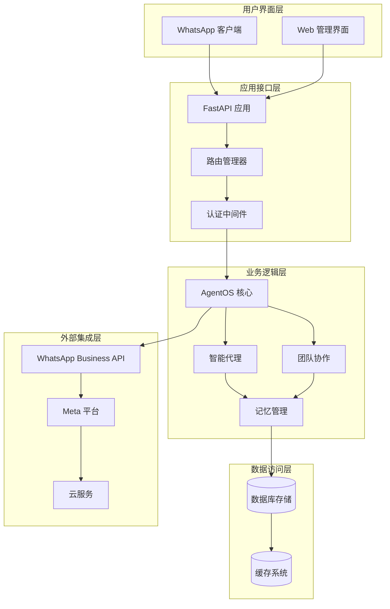
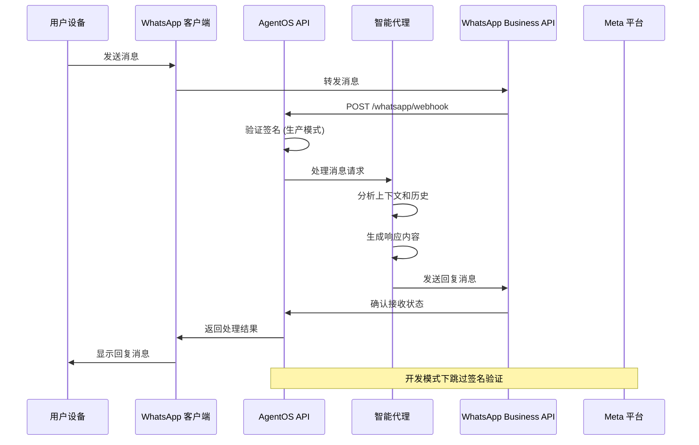
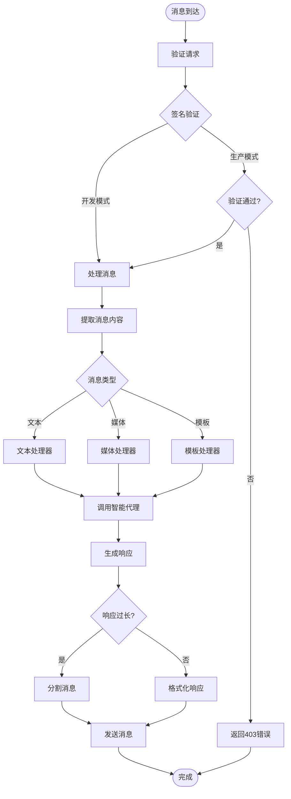
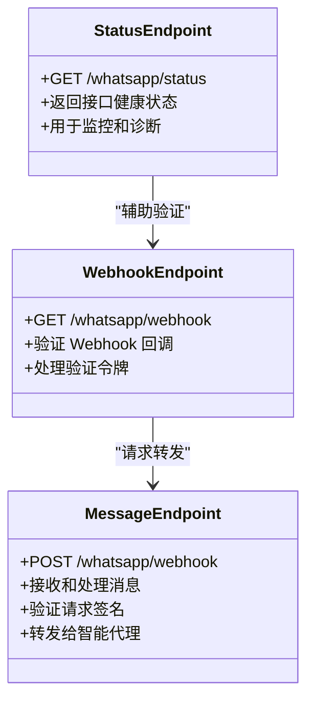
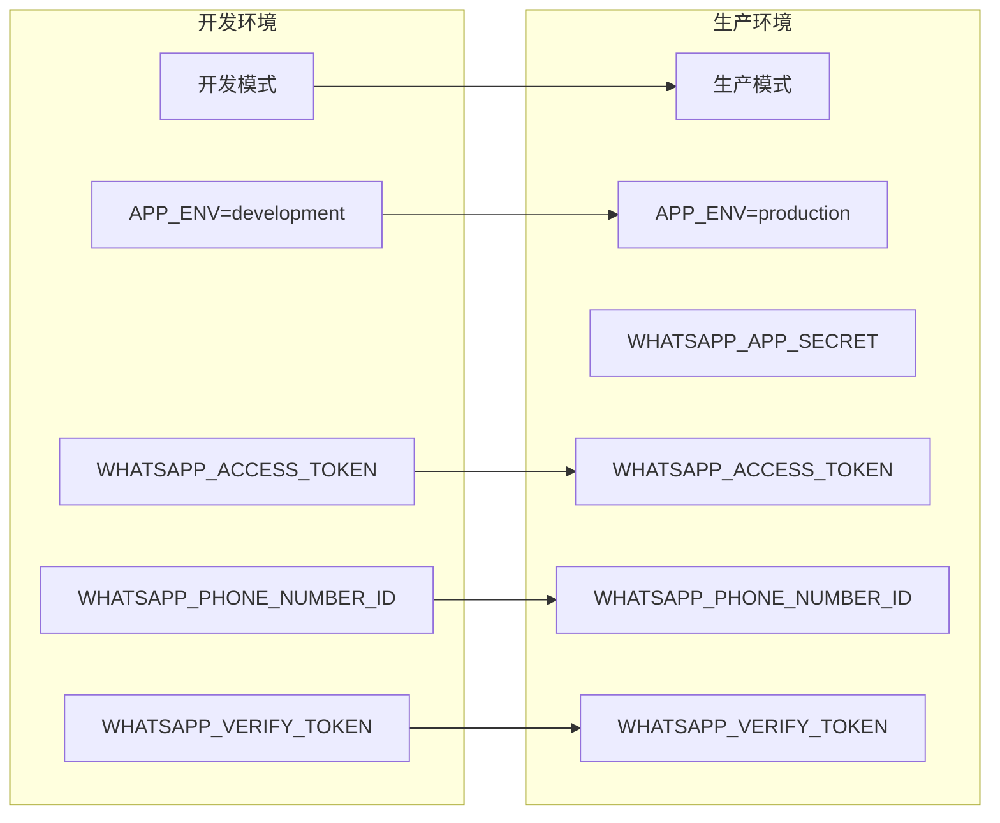
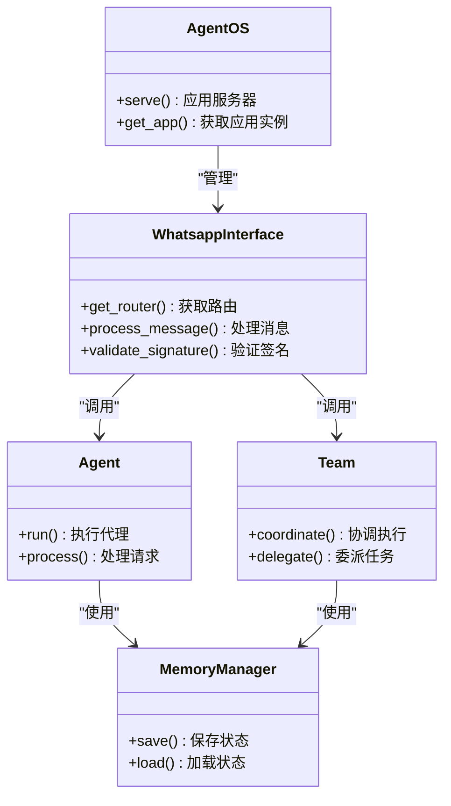
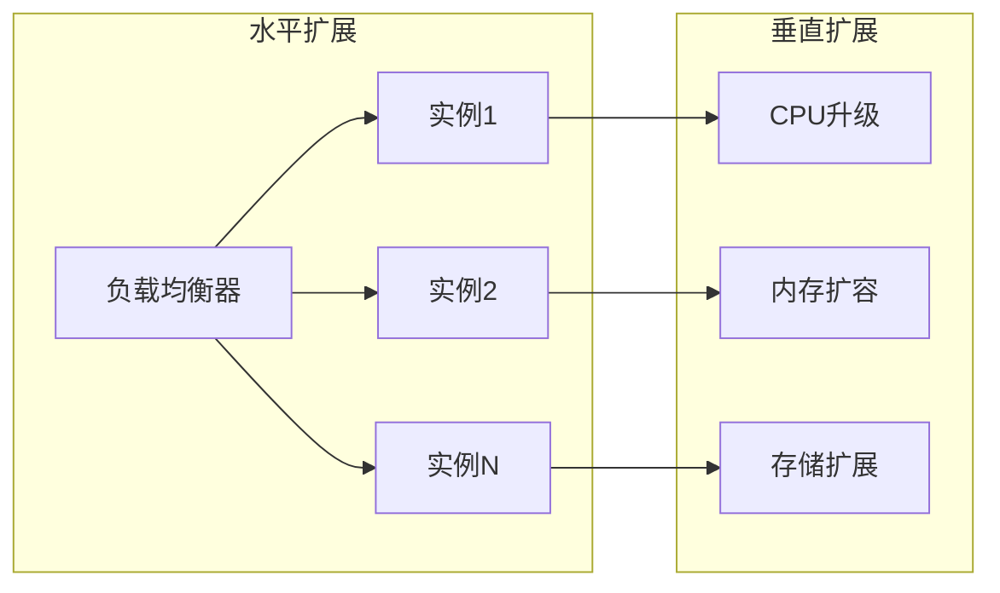
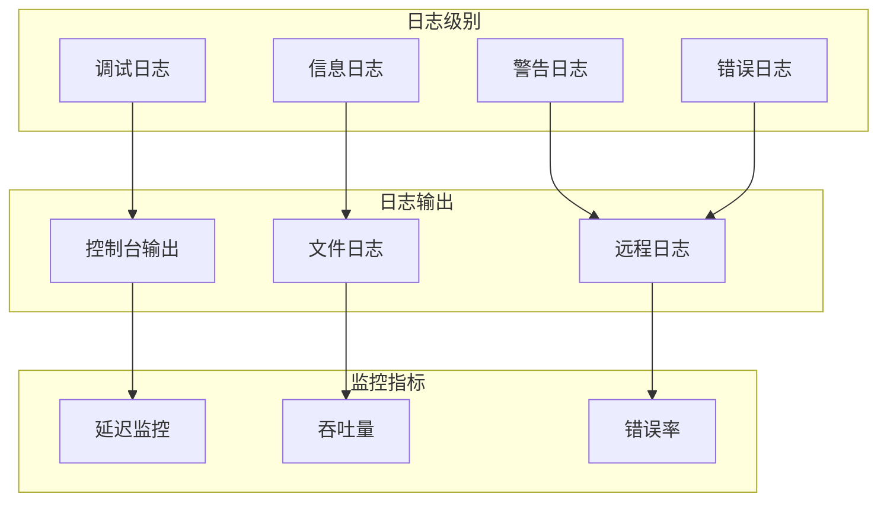

# WhatsApp 接口部署

<cite>
**本文档引用的文件**
- [setup-whatsapp-app.mdx](file://TBD/snippets/setup-whatsapp-app.mdx)
- [whatsapp.mdx](file://production/interfaces/whatsapp.mdx)
- [whatsapp.mdx](file://tools/toolkits/social/whatsapp.mdx)
- [introduction.mdx](file://agent-os/interfaces/whatsapp/introduction.mdx)
- [webhook.mdx](file://reference-api/schema/whatsapp/webhook.mdx)
- [verify-webhook.mdx](file://reference-api/schema/whatsapp/verify-webhook.mdx)
- [status.mdx](file://reference-api/schema/whatsapp/status.mdx)
- [overview.mdx](file://agent-os/usage/interfaces/whatsapp/image-generation-tools.mdx)
- [agent-with-user-memory.mdx](file://examples/agent-os/interfaces/whatsapp/agent-with-user-memory.mdx)
</cite>

## 目录
1. [简介](#简介)
2. [项目结构](#项目结构)
3. [核心组件](#核心组件)
4. [架构概览](#架构概览)
5. [详细组件分析](#详细组件分析)
6. [依赖关系分析](#依赖关系分析)
7. [性能考虑](#性能考虑)
8. [故障排除指南](#故障排除指南)
9. [结论](#结论)
10. [附录](#附录)

## 简介

本文档提供了基于智能代理平台的 WhatsApp 接口部署完整技术指南。该系统允许开发者将智能代理无缝集成到 WhatsApp Business API 中，实现自动化客户服务、信息查询和业务交互。

本部署方案基于 FastAPI 构建，通过 WhatsApp Business API 提供企业级消息服务，支持文本消息、媒体消息和模板消息的处理。系统采用模块化设计，便于扩展和维护。

## 项目结构

智能代理的 WhatsApp 集成采用分层架构设计，主要包含以下核心层次：



**图表来源**
- [introduction.mdx:1-98](file://agent-os/interfaces/whatsapp/introduction.mdx#L1-L98)
- [whatsapp.mdx:1-137](file://production/interfaces/whatsapp.mdx#L1-L137)

**章节来源**
- [introduction.mdx:1-98](file://agent-os/interfaces/whatsapp/introduction.mdx#L1-L98)
- [whatsapp.mdx:1-137](file://production/interfaces/whatsapp.mdx#L1-L137)

## 核心组件

### WhatsApp 接口组件

智能代理的 WhatsApp 集成主要由以下几个核心组件构成：

#### 1. WhatsApp 接口类
- **功能**：封装 Agent 或 Team 以支持 WhatsApp 通信
- **特性**：基于 FastAPI 构建，自动挂载 Webhook 路由
- **参数**：支持 agent 和 team 参数选择

#### 2. AgentOS 服务框架
- **功能**：提供应用服务器和路由管理
- **特性**：支持热重载和多实例部署
- **集成**：与 FastAPI 无缝集成

#### 3. 认证与安全组件
- **开发模式**：简化验证流程
- **生产模式**：启用完整的签名验证
- **密钥管理**：支持环境变量配置

**章节来源**
- [introduction.mdx:54-77](file://agent-os/interfaces/whatsapp/introduction.mdx#L54-L77)
- [whatsapp.mdx:1-32](file://production/interfaces/whatsapp.mdx#L1-L32)

## 架构概览

### 系统架构图



**图表来源**
- [introduction.mdx:86-97](file://agent-os/interfaces/whatsapp/introduction.mdx#L86-L97)
- [webhook.mdx:1-3](file://reference-api/schema/whatsapp/webhook.mdx#L1-L3)

### 数据流架构



**图表来源**
- [introduction.mdx:91-97](file://agent-os/interfaces/whatsapp/introduction.mdx#L91-L97)

**章节来源**
- [introduction.mdx:78-98](file://agent-os/interfaces/whatsapp/introduction.mdx#L78-L98)

## 详细组件分析

### WhatsApp 接口实现

#### 接口初始化参数

| 参数名 | 类型 | 默认值 | 描述 |
|--------|------|--------|------|
| `agent` | `Optional[Agent]` | `None` | Agno Agent 实例 |
| `team` | `Optional[Team]` | `None` | Agno Team 实例 |

#### 关键方法

| 方法名 | 参数 | 返回类型 | 描述 |
|--------|------|----------|------|
| `get_router` | `use_async: bool = True` | `APIRouter` | 返回 FastAPI 路由器并附加端点 |

**章节来源**
- [introduction.mdx:63-77](file://agent-os/interfaces/whatsapp/introduction.mdx#L63-L77)

### Webhook 端点设计

#### 状态检查端点



**图表来源**
- [introduction.mdx:82-97](file://agent-os/interfaces/whatsapp/introduction.mdx#L82-L97)

#### 端点功能说明

| 端点 | 方法 | 功能描述 | 返回码 |
|------|------|----------|--------|
| `/whatsapp/status` | `GET` | 健康状态检查 | `200` |
| `/whatsapp/webhook` | `GET` | Webhook 验证 | `200`, `403`, `500` |
| `/whatsapp/webhook` | `POST` | 消息接收处理 | `200`, `403`, `500` |

**章节来源**
- [introduction.mdx:82-97](file://agent-os/interfaces/whatsapp/introduction.mdx#L82-L97)

### WhatsApp 工具包

#### 工具包参数配置

| 参数名 | 类型 | 默认值 | 描述 |
|--------|------|--------|------|
| `access_token` | `Optional[str]` | `None` | WhatsApp Business API 访问令牌 |
| `phone_number_id` | `Optional[str]` | `None` | 电话号码 ID |
| `version` | `str` | `"v22.0"` | API 版本 |
| `recipient_waid` | `Optional[str]` | `None` | 默认收件人 WAID |
| `async_mode` | `bool` | `False` | 异步模式开关 |

#### 支持的消息类型

| 函数名 | 描述 | 参数 |
|--------|------|------|
| `send_text_message_sync` | 同步发送文本消息 | `text`, `recipient`, `preview_url`, `recipient_type` |
| `send_template_message_sync` | 同步发送模板消息 | `recipient`, `template_name`, `language_code`, `components` |
| `send_text_message_async` | 异步发送文本消息 | `text`, `recipient`, `preview_url`, `recipient_type` |
| `send_template_message_async` | 异步发送模板消息 | `recipient`, `template_name`, `language_code`, `components` |

**章节来源**
- [whatsapp.mdx:61-79](file://tools/toolkits/social/whatsapp.mdx#L61-L79)

### 环境配置管理

#### 必需环境变量



**图表来源**
- [setup-whatsapp-app.mdx:70-86](file://TBD/snippets/setup-whatsapp-app.mdx#L70-L86)

**章节来源**
- [setup-whatsapp-app.mdx:41-88](file://TBD/snippets/setup-whatsapp-app.mdx#L41-L88)

## 依赖关系分析

### 外部依赖关系

```mermaid
graph TB
subgraph "核心依赖"
AGNO[Agno 框架]
FASTAPI[FastAPI]
UVICORN[Uvicorn]
end
subgraph "WhatsApp 生态"
WABA[WhatsApp Business API]
META[Meta 平台]
NGROK[ngrok (开发)]
end
subgraph "工具包"
OPENAI[OpenAI 工具包]
MEMORY[内存管理]
DATABASE[(数据库)]
end
AGNO --> FASTAPI
FASTAPI --> UVICORN
AGNO --> WABA
WABA --> META
AGNO --> OPENAI
AGNO --> MEMORY
MEMORY --> DATABASE
UVICORN --> NGROK
```

**图表来源**
- [whatsapp.mdx:1-32](file://production/interfaces/whatsapp.mdx#L1-L32)
- [overview.mdx:1-51](file://agent-os/usage/interfaces/whatsapp/image-generation-tools.mdx#L1-L51)

### 内部组件依赖



**图表来源**
- [introduction.mdx:54-77](file://agent-os/interfaces/whatsapp/introduction.mdx#L54-L77)

**章节来源**
- [introduction.mdx:54-77](file://agent-os/interfaces/whatsapp/introduction.mdx#L54-L77)

## 性能考虑

### 消息处理优化

1. **异步处理机制**
   - 支持异步消息发送
   - 非阻塞代理执行
   - 并发消息处理能力

2. **内存管理策略**
   - 自动会话隔离
   - 历史记录优化
   - 缓存机制

3. **网络优化**
   - 连接池管理
   - 请求超时控制
   - 错误重试机制

### 扩展性设计



## 故障排除指南

### 常见问题及解决方案

#### Webhook 验证失败

**问题症状**：
- 返回 `403` 错误
- Webhook 配置验证失败

**解决步骤**：
1. 验证 `WHATSAPP_VERIFY_TOKEN` 配置
2. 确认 ngrok URL 正确性
3. 检查应用是否正常运行

#### 签名验证错误

**问题症状**：
- 生产模式下返回 `403`
- 消息无法正常接收

**解决步骤**：
1. 设置正确的 `APP_ENV=production`
2. 配置 `WHATSAPP_APP_SECRET`
3. 验证签名算法

#### 消息发送失败

**问题症状**：
- 消息发送超时
- 返回 `500` 错误

**解决步骤**：
1. 检查网络连接
2. 验证 API 密钥有效性
3. 查看服务器日志

### 调试工具和方法

#### 日志配置



**章节来源**
- [setup-whatsapp-app.mdx:70-88](file://TBD/snippets/setup-whatsapp-app.mdx#L70-L88)

## 结论

基于智能代理平台的 WhatsApp 接口部署方案提供了完整的企业级消息服务解决方案。该方案具有以下优势：

1. **模块化设计**：清晰的组件分离，便于维护和扩展
2. **安全性保障**：完整的认证和授权机制
3. **性能优化**：异步处理和缓存机制
4. **开发友好**：简化的开发模式和完善的调试工具
5. **生产就绪**：完整的监控和日志记录

通过遵循本文档的部署指南，开发者可以快速构建稳定可靠的 WhatsApp 智能代理应用。

## 附录

### 快速部署清单

#### 开发环境设置
- [ ] 创建 Meta 开发者账户
- [ ] 注册 Meta 商业账户
- [ ] 配置 ngrok 开发环境
- [ ] 设置必需的环境变量

#### 生产环境准备
- [ ] 配置生产环境变量
- [ ] 设置 Webhook 端点
- [ ] 配置 SSL 证书
- [ ] 设置监控告警

#### 测试验证
- [ ] 验证 Webhook 连通性
- [ ] 测试消息发送功能
- [ ] 验证签名验证机制
- [ ] 进行压力测试