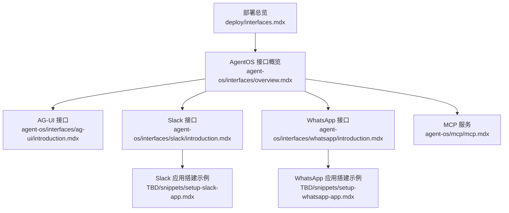
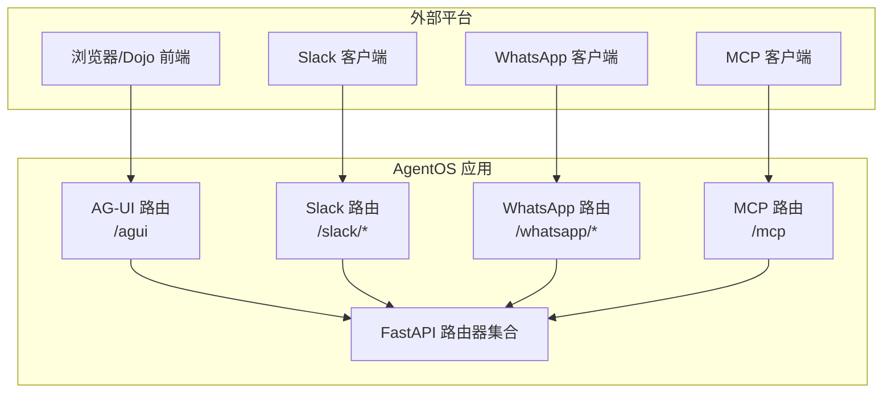
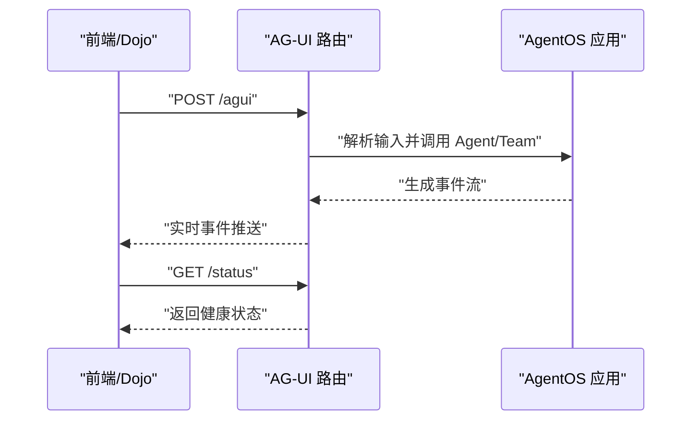
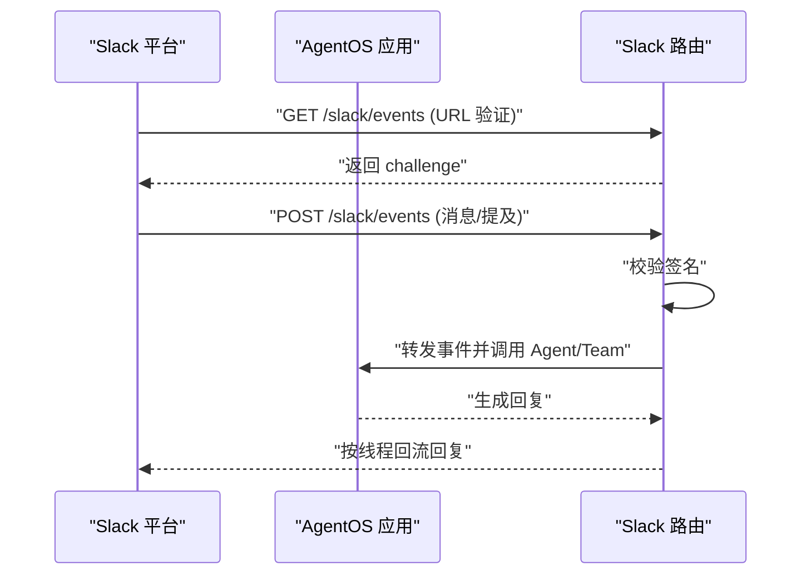
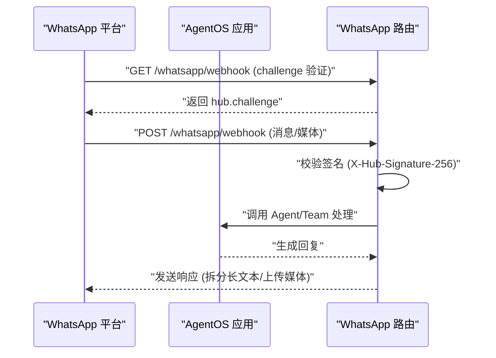
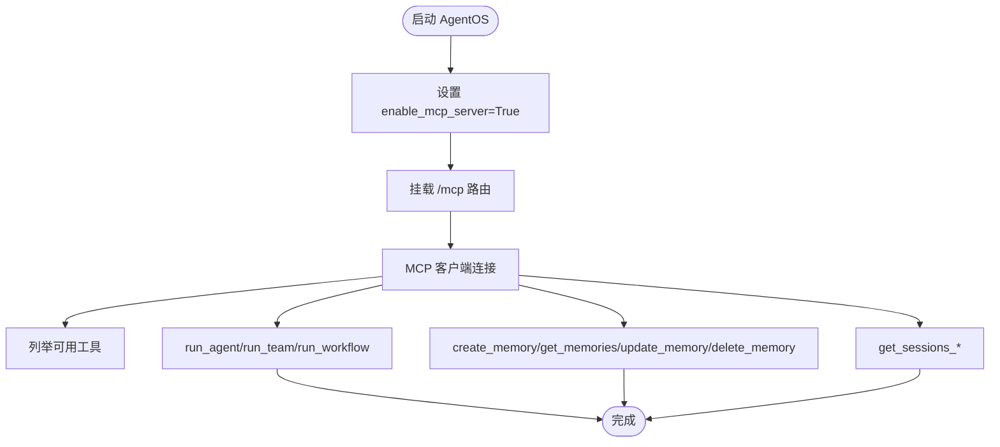
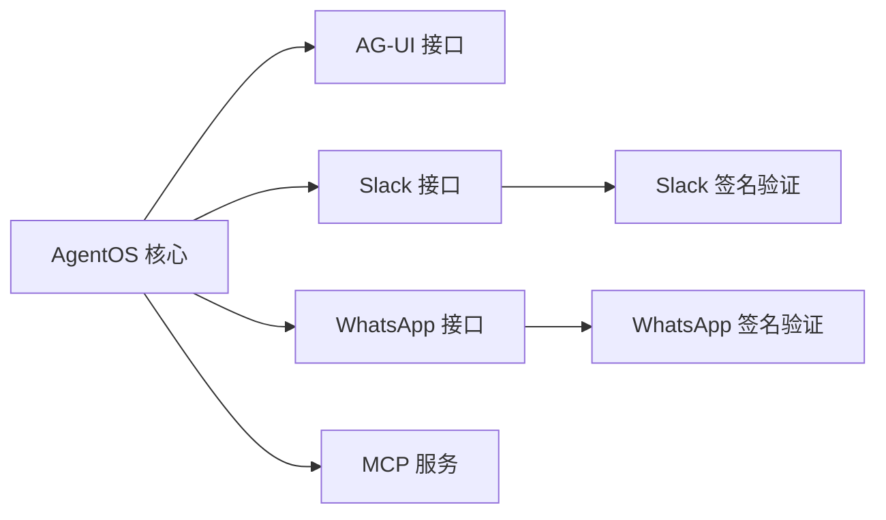

# 接口部署

<cite>
**本文引用的文件**
- [接口总览](file://deploy/interfaces.mdx)
- [AgentOS 接口概览](file://agent-os/interfaces/overview.mdx)
- [AG-UI 接口介绍](file://agent-os/interfaces/ag-ui/introduction.mdx)
- [Slack 接口介绍](file://agent-os/interfaces/slack/introduction.mdx)
- [WhatsApp 接口介绍](file://agent-os/interfaces/whatsapp/introduction.mdx)
- [MCP 服务介绍](file://agent-os/mcp/mcp.mdx)
- [Slack 应用搭建步骤（示例）](file://TBD/snippets/setup-slack-app.mdx)
- [WhatsApp 应用搭建步骤（示例）](file://TBD/snippets/setup-whatsapp-app.mdx)
</cite>

## 目录
1. [简介](#简介)
2. [项目结构](#项目结构)
3. [核心组件](#核心组件)
4. [架构总览](#架构总览)
5. [详细组件分析](#详细组件分析)
6. [依赖关系分析](#依赖关系分析)
7. [性能与扩展性](#性能与扩展性)
8. [安全与合规最佳实践](#安全与合规最佳实践)
9. [监控与日志](#监控与日志)
10. [故障排除指南](#故障排除指南)
11. [多接口并行部署示例与最佳实践](#多接口并行部署示例与最佳实践)
12. [结论](#结论)

## 简介
本文件面向需要在生产环境中部署多种通信接口（AG-UI、Discord、Slack、WhatsApp、MCP）的工程团队，系统化地说明各接口的部署流程、认证与签名验证、Webhook 设置要点，并给出安全、可观测性、性能与扩展性的建议。内容基于仓库中已有的接口文档与示例片段整理而成，帮助读者快速完成从开发到生产的端到端落地。

## 项目结构
围绕“接口部署”的知识主要分布在以下位置：
- 部署入口与导航：deploy/interfaces.mdx
- AgentOS 层面的接口能力与使用方式：agent-os/interfaces/overview.mdx
- 各协议/平台的具体实现与参数：agent-os/interfaces/ag-ui/introduction.mdx、agent-os/interfaces/slack/introduction.mdx、agent-os/interfaces/whatsapp/introduction.mdx、agent-os/mcp/mcp.mdx
- 平台应用搭建与环境变量示例：TBD/snippets/setup-slack-app.mdx、TBD/snippets/setup-whatsapp-app.mdx

图表来源
- [接口总览:1-38](file://deploy/interfaces.mdx#L1-L38)
- [AgentOS 接口概览:1-68](file://agent-os/interfaces/overview.mdx#L1-L68)
- [AG-UI 接口介绍:1-146](file://agent-os/interfaces/ag-ui/introduction.mdx#L1-L146)
- [Slack 接口介绍:1-100](file://agent-os/interfaces/slack/introduction.mdx#L1-L100)
- [WhatsApp 接口介绍:1-98](file://agent-os/interfaces/whatsapp/introduction.mdx#L1-L98)
- [MCP 服务介绍:1-146](file://agent-os/mcp/mcp.mdx#L1-L146)
- [Slack 应用搭建步骤（示例）:1-92](file://TBD/snippets/setup-slack-app.mdx#L1-L92)
- [WhatsApp 应用搭建步骤（示例）:1-88](file://TBD/snippets/setup-whatsapp-app.mdx#L1-L88)

章节来源
- [接口总览:1-38](file://deploy/interfaces.mdx#L1-L38)
- [AgentOS 接口概览:1-68](file://agent-os/interfaces/overview.mdx#L1-L68)

## 核心组件
- AG-UI 接口：通过 AG-UI 协议暴露 Agent/Team，提供标准的前端交互协议与事件流。
- Slack 接口：将 Agent/Team/Workflow 暴露为 Slack Bot，支持事件订阅、签名验证与线程会话。
- WhatsApp 接口：通过 Webhook 接收消息与媒体，进行签名验证与响应分发。
- MCP 服务：将 AgentOS 暴露为 MCP Server，提供统一的工具与运行接口，便于外部客户端接入。
- AgentOS 服务化：统一通过 AgentOS.serve 提供 Uvicorn 承载的 FastAPI 应用。

章节来源
- [AgentOS 接口概览:43-67](file://agent-os/interfaces/overview.mdx#L43-L67)
- [AG-UI 接口介绍:97-146](file://agent-os/interfaces/ag-ui/introduction.mdx#L97-L146)
- [Slack 接口介绍:48-100](file://agent-os/interfaces/slack/introduction.mdx#L48-L100)
- [WhatsApp 接口介绍:54-98](file://agent-os/interfaces/whatsapp/introduction.mdx#L54-L98)
- [MCP 服务介绍:7-146](file://agent-os/mcp/mcp.mdx#L7-L146)

## 架构总览
下图展示了 AgentOS 如何作为统一后端，挂载不同协议的路由并对外提供服务。

图表来源
- [AgentOS 接口概览:43-67](file://agent-os/interfaces/overview.mdx#L43-L67)
- [AG-UI 接口介绍:123-131](file://agent-os/interfaces/ag-ui/introduction.mdx#L123-L131)
- [Slack 接口介绍:76-86](file://agent-os/interfaces/slack/introduction.mdx#L76-L86)
- [WhatsApp 接口介绍:78-97](file://agent-os/interfaces/whatsapp/introduction.mdx#L78-L97)
- [MCP 服务介绍:58-60](file://agent-os/mcp/mcp.mdx#L58-L60)

## 详细组件分析

### AG-UI 接口
- 组件职责
  - 将 Agent/Team 包装为 AG-UI 兼容的 FastAPI 路由器。
  - 提供主入口与健康检查端点，支持实时事件流。
- 关键端点
  - POST /agui：接收 AG-UI 协议输入并流式返回事件。
  - GET /status：接口健康状态。
- 运行方式
  - 使用 AgentOS.serve 启动 Uvicorn，绑定 host/port。
- 自定义事件
  - 工具中产出的自定义事件可直接推送到前端。

图表来源
- [AG-UI 接口介绍:123-131](file://agent-os/interfaces/ag-ui/introduction.mdx#L123-L131)
- [AG-UI 接口介绍:132-146](file://agent-os/interfaces/ag-ui/introduction.mdx#L132-L146)

章节来源
- [AG-UI 接口介绍:1-146](file://agent-os/interfaces/ag-ui/introduction.mdx#L1-L146)

### Slack 接口
- 组件职责
  - 将 Agent/Team/Workflow 暴露为 Slack Bot。
  - 处理 URL 验证、事件签名验证、线程上下文会话。
- 关键端点
  - POST /slack/events：处理 Slack 事件（URL 验证、消息、@提及等），验证签名后回流到原线程。
- 认证与环境变量
  - SLACK_TOKEN（Bot User OAuth Token）、SLACK_SIGNING_SECRET（App Signing Secret）。
- 开发调试
  - 使用 ngrok 暴露本地端口，配置 Event Subscriptions 指向 /slack/events。
- 故障排查
  - 校验令牌、签名、权限与 ngrok 地址；查看签名失败或权限错误日志。

图表来源
- [Slack 接口介绍:76-86](file://agent-os/interfaces/slack/introduction.mdx#L76-L86)
- [Slack 接口介绍:94-100](file://agent-os/interfaces/slack/introduction.mdx#L94-L100)
- [Slack 应用搭建步骤（示例）:50-74](file://TBD/snippets/setup-slack-app.mdx#L50-L74)

章节来源
- [Slack 接口介绍:1-100](file://agent-os/interfaces/slack/introduction.mdx#L1-L100)
- [Slack 应用搭建步骤（示例）:1-92](file://TBD/snippets/setup-slack-app.mdx#L1-L92)

### WhatsApp 接口
- 组件职责
  - 通过 Webhook 接收用户消息与媒体，进行签名验证与响应分发。
- 关键端点
  - GET /whatsapp/status：健康检查。
  - GET /whatsapp/webhook：验证回调（hub.challenge）。
  - POST /whatsapp/webhook：接收消息并调用 Agent/Team 处理。
- 认证与环境变量
  - WHATSAPP_ACCESS_TOKEN、WHATSAPP_PHONE_NUMBER_ID、WHATSAPP_VERIFY_TOKEN。
  - 生产模式需 WHATSAPP_APP_SECRET 与 APP_ENV=production。
- 用户标识与会话
  - 使用对端手机号作为 user_id 与 session_id，确保会话隔离。

图表来源
- [WhatsApp 接口介绍:78-97](file://agent-os/interfaces/whatsapp/introduction.mdx#L78-L97)
- [WhatsApp 应用搭建步骤（示例）:52-68](file://TBD/snippets/setup-whatsapp-app.mdx#L52-L68)

章节来源
- [WhatsApp 接口介绍:1-98](file://agent-os/interfaces/whatsapp/introduction.mdx#L1-L98)
- [WhatsApp 应用搭建步骤（示例）:1-88](file://TBD/snippets/setup-whatsapp-app.mdx#L1-L88)

### MCP 服务
- 组件职责
  - 将 AgentOS 暴露为 MCP Server，提供统一的工具与运行接口。
- 启用方式
  - 在创建 AgentOS 时设置 enable_mcp_server=True，默认挂载在 /mcp。
- 可用工具
  - 获取配置、运行 Agent/Team/Workflow、查询会话、内存增删改查等。
- 使用场景
  - 与 MCP 客户端对接，统一连接外部工具与数据源。

图表来源
- [MCP 服务介绍:9-60](file://agent-os/mcp/mcp.mdx#L9-L60)
- [MCP 服务介绍:62-146](file://agent-os/mcp/mcp.mdx#L62-L146)

章节来源
- [MCP 服务介绍:1-146](file://agent-os/mcp/mcp.mdx#L1-L146)

### Discord 接口（概述）
- 当前仓库未提供 Discord 接口的独立部署文档。若需在生产中集成 Discord，请参考如下通用流程：
  - 在 Discord Developer Portal 创建应用与 Bot 角色，配置权限与交互。
  - 本地开发使用反向代理或内网穿透工具暴露回调地址。
  - 在应用中实现签名验证与事件路由，映射到 Agent/Team 的执行逻辑。
  - 生产环境启用 HTTPS 与严格的访问控制策略。
- 由于仓库未收录具体部署细节，建议结合 Slack/WhatsApp 的实现模式与签名验证机制进行对照实现。

## 依赖关系分析
- AgentOS 作为统一后端，通过接口模块挂载不同协议的路由。
- 各接口均依赖 AgentOS.serve 提供的 Uvicorn 承载。
- 平台侧（Slack、WhatsApp）依赖各自的签名验证与 Webhook 回调。
- MCP 服务与 AG-UI 作为协议层，不直接依赖平台签名，但需遵循各自协议规范。

图表来源
- [AgentOS 接口概览:43-67](file://agent-os/interfaces/overview.mdx#L43-L67)
- [Slack 接口介绍:82-84](file://agent-os/interfaces/slack/introduction.mdx#L82-L84)
- [WhatsApp 接口介绍:94-96](file://agent-os/interfaces/whatsapp/introduction.mdx#L94-L96)

章节来源
- [AgentOS 接口概览:43-67](file://agent-os/interfaces/overview.mdx#L43-L67)

## 性能与扩展性
- 路由与并发
  - 使用异步接口（如 AG-UI 的异步开关）提升并发处理能力。
  - 对长消息与大媒体响应进行拆分与分片传输，避免超时。
- 会话与缓存
  - 基于线程/会话 ID 的上下文复用，减少重复计算。
  - 对频繁查询的会话/记忆进行缓存，降低数据库压力。
- 扩展性
  - 多接口并行部署共享同一 AgentOS 实例，统一扩缩容。
  - 使用负载均衡与多副本部署，结合健康检查端点保障可用性。
- 资源与限流
  - 针对平台速率限制（如 Slack/WhatsApp）实施退避与队列化处理。
  - 对外部模型调用设置超时与重试策略，避免级联故障。

## 安全与合规最佳实践
- API 密钥与机密
  - 使用受控的密钥管理服务（如 KMS/云托管密钥）存储 SLACK_TOKEN、WHATSAPP_ACCESS_TOKEN、WHATSAPP_APP_SECRET 等。
  - 禁止将密钥写入版本库，采用环境注入或配置中心。
- Webhook 验证
  - Slack：严格校验签名，拒绝无效请求。
  - WhatsApp：启用 X-Hub-Signature-256 校验，生产环境必须配置 APP_SECRET。
- 访问控制
  - 仅开放必要端口与路径，限制来源 IP 或使用网关鉴权。
  - 对 /mcp 与 /agui 等接口增加鉴权与速率限制。
- 日志与审计
  - 记录签名验证失败、权限错误、异常堆栈与关键业务事件。
  - 对敏感字段脱敏输出，遵守数据保护法规。

## 监控与日志
- 健康检查
  - AG-UI：GET /status
  - Slack：GET /slack/status（如存在）
  - WhatsApp：GET /whatsapp/status
  - MCP：GET /mcp（协议层面健康探测）
- 指标采集
  - 请求量、响应时间、错误率、并发会话数、模型调用耗时。
- 日志
  - 结构化日志，包含 trace_id、user_id、session_id、接口名、状态码。
  - 分离访问日志与业务日志，按级别落盘与归档。

## 故障排除指南
- Slack
  - 症状：签名失败、无法收到消息。
  - 排查：核对 SLACK_TOKEN、SLACK_SIGNING_SECRET；确认 Event Subscriptions 的 URL 与路径；检查 ngrok 是否在线。
- WhatsApp
  - 症状：验证失败、无法回流消息。
  - 排查：核对 WHATSAPP_ACCESS_TOKEN、WHATSAPP_PHONE_NUMBER_ID、WHATSAPP_VERIFY_TOKEN；生产模式配置 APP_ENV 与 APP_SECRET；确认 Webhook URL 与订阅项。
- AG-UI
  - 症状：前端无事件流。
  - 排查：确认 /agui 路由可达；检查 Agent/Team 是否正常；查看 Uvicorn 日志。
- MCP
  - 症状：客户端无法连接或工具不可用。
  - 排查：确认 enable_mcp_server 已启用；检查 /mcp 路由；核对客户端协议版本与工具清单。

章节来源
- [Slack 接口介绍:94-100](file://agent-os/interfaces/slack/introduction.mdx#L94-L100)
- [WhatsApp 接口介绍:91-97](file://agent-os/interfaces/whatsapp/introduction.mdx#L91-L97)

## 多接口并行部署示例与最佳实践
- 示例思路
  - 在同一 AgentOS 实例中同时挂载 AG-UI、Slack、WhatsApp、MCP 路由，共享 Agent/Team/Workflow。
  - 使用环境变量区分各平台密钥，按环境切换（development/production）。
- 最佳实践
  - 统一健康检查端点与日志格式，便于集中观测。
  - 对外暴露最小路径，内部路由前缀清晰（/agui、/slack、/whatsapp、/mcp）。
  - 为每个接口设置独立的速率限制与超时策略，避免互相影响。
  - 使用反向代理统一 TLS 与证书管理，开启访问控制与审计。

## 结论
通过 AgentOS 的统一接口抽象，可以低成本地将同一套智能体能力同时暴露到 AG-UI、Slack、WhatsApp 与 MCP 等多种协议与平台上。结合签名验证、密钥管理、健康检查与可观测性体系，可在保证安全性与稳定性的同时，实现高并发与可扩展的生产级部署。