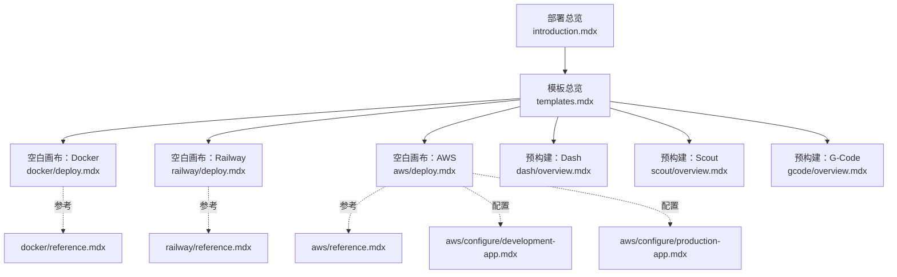
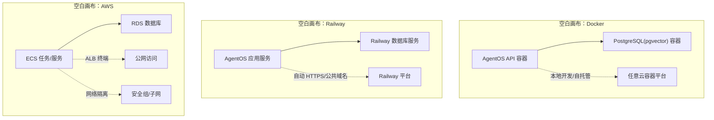
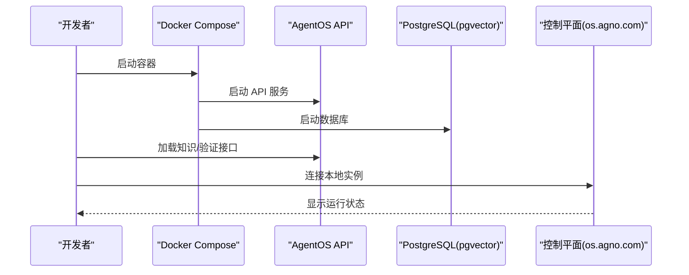
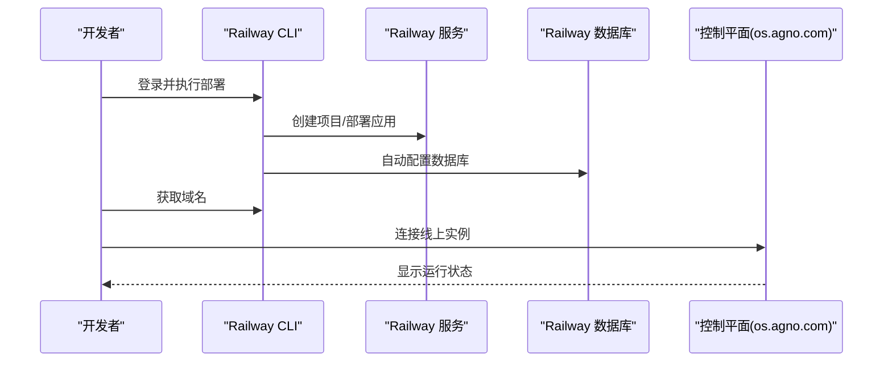
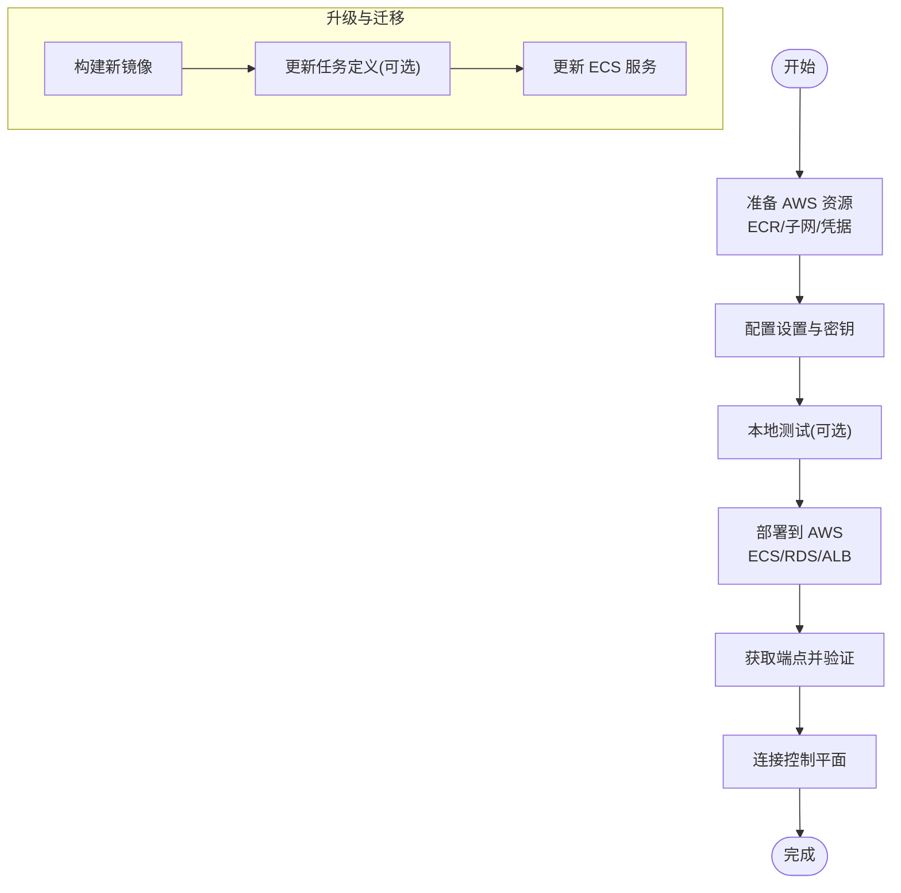
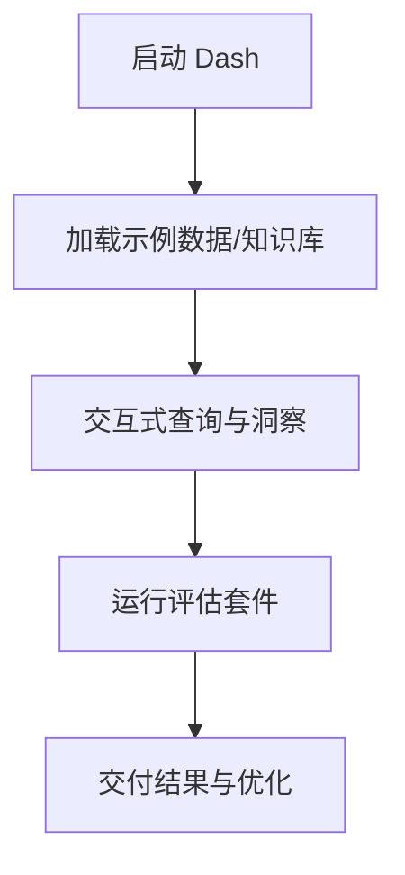
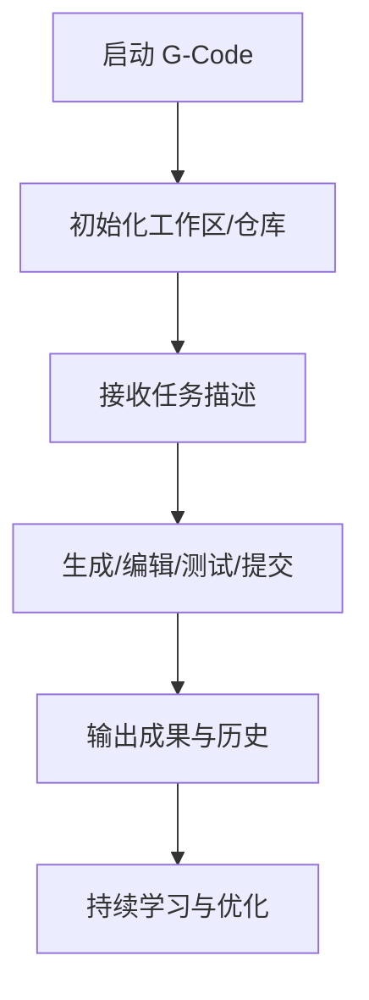
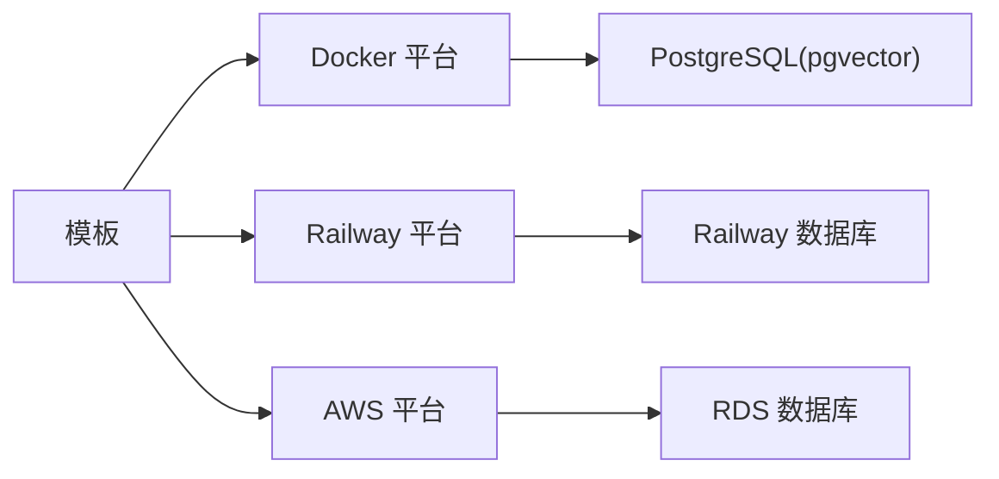

# 模板对比与选择

<cite>
**本文引用的文件**
- [templates.mdx](file://deploy/templates.mdx)
- [introduction.mdx](file://deploy/introduction.mdx)
- [docker/deploy.mdx](file://deploy/templates/docker/deploy.mdx)
- [docker/reference.mdx](file://deploy/templates/docker/reference.mdx)
- [railway/deploy.mdx](file://deploy/templates/railway/deploy.mdx)
- [railway/reference.mdx](file://deploy/templates/railway/reference.mdx)
- [aws/deploy.mdx](file://deploy/templates/aws/deploy.mdx)
- [aws/reference.mdx](file://deploy/templates/aws/reference.mdx)
- [aws/configure/development-app.mdx](file://deploy/templates/aws/configure/development-app.mdx)
- [aws/configure/production-app.mdx](file://deploy/templates/aws/configure/production-app.mdx)
- [dash/overview.mdx](file://deploy/templates/dash/overview.mdx)
- [scout/overview.mdx](file://deploy/templates/scout/overview.mdx)
- [gcode/overview.mdx](file://deploy/templates/gcode/overview.mdx)
</cite>

## 目录
1. [引言](#引言)
2. [项目结构](#项目结构)
3. [核心组件](#核心组件)
4. [架构总览](#架构总览)
5. [详细组件分析](#详细组件分析)
6. [依赖关系分析](#依赖关系分析)
7. [性能考量](#性能考量)
8. [故障排查指南](#故障排查指南)
9. [结论](#结论)
10. [附录](#附录)

## 引言
本技术文档聚焦于“模板对比与选择”，系统性梳理空白画布模板（Docker、Railway、AWS）与预构建模板（Dash、Scout、G-Code）在部署时间、性能表现、成本效益与扩展能力方面的差异，并提供模板选择的决策矩阵、升级与迁移指导、版本管理与维护策略，以及面向不同规模与需求的实践建议。

## 项目结构
围绕“模板”主题，仓库中与部署模板直接相关的内容主要位于 deploy/templates 及其子目录，涵盖空白画布与预构建两类模板的部署说明、参考手册与运维指引；同时，顶层的部署介绍页提供了从模板到应用再到接口的完整流程说明。

图表来源
- [templates.mdx](file://deploy/templates.mdx)
- [introduction.mdx](file://deploy/introduction.mdx)
- [docker/deploy.mdx](file://deploy/templates/docker/deploy.mdx)
- [docker/reference.mdx](file://deploy/templates/docker/reference.mdx)
- [railway/deploy.mdx](file://deploy/templates/railway/deploy.mdx)
- [railway/reference.mdx](file://deploy/templates/railway/reference.mdx)
- [aws/deploy.mdx](file://deploy/templates/aws/deploy.mdx)
- [aws/reference.mdx](file://deploy/templates/aws/reference.mdx)
- [aws/configure/development-app.mdx](file://deploy/templates/aws/configure/development-app.mdx)
- [aws/configure/production-app.mdx](file://deploy/templates/aws/configure/production-app.mdx)
- [dash/overview.mdx](file://deploy/templates/dash/overview.mdx)
- [scout/overview.mdx](file://deploy/templates/scout/overview.mdx)
- [gcode/overview.mdx](file://deploy/templates/gcode/overview.mdx)

章节来源
- [templates.mdx](file://deploy/templates.mdx)
- [introduction.mdx](file://deploy/introduction.mdx)

## 核心组件
- 空白画布模板
  - Docker：本地开发与自托管友好，支持任意容器化平台部署，示例应用与热重载便于快速迭代。
  - Railway：一键部署至 Railway，自动提供 HTTPS 与公共域名，适合快速上线与 MVP。
  - AWS：生产级基础设施（ECS Fargate + RDS + ALB），强调企业级可靠性与控制力，提供成本估算与部署脚本。
- 预构建模板
  - Dash：自学习数据代理，具备六层上下文与学习机制，适用于数据问答与洞察生成。
  - Scout：待完善页面提示，建议关注后续发布。
  - G-Code：自改进编码代理，持久化工作区与可审计的 Git 工作流，适用于代码生成与迭代。

章节来源
- [templates.mdx](file://deploy/templates.mdx)
- [docker/deploy.mdx](file://deploy/templates/docker/deploy.mdx)
- [railway/deploy.mdx](file://deploy/templates/railway/deploy.mdx)
- [aws/deploy.mdx](file://deploy/templates/aws/deploy.mdx)
- [dash/overview.mdx](file://deploy/templates/dash/overview.mdx)
- [scout/overview.mdx](file://deploy/templates/scout/overview.mdx)
- [gcode/overview.mdx](file://deploy/templates/gcode/overview.mdx)

## 架构总览
下图展示三种空白画布模板的典型运行时与基础设施关系，帮助理解部署路径与依赖。

图表来源
- [docker/deploy.mdx](file://deploy/templates/docker/deploy.mdx)
- [railway/deploy.mdx](file://deploy/templates/railway/deploy.mdx)
- [aws/deploy.mdx](file://deploy/templates/aws/deploy.mdx)

## 详细组件分析

### Docker 模板
- 特点与优势
  - 本地开发体验佳：示例代理、热重载、连接控制平面便捷。
  - 可移植性强：可在任何支持 Docker 的平台部署，适合自托管与多云。
- 适用场景
  - 个人/小团队本地验证、快速原型、私有化部署。
- 关键流程（本地开发）
  - 克隆模板 → 设置密钥 → 启动容器 → 加载知识 → 控制台连接。
- 运维要点
  - 常用管理命令、环境变量、本地开发替代方案、常见问题定位。

图表来源
- [docker/deploy.mdx](file://deploy/templates/docker/deploy.mdx)
- [docker/reference.mdx](file://deploy/templates/docker/reference.mdx)

章节来源
- [docker/deploy.mdx](file://deploy/templates/docker/deploy.mdx)
- [docker/reference.mdx](file://deploy/templates/docker/reference.mdx)

### Railway 模板
- 特点与优势
  - 快速上线：一键部署脚本、自动 HTTPS、公共域名。
  - 开发体验一致：本地与线上步骤相近，便于验证。
- 适用场景
  - MVP 快速验证、无需运维的团队或个人项目。
- 关键流程（生产部署）
  - 登录 Railway → 执行部署脚本 → 加载知识 → 获取域名 → 控制台连接。

图表来源
- [railway/deploy.mdx](file://deploy/templates/railway/deploy.mdx)
- [railway/reference.mdx](file://deploy/templates/railway/reference.mdx)

章节来源
- [railway/deploy.mdx](file://deploy/templates/railway/deploy.mdx)
- [railway/reference.mdx](file://deploy/templates/railway/reference.mdx)

### AWS 模板
- 特点与优势
  - 生产级架构：ECS Fargate、RDS、ALB、安全组等，强调可靠性与可控性。
  - 成本透明：提供月度成本估算，便于预算规划。
- 适用场景
  - 中大型团队、需要企业级合规与扩展性的项目。
- 关键流程（生产部署）
  - AWS 准备 → 配置设置/密钥 → 本地测试 → 部署至 AWS → 获取端点 → 控制台连接。
- 升级与迁移
  - 开发镜像构建与重启、生产镜像构建与推送、ECS 任务定义与服务更新。

图表来源
- [aws/deploy.mdx](file://deploy/templates/aws/deploy.mdx)
- [aws/reference.mdx](file://deploy/templates/aws/reference.mdx)
- [aws/configure/development-app.mdx](file://deploy/templates/aws/configure/development-app.mdx)
- [aws/configure/production-app.mdx](file://deploy/templates/aws/configure/production-app.mdx)

章节来源
- [aws/deploy.mdx](file://deploy/templates/aws/deploy.mdx)
- [aws/reference.mdx](file://deploy/templates/aws/reference.mdx)
- [aws/configure/development-app.mdx](file://deploy/templates/aws/configure/development-app.mdx)
- [aws/configure/production-app.mdx](file://deploy/templates/aws/configure/production-app.mdx)

### 预构建模板：Dash
- 功能差异与使用场景
  - 自学习数据代理，通过六层上下文与学习机制提升回答质量，适合数据问答与业务洞察。
  - 提供示例数据与知识库加载、评估套件与控制平面连接。
- 适用场景
  - 需要“即插即用”的数据智能代理，快速落地业务问答与报表辅助。

图表来源
- [dash/overview.mdx](file://deploy/templates/dash/overview.mdx)

章节来源
- [dash/overview.mdx](file://deploy/templates/dash/overview.mdx)

### 预构建模板：Scout
- 当前状态
  - 页面提示“即将推出”，建议关注后续发布与功能说明。
- 建议
  - 保持对仓库动态的关注，以便在功能完善后进行评估与试用。

章节来源
- [scout/overview.mdx](file://deploy/templates/scout/overview.mdx)

### 预构建模板：G-Code
- 功能差异与使用场景
  - 自改进编码代理，持久化工作区与 Git 工作流，适合代码生成、审查与迭代。
  - 支持工具体系与学习机制，持续优化项目约定与错误模式。
- 适用场景
  - 需要“对话式编程”的团队或个人，追求可审计、可复用的代码工程化流程。

图表来源
- [gcode/overview.mdx](file://deploy/templates/gcode/overview.mdx)

章节来源
- [gcode/overview.mdx](file://deploy/templates/gcode/overview.mdx)

## 依赖关系分析
- 模板与平台依赖
  - Docker：依赖容器运行时与数据库镜像，适合任意容器平台。
  - Railway：依赖 Railway CLI 与平台服务，自动提供数据库与域名。
  - AWS：依赖 AWS CLI、ECR、VPC 子网、RDS、ECS、ALB 等资源。
- 预构建模板
  - Dash/G-Code 基于 AgentOS 与 PostgreSQL(pgvector)，提供示例脚本与评估工具。
- 运维与升级
  - Docker/Railway：通过容器编排与平台命令进行管理。
  - AWS：通过基础设施命令行工具与 ECS 任务定义/服务进行升级与迁移。

图表来源
- [docker/deploy.mdx](file://deploy/templates/docker/deploy.mdx)
- [railway/deploy.mdx](file://deploy/templates/railway/deploy.mdx)
- [aws/deploy.mdx](file://deploy/templates/aws/deploy.mdx)

章节来源
- [docker/deploy.mdx](file://deploy/templates/docker/deploy.mdx)
- [railway/deploy.mdx](file://deploy/templates/railway/deploy.mdx)
- [aws/deploy.mdx](file://deploy/templates/aws/deploy.mdx)

## 性能考量
- 部署时间
  - Docker：约 5 分钟（本地开发与自托管）。
  - Railway：约 10 分钟（一键部署与自动配置）。
  - AWS：约 15 分钟（含基础设施准备与部署）。
- 性能表现
  - Docker：受宿主机与容器资源限制，适合小规模并发。
  - Railway：平台托管，自动扩缩容与高可用，适合中小规模稳定流量。
  - AWS：弹性伸缩与负载均衡，适合高并发与大规模扩展。
- 成本效益
  - Docker：零平台成本，需自管资源。
  - Railway：按用量计费，起步免费，适合 MVP。
  - AWS：明确月度成本估算，适合长期稳定运营与合规要求。
- 扩展能力
  - Docker：手动扩缩容与多节点部署。
  - Railway：平台自动扩缩容与蓝绿发布。
  - AWS：ECS/Auto Scaling + RDS 多可用区，支持复杂监控与告警。

章节来源
- [templates.mdx](file://deploy/templates.mdx)
- [aws/deploy.mdx](file://deploy/templates/aws/deploy.mdx)

## 故障排查指南
- Docker
  - 端口占用、数据库未就绪、容器反复重启等问题可通过日志与常用管理命令定位。
- Railway
  - CLI 未安装、首次初始化失败、数据库超时、502 等问题可通过平台日志与命令修复。
- AWS
  - 凭证错误、RDS 初始化耗时、ECS 任务失败、LB 返回 503 等问题需检查控制台与日志。

章节来源
- [docker/reference.mdx](file://deploy/templates/docker/reference.mdx)
- [railway/reference.mdx](file://deploy/templates/railway/reference.mdx)
- [aws/reference.mdx](file://deploy/templates/aws/reference.mdx)

## 结论
- 若追求“最快上线”，优先选择 Railway。
- 若追求“完全自控与扩展”，优先选择 AWS。
- 若追求“开箱即用与易用性”，可考虑 Dash/G-Code。
- 若需要“本地验证与自托管”，Docker 是最佳起点。

## 附录

### 决策矩阵与评估标准
- 评估维度
  - 部署时间、平台门槛、成本、可扩展性、运维复杂度、企业合规与安全。
- 选择建议
  - 小型团队/MVP：Railway
  - 自托管/多云：Docker
  - 企业级：AWS
  - 业务问答/洞察：Dash
  - 编码工程化：G-Code
  - 待完善：Scout

章节来源
- [templates.mdx](file://deploy/templates.mdx)

### 模板升级与迁移指导
- Docker/Railway
  - 通过容器编排与平台命令进行滚动更新与回滚。
- AWS
  - 构建新镜像 → 更新任务定义（如变更 CPU/内存/环境变量）→ 更新服务以拉取新镜像。
- 开发与生产的切换
  - 使用对应环境配置文件与命令行参数，确保密钥与资源分离。

章节来源
- [docker/reference.mdx](file://deploy/templates/docker/reference.mdx)
- [railway/reference.mdx](file://deploy/templates/railway/reference.mdx)
- [aws/reference.mdx](file://deploy/templates/aws/reference.mdx)
- [aws/configure/development-app.mdx](file://deploy/templates/aws/configure/development-app.mdx)
- [aws/configure/production-app.mdx](file://deploy/templates/aws/configure/production-app.mdx)

### 版本管理与维护策略
- 依赖管理
  - 通过包管理与脚本生成依赖清单，统一升级与锁定版本。
- 环境隔离
  - 区分开发/生产环境变量与资源，避免交叉污染。
- 发布与回滚
  - 采用镜像标签与平台发布策略，保留历史版本以便回滚。

章节来源
- [docker/reference.mdx](file://deploy/templates/docker/reference.mdx)
- [railway/reference.mdx](file://deploy/templates/railway/reference.mdx)
- [aws/reference.mdx](file://deploy/templates/aws/reference.mdx)
- [aws/configure/production-app.mdx](file://deploy/templates/aws/configure/production-app.mdx)