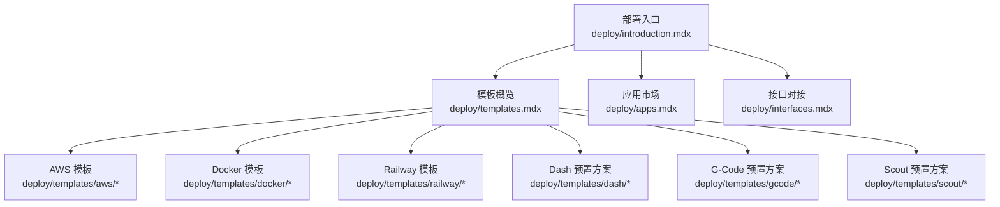
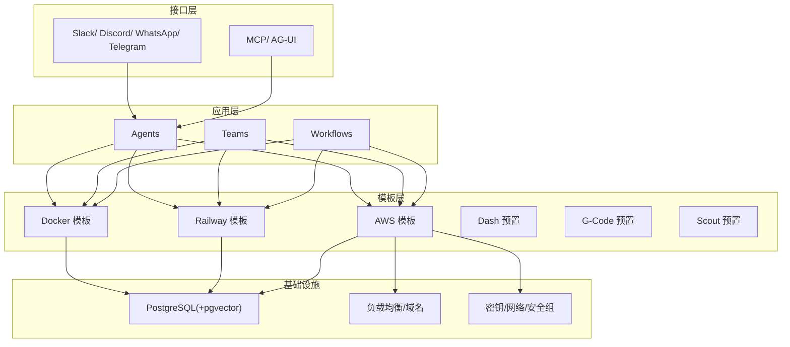
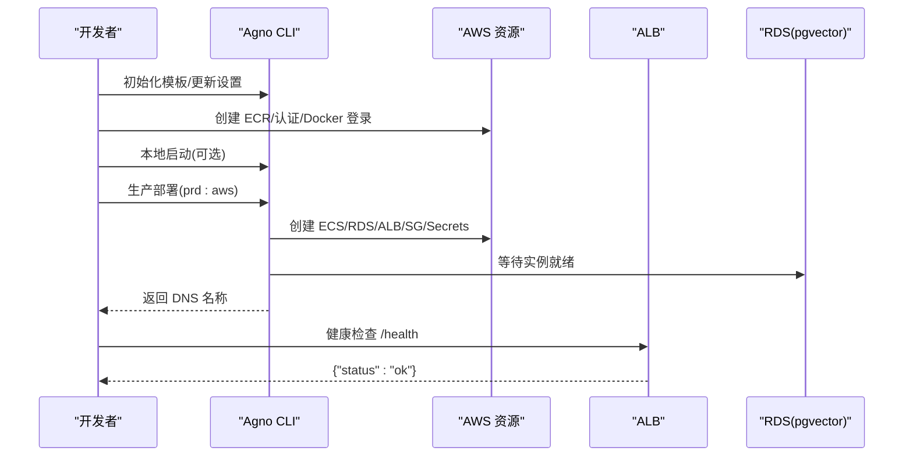
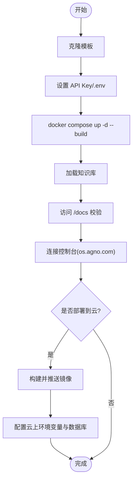
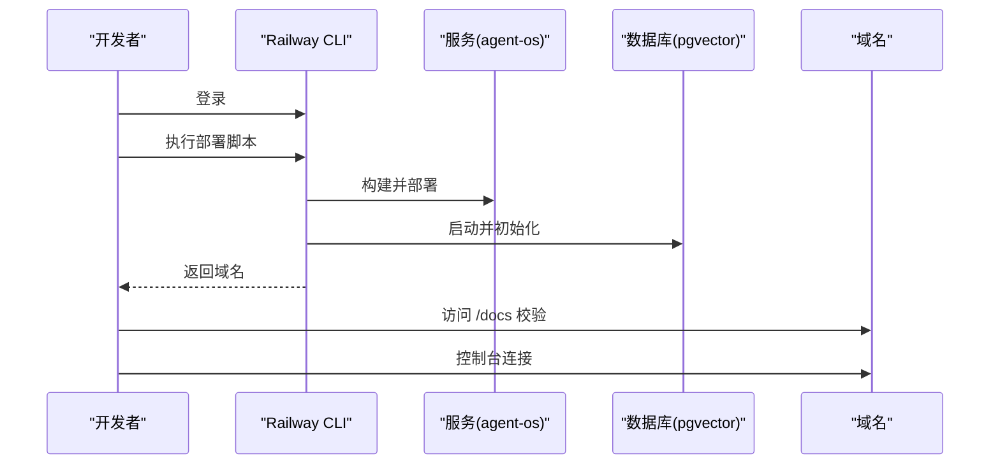
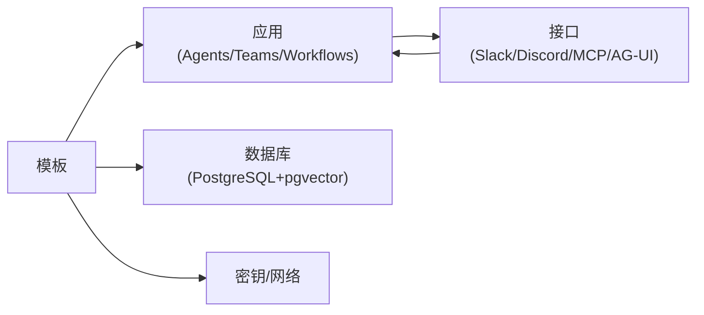

# 模板系统

<cite>
**本文引用的文件**
- [templates.mdx](file://deploy/templates.mdx)
- [deploy/introduction.mdx](file://deploy/introduction.mdx)
- [deploy/apps.mdx](file://deploy/apps.mdx)
- [deploy/interfaces.mdx](file://deploy/interfaces.mdx)
- [deploy/templates/aws/deploy.mdx](file://deploy/templates/aws/deploy.mdx)
- [deploy/templates/aws/reference.mdx](file://deploy/templates/aws/reference.mdx)
- [deploy/templates/aws/configure/overview.mdx](file://deploy/templates/aws/configure/overview.mdx)
- [deploy/templates/aws/manage/troubleshooting.mdx](file://deploy/templates/aws/manage/troubleshooting.mdx)
- [deploy/templates/docker/deploy.mdx](file://deploy/templates/docker/deploy.mdx)
- [deploy/templates/docker/reference.mdx](file://deploy/templates/docker/reference.mdx)
- [deploy/templates/railway/deploy.mdx](file://deploy/templates/railway/deploy.mdx)
- [deploy/templates/railway/reference.mdx](file://deploy/templates/railway/reference.mdx)
- [deploy/templates/dash/overview.mdx](file://deploy/templates/dash/overview.mdx)
- [deploy/templates/gcode/overview.mdx](file://deploy/templates/gcode/overview.mdx)
- [deploy/templates/scout/overview.mdx](file://deploy/templates/scout/overview.mdx)
</cite>

## 目录
1. [简介](#简介)
2. [项目结构](#项目结构)
3. [核心组件](#核心组件)
4. [架构总览](#架构总览)
5. [详细组件分析](#详细组件分析)
6. [依赖关系分析](#依赖关系分析)
7. [性能考虑](#性能考虑)
8. [故障排除指南](#故障排除指南)
9. [结论](#结论)
10. [附录](#附录)

## 简介
本文件面向模板系统使用者与维护者，系统性阐述 AgentOS 的模板体系：从“空白画布”到“预置方案”，覆盖 AWS、Docker、Railway、Dash、G-Code、Scout 等模板的设计理念、适用场景、部署流程、配置参数与定制化路径，并给出扩展机制、最佳实践、性能优化与故障排除建议。目标是帮助不同技术背景的用户快速上手并稳定运行。

## 项目结构
模板系统位于部署模块下，采用“按模板分目录”的组织方式，每个模板包含部署说明、参考手册与可选的配置/运维子页。总体结构如下：

图示来源
- [deploy/introduction.mdx:1-102](file://deploy/introduction.mdx#L1-L102)
- [deploy/templates.mdx:1-48](file://deploy/templates.mdx#L1-L48)

章节来源
- [deploy/introduction.mdx:1-102](file://deploy/introduction.mdx#L1-L102)
- [deploy/templates.mdx:1-48](file://deploy/templates.mdx#L1-L48)

## 核心组件
- 模板类型
  - 空白画布：Docker、Railway、AWS，适合自定义基础设施与应用组合。
  - 预置方案：Dash（数据智能）、G-Code（代码生成）、Scout（上下文管理），开箱即用。
- 应用层：Agents、Teams、Workflows，作为业务负载注入到模板中。
- 接口层：Slack、Discord、WhatsApp、Telegram、MCP、AG-UI，连接用户与 AgentOS。
- 运维与扩展：环境变量、数据库迁移、依赖管理、CI/CD、监控与排障。

章节来源
- [deploy/templates.mdx:6-48](file://deploy/templates.mdx#L6-L48)
- [deploy/introduction.mdx:7-101](file://deploy/introduction.mdx#L7-L101)
- [deploy/apps.mdx:1-138](file://deploy/apps.mdx#L1-L138)
- [deploy/interfaces.mdx:1-38](file://deploy/interfaces.mdx#L1-L38)

## 架构总览
模板系统以“模板 + 应用 + 接口”三层解耦设计，模板负责基础设施与运行时，应用负责业务逻辑，接口负责用户交互。下图展示典型流水线与关键依赖：

图示来源
- [deploy/templates/docker/deploy.mdx:1-112](file://deploy/templates/docker/deploy.mdx#L1-L112)
- [deploy/templates/railway/deploy.mdx:1-152](file://deploy/templates/railway/deploy.mdx#L1-L152)
- [deploy/templates/aws/deploy.mdx:18-32](file://deploy/templates/aws/deploy.mdx#L18-L32)
- [deploy/apps.mdx:1-138](file://deploy/apps.mdx#L1-L138)
- [deploy/interfaces.mdx:1-38](file://deploy/interfaces.mdx#L1-L38)

## 详细组件分析

### AWS 模板
- 设计理念
  - 生产级基础设施：ECS Fargate 托管容器、RDS 托管数据库（含 pgvector）、ALB 公网入口、Secrets Manager 安全存储。
  - 可扩展性：支持多可用区子网、弹性伸缩、HTTPS 与自定义域名。
- 适用场景
  - 大规模生产、企业合规与可观测性要求高、需要完全掌控底层资源。
- 部署步骤
  - 前置准备：安装工具、虚拟环境、Agno CLI、克隆模板或使用 CLI 初始化。
  - AWS 设置：创建 ECR 仓库、认证 Docker 与 ECR、获取公共子网 ID。
  - 配置：编辑基础设施设置、复制并填充生产密钥文件。
  - 本地测试（可选）：本地 up 启动验证。
  - 生产部署：执行 CLI 命令创建资源，等待 RDS 就绪后校验健康检查。
- 关键配置
  - 基础设施设置：区域、子网、镜像仓库等。
  - 环境变量：数据库连接、运行时环境、端口等。
  - 密钥管理：本地忽略目录与 AWS Secrets Manager。
- 自定义与扩展
  - 新增 Agent/工具、加载知识库、更换模型、添加依赖、数据库迁移脚本。
- 成本估算
  - ECS Fargate、RDS PostgreSQL、ALB、Secrets Manager 等资源的月度成本区间。

图示来源
- [deploy/templates/aws/deploy.mdx:104-294](file://deploy/templates/aws/deploy.mdx#L104-L294)

章节来源
- [deploy/templates/aws/deploy.mdx:1-370](file://deploy/templates/aws/deploy.mdx#L1-L370)
- [deploy/templates/aws/reference.mdx:1-183](file://deploy/templates/aws/reference.mdx#L1-L183)
- [deploy/templates/aws/configure/overview.mdx:1-75](file://deploy/templates/aws/configure/overview.mdx#L1-L75)
- [deploy/templates/aws/manage/troubleshooting.mdx:1-209](file://deploy/templates/aws/manage/troubleshooting.mdx#L1-L209)

### Docker 模板
- 设计理念
  - 本地优先：Docker Compose 快速拉起 AgentOS 与 PostgreSQL(pgvector)，支持热重载与多云部署。
- 适用场景
  - 本地开发、快速验证、跨云部署（任何支持 Docker 的平台）。
- 部署步骤
  - 克隆模板、设置 API Key、本地启动、加载知识、确认运行、连接控制台。
  - 生产部署：构建镜像、推送至任意容器注册表、配置环境变量与启用 pgvector 的数据库。
- 关键配置
  - 环境变量：数据库连接、端口、运行时环境等。
  - 依赖管理：pyproject.toml 与依赖生成脚本。
- 自定义与扩展
  - 新增 Agent/工具、加载知识库、更换模型、添加依赖。

图示来源
- [deploy/templates/docker/deploy.mdx:14-112](file://deploy/templates/docker/deploy.mdx#L14-L112)

章节来源
- [deploy/templates/docker/deploy.mdx:1-112](file://deploy/templates/docker/deploy.mdx#L1-L112)
- [deploy/templates/docker/reference.mdx:1-156](file://deploy/templates/docker/reference.mdx#L1-L156)

### Railway 模板
- 设计理念
  - 低运维门槛：一键部署 AgentOS 与 PostgreSQL(pgvector)，自动 HTTPS 与公开域名。
- 适用场景
  - MVP 快速上线、小团队与个人项目、无需管理基础设施。
- 部署步骤
  - 克隆模板、设置 API Key、本地启动、加载知识、连接控制台。
  - 生产部署：登录 Railway CLI、执行部署脚本、打开域名、再次连接控制台。
- 关键配置
  - 环境变量、服务副本数、日志查看、数据库启停。
- 自定义与扩展
  - 新增 Agent/工具、加载知识库、更换模型、添加依赖。

图示来源
- [deploy/templates/railway/deploy.mdx:76-141](file://deploy/templates/railway/deploy.mdx#L76-L141)

章节来源
- [deploy/templates/railway/deploy.mdx:1-152](file://deploy/templates/railway/deploy.mdx#L1-L152)
- [deploy/templates/railway/reference.mdx:1-164](file://deploy/templates/railway/reference.mdx#L1-L164)

### Dash 预置方案
- 特点
  - 自学习数据代理：通过六层上下文与学习机制持续改进回答质量。
  - 数据驱动：结合表元数据、人工标注、查询模式、机构知识、学习记录与运行时上下文。
- 适用场景
  - 需要“会学习”的数据问答与 SQL 生成，强调业务语义与错误修复的累积。
- 部署
  - 本地：克隆仓库、设置 API Key、启动容器、加载示例数据与知识库。
  - Railway：登录后一键部署，加载数据与知识库，连接控制台。
- 定制
  - 知识库三要素：表元数据、查询模式、业务规则；支持增量更新与重建。

章节来源
- [deploy/templates/dash/overview.mdx:1-144](file://deploy/templates/dash/overview.mdx#L1-L144)

### G-Code 预置方案
- 特点
  - 自改进代码代理：在持久化工作空间内迭代编写、审查、测试与提交。
  - 工具体系：编码工具、推理工具、学习机；沙箱隔离工作区。
- 适用场景
  - 需要持续演进的代码生成与重构，强调可审计的工作树与项目约定学习。
- 部署
  - 本地：克隆仓库、设置 API Key、启动容器，随后在控制台交互。
  - Railway：登录后一键部署，连接控制台。
- 定制
  - 通过学习机保存项目约定、错误模式与偏好，随用随改。

章节来源
- [deploy/templates/gcode/overview.mdx:1-102](file://deploy/templates/gcode/overview.mdx#L1-L102)

### Scout 预置方案
- 状态
  - 页面即将上线，欢迎咨询与协助。
- 适用场景
  - 上线后将提供“自我管理的上下文代理”，适合需要长期上下文维护与动态调整的场景。

章节来源
- [deploy/templates/scout/overview.mdx:1-8](file://deploy/templates/scout/overview.mdx#L1-L8)

## 依赖关系分析
- 模板与应用
  - 模板提供运行时与基础设施，应用（Agents/Teams/Workflows）作为业务负载注入。
- 模板与接口
  - 接口（Slack/Discord/MCP/AG-UI）作为外部入口，调用模板中的 AgentOS API。
- 模板与数据库
  - PostgreSQL + pgvector 为向量检索与知识存储提供基础能力。
- 模板与密钥/网络
  - AWS 模板引入 Secrets Manager、安全组与 ALB；Railway/Docker 提供环境变量与网络配置。

图示来源
- [deploy/apps.mdx:1-138](file://deploy/apps.mdx#L1-L138)
- [deploy/interfaces.mdx:1-38](file://deploy/interfaces.mdx#L1-L38)
- [deploy/templates/aws/reference.mdx:153-166](file://deploy/templates/aws/reference.mdx#L153-L166)
- [deploy/templates/docker/reference.mdx:131-142](file://deploy/templates/docker/reference.mdx#L131-L142)
- [deploy/templates/railway/reference.mdx:136-148](file://deploy/templates/railway/reference.mdx#L136-L148)

章节来源
- [deploy/apps.mdx:1-138](file://deploy/apps.mdx#L1-L138)
- [deploy/interfaces.mdx:1-38](file://deploy/interfaces.mdx#L1-L38)

## 性能考虑
- 数据库与检索
  - 使用 pgvector 加速相似度检索；合理设计索引与查询模式，避免全表扫描。
  - 对高频查询建立缓存与预计算指标，降低实时检索压力。
- 应用并发与资源
  - Docker/Railway/AWS 模板均支持副本扩展与容器资源限制；根据负载调整副本数与 CPU/内存配额。
- 网络与入口
  - AWS 使用 ALB 与健康检查；Railway 自动 HTTPS；确保 DNS 解析与证书生效。
- 开发体验
  - 本地热重载与快速迭代，减少部署周期；生产部署前进行最小化回归测试。

## 故障排除指南
- AWS 常见问题
  - ECR 认证失败：重新执行 ECR 登录命令；检查令牌有效期。
  - RDS 启动慢：等待约 5-10 分钟；检查控制台状态。
  - ECS 健康检查失败：检查容器日志、环境变量、数据库连通性。
  - 数据库连接异常：避免密码中使用特殊字符；检查安全组放行。
  - EFS 挂载问题：确认挂载目标与子网一致、权限点 UID/GID 正确。
- Docker 常见问题
  - 端口占用：修改 compose 映射端口；确认容器日志。
  - 数据库未就绪：等待数据库启动后再试连接。
  - 容器反复重启：检查 .env 中 API Key 与数据库可用性。
- Railway 常见问题
  - CLI 未找到：安装 Railway CLI；初始化项目后重试。
  - 部署失败：先 init 再部署；查看服务日志。
  - 502 错误：容器启动中，稍后再试；查看服务日志定位原因。

章节来源
- [deploy/templates/aws/manage/troubleshooting.mdx:1-209](file://deploy/templates/aws/manage/troubleshooting.mdx#L1-L209)
- [deploy/templates/docker/reference.mdx:143-156](file://deploy/templates/docker/reference.mdx#L143-L156)
- [deploy/templates/railway/reference.mdx:149-164](file://deploy/templates/railway/reference.mdx#L149-L164)

## 结论
模板系统以“模板 + 应用 + 接口”为核心，提供从本地开发到生产部署的一体化路径。AWS 适合大规模与合规需求，Railway 适合快速上线，Docker 适合自托管与多云迁移；Dash/G-Code/Scout 则分别覆盖数据智能、代码生成与上下文管理的预置场景。通过标准化的配置、扩展机制与运维手册，用户可以按需选择并稳定交付。

## 附录
- 模板对比（时间与适用性）
  - Docker：本地开发/自托管，约 5 分钟。
  - Railway：快速生产，约 10 分钟。
  - AWS：规模化生产，约 15 分钟。
- 应用与接口导航
  - 应用市场：Agents/Teams/Workflows。
  - 接口市场：Slack/Discord/WhatsApp/Telegram/MCP/AG-UI。
- 版本与升级
  - 依赖升级：通过依赖生成脚本统一生成 requirements 并重建镜像/服务。
  - 数据库迁移：在 AWS 模板中使用 Alembic 管理迁移，生产启动时自动迁移。
  - CI/CD：预置 GitHub Actions 实现代码质量与镜像构建自动化。

章节来源
- [deploy/templates.mdx:42-48](file://deploy/templates.mdx#L42-L48)
- [deploy/apps.mdx:1-138](file://deploy/apps.mdx#L1-L138)
- [deploy/interfaces.mdx:1-38](file://deploy/interfaces.mdx#L1-L38)
- [deploy/templates/aws/reference.mdx:122-134](file://deploy/templates/aws/reference.mdx#L122-L134)
- [deploy/templates/aws/configure/overview.mdx:58-62](file://deploy/templates/aws/configure/overview.mdx#L58-L62)