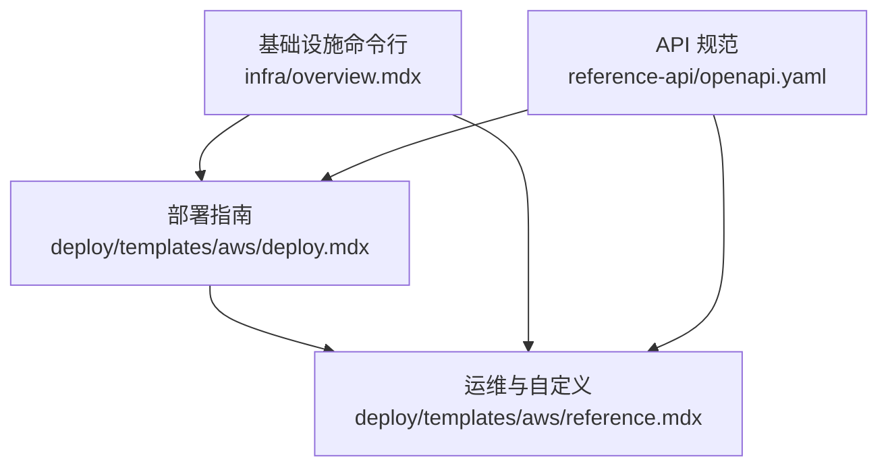
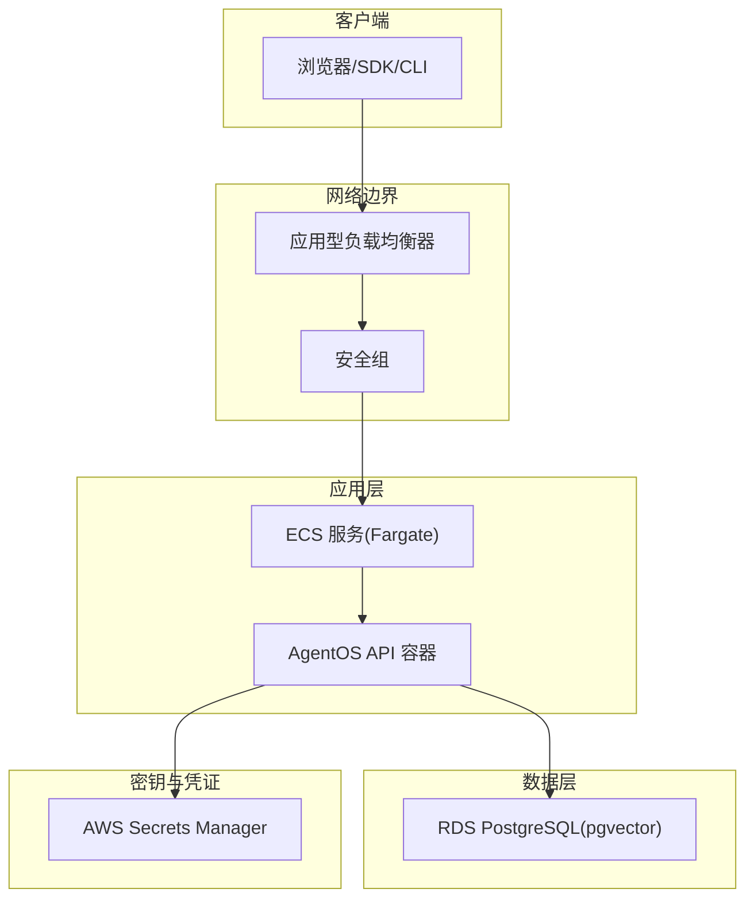
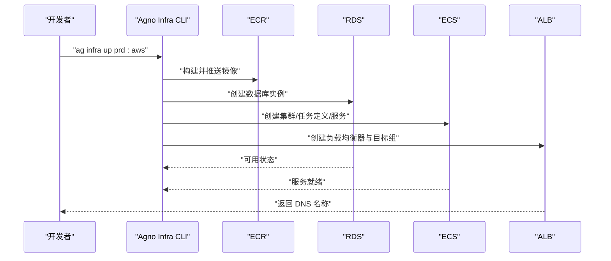
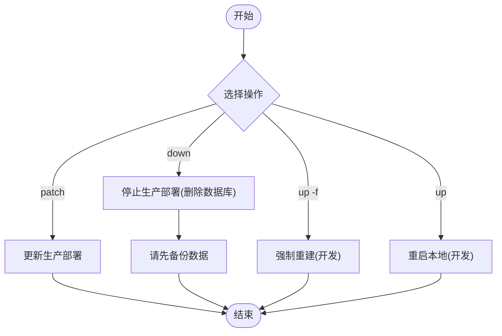
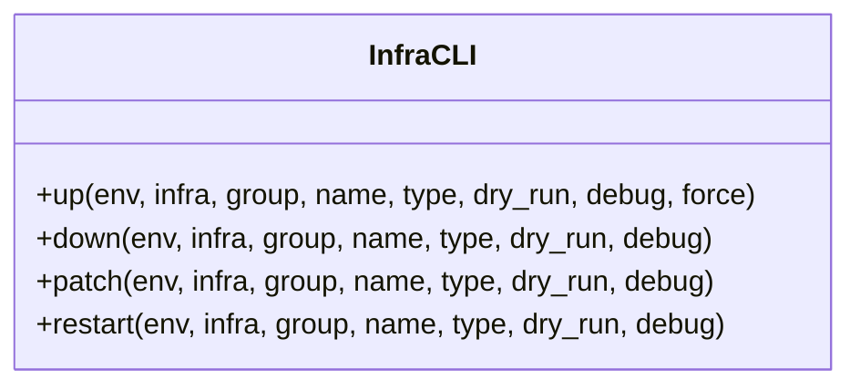
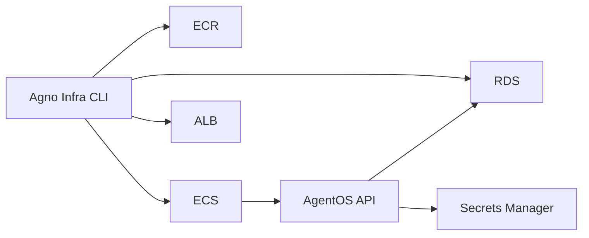

# AWS 模板

<cite>
**本文引用的文件**
- [deploy.mdx](file://deploy/templates/aws/deploy.mdx)
- [reference.mdx](file://deploy/templates/aws/reference.mdx)
- [overview.mdx（Agno Infra）](file://infra/overview.mdx)
- [openapi.yaml](file://reference-api/openapi.yaml)
</cite>

## 目录
1. [简介](#简介)
2. [项目结构](#项目结构)
3. [核心组件](#核心组件)
4. [架构总览](#架构总览)
5. [详细组件分析](#详细组件分析)
6. [依赖关系分析](#依赖关系分析)
7. [性能与成本优化](#性能与成本优化)
8. [故障排除指南](#故障排除指南)
9. [结论](#结论)
10. [附录](#附录)

## 简介
本技术文档面向希望在 AWS 上进行企业级部署的团队，围绕基于 ECS/Fargate 的容器化后端、RDS 托管数据库与应用型负载均衡器的组合，系统阐述基础设施即代码（IaC）、安全合规与高可用性设计，并提供从开发到生产的差异化配置建议。文档同时覆盖 IAM 权限、VPC 网络与安全组规则、成本优化、监控告警与灾难恢复思路，以及 AWS CLI 与 Terraform 使用示例与常见问题排查。

## 项目结构
该仓库提供了 AWS 模板的部署与参考文档，关键位置如下：
- 部署指南与步骤：deploy/templates/aws/deploy.mdx
- 运维与自定义：deploy/templates/aws/reference.mdx
- 基础设施命令行工具概览：infra/overview.mdx
- API 规范：reference-api/openapi.yaml

**图示来源**
- [deploy.mdx:1-370](file://deploy/templates/aws/deploy.mdx#L1-L370)
- [reference.mdx:1-183](file://deploy/templates/aws/reference.mdx#L1-L183)
- [overview.mdx（Agno Infra）:1-349](file://infra/overview.mdx#L1-L349)
- [openapi.yaml](file://reference-api/openapi.yaml)

**章节来源**
- [deploy.mdx:1-370](file://deploy/templates/aws/deploy.mdx#L1-L370)
- [reference.mdx:1-183](file://deploy/templates/aws/reference.mdx#L1-L183)
- [overview.mdx（Agno Infra）:1-349](file://infra/overview.mdx#L1-L349)
- [openapi.yaml](file://reference-api/openapi.yaml)

## 核心组件
- 应用容器与编排
  - ECS 集群、任务定义与服务：用于运行 AgentOS API 与相关组件，采用 Fargate 计算以实现无服务器容器托管。
  - 容器镜像：通过 ECR 存储与分发，支持推送与拉取。
- 数据层
  - RDS PostgreSQL（启用 pgvector 插件）：托管数据库，提供高可用与备份能力。
- 网络与入口
  - 应用型负载均衡器（ALB）与目标组：统一入口、健康检查与流量分发。
  - 安全组：网络访问控制，限制入站/出站流量。
- 凭据与密钥
  - AWS Secrets Manager：集中存储与轮换 API 密钥等敏感信息。
- 开发与运维
  - 本地开发（Docker）与生产（AWS）双环境命令行工具链，支持 up/down/patch/restart/dry-run 等操作。

**章节来源**
- [deploy.mdx:18-44](file://deploy/templates/aws/deploy.mdx#L18-L44)
- [reference.mdx:9-18](file://deploy/templates/aws/reference.mdx#L9-L18)
- [overview.mdx（Agno Infra）:8-100](file://infra/overview.mdx#L8-L100)

## 架构总览
下图展示了生产级 AWS 架构的关键节点与数据流：

**图示来源**
- [deploy.mdx:20-31](file://deploy/templates/aws/deploy.mdx#L20-L31)
- [reference.mdx:155-166](file://deploy/templates/aws/reference.mdx#L155-L166)

## 详细组件分析

### 组件一：部署流程与资源编排
- 步骤拆解
  - AWS 前置准备：创建 ECR 仓库、认证 Docker 与获取子网 ID；或通过 CLI 快速完成。
  - 配置阶段：编辑基础设施设置文件，填写区域、子网、镜像仓库等；准备生产密钥文件。
  - 本地验证（可选）：在本地启动验证接口可用性。
  - 生产部署：推送镜像至 ECR，创建 RDS、ECS、ALB、安全组等资源。
  - 获取入口：从 ALB 获取 DNS 名称，调用 /health 验证。
- 关键注意点
  - RDS 首次创建约需 5-10 分钟，部署流程会等待其变为可用状态。
  - ECR 令牌有效期约 12 小时，过期需重新认证。

**图示来源**
- [deploy.mdx:104-294](file://deploy/templates/aws/deploy.mdx#L104-L294)

**章节来源**
- [deploy.mdx:104-294](file://deploy/templates/aws/deploy.mdx#L104-L294)

### 组件二：运维与自定义
- 运维命令
  - 更新部署：patch（生产）
  - 停止部署：down（生产，会删除数据库，请提前备份）
  - 强制重建：up（开发，带强制标志）
  - 重启本地：up（开发）
- 自定义项
  - 新增 Agent：在代码中新增 Agent 并注册，本地重启生效。
  - 添加工具：引入第三方工具包，按需启用。
  - 加载知识：本地与生产分别提供执行命令方式。
  - 切换模型：更新 Agent 的模型配置并生成依赖清单。
  - 增加依赖：编辑依赖清单并重新生成与重建。
- 环境变量
  - 包含 OPENAI_API_KEY、数据库连接参数、运行环境标识等。

**图示来源**
- [reference.mdx:9-18](file://deploy/templates/aws/reference.mdx#L9-L18)

**章节来源**
- [reference.mdx:9-18](file://deploy/templates/aws/reference.mdx#L9-L18)
- [reference.mdx:136-166](file://deploy/templates/aws/reference.mdx#L136-L166)

### 组件三：基础设施命令行工具（Agno Infra）
- 支持的环境与平台
  - 环境：dev（开发）、prd（生产）
  - 平台：docker（本地）、aws（生产）
- 常用命令与选项
  - up/down/patch/restart
  - 过滤器：--env、--infra、--group、--name、--type
  - 助手：--dry-run、--debug、-f（强制重建）

**图示来源**
- [overview.mdx（Agno Infra）:8-349](file://infra/overview.mdx#L8-L349)

**章节来源**
- [overview.mdx（Agno Infra）:8-349](file://infra/overview.mdx#L8-L349)

### 组件四：API 规范与集成
- API 规范文件 openapi.yaml 提供了接口定义，便于客户端对接与自动化测试。
- 结合 ALB 与 ECS，API 在生产环境中通过 HTTPS 入口暴露。

**章节来源**
- [openapi.yaml](file://reference-api/openapi.yaml)

## 依赖关系分析
- 命令行工具链与部署流程耦合度高：Agno Infra CLI 是部署与运维的核心入口。
- 网络与安全依赖 VPC、子网与安全组：必须确保子网具备公网 IP 且安全组放行必要端口。
- 数据依赖 RDS：容器需能连通数据库，且数据库初始化包含 pgvector 扩展。
- 凭据依赖 Secrets Manager：API 启动前需正确读取密钥。

**图示来源**
- [deploy.mdx:104-294](file://deploy/templates/aws/deploy.mdx#L104-L294)
- [reference.mdx:155-166](file://deploy/templates/aws/reference.mdx#L155-L166)

**章节来源**
- [deploy.mdx:104-294](file://deploy/templates/aws/deploy.mdx#L104-L294)
- [reference.mdx:155-166](file://deploy/templates/aws/reference.mdx#L155-L166)

## 性能与成本优化
- 成本估算（月度近似）
  - ECS Fargate：$30-50
  - RDS PostgreSQL（含 pgvector）：$25
  - 应用型负载均衡器：$20-25
  - AWS Secrets Manager：几乎免费
  - 安全组：免费
  - 总计：约 $75-100/月
- 性能与可用性
  - 多可用区部署：选择不同 AZ 的公共子网，提升容灾能力。
  - 负载均衡健康检查与自动伸缩：结合 ECS 任务数与 CPU/内存阈值策略。
  - 数据库性能：根据查询模式调整实例规格与只读副本。
- 成本优化策略
  - 选择合适 Fargate CPU/内存配额，避免过度预留。
  - 使用预留实例或节省计划（如适用）降低数据库成本。
  - 清理未使用的 ECR 镜像与未挂载的 EBS 卷。
  - 通过 CloudWatch 设置成本告警，限制异常支出。

**章节来源**
- [deploy.mdx:33-44](file://deploy/templates/aws/deploy.mdx#L33-L44)

## 故障排除指南
- 常见问题与处理
  - ECR 认证失败：重跑认证命令，确认令牌未过期。
  - RDS 创建耗时：等待至“可用”状态，检查控制台状态。
  - 找不到公共子网：检查路由表是否指向 IGW，确认子网映射。
  - 502 错误：容器启动中，稍后再试；若持续，查看 ECS 任务日志。
  - 任务反复重启：检查环境变量、API 密钥与数据库连通性。
  - AWS 凭证错误：重新配置并验证身份。
  - RDS 连接超时：等待数据库可用，检查安全组放行。
  - ECS 任务失败：查看 CloudWatch 日志定位启动错误。
  - 负载均衡 503：等待目标健康检查通过。
- 建议的诊断路径
  - 先检查 ALB 健康状态与目标组绑定。
  - 再检查 ECS 服务状态与任务日志。
  - 最后核对数据库连通性与密钥配置。

**章节来源**
- [deploy.mdx:326-370](file://deploy/templates/aws/deploy.mdx#L326-L370)
- [reference.mdx:167-182](file://deploy/templates/aws/reference.mdx#L167-L182)

## 结论
该 AWS 模板以 ECS/Fargate、RDS 与 ALB 为核心，结合 Agno Infra CLI 实现从开发到生产的标准化交付。通过明确的环境差异、严格的网络与安全配置、完善的运维命令与故障排查流程，能够满足企业级部署对高可用、安全与可观测性的要求。配合成本优化与监控告警，可在保证稳定性的同时控制总体拥有成本。

## 附录

### A. 开发/测试/生产差异化配置要点
- 开发环境
  - 本地 Docker 启动，便于快速迭代与调试。
  - 环境变量 RUNTIME_ENV 可设为 dev 以启用自动重载。
- 测试环境
  - 使用独立的 ECR 仓库与 RDS 实例，隔离测试数据。
  - 配置较小规格的 Fargate 任务，降低成本。
- 生产环境
  - 多 AZ 公共子网部署，启用安全组最小权限原则。
  - 使用 Secrets Manager 管理密钥，定期轮换。
  - 配置 ALB 健康检查与自动伸缩策略，保障 SLA。

**章节来源**
- [reference.mdx:136-166](file://deploy/templates/aws/reference.mdx#L136-L166)
- [deploy.mdx:194-258](file://deploy/templates/aws/deploy.mdx#L194-L258)

### B. IAM 权限管理建议
- 最小权限原则：仅授予创建/修改 ECR、RDS、ECS、ALB、安全组与 Secrets Manager 所需权限。
- 凭据注入：通过角色或临时凭据注入容器，避免硬编码密钥。
- 审计与合规：开启 CloudTrail 与 Config，记录关键变更。

[本节为通用实践建议，不直接分析具体文件]

### C. VPC 网络与安全组规则
- VPC 设计
  - 使用公共子网承载 ALB 与对外可达的服务，私有子网承载应用与数据库。
  - 公共子网应具备到 IGW 的路由。
- 安全组
  - 入站：允许来自 ALB 的 80/443 至 ECS 服务端口。
  - 出站：允许到 RDS 的 5432 端口与必要的 DNS/时间同步。
  - 限制源地址范围，仅放行可信网段。

**章节来源**
- [deploy.mdx:138-192](file://deploy/templates/aws/deploy.mdx#L138-L192)

### D. 监控告警与灾难恢复
- 监控告警
  - CloudWatch：CPU/内存利用率、请求延迟、错误率、数据库连接数。
  - 告警：针对健康检查失败、任务重启、RDS 不可用、成本超支等。
- 灾难恢复
  - RDS 自动备份与跨 AZ 备份策略。
  - ECR 镜像版本化与多区域复制（可选）。
  - ECS 任务数与健康检查阈值，确保快速自愈。

**章节来源**
- [reference.mdx:167-182](file://deploy/templates/aws/reference.mdx#L167-L182)

### E. AWS CLI 与 Terraform 使用示例
- AWS CLI
  - 创建 ECR 仓库、认证 Docker、列出子网、描述负载均衡器等。
  - 示例命令参见部署文档中的步骤与注释。
- Terraform
  - 若采用 Terraform 管理基础设施，建议以模块化方式组织 ECR、RDS、ECS、ALB、安全组与 Secrets Manager 资源。
  - 通过变量传递区域、子网、镜像仓库等参数，实现多环境复用。

**章节来源**
- [deploy.mdx:108-192](file://deploy/templates/aws/deploy.mdx#L108-L192)
- [deploy.mdx:277-291](file://deploy/templates/aws/deploy.mdx#L277-L291)