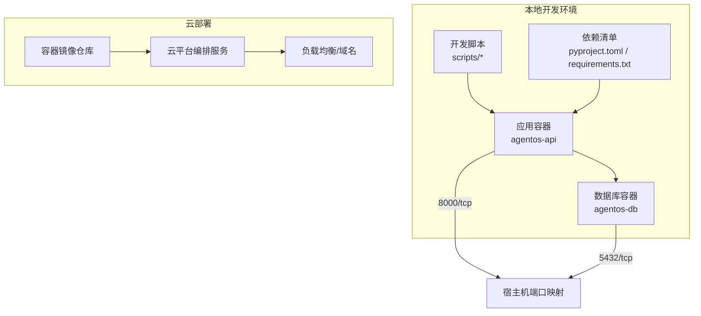
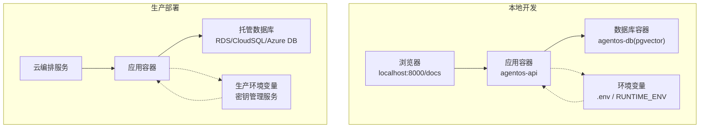
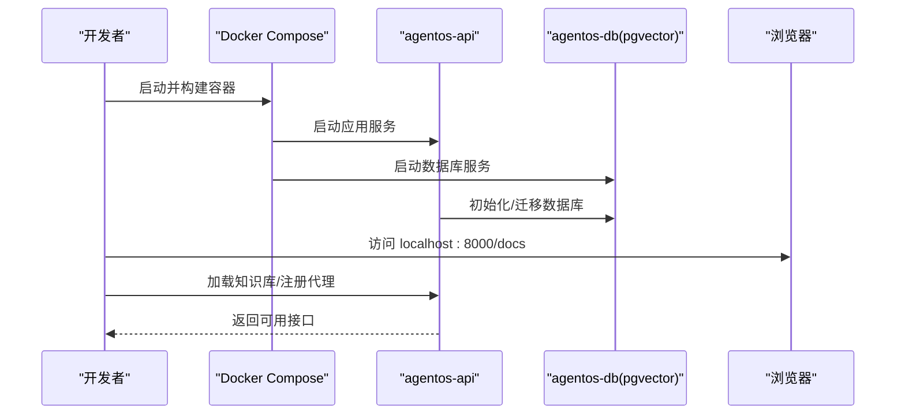
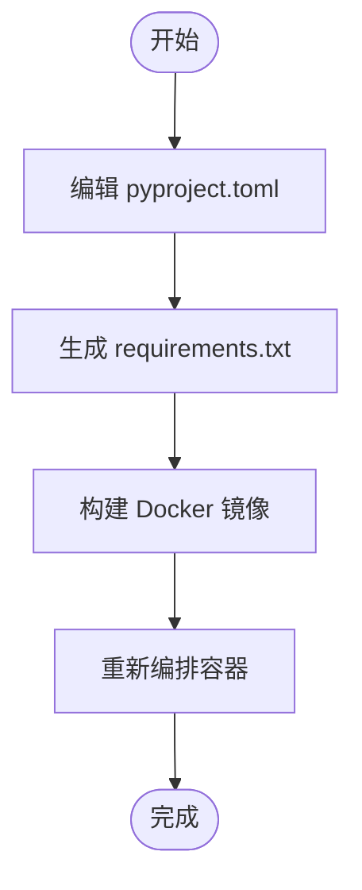
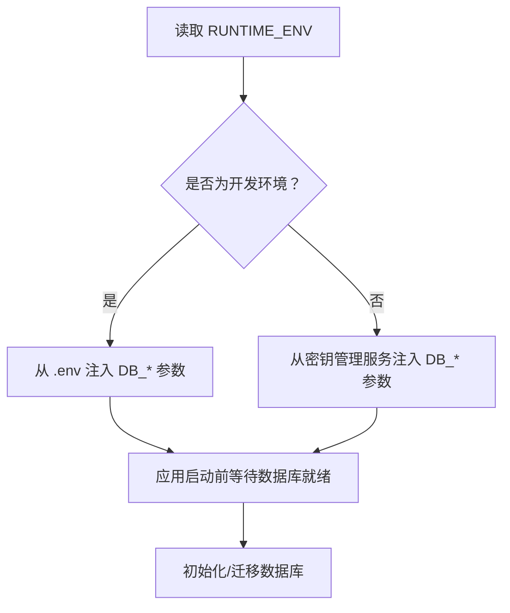
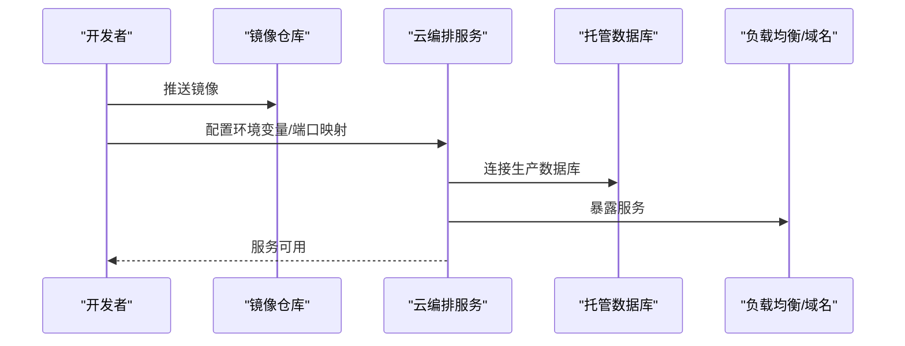
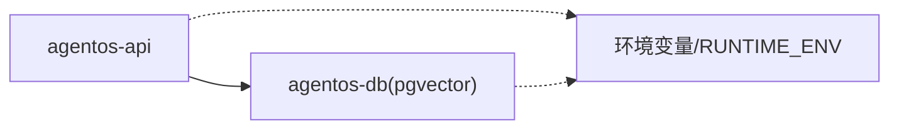

# Docker 模板

<cite>
**本文引用的文件**
- [deploy.mdx](file://deploy/templates/docker/deploy.mdx)
- [reference.mdx](file://deploy/templates/docker/reference.mdx)
- [docker.mdx](file://production/templates/docker.mdx)
- [env-vars.mdx](file://TBD/pages/templates/infra-management/env-vars.mdx)
- [simple-agent-api-dependency-management.mdx](file://TBD/snippets/simple-agent-api-dependency-management.mdx)
- [simple-agent-api-production.mdx](file://TBD/snippets/simple-agent-api-production.mdx)
- [docker-tools.mdx](file://examples/tools/docker-tools.mdx)
- [docker.mdx](file://tools/toolkits/local/docker.mdx)
</cite>

## 目录
1. [简介](#简介)
2. [项目结构](#项目结构)
3. [核心组件](#核心组件)
4. [架构总览](#架构总览)
5. [组件详解](#组件详解)
6. [依赖关系分析](#依赖关系分析)
7. [性能与优化](#性能与优化)
8. [故障排查指南](#故障排查指南)
9. [结论](#结论)
10. [附录](#附录)

## 简介
本技术文档围绕 Docker 模板展开，系统阐述其设计原理、本地开发优势、Docker Compose 配置、镜像构建流程与容器编排策略；并提供从依赖安装、环境变量配置到数据库连接设置的完整本地开发搭建步骤。文档同时覆盖开发模式与生产模式的差异化配置选项，解释 Docker 网络、卷挂载与健康检查等关键机制，并给出常见部署问题的排查方法与性能优化建议。

## 项目结构
该模板以“应用 + 数据库（PostgreSQL + pgvector）”为核心，通过 Docker Compose 实现一键启动与热重载开发体验。典型目录组织如下：
- 应用代码：agents/、teams/、workflows/、app/、db/
- 容器编排：compose.yml（或 docker-compose.yml）
- 构建定义：Dockerfile
- 依赖管理：pyproject.toml、requirements.txt
- 辅助脚本：scripts/（如生成 requirements 的脚本）

图示来源
- [deploy.mdx:14-87](file://deploy/templates/docker/deploy.mdx#L14-L87)
- [reference.mdx:113-129](file://deploy/templates/docker/reference.mdx#L113-L129)
- [docker.mdx:135-149](file://production/templates/docker.mdx#L135-L149)

章节来源
- [deploy.mdx:14-87](file://deploy/templates/docker/deploy.mdx#L14-L87)
- [reference.mdx:113-129](file://deploy/templates/docker/reference.mdx#L113-L129)
- [docker.mdx:135-149](file://production/templates/docker.mdx#L135-L149)

## 核心组件
- 应用服务（agentos-api）
  - 提供 AgentOS API，支持热重载开发，可通过本地端口访问。
  - 支持加载知识库、注册新代理、集成工具等扩展能力。
- 数据库服务（agentos-db）
  - 默认使用 PostgreSQL 并启用 pgvector 扩展，满足向量检索需求。
- 构建与运行
  - 使用 Dockerfile 构建应用镜像；使用 Docker Compose 编排多容器。
- 依赖与环境
  - 通过 pyproject.toml 管理 Python 依赖，配合脚本生成 requirements.txt 并重建镜像。
  - 通过 .env 或环境变量注入运行时参数（如 OPENAI_API_KEY、数据库连接信息）。

章节来源
- [deploy.mdx:28-87](file://deploy/templates/docker/deploy.mdx#L28-L87)
- [reference.mdx:131-142](file://deploy/templates/docker/reference.mdx#L131-L142)
- [simple-agent-api-dependency-management.mdx:2-37](file://TBD/snippets/simple-agent-api-dependency-management.mdx#L2-L37)

## 架构总览
下图展示本地开发与云部署的关键交互路径，以及开发模式与生产模式在环境变量与数据库配置上的差异。

图示来源
- [deploy.mdx:89-101](file://deploy/templates/docker/deploy.mdx#L89-L101)
- [env-vars.mdx:1-51](file://TBD/pages/templates/infra-management/env-vars.mdx#L1-L51)
- [docker.mdx:119-163](file://production/templates/docker.mdx#L119-L163)

## 组件详解

### 本地开发流程（含热重载）
- 克隆模板、准备 .env、启动容器、加载知识库、验证 API 文档、连接控制面板。
- 开发模式下可直接进入容器执行命令或重启容器以应用变更。

图示来源
- [deploy.mdx:18-87](file://deploy/templates/docker/deploy.mdx#L18-L87)
- [reference.mdx:113-129](file://deploy/templates/docker/reference.mdx#L113-L129)

章节来源
- [deploy.mdx:18-87](file://deploy/templates/docker/deploy.mdx#L18-L87)
- [reference.mdx:113-129](file://deploy/templates/docker/reference.mdx#L113-L129)

### 依赖与镜像构建
- 修改 pyproject.toml 后，使用脚本生成 requirements.txt 并重建镜像。
- 该流程确保镜像包含最新依赖，避免本地与容器内环境不一致。

图示来源
- [simple-agent-api-dependency-management.mdx:6-37](file://TBD/snippets/simple-agent-api-dependency-management.mdx#L6-L37)

章节来源
- [simple-agent-api-dependency-management.mdx:6-37](file://TBD/snippets/simple-agent-api-dependency-management.mdx#L6-L37)

### 环境变量与数据库连接
- 开发环境变量（.env）与生产环境变量（密钥管理服务）分别注入应用容器。
- 数据库连接参数（主机、端口、用户、密码、库名）通过环境变量统一管理。
- WAIT_FOR_DB 可用于等待数据库就绪后再启动应用，提升启动稳定性。

图示来源
- [reference.mdx:131-142](file://deploy/templates/docker/reference.mdx#L131-L142)
- [env-vars.mdx:1-51](file://TBD/pages/templates/infra-management/env-vars.mdx#L1-L51)

章节来源
- [reference.mdx:131-142](file://deploy/templates/docker/reference.mdx#L131-L142)
- [env-vars.mdx:1-51](file://TBD/pages/templates/infra-management/env-vars.mdx#L1-L51)

### 云部署与容器编排
- 云平台通常接受容器镜像与环境变量配置，按需设置端口映射、扩缩容与数据库连接。
- 生产模式推荐使用托管数据库服务（如 RDS、Cloud SQL、Azure Database），并通过密钥管理服务注入敏感信息。

图示来源
- [deploy.mdx:89-101](file://deploy/templates/docker/deploy.mdx#L89-L101)
- [simple-agent-api-production.mdx:59-62](file://TBD/snippets/simple-agent-api-production.mdx#L59-L62)

章节来源
- [deploy.mdx:89-101](file://deploy/templates/docker/deploy.mdx#L89-L101)
- [simple-agent-api-production.mdx:59-62](file://TBD/snippets/simple-agent-api-production.mdx#L59-L62)

### Docker 工具与本地调试
- 可通过 Docker 工具集进行镜像拉取、容器运行、日志查看、网络与卷管理等操作，辅助本地调试与运维。
- 在不同操作系统上，Docker 权限与服务状态可能影响可用性，需按提示逐项排查。

章节来源
- [docker-tools.mdx:84-122](file://examples/tools/docker-tools.mdx#L84-L122)
- [docker.mdx:51-82](file://tools/toolkits/local/docker.mdx#L51-L82)

## 依赖关系分析
- 组件耦合
  - 应用容器依赖数据库容器提供的 pgvector 能力；二者通过 Docker 网络互通。
  - 应用容器通过环境变量获取数据库连接参数，实现开发与生产的解耦。
- 外部依赖
  - 第三方模型服务（如 OpenAI）通过 API Key 注入，贯穿开发与生产。
- 可能的循环依赖
  - 本模板采用单向依赖（应用 → 数据库），未见循环依赖风险。

图示来源
- [reference.mdx:131-142](file://deploy/templates/docker/reference.mdx#L131-L142)
- [deploy.mdx:89-101](file://deploy/templates/docker/deploy.mdx#L89-L101)

章节来源
- [reference.mdx:131-142](file://deploy/templates/docker/reference.mdx#L131-L142)
- [deploy.mdx:89-101](file://deploy/templates/docker/deploy.mdx#L89-L101)

## 性能与优化
- 启动性能
  - 使用 WAIT_FOR_DB 等待数据库就绪，避免应用启动后频繁重试导致延迟。
  - 将依赖预生成至 requirements.txt，减少容器内安装时间。
- 运行性能
  - 在生产中优先使用托管数据库，确保 IOPS 与网络延迟稳定。
  - 对向量检索相关查询进行索引优化与查询缓存（结合应用层策略）。
- 资源与扩缩容
  - 根据并发请求与模型调用成本，合理设置容器副本数与资源配额。
- 日志与可观测性
  - 在生产中开启结构化日志与指标采集，结合平台日志服务进行聚合分析。

## 故障排查指南
- 端口占用
  - 若本地 8000 端口被占用，可在 Compose 配置中修改端口映射。
- 数据库连接失败
  - 确认数据库容器已启动且就绪；若数据库尚未可用，稍候再试。
- 容器持续重启
  - 查看应用容器日志，常见原因包括缺少 API Key 或数据库不可达。
- Docker 权限与服务状态
  - 不同平台需确认 Docker 服务运行、用户权限与桌面客户端状态。

章节来源
- [reference.mdx:143-156](file://deploy/templates/docker/reference.mdx#L143-L156)
- [docker.mdx:51-82](file://tools/toolkits/local/docker.mdx#L51-L82)

## 结论
该 Docker 模板以“应用 + PostgreSQL + pgvector”的组合提供了开箱即用的本地开发体验，并通过环境变量与脚本化流程实现了从开发到生产的平滑过渡。遵循本文的配置与排障建议，可显著降低部署门槛并提升稳定性与可维护性。

## 附录
- 常用命令速查
  - 启动/停止/重启/查看日志/重建镜像
- 项目结构参考
  - 包含 agents/、teams/、workflows/、app/、db/、compose.yml、Dockerfile、pyproject.toml、scripts/

章节来源
- [reference.mdx:9-17](file://deploy/templates/docker/reference.mdx#L9-L17)
- [docker.mdx:135-149](file://production/templates/docker.mdx#L135-L149)