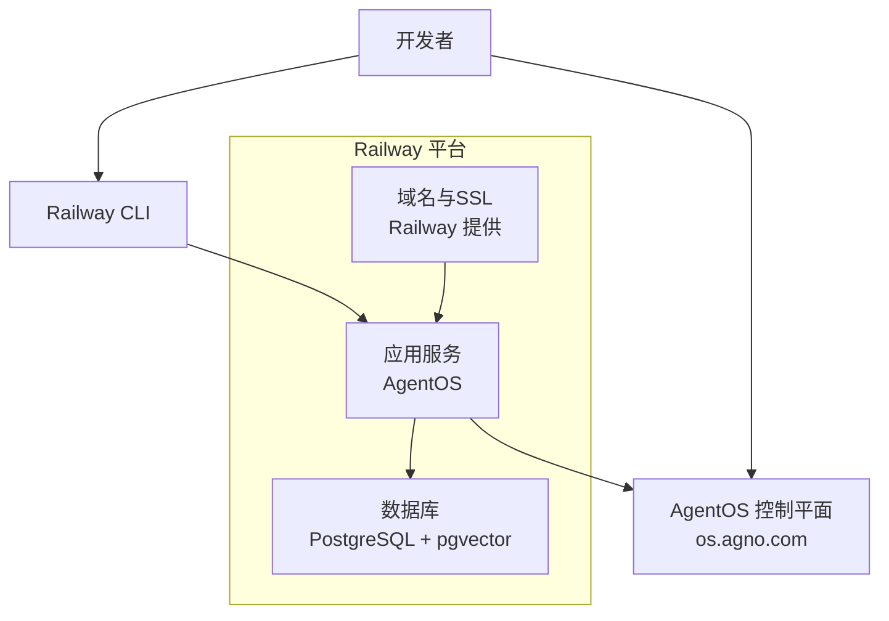
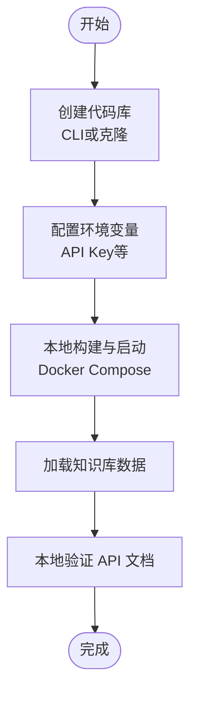
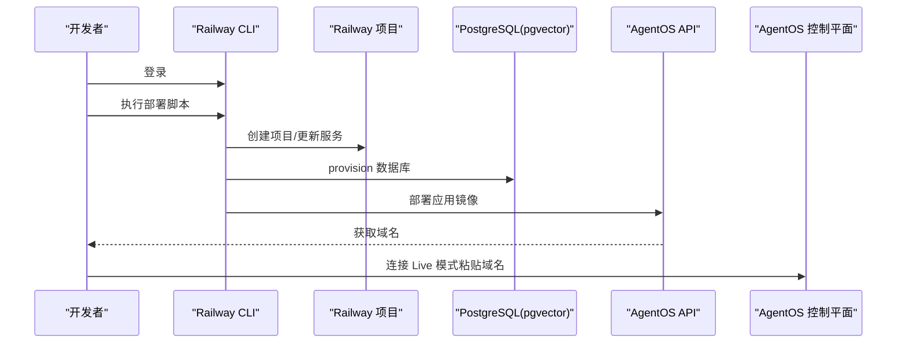
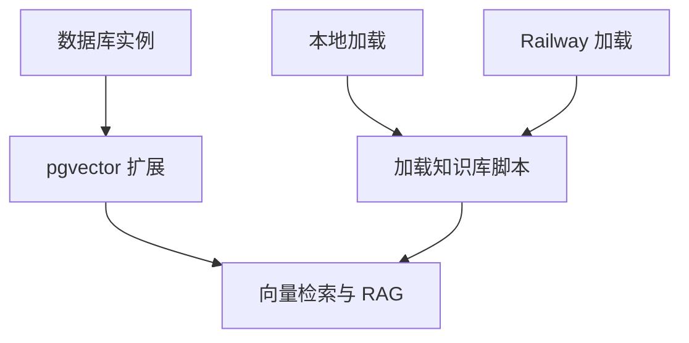
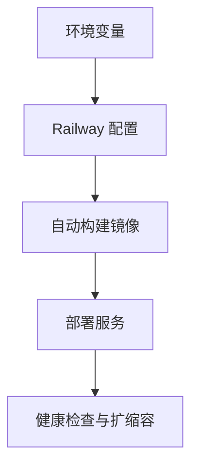
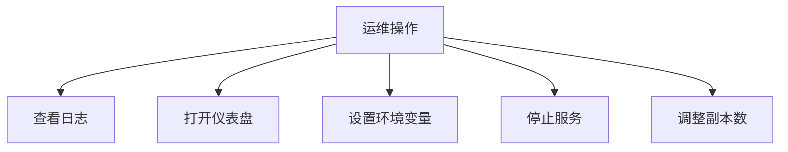
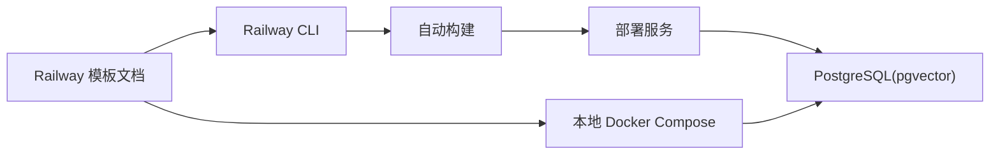

# Railway 模板

<cite>
**本文引用的文件**
- [deploy/templates/railway/deploy.mdx](file://deploy/templates/railway/deploy.mdx)
- [deploy/templates/railway/reference.mdx](file://deploy/templates/railway/reference.mdx)
- [production/templates/railway.mdx](file://production/templates/railway.mdx)
- [first-multi-agent-system.mdx](file://first-multi-agent-system.mdx)
- [_snippets/run-agent-infra-railway-local.mdx](file://_snippets/run-agent-infra-railway-local.mdx)
- [_snippets/run-agent-infra-railway-prd.mdx](file://_snippets/run-agent-infra-railway-prd.mdx)
- [TBD/pages/templates/agent-infra-railway/introduction.mdx](file://TBD/pages/templates/agent-infra-railway/introduction.mdx)
- [TBD/pages/templates/agent-infra-railway/run-local.mdx](file://TBD/pages/templates/agent-infra-railway/run-local.mdx)
- [TBD/pages/templates/agent-infra-railway/run-prd.mdx](file://TBD/pages/templates/agent-infra-railway/run-prd.mdx)
- [deploy/introduction.mdx](file://deploy/introduction.mdx)
- [production/templates/overview.mdx](file://production/templates/overview.mdx)
- [TBD/pages/deploy/overview.mdx](file://TBD/pages/deploy/overview.mdx)
</cite>

## 目录
1. [简介](#简介)
2. [项目结构](#项目结构)
3. [核心组件](#核心组件)
4. [架构总览](#架构总览)
5. [详细组件分析](#详细组件分析)
6. [依赖关系分析](#依赖关系分析)
7. [性能考量](#性能考量)
8. [故障排查指南](#故障排查指南)
9. [结论](#结论)
10. [附录](#附录)

## 简介
Railway 模板为 AgentOS 提供“零基础设施”快速上线方案：在 Railway 上一键部署 AgentOS 与 PostgreSQL（含 pgvector），自动获得公开 HTTPS 域名与 SSL 证书，支持本地开发验证后直接进入生产。模板覆盖从项目初始化、环境变量配置、数据库与知识库加载，到自动化部署与运维管理的完整流程，并提供扩展自定义代理、工具与接口的路径。

## 项目结构
Railway 模板相关文档分布在多个位置，主要由三类内容组成：
- 快速部署与操作指南：包含 Railway 部署步骤、命令与运维建议
- 环境变量与本地开发：本地运行、环境变量表与常见问题
- 模板介绍与对比：Railway 与其他平台模板的差异与选择依据

```mermaid
graph TB
A["Railway 模板文档集合"] --> B["部署指南<br/>deploy/templates/railway/deploy.mdx"]
A --> C["参考与运维<br/>deploy/templates/railway/reference.mdx"]
A --> D["Railway 快速上手<br/>production/templates/railway.mdx"]
A --> E["首次多智能体系统教程<br/>first-multi-agent-system.mdx"]
A --> F["本地运行片段<br/>_snippets/run-agent-infra-railway-local.mdx"]
A --> G["生产部署片段<br/>_snippets/run-agent-infra-railway-prd.mdx"]
A --> H["模板介绍页<br/>TBD/pages/templates/agent-infra-railway/introduction.mdx"]
A --> I["本地运行页<br/>TBD/pages/templates/agent-infra-railway/run-local.mdx"]
A --> J["生产运行页<br/>TBD/pages/templates/agent-infra-railway/run-prd.mdx"]
A --> K["部署总览与对比<br/>deploy/introduction.mdx"]
A --> L["模板总览与对比<br/>production/templates/overview.mdx"]
A --> M["部署概览含Railway定位<br/>TBD/pages/deploy/overview.mdx"]
```

图表来源
- [deploy/templates/railway/deploy.mdx:1-152](file://deploy/templates/railway/deploy.mdx#L1-L152)
- [deploy/templates/railway/reference.mdx:1-164](file://deploy/templates/railway/reference.mdx#L1-L164)
- [production/templates/railway.mdx:1-182](file://production/templates/railway.mdx#L1-L182)
- [first-multi-agent-system.mdx:1-140](file://first-multi-agent-system.mdx#L1-L140)
- [_snippets/run-agent-infra-railway-local.mdx:1-34](file://_snippets/run-agent-infra-railway-local.mdx#L1-L34)
- [_snippets/run-agent-infra-railway-prd.mdx:1-71](file://_snippets/run-agent-infra-railway-prd.mdx#L1-L71)
- [TBD/pages/templates/agent-infra-railway/introduction.mdx:1-40](file://TBD/pages/templates/agent-infra-railway/introduction.mdx#L1-L40)
- [TBD/pages/templates/agent-infra-railway/run-local.mdx:1-10](file://TBD/pages/templates/agent-infra-railway/run-local.mdx#L1-L10)
- [TBD/pages/templates/agent-infra-railway/run-prd.mdx:1-10](file://TBD/pages/templates/agent-infra-railway/run-prd.mdx#L1-L10)
- [deploy/introduction.mdx:1-33](file://deploy/introduction.mdx#L1-L33)
- [production/templates/overview.mdx:1-28](file://production/templates/overview.mdx#L1-L28)
- [TBD/pages/deploy/overview.mdx:106-114](file://TBD/pages/deploy/overview.mdx#L106-L114)

章节来源
- [deploy/templates/railway/deploy.mdx:1-152](file://deploy/templates/railway/deploy.mdx#L1-L152)
- [deploy/templates/railway/reference.mdx:1-164](file://deploy/templates/railway/reference.mdx#L1-L164)
- [production/templates/railway.mdx:1-182](file://production/templates/railway.mdx#L1-L182)
- [first-multi-agent-system.mdx:1-140](file://first-multi-agent-system.mdx#L1-L140)
- [_snippets/run-agent-infra-railway-local.mdx:1-34](file://_snippets/run-agent-infra-railway-local.mdx#L1-L34)
- [_snippets/run-agent-infra-railway-prd.mdx:1-71](file://_snippets/run-agent-infra-railway-prd.mdx#L1-L71)
- [TBD/pages/templates/agent-infra-railway/introduction.mdx:1-40](file://TBD/pages/templates/agent-infra-railway/introduction.mdx#L1-L40)
- [TBD/pages/templates/agent-infra-railway/run-local.mdx:1-10](file://TBD/pages/templates/agent-infra-railway/run-local.mdx#L1-L10)
- [TBD/pages/templates/agent-infra-railway/run-prd.mdx:1-10](file://TBD/pages/templates/agent-infra-railway/run-prd.mdx#L1-L10)
- [deploy/introduction.mdx:1-33](file://deploy/introduction.mdx#L1-L33)
- [production/templates/overview.mdx:1-28](file://production/templates/overview.mdx#L1-L28)
- [TBD/pages/deploy/overview.mdx:106-114](file://TBD/pages/deploy/overview.mdx#L106-L114)

## 核心组件
- 应用服务（AgentOS）
  - 使用 Dockerfile 构建镜像并部署于 Railway
  - 默认监听端口与运行环境通过环境变量控制
- 数据库（PostgreSQL + pgvector）
  - Railway 自动提供 PostgreSQL 实例并启用 pgvector 扩展
  - 支持本地与生产环境的数据库连接参数
- 控制平面（AgentOS Control Plane）
  - 通过 Railway 公共域名访问 API 文档与控制界面
- 部署与运维
  - 使用 Railway CLI 进行登录、部署、日志查看与资源管理
  - 支持设置环境变量、停止服务、扩容副本数等

章节来源
- [production/templates/railway.mdx:9-11](file://production/templates/railway.mdx#L9-L11)
- [production/templates/railway.mdx:150-160](file://production/templates/railway.mdx#L150-L160)
- [deploy/templates/railway/reference.mdx:136-148](file://deploy/templates/railway/reference.mdx#L136-L148)
- [TBD/pages/deploy/overview.mdx:106-114](file://TBD/pages/deploy/overview.mdx#L106-L114)

## 架构总览
Railway 模板采用“容器化应用 + 托管数据库”的无服务器式架构，Railway 负责：
- 构建与发布容器镜像
- 管理环境变量与网络
- 提供公共 HTTPS 域名与 SSL 证书
- 自动扩缩容与健康检查（由 Railway 平台提供）

图表来源
- [production/templates/railway.mdx:9-11](file://production/templates/railway.mdx#L9-L11)
- [TBD/pages/deploy/overview.mdx:106-114](file://TBD/pages/deploy/overview.mdx#L106-L114)

## 详细组件分析

### 组件一：项目初始化与本地开发
- 初始化步骤
  - 使用模板创建代码库（支持 CLI 或克隆仓库）
  - 安装依赖并准备环境变量（如 OpenAI API Key）
- 本地运行
  - 使用 Docker Compose 启动应用与数据库
  - 加载知识库数据以验证 RAG 功能
  - 在本地控制平面连接应用

图表来源
- [production/templates/railway.mdx:44-68](file://production/templates/railway.mdx#L44-L68)
- [deploy/templates/railway/deploy.mdx:18-74](file://deploy/templates/railway/deploy.mdx#L18-L74)
- [_snippets/run-agent-infra-railway-local.mdx:1-34](file://_snippets/run-agent-infra-railway-local.mdx#L1-L34)

章节来源
- [production/templates/railway.mdx:44-68](file://production/templates/railway.mdx#L44-L68)
- [deploy/templates/railway/deploy.mdx:18-74](file://deploy/templates/railway/deploy.mdx#L18-L74)
- [_snippets/run-agent-infra-railway-local.mdx:1-34](file://_snippets/run-agent-infra-railway-local.mdx#L1-L34)

### 组件二：生产部署与自动化
- 登录与部署
  - 使用 Railway CLI 登录
  - 执行部署脚本，自动创建项目、 provision 数据库并部署应用
- 域名与控制平面
  - 获取 Railway 分配的公共域名
  - 在控制平面中连接 Live 模式，输入 Railway 域名

图表来源
- [production/templates/railway.mdx:78-121](file://production/templates/railway.mdx#L78-L121)
- [first-multi-agent-system.mdx:88-115](file://first-multi-agent-system.mdx#L88-L115)
- [_snippets/run-agent-infra-railway-prd.mdx:1-71](file://_snippets/run-agent-infra-railway-prd.mdx#L1-L71)

章节来源
- [production/templates/railway.mdx:78-121](file://production/templates/railway.mdx#L78-L121)
- [first-multi-agent-system.mdx:88-115](file://first-multi-agent-system.mdx#L88-L115)
- [_snippets/run-agent-infra-railway-prd.mdx:1-71](file://_snippets/run-agent-infra-railway-prd.mdx#L1-L71)

### 组件三：数据库集成与知识库加载
- 数据库
  - Railway 提供 PostgreSQL 实例并启用 pgvector 扩展
  - 本地与生产环境的连接参数可分别配置
- 知识库加载
  - 通过命令在本地或生产环境加载默认文档
  - 支持后续添加自有文档

图表来源
- [production/templates/railway.mdx:9-11](file://production/templates/railway.mdx#L9-L11)
- [deploy/templates/railway/reference.mdx:70-88](file://deploy/templates/railway/reference.mdx#L70-L88)
- [deploy/templates/railway/deploy.mdx:50-56](file://deploy/templates/railway/deploy.mdx#L50-L56)

章节来源
- [production/templates/railway.mdx:9-11](file://production/templates/railway.mdx#L9-L11)
- [deploy/templates/railway/reference.mdx:70-88](file://deploy/templates/railway/reference.mdx#L70-L88)
- [deploy/templates/railway/deploy.mdx:50-56](file://deploy/templates/railway/deploy.mdx#L50-L56)

### 组件四：环境变量管理与构建脚本
- 环境变量
  - 关键变量包括模型 API Key、数据库连接参数、运行时环境等
  - 可通过 Railway CLI 设置或在模板中预设
- 构建与部署触发
  - Railway 基于 Dockerfile 自动构建镜像
  - 部署脚本统一触发项目创建、数据库 provision 与应用部署

图表来源
- [deploy/templates/railway/reference.mdx:136-148](file://deploy/templates/railway/reference.mdx#L136-L148)
- [production/templates/railway.mdx:150-160](file://production/templates/railway.mdx#L150-L160)
- [TBD/pages/deploy/overview.mdx:106-114](file://TBD/pages/deploy/overview.mdx#L106-L114)

章节来源
- [deploy/templates/railway/reference.mdx:136-148](file://deploy/templates/railway/reference.mdx#L136-L148)
- [production/templates/railway.mdx:150-160](file://production/templates/railway.mdx#L150-L160)
- [TBD/pages/deploy/overview.mdx:106-114](file://TBD/pages/deploy/overview.mdx#L106-L114)

### 组件五：Railway 特性与运维
- 域名与 SSL
  - Railway 自动生成公共 HTTPS 域名与 SSL 证书
- 扩容与弹性
  - 可通过编辑配置调整副本数实现水平扩展
- 运维命令
  - 查看日志、打开仪表盘、设置环境变量、停止服务等

图表来源
- [deploy/templates/railway/reference.mdx:9-18](file://deploy/templates/railway/reference.mdx#L9-L18)
- [production/templates/railway.mdx:150-160](file://production/templates/railway.mdx#L150-L160)

章节来源
- [deploy/templates/railway/reference.mdx:9-18](file://deploy/templates/railway/reference.mdx#L9-L18)
- [production/templates/railway.mdx:150-160](file://production/templates/railway.mdx#L150-L160)

## 依赖关系分析
- 模板与平台
  - Railway 模板依赖 Railway 平台提供的容器构建、托管数据库与域名/SSL 能力
- 本地与生产的耦合点
  - 本地 Docker Compose 与 Railway 部署共享相同的环境变量与数据库配置
- 文档与脚本
  - 部分步骤通过 Railway CLI 与部署脚本串联，形成“一键部署”体验

图表来源
- [production/templates/railway.mdx:78-121](file://production/templates/railway.mdx#L78-L121)
- [TBD/pages/deploy/overview.mdx:106-114](file://TBD/pages/deploy/overview.mdx#L106-L114)

章节来源
- [production/templates/railway.mdx:78-121](file://production/templates/railway.mdx#L78-L121)
- [TBD/pages/deploy/overview.mdx:106-114](file://TBD/pages/deploy/overview.mdx#L106-L114)

## 性能考量
- 启动时间
  - 数据库初始化需要一定时间，首次部署可能需要等待片刻
- 扩容策略
  - 通过增加副本数提升并发处理能力
- 网络与域名
  - Railway 提供的公共域名与 SSL 有助于减少前端跨域与证书配置成本

## 故障排查指南
- 常见问题与解决
  - Railway CLI 未安装：根据操作系统安装 Railway CLI
  - 首次部署失败：先执行初始化，再重新运行部署脚本
  - 数据库超时：等待数据库启动完成，查看对应服务日志
  - 502 错误：容器仍在启动中，请稍候并查看应用日志

章节来源
- [deploy/templates/railway/reference.mdx:149-164](file://deploy/templates/railway/reference.mdx#L149-L164)
- [production/templates/railway.mdx:163-182](file://production/templates/railway.mdx#L163-L182)
- [first-multi-agent-system.mdx:117-123](file://first-multi-agent-system.mdx#L117-L123)

## 结论
Railway 模板将 AgentOS 的部署门槛降至最低：无需自行维护服务器与数据库，即可在几分钟内完成从本地验证到生产上线的全流程。结合 Railway 的自动扩缩容、公共 HTTPS 域名与 SSL 证书，用户可以专注于业务逻辑与应用扩展，快速实现从原型到生产的跨越。

## 附录
- 快速链接
  - 模板总览与对比：[模板总览:1-28](file://production/templates/overview.mdx#L1-L28)、[部署总览:1-33](file://deploy/introduction.mdx#L1-L33)
  - 模板介绍页：[Railway 模板介绍:106-114](file://TBD/pages/deploy/overview.mdx#L106-L114)
  - 本地运行与生产运行片段：[本地运行:1-34](file://_snippets/run-agent-infra-railway-local.mdx#L1-L34)、[生产运行:1-71](file://_snippets/run-agent-infra-railway-prd.mdx#L1-L71)