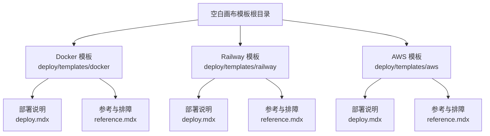
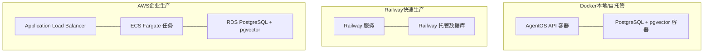
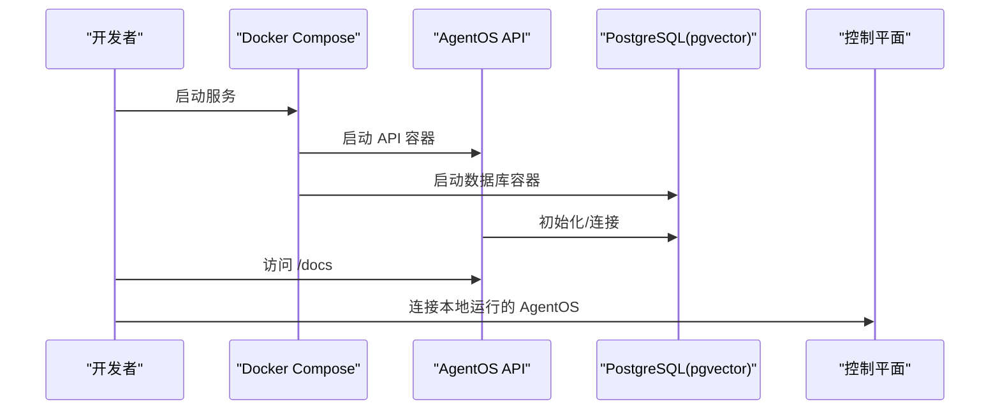
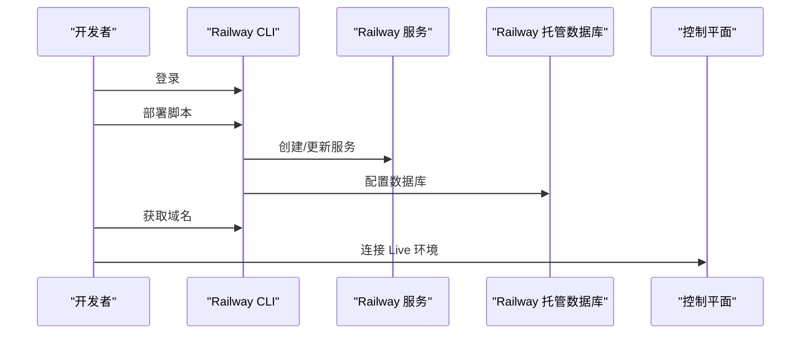
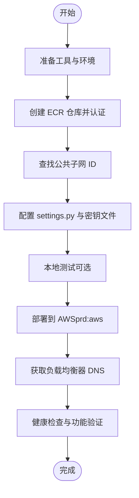
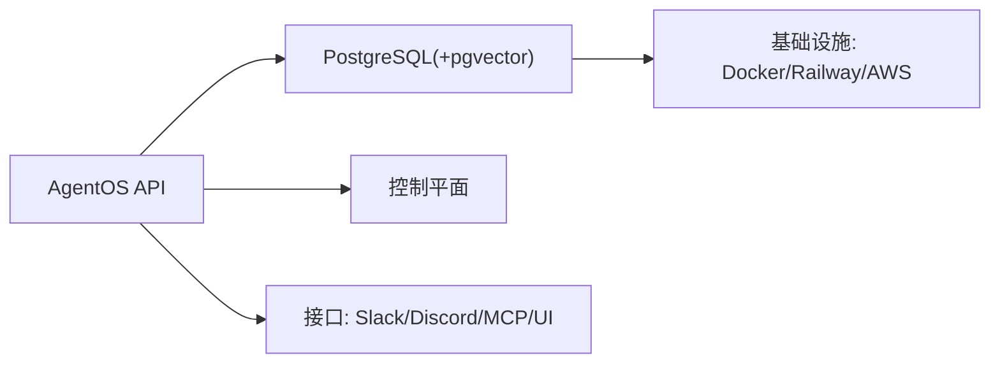

# 空白画布模板

<cite>
**本文引用的文件**
- [deploy/templates.mdx](file://deploy/templates.mdx)
- [deploy/introduction.mdx](file://deploy/introduction.mdx)
- [deploy/templates/docker/deploy.mdx](file://deploy/templates/docker/deploy.mdx)
- [deploy/templates/docker/reference.mdx](file://deploy/templates/docker/reference.mdx)
- [deploy/templates/railway/deploy.mdx](file://deploy/templates/railway/deploy.mdx)
- [deploy/templates/railway/reference.mdx](file://deploy/templates/railway/reference.mdx)
- [deploy/templates/aws/deploy.mdx](file://deploy/templates/aws/deploy.mdx)
- [deploy/templates/aws/reference.mdx](file://deploy/templates/aws/reference.mdx)
- [TBD/pages/deploy/overview.mdx](file://TBD/pages/deploy/overview.mdx)
</cite>

## 目录
1. [简介](#简介)
2. [项目结构](#项目结构)
3. [核心组件](#核心组件)
4. [架构总览](#架构总览)
5. [详细组件分析](#详细组件分析)
6. [依赖关系分析](#依赖关系分析)
7. [性能考量](#性能考量)
8. [故障排除指南](#故障排除指南)
9. [结论](#结论)
10. [附录](#附录)

## 简介
空白画布模板是面向生产部署的“干净安装”型代码基，围绕 AgentOS、PostgreSQL（含 pgvector 向量扩展）与目标平台的部署脚本构建。它提供三种基础部署路径：Docker（本地开发/自托管）、Railway（快速上生产）、AWS（企业级生产）。模板强调“从空白画布开始”，便于按需添加应用（代理、团队、工作流）与接口（Slack、Discord、MCP、自定义 UI），并支持在任意支持容器的云平台上部署。

- 设计理念：最小化样板，最大化可扩展性；先模板后应用，再接口暴露。
- 使用场景：
  - Docker：本地开发、测试、自托管。
  - Railway：快速生产、MVP 上线。
  - AWS：规模化生产、企业级可靠性与合规控制。

**章节来源**
- [deploy/templates.mdx:10-24](file://deploy/templates.mdx#L10-L24)
- [deploy/introduction.mdx:7-101](file://deploy/introduction.mdx#L7-L101)

## 项目结构
空白画布模板以“模板目录”组织，每个平台一个子目录，包含部署说明与参考文档。总体结构如下：

**图表来源**
- [deploy/templates.mdx:14-24](file://deploy/templates.mdx#L14-L24)
- [deploy/templates/docker/deploy.mdx:1-112](file://deploy/templates/docker/deploy.mdx#L1-L112)
- [deploy/templates/railway/deploy.mdx:1-152](file://deploy/templates/railway/deploy.mdx#L1-L152)
- [deploy/templates/aws/deploy.mdx:1-370](file://deploy/templates/aws/deploy.mdx#L1-L370)

**章节来源**
- [deploy/templates.mdx:6-24](file://deploy/templates.mdx#L6-L24)
- [deploy/introduction.mdx:11-48](file://deploy/introduction.mdx#L11-L48)

## 核心组件
- AgentOS 运行时：提供代理、团队、工作流的运行与管理能力。
- 数据库层：PostgreSQL + pgvector，用于向量检索与知识管理。
- 部署层：Docker Compose（本地/自托管）、Railway 平台服务、AWS 基础设施（ECS Fargate、RDS、ALB）。
- 应用与接口：可在模板基础上添加具体应用与对外接口。

**章节来源**
- [deploy/templates.mdx:6-8](file://deploy/templates.mdx#L6-L8)
- [deploy/templates/docker/deploy.mdx:7](file://deploy/templates/docker/deploy.mdx#L7)
- [deploy/templates/railway/deploy.mdx:7](file://deploy/templates/railway/deploy.mdx#L7)
- [deploy/templates/aws/deploy.mdx:18](file://deploy/templates/aws/deploy.mdx#L18)

## 架构总览
三种模板的总体架构与资源分布如下：

**图表来源**
- [deploy/templates/docker/deploy.mdx:7](file://deploy/templates/docker/deploy.mdx#L7)
- [deploy/templates/railway/deploy.mdx:7](file://deploy/templates/railway/deploy.mdx#L7)
- [deploy/templates/aws/deploy.mdx:18](file://deploy/templates/aws/deploy.mdx#L18)

## 详细组件分析

### Docker 模板
- 设计要点
  - 本地开发优先：支持热重载、示例代理、连接到控制平面。
  - 可移植性强：可在任何支持 Docker 的平台部署。
- 部署流程
  - 克隆模板 → 设置 API 密钥 → 启动容器 → 加载知识库 → 访问 API 文档 → 控制平面连接。
- 配置要求
  - Docker Desktop、OpenAI API Key。
  - 环境变量：OPENAI_API_KEY、DB_*（主机、端口、用户、密码、数据库名）、RUNTIME_ENV。
- 最佳实践
  - 开发阶段使用本地数据库容器；生产前确保启用 pgvector。
  - 使用 .env 复制与编辑，避免硬编码密钥。
- 性能与成本
  - 本地资源受限，适合迭代与测试。
- 扩展能力
  - 支持添加新代理、工具、依赖；通过 pyproject.toml 与生成脚本管理依赖。
- 故障排除
  - 端口占用：修改 compose 映射端口。
  - 数据库未就绪：等待或检查容器状态。
  - 容器反复重启：检查 .env 中密钥与数据库可用性。

**图表来源**
- [deploy/templates/docker/deploy.mdx:14-87](file://deploy/templates/docker/deploy.mdx#L14-L87)

**章节来源**
- [deploy/templates/docker/deploy.mdx:9-112](file://deploy/templates/docker/deploy.mdx#L9-L112)
- [deploy/templates/docker/reference.mdx:131-156](file://deploy/templates/docker/reference.mdx#L131-L156)

### Railway 模板
- 设计要点
  - 快速上生产：自动 HTTPS、公共域名、一键部署脚本。
  - 与 Docker 一致的本地开发体验。
- 部署流程
  - 本地验证 → 登录 Railway → 脚本部署 → 加载知识库 → 获取域名 → 控制平面连接。
- 配置要求
  - Railway CLI、账户；环境变量同 Docker。
- 最佳实践
  - 使用 Railway 的环境变量管理与日志查看功能。
  - 初次部署后立即加载知识库，验证 API。
- 性能与成本
  - 快速弹性，适合 MVP 与早期生产。
- 扩展能力
  - 支持多副本（Scale replicas）与服务停止/重启。
- 故障排除
  - CLI 未找到：安装 Railway CLI。
  - 部署失败：先初始化项目再部署。
  - 数据库超时：等待数据库启动完成。
  - 502：容器仍在启动中，稍后再试。

**图表来源**
- [deploy/templates/railway/deploy.mdx:86-141](file://deploy/templates/railway/deploy.mdx#L86-L141)

**章节来源**
- [deploy/templates/railway/deploy.mdx:9-152](file://deploy/templates/railway/deploy.mdx#L9-L152)
- [deploy/templates/railway/reference.mdx:136-164](file://deploy/templates/railway/reference.mdx#L136-L164)

### AWS 模板
- 设计要点
  - 生产级基础设施：ECS Fargate、RDS、ALB、Secrets Manager。
  - 企业级安全与合规：安全组、凭据管理、跨可用区部署。
- 部署流程
  - 工具准备 → 创建虚拟环境 → 安装依赖 → 创建代码库 → 设置密钥 → AWS 准备（ECR、子网）→ 配置设置与密钥 → 本地测试 → 部署到 AWS → 获取端点 → 后续步骤。
- 配置要求
  - AWS CLI、账户权限；ECR 仓库、子网 ID、区域；生产密钥文件。
- 成本估算
  - ECS Fargate、RDS PostgreSQL、ALB、Secrets Manager 等资源的月度费用概览。
- 最佳实践
  - 使用 Secrets Manager 存储敏感信息；跨 AZ 选择公共子网；HTTPS 在部署后单独配置。
- 性能与扩展
  - Fargate 实例类型与 CPU/内存配额可调；RDS 可横向扩展与备份策略。
- 故障排除
  - ECR 认证过期：重新登录 ECR。
  - RDS 创建耗时：等待至 Available。
  - 找不到公共子网：检查路由表与 IGW。
  - 502/503：容器启动中或目标健康检查未通过。

**图表来源**
- [deploy/templates/aws/deploy.mdx:104-294](file://deploy/templates/aws/deploy.mdx#L104-L294)

**章节来源**
- [deploy/templates/aws/deploy.mdx:33-44](file://deploy/templates/aws/deploy.mdx#L33-L44)
- [deploy/templates/aws/deploy.mdx:48-99](file://deploy/templates/aws/deploy.mdx#L48-L99)
- [deploy/templates/aws/deploy.mdx:104-294](file://deploy/templates/aws/deploy.mdx#L104-L294)
- [deploy/templates/aws/reference.mdx:153-183](file://deploy/templates/aws/reference.mdx#L153-L183)

## 依赖关系分析
- 组件耦合
  - API 服务依赖数据库容器/实例；Railway/AWS 场景下数据库由平台/基础设施提供。
  - 模板间共享相同的 AgentOS 应用层，差异在于运行时与网络入口。
- 外部依赖
  - Docker（本地/自托管）、Railway 平台、AWS 服务（ECR、ECS、RDS、ALB、Secrets Manager）。
- 集成点
  - 控制平面连接：本地（http://localhost:8000）与 Live（Railway 域名）两种模式。
  - 接口扩展：Slack、Discord、MCP、自定义 UI 等。

**图表来源**
- [deploy/introduction.mdx:83-99](file://deploy/introduction.mdx#L83-L99)
- [deploy/templates/docker/deploy.mdx:65-82](file://deploy/templates/docker/deploy.mdx#L65-L82)
- [deploy/templates/railway/deploy.mdx:119-136](file://deploy/templates/railway/deploy.mdx#L119-L136)

**章节来源**
- [deploy/introduction.mdx:7-101](file://deploy/introduction.mdx#L7-L101)

## 性能考量
- Docker
  - 本地资源限制，适合迭代；容器内核态开销低，启动快。
- Railway
  - 自动扩缩容与冷启动时间；数据库延迟通常在 30 秒左右。
- AWS
  - Fargate 实例类型与 CPU/内存配额影响吞吐；RDS 可横向扩展与备份策略；ALB 提供高可用入口。

**章节来源**
- [deploy/templates/railway/reference.mdx:158-163](file://deploy/templates/railway/reference.mdx#L158-L163)
- [deploy/templates/aws/deploy.mdx:33-44](file://deploy/templates/aws/deploy.mdx#L33-L44)

## 故障排除指南
- Docker
  - 端口占用：修改 compose 端口映射。
  - 数据库未就绪：等待或检查容器状态。
  - 容器反复重启：检查 .env 中密钥与数据库可用性。
- Railway
  - CLI 未找到：安装 Railway CLI。
  - 部署失败：先初始化项目再部署。
  - 数据库超时：等待数据库启动完成。
  - 502：容器仍在启动中，稍后再试。
- AWS
  - ECR 认证过期：重新登录 ECR。
  - RDS 创建耗时：等待至 Available。
  - 找不到公共子网：检查路由表与 IGW。
  - 502/503：容器启动中或目标健康检查未通过。

**章节来源**
- [deploy/templates/docker/reference.mdx:143-156](file://deploy/templates/docker/reference.mdx#L143-L156)
- [deploy/templates/railway/reference.mdx:149-164](file://deploy/templates/railway/reference.mdx#L149-L164)
- [deploy/templates/aws/deploy.mdx:326-370](file://deploy/templates/aws/deploy.mdx#L326-L370)

## 结论
空白画布模板提供了三种成熟且互补的部署路径：Docker 适合本地与自托管、Railway 适合快速生产、AWS 适合企业级规模化生产。三者均以 AgentOS 为核心，结合 PostgreSQL + pgvector 的知识检索能力，并通过控制平面与接口扩展实现即插即用的应用交付。根据团队规模、预算与合规需求选择合适模板，可显著降低部署门槛并提升上线速度。

## 附录
- 模板对比（时间与适用场景）
  - Docker：本地开发、测试、自托管，约 5 分钟。
  - Railway：快速生产、MVP，约 10 分钟。
  - AWS：规模化生产、企业级，约 15 分钟。
- 云平台与托管平台
  - 任意支持 Docker 的平台均可部署；Railway 与 Render、Fly.io 等平台类似，提供“零配置”容器托管。

**章节来源**
- [deploy/templates.mdx:44-48](file://deploy/templates.mdx#L44-L48)
- [TBD/pages/deploy/overview.mdx:96-127](file://TBD/pages/deploy/overview.mdx#L96-L127)